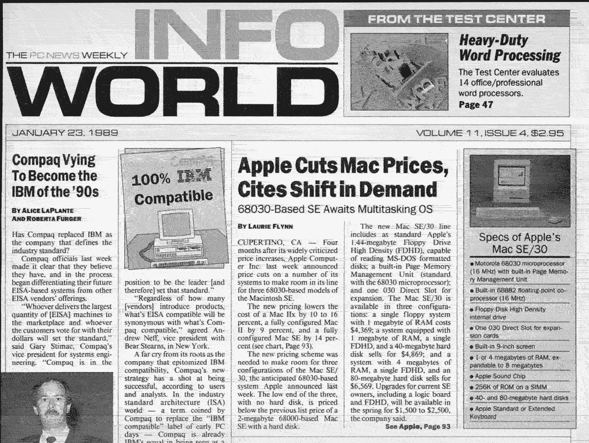

# MRR 的 3 万美元

> 原文：<https://justinjackson.ca/30k/?utm_source=wanqu.co&utm_campaign=Wanqu+Daily&utm_medium=website>

# 3 万美元

2018 年初，乔恩·布达(Jon Buda)和我成为了新播客托管平台 [Transistor.fm](https://transistor.fm/?via=justin) 的合作伙伴。

当我们[在 2018 年 8 月 1 日正式推出](https://www.producthunt.com/posts/transistor-fm)的时候，我们不知道会发生什么。我们认为可能需要 [60 个月](https://justinjackson.ca/bootstrap-reality/)才能达到每月 2 万美元的经常性收入。它最终在 11.5 个月内实现了这一目标。

当我写这篇文章时，我们在 MRR 的销量即将达到 3 万辆。

现在是停下来喘口气的好时机。整个旅程像旋风一样:来到这里感觉如何？

## 晶体管的故事到此为止

乔恩·布达和我是在 2014 年的 XOXO 音乐节上认识的。我们都对播客感兴趣:乔恩开发了一个早期的播客托管工具，而我有一个播客。那周我们经常在一起。在接下来的几年里，我们见过无数次面，甚至一起做过一些小项目。

快进到 2017 年。乔恩在为反人类组织工作。他们即将发布一个新的播客，他正在为他们制作一个工具(叫做[晶体管](https://transistor.fm/?via=justin))。我们开始讨论我们合作的想法，一起向公众推出它。

我们于 2018 年 2 月签署了合作文件。那个月，我们也获得了第一笔收入:330 万美元。

乔恩保住了他的全职工作，晚上和周末也工作。我把大部分精力都转到了晶体管上:做营销，邀请 beta 用户，写文档，做客户支持。

## 我们的增长速度有多快？

从我们成立之日起，有九个月的时间，MRR 平均每月增长 29%。这比我们预期的要快。

夏季增长放缓，但现在到了秋季，我们已经反弹。目前，MRR 正以每月 15%的速度增长。

### 收入增长的原因是什么？

Peldi 曾经这样描述 Balsamiq 的推出:

> "这就像用我的指甲抓住一艘火箭船."

当他宣布他的线框软件时，就好像成千上万的人一直在等待它。在他的[独立黑客访谈](https://www.indiehackers.com/podcast/085-peldi-guilizzoni-of-balsamiq)中他说:

> “在推出后大约 8 个月，我有了 3000 名客户。在 2008 年的前六个月，我赚了大约 165，000 美元。它基本上在我面前爆炸了。谈论产品与市场的契合度。真的是从一开始就把自己卖了。”

自 2008 年以来，我一直从事软件行业。在此之前，我在滑雪板行业工作了七年。我看过数百次产品发布会。根据我的观察，是什么原因导致一些产品的收入增长比其他产品快？

收入增长取决于有多少人想要你卖的东西，有多容易接触到他们，以及他们想花多少钱。这里最关键的因素是客户需求。

我知道这可能听起来很老套。毕竟，大多数人不明白这一点吗？

也许吧。感觉我们是以“常识”的方式去理解，但并不总是据此行动。

在我高中的最后一年，我和我的朋友在家乡举办了一场狂欢。当我们打开门时，数百名孩子排队，准备体验他们的第一次狂欢。他们听说过这些通宵舞会，但还没有去更大的城市体验过。对我们提供的东西有被压抑的需求；票卖完了。

接下来的一年，我和我的搭档一直在看 VHS 上的“年度之战”视频，我们决定举行一场盛大的霹雳舞比赛。我们只卖出了少数几张票，结果赔钱了。

有什么不同？客户需求。

就像 Balsamiq 的推出一样，我的狂欢是人们愿意排队购买的产品。但第二次，需求并不存在。

对于晶体管，实际上对于任何产品，只要有更多的人想从我们这里购买，我们就会继续增长。

 

在 80 年代和 90 年代的大部分时间里，数百万人想从康柏公司购买电脑。1996 年《财富》杂志的标题是:

> “在首席执行官埃克哈德·普发的领导下，康柏正在超越其他个人电脑制造商。未来如此光明，他不得不戴上墨镜。”

但是到了 2000 年代，个人电脑需求的放缓和来自戴尔的竞争导致康柏的增长停滞。惠普在 2002 年收购了他们。

## 3 万美元对我们来说意味着什么？

我意识到每月 3 万美元在“硅谷规模”中并不算什么见鬼，仅仅为旧金山的一名开发人员支付工资、就业税和福利，每月就能让你花费 3 万多美元。

但是，对于像我和乔恩这样的创业者来说，这是一件大事。在湾区之外，30k 给你很多里程。

对我们个人来说，这个新的里程碑意味着我们已经建立了一个能够支持我们基本需求的企业。从七月开始，我们都在全职研究晶体管。

每个月，我们都会留出大约 50%的收入用于支付工资。这个月，数学将是这样的:

我用晶体管赚的钱比过去少了，但收入的可预测性给了我巨大的平静。

自从 2014 年辞职做咨询(然后做产品)，收入一直不太稳定。有些月份，我会大发横财，而有些月份，我几乎什么也赚不到。

我陷入了一个不断循环的循环，不得不推出一些新的东西(或者找到另一个客户)；主要是因为我需要钱。有几个月，我疯狂地寻找新的创收方式。

> "贾斯汀，现在你是我见过的最放松的人了。"–考特兰·艾伦，[独立黑客](https://www.indiehackers.com/podcast/118-justin-jackson-of-transistor?startTime=3406.70&endTime=3600.00&btp=673cd396)

很长时间以来，我第一次感到平静。

## 尽情享受吧，孩子

杰森·科恩曾经告诉我，“如果你在经营一家公司，你应该享受其中的乐趣。”潜在的信息是:这很难。开始一个产品，发展它；都很难。

同样，Jason Fried 在[像样的播客](https://www.relay.fm/presentable/69)上有这样一条发人深省的信息:

> 这是人们没有充分谈论的另一件事:**生意越来越难做。不会变得更容易。你雇佣越来越多的人，应对越来越多的竞争。如果你成功了，就会有更多的人试图打倒你。有时候，企业家认为事情会变得更容易，因为他们会获得更多的收入，更成功，但这给你带来了不同的压力。*生意很难做，而且只会变得更难。***

所以现在，我要心存感激。

即使明天这一切都泡汤了，我也会心存感激，因为我从一开始就很享受这段旅程。

我将能够回顾这一刻，并认为:“与乔恩一起制造晶体管，并帮助所有这些客户将他们的音频传播到世界上，这是值得的。”

在这里，做我喜欢的工作，和我尊敬的人在一起，为我喜欢的顾客服务，*和*以此谋生；这是一个难以置信的机会。对此我心存感激。

干杯，
贾斯廷·杰克逊
T2】@ mijustin

PS:需要一个地方来存放你的播客吗？[我们希望您成为我们的客户](https://transistor.fm/?via=justin)。

### 获取我的时事通讯

谢谢！你现在每周都会收到我的简讯。有问题吗？给我发邮件:justin@megamaker.co

啊啊啊！看起来你已经在我的邮件列表上了！

你看过我关于建设 SaaS 的播客吗？

发布于 2019 年 10 月 4 日