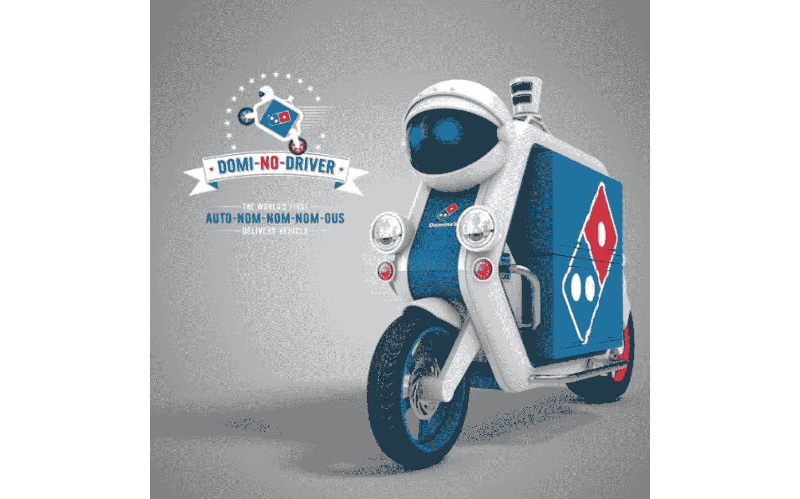
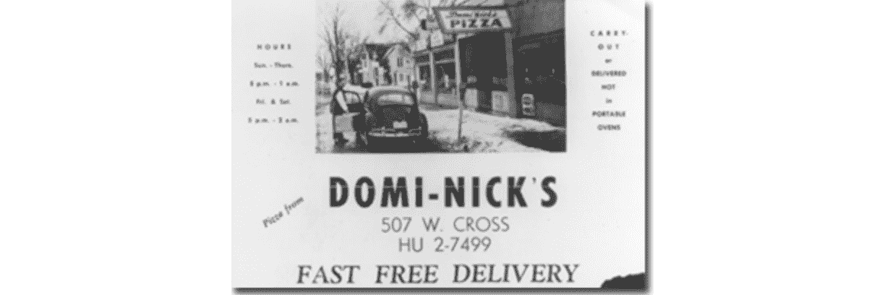
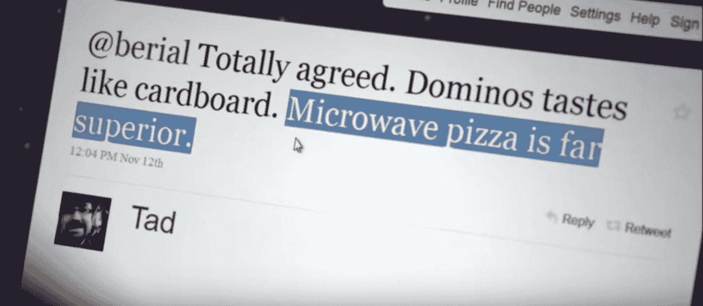
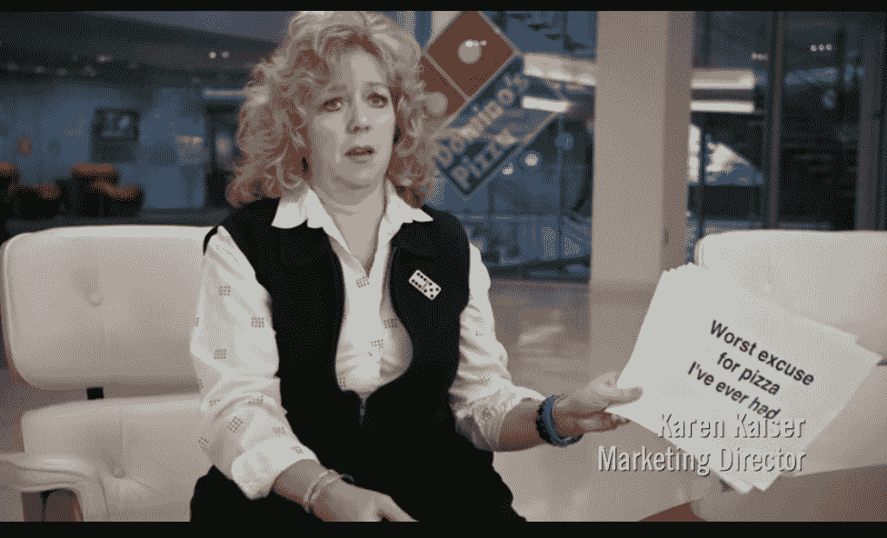
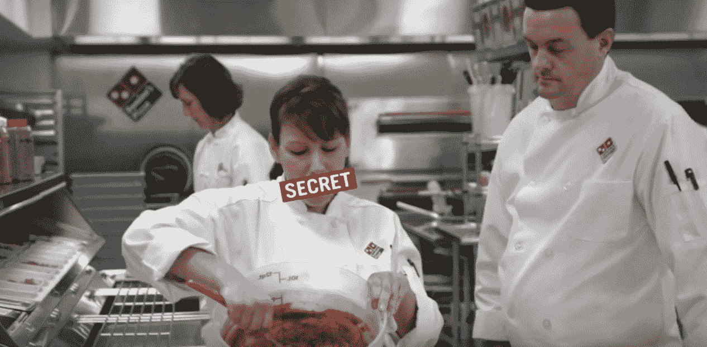
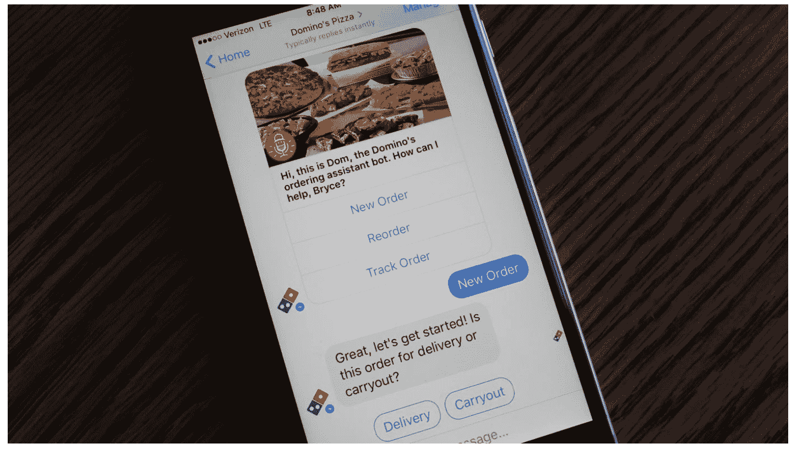
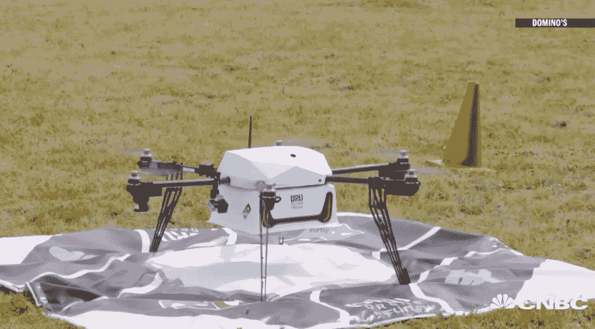
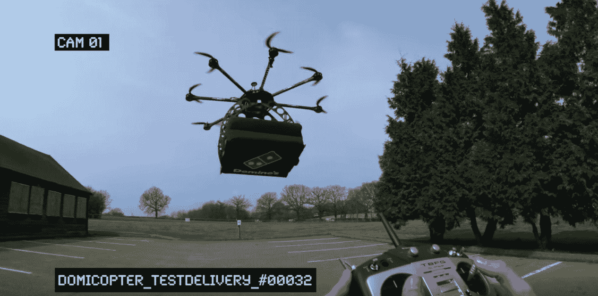

# 达美乐比萨如何像一家科技创业公司一样推动股票价值增长 90 倍|产品习惯

> 原文：<https://producthabits.com/dominos-pizza-drove-90x-increase-stock-value-acting-like-tech-startup/?utm_source=wanqu.co&utm_campaign=Wanqu+Daily&utm_medium=website>

# 达美乐比萨如何像一家科技创业公司一样推动股票价值增长 90 倍

创业公司可以从世界上最大的披萨连锁店的成长中学到一些关于产品和营销的最有价值的经验。

达美乐比萨的故事是一个英雄的旅程。这是一个重塑的故事。达美乐对公司进行了 180 度的彻底改革，通过坦诚面对自己的弱点，将批评者变成了超级粉丝。他们冒了巨大而可怕的风险，彻底废弃并重新打造了他们的核心产品:披萨。

<iframe src="https://www.youtube.com/embed/AH5R56jILag" frameborder="0" allowfullscreen="allowfullscreen">视频</iframe>

与此同时，该公司已经洞察到他们对客户的真正价值在哪里。他们知道顾客喜欢它们是因为它们方便——近年来，他们利用技术将定义其品牌核心的方便性和可靠性加倍。

这种自我意识和付诸行动的勇气得到了回报。现在他们的拳击水平远远超过了他们的体重级别。自 2010 年以来，达美乐的股票增长了 90 倍，从 2 美元涨到了 180 美元。这些增长率让脸书、谷歌、亚马逊和苹果相形见绌。

他们还在社交媒体上看到了大量由顾客转变为品牌倡导者的参与和反馈。

达美乐比萨从一家在非常传统的行业中表现不佳、核心产品很差的公司，变成了一个鼓舞人心的、业内独一无二的完美品牌认知、产品开发和营销的典范。

有趣的是，他们通过像初创公司一样思考实现了这一目标。让我们仔细看看如何做到:

*   达美乐比萨在早期发展了他们的公司和品牌，巩固了他们快捷、便宜、方便的比萨外卖的声誉。
*   达美乐听取了顾客的反馈，并采取了相应的行动，为了回应对糟糕口味的批评，达美乐完全重建了他们的披萨食谱。
*   达美乐继续重新设想订购比萨饼的方式，并利用所有可用的技术加倍提高订购和送货的便利性。

在你继续阅读的时候，去点一份比萨饼吧——它很快就会送到。

## 1960-2007:便利作为一个品牌

在苹果发布其品牌定义 iPhone 的 50 年前，在 Salesforce 将软件带到云端的 40 年前，在蒂姆·伯纳斯·李发明万维网的 30 年前，两兄弟创办了一家披萨公司，该公司后来成为商业和技术领域的创新者，也是美国最受欢迎的品牌之一。

这位曲折的英雄的旅程从不断增长的特权到公众的尴尬，再到最终成为选股人的最爱，开始于我们今天在商业中使用的一些相同的最佳实践。达美乐为长寿打下了坚实的基础，因为他们了解自己的核心价值，知道自己的市场需要什么。

现在，差不多 60 年过去了，他们仍在以疯狂的速度增长。他们的创新速度让其他食品品牌，甚至科技公司自惭形秽。

2017 年，达美乐开始测试自动驾驶送货车。[【来源】](http://beautiful-lands.com/posts/domi-no-driver-the-worlds-first-driverless-pizza-delivery-vehicle.#.WtSuZNPwagx)

尽管他们的送货保证、营销活动，甚至比萨饼本身都经历了彻底的变化，但他们的大部分核心原则是相同的。

当汤姆和吉姆·莫纳汉在 1960 年接管了一家旧比萨饼店，并开始发展自己的比萨饼业务时，他们从基本的商业剧本中走了出来。汤姆和吉姆做了大量关于比萨饼行业和竞争对手的研究。在特许经营和扩大规模的过程中，他们仔细考虑了幕后的运作。他们带着比萨饼这一产品进入市场，并开始通过增加奶酪面包和 Cinna Stix 等新产品扩展到比萨饼生态系统。

但最重要的是，他们非常有自知之明，会围绕他们知道对他们的市场最重要的东西来打造他们的品牌和信息。创始团队明白达美乐不仅仅是一家披萨公司——它还是一家披萨外卖公司。便利性和可靠性对订购比萨饼的人来说总是很重要的，这些是达美乐很快认识到的核心价值，并在他们早期的信息传递和品牌营销中加倍努力。

有了这些坚实的实践，达美乐比萨帝国的增长是迅猛的。以下是这些早期是如何展开的，以及达美乐是如何在第一个 50 年建立便利品牌的。

1960 年:在打了几年零工并努力攒钱上大学后，23 岁的汤姆·莫纳汉和他的哥哥吉姆一起搬回了家乡密歇根州的安阿伯市。两人听说当地的一家披萨店 DomiNick's 准备出售。汤姆从邮局信用合作社贷了 900 美元，[买下了密歇根州伊普西兰蒂的商店。两人都没有商业或比萨饼行业的背景，但兄弟俩很高兴能尝试经营和扩大当地业务。开业几个月后，吉姆想退出，卖掉了他的一半股份，只剩下汤姆一个人。](http://www.fundinguniverse.com/company-histories/domino-s-inc-history/)

**In the very first few years, Tom made some smart business decisions that allowed the business to grow strong even while it was small.**

例如，他强调快速送货，因为商店本身没有多少座位。在另一个明智的举措中，他削减了已经开始添加到菜单中的额外项目，因为他意识到专注于披萨在运营上更易于管理，并带来了更好的销量和收入。

[Profits grew](http://www.fundinguniverse.com/company-histories/domino-s-inc-history/)

从 99 美元一周涨到 750 美元一周。

1965-1967 年:汤姆·莫纳汉的披萨店以多米尼克的名义经营了几年。但是最初的所有者想要维护这个名字的权利，所以莫纳汉选择了“达美乐比萨”,在黄页上登了一则广告，并于 1965 年成立了公司。然后他开始特许经营。这在当时相当罕见，但莫纳汉决心扩大。特许经营的[条款](http://www.fundinguniverse.com/company-histories/domino-s-inc-history/)(达美乐将从销售中保留 2.5%的版税，2%用于广告，1%用于记账)显然是为了激励特许经营和扩张，而不是优化利润。莫纳汉[后来在他的自传](http://www.fundinguniverse.com/company-histories/domino-s-inc-history/)、**中说:“按照今天的标准，特许权使用费对特许经营者来说太优惠了。但这符合我们当时的目的，我并不关心未来所有的意外情况。”**

**1973 年:**快速交货和优质服务一直是莫纳汉的首要任务。他在披萨生意的头十年试图简化和改善递送，从披萨食谱中剔除配料以缩短烹饪时间，并设计瓦楞纸箱以在递送过程中保持披萨的热度。但是交货时间的最大改进来自特许经营。现在这家公司的特许经营发展得如此之快，以至于他们开办了一所披萨学院来培训那些想开特许经营店的人。这对公司的发展非常有利，因为它确保了品牌和运营的一致性。

通过扩展到更多的地区，达美乐比萨可以更有信心，商店将靠近顾客的家。

**This inspired Domino’s first delivery guarantee: “a half hour or a half dollar off.”**

这一口号获得了媒体的广泛关注，并帮助客户开始将品牌与快速便捷的交付联系起来。

1978 年:达美乐不仅在特许经营领域继续推动增长，在 20 世纪 70 年代末，他们还领导了与其他地区披萨公司的几次合并。这使得他们能够很快在更多的地理区域获得领土。例如，他们收购了比萨公司，并在堪萨斯州、亚利桑那州和内布拉斯加州获得了 23 家新店。

1979 年:达美乐继续快速收购和扩张，与穆勒的俄亥俄州披萨企业公司合并，并在俄亥俄州和德克萨斯州增加了 50 家门店。此时，他们已经在国际上发展到 287 家店铺，并宣布了国际扩张计划。**因为他们发展如此之快，他们不得不采取一些重大的运营措施来控制质量保证、培训、品牌和财务等方面的问题。**例如，莫纳汉聘请道格·道森(Doug Dawson)担任营销副总裁兼公司财务主管，约翰·麦克德维特(John McDevitt)担任财务顾问。他们帮助他创造了新的会计方法和系统来借钱给特许经营者。为了控制运营，Monaghan 还将全国范围内的业务划分为多个区域，由区域经理负责。[莫纳汉说](http://www.fundinguniverse.com/company-histories/domino-s-inc-history/)这个决定“给了我们长时间的沟通渠道，在工作端有严格的控制，这是我们快速但协调发展所需要的。”

同年，达美乐也开始了“30 分钟内免费”的送货保证。这是他们在竞争日益激烈的披萨市场巩固其市场地位的又一重大举措。他们想赢得客户的心，并在他们的大脑中开拓出一片空间，同时保证快速交货。这种营销策略对于赢得顾客非常有效，因为保证快速送货*或*免费披萨是双赢。另一方面，它并没有像他们预期的那样对品牌产生积极的影响。尽管顾客确实将达美乐与快速送货联系在一起，[他们也因鲁莽和无视公共安全而声名狼藉](https://www.snopes.com/fact-check/mush-vroom-pizza/)，因为政策鼓励送货司机超速行驶。

1985 年:《广告时代》写道，达美乐是“餐饮业中增长最快的赚钱者之一。”就在几年前，他们在加拿大温尼伯开设了第一家非美国商店，并开始了国际扩张。为了保持竞争力，他们需要以如此快的速度增长——此时，达美乐面临着来自必胜客的竞争，必胜客有 4000 台，而达美乐有 2300 台。作为回应，他们[将广告支出比上一年提高了 249%](http://www.fundinguniverse.com/company-histories/domino-s-inc-history/) 。他们引入了一个[新的广告活动](https://www.nytimes.com/1985/08/12/business/advertising-budget-is-doubled-by-domino-s-pizza.html)来强调便利和轻松:“一个电话搞定一切。”仅仅两年后，他们的全系统销售额达到 14.4 亿美元，拥有 3605 台。

<iframe loading="lazy" src="https://www.youtube.com/embed/l9mnpRVjfJQ" frameborder="0" allowfullscreen="allowfullscreen">视频</iframe>

**1993 年:** [在达美乐司机死亡 20 多人](http://www.fundinguniverse.com/company-histories/domino-s-inc-history/)后，达美乐结束了“30 分钟内免费”的送货保证。莫纳汉[在政策结束时的官方声明](http://www.fundinguniverse.com/company-histories/domino-s-inc-history/)“随着我们在送货上门方面的成功，公众对我们没有致力于安全的负面看法也随之而来。”便利和送货仍然是该公司品牌的核心，但具体的送货保证被取消了。

**1999:** 莫纳汉卸任董事长兼首席执行官大卫·a·布兰登接任。莫纳汉已经为公司打下了坚实的基础，但布兰登已经做好了继续扩张的准备，着眼于公司的底线。众所周知，他无情地关闭业绩不佳的商店，但也积极增加新的特许经营。**两年内，布兰登在增加了 [758 家新店。](http://www.fundinguniverse.com/company-histories/domino-s-inc-history/)**达美乐也开设了第 2000 家海外分店。布兰登是营销专家，在他的领导下，达美乐在近 40 年只提供一种比萨饼后，开始增加新产品。

2001 年:作为布兰登扩大和增加额外收入来源的努力的一部分，达美乐增加了两种新产品:奶酪面包和 Cinna Stix。比萨饼外卖的竞争仍然很激烈，提供额外的食品给了达美乐另一种获得优势的方式。顾客们肯定很欣赏这些新增功能。那一年，全系统销售额比上一年增长了 6.8%，达到 37.8 亿美元。

2003 年:达美乐不断推出菜单和披萨生态系统，推出达美乐圆点甜点和费城奶酪牛排披萨。费城奶酪牛排比萨饼是一个有针对性的努力，以连接另一个美国舒适的食物。[时任营销副总裁的肯·卡尔威尔说](https://www.businesswire.com/news/home/20030902005065/en/New-Twist-Cheese-Steak-Debate-Dominos-Dominos)“这是对达美乐披萨菜单的完美补充。”

2004 年:2004 年初，达美乐负债 9.432 亿美元。他们决定在作为一家私人公司 40 多年后举行首次公开募股，并计划用这笔钱来帮助偿还部分债务。对于竞争激烈的行业中的一家传统公司来说，这是一个奇怪的时机，交易价格反映了这一点——他们的 IPO 在 2410 万股股票上筹集了[3.374 亿美元](https://www.marketwatch.com/story/dominos-ipo-opens-flat-moves-lower)，低于预期价格范围。 [S & P 评论](https://www.marketwatch.com/story/dominos-ipo-opens-flat-moves-lower)公司的“弱现金流保护措施”根据标准普尔的说法，可取之处是该公司已确立的品牌和具有成本效益的操作系统。

2007 年:到 2007 年，达美乐仅在美国就创造了约 22 亿美元的收入，在全球创造了 54 亿美元的收入。但是竞争很激烈——达美乐和必胜客继续正面交锋，争夺[在全球更大的市场份额。为了领先一步，达美乐推出了在线订购，几个月后，又推出了移动订购。这是一件大事，因为达美乐是](http://archive.fortune.com/magazines/fortune/fortune_archive/2007/10/01/100398841/index.htm?postversion=2007092506)[披萨外卖行业](http://www.webrtcworld.com/news/2007/09/27/2971322.htm)第一家提供移动点餐的公司，这确实改变了人们对食品点餐和外卖的看法。人们可以从他们已经在使用的设备上完成这项工作，甚至不需要与他人交谈就可以下单。

现在，在线和移动订购是我们的默认设置。但是达美乐是业内第一家引入不用打电话就可以用手机点餐的公司。他们很快更进一步。他们用新功能使订购过程游戏化，比如虚拟比萨饼生成器，它使比萨饼配料在用户的屏幕上栩栩如生。他们还增加了另一层便利

[Pizza Tracker](https://hospitalitytech.com/pizza-tracker-tech-allows-dominos-customers-track-orders-store-door)

。现在，有史以来第一次，用户可以从他们按下订单按钮到食物到达他们家门口的时候跟踪他们食物的进度。这使得订餐的过程变得更加透明和方便，以至于像 Seamless、Postmates 和 since 这样的公司开始效仿。

随着多米诺进入数字时代，他们迅速将自己定位为领导者。但是他们之所以能够做到这一点，是因为他们在最初的 50 年里建立了如此强大的基础。他们有一个强大的运营系统作为组织的支柱，他们密切关注底线以保持良好的业务基础。他们还通过送货保证和营销活动建立了便利和可靠的强大品牌。

尽管达美乐增长迅速，在行业中处于领先地位，但仍有一件大事阻碍了他们:他们的比萨饼。

## 2007-2012:蹩脚披萨的“翻印”

*“失败告诉你如何做正确的事情”——**汤姆·莫纳汉***

关于达美乐从 1960 年到 21 世纪初的发展，最令人印象深刻的是，他们成为了世界上最大的披萨外卖连锁店之一，提供了世界上最糟糕的披萨。

达美乐已经掌握了快速便捷地递送披萨的方法，甚至可以让你一路追踪披萨到你家门口。唯一的问题是，当它到达那里时，人们不想吃它。作为一家企业，他们善于创新，足智多谋。但是他们的核心产品很糟糕——每个人都知道。

顾客不断抱怨比萨饼的味道。许多人把它比作纸板。

伟大的营销和便利只能持续这么久。如果人们不喜欢他们的核心产品，达美乐最终会崩溃。随着抱怨声越来越大，这变得更加明显。达美乐进行了消费者测试，发现如果人们知道这是达美乐的比萨，他们实际上更不喜欢它，如果他们认为这是一个随机的无品牌比萨。

“我们以某种方式创造了一种局面，如果人们知道我们送的比萨，他们就不那么喜欢了。所以，是的，这是个问题。”**——帕特里克·杜尔，2009 年至今首席执行官**T3】

然后达美乐做出了他们历史上最好的商业举动之一。他们决定通过彻底改造他们的比萨饼配方来回应大量的不良反馈。

这非常冒险:一家披萨公司承认他们的披萨很难吃。然后他们试图在众目睽睽之下改进它。公司的每个人都很紧张，但大多数人都认为这是个好主意。如果不冒这个风险，不创造人们真正喜爱的产品，他们就永远不会成为今天这样创新的、技术领先的超级品牌。

这一切都从最困难的部分开始:承认自己的弱点。

2008 年:达美乐继续创新，增加了新的功能，如披萨跟踪器和披萨生成器，变得更加方便和透明。但是他们关注的是错误的事情。**他们改进了一切，除了最需要的东西:比萨饼。**

这是一家围绕快速可靠的交付打造整个品牌的公司，营销 101 说你专注于你的差异化点。我们一直在谈论送货和 30 分钟或更短的时间，它只是停止工作。我们意识到，世界上所有想要快速方便的比萨饼的人都已经在我们这里购买了，而那些想要美味馅饼的人却没有。”**–[帕特里克·杜尔](https://www.marketplace.org/2015/09/24/business/corner-office/dominos-ceo-patrick-doyle-tech-side-pizza)**T5】

股价创下 2.83 美元的历史新低，顾客们在社交媒体上[评论道，达美乐的食物](http://www.washingtonpost.com/wp-dyn/content/article/2010/01/12/AR2010011201696.html)是“他们有史以来最糟糕的披萨借口”，“完全没有味道”，甚至“酱汁[尝起来]像番茄酱。”

在后来关于他们转型的活动中，营销总监凯伦·凯瑟在视频中朗读了顾客对达美乐比萨的评论。[【来源】](https://youtu.be/AH5R56jILag)

[Many of the ingredients](http://www.econ.ucla.edu/sboard/teaching/tech/dominos.pdf)

在 1980 年，达美乐比萨的食谱是冷冻的、罐装的或预制的，以便降低成本和减少准备时间。这是他们如何实现强大的财务和无与伦比的交货时间的一部分。但客户反馈和暴跌的股价是一个严酷的提醒，市场不会支持一个蹩脚的产品。

2009 年至 2010 年:达美乐用他们糟糕的评论作为动力，彻底改造他们的披萨。这一重大转变恰逢帕特里克·杜尔于 2010 年出任首席执行官。这一点非常重要，因为他是变革的先锋，努力创造出顾客会喜欢的披萨。这需要激进的行动。达美乐的顶级厨师开始彻底检查整个食谱，回到绘图板，重新设计不同的元素，如外壳、酱汁和奶酪。厨师们测试了十多种面包皮、十五种酱料和几十种奶酪。他们混合搭配不同的组合，以了解什么口味搭配起来效果最好。最终，他们有了全新的面包皮、酱料和奶酪配方。整个披萨都是新的。

首席披萨厨师 Roxanne Swamba 解释了达美乐新披萨酱的配方，其中“多了 40%的香草”[【来源】](https://youtu.be/AH5R56jILag)

达美乐的管理团队一直咬着指甲。

**They had a lot of fear and a lot of hope—just like a startup founder would have.**

这是一个巨大的决定，将对该公司今后的生存产生下游影响。正如帕特里克·杜尔指出的，失败的痛苦是胜利的两倍，所以人们倾向于谨慎。但是，尽管有这些巨大的风险，他们扣动了扳机，因为团队中的每个人都相信这是正确的举动。

“嗯，我不能说没有人担心。见鬼，我很担心。在做出重大决定时感到不适是正常的，但除此之外，我们对此有 1000%的信心。”***——拉塞尔·韦纳，前 CMO***

2012 年:当达美乐重新发明他们的披萨食谱时，他们正在进行另一项大型产品开发。2012 年，他们在菜单上推出了一种全新的披萨:平底锅披萨。他们研究这个食谱已经三年了。每个比萨饼都必须用手拉伸。新的比萨饼与达美乐重振的重点相一致，即在比萨饼上投入更多的关怀和努力。

达美乐为他们最初的比萨饼提供了许多浇头选择，但这是他们第一次发布新风格的比萨饼。这可能是受到必胜客的压力，必胜客已经提供了平底锅比萨饼。这是达美乐的一步成功棋。新的潘比萨饼成为许多顾客的最爱，并获得了自己的追随者。

“听着，我是纽约人，我知道披萨。但我要说的是，平底锅披萨出现了，我觉得它并不难吃。我其实有点喜欢它。现在我对它有一种渴望。这种面包面团几乎就像一种意大利面……又脆又油，非常好吃。”**—[茉莉莫伊](https://www.theringer.com/2017/2/28/16043242/dominos-pizza-tracker-pan-recipe-superfans-db39239ed88e)，曼哈顿律师**T5】

这些数字也显示了他们产品大变革的成功。在 2012 年第四季度，与去年同期相比，达美乐的收入增长了 7.5%，净收入增长了 21.6%。该公司在国内外的同店销售额都有所增长，营业利润率也有所提高。

达美乐比萨的重新发明是一个不可否认的成功。人们喜欢新的比萨饼配方和新的比萨饼风格。公众对该公司的整体看法发生了变化。以前，从达美乐点餐意味着为了尽快得到吃的东西而牺牲味道。现在，从达美乐点餐是获得“[相当不错的](https://crowdfavorite.com/pizza-turnaround/)”披萨的一种快速而有趣的方式考虑到几年前顾客还把他们的比萨饼称作纸板，这是一个 180 度的大转变。

另一件真正重要的事情发生在多米诺骨牌上，作为这次食谱改革的结果。市场意识到公司在乎。现在，他们不仅仅是外卖披萨品牌阵容中的一家普通公司——他们是一家半开玩笑、富有创意的公司，竭尽全力让顾客满意。他们有个性，有爱心。

有两个真正重要的因素导致了这种观念的改变:达美乐接受了他们的劣质披萨，他们接受了数字渠道来与顾客沟通。从那时起,“承认”他们的披萨有多难吃，并为糟糕的味道赎罪的理念成为他们所有新营销活动的核心。他们赢回了顾客的信任。由于意识到他们的旧披萨真的很糟糕，达美乐有了新的机会变得有趣和有创意。在一次活动中，他们制作了超个性化的广告，指导特定的人尝试他们的新披萨。

采用数字渠道与客户交流创新也是关键。例如，Domino 放了一个

[live, unfiltered Twitter feed](https://www.fastcompany.com/1679805/domino-s-fires-up-the-think-oven-to-tap-consumer-creativity)

他们主页上所有关于披萨的对话，并称之为“思考烤箱”数字平台是另一种把钱花在实处的方式，实际上变得更加透明和更容易获得。

回想起来，达美乐重塑比萨的决定似乎是显而易见的，但在当时，这是一个巨大的风险。彭博称之为“行业一次”( once-in-a-industry)的举措，因为达美乐做了一件让大多数公司想都没想过要做的事情:他们承认他们的核心产品不好，并公开改造它。但这是他们扭转公司局面所需的激进策略。这也很关键，因为它为他们将重心转移到另一个核心价值——交付——来加速增长铺平了道路。

## 2012 年至今:设计披萨外卖的未来

*“点菜最简单的方法是什么？当你什么都不用做的时候。”–**首席数字官丹尼斯·马洛尼**T3】*

在重新发明了食谱之后，达美乐开始提供人们真正想吃的比萨饼。现在他们可以把注意力从产品转移到销售上。

送货一直是达美乐比萨业务和品牌的核心。他们从最早的时候就明确表示，他们是一家披萨外卖公司。这就是他们如何将便利性和可靠性融入他们的品牌。他们非常清楚这一点，这也是他们巨大的优势之一。

但是他们的另一个巨大优势是适应能力。他们根据顾客的批评调整了比萨饼。他们的下一个重大举措是调整他们的订单和交付服务，以适应不断变化的技术和用户界面。

这对达美乐来说并不是一个新概念。纵观其历史，达美乐始终专注于优化订单和交付。最近几年的不同之处在于*他们如何创新:他们更加关注以最充分和最具创造性的方式利用他们可用的技术。这是一个为了增长而加倍努力的好地方，因为数字订单在 T2 更有利可图，并获得更好的产品组合。*

对最新技术的关注，如自动驾驶汽车、零点击订购和无人机送货服务，服务于达美乐创新送货流程的三大趋势。他们的进步越来越多地让客户从更多的设备上订购，让客户在下订单时做得更少，并从订购和交付中去除了人机交互的方面。

今天，达美乐列出了订购披萨的 11 种不同方式。[【来源】](https://anyware.dominos.com/)

通过这种方式，达美乐可以按照最新技术进步的速度来调整他们的订购和交付流程。在一个不推动创新、变化缓慢的行业，他们可以想象一个尚不存在的未来。他们是一家真正的科技公司，只是碰巧制作并运送披萨。

让我们看看这些最新的发展，以了解达美乐是如何设计比萨饼外卖的未来的:

**2014:** 达美乐总是将他们的点餐系统带到他们知道顾客已经在使用的平台上。所以在 2014 年，达美乐发布一款 iPad 应用是有意义的。然而，真正表明他们对用户体验有多重视的额外一英里是 [3D 定制披萨建筑](https://techcrunch.com/2014/04/24/dominos-launches-its-ipad-pizza-ordering-app-with-3d-custom-pizza-builder/)的一个功能。

这是订购比萨饼的一种全新的、创新的方式。这让客户对他们的最终订单有了更现实的想法。

那年晚些时候，达美乐还推出了 Dom T1，这是一款类似 Siri 的语音助手，可以帮助人们订购披萨。与语音助手交谈的体验模拟了与真人交谈——例如，客户可以说“我想要一个大的意大利香肠披萨。”但是人机交互是自动化的，体验变得更加简单和可扩展。

**此时，数字订购体验的这些改进对达美乐来说至关重要，因为数字订单约占[该公司美国销售额的 40%](https://techcrunch.com/2014/04/24/dominos-launches-its-ipad-pizza-ordering-app-with-3d-custom-pizza-builder/) 。**达美乐非常重视这些创新和 UX 的改进，并为此分配了适当的资源。到 2014 年，达美乐总部最大的部门是 IT 部门。

**2015:** 现在达美乐真的加入了他们的“随处”活动，该活动称赞了能够从任何地方或任何设备订购披萨的便利性。首先，达美乐是第一家让智能手表点餐成为可能的大型连锁餐厅。这使得客户可以从 Pebble 和 Android Wear 智能手表上下单，并向客户承诺他们可以“通过(他们的)手腕点击三次来订购披萨。”

同年，达美乐也推出了他们著名的“推文订购”系统。这使得用户可以通过推特上的表情符号来订购披萨

[*Domino’s* Twitter account](https://twitter.com/dominos)

。

这是全新的，完全奇怪的，而且

[a little more complicated](https://techcrunch.com/2015/05/20/dominos-tweet-to-order-system-isnt-as-great-as-it-sounds/)

但媒体和市场却欣然接受了。除了让人们订购披萨变得更容易、更有趣，它还让达美乐成为了一种社交媒体，让人们在社交平台上更容易接触到这个品牌，他们已经在用这个平台和朋友聊天了。

**2015 年线上订单超过非线上订单，线上订单超过一半来自移动端。**

2016 年:对于达美乐来说，让点餐变得更方便意味着让它在更多地方可用。但这也意味着让顾客下单的工作量减少。这一发展趋势的顶峰是他们用新应用程序“零点击”订购。用户启动应用程序十秒钟后，达美乐就会自动下单订购披萨。

[One executive explained](https://www.lifehacker.com.au/2016/09/dominos-pizza-has-launched-a-zero-click-instant-delivery-app/)

该公司如何想象客户会使用这款应用:“如果(客户)在家带孩子、在工作中或在回家的路上忙得不可开交，他们只需说五个词，他们的 supreme 或 meatlovers 披萨就在路上了。”

零点击订购是前所未有的，甚至可能有点不必要。但是达美乐使用这种新的送货方式来宣传他们特有的便利品牌。同样，那一年达美乐推出了通过苹果电视和亚马逊 Echo 订购的服务。他们的创新轨迹都是关于想象订购比萨饼如何适应顾客的生活方式。正如首席数字官丹尼斯·马洛尼所说，他们“几乎是一家卖披萨的电子商务公司。”

**2017:** 最近，达美乐推出了另一个订餐平台:Facebook Messenger。

这个想法与它的其他移动订购平台非常相似，但帮助达美乐获得了更多的数字房地产。

2017 年烹饪的其他想法更加激进。达美乐也开始在密歇根州的安阿伯测试自动驾驶披萨外卖车辆。他们与福特公司合作开发了一种汽车，它可以自动开到客户家，有一个内置的烤箱来保温披萨，还有一个键盘，用户可以在那里输入密码来开门。

这是另一个一开始看起来很奇怪，然后又很聪明的想法。无人驾驶汽车是科技领域的一个热门话题——达美乐找到了一种利用它的方法。

这是一个如此好的主意，以至于其他的披萨外卖竞争对手也在跟进。今年早些时候，必胜客宣布与丰田合作开发自动驾驶送货卡车。但是就像披萨外卖的许多其他创新一样，达美乐拥有优势，因为他们是第一批。

这种优势体现在他们的人数上。他们最近超越了必胜客和棒约翰，成为全球零售销售额最大的披萨连锁店。[他们公布的 2017 年全球销售额为 122 亿美元，利润为 2.779 亿美元。达美乐还跟踪同店销售额，即开业至少一年的商店的销售额，在美国已经连续 24 个季度增长。Oppenheimer &公司的一位分析师最近称这一轨迹“令人难以置信”](http://www.chicagotribune.com/business/ct-biz-dominos-biggest-pizza-chain-in-the-world-20180223-story.html)

获得不可思议的结果的唯一方法是用不同的方式做事。

“餐饮业的标准做法是不断推出新产品，其中大部分根本不会改变典型顾客的体验。(技术创新)不会产生快速回报，但这是你保持市场领先地位的一部分。”**——帕特里克·杜尔**T3】

帕特里克·杜尔知道，冒险使用语音点餐和推文点餐系统等奇怪的东西不是食品公司通常的创新方式。但对于达美乐来说，它一直是关于客户体验和长期游戏。他们没有建立昙花一现的生意，而是建立了一个帝国。

## 达美乐比萨的下一步是什么？

对达美乐来说，现实比小说好。他们已经证明了他们在产品、客户沟通、营销和交付方面的前瞻性思维。你不能忽视这家公司——他们可能已经在研究你最疯狂的想法了。

想象一下达美乐披萨帝国的所有可能性是很有趣的。以下是达美乐在高价值领域进行创新的几种方式:

**VR 披萨构建:**达美乐在其 iPad 应用上发布了一款 3D 披萨构建器，引爆了食品行业。当时，2014 年，苹果正在销售数千万台 iPads，市场对平板电脑界面非常痴迷。这是当时技术和市场兴趣的最佳杠杆。现在，技术和兴趣又在变了。公众的注意力正在转向虚拟现实，这可能是达美乐以新方式吸引用户的另一个真正成功的平台。在未来几年，达美乐可能会在他们的订购体验中引入虚拟现实披萨构建组件。为了让体验更加游戏化，他们甚至可以在朋友之间引入虚拟现实披萨制作比赛。这将帮助他们进一步融入社交平台。对于达美乐来说，这可能是一个奇怪而冒险的举动，但如果他们能够成功，这将是他们脱颖而出并保持行业领先地位的另一种方式。

**让披萨飞起来:**不要放过任何东西——无人机送货对达美乐来说其实并不是一个全新的想法。2016 年，达美乐在 T2 首次为新西兰的一对夫妇提供了无人机披萨外卖服务。

他们还在 2013 年在英国试验了遥控迷你直升机送货。他们称这种设备为[直升机](https://www.youtube.com/watch?v=on4DRTUvst0)。

原型已经存在，但是达美乐还没有推出设备驱动交付。虽然他们也在试验自动驾驶汽车，但让披萨飞起来将会改变游戏规则。这是一种全新的交付方式，不需要处理司机、交通或大量气体排放的摩擦点。如果达美乐可以扩大他们的无人机送货规模——可能与亚马逊这样正在制定类似计划的公司合作——他们将拥有世界上最高效、最具前瞻性的送货系统之一。

由心理推动的营销:现在，达美乐的营销全是关于方便和速度。但他们有很多机会通过拉动其他心理触发器，在营销活动中吸引不同的受众。例如，必胜客从 1984 年开始实施一项计划，奖励孩子阅读一定数量的书籍，给他们免费的比萨饼。这种活动不仅能在年轻人群中建立积极的品牌联想和忠诚度，还能吸引那些欣赏学校激励计划的家长。达美乐可以围绕质量(关注新鲜食材和当地合作伙伴)或营养(如何将更好的披萨融入健康饮食)等其他心理触发因素开展活动，以帮助建立比便利更深入的积极品牌联想。

在接下来的几年里，我认为我们将继续看到达美乐使用最新的技术为他们带来优势，并创造深思熟虑的营销，以令我们惊讶的方式将他们对客户的核心价值放在他们品牌形象的最前面。

## 达美乐比萨的 3 个关键教训

达美乐的品牌发展、产品失败、再发明和现在的技术创新的故事不必仅仅因为他们是一家披萨公司就被封闭起来。达美乐依靠关键的业务基础和良好的实践来发展他们的业务。他们还提出了许多新的想法，这些想法不仅可以成为其他食品企业的最佳实践，也可以成为任何行业的初创公司的最佳实践。

以下是多米诺出乎意料的轨迹中的三个要点:

### 建立组织自我意识

达美乐对他们的品牌了如指掌。这有助于他们建立自己的品牌，但也有助于他们在成长的许多不同阶段保持专注和脚踏实地。

达美乐已经明确定义了三件重要的事情:他们对客户的核心价值主张(便利)，他们的运营将如何在物流方面增长(特许经营)，以及他们最重要的增长杠杆是什么(数字订购)。有了这些支柱，即使在困难时期，Domino 也能够发展和迭代。

多米诺对他们公司的心态和他们的组织自我意识是其他公司的有用模板。尝试向您的团队提出以下问题:

*   ***贵公司对客户的核心价值主张是什么？**(这些是你的产品或服务与众不同的特点。)*
*   ***你的公司和业务在物流方面将如何发展？**(你将如何扩大内部团队来管理和促进增长的业务？)*
*   ***你最大的成长机会在哪里？**(基于技术和市场利益，你应该将未来的发展重点放在哪里？)*

在这些点上达到清晰将确保你有一个强大的成长、迭代、失败和反弹的基础。

### 用技术来证明你是什么和你相信什么

20 年前，没有多少商业领袖会预测到一家披萨公司会转型成为一家科技公司。但这一举措正是过去几年中让达美乐在竞争激烈的市场中占据优势的原因。

任何这样的大动作都必须经过深思熟虑。达美乐专注于技术创新的转变是成功的，因为他们没有走出自己的圈子。他们所有的创新都与他们的核心价值——比萨饼外卖——紧密相关，所以这些创新只是让达美乐在他们已经尝试做的事情上更加成功。

这对科技创业公司和其他行业的公司来说也是重要的一课。今天，每个公司都是科技公司。无论你是否在科技行业，向企业或消费者销售都需要你使用正确的技术手段来吸引他们。领先意味着想出新的方法来利用别人还没有想到的技术、交流平台和分销渠道。

公司可以检查他们在技术方面的独特创新，并确保每一项创新都在推动公司的核心使命向前发展。这项技术的使用是否有助于北极星指标的增长？

接下来，公司可以颠倒一下这个问题，考虑是否有新的方法来利用技术来证明他们是谁，他们的使命是什么。技术带来了什么以前不可能的优势？

这样思考有助于公司在寻找新的增长方式的同时保持专注。

### 使用负面反馈来激励你，而不是压垮你

达美乐很难承认他们的披萨很难吃。但承认这一点有助于他们前进。帕特里克·杜尔说:“你可以用负面的评论来打击自己，也可以用它们来激励你，让你做出更好的披萨。我们做了后者。”

很难听到负面反馈，尤其是对你公司核心的东西。但是有了反馈，你总是可以选择如何回应。用批评来激励改进是很重要的。另一个选择意味着越来越脱离你的市场。

在公司早期建立一种收集和消化负面反馈的方法是很有用的，这样你就可以将这个过程融入到你的 DNA 中。试着从以下三个方面来思考这个问题:

*   **收集:**从用户调查中征求反馈，并记录给客户服务代表的反馈
*   **学习:**标记负面反馈，并召开会议由顶级团队成员进行评审。
*   做出反应:制定一个行动计划，对负面反馈采取行动。这可能小到改变客户的账户，也可能大到改变你的核心产品。

记住每个公司都有挣扎和失败。只有聪明的人才会认识到这一点并采取行动。

## 你的酒后送餐服务是增长最快的技术业务之一

达美乐披萨一直是人们在下午 6 点当他们饿了想吃晚餐时，晚上 8 点当他们开始看电影时，以及凌晨 2 点当他们想吃夜宵时点的披萨。他们知道这一点，他们从来没有改变这一点。现在，他们刚刚开始通过重新想象作为一家披萨外卖公司意味着什么来获得更多的乐趣。

达美乐已经踏上了一段漫长的英雄之旅。他们最近的转变和创新是创业公司应该如何克服障碍并将前瞻性思维应用于核心价值的最佳范例。我很期待看到披萨巨头的下一步。