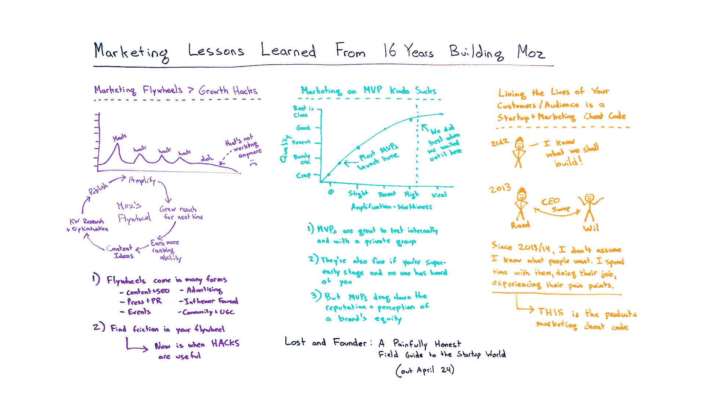
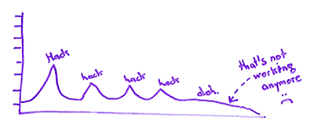
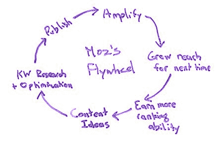
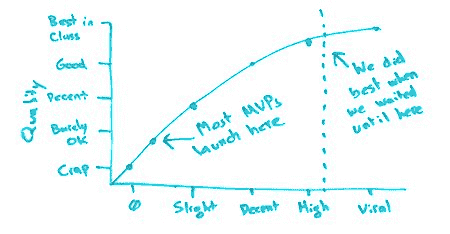

# 从 Moz - Moz 的 16 年建设中获得的营销经验

> 原文：<https://moz.com/blog/marketing-lessons-learned?utm_source=wanqu.co&utm_campaign=Wanqu+Daily&utm_medium=website>

Rand 从构建和发展 Moz 中学到的经验已经足够老到可以驱动了。从营销飞轮与增长黑客，到产品发布时机，再到密切了解你的受众，兰德在今天的白板星期五中分享了他十五年来营销 Moz 的最佳建议。

单击上面的白板图像，在新标签页中打开高分辨率版本！

## 视频转录

你好，Moz 的粉丝们，欢迎来到另一个版本的白板星期五。本周，我们将谈谈我个人在过去 16、17 年里创建这家公司、创建 Moz 的一些重要经验。

早在二月份，我就全职离开了公司。我仍然是董事会主席，并在某些方面做出了贡献，包括偶尔在这里和那里的白板星期五。但我想做的是，作为我写的这本书的一部分，这本书将于 4 月 24 日出版， [Lost and Founder](https://sparktoro.com/book) ，谈论其中的一些元素，甚至可能让你先睹为快。

如果你在想，“嗯，有哪两三章跟我超级相关？”让我试着向你介绍一下我觉得我已经带走了什么，以及我今后将改变什么，特别是那些适用于我们这些网络营销、SEO 和更广泛的营销的东西。

## 营销飞轮>成长秘诀

首先，根据我的经验，营销飞轮几乎总能击败增长黑客。我知道增长黑客在过去几年很流行，尤其是在创业和技术领域。人们一直在寻找将改变我们业务的下一个重大增长手段。但是我必须对你说实话。不仅仅是在 Moz，在我作为营销人员经历过的所有公司，当它被实施时，看起来都是这样。

所以人们会找到一个黑客。他们会找到一些暂时有效的技巧，这会导致他们的流量、转化率、成功指标等方面的激增。所以他们发现了一种游戏脸书的方法，或者他们发现了这个新的黑帽子戏法，或者他们发现了这个伟大的转换装置。不管是什么，都是短期和短暂的。这是为什么呢？这往往是因为陈楚翔所谓的东西——我在这里用他的委婉语——它被称为“[低劣点击率定律](http://andrewchen.co/the-law-of-shitty-clickthroughs/)”，本质上是说，随着时间的推移，随着人们对某种营销趋势的体验，他们会对其影响产生免疫力。

你可以在任何试图破解意识或利用心理偏见的事物中看到这一点。所以你得到了这种黑客模式，黑客，黑客，黑客，然后没有你正在做的黑客工作了。即使你有一个非常成功的故事，即使这个故事持续了六个月，随着时间的推移，这些故事会逐渐减少。

相反，营销飞轮是你建造的产生惯性和能量的东西，这样你投入的每一份努力和能量都有助于它越转越快，并持续下去。在你让它运转起来之后，在将来一次又一次地转动它需要更少的能量。这就是许多伟大营销的运作方式。你建立了一个品牌。你建立你的观众。他们来找你。他们帮助它放大。他们把越来越多的人带回来。在网络营销的世界里，这也很有效。

所以你们大多数人都熟悉 Moz 的飞轮，但我会在这里尝试给出一个粗略的解释。我们从这里开始，从与 SEO 相处的大量时间中获得的内容想法。我们做关键词研究，我们优化这些帖子，包括看看白板星期五本身。

我们用白板星期五做什么？你正在看这个视频，但你也会看到下面的文字记录。你会看到 SoundCloud 的播客版本，这样你就可以听文本，而不是看我，如果你出于某种原因只能做音频的话。这些小图片中的每一个都被剪下并放入下面的文本中，这样在 Google images 中搜索的人可能会找到其中的一些，并找到周五白板的方法。几个月后，它将被放在 YouTube.com，这样人们就可以在那里找到它。

所以我们做了各种各样的事情来优化这些帖子。我们发布它们，然后通过我们拥有的所有渠道——电子邮件、社交媒体，当然搜索引擎对我们来说是一个很大的渠道。然后我们为下一次拓展我们的触角。

在早期，在 Moz 的历史早期，当我第一次发表文章的时候，我自己写了很多很多年的博客。这非常困难。我们没什么进展。现在，它是一个自动运转的引擎。因此，每次我们这样做，我们赚取更多的 SEO 排名能力，更多的链接，更多的其他积极的排名信号。下次我们发布内容时，它有更大的机会做得更好。所以 Moz 的飞轮一直转，一直越来越快，越来越轻松。每次我拍摄白板星期五，我都更有经验。我在这方面有所进步。

### 飞轮有许多不同的形式

飞轮有很多种形式。我们在这里描述的不仅仅是经典内容和 SEO 内容，尽管我知道你们中许多看白板星期五的人可能会使用类似的东西。但是媒体和公共关系是很多人使用的一个大工具。我知道一些公司主要建立在事件营销的基础上，他们也有同样的飞轮。在广告中，人们已经找到了这些，在以影响者为中心的营销飞轮中，以及社区和用户生成的内容来构建飞轮。所有这些都是做到这一点的方法。

### 在你的飞轮中寻找摩擦力

如果当你发现你的飞轮有摩擦，就像我早年所做的那样，那就是黑客真正有用的时候了。例如，在我早期，如果你能找到一种方法来增加下次的影响力，这一切都是为了拓展 SEO 领域已经有影响力的人，让他们关注并帮助扩大 Moz 的内容。这就是我需要的技巧。本质上，它是 SEO 初学者指南和搜索排名因素文档的结合，我已经在这里描述过了。但这真的有助于下一次的增长，并使这个飞轮开始以我们想要的方式旋转。所以我强烈建议你选择飞轮而不是黑客。

## 营销一个 MVP 很难

第二，营销 MVP 有点糟糕。太可怕了。伟大的产品很少是最小可行的产品。MVP 是一种很好的构建方式。我真的非常非常喜欢埃里克·里斯(Eric Ries)在这场运动中所做的事情，他采用了这样一个概念:尽可能制造最小的东西，但仍然可以解决用户和客户的问题，然后推出它，这样你就可以从中学习和迭代。

我只有一个抱怨，如果你公开这么做，如果你公开推出你的 MVP，而你已经是一个众所周知的品牌，你真的会损害你的声誉。从来没有人这么想过。从来没有人认为，“天哪，你知道，Moz 推出了他们的第一个新工具 x 版本。它非常糟糕，但我可以看到，经过几年的工作，它将成为一个令人惊叹的产品。我真的相信他们。”没人这么想。

你怎么想呢?你想“Moz 推出这个产品。他们为什么要发射它？有点可怕。他们在走下坡路吗？他们现在很烂吗？也许我应该减少对他们其他工具的信任。”这是大多数人在谈到 MVP 时的想法，这也是它如此危险的原因。

所以我做了这个愚蠢的图表。但是，如果质量从垃圾到最好，放大价值从零到病毒，往往是这样的情况，大多数 MVP 在这里推出，当他们勉强够好，因此几乎没有放大潜力，除了损害它之外，真的不能为你的营销做太多。

如果你在内部构建它，在内部构建 MVP，和你的测试团队一起测试，然后一直等到它达到这样的质量水平，“哇，这真的很好，”很多使用它的人说，“天哪，我不能没有它。我想和我的朋友分享。这件事我想告诉大家。现在可以告诉别人了吗？”可能开始漏了。现在，你在这里。现在，你的发射真的可以做一些事情。我们已经在 Moz 看到过很多次这样的事情，MVP 和 MVP 都是我们坐在上面等待的。我在书中谈到了其中的一些。

MVP，很适合在私人团队中进行内部测试。如果你真的处于早期阶段，而且没有人听说过你，他们也很好。但是 MVP 会严重拖累品牌的质量和资产的声誉和认知度，这就是为什么我一般不推荐他们，尤其是营销方面。

## 过你的客户/观众的生活是一个创业+营销的欺骗代码

最后，但同样重要的是，过你的客户或观众的生活是一个欺骗代码。这是一个营销和创业欺骗代码。我做过的最好的事情之一就是说，“你知道吗？我不会把自己关在办公室里，幻想我们应该建设或者应该做的伟大事业。相反，我将与我们的客户共度真正的时光。”

你可能还记得，在 2013 年底，我和我的朋友 Wil Reynolds 一起做了这个疯狂的项目，他经营着 Seer Interactive。他们是总部设在美国费城和圣地亚哥的搜索引擎优化公司。他们做的不仅仅是 SEO。我和威尔交换了房子。我们交换了生命。我们交换了电邮账户。我无法告诉你回复某人的电子邮件，回复 Wil 的妈妈，就像这样，“哦，Reynolds 夫人，这实际上是 Rand。你的儿子威尔正在西雅图回复我的电子邮件，住在我的公寓里。”

那次经历对我来说是一次转变，特别是在经历了构建一些我自己概念化但没有验证的东西的痛苦之后，甚至没有从真实的人面临的真实问题中产生想法。我想出这个主意是基于我认为可以发展公司的想法。我现在非常不喜欢来自那个角度的想法。

所以从那以后，我尽量不去假设。我尽量不假设我知道人们想要什么。当我们拍摄白板星期五时，几乎总是关于我通过电子邮件或 Twitter 或在活动或会议上见过并交谈过的人的话题，我们已经进行了面对面的交谈。他们说，“我正在努力。”我说，“我可以做一个白板星期五来帮助他们。”这就是这些内容创意的来源。

当我花时间与人们一起做他们的工作时，不久前我在圣地亚哥会见了那里的几个机构，花时间在他们的办公室展示新的链接工具，获得他们的所有反馈，看他们用 Open Site Explorer 和 Ahrefs 和 Majestic 做什么，并与他们一起工作，试图经历他们经历的过程，并实际体验他们的痛点。我认为这就是产品和营销欺骗代码。如果你花时间与你的受众在一起，体验他们的痛点，你写的文案，你设计的东西，你把它放在哪里，你试图让谁来影响和放大它，你如何为他们服务，无论是通过内容还是通过广告或通过活动，或者你正在做的任何类型的营销，如果你活在你的客户和他们的影响者的生活中，都会有所改善。

好了，各位。希望您喜欢这个版本的白板星期五。如果你对此有反馈，或者如果你已经读了这本书并检查了它，你喜欢它或不喜欢它，请，我很乐意听到你的意见。期待大家的评论。下周，我们将在下一期的“白板星期五”中再见。保重。

[视频转录](http://www.speechpad.com/page/video-transcription/)由【Speechpad.com】T2T4】

