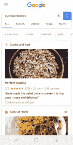
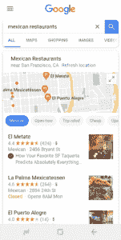
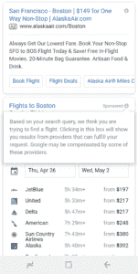
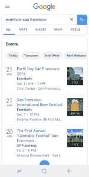

# 谷歌的新战略及其对聚合商的影响

> 原文：<http://caseyaccidental.com/googles-new-strategy-and-how-it-affects-aggregators/?utm_source=wanqu.co&utm_campaign=Wanqu+Daily&utm_medium=website>

作为一个成功利用 SEO 作为公司发展策略的人(对 Apartments.com、Grubhub 和 Pinterest 来说，SEO 是新用户的主要渠道)，我今天被问了很多关于 SEO 作为一种策略的问题。陈楚翔的劣质点击率定律表明，所有获取渠道都有保质期，会随着时间的推移而衰减。迄今为止，SEO 是所有主流互联网渠道中保质期最长的。它一直是一个稳定的平台(不像脸书)，它不断地自我成长，并由一个非常强大的商业模式支持，这可以在十多年内推动谷歌的收入增长，所以谷歌不需要将他们分发给其他公司的所有免费流量货币化。或许一种更优雅的解释方式是，既然有机搜索的存在是为了满足用户需求，而不是广告商的需求，它是一个更可持续的获取渠道，正是因为它不是为一个渠道而建立的。人们从来不想要广告、更多的电子邮件等等。像其他获取渠道一样。在谷歌有机搜索上，人们确实想要答案。

在平台向移动转移的过程中，这最后一句话仍然是正确的，这将标志着 SEO 作为获取用户的渠道不可避免的衰落。几年前，本·汤普森宣布谷歌公司达到顶峰。为什么他当时是错的，这就是为什么我今天宣布谷歌作为收购渠道的巅峰时期已经过去，这是正确的。要理解这一点，你必须理解谷歌的战略。谷歌的搜索引擎是由帮助其用户的优化驱动的。本·汤普森很好地解释了这个[如何与出版商](https://stratechery.com/2018/the-aggregator-paradox/)合作。如果你像谷歌一样，在过去几年里一直在分析它的用户，你可能会学到一些东西。首先，他们中的大多数人在移动设备上，他们的时间更有限，他们的连接(仍然)更慢，并且存在应用程序取代频繁查询的威胁。

谷歌看到的是，他们的用户不再想点击十个蓝色链接。他们没有时间和带宽，而且现在有太多的竞争对手以应用程序的形式提供这些查询。外形决定了最佳的用户体验，并迫使谷歌不断发展。用户想要一个答案，而且是立即想要。这就是谷歌正在做的事情。如果你在谷歌上输入一个有明确答案的问题，很有可能谷歌只会回答这个问题，而不会为它推荐一个网站。我们都看到了。更有趣的是，当没有答案时，谷歌在做什么，解决方案是提供选项，或者他们可能会称之为发现体验。食谱就是一个很好的例子。以前你会看到一堆“X 的 21 个最佳食谱”页面，现在你只看到这些食谱的结果。

[T2】](https://secureservercdn.net/50.62.195.160/q3u.d9b.myftpupload.com/wp-content/uploads/2018/04/Recipe-Search-Result.png)

有人会认为这些查询完全符合谷歌现有的十个蓝色链接的策略。但是谷歌知道消费者不想来回点击多个网站来查看每个网站的推荐。他们希望谷歌直接提出这些选项。这就是谷歌现在正在做的事情。拿任何一个热门的查询类别来说，你会看到谷歌用答案或选项替换链接，直接显示在搜索中。

尽管历史上这些“选项”查询的顶级策略是建立一个聚合器，并通过拥有最多的选项来排名第一，但 Google 现在声明它应该是唯一的聚合器。本·汤普森描述了谷歌对快速加载页面的需求和禁止 Chrome 上的侵扰性广告之间的矛盾，同样，谷歌的搜索政策也在为在有机搜索方面表现出色的聚合器做同样的事情。

谷歌是如何在算法上做到这一点的？在过去的几年里，谷歌已经开始在他们的算法中严格执行两项新政策:内部搜索和门户页面。对于内部搜索，谷歌表示:

不要让你的内部搜索结果页面被谷歌抓取。用户不喜欢点击一个搜索引擎的结果，而仅仅停留在你网站的另一个搜索结果页面上。
[来源](https://support.google.com/webmasters/answer/7451184?hl=en)

对于门户页面，谷歌说:
*我们长期以来一直认为，专为搜索引擎创建的门户页面会损害用户搜索体验的质量。*
[来源](https://support.google.com/webmasters/answer/2721311%22)

从表面上看，这些房间似乎是明智的。如果你继续读到门道页面更新的结尾，你可能会开始看到一个问题:

 **   目的是为了搜索引擎优化和引导访问者进入你网站的实际可用或相关的部分，还是他们是你网站用户体验的一个组成部分？
*   页面是否复制了有用的项目集合(位置、产品等)。)已经存在于网站上，目的是为了获取更多的搜索流量？
*   这些页面作为一个“孤岛”存在吗从网站的其他部分很难或不可能导航到它们吗？从网站或网站网络中的其他页面到这些页面的链接仅仅是为了搜索引擎而创建的吗？

把这两个放在一起看，谷歌要说的是创建索引你的搜索结果页面的页面是一种糟糕的体验，*和*为搜索引擎访问者创建以不同方式复制你的搜索体验的新页面是一种糟糕的体验。这两条规则有效地惩罚了你的内容清单的任何呈现。他们如何判断这些页面是否仅仅是为搜索引擎创建的？这与他们检测不良广告的方式相似:他们使用 Chrome 浏览器数据。所以，对于想向谷歌展示内容的聚合器来说，指导方针很简单:把你的内容给我们，我们会聚合它，或者在非内部搜索页面和非门户页面的小空间里玩。这实际上意味着创建一个具有独特库存的页面，它看起来不像搜索，但却从除谷歌之外的其他来源接收流量。那里有一扇窗户，但它很小。

在为这些规则变化更新算法的同时，谷歌正在研究如何在许多类别中成为聚合者，在未来十年中，它将在每个热门搜索类别的列表中搜索，并研究出具体的方法。要做到这一点，谷歌要么建立，要么购买，要么与现有的玩家合作。让我们来看一些例子。

**构建案例:谷歌本地**
谷歌试图收购 Yelp，以建立本地列表和与本地企业的关系。当 Yelp 拒绝时，谷歌在谷歌地图和谷歌搜索的基础上建立了谷歌本地，现在与数千家直接通过谷歌管理信息的企业有着直接的关系。当你拥有占主导地位的搜索产品和占主导地位的地图产品时，这并不困难。当你搜索一个本地查询，你看不到广告，只有谷歌本地在所有其他搜索结果之上。

[T2】](https://secureservercdn.net/50.62.195.160/q3u.d9b.myftpupload.com/wp-content/uploads/2018/04/Restaurant-Search-Result.png)

**收购案例:谷歌航班**
2010 年 7 月，谷歌收购了 ITA 软件，这永远压低了许多旅游相关互联网企业的市值。ITA 为许多顶级在线旅行社提供航班搜索和价格信息。你可能已经猜到了，这些数据现在直接免费出现在谷歌上。谷歌正在将这一领域货币化，并希望随着时间的推移，从点击付费模式转向更具交易性的模式。

[T2】](https://secureservercdn.net/50.62.195.160/q3u.d9b.myftpupload.com/wp-content/uploads/2018/04/Flight-Search-Result-Disclosure.png)

**合作伙伴案例:谷歌事件**
去年年底，谷歌推出了一个专门的板块，当人们搜索来自第三方来源(包括 Eventbrite)的事件时，它会汇总这些事件。第三方将他们的清单交给谷歌，谷歌自己对事件进行排名。你不能指望你的企业属于这一类。在以下情况下，谷歌可能会成为合作伙伴:

*   他们买不到有统治力的玩家
*   供应分散，数据非结构化
*   有多家公司愿意实现特定的标记以出现在这些发现体验中
*   这一领域目前还不是谷歌盈利的主要领域之一

[T2】](https://secureservercdn.net/50.62.195.160/q3u.d9b.myftpupload.com/wp-content/uploads/2018/04/Event-Search-Result.png)

如果你受到影响，你会怎么做？
如果你是一个聚合者，谷歌正在进入你的领域，它会完全改变你的搜索引擎优化策略。虽然你曾经创建和优化过为热门查询聚合库存的页面，例如 Grubhub 的“旧金山食品配送”,但这些页面现在将被贬低，因为 Google 用自己的聚合器取代了这些列表。这个问题的最佳解决方案是将你的策略转移到你个人列表的分发上，这样你就可以在谷歌新发现体验的竞争中胜出。这些页面通常需要更新为 AMP 格式，因为这是谷歌搜索中所有这些新发现体验的动力。

许多公司将试图退出这一战略，认为如果他们推迟或损害谷歌为自己建立一个有吸引力、有竞争力的聚合器的能力，这将有助于他们保持目前的排名。这不太可能行得通。如果你的聚合器有任何竞争对手，博弈论将激励其中一个与谷歌合作来窃取份额。如果你是一个垄断者，并选择退出，它会激励谷歌建立一个威胁你垄断地位的竞争对手，你会收到很少的流量，同时也会威胁你的垄断地位，谷歌可以在多年内将大量资源投入到一个有竞争力的产品上。这似乎与 Google Local vs. Yelp 一起工作。尽管过去发生了这些类型的平台变化，但某些公司仍然能够通过以高转换成本建立忠诚的受众而蓬勃发展，就像谷歌推出谷歌购物时亚马逊与亚马逊 Prime 的合作。

—
谷歌的战略已经改变，尽管要在每一个流行的搜索查询类别中传播还需要几年时间。你不能责怪他们的这种改变，因为这是迎合他们用户的正确反应。现在是了解他们的战略并为你的公司不可避免的推出做好最佳定位的时候了。不用付出太多努力就能依靠谷歌获得稳定的免费客户的日子已经一去不复返了。你需要战略性地思考公司的发展方向，你的内容是否仍然有机会吸引谷歌访客，以及你如何最大限度地利用现在正在下降的机会。

感谢 Randy Befumo 帮助我完成了这篇文章的初稿。

目前正在听μ-ziq 的[挑战我傻。](https://open.spotify.com/album/7LjkE8IS9hFb60lA64Fp2c?si=zEaDtDenRt67VuDHJuSmGQ)*