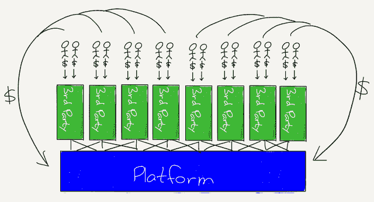
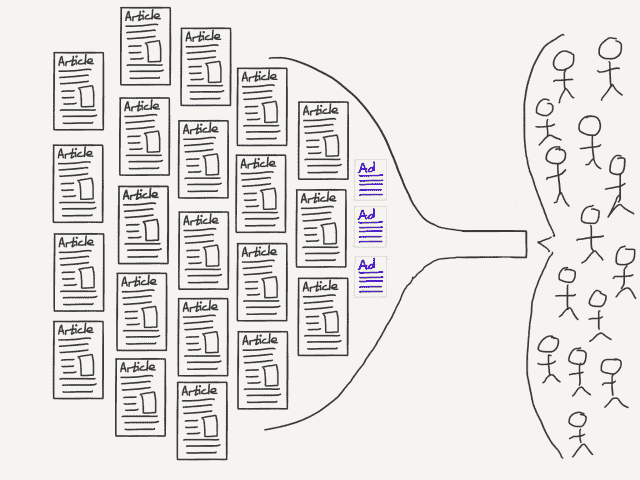

# 技术的两种哲学——本·汤普森的战略

> 原文：<https://stratechery.com/2018/techs-two-philosophies/?utm_source=wanqu.co&utm_campaign=Wanqu+Daily&utm_medium=website>

尽管苹果的开发者大会还有几周时间，但我认为可以肯定地说，昨天谷歌 I/O 主题演讲上的谷歌双工演示将成为技术大会季最令人印象深刻的一次。如果你没看过，这是一部必看的电影:

然而，当我惊讶地抬起下巴时，谷歌首席执行官桑德尔·皮帅的演讲给我留下了深刻印象，他是如何打开这一部分的:

> 我们对助理的愿景是帮助您完成工作。

以及他如何关闭它:

> 所有这些的一个共同主题是，我们正在努力给用户时间。在谷歌，我们一直对此很着迷。搜索痴迷于让用户快速找到答案，并给他们想要的东西。

在谷歌看来，计算机通过为你做事来帮助你完成任务，并节省你的时间。Duplex 是最令人印象深刻的例子——一台为你打电话的计算机——但这个总体概念适用于谷歌的许多其他演示，特别是那些基于人工智能的演示:谷歌照片不仅会对你的照片进行排序和标记，现在还会提出具体的编辑建议；谷歌新闻会帮你找到新闻，地图会帮你找到附近的新餐馆和商店。很恰当地，主题演讲以 Waymo 的演示结束，这将推动您。

#### 谷歌和脸书哲学

回顾一周前，马克·扎克伯格在脸书·F8 会议上的主题演讲中有一个特别的部分让我印象深刻:

> 我相信我们需要设计技术来帮助人们更紧密地联系在一起。我相信这不会自己发生。所以要做到这一点，解决方案的一部分，只是一部分，就是有一天我们的技术将需要更多地关注人和我们的关系。现在不能保证我们做对了。这很难。我们会犯错误，这些错误会产生后果，我们需要纠正这些错误。但我可以保证的是，如果我们不在这方面努力，世界不会自己朝着这个方向发展。

扎克伯格，就像脸书经常遇到的情况一样，给人的感觉是一个更狂热、也绝对更令人毛骨悚然的谷歌版本:脸书不仅想为你做事，还想做其首席执行官明确表示不会做的事情。然而，去年似乎已经超过扎克伯格的救世主般的热情，仅仅意味着脸书已经采用了指导谷歌的同一哲学的一个更极端的版本:计算机为人做事。

#### 微软和苹果的哲学

本周早些时候，在发表微软的 Build 大会主题演讲时，首席执行官塞特亚·纳德拉的语气截然不同；在描述了计算是如何变得看不见的(因为它无处不在)之后，纳德拉说:

> 这是我们拥有的机会。从某种意义上说，这是无止境的，但我们也有责任。我们有责任确保这些技术赋予每个人权力，这些技术通过确保每个行业都能够增长和创造就业来创造公平的增长。但是，作为一个技术行业，我们也有责任建立对技术的信任。
> 
> 事实上，汉斯·约纳斯是一位在 50、60 年代工作的哲学家，他写了一篇关于技术和责任的论文……他谈到行动，以便你的行动的效果与永恒或真正的生活相容。这是我们需要反思的事情，因为他谈到了技术的力量远远超过了我们完全控制它的能力，特别是它对后代的影响。因此，我们需要制定一套指导我们做出选择的原则，因为我们做出的选择将决定未来…
> 
> 这种机会和责任是我们使命的基础，让地球上的每个人和每个组织都有能力取得更多成就。我们专注于构建技术，这样我们就可以授权他人构建更多的技术。我们已经调整了我们的使命、我们制造的产品和我们的业务模式，因此您的成功就是我们成功的源泉。必须完全对齐。

这是技术的第二个哲学，它与另一个是正交的:期望不是计算机为你做你的工作，而是计算机使你能更好和更有效地做你的工作。有了这种哲学，就有了不同的责任感。皮查伊在谷歌主题演讲的开头承认，“我们深感有责任把这件事做好”，但这句话的内在含义是，谷歌总体上处于中心地位，其管理人员负有直接责任。另一方面，纳德拉坚持认为，责任在于科技行业的集体，以及我们所有寻求单独利用它的人。

#### 心灵的自行车

第二种哲学认为计算机是人类的助手，而不是替代品，这是两种哲学中较老的一种；它最大的支持者——预言家，如果你愿意的话——是微软最大的竞争对手，他选择的类比也是关于交通运输的，这很巧。不是汽车，而是自行车:

<iframe src="https://www.youtube.com/embed/KFP1nCCJe40?rel=0" frameborder="0" allow="autoplay; encrypted-media" allowfullscreen="">视频</iframe>

史蒂夫·乔布斯特别喜欢这个类比:有很多他用几乎相同的方式表达观点的片段；我通常会链接到这段视频，因为这段视频录制的时候，乔布斯的演讲已经非常完美了。

然而有趣的是，已知的最早的乔布斯讲述这个故事的片段，来自 1980 年，并没有包括著名的短语“思想的自行车”；尽管如此，还是值得一看:

> 我听过的最好的类比是科学美国人，我想是，在 70 年代早期做了一项关于运动效率的研究，他们所做的是对地球上所有不同种类的东西，鸟、猫、狗、鱼、山羊等等，他们测量了一只山羊从这里到那里需要多少能量。每公里千卡什么的，不知道他们测出来的。他们对它们进行了排名，公布了名单，秃鹰赢了。秃鹰从这里到那里用了最少的能量。《男人》表现不佳，表现平平，排在榜单的第三位。
> 
> 但幸运的是,《科学美国人》杂志上有人很有见地，他测试了一个骑自行车的人，结果骑自行车的人赢了。比秃鹰好两倍，完全不在名单上。这表明人类是一个工具制造者，有能力制造工具来增强他的内在能力。这正是我们在这里所做的。

这正是纳德拉想要表达的意思:“让这个星球上的每个人和每个组织获得更多成就”就是“放大这些人和组织的内在能力”；目标不是为他们做事情，而是让他们能够做以前不可能做的事情。而且，我要赶紧补充一句，苹果在很大程度上仍然站在这一哲学分歧的同一边。

#### 鸡和蛋的问题

当然有一个论点是，这两种哲学产生于它们的历史背景；苹果(Apple)和微软(Microsoft)这两家“思想的自行车”公司成立仅一年，几十年来拥有大致相似的商业模式，这并非偶然:当然，微软许可软件，而苹果销售软件差异化的硬件，但两家公司过去和现在都是其核心的个人电脑公司，推而广之，都是平台。

另一方面，谷歌和脸书是互联网的产物，互联网不是导向平台，而是导向聚合者。虽然平台需要第三方来使其有用，并通过创建生态系统来建立护城河，但聚合器凭借其固有的有用性吸引最终用户，随着时间的推移，供应商别无选择，只能按照聚合器的指示行事，如果他们希望接触到最终用户的话。

这种商业模式源于这些基本差异:平台提供商没有广告的空间，因为平台的主要功能是为用户真正需要展示的应用程序提供舞台。另一方面，聚合器，特别是谷歌和脸书，处理信息，广告只是另一种类型的信息。 [2](#fn2-3466 "As <a href="https://stratechery.com/2013/mobile-makes-facebook-just-an-app-thats-great-news/">I’ve written in the past</a>, this is why mobile saved Facebook: the company desperately wanted to be a platform but being “just an app” left Facebook no choice but to be self-contained and thus a better ad company") 此外，因为聚合者差异化的临界点是其平台上的用户数量，广告是唯一可能的商业模式；谈到广泛采用，没有比“免费”更重要的特征了

尽管如此，这并没有降低这两种哲学的真实性:谷歌和脸书一直以为用户做事为前提，就像微软和苹果建立在让用户和开发者能够做出完全不可预见的事情的基础上一样。

#### 技术的阴阳两极

有两种哲学并不一定意味着一种是对的，一种是错的:现实是我们两者都需要。有些问题最好靠人类的聪明才智来解决，比如微软和苹果；其他人通过集体行动。不过，这也解释了为什么谷歌和脸书从根本上来说更危险:集体行动传统上是政府的领域，其最佳形式受到公众意愿的约束。另一方面，谷歌和脸书不对任何人负责。他们都应该受到最近吸引的所有审查，而且可以说应该受到更多审查。

然而，这种审查，以及由此产生的任何监管，都必须记住这种哲学分歧:创造新可能性的平台——不仅仅是苹果和微软！—在应对即将到来的计算机取代人类工作的浪潮时，是最重要的经济力量，针对聚合器但限制平台的懒散的书面监管将不可避免地弊大于利。

事实是，我上周写的[神圣的不满](https://stratechery.com/2018/divine-discontent-disruptions-antidote/)不仅是低端破坏的解药，也是乐观的理由:正如我所指出的，苹果和亚马逊这样的公司可以通过提供卓越的用户体验来长期获胜，但更重要的是，不满的红利是建立新业务和新工作机会的绿地，以减轻这种不满。为此，我们需要建立这些业务的平台，是的，我们需要人工智能来为我们做事，这样我们才有时间。

*我在[每日更新](https://stratechery.com/2018/platforms-versus-aggregators-what-about-amazon-walmart-buys-flipkart/)中写了这篇文章的后续。*

### *相关*