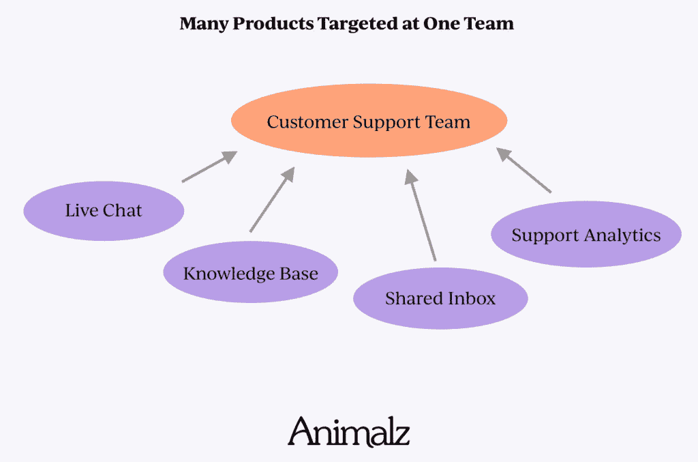
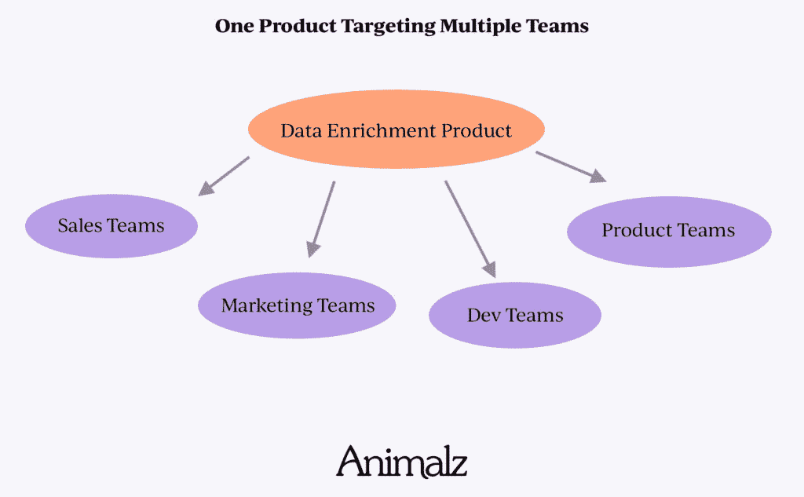
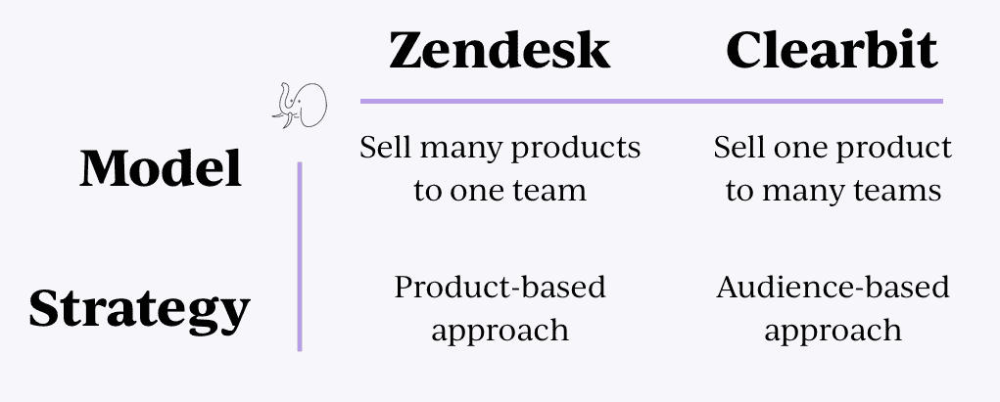
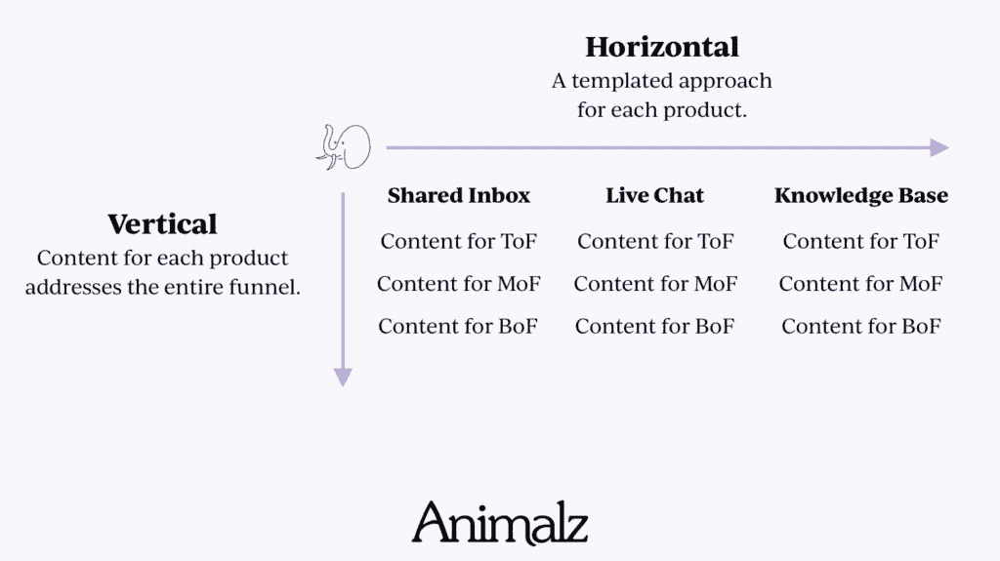
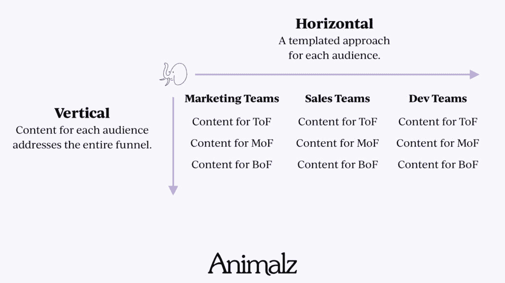

# 多产品公司的内容营销策略

> 原文：<https://www.animalz.co/blog/multi-product-content-strategy/?utm_source=wanqu.co&utm_campaign=Wanqu+Daily&utm_medium=website>

这是两家拥有多种产品的公司，它们以不同的方式应对这一挑战。

*   Zendesk 提供了一些产品，包括其核心支持工具、实时聊天工具、知识库、呼叫中心工具和其他一些产品。每个都可以单独使用，所有都可以一起使用。所有产品都有助于提供支持，但并非所有产品都适用于所有企业(例如，企业可以通过电子邮件和聊天提供支持，但不能通过电话提供支持)。
*   **[Clearbit](https://clearbit.com/)** 提供了一些数据浓缩工具。有些是给[销售团队](https://clearbit.com/sales)的，有些是给[营销团队](https://clearbit.com/marketing)的。他们也有一个 API，开发者可以直接集成到他们自己的产品中。Clearbit 的产品非常灵活——同一家公司的许多人可以通过多种方式使用它。

在每种情况下，内容团队都需要识别人们搜索某个产品解决的用例的所有方式，然后为其构建内容。有两种方法可以做到这一点，为了理解它们，我们需要看看 Zendesk 和 Clearbit 的商业模式之间的区别。

Zendesk 以公司的支持团队为目标，提供许多不同的产品。

Clearbit 出售一种为不同销售团队定制的数据丰富产品。

商业模式决定了内容策略。在这两种情况下，多产品产品意味着您需要一个可用于每个目标群体的可重复模板。

*   因为 Zendesk 的目标是一个拥有许多产品的团队，他们应该采取基于产品的方法。为此，他们应该根据自己创造的产品对内容进行细分。每种产品的受众是相同的(或非常相似的)，但是他们需要根据每种产品的优点来销售。这意味着每种产品都应该得到最高、中间和[漏斗底部含量](https://www.animalz.co/blog/bottom-of-the-funnel-content/)的全面处理。
*   因为 Clearbit 的目标是拥有一个产品的许多团队，他们应该采取基于受众的方法。他们向非常不同的团队销售非常相似的产品。每个目标受众都需要内容的完整处理，从认知到考虑再到购买。

总结一下:

两者的战略框架都是相似的，都是横向和纵向的。

每个“垂直行业”(即产品或受众)都得到自上而下内容的全面对待。该策略是模板化的，因此可以针对每个产品或受众重复使用。

Zendesk 的情况是这样的:

对于 Clearbit:

有了这个框架，大多数企业可以[审核现有内容](https://www.animalz.co/blog/content-audit/)来查看差距在哪里。在大多数情况下，相当多的内容已经被创造出来了，但是对于更新的或者不太流行的产品来说还存在着空白。

在 [Airtable](https://airtable.com/) 中组织内容，按目标受众(或产品)标记每篇帖子，再按漏斗深度标记，很有帮助。以下是 Clearbit 的一个示例:

这里有一个 Airtable 模板，你可以用它来制作自己的内容。

以及一些帮助内容团队对需要创建的内容进行优先级排序的可视化工具:

多产品公司的内容策略可能会变得复杂。上面的框架可以帮助您入门，但是还有一些其他的事情需要考虑:

*   除了单个产品之外，这个框架还可以用于用例。具有许多用例的灵活产品可以从每个用例的专用内容中受益。
*   你不必为每个受众、产品或漏斗中的位置平均分配内容。内容的多少取决于写作的质量和关键词的难度。
*   决定一篇文章的目标是漏斗的顶部、中部还是底部并不总是容易的——没关系。尝试将每个帖子与其最接近的漏斗深度相关联。
*   有些帖子可以面向多个受众。那也没关系。假设它会让你的内容审计变得更有挑战性。
*   一旦你有了框架，参考我们的[内容策略指南，了解更多关于如何为漏斗的顶部、中部和底部写作的信息](https://www.animalz.co/blog/content-marketing-strategy/)。

如果你是一名内容营销人员，目前正致力于多产品战略，[请联系](mailto:jimmy@animalz.co)。我们很乐意展示一些例子，并向您学习。

 [Follow @Jimmy_Daly](https://twitter.com/jimmy_daly) 

Animalz 是一家为 SaaS 和科技公司提供高端内容营销解决方案的机构。

