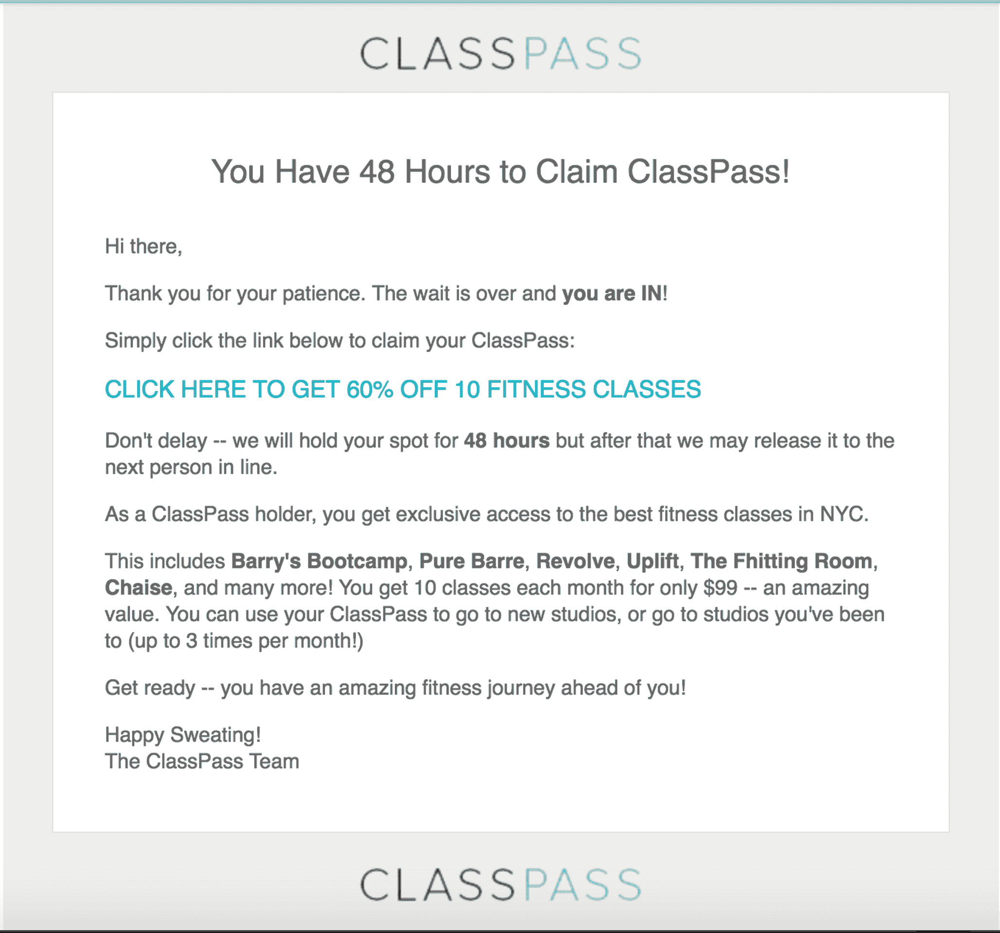

# “ClassPass”创始人谈市场初创企业如何实现产品/市场契合|第一轮回顾

> 原文：<http://firstround.com/review/classpass-founder-on-how-marketplace-startups-can-achieve-product-market-fit/?utm_source=wanqu.co&utm_campaign=Wanqu+Daily&utm_medium=website>

2011 年， **[ClassPass](https://classpass.com/ "null")** 创始人 **[Payal Kadakia](https://www.linkedin.com/in/payalkadakia/ "null")** 刚刚加入创业加速器 Techstars。几个月内，她就登上了 *Inc .杂志*的封面，并出现在 Mashable、Business Insider、Gigaom 和几乎所有科技和商业博客上。

她应该活在创业梦里。唯一的问题是，没有人使用她的产品。

剧透:ClassPass 已经找到了自己的立足点，并开始了比赛。但它经历了多年的支点(三次重大产品迭代)、品牌重塑(从最初的 Classtivity 到现在著名的 ClassPass)和良好的老式信念才得以实现。

现在，卡达基亚建议创始人不断回到一个非常重要的问题上:**你到底在试图解决什么问题？**她专注于公司使命，专注于最关键的指标，带领公司从濒临破产的边缘成长为价值 4.7 亿美元的游戏规则改变者。在这次独家采访中，她走过了这条轨迹，分享了她学到的关于创业公司如何建立市场才能找到产品/市场契合点的九条关键经验。

# 1.短工帮助你出名，而不是成长。

ClassPass，也就是 Classtivity，最初并不是像今天这样作为成员服务，而是作为一种简单搜索类的方法。“第一次迭代确实受到了市场上已经发生的事情的启发，”Kadakia 说。“已经有了像 OpenTable 和 Zocdoc 这样的模型，所以我想，‘如果我把它应用到类上会怎么样？作为一名舞蹈演员，我想建立我作为消费者想要的东西:一种让人们容易找到和预订健身课程的方式。看起来搜索引擎模型是实现这一目标的好方法。"

这种方式有其优势，在接触投资者时，这是一种简单的方式。“人们已经看到了这些其他公司为他们的产品提供搜索引擎的成功——在那些情况下，是餐馆和医生。卡达基亚说:“人们知道这是一个问题，那里有足够的市场。“早期的热情给了我开始构建的资源和动力，但我最初没有深入思考的是，这个解决方案是否是我的客户想要的。”

当发布会开始时，所有的目光都集中在热门的新公司上，媒体蜂拥而至。“但我不得不提醒自己，这不是我们公司实际情况的指标，因为那时我们没有预订，”Kadakia 说。“毫无保留地说，我没有对人们的生活产生影响。很明显，我也没有业务，因为我的整个业务模式都是建立在数量上的。”

Kadakia 发现自己处于一个站不住脚的位置:由于 Techstars，她能够筹集额外的资本。但是当要用这些钱做些什么的时候，她陷入了困境。“我记得当时我在想，‘嗯，我们其实什么也没做。如果我们继续这样下去，我们将无法解决这个问题。她说:“我们永远不会成为一家对世界有所影响的大公司。“我们试水了几个月，到处调整按钮，并推进了一些功能增强。但是我们在实际产品上的差距太大了，以至于两个月后我想，‘我们在做什么？我们需要真正重新评估这一点。"

直到一名顾问让她按下暂停键，她才重新发现了自己的角色——重新获得了她在阶级化之旅中的角色。“我想，‘这是我的。我是领导。这家公司将决定我的成败。卡达基亚说:“我知道，如果我们没有朝着某个目标前进，没有受到我们正在做的事情的鼓舞，我就要开始改变现状，想出我们可以做些什么来改进产品，实现我们的使命。所以，那天我走进工作间，告诉团队我们必须从头开始。我们已经在公司投入了一年多的时间，但我知道我们必须尝试一种新产品。我们需要减少对坚持被理解(市场中的故事)的关注，而更多地关注理解我们想要真正解决的问题。就这样，我们开始了在产品/市场匹配的道路上的第一次重塑。"

# 2.测量一下你是用蒸汽还是风力发电。

Kadakia 开始忽略衡量成功的外在指标——她称之为虚假信号，如筹集的资金、媒体、社交媒体关注者——而倾向于更有意义的信号:客户行为。“如果你把注意力放在所有其他事情上，你就不会推动你的公司。你只是在借助其他来源提供的顺风滑行。卡达基亚说:“你依赖于你没有创造的能量。“这可能会持续一段时间，但不会永远。很难指望你能这样扩展。相反，回到你创办公司的原因——当你启动引擎时，这些行动会产生蒸汽。这是我们集中精力的地方，不一定能帮助我们筹集资金或提高知名度。变得更加肤浅。”

该团队回到基础，与工作室所有者交谈，试图更好地了解客户真正想要的是什么。“当我回到工作室时，我想起来了。卡达基亚说:“我之所以创办这家公司，是因为我一生都是一名舞蹈演员，我真的相信活跃能为人们的生活带来什么。”“然而，如果不让他们去上课，我就不会为任何人的生活做任何事情。是的，我们受到了压力。但我认为最优秀的企业家会不断问自己，即使人们认为他们已经成功了，“我如何才能继续影响人们的生活？”"

Kadakia 和她的团队在自我反省和收集反馈时认识到，仅仅知道有哪些课程是不够的，不足以激励人们走进工作室。他们需要更多的推动。“我们意识到，许多工作室老板都在免费授课。我们已经建立了技术来帮助人们获得所有关于课程的数据。所以我们想，‘如果我们只是用不同的方式包装它会怎么样？’”卡达基亚说我们开发了一个叫做护照的产品。只要支付固定费用，顾客就可以在 30 天的时间里在当地的工作室学习 10 门不同的课程。我们假设，预先投资后，用户会更有动力使用产品。因此，我们决定启动，看看我们是否能推动我们自己的前进道路。"

# 3.开始时，尽可能手动操作。

传统的创业智慧认为，用技术为执行可重复的行动打下基础。但是不要只是默认地遵循这个建议——检查你自己以确保你没有过度构建你的技术，使它成为你的最终目标而不是你的客户。按下暂停键的一个好方法是后退一步，手动执行您的技术通常执行的操作。“这次我最喜欢的事情之一是，我没有让技术驱动或阻碍我的产品开发，”Kadakia 说。“我们开始构建产品，为客户做它需要做的事情。后端的大部分东西要么是手动完成的，要么无法工作。有人会在这个时候预订课程，我会收到一封电子邮件。然后我会去手动预订。在这一点上，我需要弄清楚的不是建立一个完美的预订系统，而是如何激励人们去预订然后去上课。其他的根本不重要。”

Kadakia 通过手动承担预订过程的一部分，以一种本能的方式将顾客行为内在化。“如果你的工作相当于给每一位客户发送确认邮件，这种情况就会发生。它帮助我认识到技术显然是至关重要的。但它仍然只是一个将你的解决方案推向世界的工具。你的软件本身并不是你的答案。卡达基亚说:“你对顾客的洞察就是你的解决方案。“该产品之所以成为产品，是因为我们从与客户的直接互动中获得了洞察力和知识——在技术之上。但是我们必须用我们的思维和学习来引导技术。我花了很多天手动输入预订信息，这变成了另一个有价值的客户洞察流。我很快学会了不要马上预订，因为一半的取消是在预订后 15 分钟内发生的。这成为我们取消政策设计的重要组成部分。”

在早期，定期找到产品的一部分，并手动完成。让它帮助你走出你正在构建的技术，进入你的客户的头脑。这可能意味着轮流在客户支持台上。或者重新查看您的使用数据。卡达基亚说:“只要确保你不会陷入技术将解决一切问题的思维陷阱。”“许多创始人认为，‘现在我已经雇了一个能回答我所有问题的开发人员。’"

# 4.最重要的是尊重交易——让它击垮你。

Kadakia 带着一个新的咒语从那些艰难的早期岁月中走了出来:**如果你不能让交易发生，技术是不会解决它的。**她不会花一两周的时间重新设计网站来提供新产品，她只会发出一封简单的电子邮件(*见下文*)来看看客户是否感兴趣。“你变得非常善于找出如何与人沟通。如果有人不愿意买你当面告诉他们的东西，他们不会通过漂亮的网站购买。”

One of the early Classpass emails to gauge customer interest

在其第二次迭代中，凭借一个基本的网站，该公司在产品/市场契合度方面迈出了一大步。该护照于 2012 年 12 月推出，并迅速走红。预订终于来了——仅前 6 个月就有 2 万个。

Kadakia 学到了重要的一课:如果你只能有一个，一个好的提议总比华而不实的网页设计要好。“我们开发了第一款产品，让寻找课程变得如此简单。Kadakia 说:“我们销售的第二个产品是一个具有更深层次价值主张的产品包。“尽管很难找到课程，但人们还是去上了，因为他们想体验产品。人们对护照的想法和探索锻炼——以及他们的城市——兴奋了一个月。这让我意识到易用性的门槛仅仅是在一个软启动前看到类并点击“保留”。该产品现在更容易使用，但这不是我们最初的产品/市场适应的一部分。这得益于我们随着时间的推移所做的功能增强。”

随着 Passport 的推出，该团队不得不应对 Kadakia 所说的“香槟问题”——例如，当预订窗口打开时，网站会定期在中午崩溃。但是如果要在这和你设计精美的网站上零用户的沉默之间做出选择，那是显而易见的。“在这些问题发生之前，不要担心，”卡达基亚说。“你知道，在开始的时候，人们会说，‘哦，好吧，我们需要按比例建造这个东西。’但是，老实说，让网站关闭。如果人们不断回来，这是一个很好的迹象，表明你有所发现。如果他们没有因为短暂的技术失误，这可能不仅仅是技术问题；你的企业或商业模式有一种危险的脆弱性。"

早期，不要担心品牌或你的公司名称。我们两个都换了很多次。对于市场来说，归根结底是改变人类行为。对我来说重要的是让别人来上课。

# 5.不要过分描述行为。

许多创始人试图预测他们的用户可能表现出的每一个行为，安装护栏来指导与产品的每一次交互。但是如果你在产品发展的早期就这么做，你可能会错过那些让你快速适应产品/市场的观察。

事实上，这是一个普通的客户“欺骗”,给了 ClassPass 最后一次主要的产品推力。在这一点上，护照已经像炸弹一样爆炸了。但这是一个一次性的课堂抽样机会。从那时起，假设用户会找到一个喜欢的工作室并加入其中。

然而，实际发生的情况是，客户找到了继续使用 Passport 的方法:用不同的电子邮件地址注册。卡达基亚说:“我们的工作室老板给我们发电子邮件说，‘嘿，你们答应过我们这是一次性交易，如果不给我们钱，人们就不能回来。’”“从技术角度来看，我们知道他们实际上做不到。该系统是为每个工作室的一次预订而设计的。”

Kadakia 很快诊断出发生了什么——并获得了她创业公司发展过程中最有价值的知识之一。“首先，我们意识到人们在欺诈和玩弄系统。一个自然的反应是以毒攻毒，让系统游戏化，这样人们就会受到激励，表现得更好。但这忽略了一个基本的观点。为什么人们如此被迫注册三个不同的电子邮件地址以保持对课程的访问？卡达基亚说:“这一行动的核心是，人们非常喜欢多样化，以至于他们会创建新的电子邮件地址来不断测试工作室。“每一次犯错，都要回归动机，否则你会错过重要的见解。我们知道，我们需要弄清楚，我们将如何制作一款为工作室所有者提供多样化服务的产品。”

答案？订阅服务。这是用户今天所知道的 ClassPass 产品的最终演变。它于 2013 年 6 月作为 Classtivity ClassPass 推出。

然而，这种演变并不是精心绘制的产品路线图的一部分。这是一个偶然的发现，起源于让用户在没有仔细规定参数的情况下随意摆弄产品。“让行为发生。卡达基亚说:“如果我们没有这么做，我们永远不会发现多样性对人们的重要性。”。“创始人们，说到底，我们做这些不都是因为我们看到了一个并不存在的解决方案吗？如果它存在，我们为什么会在这里？我们试图在这个世界上开始一种新的行为。你可以做一些事情来激励人们，让事情变得更简单。但你不能过度描述它。”

让你的用户“玩”上你的产品。不要开出过多的处方或强行规定一条道路。建造一个沙箱，而不是迷宫。这时你会发现引导你产品的行为。

# 6.杀了你的宝贝。

到 2013 年底，也就是近三年后，卡达基亚和她的团队真正找到了自己的立足点。他们知道如何让他们的客户去上课，并且已经制造出了客户想要的产品。这一演变将在 2014 年初正式完成，正式名称将从 Classtivity 改为 ClassPass。

但这并不是说这些变化没有痛苦。就像有抱负的小说家被教导在不工作的时候减少珍贵的情节转折一样，创始人也将不得不放弃不工作的功能和产品。即使是他们爱的人。即使是他们花了几个月甚至几年时间建造的。“一旦我们更名为 ClassPass 并正式推出订阅产品，我们就关闭了搜索引擎。Kadakia 说:“我们也放弃了护照产品。“我的工程师花了两年半的时间开发了这个搜索引擎，现在他已经彻底崩溃了。他很难放弃自己的努力。”

目前，很难理解为什么这是必要的。“你总是认为你比你实际上要大。当我们第一次改变我们的名字，改变产品的分类时，我们做了 20，000 个预订。当时感觉很多。但现在，我们的预订量接近 5000 万，”Kadakia 说。“现在谁还记得阶级划分，甚至是护照这个概念？在 ClassPass 的大厅里，护照预订这个概念是我的工程师偶尔会看到的一个数据字段，他们会问，‘这是什么？’"

尽管如此，扼杀团队投资的项目的失落感或挫折感是真实的，领导者需要在自信地带领人们一起努力的同时承认这一点。卡达基亚的最佳建议？用信念来领导。如果你不这样做，你失败的几率会加倍。你可能会因为你错了而失败*或者*因为你犹豫了，别人怀疑了你。“对于新的订阅模式，我不知道它是否会完全发挥作用。Kadakia 说:“在获得数据之前，我必须坚定地领导，这样其他人才能真正认同我的决定。”。“一旦有了数据，说服团队就容易了十倍。在护照产品中，这些数字相差太远了。没有前进的道路。我们内部有一个目标衡量标准，即 75%给了积极评价的人会回到工作室。但是我们只看到了 15%——15 到 75 岁的差距太大了。如果它更接近 60，也许我们可以通过产品优化或沟通获得额外的 15%。但这太离谱了，我们不得不承认，人们就是不想做我们试图让他们做的事情。”

即使有数据，也要做好与惯性作战的准备。Kadakia 清楚地记得有一天她告诉她的团队，他们需要转向订阅模式。这个想法没有引起多少热情。Kadakia 说:“我们有一些工作，人们有一种倾向，希望继续在你目前拥有的基础上工作。”“因此，他们开始对现有产品进行修补，比如发送更多的电子邮件或尝试新的营销活动。但我们需要的是一种更大规模、但经过校准的转变。在实践中，这看起来像是，首先，承认不是一切都坏了，其次，你们将一起努力克服这些变化。事实是，我并不完全确定新策略会奏效。是的，我的信念很重要，但通过变革建立的友谊对团队来说更为重要。”

# 7.找到——并炫耀——你的衡量标准来统治他们。

在早期，当卡达基亚没有数字来指导她时，ClassPass 是一项信念和承诺的工作。然而，一旦产品变化开始推动越来越多的用户访问该网站，一个非常重要的指标就出现了。“一旦产品开始工作，**每个人的预订数量**就成了最清晰的代表正北，”她说。“这是另一个重要的发展:我们终于意识到，人均预订量是衡量我们公司心跳的指标。那是我们在第二个月就达到 150 个客户的时候。这个数字对今天的我们来说似乎很小，但是这个小组创造了一个每周去上课的新习惯。我记得那一刻，我想，‘这就是那个数字。这是唯一重要的数字。我宁愿每周有 150 人使用它，也不愿有 1500 人参加临时课程。"

对于 ClassPass 来说，这个预订数字触及了业务的每一个关键指标。它提供了对客户流失、收入和参与度的洞察。这代表了电影公司对他们的经历有多满意。最重要的是，它成为了公司影响力的快速快照。

在寻找你的“黄金标准”时，不要只是默认传统的衡量企业的方法。收入是一些商业模式的首选指标，但对 ClassPass 并不适用。“如果我们有很多收入，但没有人去上课，这就是一个问题，或者很快就会成为一个问题，”Kadakia 说。“网站流量也从来不是成功的可靠指标。如果我单独测量，我会认为搜索引擎 Classtivity 是有效的。无论你的目标是什么，确定一两个最有价值的指标是理解和建立业务的关键一步。”

除了商业利益之外，了解并阐明你的关键指标对建立士气和任务驱动的团队环境大有帮助。“我记得在推出 ClassPass 几个月后，我们的预订量达到了 10 万。我们有一张漂亮的照片。Kadakia 说:“当时我们有大约六名员工，我们都把运动鞋带了进来，在地板上写了 100K 并拍了照。“预订号码仍然在 ClassPass 办公室的前面和中心，在那里没有员工会忽视它的重要性。我们实际上在墙上有一张世界地图，每当有人预订时，它就会闪烁。这是对我们已经坚持了一段时间的东西的更华丽的展示——它让我们植根于正确的现实。”

An early and current look at tracking and celebrating reservation numbers at Classpass.

# 8.遵守福格的用户行为方程式。

即使现在在 ClassPass 产品/市场匹配的另一边，Kadakia 仍然是一个学生，仍然在探索实现这一目标的机制。她说:“斯坦福大学有一位行为设计教授，名叫[BJ·福格](https://www.bjfogg.com/ "null")，他开发了一个模型，认为世界上任何行为的发生，都需要三件事同时发生:**动机、**能力和**触发**。“动机可以在很多事情上发挥作用，比如快乐或痛苦、希望或恐惧。能力是指执行行为的难易程度。导火索是点击或购买的最终动力。”

然而，我们很容易被这些因素中的一两个卡住，并建立一个不完整的等式，从而错过了全局。这正是 Kadakia 意识到她对最初的分类性所做的。“我真的把一切都建立在能力上。我只是让它变得越来越简单。Kadakia 说:“我没有做的是建立一些激励人们的东西。“不要在激励因素上投资不足，尤其是因为它通常是最难确定的。技术可以帮助培养这种能力。营销可以帮助建立触发器。但动力真的来自于对客户的理解。”

但是，即使是在培养能力方面，她也用错了方法。分类使得找到类变得越来越容易，但是它没有解决更大的障碍:实际上是*让*去上课。“人们会找到一个阶层。然后，然后怀疑爬了进来。人们会想，‘我从来没去过训练营。它是 30 美元。就在这个位置，就在这个时间。我的天啊。我想我可能会很忙。“算了吧，”卡达基亚说。“说到能力，不仅要考虑能力，还要考虑[你的客户需要经历多少大脑周期](http://firstround.com/review/amazons-friction-killing-tactics-to-make-products-more-seamless/ "null")。”

首先，ClassPass 产品将购买决定和去上课的决定分开。“你在一个完全不同的点上购买它。然后第二天，当你准备去上课的时候，我们已经让你认为，'好吧，我有学分，所以我应该使用它们。'“人们总是告诉我们，他们觉得自己像一个在糖果店的孩子，”卡达基亚说。该产品最大限度地减少了用户一次需要做出的决定，从而减少了摩擦，提高了能力。"

从很多方面来说，触发器是最容易确定的，因为它最容易测试。“要问的关键问题是，你如何要求用户采取你希望他们采取的行动？邮件？短信？广告？”近年来，我们在这方面做了很多工作。诸如“你还没去上课”或“你的课 12 小时后就要开始了”这样的提醒。“这些都是诱因，”卡达基亚说。此外，最好的触发器之一是课后内啡肽高本身。你走出教室的时候会想，“我喜欢这个。我迫不及待想再回去。并不是每种产品都有助于驾驭内啡肽浪潮。但是每个产品都有动力驱动的时刻，用户的参与可以更容易地引发你希望他们采取的下一个行动。"

# 9.你还在发射。

ClassPass 的订阅服务是关键。它释放了增长，使该公司成为一家价值 4.7 亿美元的公司，并实现了 Kadakia 让人们进入工作室的梦想。但她很快指出，她过去没有，现在也没有结束。客户的需求在变化，市场在发展，产品/市场的匹配是动态的。

这也是为什么 Kadakia 从来不做引人注目的产品展示。在许多方面，ClassPass 从未真正推出过。Classtivity 的搜索引擎融入了 Passport，Passport 融入了我们今天所知道的订阅产品。Kadakia 说:“很多人在知道他们的产品/市场合适之前就推出了，我认为你需要小心这一点。”“我学到的一件事是，每个客户都很重要。每次他们第一次体验你的产品，这真的很重要。您每天都向客户发布。”

将发布视为一个持续的过程也能确保你的产品不会变得陈旧。在最近的发展中，ClassPass 从每月一节课的订阅转变为基于学分的订阅。“这是支持我们激励人们去做让他们有成就感的事情的使命的又一步。我们刚刚发布了一项“健康”服务，因此人们现在可以通过他们的 ClassPass 应用程序预订冥想课程、按摩和冷冻疗法。如果我们不转向演职员表，我们就不可能做到这一点。”

# 将这一切结合在一起

根据 Kadakia 的说法，以下所有走向产品/市场匹配的运动都应该不断地把你带回到一个问题上:**你到底想解决什么问题？**在寻找产品/市场契合度的“契合度”时，创始人可以围绕他们想要解决的问题偏离他们的首要原则。为了避免这种情况，不要把外部指标——比如媒体提及、融资或社交媒体关注者——误认为是产品/市场契合度。在早期，手动完成产品的一部分，以便充分了解客户体验，同时仍然易于改进。把你的精力集中在完成交易上，不要担心交易量会打破你已经建立起来的东西。如果用户喜欢你的产品，他们会愿意等待网站开始工作。不要过度规定用户操作。相反，让他们探索你的产品:你可能会惊讶于他们打算如何使用它。如果你想影响用户行为，就用福格方程。愿意杀死你的宠儿，并知道你将永远迭代，以保持产品/市场的适合。

“我把自己的产品/市场契合度之路比作向同一个方向投掷数枚飞镖。我不相信同时扔它们。我只是相信扔一个，并尽快转移到下一个镖。Kadakia 说:“我喜欢快速迭代。“但当你接近靶心时，就挖进去。这是投资你的技术、规划你的产品改进和优化你的网站的时候了。不过，在那之前，你的工作是花时间和资源弄清楚你的客户想要什么，以及你如何影响行为改变，以最终解决你着手解决的问题。这样做，你将建立一个肌肉，不只是让你产品/市场适应一次，它将确保你的产品保持相关，你的使命得到完成。我们从未像现在这样接近靶心。但我还有一拳飞镖准备放飞。”

摄影由 ClassPass 提供。