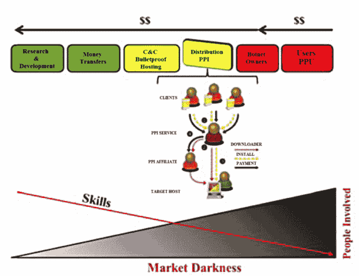

# 僵尸网络商业模式内部|麻省理工科技评论

> 原文：<https://www.technologyreview.com/s/611123/inside-the-business-model-for-botnets/?utm_source=wanqu.co&utm_campaign=Wanqu+Daily&utm_medium=website>

今天，由于荷兰特温特大学的 C.G.J .普特曼和他的几个同事的工作，我们得到了某种答案。“毫不奇怪，使用僵尸网络的主要动机是为了经济利益，”他们在绘制成本和收入流时说道。

僵尸网络本质上是一个由计算机、智能手机或智能设备组成的网络，可以被未经授权的攻击者控制。通过用恶意软件感染每个设备来创建网络，该恶意软件经由标准的基于网络的协议与控制器和其他设备通信。然后，控制器可以用各种邪恶的方式操纵僵尸网络中的设备。

当然，建立这样一个系统需要相当大的费用。首先是必要的研究和开发，以发现操作系统中的漏洞，然后编写可以利用这些漏洞的代码。

这是一项高度专业化的任务。Putnam 等人认为，规划和执行一个能够在国家或国际范围内攻击互联网基础设施的僵尸网络需要大量的专家，包括漏洞分析师、漏洞利用开发者、测试者和管理者——在僵尸网络攻击美国的情况下，可能需要数百名专家。这种系统需要大约两年的时间来计划和执行。

一旦恶意软件被开发出来，它就需要被传播。有趣的是，许多所需的服务可以很容易地在网上购买。例如，潜在的僵尸网络主人可以利用按安装付费的服务来建立网络。这些可以在黑网上买到，安装恶意软件的固定费用为每台设备 2 到 10 美分。

这项服务可能依赖于现有的僵尸网络，这就是为什么感染了一种恶意软件的计算机通常很快就会被其他类型的恶意软件淹没。

一些虚拟主机运营商也提供“防弹”服务，这基本上是一种不问问题的数据存储形式，给客户很大的回旋余地。这对于想要成为机器人大师的人来说肯定很方便。

此外，一旦网络建立起来，还有维护网络的费用。恶意软件将以一定的速度从设备中删除，可能是因为操作系统已经打了补丁或发布了反恶意软件来对抗它。在不太复杂的设备上，如支持互联网的摄像头，恶意软件可以通过重启来删除。