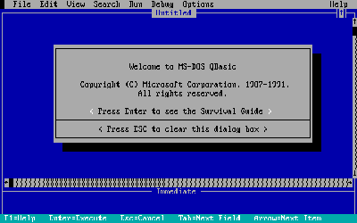
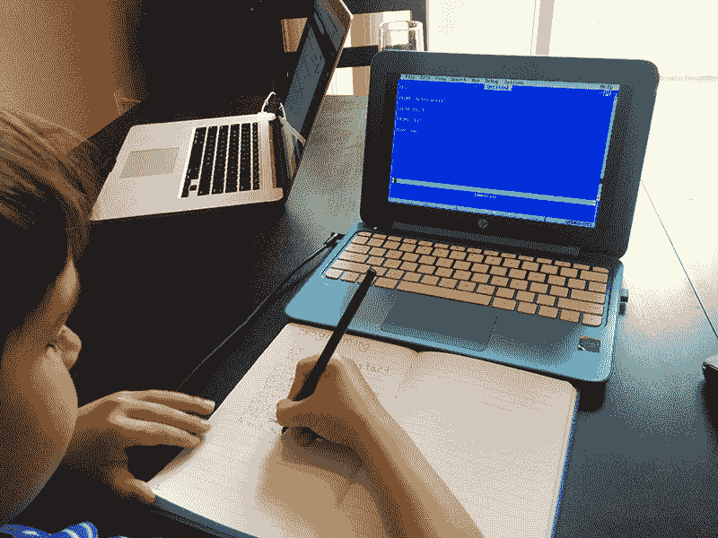
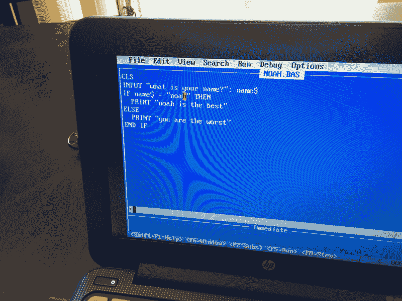
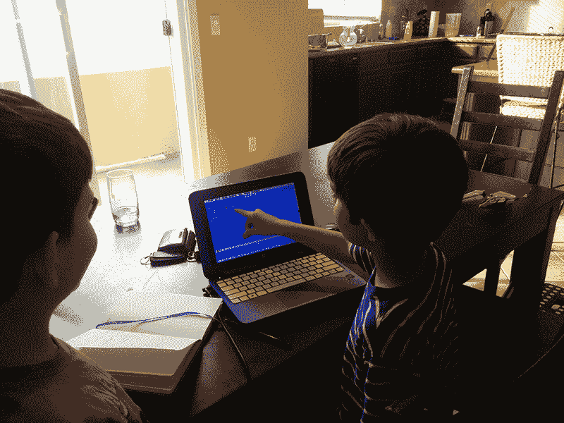
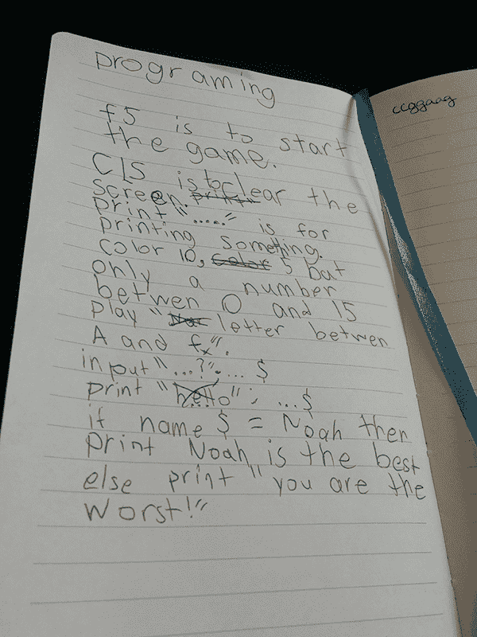

# 30 年后，QBasic 仍然是最好的|个人注册表编辑器

> 原文：<http://www.nicolasbize.com/blog/30-years-later-qbasic-is-still-the-best/?utm_source=wanqu.co&utm_campaign=Wanqu+Daily&utm_medium=website>

*(5 分钟阅读)*

我的大儿子诺亚三个月前满 7 岁。如果他可以用他的家人来换取一次 2 小时的 minecraft 游戏，他会毫不犹豫地这么做。他生命中的另一个爱好是超级马里奥制造机，看到他玩我在他这个年龄时玩过的同样的游戏和水平是一件令人兴奋的事情。大约 5 个月前，我离开了我的家人去参加我一年一度的 [ludum dare](http://ludumdare.com/compo/) 朝圣之旅:一个游戏开发比赛，在这个比赛中，我把自己和朋友锁在一起，回到原始穴居人的状态，48 小时不睡觉，从头开始创建一个完整的游戏(在这篇文章的结尾玩吧！)当我自豪地向妻子展示我革命性的 AAA 头衔时，诺亚自然被激起了兴趣，我向他介绍了代码世界，向他展示了简单的单词(他刚刚学会如何阅读)如何制作出一个实际的游戏。从那天起，诺亚就不断地要求我教他如何制作自己的电子游戏。在过去的 5 个月里，我一直在为孩子们寻找语言/IDE 的圣杯，希望将兴趣的火花转化为难忘的经历……

我的探索让我去了无数的论坛，在那里我尝试了无数的建议:SmallBasic、Pico-8、Smalltalk、Scratch 等等。我甚至询问了斯塔克伟弗洛的伟大神谕，但毫无结果。5 个月后，我得到了一个令人失望的结论:没有什么东西比得上我在另一个时代的东西。30 年后，在发现编程方面，QBasic 仍然是最好的。

> “OMG 请不要教他 GOTOs！!"

```
10 PRINT “OH NO, WHAT ARE YOU DOING?!!!”
20 GOTO 10
```

是的，QBasic 是一种糟糕的过程语言。它引入了被广泛认为有害的概念，使用了笨拙的隐式声明语法，不区分大小写，不基于零，等等。这样的例子不胜枚举……当发展一项技能时，最好从一开始就获得正确的反应，而不是不得不纠正多年的坏习惯。按照这个建议，我应该从我喜欢的 ruby 语言的基础开始。然而，虽然这些 QBasic 概念中的大多数在今天被我们的同行普遍认为是危险信号，但它们在当时都有一个非常特定的目的:保持语言的简单和可访问性，这是一个其他语言都已经放弃的概念，以支持灵活性、复杂性和逻辑性。

今天我在我儿子的 11 英寸 HP Stream 上安装了 QBasic，不得不破解一个 DOSBox 手动安装。他双击了桌面上的图标，一瞬间，我们进入了 IDE，迎接我们的是一个介绍屏幕，这个屏幕给我带来了太多的回忆:



然后我告诉 Noah，有一个非常神圣的仪式，任何进入秘密的程序员核心圈子的人都必须以一个问候其他程序员的程序开始。当我口授公式时，他慢慢地寻找每一个键，小心地用他的右手手指键入神奇的单词:`PRINT “hello world”`

他按下 F5 键，当他看到自己的代码被编译成文本呈现在他的黑屏上时，显得很惊讶。他微笑着，和我击掌，然后在他的小笔记本上草草记下代码，以便他以后能记住。



我们接着使用了几个命令:CLS、颜色、播放、输入和 IF。没有什么需要解释的:没有复杂性，没有笨拙的操作符，没有抽象的概念，没有需要阅读的文档，没有对象/类/方法的概念，没有要安装的框架，没有 IDE 中铺天盖地的菜单/按钮，没有特殊的关键字或括号。这是最纯粹的简单形式的代码。

不到一个小时后，他自己编写了他的第一个程序——一个互动的和难以置信的微妙的应用程序，让你知道计算机对你作为一个独立和理智的人的感觉:



…他非常自豪地为他的堂兄和最好的朋友克里斯蒂安跑了一趟:


之后他开始简单地解释他的**是如何工作的以及代码在做什么！**

 **

就这样，在一个小时内，我 7 岁的儿子不仅编写了他的第一个文字游戏，还体验了创建、编译和执行他自己的小程序所带来的乐趣和兴奋。奖励积分，这一切都适合在一个单一的笔记本页面:



我很高兴他能够理解为什么我一直说我有世界上最好的工作。 我今天唯一的遗憾是意识到，30 多年来，我们没能为我们的孩子想出更好的东西:Qbasic 只有有限的一组简单的关键字(整个帮助可以放在一个 F1 屏幕上，并且充满了简单的例子！)，不会用任何视觉伪像分散编码人员的注意力，有一个非常有限和舒适的开发环境，尽可能早地显示错误，用一个键在心跳中编译和执行代码，并且非常简单。我们已经构建了更健壮、更复杂的语言/框架/ide(这对于任何现实生活中的应用程序来说都是必不可少的)，但我们从未真正比 QBasic 更简单、更直接地体验编程的刺激。对于使用现代 Mac/PC/Linux 机器的新手来说，即使今天运行 QBasic 也变得很可怕，而过去只需要在 A:\ disk drive 中插入一张 3.5 英寸的软盘……

说够了，今天是为了庆祝又一个发现编程的兴奋和美丽的人！

干杯！

(如约而至，[我的 AAA 头衔](http://nicolasbize.com/ld34/)，为此我等待 EA 购买版权的电话)**