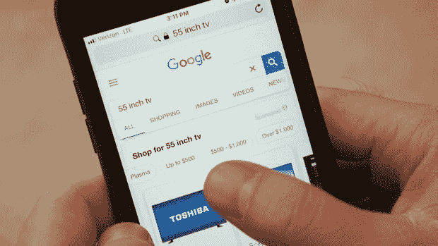
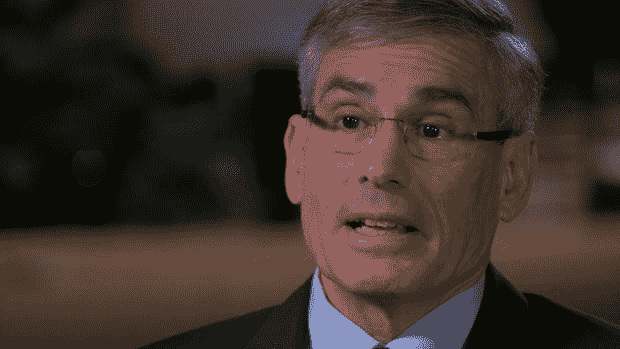
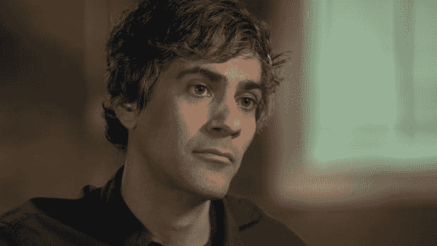
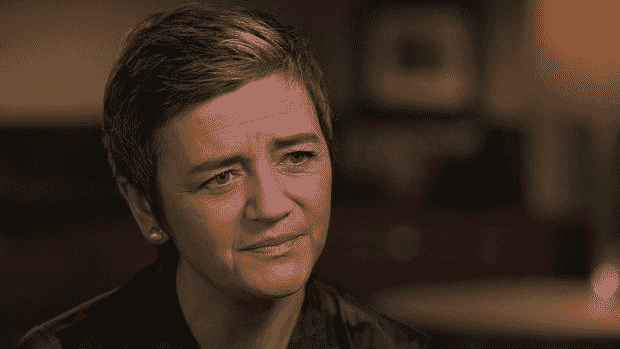

# 谷歌是怎么变得这么大的？—60 分钟-哥伦比亚广播公司新闻

> 原文：<https://www.cbsnews.com/news/how-did-google-get-so-big/?utm_source=wanqu.co&utm_campaign=Wanqu+Daily&utm_medium=website>

过去一周，美国联邦贸易委员会被要求调查谷歌在其安卓操作系统上收集的数据，世界上大多数智能手机都使用安卓操作系统。这是新闻周期中的一个小插曲，但又一次表明，美国和欧洲越来越担心脸书、亚马逊和谷歌等科技巨头在过去 20 年里积累的巨大、基本上不受控制的权力。在这三者中，谷歌是 Alphabet 控股公司的一部分，它是最强大、最有趣的，并且在我们的生活中无处不在。事情就是这样发生的。

大多数人喜欢谷歌。它改变了我们的世界，融入了我们的生活，变得不可或缺。你可能甚至不需要在电脑上输入 Google.com，这通常是默认设置，这是谷歌花了数十亿美元获得的竞争优势。别担心。谷歌现在的价值超过了 75 万亿美元，你不会意外地变得这么大。

自 2004 年上市以来，谷歌已经收购了 200 多家公司，扩大了其在互联网上的影响力。它收购了最大的视频平台 YouTube。它收购了全球 80%的智能手机运行的操作系统 Android，还收购了分发全球大部分数字广告的 DoubleClick，所有这些都没有引起华盛顿监管机构的注意。

史蒂夫·克罗夫特:这些收购中有没有受到司法部反垄断部门的质疑？

加里·雷巴克:有些被调查了，但只是表面上，政府真的没有执行我们的反垄断法。事情就是这样。这些收购都没有受到质疑。

Gary Reback 是美国最著名的反垄断律师之一，他在上世纪 90 年代说服司法部起诉微软，这是针对大型科技公司的最后一起重大反垄断案件。现在，他正在与谷歌竞争。

史蒂夫·克罗夫特:你认为谷歌是垄断者吗？

加里·里巴克:哦，是的，当然谷歌是垄断的。事实上，他们垄断了几个市场。他们是搜索领域的垄断者。他们是搜索广告的垄断者。

这些技术还不到 25 年，与一个世纪前的铁路和标准石油等行业垄断相比可能显得微不足道，但瑞巴克表示，谷歌没有什么不重要的。

#### “人们告诉他们的搜索引擎一些他们甚至不会告诉他们妻子的事情...这让控制它的公司对我们整个社会的控制达到了令人难以置信的程度。

加里·里巴克:谷歌让互联网运转起来。没有搜索引擎，我们就无法访问互联网

史蒂夫·克罗夫特:他们控制着它。

加里·雷巴克:他们控制着对它的访问。这是最重要的部分。谷歌是万维网和我们所知的互联网的看门人。今天，它的重要性丝毫不亚于约翰·洛克菲勒垄断石油时的石油。 *T2】*

Gary Reback, an antitrust lawyer who persuaded the Justice Department to sue Microsoft in the 90s CBS News

去年，谷歌进行了全球 90%的互联网搜索。当数十亿人问了数万亿个问题时，是谷歌使用只有谷歌知道的计算机算法提供了答案。

乔纳森·塔普林:他们有这样一句话，“竞争只是一次点击。”他们没有竞争对手。他们的竞争对手必应拥有 2%的市场份额。他们有 90%。

Jonathan Taplin 是数字媒体专家，也是南加州大学 Annenberg 创新实验室的名誉主任。他说，谷歌的专长可能是技术，但它的业务是广告。它最有价值的商品是关于我们的高度专业化的信息。它帮助谷歌控制了大约 60%的全球互联网广告收入。Taplin 说，传统公司无法竞争，因为他们没有数据。

乔纳森·塔普林:他们知道你是谁，你在哪里，你刚买了什么，你可能想买什么。因此，如果我是一个广告客户，我说，“我想要田纳西州纳什维尔的 24 岁女性，她们开卡车，喝波旁酒，”我可以在谷歌上这样做。

加里·里巴克:人们告诉他们的搜索引擎一些他们甚至不会告诉他们妻子的事情。我的意思是，这是一项非常强大而又非常私密的技术。这使得控制它的公司对我们整个社会的控制达到了令人难以置信的程度。

谷歌在搜索和搜索广告领域占据主导地位，以至于硅谷的分析师和风险资本家表示，如果创业公司的商业模式要求它们与谷歌竞争广告收入，那么它们极难获得资金。

十多年前，杰里米·斯托佩尔曼(Jeremy Stoppelman)共同创立了 Yelp 一个收集从汽车修理工到全国餐馆等各种本地评论的网站，并通过销售广告赚钱。

杰里米·斯托佩尔曼:谷歌最初的承诺是组织全世界的信息。最终这表现在你期望顶部链接，它显示在页面顶部的东西是网络上最好的。世界上最好的东西。我可以告诉你事实并非如此。情况不再是这样了。

斯托佩尔曼说，谷歌不是在做对消费者最有利的事情，而是在做对谷歌最有利的事情。

杰里米·斯托佩尔曼:如果我今天开始，我就没有机会创建 Yelp。这个机会已经被谷歌和他们的方法关闭了。

史蒂夫·克罗夫特:在什么方面？

杰里米·斯托佩尔曼:因为如果你在这些类别中的某一个提供了对谷歌有利可图的优秀内容，并被视为潜在的威胁，他们会扼杀你。

史蒂夫·克罗夫特:什么叫扼杀你？

杰里米·斯托佩尔曼:他们会让你消失。他们会埋葬你。

Jeremy Stoppelman, co-founder of Yelp CBS News

Yelp 和无数其他网站依靠谷歌为他们带来网络流量——广告客户的眼球。但是现在 Stoppelman 说他们在最有利可图的市场上最大的竞争对手是 Google。他说，谷歌正在收集和捆绑自己的购物和旅游信息，并将其放在搜索结果的最顶端，而不管它是否有价值。他向我们展示了如何通过谷歌搜索旧金山寿司。

杰里米·斯托佩尔曼:所有最好的房地产都在这里。这是消费者关注的焦点。这是设计好的。谷歌希望你关注他们的内容。

从地图到评论，这里的所有信息都归谷歌所有。斯托佩尔曼说，如果你点击页面顶部的任何链接，你可能会认为你去了另一个网站，但实际上你仍然会在谷歌上，看到它希望你看到的内容，同时它会收集你的个人信息，并可能向你展示谷歌广告。

史蒂夫·克罗夫特:如果你点击这个盒子里的任何东西，你就能留在谷歌上，他们就能赚更多的钱？

杰里米·斯托佩尔曼:没错。

#### “谷歌在整个行业拥有巨大的影响力。他们制定规则。问题是谁在看着谷歌？”

谷歌告诉我们，这和钱没有任何关系，这是为了改进产品，通过消除点击许多其他网站的需要，使搜索对客户来说更快更容易。

斯托佩尔曼说，这是关于扼杀竞争，把它推到页面上不太可能被看到的地方。他说，如果你在智能手机上查看搜索结果，这种优势会更加明显。

Jeremy Stoppelman:这就是你的手机在你手掌上的样子。这都是谷歌自己的财产，就在这里。它占据了整个屏幕。

史蒂夫·克罗夫特:第一页有多重要？

杰里米·斯托佩尔曼:不仅仅是第一页，页面上的前几个链接是用户注意力的主要来源，也是流量的主要来源。

史蒂夫·克罗夫特:所以如果你不在页面的顶部或者第一页的底部，或者第二页，那会影响你的业务吗？

杰里米·斯托佩尔曼:是的，如果你在第二页，忘记它，你不是一个真正的企业。

Yelp、微软、亚马逊、易贝、Expedia 和雅虎都抱怨谷歌的主导地位，以及他们所谓的对美国联邦贸易委员会的反竞争行为，后者在 2011 年进行了一项调查。

根据一份机密备忘录——其中部分内容在多年后被无意中交给了《华尔街日报》——美国联邦贸易委员会竞争局建议对谷歌的一些商业行为提起反垄断诉讼。它表示，“谷歌处于独一无二的地位，能够‘创造或摧毁任何基于网络的业务’”，“通过反竞争手段加强了对搜索和搜索广告的垄断”，并“阻止了竞争对手和潜在竞争对手挑战这些垄断的能力”。“它特别提到谷歌窃取竞争对手的内容，并对广告商和其他网站施加限制，限制他们利用其他搜索引擎的能力。但是这些建议被拒绝。

加里·雷巴克:它直截了当地说谷歌的行为是反竞争的。它直截了当地说谷歌的行为伤害了消费者。我是说，你还需要知道什么才能否决投诉？这是你自己的员工写的。然而，什么也没发生。

史蒂夫·克罗夫特:他们结案了？

加里·雷巴克:他们已经结案了，对吗？

联邦贸易委员会的委员们决定，谷歌的行为可以通过自愿改善其一些商业行为来解决，谷歌将自己的产品移至搜索页面顶部的决定似乎对消费者有利。但雷巴克和其他直接参与调查的人一直怀疑调查结果与谷歌在华盛顿的政治影响力及其与奥巴马政府的密切关系有关。谷歌去年花在游说上的钱比任何其他公司都多，雇佣了 25 家不同的公司，并资助了 300 个贸易协会、智囊团和其他团体，其中许多团体影响政策。

加里·雷巴克:他们在所有涉及这个问题的讨论中都有一席之地。他们知道我们从未听说过的发展。所以从我的角度来看，他们的影响是非常非常难以挑战的。

目前，唯一对谷歌和大型科技公司的力量采取积极行动的是欧盟竞争专员玛格丽特·韦斯塔格尔。在她任职的四年里，韦斯塔格尔成了硅谷的眼中钉，因违反合并规定对脸书罚款 1.22 亿美元，并命令爱尔兰追缴苹果公司拖欠的 150 亿美元税款。去年夏天，她对谷歌开出了创纪录的 27 亿美元罚单，原因是谷歌剥夺了某些竞争对手与其竞争的机会。

Margrethe Vestager, the competition commissioner for the European Union CBS News

玛格丽特·维斯特格:正如我钦佩谷歌在过去十年中的一些创新一样，我希望他们的非法行为停止。

史蒂夫·克罗夫特:这就是你感觉已经发生的事情。

玛格丽特·维斯特格:我们不仅能感觉到，我们还能证明这一点。

在研究这个案例时，Vestager 说，她的员工浏览了 17 亿次谷歌搜索查询，发现谷歌正在操纵其秘密搜索公式——或算法——来推广自己的产品和服务，并让其竞争对手被遗忘。

玛格丽特·维斯特格:很难找到对手。因为平均来说，你只能在搜索结果的第四页找到它们。

史蒂夫·克罗夫特:为什么在这么远的地方？

玛格丽特·维斯特格:嗯，因为那样你就找不到它们了。我不知道有谁会在搜索结果中翻到第四页。开玩笑地说，你可以说这是你应该保守秘密的地方。因为从来没有人去过那里。

史蒂夫·克罗夫特:你认为这是谷歌方面有意为之吗？

玛格丽特·维斯特格:是的。我们认为这是故意的。

史蒂夫·克罗夫特:他们是怎么做到的？我想每个人都认为谷歌有这个算法。他们把最好的搜索放在最上面。

玛格丽特·维斯特格:嗯，这正是算法在做的事情。谷歌自身的提升和其他人的降级。

史蒂夫·克罗夫特:所以，他们在操纵比赛。

玛格丽特·维斯特格:是的。这是非法的。

谷歌已经支付了 27 亿美元的罚款，并正在积极上诉。但是现在，斯托佩尔曼说，每个人都还在按照谷歌的规则玩。

史蒂夫·克罗夫特:如果你在做生意，你必须上谷歌。

杰里米·斯托佩尔曼:是的。谷歌在整个行业掌握着巨大的权力。他们制定规则。问题是谁在看着谷歌？

谷歌拒绝了我们就此事采访其一名高管的请求，但在对我们问题的书面回复中，该公司否认自己在搜索或搜索广告领域处于垄断地位，并列举了包括亚马逊和脸书在内的许多竞争对手。它表示，它不会改变算法以使竞争对手处于不利地位，并且“我们的责任是向我们的用户提供尽可能最好的结果，而不是在我们的结果中为网站提供特定的位置。我们理解那些排名下降的网站会不高兴，可能会公开投诉。”

玛丽亚·加夫里洛维奇制作。副制片人亚历克斯·奥尔蒂斯。

[Steve Kroft](https://www.cbsnews.com/search/author/steve-kroft/)

二十多年来，史蒂夫·克罗夫特的《60 分钟》节目所产生的影响和知名度，很少有记者能达到。克罗夫特在 1989 年发表了他的第一份 60 分钟报告。

