# 2022 年的 19 项新搜索引擎优化技术

> 原文：<https://backlinko.com/seo-techniques?utm_source=wanqu.co&utm_campaign=Wanqu+Daily&utm_medium=website>

这是**更新的** SEO 技术列表。

这些是我用来每月产生 438，950 名有机访客的相同策略:

<picture><source type="image/webp" srcset="https://api.backlinko.com/app/uploads/2021/10/backlinko-users-september-2021.webp 2400w, https://api.backlinko.com/app/uploads/2021/10/backlinko-users-september-2021-300x139.webp 300w, https://api.backlinko.com/app/uploads/2021/10/backlinko-users-september-2021-1280x595.webp 1280w, https://api.backlinko.com/app/uploads/2021/10/backlinko-users-september-2021-768x357.webp 768w, https://api.backlinko.com/app/uploads/2021/10/backlinko-users-september-2021-1536x714.webp 1536w, https://api.backlinko.com/app/uploads/2021/10/backlinko-users-september-2021-2048x951.webp 2048w, https://api.backlinko.com/app/uploads/2021/10/backlinko-users-september-2021-480x223.webp 480w, https://api.backlinko.com/app/uploads/2021/10/backlinko-users-september-2021-640x297.webp 640w, https://api.backlinko.com/app/uploads/2021/10/backlinko-users-september-2021-960x446.webp 960w, https://api.backlinko.com/app/uploads/2021/10/backlinko-users-september-2021-1440x669.webp 1440w, https://api.backlinko.com/app/uploads/2021/10/backlinko-users-september-2021-1600x743.webp 1600w, https://api.backlinko.com/app/uploads/2021/10/backlinko-users-september-2021-1920x892.webp 1920w" sizes="(max-width: 600px) 100vw, 600px">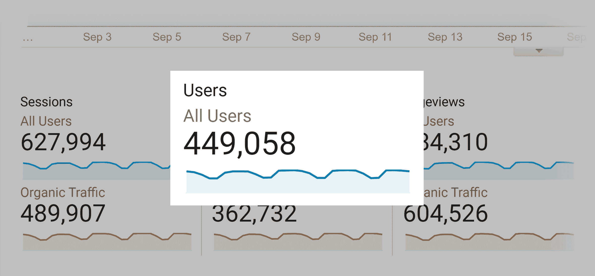</picture>

让我们开始吧:

以下是你将在本帖中学到的策略。

## **1。在 Reddit 上发现未使用的关键词**

Reddit 是关键词研究的金矿。

(尤其是找[长尾关键词](https://backlinko.com/long-tail-keywords "Long Tail Keywords")的时候。)

以下是如何使用 Reddit 进行关键词研究的具体方法。

首先，去 Reddit。如果你已经知道一个你的目标受众经常出没的子区域，那就直接去那里。

例如，假设你想写一篇关于旧石器时代饮食的文章。你想去 r/paleo 亚雷迪特。

<picture><source type="image/webp" srcset="https://api.backlinko.com/app/uploads/2020/12/reddit-paleo-subreddit.webp 2560w, https://api.backlinko.com/app/uploads/2020/12/reddit-paleo-subreddit-300x229.webp 300w, https://api.backlinko.com/app/uploads/2020/12/reddit-paleo-subreddit-1280x979.webp 1280w, https://api.backlinko.com/app/uploads/2020/12/reddit-paleo-subreddit-768x587.webp 768w, https://api.backlinko.com/app/uploads/2020/12/reddit-paleo-subreddit-1536x1174.webp 1536w, https://api.backlinko.com/app/uploads/2020/12/reddit-paleo-subreddit-2048x1566.webp 2048w, https://api.backlinko.com/app/uploads/2020/12/reddit-paleo-subreddit-480x367.webp 480w, https://api.backlinko.com/app/uploads/2020/12/reddit-paleo-subreddit-640x489.webp 640w, https://api.backlinko.com/app/uploads/2020/12/reddit-paleo-subreddit-960x734.webp 960w, https://api.backlinko.com/app/uploads/2020/12/reddit-paleo-subreddit-1440x1101.webp 1440w, https://api.backlinko.com/app/uploads/2020/12/reddit-paleo-subreddit-1600x1223.webp 1600w, https://api.backlinko.com/app/uploads/2020/12/reddit-paleo-subreddit-1920x1468.webp 1920w" sizes="(max-width: 600px) 100vw, 600px">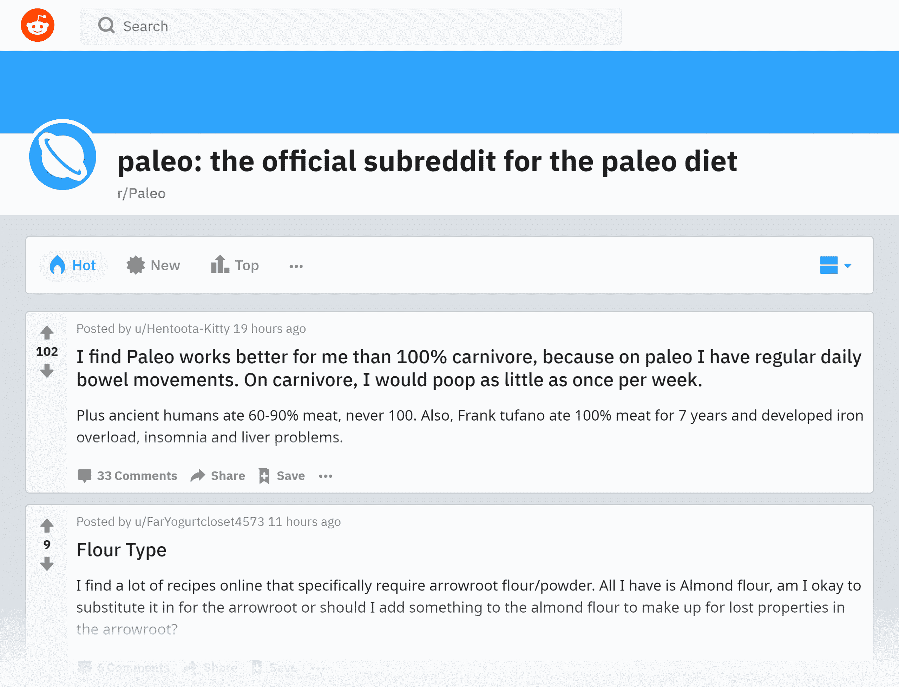</picture>

如果你不确定你的读者在 Reddit 上的位置，不用担心。

只需搜索您的主题…

<picture><source type="image/webp" srcset="https://api.backlinko.com/app/uploads/2020/12/reddit-search-link-building.webp 2103w, https://api.backlinko.com/app/uploads/2020/12/reddit-search-link-building-300x21.webp 300w, https://api.backlinko.com/app/uploads/2020/12/reddit-search-link-building-1280x91.webp 1280w, https://api.backlinko.com/app/uploads/2020/12/reddit-search-link-building-768x55.webp 768w, https://api.backlinko.com/app/uploads/2020/12/reddit-search-link-building-1536x110.webp 1536w, https://api.backlinko.com/app/uploads/2020/12/reddit-search-link-building-2048x146.webp 2048w, https://api.backlinko.com/app/uploads/2020/12/reddit-search-link-building-480x34.webp 480w, https://api.backlinko.com/app/uploads/2020/12/reddit-search-link-building-640x46.webp 640w, https://api.backlinko.com/app/uploads/2020/12/reddit-search-link-building-960x68.webp 960w, https://api.backlinko.com/app/uploads/2020/12/reddit-search-link-building-1440x103.webp 1440w, https://api.backlinko.com/app/uploads/2020/12/reddit-search-link-building-1600x114.webp 1600w, https://api.backlinko.com/app/uploads/2020/12/reddit-search-link-building-1920x137.webp 1920w" sizes="(max-width: 600px) 100vw, 600px"></picture>

…并查看出现了哪些线程和子线程。

<picture><source type="image/webp" srcset="https://api.backlinko.com/app/uploads/2020/12/reddit-search-results-link-building.webp 2560w, https://api.backlinko.com/app/uploads/2020/12/reddit-search-results-link-building-300x283.webp 300w, https://api.backlinko.com/app/uploads/2020/12/reddit-search-results-link-building-1280x1210.webp 1280w, https://api.backlinko.com/app/uploads/2020/12/reddit-search-results-link-building-768x726.webp 768w, https://api.backlinko.com/app/uploads/2020/12/reddit-search-results-link-building-1536x1451.webp 1536w, https://api.backlinko.com/app/uploads/2020/12/reddit-search-results-link-building-2048x1935.webp 2048w, https://api.backlinko.com/app/uploads/2020/12/reddit-search-results-link-building-480x454.webp 480w, https://api.backlinko.com/app/uploads/2020/12/reddit-search-results-link-building-640x605.webp 640w, https://api.backlinko.com/app/uploads/2020/12/reddit-search-results-link-building-960x907.webp 960w, https://api.backlinko.com/app/uploads/2020/12/reddit-search-results-link-building-1440x1361.webp 1440w, https://api.backlinko.com/app/uploads/2020/12/reddit-search-results-link-building-1600x1512.webp 1600w, https://api.backlinko.com/app/uploads/2020/12/reddit-search-results-link-building-1920x1814.webp 1920w" sizes="(max-width: 600px) 100vw, 600px">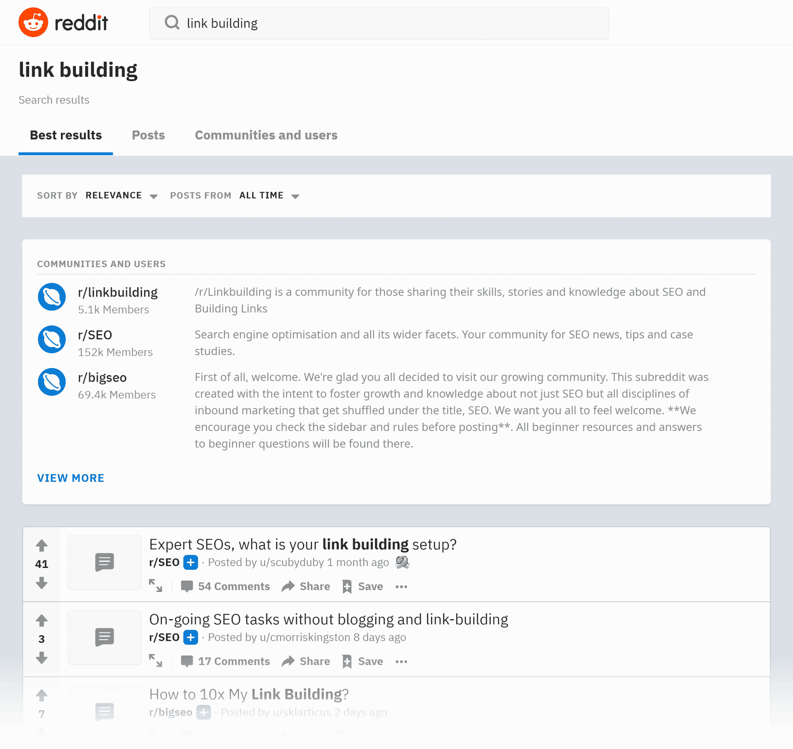</picture>

最后，寻找反复出现的术语。

如果人们在 Reddit 上谈论这些话题，他们很可能在谷歌上搜索相同的词汇。

例如，当我查看关于“链接建设”主题的帖子时，我注意到了“内容策略”和“内容策略”这样的术语。

<picture><source type="image/webp" srcset="https://api.backlinko.com/app/uploads/2020/12/keyword-ideas-in-reddit-comments.webp 2526w, https://api.backlinko.com/app/uploads/2020/12/keyword-ideas-in-reddit-comments-300x83.webp 300w, https://api.backlinko.com/app/uploads/2020/12/keyword-ideas-in-reddit-comments-1280x356.webp 1280w, https://api.backlinko.com/app/uploads/2020/12/keyword-ideas-in-reddit-comments-768x213.webp 768w, https://api.backlinko.com/app/uploads/2020/12/keyword-ideas-in-reddit-comments-1536x427.webp 1536w, https://api.backlinko.com/app/uploads/2020/12/keyword-ideas-in-reddit-comments-2048x569.webp 2048w, https://api.backlinko.com/app/uploads/2020/12/keyword-ideas-in-reddit-comments-480x133.webp 480w, https://api.backlinko.com/app/uploads/2020/12/keyword-ideas-in-reddit-comments-640x178.webp 640w, https://api.backlinko.com/app/uploads/2020/12/keyword-ideas-in-reddit-comments-960x267.webp 960w, https://api.backlinko.com/app/uploads/2020/12/keyword-ideas-in-reddit-comments-1440x400.webp 1440w, https://api.backlinko.com/app/uploads/2020/12/keyword-ideas-in-reddit-comments-1600x445.webp 1600w, https://api.backlinko.com/app/uploads/2020/12/keyword-ideas-in-reddit-comments-1920x534.webp 1920w" sizes="(max-width: 600px) 100vw, 600px">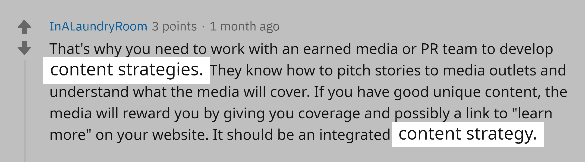</picture>

这些是我自己都不会想到的关键词。感谢 Reddit！

## 2.为谷歌 RankBrain 优化你的网站

不久前，谷歌公布了他们的 RankBrain 算法。

<picture><source type="image/webp" srcset="https://api.backlinko.com/app/uploads/2018/10/bloomberg-rankbrain-article.webp 2319w, https://api.backlinko.com/app/uploads/2018/10/bloomberg-rankbrain-article-300x227.webp 300w, https://api.backlinko.com/app/uploads/2018/10/bloomberg-rankbrain-article-1280x968.webp 1280w, https://api.backlinko.com/app/uploads/2018/10/bloomberg-rankbrain-article-768x581.webp 768w, https://api.backlinko.com/app/uploads/2018/10/bloomberg-rankbrain-article-1536x1161.webp 1536w, https://api.backlinko.com/app/uploads/2018/10/bloomberg-rankbrain-article-2048x1548.webp 2048w, https://api.backlinko.com/app/uploads/2018/10/bloomberg-rankbrain-article-480x363.webp 480w, https://api.backlinko.com/app/uploads/2018/10/bloomberg-rankbrain-article-640x484.webp 640w, https://api.backlinko.com/app/uploads/2018/10/bloomberg-rankbrain-article-960x726.webp 960w, https://api.backlinko.com/app/uploads/2018/10/bloomberg-rankbrain-article-1440x1089.webp 1440w, https://api.backlinko.com/app/uploads/2018/10/bloomberg-rankbrain-article-1600x1209.webp 1600w, https://api.backlinko.com/app/uploads/2018/10/bloomberg-rankbrain-article-1920x1451.webp 1920w" sizes="(max-width: 600px) 100vw, 600px">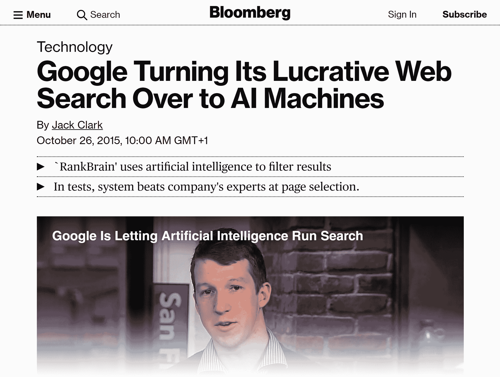</picture>

事实证明，这次更新改变了游戏规则。

为什么？

Google RankBrain 是谷歌的机器学习算法。这种新的 ML 算法使谷歌能够准确地衡量用户如何与搜索结果互动:

<picture><source type="image/webp" srcset="https://api.backlinko.com/app/uploads/2016/03/ux-signals.webp 1040w, https://api.backlinko.com/app/uploads/2016/03/ux-signals-300x349.webp 300w, https://api.backlinko.com/app/uploads/2016/03/ux-signals-768x894.webp 768w, https://api.backlinko.com/app/uploads/2016/03/ux-signals-480x558.webp 480w, https://api.backlinko.com/app/uploads/2016/03/ux-signals-640x745.webp 640w, https://api.backlinko.com/app/uploads/2016/03/ux-signals-960x1117.webp 960w" sizes="(max-width: 520px) 100vw, 520px">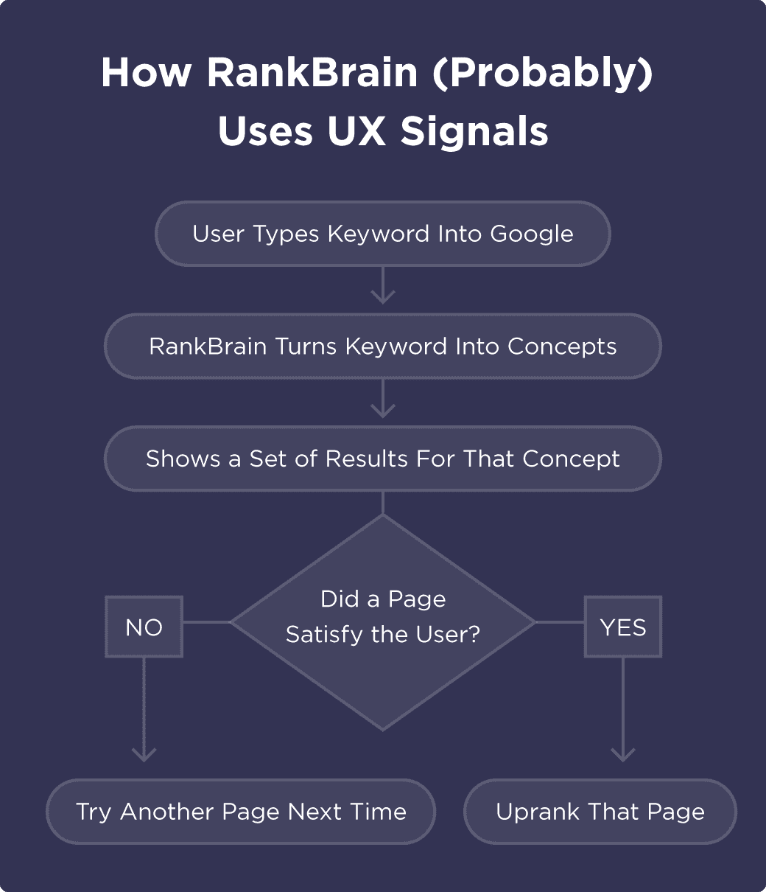</picture>

如你所见，你让谷歌的用户越开心，你的排名就越高。

当然，[反向链接](https://backlinko.com/hub/seo/backlinks "Backlinks")，关键词等传统信号还是很重要的。但是 RankBrain 变得越来越重要。

事实上，谷歌接着说，RankBrain 是他们的“前 3 名”排名信号之一:

<picture><source type="image/webp" srcset="https://api.backlinko.com/app/uploads/2020/02/googles-top-3-ranking-factors.webp 1200w, https://api.backlinko.com/app/uploads/2020/02/googles-top-3-ranking-factors-300x279.webp 300w, https://api.backlinko.com/app/uploads/2020/02/googles-top-3-ranking-factors-768x715.webp 768w, https://api.backlinko.com/app/uploads/2020/02/googles-top-3-ranking-factors-480x447.webp 480w, https://api.backlinko.com/app/uploads/2020/02/googles-top-3-ranking-factors-640x596.webp 640w, https://api.backlinko.com/app/uploads/2020/02/googles-top-3-ranking-factors-960x894.webp 960w" sizes="(max-width: 600px) 100vw, 600px">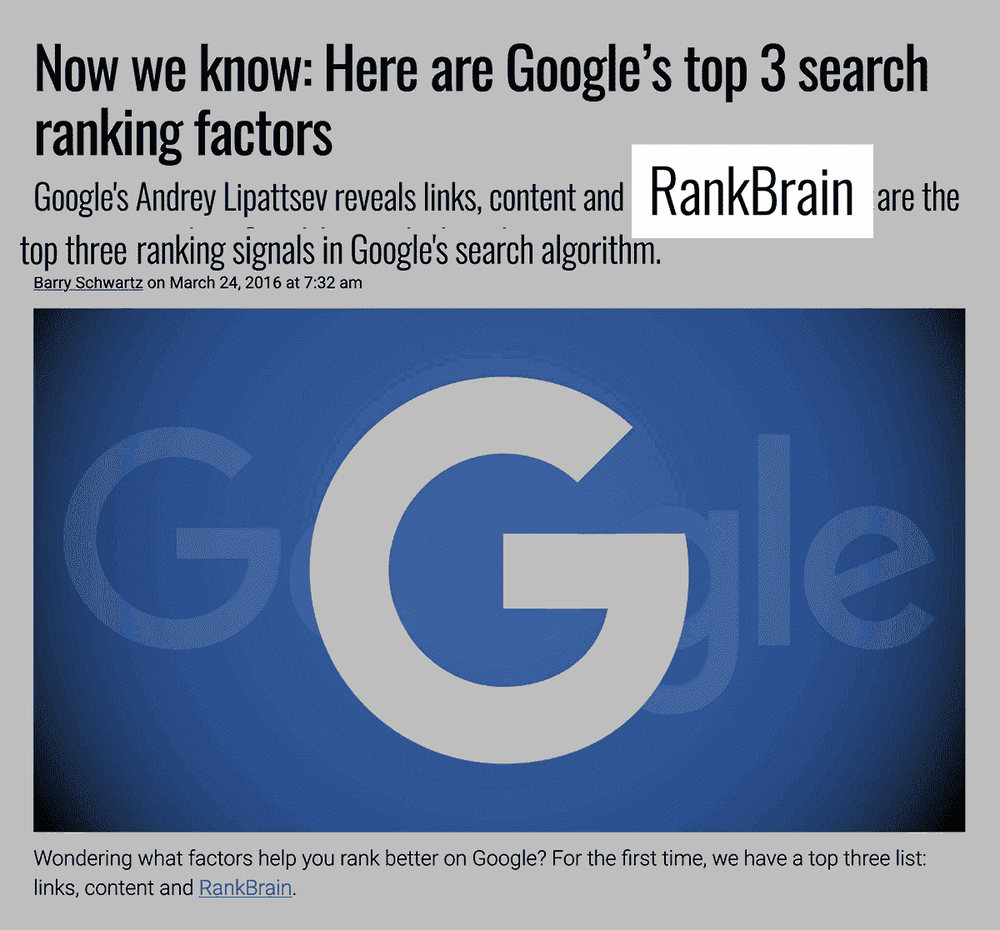</picture>

那么，如何为 Google RankBrain 优化你的站点呢？

这里有两个简单、易于实施的技巧，目前效果非常好:

**首先，提高你的有机点击率(CTR)。**

Google RankBrain 希望在搜索结果中看到很多人点击你的网站。

这告诉谷歌:

“人们喜欢这个结果。让我们把它放在页面顶部，这样更容易找到”。

<picture><source type="image/webp" srcset="https://api.backlinko.com/app/uploads/2020/12/pogo-stick-effect-up.webp 1600w, https://api.backlinko.com/app/uploads/2020/12/pogo-stick-effect-up-300x173.webp 300w, https://api.backlinko.com/app/uploads/2020/12/pogo-stick-effect-up-1280x740.webp 1280w, https://api.backlinko.com/app/uploads/2020/12/pogo-stick-effect-up-768x444.webp 768w, https://api.backlinko.com/app/uploads/2020/12/pogo-stick-effect-up-1536x888.webp 1536w, https://api.backlinko.com/app/uploads/2020/12/pogo-stick-effect-up-480x278.webp 480w, https://api.backlinko.com/app/uploads/2020/12/pogo-stick-effect-up-640x370.webp 640w, https://api.backlinko.com/app/uploads/2020/12/pogo-stick-effect-up-960x555.webp 960w, https://api.backlinko.com/app/uploads/2020/12/pogo-stick-effect-up-1440x833.webp 1440w" sizes="(max-width: 600px) 100vw, 600px">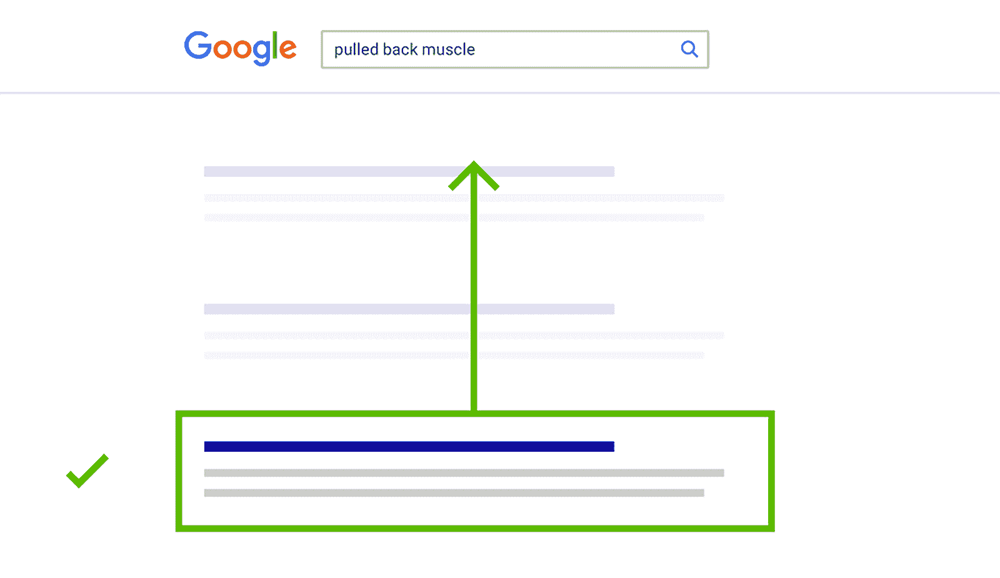</picture>

但是如果人们不点击你的结果呢？谷歌会像石头一样砸掉你的网站。

<picture><source type="image/webp" srcset="https://api.backlinko.com/app/uploads/2020/12/pogo-stick-effect-down.webp 1600w, https://api.backlinko.com/app/uploads/2020/12/pogo-stick-effect-down-300x177.webp 300w, https://api.backlinko.com/app/uploads/2020/12/pogo-stick-effect-down-1280x755.webp 1280w, https://api.backlinko.com/app/uploads/2020/12/pogo-stick-effect-down-768x453.webp 768w, https://api.backlinko.com/app/uploads/2020/12/pogo-stick-effect-down-1536x906.webp 1536w, https://api.backlinko.com/app/uploads/2020/12/pogo-stick-effect-down-480x283.webp 480w, https://api.backlinko.com/app/uploads/2020/12/pogo-stick-effect-down-640x378.webp 640w, https://api.backlinko.com/app/uploads/2020/12/pogo-stick-effect-down-960x566.webp 960w, https://api.backlinko.com/app/uploads/2020/12/pogo-stick-effect-down-1440x850.webp 1440w" sizes="(max-width: 600px) 100vw, 600px"></picture>

这就是为什么优化你的网站的有机 CTR 是如此重要。

获得更多点击的最简单的方法之一是在你的标题和描述标签中添加数字。

下面是我的一篇博文中的一个真实例子:

<picture><source type="image/webp" srcset="https://api.backlinko.com/app/uploads/2020/06/number-in-post-title.webp 2500w, https://api.backlinko.com/app/uploads/2020/06/number-in-post-title-300x192.webp 300w, https://api.backlinko.com/app/uploads/2020/06/number-in-post-title-1280x821.webp 1280w, https://api.backlinko.com/app/uploads/2020/06/number-in-post-title-768x492.webp 768w, https://api.backlinko.com/app/uploads/2020/06/number-in-post-title-1536x985.webp 1536w, https://api.backlinko.com/app/uploads/2020/06/number-in-post-title-2048x1313.webp 2048w, https://api.backlinko.com/app/uploads/2020/06/number-in-post-title-480x308.webp 480w, https://api.backlinko.com/app/uploads/2020/06/number-in-post-title-640x410.webp 640w, https://api.backlinko.com/app/uploads/2020/06/number-in-post-title-960x616.webp 960w, https://api.backlinko.com/app/uploads/2020/06/number-in-post-title-1440x923.webp 1440w, https://api.backlinko.com/app/uploads/2020/06/number-in-post-title-1600x1026.webp 1600w, https://api.backlinko.com/app/uploads/2020/06/number-in-post-title-1920x1231.webp 1920w" sizes="(max-width: 600px) 100vw, 600px">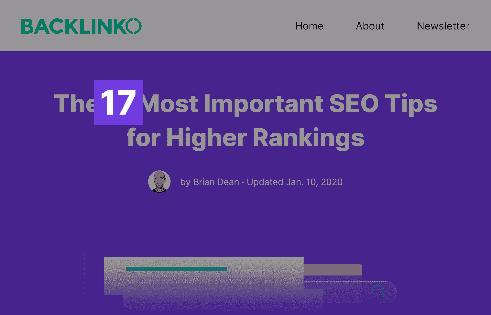</picture>

[研究显示](http://contentmarketinginstitute.com/2011/06/headline-click-through-rate/)在线用户更有可能点击包含数字的内容**。**

因此，当你在内容标题中(以及在你的[元描述](https://backlinko.com/hub/seo/meta-descriptions)中)包含一个数字时，你可以显著提高你的点击率。

接下来，提高你的反弹率和“停留时间”。

还是那句话，Google RankBrain 希望你发布的内容能让它的用户开心。

如果用户在 3 秒钟后离开你的网站(也称为“[弹跳](https://support.google.com/analytics/answer/1009409?hl=en)”)呢？那是一个用户体验信号，告诉谷歌，人们不喜欢你的内容。

事实上，[我对 1100 万个谷歌搜索结果的分析](https://backlinko.com/search-engine-ranking)发现，停留时间长的网站排名高于停留时间短的网站:

<picture><source type="image/webp" srcset="https://api.backlinko.com/app/uploads/2020/07/website-time-on-site-correlates-with-higher-google-rankings.webp 2200w, https://api.backlinko.com/app/uploads/2020/07/website-time-on-site-correlates-with-higher-google-rankings-300x209.webp 300w, https://api.backlinko.com/app/uploads/2020/07/website-time-on-site-correlates-with-higher-google-rankings-1280x893.webp 1280w, https://api.backlinko.com/app/uploads/2020/07/website-time-on-site-correlates-with-higher-google-rankings-768x536.webp 768w, https://api.backlinko.com/app/uploads/2020/07/website-time-on-site-correlates-with-higher-google-rankings-1536x1071.webp 1536w, https://api.backlinko.com/app/uploads/2020/07/website-time-on-site-correlates-with-higher-google-rankings-2048x1428.webp 2048w, https://api.backlinko.com/app/uploads/2020/07/website-time-on-site-correlates-with-higher-google-rankings-480x335.webp 480w, https://api.backlinko.com/app/uploads/2020/07/website-time-on-site-correlates-with-higher-google-rankings-640x446.webp 640w, https://api.backlinko.com/app/uploads/2020/07/website-time-on-site-correlates-with-higher-google-rankings-960x669.webp 960w, https://api.backlinko.com/app/uploads/2020/07/website-time-on-site-correlates-with-higher-google-rankings-1440x1004.webp 1440w, https://api.backlinko.com/app/uploads/2020/07/website-time-on-site-correlates-with-higher-google-rankings-1600x1116.webp 1600w, https://api.backlinko.com/app/uploads/2020/07/website-time-on-site-correlates-with-higher-google-rankings-1920x1339.webp 1920w" sizes="(max-width: 700px) 100vw, 700px">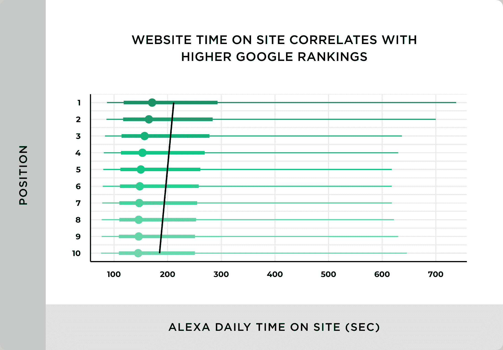</picture>

明白这是怎么回事了吗？你的跳出率越好，排名越靠前。

一般来说，搜索者在你的网站停留的时间越长，你的排名就越高。

你实际上如何提高你的停留时间和反弹率？

撰写引人注目的介绍，鼓励人们采取行动。

换句话说，避免这样的介绍:

<picture><source type="image/webp" srcset="https://api.backlinko.com/app/uploads/2016/03/boring-intro.webp 1900w, https://api.backlinko.com/app/uploads/2016/03/boring-intro-300x201.webp 300w, https://api.backlinko.com/app/uploads/2016/03/boring-intro-1280x858.webp 1280w, https://api.backlinko.com/app/uploads/2016/03/boring-intro-768x515.webp 768w, https://api.backlinko.com/app/uploads/2016/03/boring-intro-1536x1030.webp 1536w, https://api.backlinko.com/app/uploads/2016/03/boring-intro-480x322.webp 480w, https://api.backlinko.com/app/uploads/2016/03/boring-intro-640x429.webp 640w, https://api.backlinko.com/app/uploads/2016/03/boring-intro-960x644.webp 960w, https://api.backlinko.com/app/uploads/2016/03/boring-intro-1440x966.webp 1440w, https://api.backlinko.com/app/uploads/2016/03/boring-intro-1600x1073.webp 1600w" sizes="(max-width: 600px) 100vw, 600px">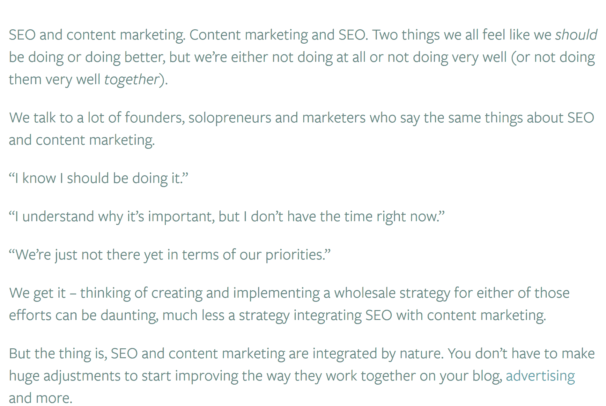</picture>

如果有人听到这个介绍，他们会尽快跳起来。

相反，直入主题，就像这样:

<picture><source type="image/webp" srcset="https://api.backlinko.com/app/uploads/2020/12/backlinko-optimize-for-voice-search-intro.webp 2500w, https://api.backlinko.com/app/uploads/2020/12/backlinko-optimize-for-voice-search-intro-300x247.webp 300w, https://api.backlinko.com/app/uploads/2020/12/backlinko-optimize-for-voice-search-intro-1280x1053.webp 1280w, https://api.backlinko.com/app/uploads/2020/12/backlinko-optimize-for-voice-search-intro-768x632.webp 768w, https://api.backlinko.com/app/uploads/2020/12/backlinko-optimize-for-voice-search-intro-1536x1263.webp 1536w, https://api.backlinko.com/app/uploads/2020/12/backlinko-optimize-for-voice-search-intro-2048x1684.webp 2048w, https://api.backlinko.com/app/uploads/2020/12/backlinko-optimize-for-voice-search-intro-480x395.webp 480w, https://api.backlinko.com/app/uploads/2020/12/backlinko-optimize-for-voice-search-intro-640x526.webp 640w, https://api.backlinko.com/app/uploads/2020/12/backlinko-optimize-for-voice-search-intro-960x790.webp 960w, https://api.backlinko.com/app/uploads/2020/12/backlinko-optimize-for-voice-search-intro-1440x1184.webp 1440w, https://api.backlinko.com/app/uploads/2020/12/backlinko-optimize-for-voice-search-intro-1600x1316.webp 1600w, https://api.backlinko.com/app/uploads/2020/12/backlinko-optimize-for-voice-search-intro-1920x1579.webp 1920w" sizes="(max-width: 600px) 100vw, 600px">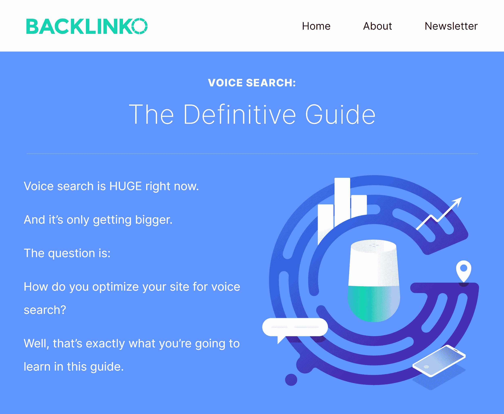</picture>

嘣。任何登陆那个页面的人都知道我的内容是关于什么的。

我还建议把你的内容分成小块，一口大小的块。

换句话说，您希望您的内容看起来像这样:

<picture><source type="image/webp" srcset="https://api.backlinko.com/app/uploads/2016/03/easy-to-read-copy.webp 1490w, https://api.backlinko.com/app/uploads/2016/03/easy-to-read-copy-300x230.webp 300w, https://api.backlinko.com/app/uploads/2016/03/easy-to-read-copy-1280x981.webp 1280w, https://api.backlinko.com/app/uploads/2016/03/easy-to-read-copy-768x589.webp 768w, https://api.backlinko.com/app/uploads/2016/03/easy-to-read-copy-480x368.webp 480w, https://api.backlinko.com/app/uploads/2016/03/easy-to-read-copy-640x491.webp 640w, https://api.backlinko.com/app/uploads/2016/03/easy-to-read-copy-960x736.webp 960w, https://api.backlinko.com/app/uploads/2016/03/easy-to-read-copy-1440x1104.webp 1440w" sizes="(max-width: 550px) 100vw, 550px">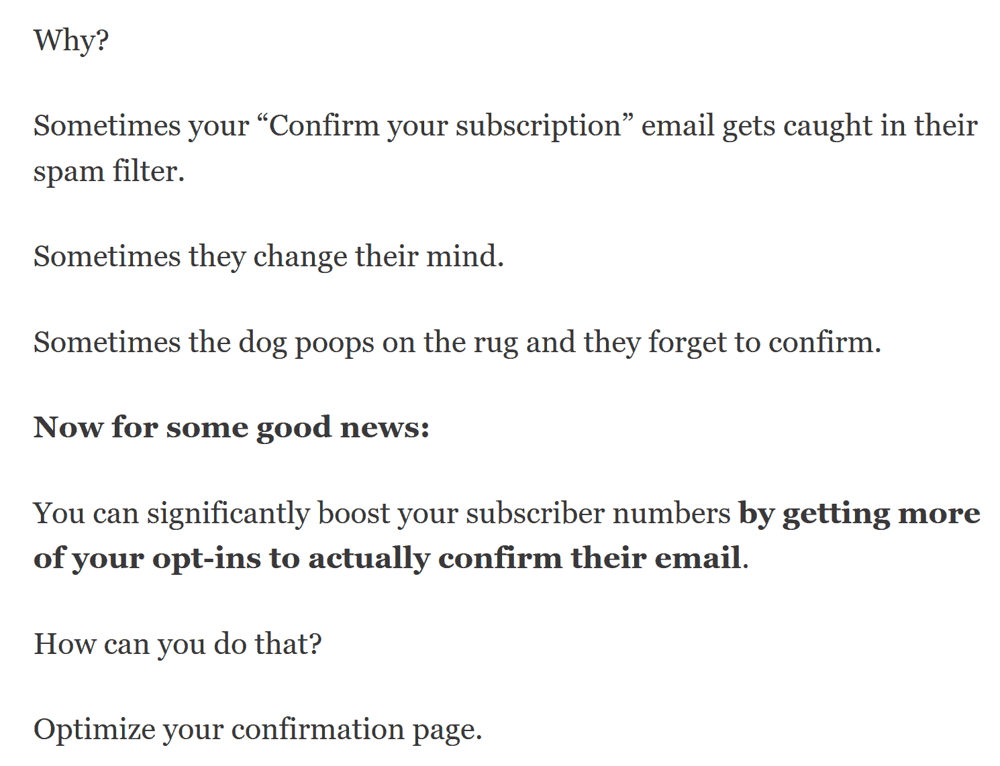</picture>

如你所见，这个副本非常容易阅读。

而且在手机或平板电脑上阅读特别容易。考虑到大多数谷歌搜索现在都是在移动设备上完成的，可读性对 SEO 来说比以往任何时候都更重要。

## **3。更新、升级和重新发布旧博客文章**

几年前，我突然收到一封电子邮件:

<picture><source type="image/webp" srcset="https://api.backlinko.com/app/uploads/2020/12/emil-email.webp 2279w, https://api.backlinko.com/app/uploads/2020/12/emil-email-300x385.webp 300w, https://api.backlinko.com/app/uploads/2020/12/emil-email-1280x1643.webp 1280w, https://api.backlinko.com/app/uploads/2020/12/emil-email-768x986.webp 768w, https://api.backlinko.com/app/uploads/2020/12/emil-email-1196x1536.webp 1196w, https://api.backlinko.com/app/uploads/2020/12/emil-email-1595x2048.webp 1595w, https://api.backlinko.com/app/uploads/2020/12/emil-email-480x616.webp 480w, https://api.backlinko.com/app/uploads/2020/12/emil-email-640x822.webp 640w, https://api.backlinko.com/app/uploads/2020/12/emil-email-960x1233.webp 960w, https://api.backlinko.com/app/uploads/2020/12/emil-email-1440x1849.webp 1440w, https://api.backlinko.com/app/uploads/2020/12/emil-email-1600x2054.webp 1600w, https://api.backlinko.com/app/uploads/2020/12/emil-email-1920x2465.webp 1920w" sizes="(max-width: 600px) 100vw, 600px">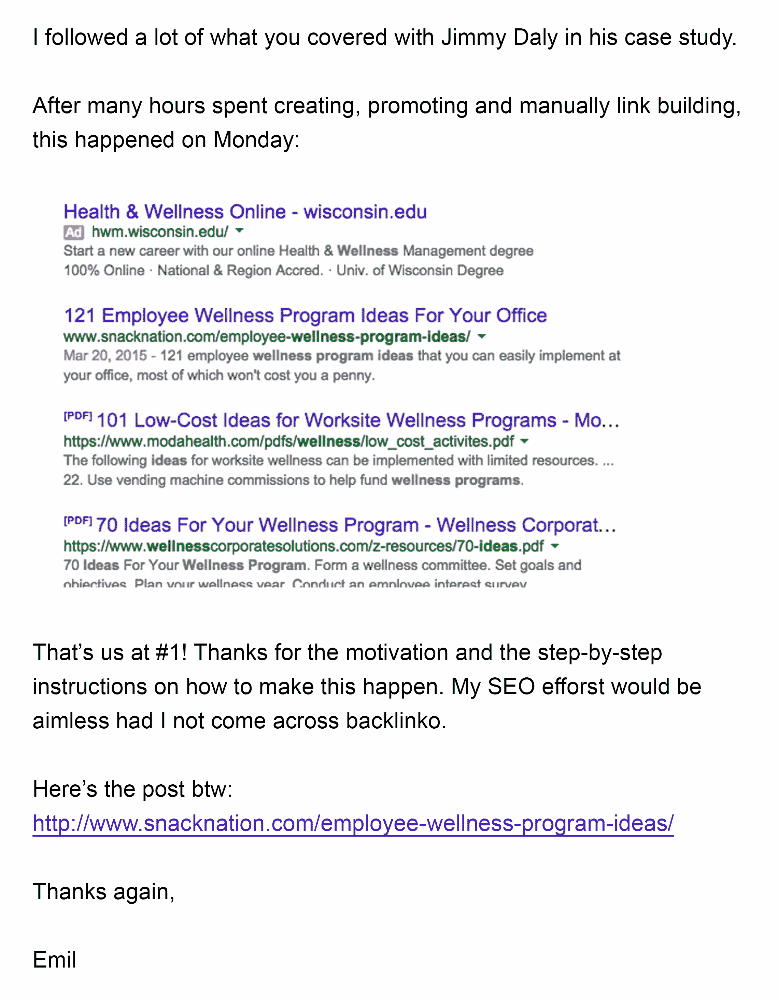</picture>

原来埃米尔使用摩天大楼技术来实现这些令人印象深刻的结果。

不仅如此，Emil 还想与 Backlinko 社区分享他的精彩内容。

那时我有了一个想法:

与其为 Emil 的案例研究写一篇新帖子，*不如我把它添加到现有的帖子中？*

所以我就这么做了。

具体来说，我将埃米尔的案例研究添加到了这个旧帖子中:

<picture><source type="image/webp" srcset="https://api.backlinko.com/app/uploads/2015/01/white-hat-seo-case-study.webp 1600w, https://api.backlinko.com/app/uploads/2015/01/white-hat-seo-case-study-300x219.webp 300w, https://api.backlinko.com/app/uploads/2015/01/white-hat-seo-case-study-1280x934.webp 1280w, https://api.backlinko.com/app/uploads/2015/01/white-hat-seo-case-study-768x561.webp 768w, https://api.backlinko.com/app/uploads/2015/01/white-hat-seo-case-study-1536x1121.webp 1536w, https://api.backlinko.com/app/uploads/2015/01/white-hat-seo-case-study-480x350.webp 480w, https://api.backlinko.com/app/uploads/2015/01/white-hat-seo-case-study-640x467.webp 640w, https://api.backlinko.com/app/uploads/2015/01/white-hat-seo-case-study-960x701.webp 960w, https://api.backlinko.com/app/uploads/2015/01/white-hat-seo-case-study-1440x1051.webp 1440w" sizes="(max-width: 600px) 100vw, 600px">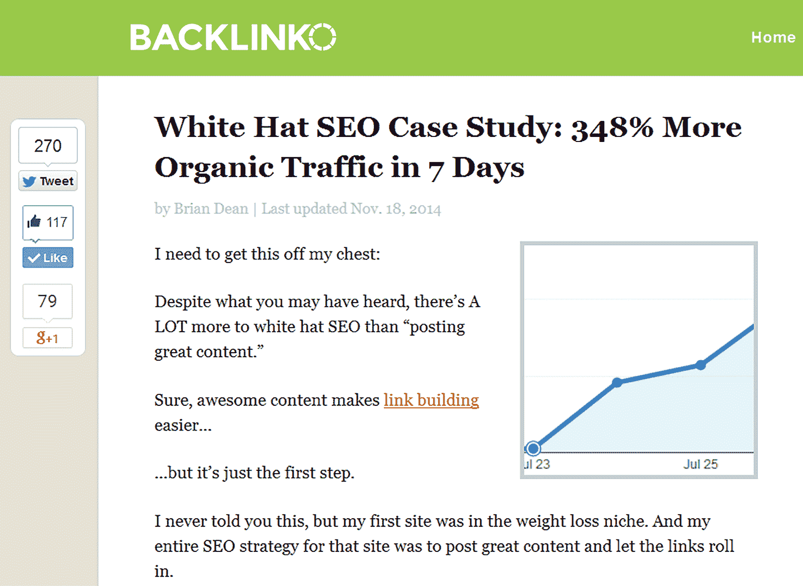</picture>

(我还更新了图片，增加了一些新的提示。)

最后的结果？

帖子的新改进版本:

<picture><source type="image/webp" srcset="https://api.backlinko.com/app/uploads/2018/05/white-hat-seo-improved.webp 1300w, https://api.backlinko.com/app/uploads/2018/05/white-hat-seo-improved-300x226.webp 300w, https://api.backlinko.com/app/uploads/2018/05/white-hat-seo-improved-1280x964.webp 1280w, https://api.backlinko.com/app/uploads/2018/05/white-hat-seo-improved-768x578.webp 768w, https://api.backlinko.com/app/uploads/2018/05/white-hat-seo-improved-480x361.webp 480w, https://api.backlinko.com/app/uploads/2018/05/white-hat-seo-improved-640x482.webp 640w, https://api.backlinko.com/app/uploads/2018/05/white-hat-seo-improved-960x723.webp 960w" sizes="(max-width: 600px) 100vw, 600px">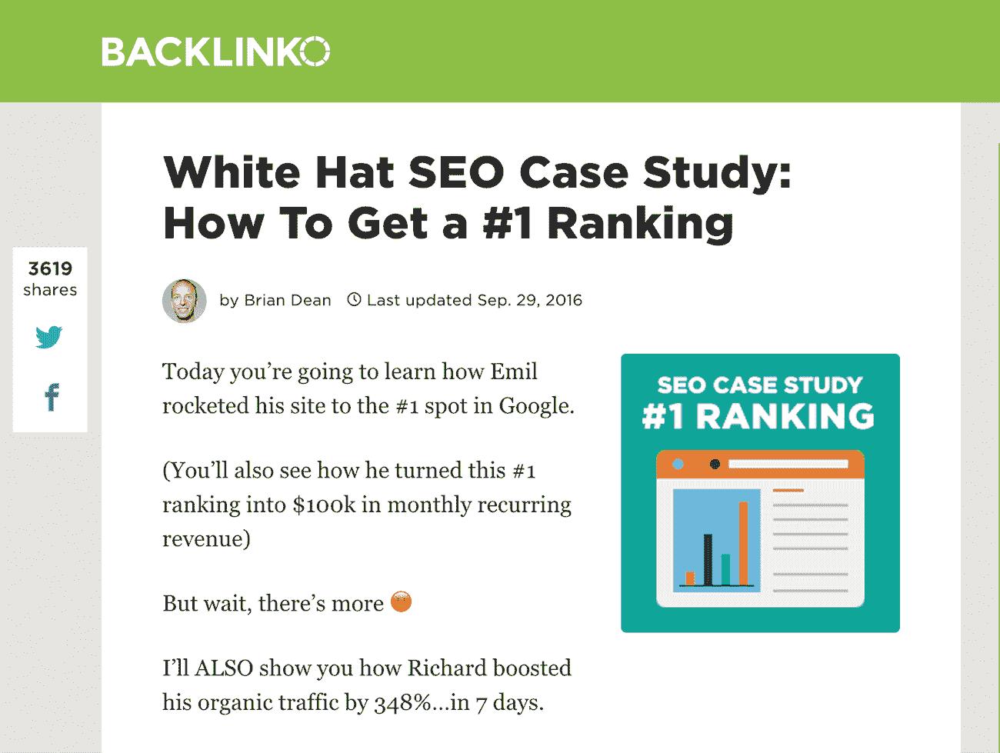</picture>

为了确保新帖子得到应有的关注，我给我的时事通讯订阅者发了一封电子邮件，重新推广了它:

<picture><source type="image/webp" srcset="https://api.backlinko.com/app/uploads/2020/12/new-case-study-newsletter.webp 2500w, https://api.backlinko.com/app/uploads/2020/12/new-case-study-newsletter-300x284.webp 300w, https://api.backlinko.com/app/uploads/2020/12/new-case-study-newsletter-1280x1212.webp 1280w, https://api.backlinko.com/app/uploads/2020/12/new-case-study-newsletter-768x727.webp 768w, https://api.backlinko.com/app/uploads/2020/12/new-case-study-newsletter-1536x1455.webp 1536w, https://api.backlinko.com/app/uploads/2020/12/new-case-study-newsletter-2048x1940.webp 2048w, https://api.backlinko.com/app/uploads/2020/12/new-case-study-newsletter-480x455.webp 480w, https://api.backlinko.com/app/uploads/2020/12/new-case-study-newsletter-640x606.webp 640w, https://api.backlinko.com/app/uploads/2020/12/new-case-study-newsletter-960x909.webp 960w, https://api.backlinko.com/app/uploads/2020/12/new-case-study-newsletter-1440x1364.webp 1440w, https://api.backlinko.com/app/uploads/2020/12/new-case-study-newsletter-1600x1516.webp 1600w, https://api.backlinko.com/app/uploads/2020/12/new-case-study-newsletter-1920x1819.webp 1920w" sizes="(max-width: 600px) 100vw, 600px">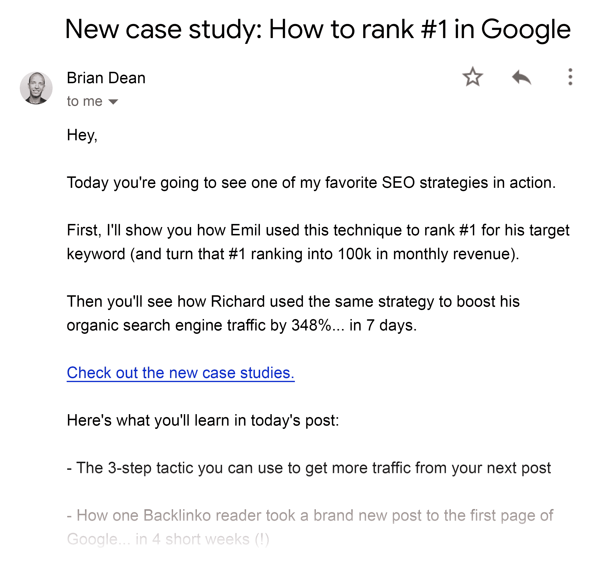</picture>

我还在社交媒体上分享了它:

<picture><source type="image/webp" srcset="https://api.backlinko.com/app/uploads/2020/12/tweet-promoting-post.webp 1600w, https://api.backlinko.com/app/uploads/2020/12/tweet-promoting-post-300x265.webp 300w, https://api.backlinko.com/app/uploads/2020/12/tweet-promoting-post-1280x1131.webp 1280w, https://api.backlinko.com/app/uploads/2020/12/tweet-promoting-post-768x679.webp 768w, https://api.backlinko.com/app/uploads/2020/12/tweet-promoting-post-1536x1357.webp 1536w, https://api.backlinko.com/app/uploads/2020/12/tweet-promoting-post-480x424.webp 480w, https://api.backlinko.com/app/uploads/2020/12/tweet-promoting-post-640x566.webp 640w, https://api.backlinko.com/app/uploads/2020/12/tweet-promoting-post-960x848.webp 960w, https://api.backlinko.com/app/uploads/2020/12/tweet-promoting-post-1440x1273.webp 1440w" sizes="(max-width: 500px) 100vw, 500px">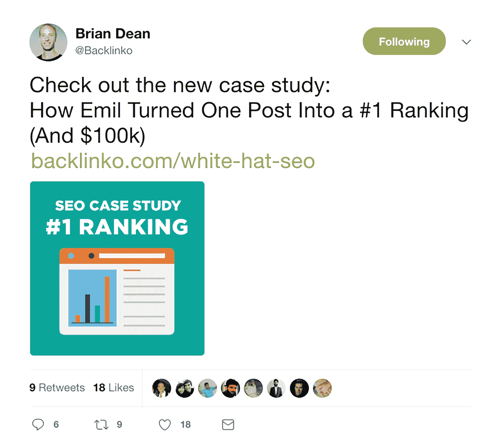</picture>

结果呢？

该页面的有机流量增长了 118.91%。

<picture><source type="image/webp" srcset="https://api.backlinko.com/app/uploads/2020/12/white-hat-seo-traffic-increase.webp 2500w, https://api.backlinko.com/app/uploads/2020/12/white-hat-seo-traffic-increase-300x268.webp 300w, https://api.backlinko.com/app/uploads/2020/12/white-hat-seo-traffic-increase-1280x1145.webp 1280w, https://api.backlinko.com/app/uploads/2020/12/white-hat-seo-traffic-increase-768x687.webp 768w, https://api.backlinko.com/app/uploads/2020/12/white-hat-seo-traffic-increase-1536x1374.webp 1536w, https://api.backlinko.com/app/uploads/2020/12/white-hat-seo-traffic-increase-2048x1833.webp 2048w, https://api.backlinko.com/app/uploads/2020/12/white-hat-seo-traffic-increase-480x430.webp 480w, https://api.backlinko.com/app/uploads/2020/12/white-hat-seo-traffic-increase-640x573.webp 640w, https://api.backlinko.com/app/uploads/2020/12/white-hat-seo-traffic-increase-960x859.webp 960w, https://api.backlinko.com/app/uploads/2020/12/white-hat-seo-traffic-increase-1440x1289.webp 1440w, https://api.backlinko.com/app/uploads/2020/12/white-hat-seo-traffic-increase-1600x1432.webp 1600w, https://api.backlinko.com/app/uploads/2020/12/white-hat-seo-traffic-increase-1920x1718.webp 1920w" sizes="(max-width: 450px) 100vw, 450px">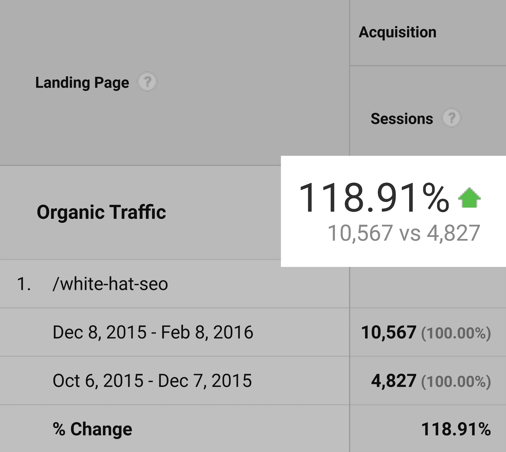</picture>

(如果你想知道，不，这不是侥幸。从那以后，我用了几次“[内容重新发布](https://backlinko.com/content-relaunch)”，每次都很好用。)

引人注目的标题和描述标签在 SERPS 中获得更多点击已经不是什么秘密了。

(就像我之前提到的，更多的有机点击=更高的谷歌排名。)

问题是:你怎么知道人们想点击什么？

看那个关键词的谷歌 Adwords 广告。

你看，你看到的竞争关键词的广告是数百个(如果不是数千个)分裂测试的结果。

旨在最大化点击量的分割测试。

你可以从这些广告中复制一些内容，让你的标题和描述标签更有吸引力。

例如，假设你要发表一篇围绕关键词“最佳床垫”优化的博文。

首先，看看那个关键词的广告:

<picture><source type="image/webp" srcset="https://api.backlinko.com/app/uploads/2021/10/google-serp-best-mattress-ads.webp 2500w, https://api.backlinko.com/app/uploads/2021/10/google-serp-best-mattress-ads-300x324.webp 300w, https://api.backlinko.com/app/uploads/2021/10/google-serp-best-mattress-ads-1280x1384.webp 1280w, https://api.backlinko.com/app/uploads/2021/10/google-serp-best-mattress-ads-768x830.webp 768w, https://api.backlinko.com/app/uploads/2021/10/google-serp-best-mattress-ads-1421x1536.webp 1421w, https://api.backlinko.com/app/uploads/2021/10/google-serp-best-mattress-ads-1894x2048.webp 1894w, https://api.backlinko.com/app/uploads/2021/10/google-serp-best-mattress-ads-480x519.webp 480w, https://api.backlinko.com/app/uploads/2021/10/google-serp-best-mattress-ads-640x692.webp 640w, https://api.backlinko.com/app/uploads/2021/10/google-serp-best-mattress-ads-960x1038.webp 960w, https://api.backlinko.com/app/uploads/2021/10/google-serp-best-mattress-ads-1440x1557.webp 1440w, https://api.backlinko.com/app/uploads/2021/10/google-serp-best-mattress-ads-1600x1730.webp 1600w, https://api.backlinko.com/app/uploads/2021/10/google-serp-best-mattress-ads-1920x2076.webp 1920w" sizes="(max-width: 600px) 100vw, 600px">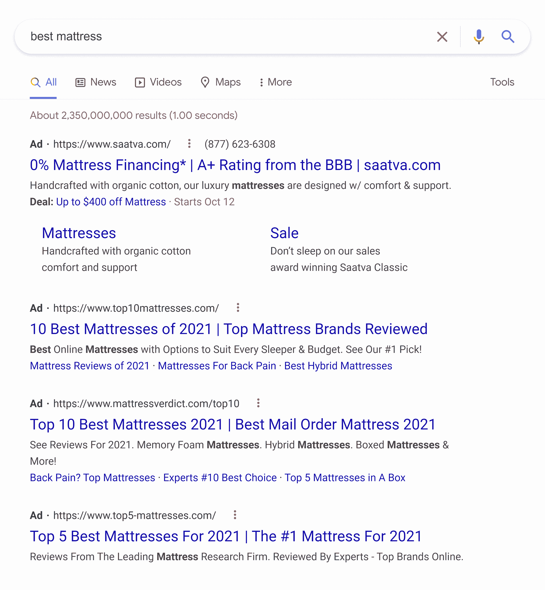</picture>

留意广告中有趣的文案，你可以将它们融入你的标题和描述中:

<picture><source type="image/webp" srcset="https://api.backlinko.com/app/uploads/2021/10/google-serp-best-mattress-ads-keywords.webp 2500w, https://api.backlinko.com/app/uploads/2021/10/google-serp-best-mattress-ads-keywords-300x324.webp 300w, https://api.backlinko.com/app/uploads/2021/10/google-serp-best-mattress-ads-keywords-1280x1384.webp 1280w, https://api.backlinko.com/app/uploads/2021/10/google-serp-best-mattress-ads-keywords-768x830.webp 768w, https://api.backlinko.com/app/uploads/2021/10/google-serp-best-mattress-ads-keywords-1421x1536.webp 1421w, https://api.backlinko.com/app/uploads/2021/10/google-serp-best-mattress-ads-keywords-1894x2048.webp 1894w, https://api.backlinko.com/app/uploads/2021/10/google-serp-best-mattress-ads-keywords-480x519.webp 480w, https://api.backlinko.com/app/uploads/2021/10/google-serp-best-mattress-ads-keywords-640x692.webp 640w, https://api.backlinko.com/app/uploads/2021/10/google-serp-best-mattress-ads-keywords-960x1038.webp 960w, https://api.backlinko.com/app/uploads/2021/10/google-serp-best-mattress-ads-keywords-1440x1557.webp 1440w, https://api.backlinko.com/app/uploads/2021/10/google-serp-best-mattress-ads-keywords-1600x1730.webp 1600w, https://api.backlinko.com/app/uploads/2021/10/google-serp-best-mattress-ads-keywords-1920x2076.webp 1920w" sizes="(max-width: 600px) 100vw, 600px"></picture>

正如你所看到的，这些标签包含了被**证实**会产生点击的词。因此，当你在页面的标题和描述中包含这些术语时，你可能会得到更多的点击:

<picture><source type="image/webp" srcset="https://api.backlinko.com/app/uploads/2020/02/yoast-seo-content.webp 1200w, https://api.backlinko.com/app/uploads/2020/02/yoast-seo-content-300x181.webp 300w, https://api.backlinko.com/app/uploads/2020/02/yoast-seo-content-768x462.webp 768w, https://api.backlinko.com/app/uploads/2020/02/yoast-seo-content-480x289.webp 480w, https://api.backlinko.com/app/uploads/2020/02/yoast-seo-content-640x385.webp 640w, https://api.backlinko.com/app/uploads/2020/02/yoast-seo-content-960x578.webp 960w" sizes="(max-width: 600px) 100vw, 600px">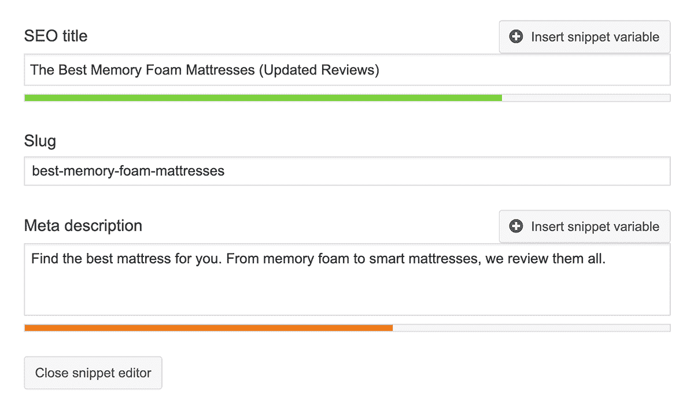</picture>

## **5。在维基百科上寻找断开链接的机会**

【**注意:**这是一种高级的 SEO 策略。因此，如果你是第一次接触[搜索引擎优化](https://backlinko.com/seo-this-year "SEO This Year")，可以跳过这个技巧。]

[断链建设](https://backlinko.com/hub/seo/broken-link-building "Broken Link Building")是我最喜欢的链接建设策略之一。

只有一个问题:查找断开的链接非常耗时。

除非你知道维基百科编辑系统中一个鲜为人知的小问题。

你看，当维基百科的编辑无意中发现一个死链接时，他们不会马上删除这个链接。

相反，他们在链接旁边添加了一个脚注，上面写着“死链接”:

<picture><source type="image/webp" srcset="https://api.backlinko.com/app/uploads/2020/12/wikipedia-dead-link.webp 2248w, https://api.backlinko.com/app/uploads/2020/12/wikipedia-dead-link-300x166.webp 300w, https://api.backlinko.com/app/uploads/2020/12/wikipedia-dead-link-1280x707.webp 1280w, https://api.backlinko.com/app/uploads/2020/12/wikipedia-dead-link-768x424.webp 768w, https://api.backlinko.com/app/uploads/2020/12/wikipedia-dead-link-1536x849.webp 1536w, https://api.backlinko.com/app/uploads/2020/12/wikipedia-dead-link-2048x1132.webp 2048w, https://api.backlinko.com/app/uploads/2020/12/wikipedia-dead-link-480x265.webp 480w, https://api.backlinko.com/app/uploads/2020/12/wikipedia-dead-link-640x354.webp 640w, https://api.backlinko.com/app/uploads/2020/12/wikipedia-dead-link-960x530.webp 960w, https://api.backlinko.com/app/uploads/2020/12/wikipedia-dead-link-1440x796.webp 1440w, https://api.backlinko.com/app/uploads/2020/12/wikipedia-dead-link-1600x884.webp 1600w, https://api.backlinko.com/app/uploads/2020/12/wikipedia-dead-link-1920x1061.webp 1920w" sizes="(max-width: 500px) 100vw, 500px">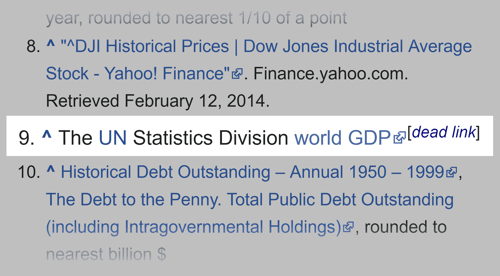</picture>

这个脚注给了其他编辑一个机会，让他们在删除链接之前确认这个链接实际上是死的。

这个简单的脚注使得查找断开的链接变得非常简单。

**方法如下:**

首先，使用这个简单的搜索字符串:

site:Wikipedia . org[关键词] +“死链接”

例如，如果你在投资领域，你会搜索这样的内容:

<picture><source type="image/webp" srcset="https://api.backlinko.com/app/uploads/2020/12/google-search-wikipedia-dead-links.webp 2500w, https://api.backlinko.com/app/uploads/2020/12/google-search-wikipedia-dead-links-300x133.webp 300w, https://api.backlinko.com/app/uploads/2020/12/google-search-wikipedia-dead-links-1280x569.webp 1280w, https://api.backlinko.com/app/uploads/2020/12/google-search-wikipedia-dead-links-768x342.webp 768w, https://api.backlinko.com/app/uploads/2020/12/google-search-wikipedia-dead-links-1536x683.webp 1536w, https://api.backlinko.com/app/uploads/2020/12/google-search-wikipedia-dead-links-2048x911.webp 2048w, https://api.backlinko.com/app/uploads/2020/12/google-search-wikipedia-dead-links-480x214.webp 480w, https://api.backlinko.com/app/uploads/2020/12/google-search-wikipedia-dead-links-640x285.webp 640w, https://api.backlinko.com/app/uploads/2020/12/google-search-wikipedia-dead-links-960x427.webp 960w, https://api.backlinko.com/app/uploads/2020/12/google-search-wikipedia-dead-links-1440x641.webp 1440w, https://api.backlinko.com/app/uploads/2020/12/google-search-wikipedia-dead-links-1600x712.webp 1600w, https://api.backlinko.com/app/uploads/2020/12/google-search-wikipedia-dead-links-1920x854.webp 1920w" sizes="(max-width: 600px) 100vw, 600px">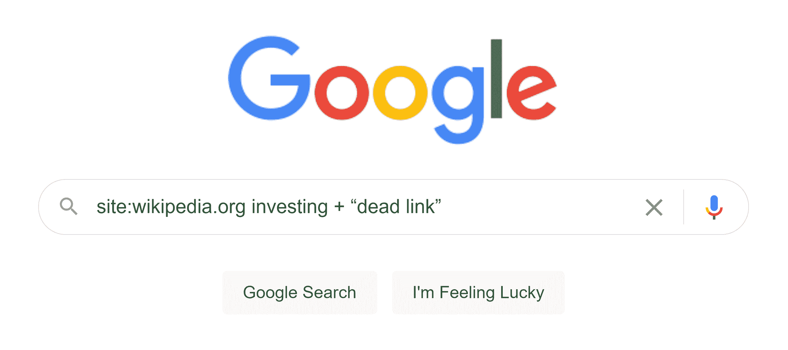</picture>

接下来，访问搜索结果中与您的网站相关的页面:

<picture><source type="image/webp" srcset="https://api.backlinko.com/app/uploads/2020/12/google-serp-investing-dead-links.webp 2500w, https://api.backlinko.com/app/uploads/2020/12/google-serp-investing-dead-links-300x239.webp 300w, https://api.backlinko.com/app/uploads/2020/12/google-serp-investing-dead-links-1280x1021.webp 1280w, https://api.backlinko.com/app/uploads/2020/12/google-serp-investing-dead-links-768x613.webp 768w, https://api.backlinko.com/app/uploads/2020/12/google-serp-investing-dead-links-1536x1226.webp 1536w, https://api.backlinko.com/app/uploads/2020/12/google-serp-investing-dead-links-2048x1634.webp 2048w, https://api.backlinko.com/app/uploads/2020/12/google-serp-investing-dead-links-480x383.webp 480w, https://api.backlinko.com/app/uploads/2020/12/google-serp-investing-dead-links-640x511.webp 640w, https://api.backlinko.com/app/uploads/2020/12/google-serp-investing-dead-links-960x766.webp 960w, https://api.backlinko.com/app/uploads/2020/12/google-serp-investing-dead-links-1440x1149.webp 1440w, https://api.backlinko.com/app/uploads/2020/12/google-serp-investing-dead-links-1600x1277.webp 1600w, https://api.backlinko.com/app/uploads/2020/12/google-serp-investing-dead-links-1920x1532.webp 1920w" sizes="(max-width: 600px) 100vw, 600px">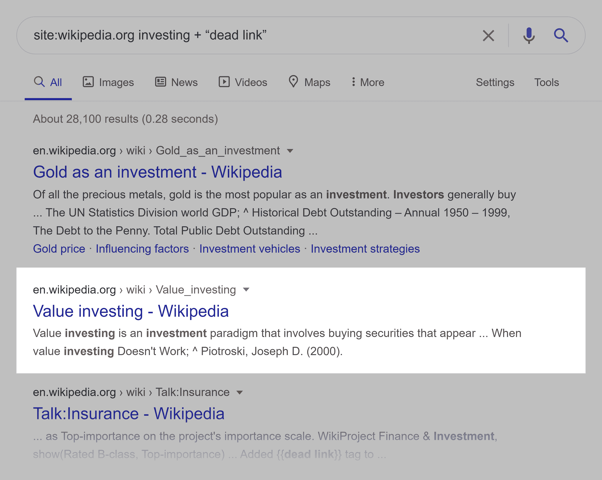</picture>

按 ctrl + f，搜索“死链”。

您的浏览器将跳转到参考资料部分的任何死链接:

<picture><source type="image/webp" srcset="https://api.backlinko.com/app/uploads/2020/12/wikipedia-value-investing-dead-link.webp 2560w, https://api.backlinko.com/app/uploads/2020/12/wikipedia-value-investing-dead-link-300x194.webp 300w, https://api.backlinko.com/app/uploads/2020/12/wikipedia-value-investing-dead-link-1280x829.webp 1280w, https://api.backlinko.com/app/uploads/2020/12/wikipedia-value-investing-dead-link-768x497.webp 768w, https://api.backlinko.com/app/uploads/2020/12/wikipedia-value-investing-dead-link-1536x995.webp 1536w, https://api.backlinko.com/app/uploads/2020/12/wikipedia-value-investing-dead-link-2048x1326.webp 2048w, https://api.backlinko.com/app/uploads/2020/12/wikipedia-value-investing-dead-link-480x311.webp 480w, https://api.backlinko.com/app/uploads/2020/12/wikipedia-value-investing-dead-link-640x415.webp 640w, https://api.backlinko.com/app/uploads/2020/12/wikipedia-value-investing-dead-link-960x622.webp 960w, https://api.backlinko.com/app/uploads/2020/12/wikipedia-value-investing-dead-link-1440x933.webp 1440w, https://api.backlinko.com/app/uploads/2020/12/wikipedia-value-investing-dead-link-1600x1036.webp 1600w, https://api.backlinko.com/app/uploads/2020/12/wikipedia-value-investing-dead-link-1920x1244.webp 1920w" sizes="(max-width: 500px) 100vw, 500px">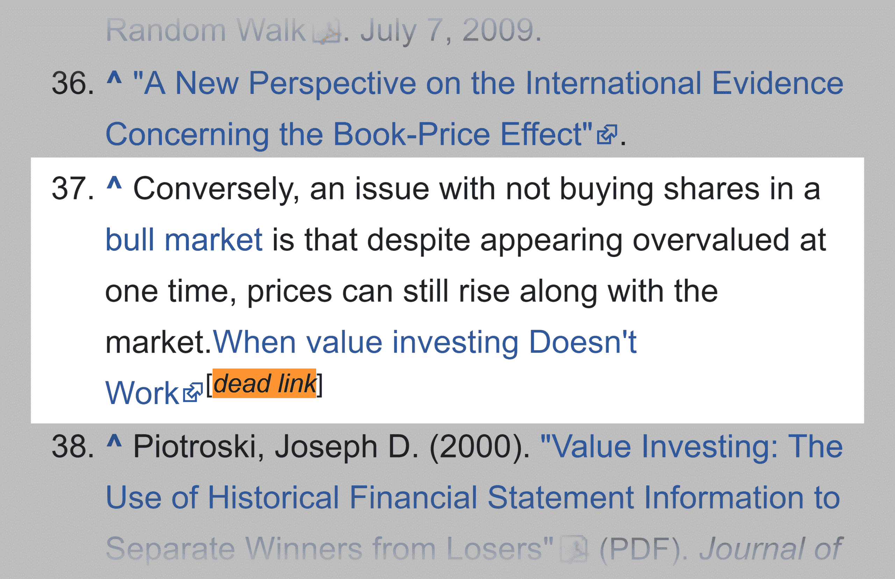</picture>

**专业提示:**维基百科实际上有一个[带死链接的文章列表](https://en.wikipedia.org/wiki/Category:All_articles_with_dead_external_links "Category:All articles with dead external links")。这使得在维基百科中找到死链接更加容易。

<picture><source type="image/webp" srcset="https://api.backlinko.com/app/uploads/2020/12/wikipedia-articles-with-dead-external-links.webp 2560w, https://api.backlinko.com/app/uploads/2020/12/wikipedia-articles-with-dead-external-links-300x268.webp 300w, https://api.backlinko.com/app/uploads/2020/12/wikipedia-articles-with-dead-external-links-1280x1144.webp 1280w, https://api.backlinko.com/app/uploads/2020/12/wikipedia-articles-with-dead-external-links-768x686.webp 768w, https://api.backlinko.com/app/uploads/2020/12/wikipedia-articles-with-dead-external-links-1536x1372.webp 1536w, https://api.backlinko.com/app/uploads/2020/12/wikipedia-articles-with-dead-external-links-2048x1830.webp 2048w, https://api.backlinko.com/app/uploads/2020/12/wikipedia-articles-with-dead-external-links-480x429.webp 480w, https://api.backlinko.com/app/uploads/2020/12/wikipedia-articles-with-dead-external-links-640x572.webp 640w, https://api.backlinko.com/app/uploads/2020/12/wikipedia-articles-with-dead-external-links-960x858.webp 960w, https://api.backlinko.com/app/uploads/2020/12/wikipedia-articles-with-dead-external-links-1440x1286.webp 1440w, https://api.backlinko.com/app/uploads/2020/12/wikipedia-articles-with-dead-external-links-1600x1429.webp 1600w, https://api.backlinko.com/app/uploads/2020/12/wikipedia-articles-with-dead-external-links-1920x1715.webp 1920w" sizes="(max-width: 600px) 100vw, 600px">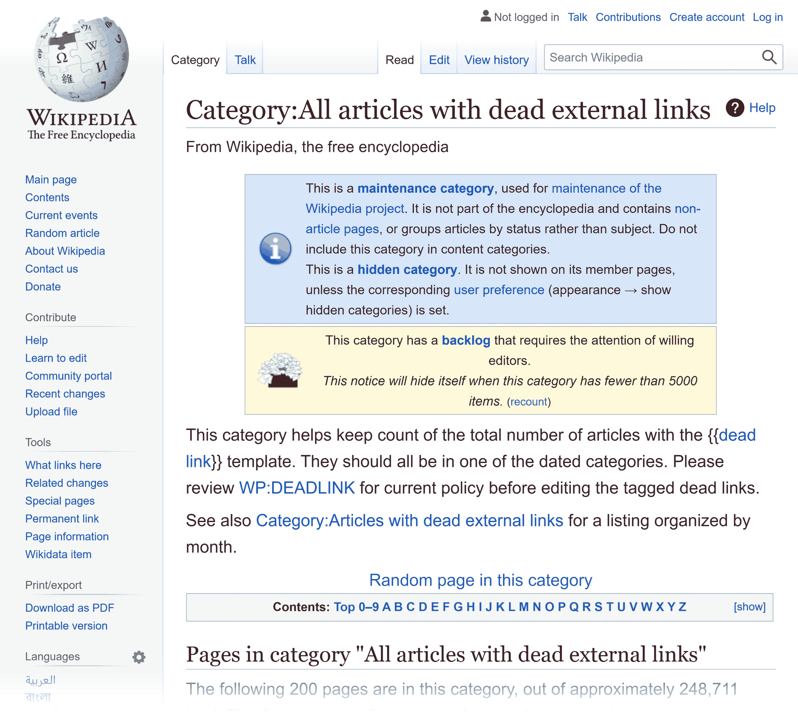</picture>

所以一旦你找到了一个死链接，接下来该怎么办？

那么，你可以在你的网站上重新创建那个死的资源，并用一个到你的网站的链接替换维基百科中的死链接。

但是那只会给你带来一个链接(并且[没有后续链接](https://backlinko.com/nofollow-link "Nofollow link"))。

相反，我建议联系那些与死亡资源有联系的人。并且让他们知道你的替换内容。

## **6。复制你的竞争对手的最佳关键词**

有两种方法可以找到关键词来优化你的内容:

在工具中输入种子关键字。

运筹学

找到你的竞争对手已经排名的关键词。

这两种方法都可行。也就是说，我倾向于更幸运地简单查看我的竞争对手已经排名的关键词。

方法如下:

首先，找一个已经在谷歌排名很好的竞争网站。这样，你就在对已经知道自己在做什么的网站进行逆向工程。

例如，这里有一个网站，写的主题和我写的一样，b)在 SEO 方面做得很好。

<picture><source type="image/webp" srcset="https://api.backlinko.com/app/uploads/2020/02/quicksprout-article.webp 1200w, https://api.backlinko.com/app/uploads/2020/02/quicksprout-article-300x278.webp 300w, https://api.backlinko.com/app/uploads/2020/02/quicksprout-article-768x710.webp 768w, https://api.backlinko.com/app/uploads/2020/02/quicksprout-article-480x444.webp 480w, https://api.backlinko.com/app/uploads/2020/02/quicksprout-article-640x592.webp 640w, https://api.backlinko.com/app/uploads/2020/02/quicksprout-article-960x888.webp 960w" sizes="(max-width: 600px) 100vw, 600px"></picture>

接下来，将网站的主页弹出到[一个关键字研究工具](https://backlinko.com/keyword-research-tools "Keyword Research Tools")中，比如 [Semrush](https://backlinko.com/hub/seo/semrush "SEMrush") 。

<picture><source type="image/webp" srcset="https://api.backlinko.com/app/uploads/2020/02/semrush-quicksprout-search.webp 1200w, https://api.backlinko.com/app/uploads/2020/02/semrush-quicksprout-search-300x111.webp 300w, https://api.backlinko.com/app/uploads/2020/02/semrush-quicksprout-search-768x284.webp 768w, https://api.backlinko.com/app/uploads/2020/02/semrush-quicksprout-search-480x178.webp 480w, https://api.backlinko.com/app/uploads/2020/02/semrush-quicksprout-search-640x237.webp 640w, https://api.backlinko.com/app/uploads/2020/02/semrush-quicksprout-search-960x355.webp 960w" sizes="(max-width: 500px) 100vw, 500px"></picture>

你会得到该网站排名的关键词列表:

<picture><source type="image/webp" srcset="https://api.backlinko.com/app/uploads/2016/03/keyword_rankings.webp 1200w, https://api.backlinko.com/app/uploads/2016/03/keyword_rankings-300x414.webp 300w, https://api.backlinko.com/app/uploads/2016/03/keyword_rankings-768x1059.webp 768w, https://api.backlinko.com/app/uploads/2016/03/keyword_rankings-1114x1536.webp 1114w, https://api.backlinko.com/app/uploads/2016/03/keyword_rankings-480x662.webp 480w, https://api.backlinko.com/app/uploads/2016/03/keyword_rankings-640x882.webp 640w, https://api.backlinko.com/app/uploads/2016/03/keyword_rankings-960x1323.webp 960w" sizes="(max-width: 500px) 100vw, 500px">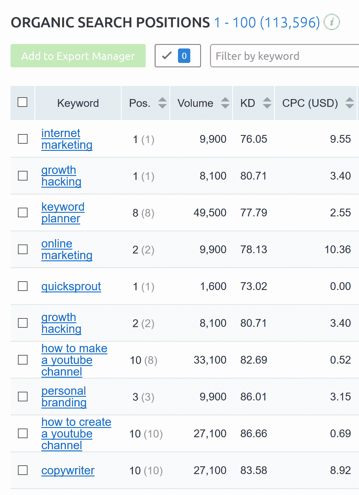</picture>

当然，其中一些关键词对你的业务没有意义。例如，他们可能会锁定你的客户不会搜索的关键词。或者，他们可能正在为你无法排名的竞争激烈的关键词排名。

不管怎样，你应该带着一套对你的生意有意义的关键词离开。

## **7。优化你的内容，最大化社交分享** 

让我们面对现实:大多数内容不值得分享。

如果没有分享(尤其是反向链接)，你就不会在谷歌排名。

幸运的是，创造值得分享的内容并不难。

例如，我的这篇关于[链接构建](https://backlinko.com/link-building)的帖子做得非常好。

<picture><source type="image/webp" srcset="https://api.backlinko.com/app/uploads/2020/12/backlinko-link-building-2021.webp 2560w, https://api.backlinko.com/app/uploads/2020/12/backlinko-link-building-2021-300x219.webp 300w, https://api.backlinko.com/app/uploads/2020/12/backlinko-link-building-2021-1280x934.webp 1280w, https://api.backlinko.com/app/uploads/2020/12/backlinko-link-building-2021-768x560.webp 768w, https://api.backlinko.com/app/uploads/2020/12/backlinko-link-building-2021-1536x1121.webp 1536w, https://api.backlinko.com/app/uploads/2020/12/backlinko-link-building-2021-2048x1494.webp 2048w, https://api.backlinko.com/app/uploads/2020/12/backlinko-link-building-2021-480x350.webp 480w, https://api.backlinko.com/app/uploads/2020/12/backlinko-link-building-2021-640x467.webp 640w, https://api.backlinko.com/app/uploads/2020/12/backlinko-link-building-2021-960x701.webp 960w, https://api.backlinko.com/app/uploads/2020/12/backlinko-link-building-2021-1440x1051.webp 1440w, https://api.backlinko.com/app/uploads/2020/12/backlinko-link-building-2021-1600x1168.webp 1600w, https://api.backlinko.com/app/uploads/2020/12/backlinko-link-building-2021-1920x1401.webp 1920w" sizes="(max-width: 600px) 100vw, 600px">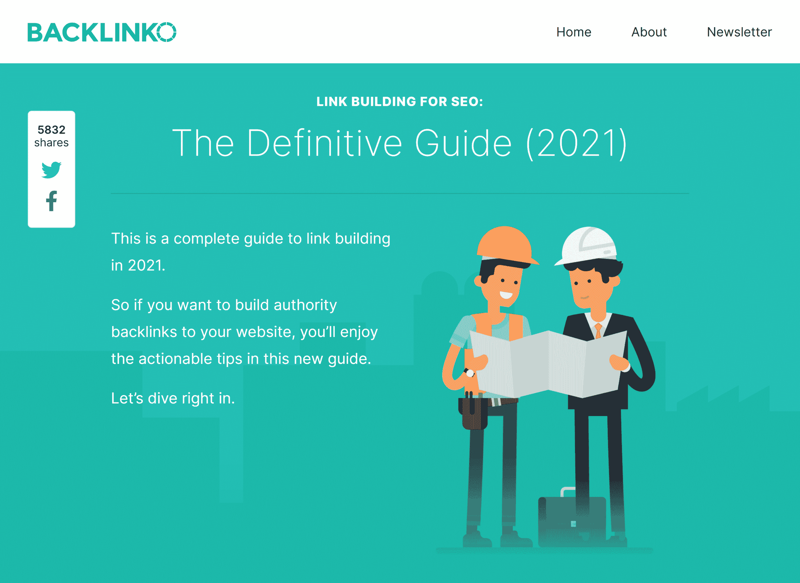</picture>

有多好？它产生了来自社交媒体、论坛、博客和搜索引擎的超过 90 万次访问:

<picture><source type="image/webp" srcset="https://api.backlinko.com/app/uploads/2021/10/google-analytics-link-building-page-views.webp 2313w, https://api.backlinko.com/app/uploads/2021/10/google-analytics-link-building-page-views-300x116.webp 300w, https://api.backlinko.com/app/uploads/2021/10/google-analytics-link-building-page-views-1280x495.webp 1280w, https://api.backlinko.com/app/uploads/2021/10/google-analytics-link-building-page-views-768x297.webp 768w, https://api.backlinko.com/app/uploads/2021/10/google-analytics-link-building-page-views-1536x594.webp 1536w, https://api.backlinko.com/app/uploads/2021/10/google-analytics-link-building-page-views-2048x792.webp 2048w, https://api.backlinko.com/app/uploads/2021/10/google-analytics-link-building-page-views-480x186.webp 480w, https://api.backlinko.com/app/uploads/2021/10/google-analytics-link-building-page-views-640x247.webp 640w, https://api.backlinko.com/app/uploads/2021/10/google-analytics-link-building-page-views-960x371.webp 960w, https://api.backlinko.com/app/uploads/2021/10/google-analytics-link-building-page-views-1440x557.webp 1440w, https://api.backlinko.com/app/uploads/2021/10/google-analytics-link-building-page-views-1600x618.webp 1600w, https://api.backlinko.com/app/uploads/2021/10/google-analytics-link-building-page-views-1920x742.webp 1920w" sizes="(max-width: 450px) 100vw, 450px">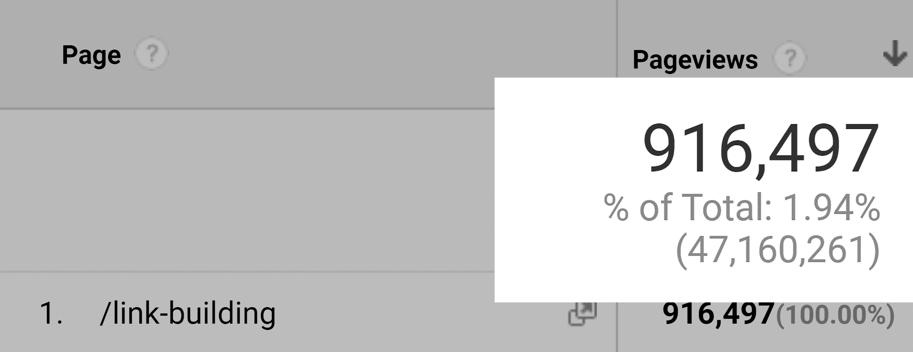</picture>

(我应该指出，指南的设计和宣传对其成功做出了贡献。但这一切都始于内容本身是如何组织的。)

具体来说，我的帖子遵循了这张信息图中的可行建议:

<picture><source type="image/webp" srcset="https://api.backlinko.com/app/uploads/2015/09/viral_content_infographic_v3.webp 1160w, https://api.backlinko.com/app/uploads/2015/09/viral_content_infographic_v3-300x2827.webp 300w, https://api.backlinko.com/app/uploads/2015/09/viral_content_infographic_v3-1061x9999.webp 1061w, https://api.backlinko.com/app/uploads/2015/09/viral_content_infographic_v3-768x7236.webp 768w, https://api.backlinko.com/app/uploads/2015/09/viral_content_infographic_v3-163x1536.webp 163w, https://api.backlinko.com/app/uploads/2015/09/viral_content_infographic_v3-480x4523.webp 480w, https://api.backlinko.com/app/uploads/2015/09/viral_content_infographic_v3-640x6030.webp 640w, https://api.backlinko.com/app/uploads/2015/09/viral_content_infographic_v3-960x9046.webp 960w" sizes="(max-width: 580px) 100vw, 580px"></picture>

现在:

这张信息图中有很多材料。所以，让我来强调一下信息图中的两个 SEO 技巧，它们现在对我来说是最有效的。

**首先**，我几乎在每篇博文中都使用短网址。

例如，你正在阅读的这篇文章的网址很简单:backlinko.com/seo-techniques.

为什么？

短网址[往往会获得更多的点击](https://backlinko.com/google-ctr-stats)。

**接下来**，我把社交分享按钮放在页面的显著位置。

你可能已经注意到了这个页面左侧的浮动工具条。

<picture><source type="image/webp" srcset="https://api.backlinko.com/app/uploads/2021/10/backlinko-floating-social-shares-tab.webp 2500w, https://api.backlinko.com/app/uploads/2021/10/backlinko-floating-social-shares-tab-300x185.webp 300w, https://api.backlinko.com/app/uploads/2021/10/backlinko-floating-social-shares-tab-1280x789.webp 1280w, https://api.backlinko.com/app/uploads/2021/10/backlinko-floating-social-shares-tab-768x473.webp 768w, https://api.backlinko.com/app/uploads/2021/10/backlinko-floating-social-shares-tab-1536x947.webp 1536w, https://api.backlinko.com/app/uploads/2021/10/backlinko-floating-social-shares-tab-2048x1262.webp 2048w, https://api.backlinko.com/app/uploads/2021/10/backlinko-floating-social-shares-tab-480x296.webp 480w, https://api.backlinko.com/app/uploads/2021/10/backlinko-floating-social-shares-tab-640x394.webp 640w, https://api.backlinko.com/app/uploads/2021/10/backlinko-floating-social-shares-tab-960x592.webp 960w, https://api.backlinko.com/app/uploads/2021/10/backlinko-floating-social-shares-tab-1440x888.webp 1440w, https://api.backlinko.com/app/uploads/2021/10/backlinko-floating-social-shares-tab-1600x986.webp 1600w, https://api.backlinko.com/app/uploads/2021/10/backlinko-floating-social-shares-tab-1920x1183.webp 1920w" sizes="(max-width: 600px) 100vw, 600px">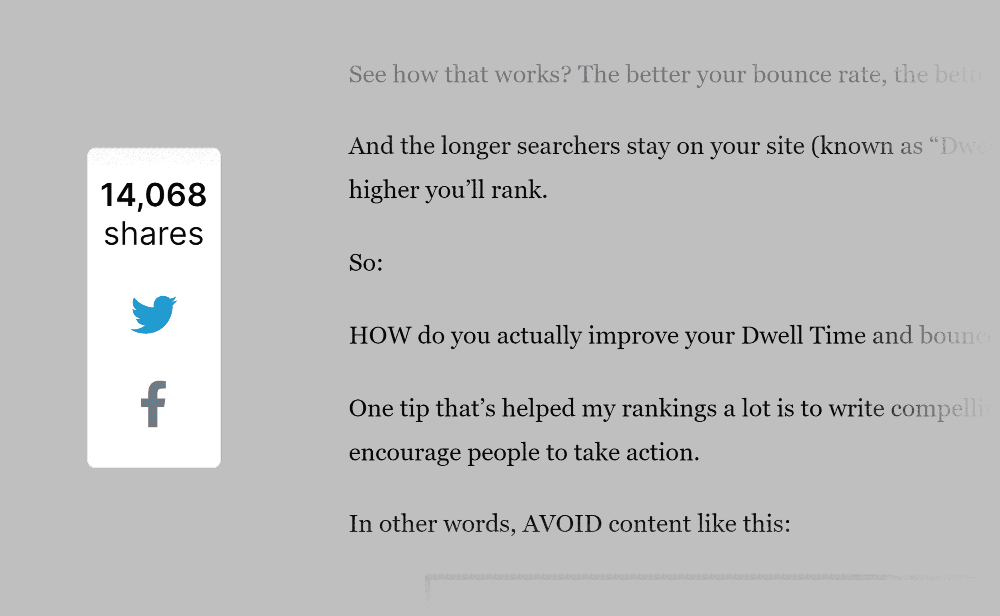</picture>

通过大量测试，我发现这些图标增加了我的帖子收到的脸书赞和推文的数量。

现在，要澄清的是:谷歌可能[不使用社交信号](https://www.seroundtable.com/again-google-doesnt-use-social-media-for-ranking-22200.html)作为排名因素。

<picture><source type="image/webp" srcset="https://api.backlinko.com/app/uploads/2016/03/google-social-signals-SEO.webp 1653w, https://api.backlinko.com/app/uploads/2016/03/google-social-signals-SEO-300x232.webp 300w, https://api.backlinko.com/app/uploads/2016/03/google-social-signals-SEO-1280x990.webp 1280w, https://api.backlinko.com/app/uploads/2016/03/google-social-signals-SEO-768x594.webp 768w, https://api.backlinko.com/app/uploads/2016/03/google-social-signals-SEO-1536x1188.webp 1536w, https://api.backlinko.com/app/uploads/2016/03/google-social-signals-SEO-480x371.webp 480w, https://api.backlinko.com/app/uploads/2016/03/google-social-signals-SEO-640x495.webp 640w, https://api.backlinko.com/app/uploads/2016/03/google-social-signals-SEO-960x742.webp 960w, https://api.backlinko.com/app/uploads/2016/03/google-social-signals-SEO-1440x1113.webp 1440w, https://api.backlinko.com/app/uploads/2016/03/google-social-signals-SEO-1600x1237.webp 1600w" sizes="(max-width: 600px) 100vw, 600px">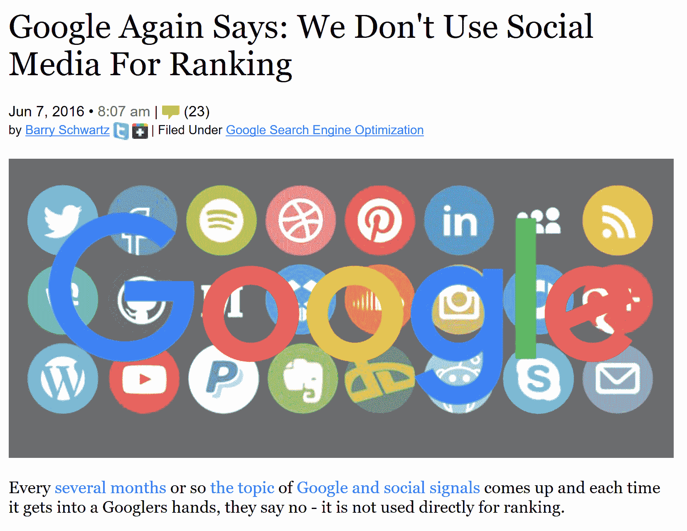</picture>

(至少不会直接。)

也就是说，社交分享可以给你带来更多的流量。其中一些人可能会链接到你，这可以帮助你的排名。

现在你的内容已经针对分享进行了优化，你需要确保你的页面的[页面搜索引擎优化](https://backlinko.com/on-page-seo)已经准备好了。

## **8。链接到权威网站**

谷歌评估你的页面的部分依据是该页面出站链接的质量和相关性。

如果你仔细想想，这完全说得通…

你链接出来的页面倾向于反映你的网页的主题。

链接到有用资源的页面也往往比只链接到自己资料的页面质量更高。

换句话说，在大 g 的眼里，链接到优秀资源的页面把自己变成了有用内容的中心。

事实上，[这项行业研究](https://www.rebootonline.com/blog/long-term-outgoing-link-experiment)发现了出站链接和谷歌排名之间的相关性。

<picture><source type="image/webp" srcset="https://api.backlinko.com/app/uploads/2020/01/phylandocic-experiment-serp.webp 1200w, https://api.backlinko.com/app/uploads/2020/01/phylandocic-experiment-serp-300x527.webp 300w, https://api.backlinko.com/app/uploads/2020/01/phylandocic-experiment-serp-768x1348.webp 768w, https://api.backlinko.com/app/uploads/2020/01/phylandocic-experiment-serp-875x1536.webp 875w, https://api.backlinko.com/app/uploads/2020/01/phylandocic-experiment-serp-1167x2048.webp 1167w, https://api.backlinko.com/app/uploads/2020/01/phylandocic-experiment-serp-480x842.webp 480w, https://api.backlinko.com/app/uploads/2020/01/phylandocic-experiment-serp-640x1123.webp 640w, https://api.backlinko.com/app/uploads/2020/01/phylandocic-experiment-serp-960x1685.webp 960w" sizes="(max-width: 600px) 100vw, 600px">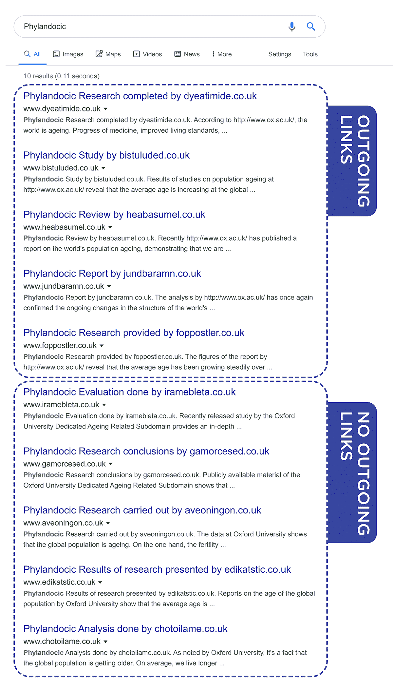</picture>

(另外，出站链接对用户体验来说也更好。毕竟，有用的外部链接可以帮助用户找到有助于他们了解你文章中讨论的主题的内容。)

**底线:**

在你发布的每一篇内容中，链接到至少 3 个高质量的相关资源。

这将向谷歌展示你的页面是一个有用信息的枢纽。

也就是说，外部链接只是谷歌关注的众多页面搜索引擎优化信号之一。要获得全面的列表，我推荐观看这个视频:

## **9。向表现不佳的页面发送权限**

我们最近的谷歌 CTR 研究发现，不到 1%的谷歌搜索者会出现在第二页。

<picture><source type="image/webp" srcset="https://api.backlinko.com/app/uploads/2020/02/few-google-searchers-visit-the-2nd-page-and-beyond.webp 1416w, https://api.backlinko.com/app/uploads/2020/02/few-google-searchers-visit-the-2nd-page-and-beyond-300x212.webp 300w, https://api.backlinko.com/app/uploads/2020/02/few-google-searchers-visit-the-2nd-page-and-beyond-1280x904.webp 1280w, https://api.backlinko.com/app/uploads/2020/02/few-google-searchers-visit-the-2nd-page-and-beyond-768x542.webp 768w, https://api.backlinko.com/app/uploads/2020/02/few-google-searchers-visit-the-2nd-page-and-beyond-480x339.webp 480w, https://api.backlinko.com/app/uploads/2020/02/few-google-searchers-visit-the-2nd-page-and-beyond-640x452.webp 640w, https://api.backlinko.com/app/uploads/2020/02/few-google-searchers-visit-the-2nd-page-and-beyond-960x678.webp 960w" sizes="(max-width: 700px) 100vw, 700px">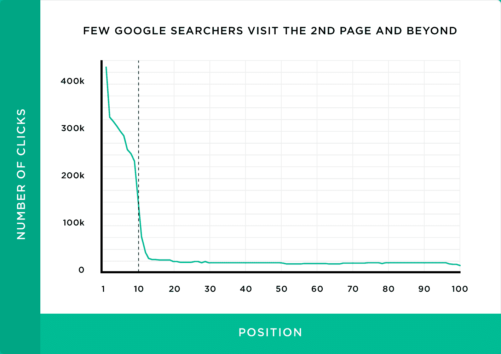</picture>

那么，如何提升这些页面，让它们出现在首页呢？

扔一些[内部链接](https://backlinko.com/hub/seo/internal-links)给他们。

<picture><source type="image/webp" srcset="https://api.backlinko.com/app/uploads/2019/07/link-to-important-pages.webp 1580w, https://api.backlinko.com/app/uploads/2019/07/link-to-important-pages-300x143.webp 300w, https://api.backlinko.com/app/uploads/2019/07/link-to-important-pages-1280x611.webp 1280w, https://api.backlinko.com/app/uploads/2019/07/link-to-important-pages-768x367.webp 768w, https://api.backlinko.com/app/uploads/2019/07/link-to-important-pages-1536x733.webp 1536w, https://api.backlinko.com/app/uploads/2019/07/link-to-important-pages-480x229.webp 480w, https://api.backlinko.com/app/uploads/2019/07/link-to-important-pages-640x305.webp 640w, https://api.backlinko.com/app/uploads/2019/07/link-to-important-pages-960x458.webp 960w, https://api.backlinko.com/app/uploads/2019/07/link-to-important-pages-1440x687.webp 1440w" sizes="(max-width: 700px) 100vw, 700px">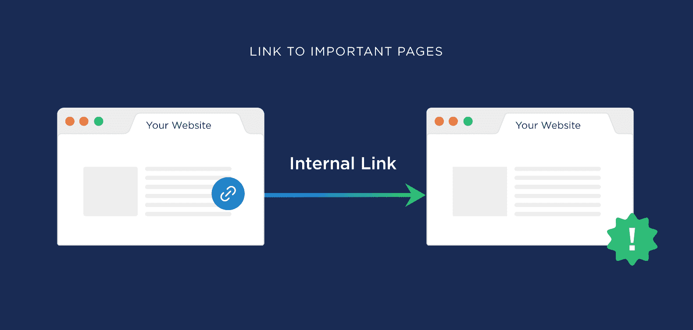</picture>

以下是 3 步流程:

第一步:使用谷歌搜索控制台找到你在第二或第三页上排名的关键词。

要找到它们，登录[谷歌搜索控制台](https://backlinko.com/google-search-console)并前往“搜索结果”报告:

<picture><source type="image/webp" srcset="https://api.backlinko.com/app/uploads/2020/12/search-console-search-results-menu.webp 2560w, https://api.backlinko.com/app/uploads/2020/12/search-console-search-results-menu-300x218.webp 300w, https://api.backlinko.com/app/uploads/2020/12/search-console-search-results-menu-1280x930.webp 1280w, https://api.backlinko.com/app/uploads/2020/12/search-console-search-results-menu-768x558.webp 768w, https://api.backlinko.com/app/uploads/2020/12/search-console-search-results-menu-1536x1115.webp 1536w, https://api.backlinko.com/app/uploads/2020/12/search-console-search-results-menu-2048x1487.webp 2048w, https://api.backlinko.com/app/uploads/2020/12/search-console-search-results-menu-480x349.webp 480w, https://api.backlinko.com/app/uploads/2020/12/search-console-search-results-menu-640x465.webp 640w, https://api.backlinko.com/app/uploads/2020/12/search-console-search-results-menu-960x697.webp 960w, https://api.backlinko.com/app/uploads/2020/12/search-console-search-results-menu-1440x1046.webp 1440w, https://api.backlinko.com/app/uploads/2020/12/search-console-search-results-menu-1600x1162.webp 1600w, https://api.backlinko.com/app/uploads/2020/12/search-console-search-results-menu-1920x1394.webp 1920w" sizes="(max-width: 500px) 100vw, 500px">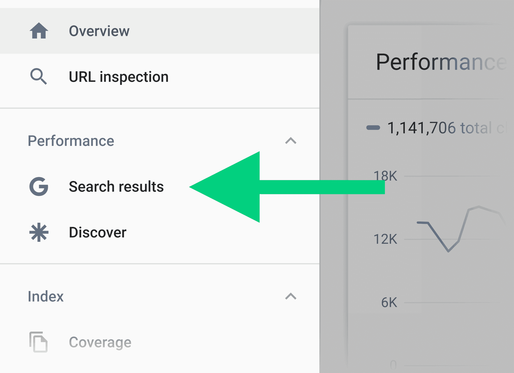</picture>

一定要打到“平均位置”。这样你就可以看到每个关键词的平均排名。

<picture><source type="image/webp" srcset="https://api.backlinko.com/app/uploads/2018/05/click-average-position.webp 1824w, https://api.backlinko.com/app/uploads/2018/05/click-average-position-300x127.webp 300w, https://api.backlinko.com/app/uploads/2018/05/click-average-position-1280x543.webp 1280w, https://api.backlinko.com/app/uploads/2018/05/click-average-position-768x326.webp 768w, https://api.backlinko.com/app/uploads/2018/05/click-average-position-1536x652.webp 1536w, https://api.backlinko.com/app/uploads/2018/05/click-average-position-480x204.webp 480w, https://api.backlinko.com/app/uploads/2018/05/click-average-position-640x272.webp 640w, https://api.backlinko.com/app/uploads/2018/05/click-average-position-960x407.webp 960w, https://api.backlinko.com/app/uploads/2018/05/click-average-position-1440x611.webp 1440w, https://api.backlinko.com/app/uploads/2018/05/click-average-position-1600x679.webp 1600w" sizes="(max-width: 600px) 100vw, 600px">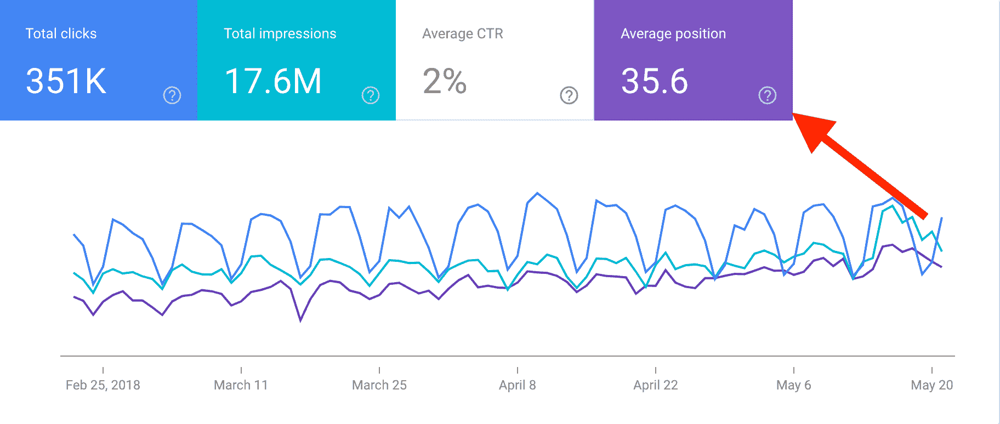</picture>

然后，按“位置”对结果进行排序:

<picture><source type="image/webp" srcset="https://api.backlinko.com/app/uploads/2018/05/sort-by-position.webp 1028w, https://api.backlinko.com/app/uploads/2018/05/sort-by-position-300x180.webp 300w, https://api.backlinko.com/app/uploads/2018/05/sort-by-position-768x462.webp 768w, https://api.backlinko.com/app/uploads/2018/05/sort-by-position-480x289.webp 480w, https://api.backlinko.com/app/uploads/2018/05/sort-by-position-640x385.webp 640w, https://api.backlinko.com/app/uploads/2018/05/sort-by-position-960x577.webp 960w" sizes="(max-width: 514px) 100vw, 514px">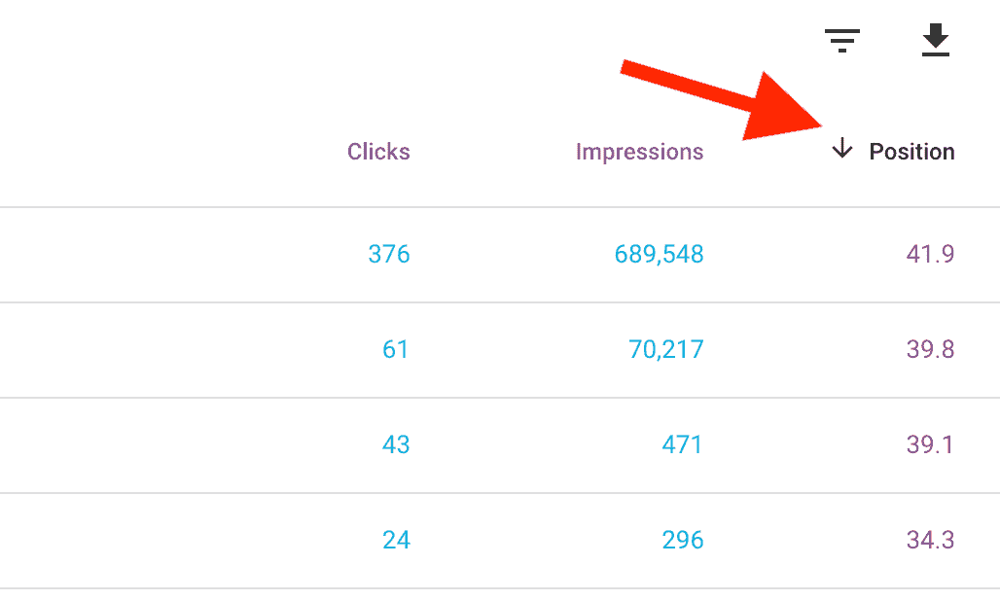</picture>

接下来，寻找**平均位置在 11-30 的关键词。**

如果你在第 2 页或第 3 页上点击了某个关键词，你可以很确定这个关键词有一定的搜索量。

例如，【Backlinko 的这个页面在关键词“网站审计”中排名第 17。

尽管我已经在第二页了，但这个关键词每月仍有 28 次点击和 14，251 次展示:

<picture><source type="image/webp" srcset="https://api.backlinko.com/app/uploads/2020/12/site-audit-keyword-clicks-and-impressions.webp 2560w, https://api.backlinko.com/app/uploads/2020/12/site-audit-keyword-clicks-and-impressions-300x70.webp 300w, https://api.backlinko.com/app/uploads/2020/12/site-audit-keyword-clicks-and-impressions-1280x301.webp 1280w, https://api.backlinko.com/app/uploads/2020/12/site-audit-keyword-clicks-and-impressions-768x180.webp 768w, https://api.backlinko.com/app/uploads/2020/12/site-audit-keyword-clicks-and-impressions-1536x361.webp 1536w, https://api.backlinko.com/app/uploads/2020/12/site-audit-keyword-clicks-and-impressions-2048x481.webp 2048w, https://api.backlinko.com/app/uploads/2020/12/site-audit-keyword-clicks-and-impressions-480x113.webp 480w, https://api.backlinko.com/app/uploads/2020/12/site-audit-keyword-clicks-and-impressions-640x150.webp 640w, https://api.backlinko.com/app/uploads/2020/12/site-audit-keyword-clicks-and-impressions-960x225.webp 960w, https://api.backlinko.com/app/uploads/2020/12/site-audit-keyword-clicks-and-impressions-1440x338.webp 1440w, https://api.backlinko.com/app/uploads/2020/12/site-audit-keyword-clicks-and-impressions-1600x376.webp 1600w, https://api.backlinko.com/app/uploads/2020/12/site-audit-keyword-clicks-and-impressions-1920x451.webp 1920w" sizes="(max-width: 600px) 100vw, 600px">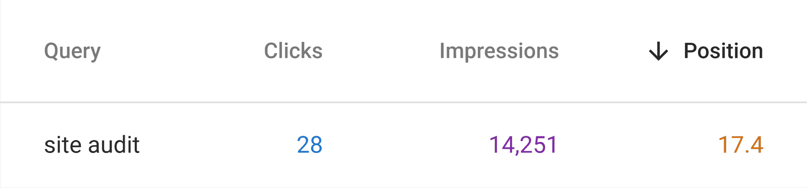</picture>

果然，根据 Semrush 的说法，该关键字每月获得 4.4k 次搜索，建议出价为 6.13 美元。

<picture><source type="image/webp" srcset="https://api.backlinko.com/app/uploads/2022/02/keyword-overview-site-audit.webp 2500w, https://api.backlinko.com/app/uploads/2022/02/keyword-overview-site-audit-300x242.webp 300w, https://api.backlinko.com/app/uploads/2022/02/keyword-overview-site-audit-1280x1031.webp 1280w, https://api.backlinko.com/app/uploads/2022/02/keyword-overview-site-audit-768x619.webp 768w, https://api.backlinko.com/app/uploads/2022/02/keyword-overview-site-audit-1536x1237.webp 1536w, https://api.backlinko.com/app/uploads/2022/02/keyword-overview-site-audit-2048x1650.webp 2048w, https://api.backlinko.com/app/uploads/2022/02/keyword-overview-site-audit-480x387.webp 480w, https://api.backlinko.com/app/uploads/2022/02/keyword-overview-site-audit-640x516.webp 640w, https://api.backlinko.com/app/uploads/2022/02/keyword-overview-site-audit-960x773.webp 960w, https://api.backlinko.com/app/uploads/2022/02/keyword-overview-site-audit-1440x1160.webp 1440w, https://api.backlinko.com/app/uploads/2022/02/keyword-overview-site-audit-1600x1289.webp 1600w, https://api.backlinko.com/app/uploads/2022/02/keyword-overview-site-audit-1920x1547.webp 1920w" sizes="(max-width: 600px) 100vw, 600px">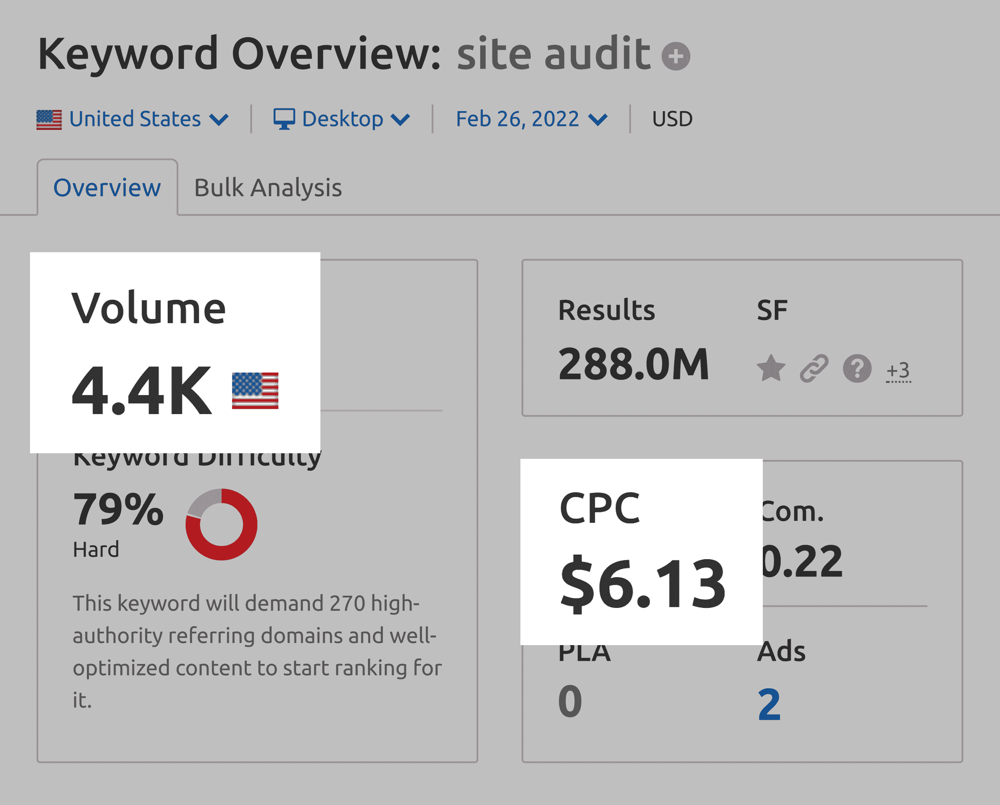</picture>

这意味着值得我花时间把这篇文章放到谷歌的首页。

第二步:识别你网站上的权威页面。

使用 [Semrush](https://semrush.com/) ，你可以很容易地找到网站上最有活力的页面。

只需在工具中输入您的主页网址，然后点击“搜索”:

<picture><source type="image/webp" srcset="https://api.backlinko.com/app/uploads/2022/02/semrush-input-website.webp 2312w, https://api.backlinko.com/app/uploads/2022/02/semrush-input-website-300x64.webp 300w, https://api.backlinko.com/app/uploads/2022/02/semrush-input-website-1280x272.webp 1280w, https://api.backlinko.com/app/uploads/2022/02/semrush-input-website-768x163.webp 768w, https://api.backlinko.com/app/uploads/2022/02/semrush-input-website-1536x326.webp 1536w, https://api.backlinko.com/app/uploads/2022/02/semrush-input-website-2048x435.webp 2048w, https://api.backlinko.com/app/uploads/2022/02/semrush-input-website-480x102.webp 480w, https://api.backlinko.com/app/uploads/2022/02/semrush-input-website-640x136.webp 640w, https://api.backlinko.com/app/uploads/2022/02/semrush-input-website-960x204.webp 960w, https://api.backlinko.com/app/uploads/2022/02/semrush-input-website-1440x306.webp 1440w, https://api.backlinko.com/app/uploads/2022/02/semrush-input-website-1600x340.webp 1600w, https://api.backlinko.com/app/uploads/2022/02/semrush-input-website-1920x408.webp 1920w" sizes="(max-width: 550px) 100vw, 550px">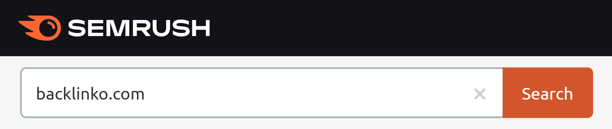</picture>

然后点击左侧边栏中的“反向链接分析”，然后点击“索引页面”。

这将显示您网站上最权威的页面:

<picture><source type="image/webp" srcset="https://api.backlinko.com/app/uploads/2022/02/indexed-pages-backlinko.webp 2344w, https://api.backlinko.com/app/uploads/2022/02/indexed-pages-backlinko-300x433.webp 300w, https://api.backlinko.com/app/uploads/2022/02/indexed-pages-backlinko-1280x1846.webp 1280w, https://api.backlinko.com/app/uploads/2022/02/indexed-pages-backlinko-768x1108.webp 768w, https://api.backlinko.com/app/uploads/2022/02/indexed-pages-backlinko-1065x1536.webp 1065w, https://api.backlinko.com/app/uploads/2022/02/indexed-pages-backlinko-1420x2048.webp 1420w, https://api.backlinko.com/app/uploads/2022/02/indexed-pages-backlinko-480x692.webp 480w, https://api.backlinko.com/app/uploads/2022/02/indexed-pages-backlinko-640x923.webp 640w, https://api.backlinko.com/app/uploads/2022/02/indexed-pages-backlinko-960x1385.webp 960w, https://api.backlinko.com/app/uploads/2022/02/indexed-pages-backlinko-1440x2077.webp 1440w, https://api.backlinko.com/app/uploads/2022/02/indexed-pages-backlinko-1600x2308.webp 1600w, https://api.backlinko.com/app/uploads/2022/02/indexed-pages-backlinko-1920x2769.webp 1920w" sizes="(max-width: 600px) 100vw, 600px">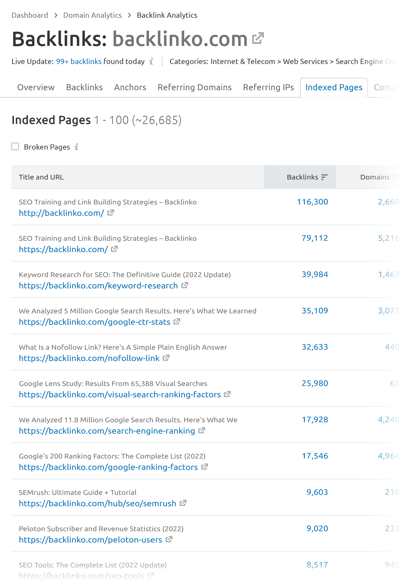</picture>

第三步:进入登陆页面，添加内部链接。

最后，添加从权威页面**到**需要改进的登陆页面的内部链接**。**

<picture><source type="image/webp" srcset="https://api.backlinko.com/app/uploads/2018/05/internal-link.webp 1714w, https://api.backlinko.com/app/uploads/2018/05/internal-link-300x106.webp 300w, https://api.backlinko.com/app/uploads/2018/05/internal-link-1280x451.webp 1280w, https://api.backlinko.com/app/uploads/2018/05/internal-link-768x271.webp 768w, https://api.backlinko.com/app/uploads/2018/05/internal-link-1536x541.webp 1536w, https://api.backlinko.com/app/uploads/2018/05/internal-link-480x169.webp 480w, https://api.backlinko.com/app/uploads/2018/05/internal-link-640x226.webp 640w, https://api.backlinko.com/app/uploads/2018/05/internal-link-960x338.webp 960w, https://api.backlinko.com/app/uploads/2018/05/internal-link-1440x507.webp 1440w, https://api.backlinko.com/app/uploads/2018/05/internal-link-1600x564.webp 1600w" sizes="(max-width: 600px) 100vw, 600px">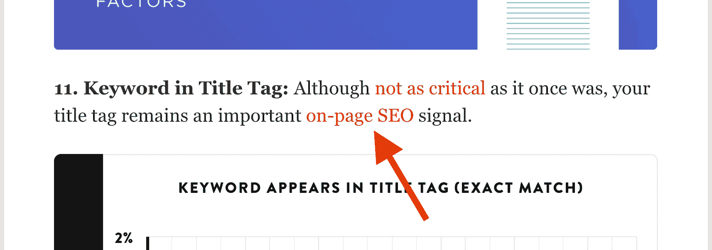</picture>

## 10。提高电子邮件外联回复率

当一个人在收件箱里看到一封随机发来的邮件时，他们会想到两个问题:

“这个人是谁？”以及“他们想要什么？”

你越快在[外展邮件](https://backlinko.com/hub/content/email-outreach)中回答这些问题，你的回复率就越高。

但是你怎么能这样做呢？

在邮件的开头使用“因为”这个词。

哈佛大学艾伦·兰格博士的研究测试了排队使用复印机的人是否会让陌生人插队。

<picture><source type="image/webp" srcset="https://api.backlinko.com/app/uploads/2018/05/stranger-research.webp 1452w, https://api.backlinko.com/app/uploads/2018/05/stranger-research-300x193.webp 300w, https://api.backlinko.com/app/uploads/2018/05/stranger-research-1280x822.webp 1280w, https://api.backlinko.com/app/uploads/2018/05/stranger-research-768x493.webp 768w, https://api.backlinko.com/app/uploads/2018/05/stranger-research-480x308.webp 480w, https://api.backlinko.com/app/uploads/2018/05/stranger-research-640x411.webp 640w, https://api.backlinko.com/app/uploads/2018/05/stranger-research-960x616.webp 960w, https://api.backlinko.com/app/uploads/2018/05/stranger-research-1440x924.webp 1440w" sizes="(max-width: 600px) 100vw, 600px">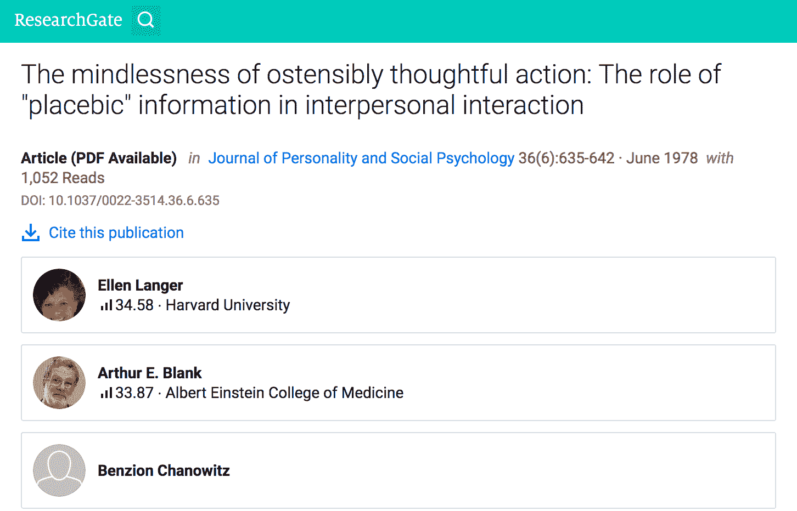</picture>

当陌生人问:“我可以比你先用复印机吗？”，只有 61%的人说“是”。

但是当陌生人问:“我可以在你之前使用复印机吗*因为我在赶时间*？”，89%的人说是。

<picture><source type="image/webp" srcset="https://api.backlinko.com/app/uploads/2020/02/percent-of-people-who-will-say-yes.webp 1200w, https://api.backlinko.com/app/uploads/2020/02/percent-of-people-who-will-say-yes-300x187.webp 300w, https://api.backlinko.com/app/uploads/2020/02/percent-of-people-who-will-say-yes-768x479.webp 768w, https://api.backlinko.com/app/uploads/2020/02/percent-of-people-who-will-say-yes-480x300.webp 480w, https://api.backlinko.com/app/uploads/2020/02/percent-of-people-who-will-say-yes-640x399.webp 640w, https://api.backlinko.com/app/uploads/2020/02/percent-of-people-who-will-say-yes-960x599.webp 960w" sizes="(max-width: 600px) 100vw, 600px">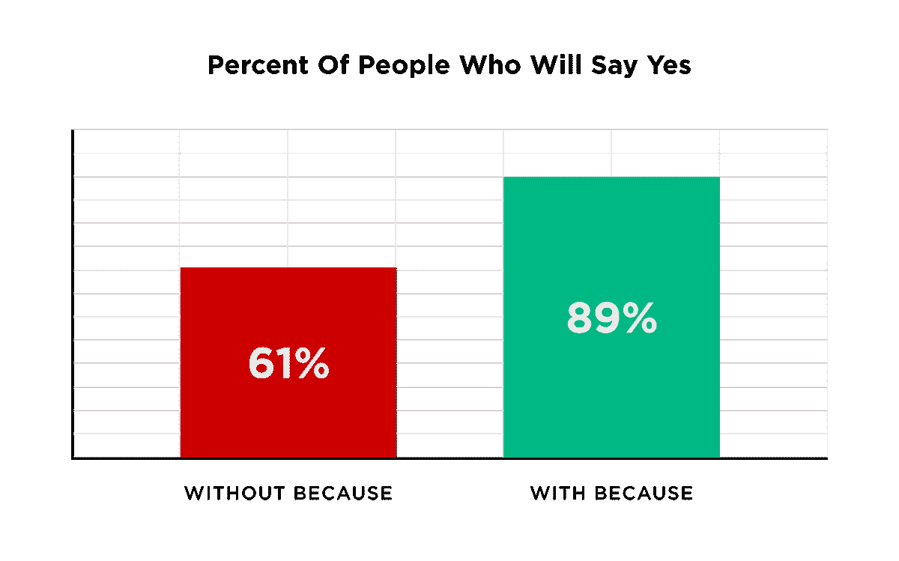</picture>

(增长了 45%。)

原来“因为”这个词让你的要求看起来更合理。

在外展的世界里，合法的信息会得到更好的回应。

这里有一个博客推广的例子，它利用了早期的“因为”一词:

<picture><source type="image/webp" srcset="https://api.backlinko.com/app/uploads/2016/03/example-outreach-email.webp 1255w, https://api.backlinko.com/app/uploads/2016/03/example-outreach-email-300x139.webp 300w, https://api.backlinko.com/app/uploads/2016/03/example-outreach-email-768x356.webp 768w, https://api.backlinko.com/app/uploads/2016/03/example-outreach-email-480x223.webp 480w, https://api.backlinko.com/app/uploads/2016/03/example-outreach-email-640x297.webp 640w, https://api.backlinko.com/app/uploads/2016/03/example-outreach-email-960x445.webp 960w" sizes="(max-width: 600px) 100vw, 600px">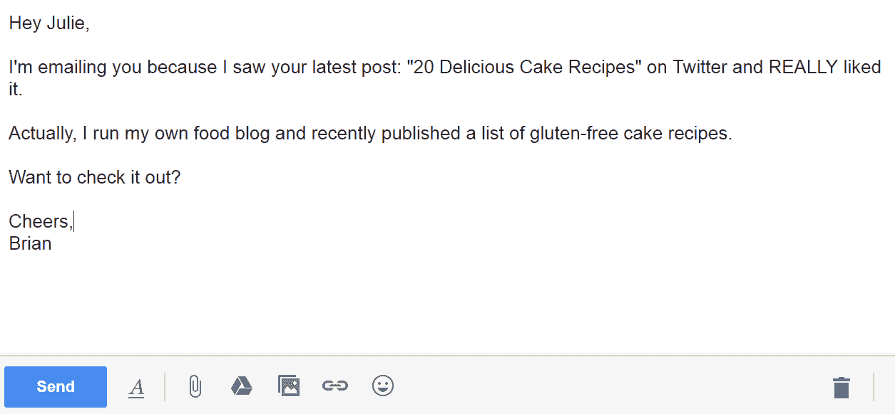</picture>

收到信息的人知道我为什么在读了两秒钟后就发邮件给他们。

但更重要的是,“因为”这个词巩固了我寻求帮助的正当理由。

## **11。写长长的 YouTube 描述**

根据 Semrush Sensor 的数据，视频出现在超过 10%的 serp 上[。](https://www.semrush.com/sensor/?db=US&category=)

考虑到谷歌拥有这个广受欢迎的视频网站，这种趋势不太可能很快改变。

如果你想让你的视频在谷歌排名，我建议写长视频描述。

请记住:谷歌无法观看或收听您的视频内容。

相反，他们依靠你的视频的**文本** **标题和描述**来确定你的视频是关于什么的。

这些额外的文本内容可以帮助你对目标关键词进行排名。

例如，我最近发布了一个视频，概述了一些 DIY 搜索引擎优化策略:

这是那个视频的描述:

<picture><source type="image/webp" srcset="https://api.backlinko.com/app/uploads/2016/03/youtube-video-description.webp 1715w, https://api.backlinko.com/app/uploads/2016/03/youtube-video-description-300x236.webp 300w, https://api.backlinko.com/app/uploads/2016/03/youtube-video-description-1280x1008.webp 1280w, https://api.backlinko.com/app/uploads/2016/03/youtube-video-description-768x605.webp 768w, https://api.backlinko.com/app/uploads/2016/03/youtube-video-description-1536x1209.webp 1536w, https://api.backlinko.com/app/uploads/2016/03/youtube-video-description-480x378.webp 480w, https://api.backlinko.com/app/uploads/2016/03/youtube-video-description-640x504.webp 640w, https://api.backlinko.com/app/uploads/2016/03/youtube-video-description-960x756.webp 960w, https://api.backlinko.com/app/uploads/2016/03/youtube-video-description-1440x1134.webp 1440w, https://api.backlinko.com/app/uploads/2016/03/youtube-video-description-1600x1259.webp 1600w" sizes="(max-width: 600px) 100vw, 600px">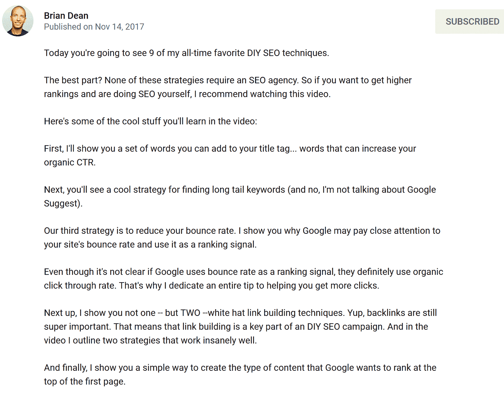</picture>

如你所见，那是一个高质量的，200 字的[视频描述](https://backlinko.com/hub/youtube/video-description "Video Description")(你可能也注意到了，它几次包含了我的目标关键词“DIY SEO”)。

这个描述也是我的视频在 YouTube 上以我的目标关键词飙升到第一页的原因之一:

<picture><source type="image/webp" srcset="https://api.backlinko.com/app/uploads/2020/12/youtube-search-results-diy-seo.webp 2560w, https://api.backlinko.com/app/uploads/2020/12/youtube-search-results-diy-seo-300x256.webp 300w, https://api.backlinko.com/app/uploads/2020/12/youtube-search-results-diy-seo-1280x1093.webp 1280w, https://api.backlinko.com/app/uploads/2020/12/youtube-search-results-diy-seo-768x656.webp 768w, https://api.backlinko.com/app/uploads/2020/12/youtube-search-results-diy-seo-1536x1311.webp 1536w, https://api.backlinko.com/app/uploads/2020/12/youtube-search-results-diy-seo-2048x1748.webp 2048w, https://api.backlinko.com/app/uploads/2020/12/youtube-search-results-diy-seo-480x410.webp 480w, https://api.backlinko.com/app/uploads/2020/12/youtube-search-results-diy-seo-640x546.webp 640w, https://api.backlinko.com/app/uploads/2020/12/youtube-search-results-diy-seo-960x819.webp 960w, https://api.backlinko.com/app/uploads/2020/12/youtube-search-results-diy-seo-1440x1229.webp 1440w, https://api.backlinko.com/app/uploads/2020/12/youtube-search-results-diy-seo-1600x1366.webp 1600w, https://api.backlinko.com/app/uploads/2020/12/youtube-search-results-diy-seo-1920x1639.webp 1920w" sizes="(max-width: 600px) 100vw, 600px">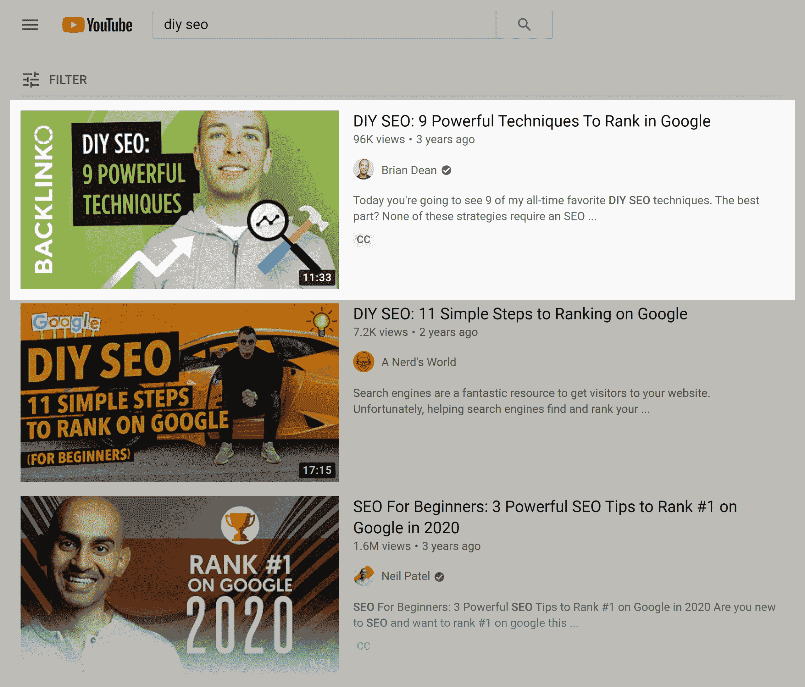</picture>

## **12。为语义 SEO 优化内容**

几年前，谷歌推出了名为[蜂鸟](https://en.wikipedia.org/wiki/Google_Hummingbird)的搜索算法。

<picture><source type="image/webp" srcset="https://api.backlinko.com/app/uploads/2018/05/google-hummingbird-wiki.webp 2390w, https://api.backlinko.com/app/uploads/2018/05/google-hummingbird-wiki-300x128.webp 300w, https://api.backlinko.com/app/uploads/2018/05/google-hummingbird-wiki-1280x544.webp 1280w, https://api.backlinko.com/app/uploads/2018/05/google-hummingbird-wiki-768x326.webp 768w, https://api.backlinko.com/app/uploads/2018/05/google-hummingbird-wiki-1536x653.webp 1536w, https://api.backlinko.com/app/uploads/2018/05/google-hummingbird-wiki-2048x871.webp 2048w, https://api.backlinko.com/app/uploads/2018/05/google-hummingbird-wiki-480x204.webp 480w, https://api.backlinko.com/app/uploads/2018/05/google-hummingbird-wiki-640x272.webp 640w, https://api.backlinko.com/app/uploads/2018/05/google-hummingbird-wiki-960x408.webp 960w, https://api.backlinko.com/app/uploads/2018/05/google-hummingbird-wiki-1440x612.webp 1440w, https://api.backlinko.com/app/uploads/2018/05/google-hummingbird-wiki-1600x680.webp 1600w, https://api.backlinko.com/app/uploads/2018/05/google-hummingbird-wiki-1920x816.webp 1920w" sizes="(max-width: 600px) 100vw, 600px"></picture>

在蜂鸟之前，基本上谷歌只分析你页面上的个别关键词。

<picture><source type="image/webp" srcset="https://api.backlinko.com/app/uploads/2018/05/keyword-analysis.webp 1875w, https://api.backlinko.com/app/uploads/2018/05/keyword-analysis-300x191.webp 300w, https://api.backlinko.com/app/uploads/2018/05/keyword-analysis-1280x816.webp 1280w, https://api.backlinko.com/app/uploads/2018/05/keyword-analysis-768x489.webp 768w, https://api.backlinko.com/app/uploads/2018/05/keyword-analysis-1536x979.webp 1536w, https://api.backlinko.com/app/uploads/2018/05/keyword-analysis-480x306.webp 480w, https://api.backlinko.com/app/uploads/2018/05/keyword-analysis-640x408.webp 640w, https://api.backlinko.com/app/uploads/2018/05/keyword-analysis-960x612.webp 960w, https://api.backlinko.com/app/uploads/2018/05/keyword-analysis-1440x918.webp 1440w, https://api.backlinko.com/app/uploads/2018/05/keyword-analysis-1600x1020.webp 1600w" sizes="(max-width: 600px) 100vw, 600px">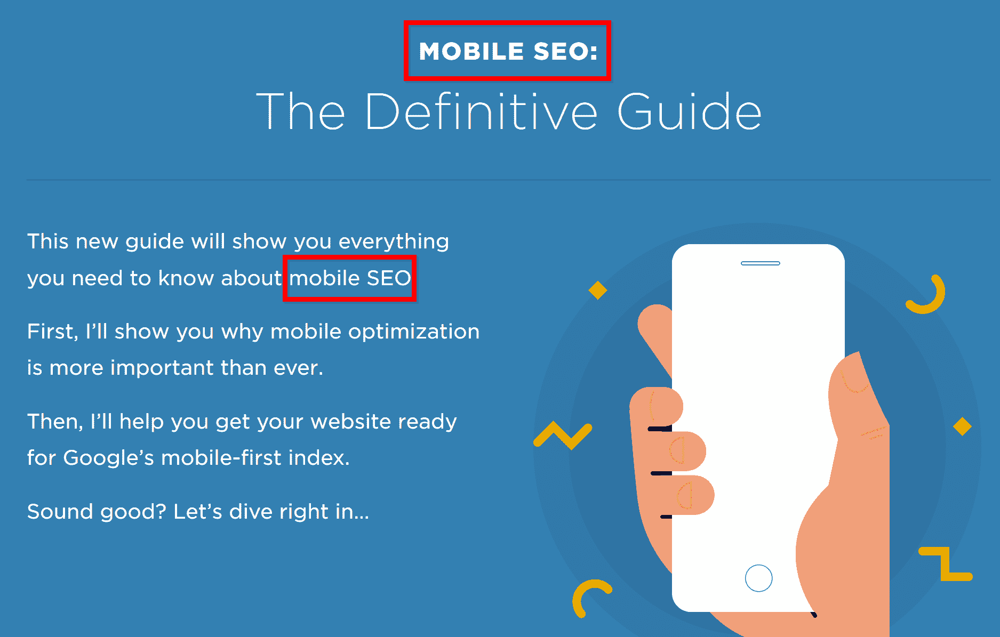</picture>

但是多亏了这种新算法，谷歌现在可以理解你页面的主题。

(对了，搜索引擎理解话题的能力叫做:[语义 SEO](https://backlinko.com/hub/seo/semantic-seo) 。)

下面是如何开始语义搜索引擎优化:

首先，围绕你的目标关键词优化你的页面，就像你平常做的那样。

然后，覆盖与你的目标关键词相关的副主题。

这样，谷歌就能完全理解你页面的主题(不仅仅是你的关键词)。

例如，我网站上的这个页面是 200 个谷歌排名因素的列表:

<picture><source type="image/webp" srcset="https://api.backlinko.com/app/uploads/2020/12/backlinko-google-ranking-factors-2021.webp 2560w, https://api.backlinko.com/app/uploads/2020/12/backlinko-google-ranking-factors-2021-300x253.webp 300w, https://api.backlinko.com/app/uploads/2020/12/backlinko-google-ranking-factors-2021-1280x1078.webp 1280w, https://api.backlinko.com/app/uploads/2020/12/backlinko-google-ranking-factors-2021-768x647.webp 768w, https://api.backlinko.com/app/uploads/2020/12/backlinko-google-ranking-factors-2021-1536x1293.webp 1536w, https://api.backlinko.com/app/uploads/2020/12/backlinko-google-ranking-factors-2021-2048x1724.webp 2048w, https://api.backlinko.com/app/uploads/2020/12/backlinko-google-ranking-factors-2021-480x404.webp 480w, https://api.backlinko.com/app/uploads/2020/12/backlinko-google-ranking-factors-2021-640x539.webp 640w, https://api.backlinko.com/app/uploads/2020/12/backlinko-google-ranking-factors-2021-960x808.webp 960w, https://api.backlinko.com/app/uploads/2020/12/backlinko-google-ranking-factors-2021-1440x1212.webp 1440w, https://api.backlinko.com/app/uploads/2020/12/backlinko-google-ranking-factors-2021-1600x1347.webp 1600w, https://api.backlinko.com/app/uploads/2020/12/backlinko-google-ranking-factors-2021-1920x1616.webp 1920w" sizes="(max-width: 600px) 100vw, 600px">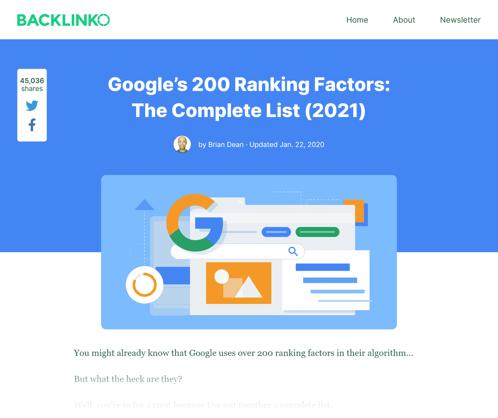</picture>

因为我涉及子主题(如谷歌处罚和网站级因素)，谷歌知道我的内容是什么。

因为谷歌可以完全理解我的内容的主题，它对这个页面的 2400 多个关键词进行了排名(根据 Semrush 的说法):

<picture><source type="image/webp" srcset="https://api.backlinko.com/app/uploads/2018/05/number-of-ranking-keywords.webp 1589w, https://api.backlinko.com/app/uploads/2018/05/number-of-ranking-keywords-300x178.webp 300w, https://api.backlinko.com/app/uploads/2018/05/number-of-ranking-keywords-1280x760.webp 1280w, https://api.backlinko.com/app/uploads/2018/05/number-of-ranking-keywords-768x456.webp 768w, https://api.backlinko.com/app/uploads/2018/05/number-of-ranking-keywords-1536x913.webp 1536w, https://api.backlinko.com/app/uploads/2018/05/number-of-ranking-keywords-480x285.webp 480w, https://api.backlinko.com/app/uploads/2018/05/number-of-ranking-keywords-640x380.webp 640w, https://api.backlinko.com/app/uploads/2018/05/number-of-ranking-keywords-960x570.webp 960w, https://api.backlinko.com/app/uploads/2018/05/number-of-ranking-keywords-1440x855.webp 1440w" sizes="(max-width: 600px) 100vw, 600px">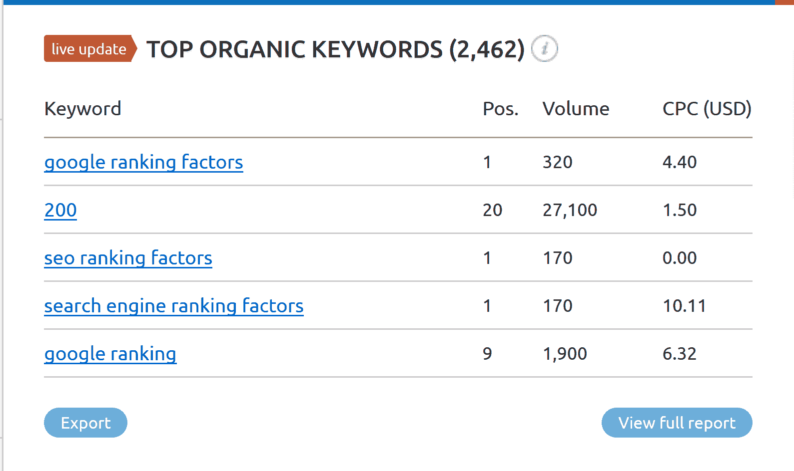</picture>

你可以使用名为 [LSIGraph](https://lsigraph.com/) 的工具找到相关的副主题:

<picture><source type="image/webp" srcset="https://api.backlinko.com/app/uploads/2018/05/lsigraph-homepage.webp 1686w, https://api.backlinko.com/app/uploads/2018/05/lsigraph-homepage-300x184.webp 300w, https://api.backlinko.com/app/uploads/2018/05/lsigraph-homepage-1280x785.webp 1280w, https://api.backlinko.com/app/uploads/2018/05/lsigraph-homepage-768x471.webp 768w, https://api.backlinko.com/app/uploads/2018/05/lsigraph-homepage-1536x942.webp 1536w, https://api.backlinko.com/app/uploads/2018/05/lsigraph-homepage-480x294.webp 480w, https://api.backlinko.com/app/uploads/2018/05/lsigraph-homepage-640x393.webp 640w, https://api.backlinko.com/app/uploads/2018/05/lsigraph-homepage-960x589.webp 960w, https://api.backlinko.com/app/uploads/2018/05/lsigraph-homepage-1440x883.webp 1440w, https://api.backlinko.com/app/uploads/2018/05/lsigraph-homepage-1600x981.webp 1600w" sizes="(max-width: 600px) 100vw, 600px">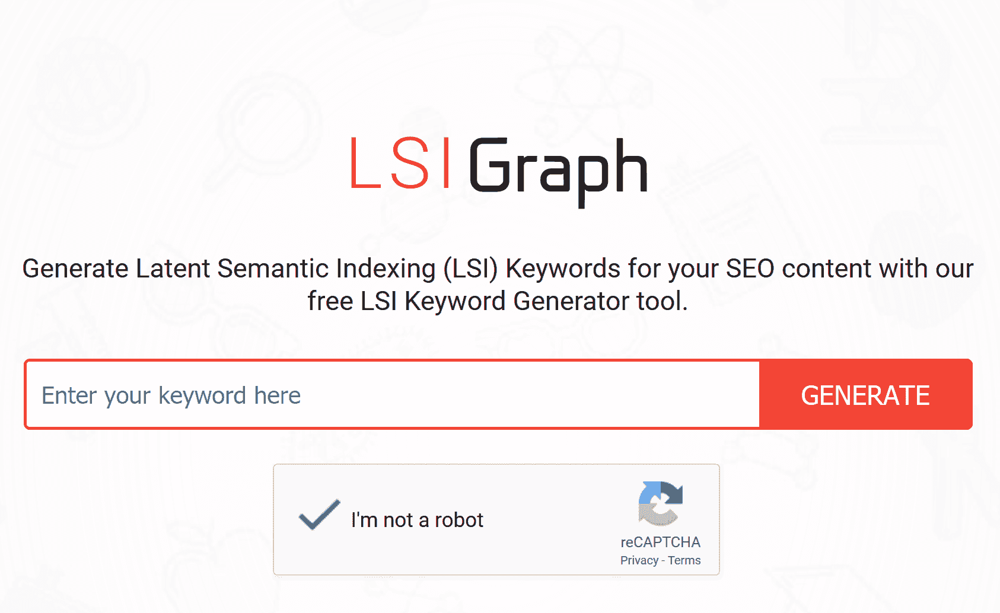</picture>

此工具显示与您键入的关键字相关的副主题(和术语)。

## 13。在标题标签中嵌入长尾关键词

这是一个实施这种策略的例子:

我来解释一下:不久前我发表了一篇名为“白帽 SEO 案例研究:如何获得排名第一”的文章

<picture><source type="image/webp" srcset="https://api.backlinko.com/app/uploads/2018/05/white-hat-seo-case-study.webp 1230w, https://api.backlinko.com/app/uploads/2018/05/white-hat-seo-case-study-300x214.webp 300w, https://api.backlinko.com/app/uploads/2018/05/white-hat-seo-case-study-768x548.webp 768w, https://api.backlinko.com/app/uploads/2018/05/white-hat-seo-case-study-480x343.webp 480w, https://api.backlinko.com/app/uploads/2018/05/white-hat-seo-case-study-640x457.webp 640w, https://api.backlinko.com/app/uploads/2018/05/white-hat-seo-case-study-960x685.webp 960w" sizes="(max-width: 600px) 100vw, 600px">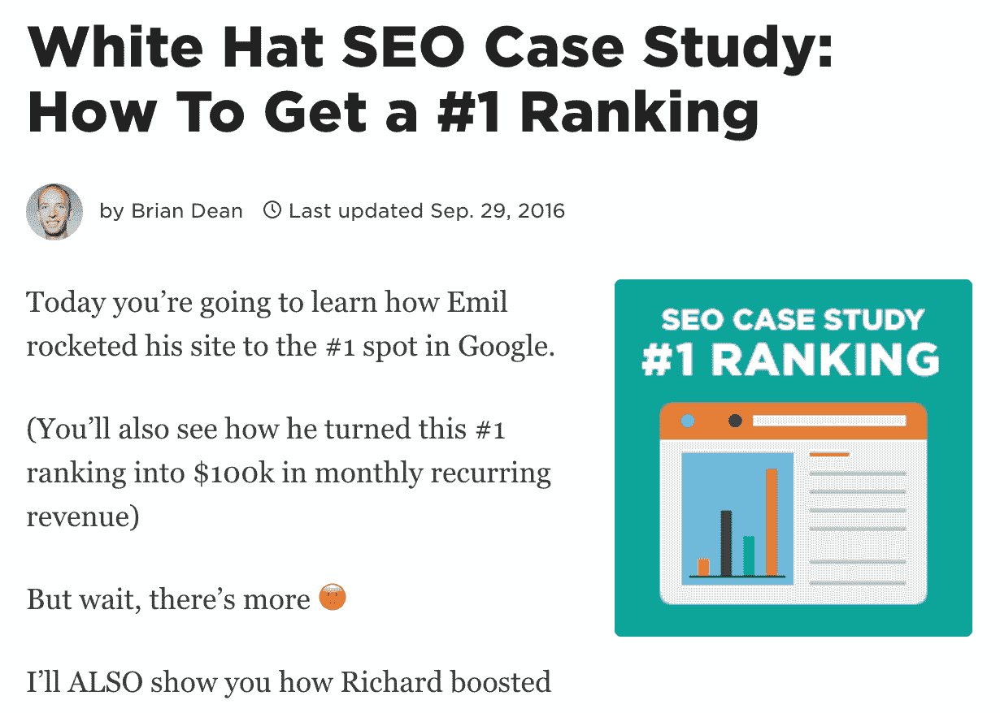</picture>

我这篇文章的目标关键词是“白帽 SEO”。

所以我在文章标题中加入了关键词“白帽 SEO”。

但我并没有就此止步…

我意识到，关键字“SEO 案例研究”每个月的搜索量也相当可观:

<picture><source type="image/webp" srcset="https://api.backlinko.com/app/uploads/2018/05/seo-case-study-search-volume.webp 1850w, https://api.backlinko.com/app/uploads/2018/05/seo-case-study-search-volume-300x135.webp 300w, https://api.backlinko.com/app/uploads/2018/05/seo-case-study-search-volume-1280x576.webp 1280w, https://api.backlinko.com/app/uploads/2018/05/seo-case-study-search-volume-768x345.webp 768w, https://api.backlinko.com/app/uploads/2018/05/seo-case-study-search-volume-1536x691.webp 1536w, https://api.backlinko.com/app/uploads/2018/05/seo-case-study-search-volume-480x216.webp 480w, https://api.backlinko.com/app/uploads/2018/05/seo-case-study-search-volume-640x288.webp 640w, https://api.backlinko.com/app/uploads/2018/05/seo-case-study-search-volume-960x432.webp 960w, https://api.backlinko.com/app/uploads/2018/05/seo-case-study-search-volume-1440x648.webp 1440w, https://api.backlinko.com/app/uploads/2018/05/seo-case-study-search-volume-1600x720.webp 1600w" sizes="(max-width: 600px) 100vw, 600px">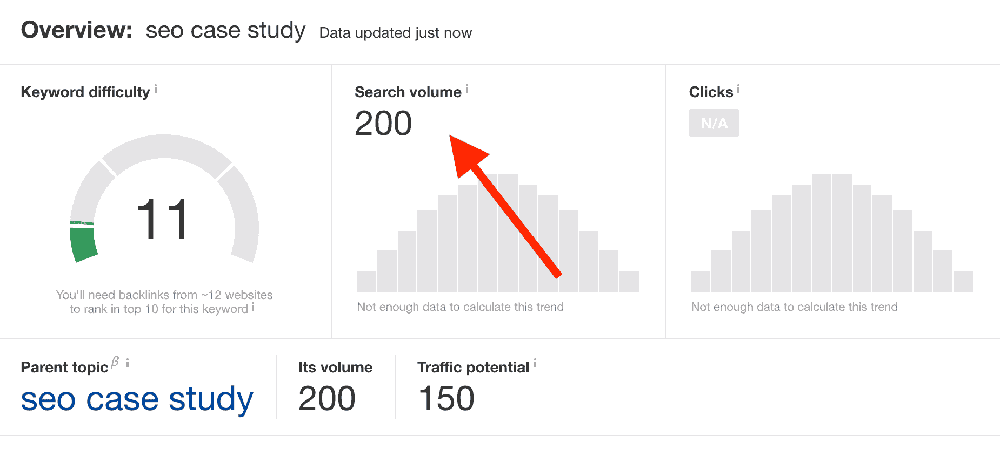</picture>

所以我决定把**那个**长尾关键词嵌入博文标题:

<picture><source type="image/webp" srcset="https://api.backlinko.com/app/uploads/2018/05/long-tail-keyword-embed.webp 1892w, https://api.backlinko.com/app/uploads/2018/05/long-tail-keyword-embed-300x129.webp 300w, https://api.backlinko.com/app/uploads/2018/05/long-tail-keyword-embed-1280x549.webp 1280w, https://api.backlinko.com/app/uploads/2018/05/long-tail-keyword-embed-768x330.webp 768w, https://api.backlinko.com/app/uploads/2018/05/long-tail-keyword-embed-1536x659.webp 1536w, https://api.backlinko.com/app/uploads/2018/05/long-tail-keyword-embed-480x206.webp 480w, https://api.backlinko.com/app/uploads/2018/05/long-tail-keyword-embed-640x275.webp 640w, https://api.backlinko.com/app/uploads/2018/05/long-tail-keyword-embed-960x412.webp 960w, https://api.backlinko.com/app/uploads/2018/05/long-tail-keyword-embed-1440x618.webp 1440w, https://api.backlinko.com/app/uploads/2018/05/long-tail-keyword-embed-1600x687.webp 1600w" sizes="(max-width: 600px) 100vw, 600px">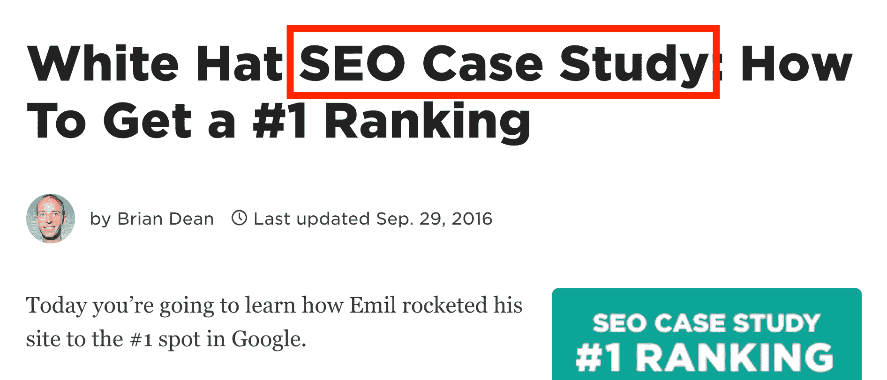</picture>

它在短短几周内就登上了“SEO 案例研究”的第五名。

正如你所料，“SEO 案例研究”这个关键词的竞争力远不如“白帽 SEO”。

正因为如此，我在几周内就从关键词“SEO 案例研究”中获得了流量。

随着该页面链接的积累，它成为了“白帽搜索引擎优化”的第一页。

<picture><source type="image/webp" srcset="https://api.backlinko.com/app/uploads/2018/05/white-hat-seo-SERPs.webp 1886w, https://api.backlinko.com/app/uploads/2018/05/white-hat-seo-SERPs-300x190.webp 300w, https://api.backlinko.com/app/uploads/2018/05/white-hat-seo-SERPs-1280x812.webp 1280w, https://api.backlinko.com/app/uploads/2018/05/white-hat-seo-SERPs-768x487.webp 768w, https://api.backlinko.com/app/uploads/2018/05/white-hat-seo-SERPs-1536x974.webp 1536w, https://api.backlinko.com/app/uploads/2018/05/white-hat-seo-SERPs-480x304.webp 480w, https://api.backlinko.com/app/uploads/2018/05/white-hat-seo-SERPs-640x406.webp 640w, https://api.backlinko.com/app/uploads/2018/05/white-hat-seo-SERPs-960x609.webp 960w, https://api.backlinko.com/app/uploads/2018/05/white-hat-seo-SERPs-1440x913.webp 1440w, https://api.backlinko.com/app/uploads/2018/05/white-hat-seo-SERPs-1600x1015.webp 1600w" sizes="(max-width: 600px) 100vw, 600px">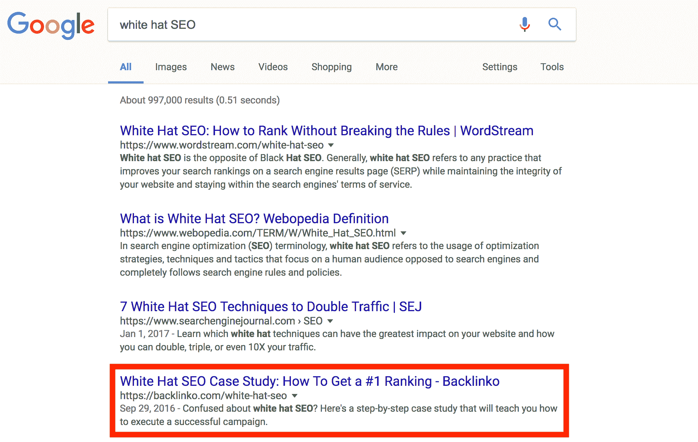</picture>

如果我只有针对“白帽 SEO”优化的*和*，在我点击目标关键词的第一页之前，我不会收到任何有机流量。

**底线:**

找到可以嵌入到标题中的长尾词。

你会更快地获得搜索引擎的流量…最终，对网页进行不止一项的排名。

## **14。使用维基百科查找关键词和主题想法**

想找到你的竞争对手不知道的尚未开发的关键词？

Try Wikipedia .. .

为什么？

如果你想找到与你的种子关键词密切相关的关键词，你需要**一个人类的头脑。**

或者更好的是，成千上万的人为维基百科做出贡献。

**方法如下:**

转到维基百科，输入一个关键字(在这个例子中，我将使用关键字“保险”):

<picture><source type="image/webp" srcset="https://api.backlinko.com/app/uploads/2016/03/wikipedia-search.webp 927w, https://api.backlinko.com/app/uploads/2016/03/wikipedia-search-300x198.webp 300w, https://api.backlinko.com/app/uploads/2016/03/wikipedia-search-768x506.webp 768w, https://api.backlinko.com/app/uploads/2016/03/wikipedia-search-480x316.webp 480w, https://api.backlinko.com/app/uploads/2016/03/wikipedia-search-640x422.webp 640w" sizes="(max-width: 463px) 100vw, 463px">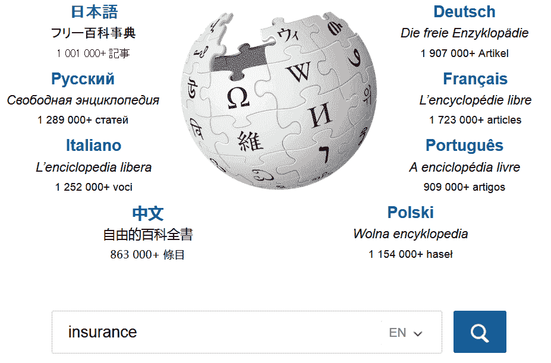</picture>

接下来，留意维基百科条目上显示密切相关的关键词和主题的部分。

这些部分是…“内容”框:

<picture><source type="image/webp" srcset="https://api.backlinko.com/app/uploads/2016/03/wikipedia-table-of-contents.webp 1600w, https://api.backlinko.com/app/uploads/2016/03/wikipedia-table-of-contents-300x428.webp 300w, https://api.backlinko.com/app/uploads/2016/03/wikipedia-table-of-contents-1280x1824.webp 1280w, https://api.backlinko.com/app/uploads/2016/03/wikipedia-table-of-contents-768x1094.webp 768w, https://api.backlinko.com/app/uploads/2016/03/wikipedia-table-of-contents-1078x1536.webp 1078w, https://api.backlinko.com/app/uploads/2016/03/wikipedia-table-of-contents-1437x2048.webp 1437w, https://api.backlinko.com/app/uploads/2016/03/wikipedia-table-of-contents-480x684.webp 480w, https://api.backlinko.com/app/uploads/2016/03/wikipedia-table-of-contents-640x912.webp 640w, https://api.backlinko.com/app/uploads/2016/03/wikipedia-table-of-contents-960x1368.webp 960w, https://api.backlinko.com/app/uploads/2016/03/wikipedia-table-of-contents-1440x2052.webp 1440w" sizes="(max-width: 400px) 100vw, 400px">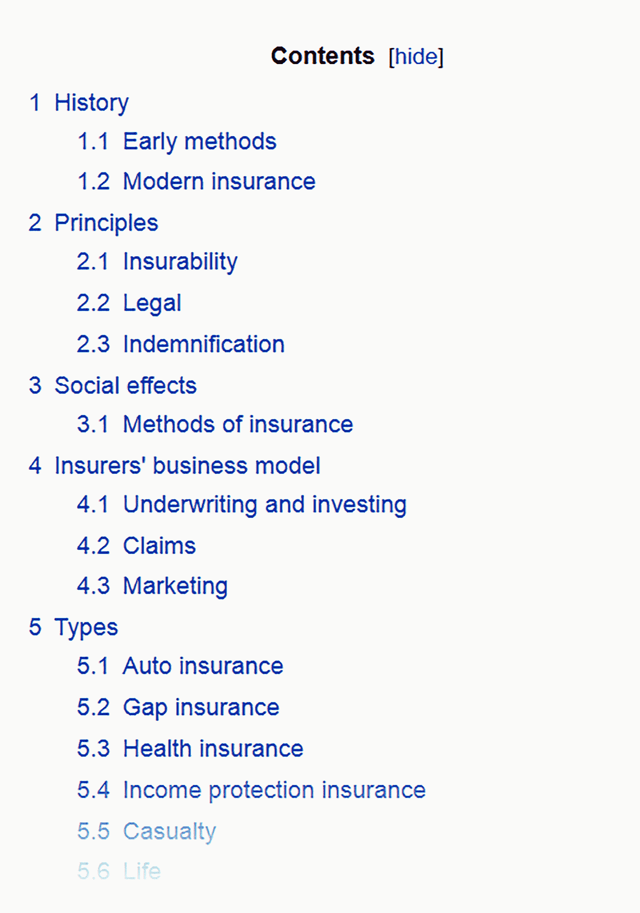</picture>

标注和边栏:

<picture><source type="image/webp" srcset="https://api.backlinko.com/app/uploads/2016/03/wikipedia-sidebar.webp 1600w, https://api.backlinko.com/app/uploads/2016/03/wikipedia-sidebar-300x339.webp 300w, https://api.backlinko.com/app/uploads/2016/03/wikipedia-sidebar-1280x1447.webp 1280w, https://api.backlinko.com/app/uploads/2016/03/wikipedia-sidebar-768x868.webp 768w, https://api.backlinko.com/app/uploads/2016/03/wikipedia-sidebar-1359x1536.webp 1359w, https://api.backlinko.com/app/uploads/2016/03/wikipedia-sidebar-480x543.webp 480w, https://api.backlinko.com/app/uploads/2016/03/wikipedia-sidebar-640x724.webp 640w, https://api.backlinko.com/app/uploads/2016/03/wikipedia-sidebar-960x1085.webp 960w, https://api.backlinko.com/app/uploads/2016/03/wikipedia-sidebar-1440x1628.webp 1440w" sizes="(max-width: 400px) 100vw, 400px">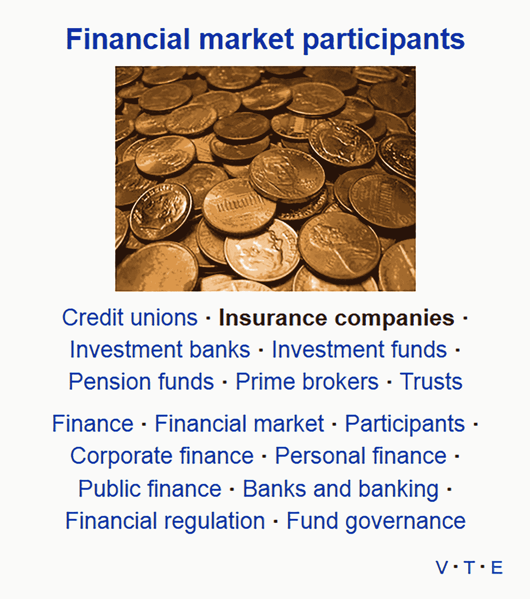</picture>

内部链接:

<picture><source type="image/webp" srcset="https://api.backlinko.com/app/uploads/2016/03/wikipedia-internal-links.webp 992w, https://api.backlinko.com/app/uploads/2016/03/wikipedia-internal-links-300x170.webp 300w, https://api.backlinko.com/app/uploads/2016/03/wikipedia-internal-links-768x435.webp 768w, https://api.backlinko.com/app/uploads/2016/03/wikipedia-internal-links-480x272.webp 480w, https://api.backlinko.com/app/uploads/2016/03/wikipedia-internal-links-640x363.webp 640w, https://api.backlinko.com/app/uploads/2016/03/wikipedia-internal-links-960x544.webp 960w" sizes="(max-width: 496px) 100vw, 496px">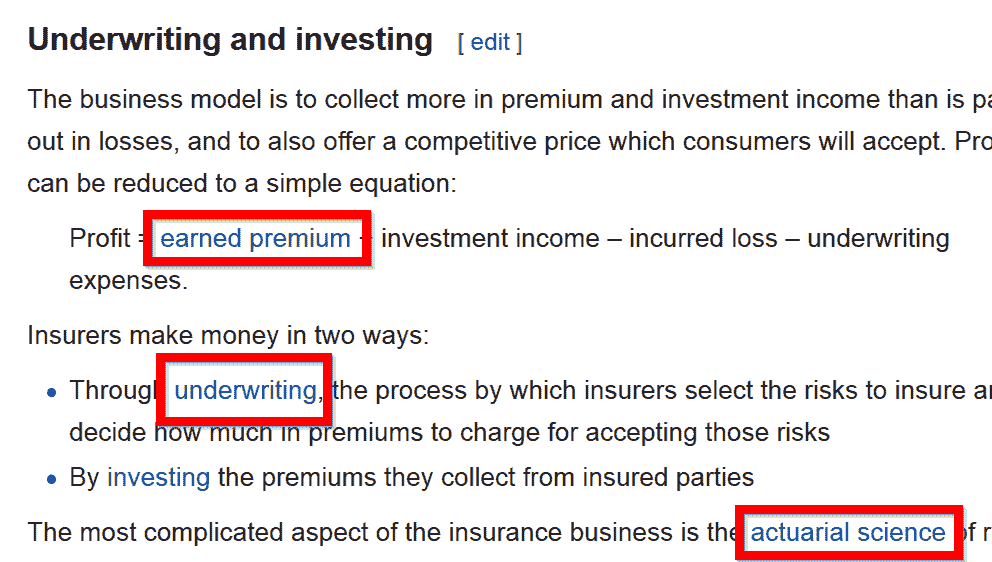</picture>

和“另请参阅”部分:

<picture><source type="image/webp" srcset="https://api.backlinko.com/app/uploads/2016/03/see-also.webp 766w, https://api.backlinko.com/app/uploads/2016/03/see-also-300x261.webp 300w, https://api.backlinko.com/app/uploads/2016/03/see-also-480x418.webp 480w, https://api.backlinko.com/app/uploads/2016/03/see-also-640x557.webp 640w" sizes="(max-width: 383px) 100vw, 383px"></picture>

你通常会从一个维基百科条目中获得大量的关键词和主题思想。

如果你想找到更多的关键词，点击内部链接。

然后简单地对维基百科条目进行同样的处理。

冲洗并重复。

## 15。从“最佳”列表中寻找链接构建机会

如果你做了大量的链接建设，你知道找到利基相关的链接前景并不总是容易的。

你可能没有意识到的是，你所在领域的博客作者以“最佳”博客文章的形式为你创建了这些列表。

“最佳”博客帖子只是某个特定行业中最佳博客的手动列表。

你如何找到这些“最佳”博客文章？

**使用这些搜索字符串:**

*   "[关键词]要关注的博客"
*   “2022 年最佳[关键词]帖子”
*   “要关注的热门[关键词]博客”+“2022”

例如，我刚刚快速搜索了“要关注的健身博客”:

<picture><source type="image/webp" srcset="https://api.backlinko.com/app/uploads/2016/03/google-search.webp 1600w, https://api.backlinko.com/app/uploads/2016/03/google-search-300x146.webp 300w, https://api.backlinko.com/app/uploads/2016/03/google-search-1280x621.webp 1280w, https://api.backlinko.com/app/uploads/2016/03/google-search-768x372.webp 768w, https://api.backlinko.com/app/uploads/2016/03/google-search-1536x745.webp 1536w, https://api.backlinko.com/app/uploads/2016/03/google-search-480x233.webp 480w, https://api.backlinko.com/app/uploads/2016/03/google-search-640x310.webp 640w, https://api.backlinko.com/app/uploads/2016/03/google-search-960x466.webp 960w, https://api.backlinko.com/app/uploads/2016/03/google-search-1440x698.webp 1440w" sizes="(max-width: 600px) 100vw, 600px">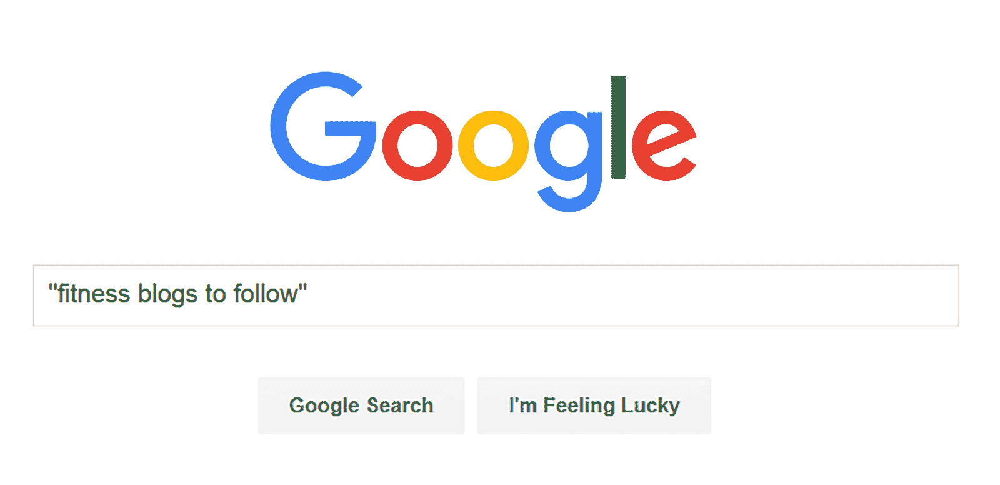</picture>

我在健身领域发现了以下 10 个博客:

<picture><source type="image/webp" srcset="https://api.backlinko.com/app/uploads/2019/01/10-fitness-blogs-to-follow.webp 2500w, https://api.backlinko.com/app/uploads/2019/01/10-fitness-blogs-to-follow-300x223.webp 300w, https://api.backlinko.com/app/uploads/2019/01/10-fitness-blogs-to-follow-1280x952.webp 1280w, https://api.backlinko.com/app/uploads/2019/01/10-fitness-blogs-to-follow-768x571.webp 768w, https://api.backlinko.com/app/uploads/2019/01/10-fitness-blogs-to-follow-1536x1143.webp 1536w, https://api.backlinko.com/app/uploads/2019/01/10-fitness-blogs-to-follow-2048x1524.webp 2048w, https://api.backlinko.com/app/uploads/2019/01/10-fitness-blogs-to-follow-480x357.webp 480w, https://api.backlinko.com/app/uploads/2019/01/10-fitness-blogs-to-follow-640x476.webp 640w, https://api.backlinko.com/app/uploads/2019/01/10-fitness-blogs-to-follow-960x714.webp 960w, https://api.backlinko.com/app/uploads/2019/01/10-fitness-blogs-to-follow-1440x1071.webp 1440w, https://api.backlinko.com/app/uploads/2019/01/10-fitness-blogs-to-follow-1600x1190.webp 1600w, https://api.backlinko.com/app/uploads/2019/01/10-fitness-blogs-to-follow-1920x1428.webp 1920w" sizes="(max-width: 600px) 100vw, 600px"></picture>

这 10 个博客是你下次想推广某个内容或建立长期关系的绝佳去处。

## 16。发布至少 1447 字的内容

不可否认:较长的内容压倒了 300 字的短博文。

事实上，[我们对 1180 万个谷歌搜索结果的研究](https://backlinko.com/search-engine-ranking)发现，第一页谷歌结果的平均字数是 1447 个词。

<picture><source type="image/webp" srcset="https://api.backlinko.com/app/uploads/2020/12/average-content-word-count-of-the-10-results-is-evenly-distributed.webp 2200w, https://api.backlinko.com/app/uploads/2020/12/average-content-word-count-of-the-10-results-is-evenly-distributed-300x213.webp 300w, https://api.backlinko.com/app/uploads/2020/12/average-content-word-count-of-the-10-results-is-evenly-distributed-1280x909.webp 1280w, https://api.backlinko.com/app/uploads/2020/12/average-content-word-count-of-the-10-results-is-evenly-distributed-768x545.webp 768w, https://api.backlinko.com/app/uploads/2020/12/average-content-word-count-of-the-10-results-is-evenly-distributed-1536x1091.webp 1536w, https://api.backlinko.com/app/uploads/2020/12/average-content-word-count-of-the-10-results-is-evenly-distributed-2048x1454.webp 2048w, https://api.backlinko.com/app/uploads/2020/12/average-content-word-count-of-the-10-results-is-evenly-distributed-480x341.webp 480w, https://api.backlinko.com/app/uploads/2020/12/average-content-word-count-of-the-10-results-is-evenly-distributed-640x454.webp 640w, https://api.backlinko.com/app/uploads/2020/12/average-content-word-count-of-the-10-results-is-evenly-distributed-960x682.webp 960w, https://api.backlinko.com/app/uploads/2020/12/average-content-word-count-of-the-10-results-is-evenly-distributed-1440x1022.webp 1440w, https://api.backlinko.com/app/uploads/2020/12/average-content-word-count-of-the-10-results-is-evenly-distributed-1600x1136.webp 1600w, https://api.backlinko.com/app/uploads/2020/12/average-content-word-count-of-the-10-results-is-evenly-distributed-1920x1363.webp 1920w" sizes="(max-width: 700px) 100vw, 700px"></picture>

(长篇内容对移动设备友好吗？根据我们的数据，是的。较长的内容在移动搜索中表现也很好)

长帖为什么管用？首先，长文向谷歌展示了你在为搜索者提供深度信息。

这显然是谷歌希望看到的。

## **17。记住“第一链接优先级规则”**

假设你有两个链接指向你网站上的一个页面…并且这两个链接都在同一个页面上。

谷歌关注哪个锚文本？第一个？第二个？两者都有？

根据第一个链接优先级规则，**只有第一个链接。**

为什么这很重要？

假设您的站点上有一个导航栏，如下所示:

<picture><source type="image/webp" srcset="https://api.backlinko.com/app/uploads/2016/03/example-nav-menu.webp 701w, https://api.backlinko.com/app/uploads/2016/03/example-nav-menu-300x57.webp 300w, https://api.backlinko.com/app/uploads/2016/03/example-nav-menu-480x92.webp 480w, https://api.backlinko.com/app/uploads/2016/03/example-nav-menu-640x122.webp 640w" sizes="(max-width: 350px) 100vw, 350px">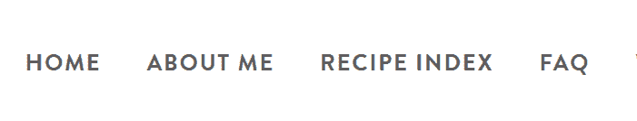</picture>

因为你的导航在页面的顶部，谷歌首先看到那些链接。

**事情变得棘手了:**

假设你在一篇博文中放了一个“食谱索引”页面的链接。

而那个链接有锚文本:“健康食谱”。

<picture><source type="image/webp" srcset="https://api.backlinko.com/app/uploads/2016/03/example-anchor-text1.webp 1087w, https://api.backlinko.com/app/uploads/2016/03/example-anchor-text1-300x87.webp 300w, https://api.backlinko.com/app/uploads/2016/03/example-anchor-text1-768x223.webp 768w, https://api.backlinko.com/app/uploads/2016/03/example-anchor-text1-480x139.webp 480w, https://api.backlinko.com/app/uploads/2016/03/example-anchor-text1-640x185.webp 640w, https://api.backlinko.com/app/uploads/2016/03/example-anchor-text1-960x278.webp 960w" sizes="(max-width: 543px) 100vw, 543px">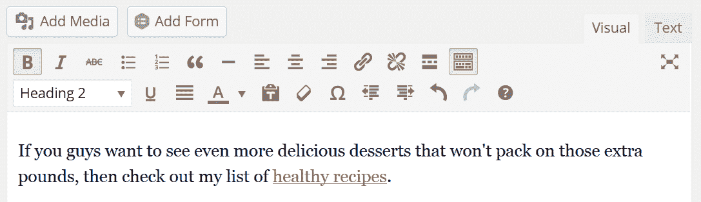</picture>

可惜“健康食谱”锚文本被大 g 忽略了。

谷歌只统计最先看到的锚文本:“菜谱索引”。

<picture><source type="image/webp" srcset="https://api.backlinko.com/app/uploads/2016/03/first_link_v1-01.webp 1949w, https://api.backlinko.com/app/uploads/2016/03/first_link_v1-01-300x211.webp 300w, https://api.backlinko.com/app/uploads/2016/03/first_link_v1-01-1280x901.webp 1280w, https://api.backlinko.com/app/uploads/2016/03/first_link_v1-01-768x541.webp 768w, https://api.backlinko.com/app/uploads/2016/03/first_link_v1-01-1536x1081.webp 1536w, https://api.backlinko.com/app/uploads/2016/03/first_link_v1-01-480x338.webp 480w, https://api.backlinko.com/app/uploads/2016/03/first_link_v1-01-640x451.webp 640w, https://api.backlinko.com/app/uploads/2016/03/first_link_v1-01-960x676.webp 960w, https://api.backlinko.com/app/uploads/2016/03/first_link_v1-01-1440x1014.webp 1440w, https://api.backlinko.com/app/uploads/2016/03/first_link_v1-01-1600x1126.webp 1600w, https://api.backlinko.com/app/uploads/2016/03/first_link_v1-01-1920x1352.webp 1920w" sizes="(max-width: 700px) 100vw, 700px">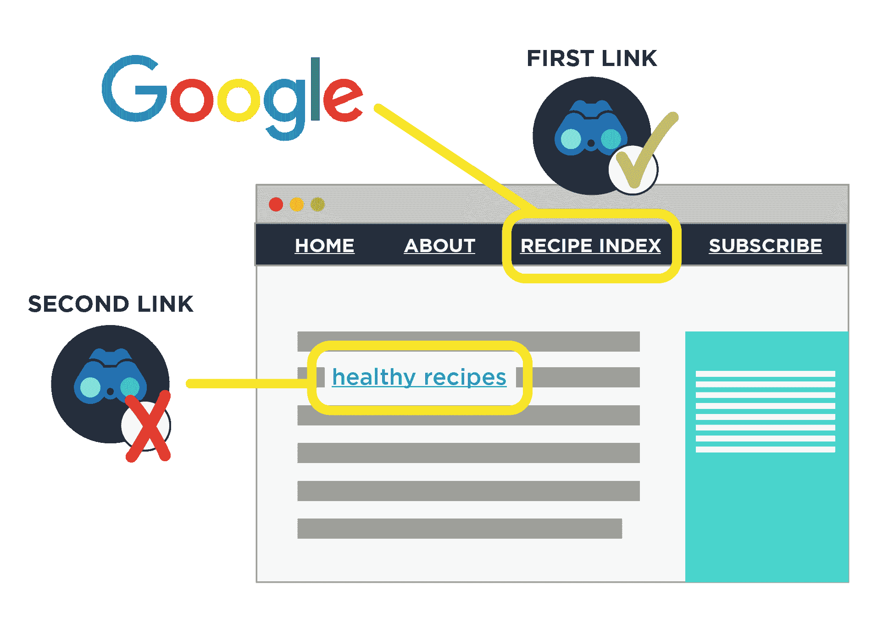</picture>

**底线外卖**:

在你的网站导航中使用关键词丰富的锚。

正如你刚刚了解到的，它们下面的关键词丰富的内部链接不算。

## 18。创建自己的关键词

这是我学到的最好的 SEO 建议之一:

你创造的关键词总是排名第一。

当你创造出真正原创的东西(比如一个品牌、产品或一个循序渐进的系统)时，你是唯一一个为这个术语进行优化的人。

(毕竟是你编的。)

如果你的作品变得受欢迎，你会突然发现自己在一个高容量关键词中排名第一。

让我给你看一个例子:

不久前，我发表了一篇名为[链接建设案例研究:我如何在 14 天内将我的搜索流量增加了 110%](https://backlinko.com/skyscraper-technique)的文章。

<picture><source type="image/webp" srcset="https://api.backlinko.com/app/uploads/2020/12/backlinko-skyscraper-technique-2021.webp 2560w, https://api.backlinko.com/app/uploads/2020/12/backlinko-skyscraper-technique-2021-300x266.webp 300w, https://api.backlinko.com/app/uploads/2020/12/backlinko-skyscraper-technique-2021-1280x1135.webp 1280w, https://api.backlinko.com/app/uploads/2020/12/backlinko-skyscraper-technique-2021-768x681.webp 768w, https://api.backlinko.com/app/uploads/2020/12/backlinko-skyscraper-technique-2021-1536x1361.webp 1536w, https://api.backlinko.com/app/uploads/2020/12/backlinko-skyscraper-technique-2021-2048x1815.webp 2048w, https://api.backlinko.com/app/uploads/2020/12/backlinko-skyscraper-technique-2021-480x425.webp 480w, https://api.backlinko.com/app/uploads/2020/12/backlinko-skyscraper-technique-2021-640x567.webp 640w, https://api.backlinko.com/app/uploads/2020/12/backlinko-skyscraper-technique-2021-960x851.webp 960w, https://api.backlinko.com/app/uploads/2020/12/backlinko-skyscraper-technique-2021-1440x1276.webp 1440w, https://api.backlinko.com/app/uploads/2020/12/backlinko-skyscraper-technique-2021-1600x1418.webp 1600w, https://api.backlinko.com/app/uploads/2020/12/backlinko-skyscraper-technique-2021-1920x1702.webp 1920w" sizes="(max-width: 600px) 100vw, 600px">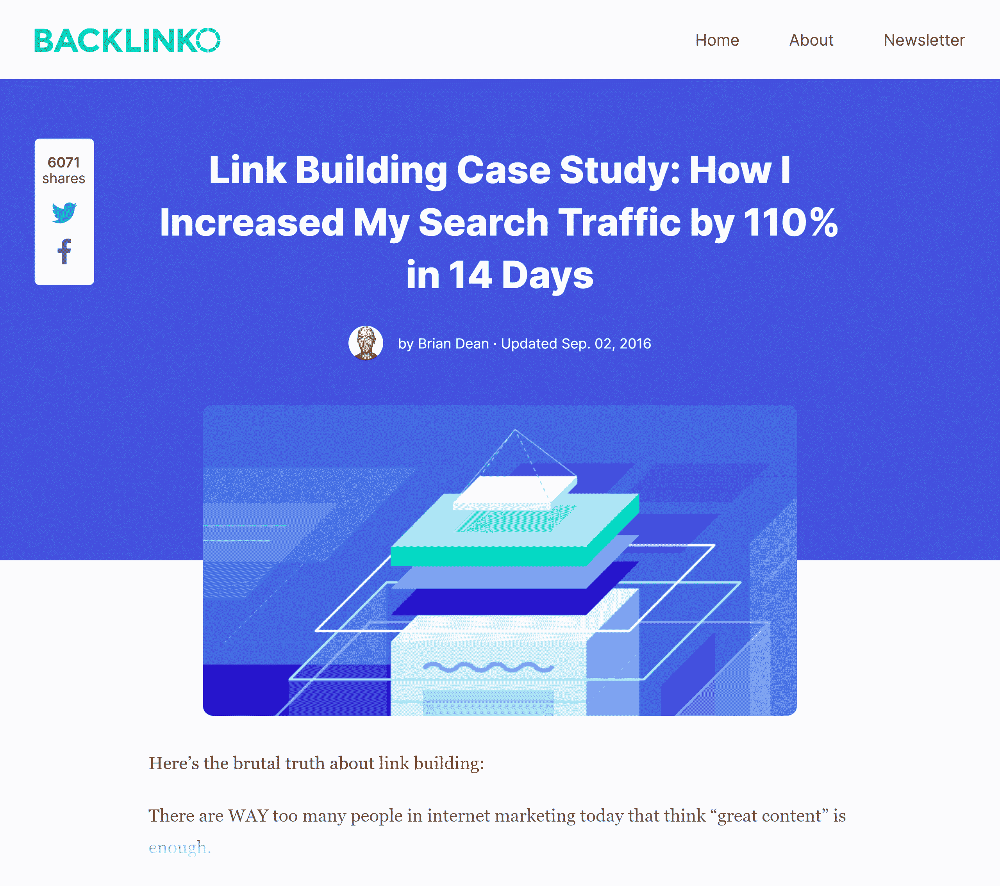</picture>

现在我可以围绕一个关键词优化我的文章，比如:“链接建设策略”。

相反，我决定创造自己的关键词:“**摩天大楼技术**”。

今天，我从搜索我创建的关键词的人那里获得了稳定的有机流量。

<picture><source type="image/webp" srcset="https://api.backlinko.com/app/uploads/2020/12/google-trends-skyscraper-technique.webp 1600w, https://api.backlinko.com/app/uploads/2020/12/google-trends-skyscraper-technique-300x188.webp 300w, https://api.backlinko.com/app/uploads/2020/12/google-trends-skyscraper-technique-1280x804.webp 1280w, https://api.backlinko.com/app/uploads/2020/12/google-trends-skyscraper-technique-768x482.webp 768w, https://api.backlinko.com/app/uploads/2020/12/google-trends-skyscraper-technique-1536x965.webp 1536w, https://api.backlinko.com/app/uploads/2020/12/google-trends-skyscraper-technique-480x302.webp 480w, https://api.backlinko.com/app/uploads/2020/12/google-trends-skyscraper-technique-640x402.webp 640w, https://api.backlinko.com/app/uploads/2020/12/google-trends-skyscraper-technique-960x603.webp 960w, https://api.backlinko.com/app/uploads/2020/12/google-trends-skyscraper-technique-1440x905.webp 1440w" sizes="(max-width: 600px) 100vw, 600px">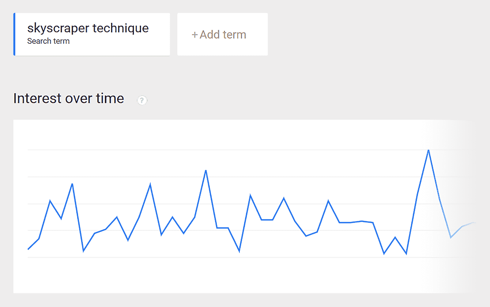</picture>

你怎么能做同样的事情？

下次你写你创造的一项技术(无论是饮食技巧、生产力技巧还是种植西红柿的系统)时，说出它的名字。

## **19。使用创意种子关键词** 

如果你已经在 SEO 领域工作了一段时间，你会知道一个关键词工具**的好坏取决于你放入的种子关键词。**

换句话说:

如果你使用相同的种子关键词作为你的竞争对手，你会看到相同的关键词。

幸运的是，有一个鲜为人知的工具可以帮助你解决这个问题:[SeedKeywords.com](https://www.seedkeywords.com/)。

<picture><source type="image/webp" srcset="https://api.backlinko.com/app/uploads/2018/05/seedkeywords.webp 1300w, https://api.backlinko.com/app/uploads/2018/05/seedkeywords-300x164.webp 300w, https://api.backlinko.com/app/uploads/2018/05/seedkeywords-1280x699.webp 1280w, https://api.backlinko.com/app/uploads/2018/05/seedkeywords-768x419.webp 768w, https://api.backlinko.com/app/uploads/2018/05/seedkeywords-480x262.webp 480w, https://api.backlinko.com/app/uploads/2018/05/seedkeywords-640x350.webp 640w, https://api.backlinko.com/app/uploads/2018/05/seedkeywords-960x524.webp 960w" sizes="(max-width: 600px) 100vw, 600px">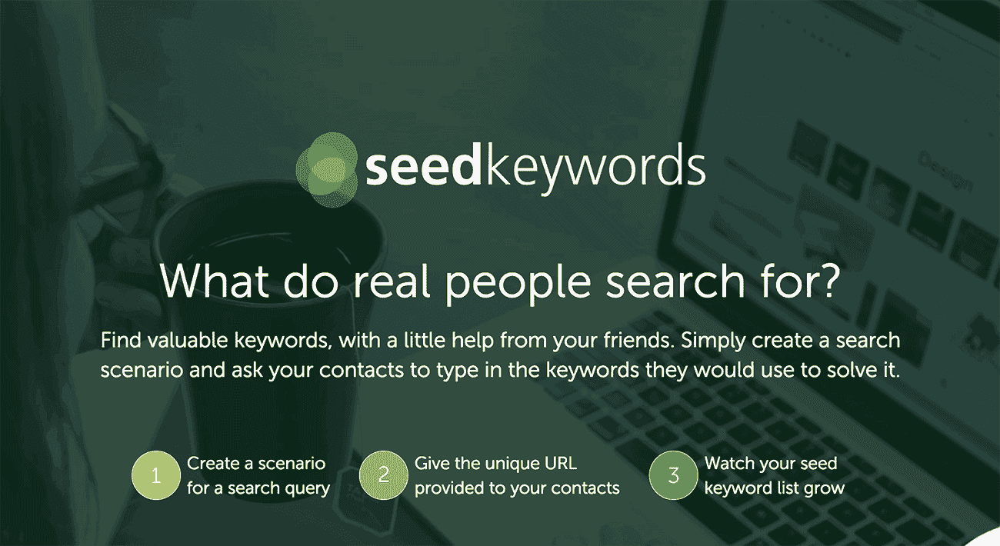</picture>

**下面是使用方法:**

首先，去种子关键词，并创建一个场景。

(场景是某人用来在网上找到你的公司的东西。)

<picture><source type="image/webp" srcset="https://api.backlinko.com/app/uploads/2018/05/seedkeywords-create-scenario.webp 908w, https://api.backlinko.com/app/uploads/2018/05/seedkeywords-create-scenario-300x233.webp 300w, https://api.backlinko.com/app/uploads/2018/05/seedkeywords-create-scenario-768x595.webp 768w, https://api.backlinko.com/app/uploads/2018/05/seedkeywords-create-scenario-480x372.webp 480w, https://api.backlinko.com/app/uploads/2018/05/seedkeywords-create-scenario-640x496.webp 640w" sizes="(max-width: 454px) 100vw, 454px">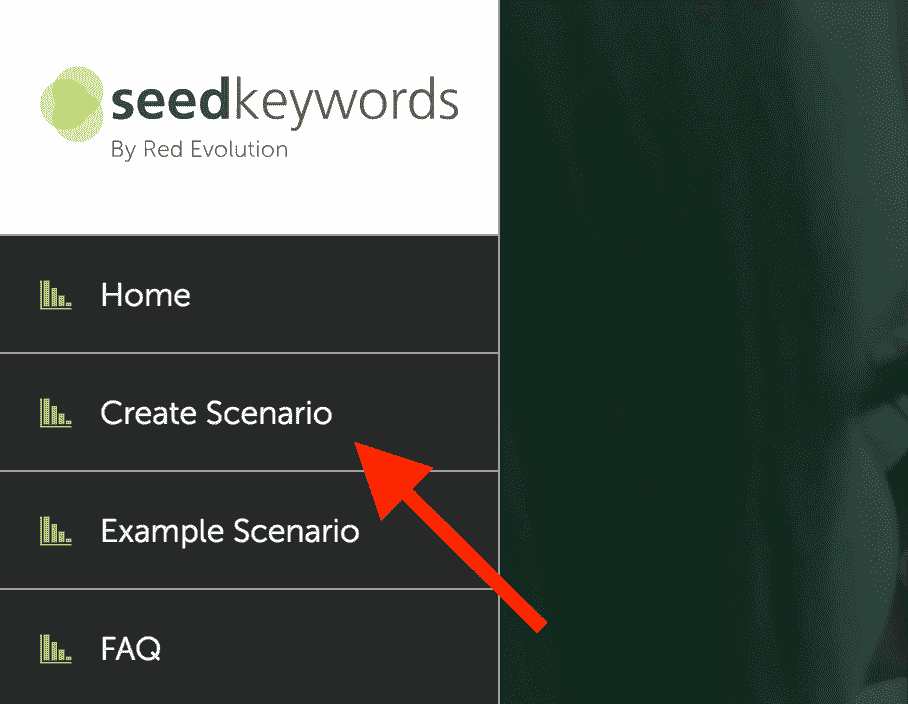</picture>

点击“创建我的场景”，你会得到一个特殊的链接。

<picture><source type="image/webp" srcset="https://api.backlinko.com/app/uploads/2018/05/seedkeywords-link.webp 1798w, https://api.backlinko.com/app/uploads/2018/05/seedkeywords-link-300x158.webp 300w, https://api.backlinko.com/app/uploads/2018/05/seedkeywords-link-1280x675.webp 1280w, https://api.backlinko.com/app/uploads/2018/05/seedkeywords-link-768x405.webp 768w, https://api.backlinko.com/app/uploads/2018/05/seedkeywords-link-1536x810.webp 1536w, https://api.backlinko.com/app/uploads/2018/05/seedkeywords-link-480x253.webp 480w, https://api.backlinko.com/app/uploads/2018/05/seedkeywords-link-640x337.webp 640w, https://api.backlinko.com/app/uploads/2018/05/seedkeywords-link-960x506.webp 960w, https://api.backlinko.com/app/uploads/2018/05/seedkeywords-link-1440x759.webp 1440w, https://api.backlinko.com/app/uploads/2018/05/seedkeywords-link-1600x844.webp 1600w" sizes="(max-width: 600px) 100vw, 600px">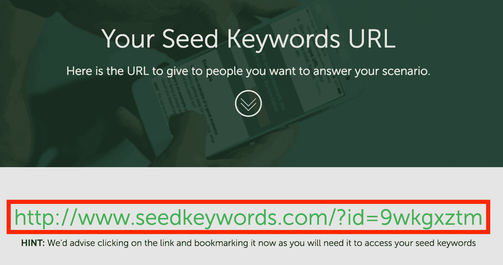</picture>

将此链接发送给朋友、家人和目标客户，看看他们会使用哪些关键词:

<picture><source type="image/webp" srcset="https://api.backlinko.com/app/uploads/2018/05/seedkeywords-link-clicked.webp 1460w, https://api.backlinko.com/app/uploads/2018/05/seedkeywords-link-clicked-300x230.webp 300w, https://api.backlinko.com/app/uploads/2018/05/seedkeywords-link-clicked-1280x982.webp 1280w, https://api.backlinko.com/app/uploads/2018/05/seedkeywords-link-clicked-768x589.webp 768w, https://api.backlinko.com/app/uploads/2018/05/seedkeywords-link-clicked-480x368.webp 480w, https://api.backlinko.com/app/uploads/2018/05/seedkeywords-link-clicked-640x491.webp 640w, https://api.backlinko.com/app/uploads/2018/05/seedkeywords-link-clicked-960x736.webp 960w, https://api.backlinko.com/app/uploads/2018/05/seedkeywords-link-clicked-1440x1105.webp 1440w" sizes="(max-width: 600px) 100vw, 600px">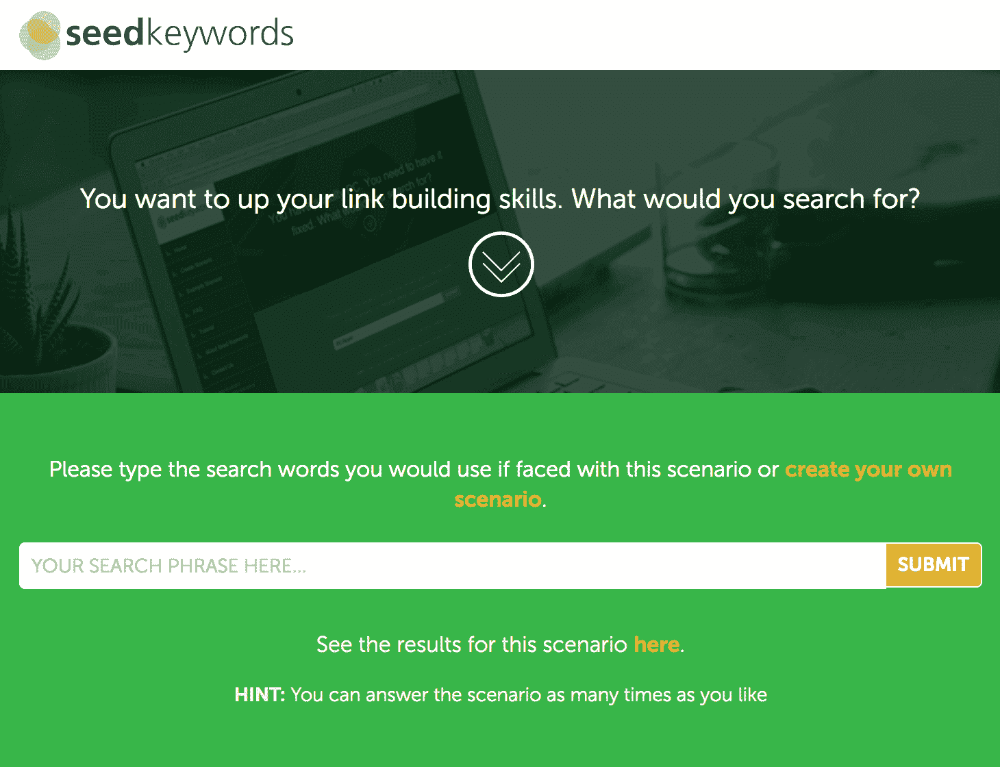</picture>

你会得到一个现成的种子关键词列表，你可以把它放入谷歌关键词规划器。

<picture><source type="image/webp" srcset="https://api.backlinko.com/app/uploads/2018/05/seedkeywords-results.webp 1624w, https://api.backlinko.com/app/uploads/2018/05/seedkeywords-results-300x85.webp 300w, https://api.backlinko.com/app/uploads/2018/05/seedkeywords-results-1280x361.webp 1280w, https://api.backlinko.com/app/uploads/2018/05/seedkeywords-results-768x217.webp 768w, https://api.backlinko.com/app/uploads/2018/05/seedkeywords-results-1536x433.webp 1536w, https://api.backlinko.com/app/uploads/2018/05/seedkeywords-results-480x135.webp 480w, https://api.backlinko.com/app/uploads/2018/05/seedkeywords-results-640x180.webp 640w, https://api.backlinko.com/app/uploads/2018/05/seedkeywords-results-960x271.webp 960w, https://api.backlinko.com/app/uploads/2018/05/seedkeywords-results-1440x406.webp 1440w, https://api.backlinko.com/app/uploads/2018/05/seedkeywords-results-1600x451.webp 1600w" sizes="(max-width: 600px) 100vw, 600px">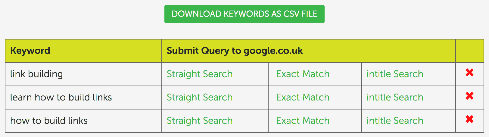</picture>

## **收拾东西** 

现在我想把它交给你:

今天帖子中的 19 种 SEO 技巧中，你打算先尝试哪一种？

你会开始发布更长的内容吗？

或者你想为谷歌 RankBrain 优化你的网站。

不管怎样，请马上在下面留言告诉我。