# JavaScript & SEO 适得其反——Hulu.com 案例研究

> 原文：<https://www.elephate.com/blog/javascript-seo-backfire-hulu-com-case-study/?utm_source=wanqu.co&utm_campaign=Wanqu+Daily&utm_medium=website>

自从我查看 Hulu.com 当前的 JavaScript SEO 状态已经有一段时间了。现在，当我在几个 JS 丰富的网站工作时，我决定再次调查 Hulu 的情况。

<noscript></noscript>

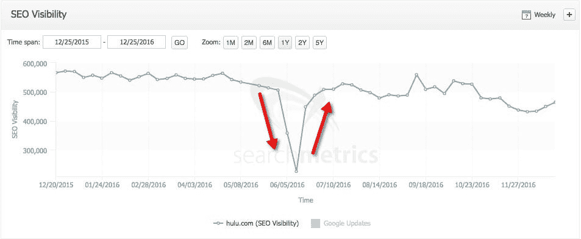

为什么是 Hulu.com？他们的网站是独一无二的，从搜索引擎优化的角度来看特别有趣，因为它通常是唯一一个可以终止 Hulu 相关的谷歌查询的网站。对 Hulu.com 进行排名和展示符合谷歌的利益。让我给你看一个例子。

Hulu.com 是唯一一个你可以看很多受欢迎的美国电视节目的地方，比如《休闲》、《了不起的人》等等。你可以在这里找到 Hulu.com 独家演出的完整列表。这让 Hulu 在 SEO 上占了上风，但不幸的是，这种巨大的 SEO 潜力并没有实现。

### Hulu SEO 问题

搜索查询:

“牛人”——这是 Hulu 的原创系列。

<noscript></noscript>

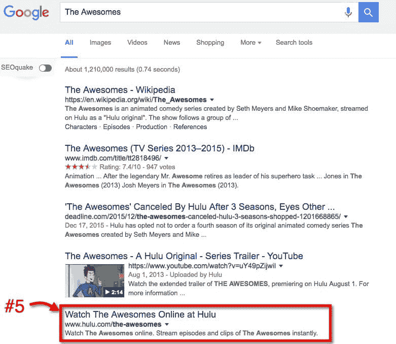

让我们搜索一下上面看到的 Hulu 登陆页面的标题——“在 Hulu 在线观看牛人”。

<noscript></noscript>

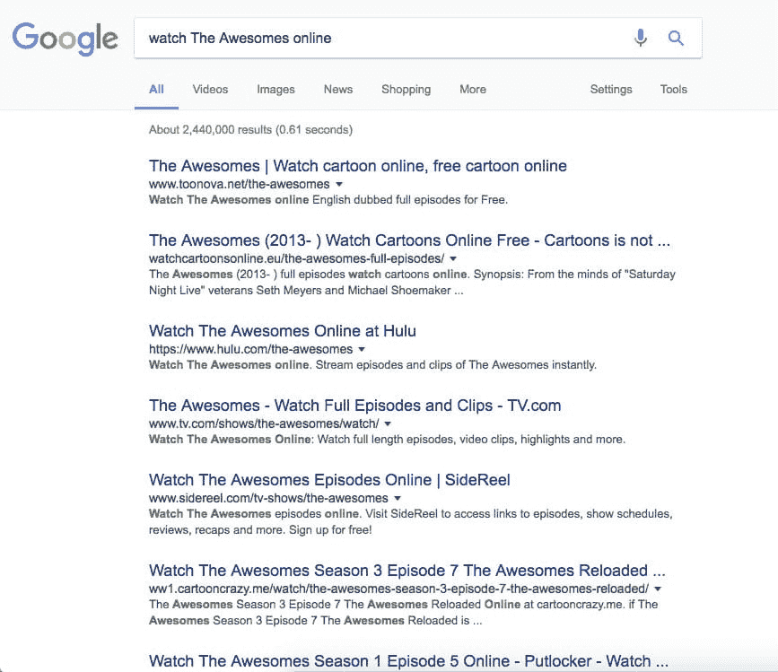

Hulu.com 正在失去成千上万的谷歌有机访问，这实际上有助于像上面这样的网站获得更多的流量。为什么 Hulu.com 不为自己的内容排名？通过查看上面的数据，我们可以有把握地假设 Hulu 有一个重大的 SEO 问题，并且在 Google 中排名偏低。这就是 JavaScript SEO 可以帮助更好地理解它的地方。

Hulu.com 是一个基于 JavaScript 的网站，这意味着如果你进入 Hulu.com，你会看到由你的浏览器渲染/处理的 JavaScript 代码。

下面是[https://www . Hulu . com/series/the-awe somes-C4 d 582d 2-01ce-4639-a411-b0c 903 b 88 dcb](https://www.hulu.com/series/the-awesomes-c4d582d2-01ce-4639-a411-b0c903b88dcb)登陆页面的样子:

<noscript></noscript>

但是当你查看这个页面时，你不会看到你所期望的普通 HTML 代码。

这是你点击“查看源代码”(Chrome)时看到的。

<noscript></noscript>

要查看经过处理的 DOM 和呈现的 JavaScript 的代码，需要使用 Chrome 中的“inspect element”选项。

<noscript>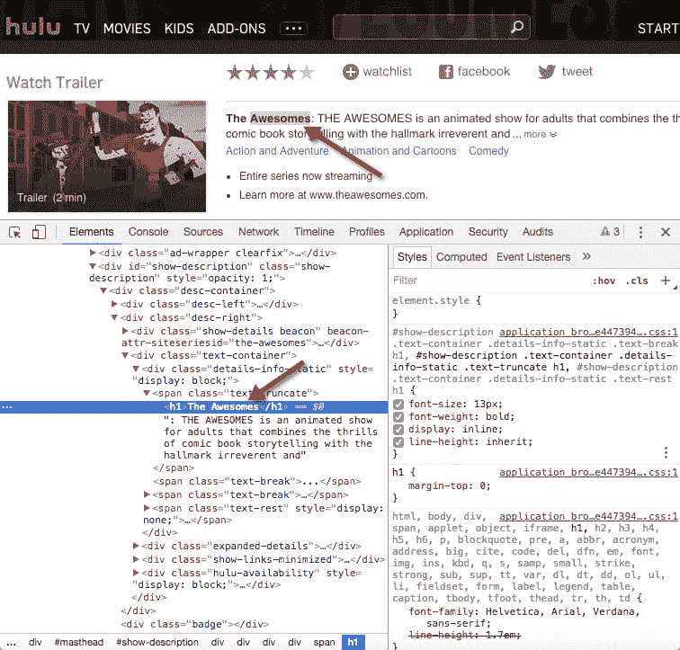</noscript>

在查看原始 JavaScript 代码时，H1 和描述是不可见的。它们只有在处理 DOM 并完全渲染 JavaScript 后才能看到。

我几乎听到你们中的一些人说:“Bartosz，但是 Google 现在正在抓取和索引 JavaScript”。看来的确是这样，谷歌自己也曾经承认过[这里的](https://webmasters.googleblog.com/2015/10/deprecating-our-ajax-crawling-scheme.html)。

> 时代变了。今天，只要你不阻止 Googlebot 抓取你的 JavaScript 或 CSS 文件，我们通常能够像现代浏览器一样呈现和理解你的网页。为了反映这一改进，我们最近更新了技术网站管理员指南，建议不要禁止 Googlebot 抓取您网站的 CSS 或 JS 文件。

如何检查谷歌是否对你的网站进行了正确的抓取和索引？这就是事情变得复杂的地方。大多数人会推荐使用[谷歌搜索控制台](https://www.google.com/webmasters/tools/home?hl=en)获取并呈现你的网站。但是，要遵循此建议，需要解决两个问题:

1.  我显然无法访问 Hulu 的谷歌搜索控制台。
2.  获取和渲染是一个很棒的工具，但是用谷歌缓存和谷歌索引仔细检查获取结果是很好的。怎么做呢？

这里有一个最简单和最明显的解决方案来检查谷歌是否能正确抓取和索引 Hulu.com。最棒的是，你现在可以在几秒钟内做到这一点，并亲眼目睹。

### 如何检查 JavaScript 索引化？

1.去 JavaScript 丰富的网站例如[https://www . Hulu . com/series/casual-22d 27085-0f5e-42aa-949 f-1b 81 ba 5726d 8](https://www.hulu.com/series/casual-22d27085-0f5e-42aa-949f-1b81ba5726d8)

2.找到页面中任何独特的内容并复制它

<noscript></noscript>

3.搜索内容并查看步骤 1 中的 URL 是否排名(唯一内容应该排名第一)

<noscript></noscript>

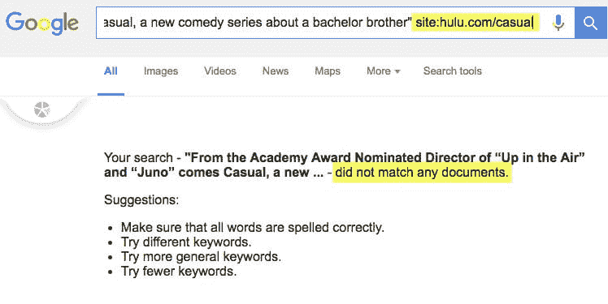

Hulu.com 通过测试了吗？

不幸的是，谷歌从未将 Hulu 的内容编入索引:

<noscript>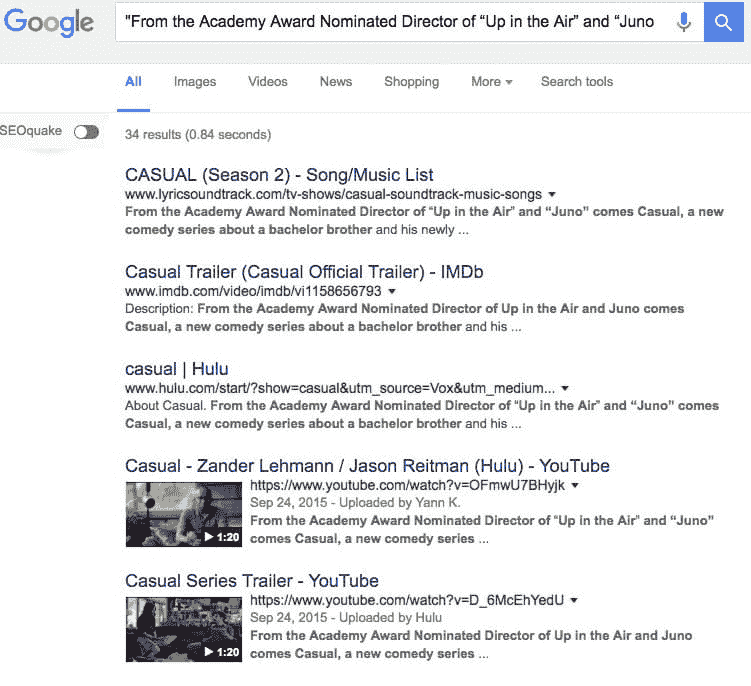</noscript>

现在，如果你想超级确定，你可以更进一步，只在特定的页面中搜索页面的内容。

如何做到这一点？去谷歌搜索“网站内容”网址:hulu.com/casual

<noscript></noscript>

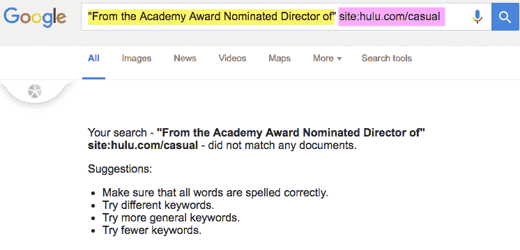

遗憾的是，谷歌从未见过这些内容。

我们可以缩短查询，看看谷歌是否至少索引了来自 Hulu.com 的短内容。

再次，没有运气。我们现在 100%确定谷歌从未索引过 Hulu 的内容。

你可能认为 hulu.com/casual 的网址在谷歌中没有被索引。我们来看看这个。

<noscript></noscript>

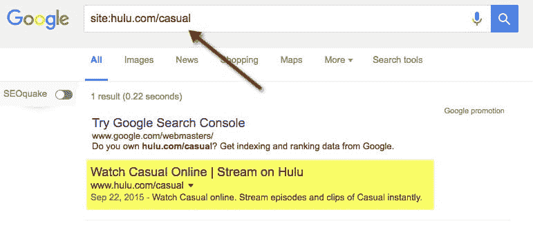

如你所见，网址在谷歌索引中。这也意味着谷歌必须在那里找到一些内容来索引它。

这就引出了另一个问题。Google 抓取并索引了什么？

幸运的是，我们可以在 Google Cache 中分析这些有价值的数据。

<noscript>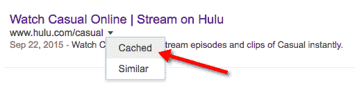</noscript>

不幸的是，正如你在下面看到的，Hulu 的代码中有一个 bug，它阻止了 Google Cache 的正确呈现。

<noscript></noscript>

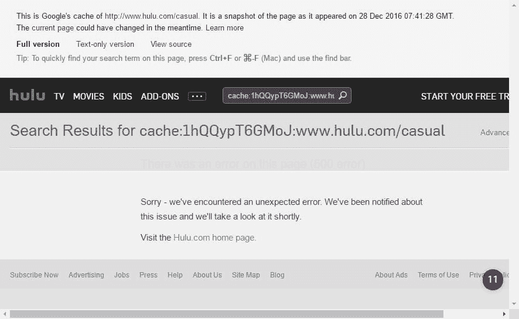

是的，你没有错。你在上面看到的是一个…代码 500 错误页面。

<noscript></noscript>

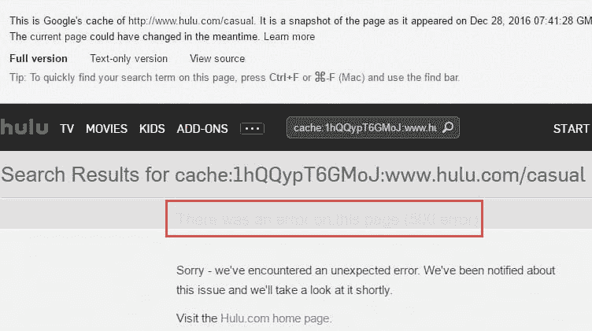

我们在上面看到的来自于 Hulu 代码中的一个错误，这个错误导致 Hulu.com 从谷歌的缓存 URL 中搜索 slug。

让我解释一下。这是 Google 的缓存 URL:

http://webcache.googleusercontent.com/search?q=cache:1hQQypT6GMoJ:www.hulu.com/casual+&cd=1&hl=en&ct=clnk&gl=en

由于代码中的错误，Hulu.com 用了一段代码“搜索？q = cache:1 hqqypt 6 gmoj:www . Hulu . com/casual "并执行搜索。

<noscript></noscript>

它应该是这样的:
[http://www.hulu.com/search?q = cache:1 hqqypt 6 gmoj:www . Hulu . com/casual](http://www.hulu.com/search?q=cache:1hQQypT6GMoJ:www.hulu.com/casual)

<noscript></noscript>

Hulu 正在保护它的内容不被显示在不同的域名上；我们在上面看到的这些内容不会显示在谷歌的缓存中。这里有一个例子，如果我试图从我自己的域加载 hulu.com，内容不显示，并返回代码 500。

<noscript></noscript>

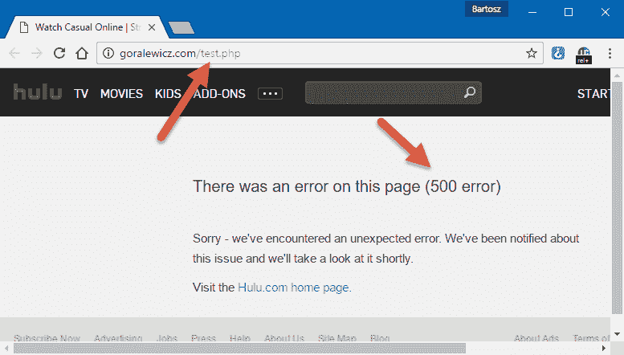

这个解决方案保护 Hulu 不被抓取，也不从其他网站(电影、节目等)发布内容。)这绝对是一个很好的举措，但是应该对 Google Cache 禁用。

然而，有趣的是，当查看缓存时，来自 hulu.com 的一些页面返回 404 错误代码。

<noscript>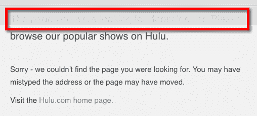</noscript>

关于缓存已经说得够多了，让我们继续。

### Hulu.com 的风险

#### **1。缺乏指数化和失去内容著作权的风险**

Hulu.com 没有得到它可以轻易得到的有机交通，这是主要的，但不是唯一的问题。拥有大量既没有被抓取也没有被索引的独特内容会导致更多潜在的问题。Hulu.com 有很多独特的内容没有被谷歌索引。唯一阻止抓取者窃取这些内容的是… JavaScript。如果 Hulu 的内容将被抓取并发布在任何其他网站上，谷歌将把这个抓取网站视为内容的原始来源。我们以前已经看到过这样的问题，这就是为什么我们知道，事实上，大规模地扭转它们几乎是不可能的(在法律和技术方面)。

#### **2。谷歌更新**T3】

Hulu 拥有数千个索引的瘦内容页面(在爬虫的眼中)，是 Google Panda、Phantom 和其他针对瘦/差内容的算法的完美目标。这很可能是 Hulu.com 排名如此糟糕的原因，能见度持续下降。

### 如何用 JavaScript 索引解决 Hulu 的问题？

#### **问题:**

就搜索引擎抓取而言，Hulu 有两个问题。

1.Hulu 的内部搜索算法会干扰谷歌爬虫，使谷歌无法看到访问者看到的相同内容。

2.显示实际内容(显示标题、描述等。)需要启用 JavaScript，

这可能会阻止爬虫查看该内容。

#### **潜在方案:**

当谈到解决这些问题时，这里有两个旨在提高 hulu.com 爬行效率的解决方案:

1.应该修改搜索算法，以便从搜索条件字符串(如果存在的话)中删除“cache:www.hulu.com/”,从而可以正确理解 Google crawlers 执行的请求，并返回相关内容。

首先，我们需要确保正确理解 Google 爬虫执行的实际请求，并返回预期的数据(我所说的实际请求是指实际爬虫执行的请求，而不仅仅是那些在浏览器中通过在地址前添加“cache:”来模拟的请求)。

2.一旦解决了第一个问题，Google 可能就能绕过第二个问题(依赖 JavaScript 来呈现页面),爬行效率将会提高。这很好，因为与下面描述的变化相反，修改搜索算法应该是一个相当简单的变化。

如果结果证明解决方案#1 没有完全解决问题，并且 Google 不能很好地运行 Hulu JavaScript 来实际查看内容(无论是在搜索结果页面还是在其他页面)，那么就必须做出改变，以便在服务器上实际呈现更多数据。

结果，内容(电视节目的标题、描述等。)将在初始 HTML 文件中发送，并且将立即对搜索引擎爬虫可见(不需要使用 JavaScript)。只有这样，JavaScript 才能用来丰富用户界面，从而改善用户体验。不幸的是，这比第一步要复杂得多。

当然，每个案例都是不同的，很大程度上取决于网站的代码架构。我不会一一列举，因为这是另一篇文章的主题。我猜 Hulu.com 使用 jQuery，不能简单地使用 prerender.io 这样的服务。尽管如此，对于 JavaScript 丰富的网站，最简单的解决方案之一是使用 prerender 服务，但当内容动态加载时(例如，有很多广告列表的网站)，这就变得很棘手了。如果每次请求页面时都生成内容，prerender 会降低速度。Prerender 服务最适合内容相当静态的网站(例如 Hulu.com)。

### 什么是 prerender？

你可以在网上找到很多关于 prerender 的信息，但我会给你一个简化的版本，我认为这足以理解这个过程。Prerender 服务采用 JavaScript 代码，如下所示:

<noscript></noscript>

他们把它变成了好看的 HTML，正如下面的截图所示:

<noscript></noscript>

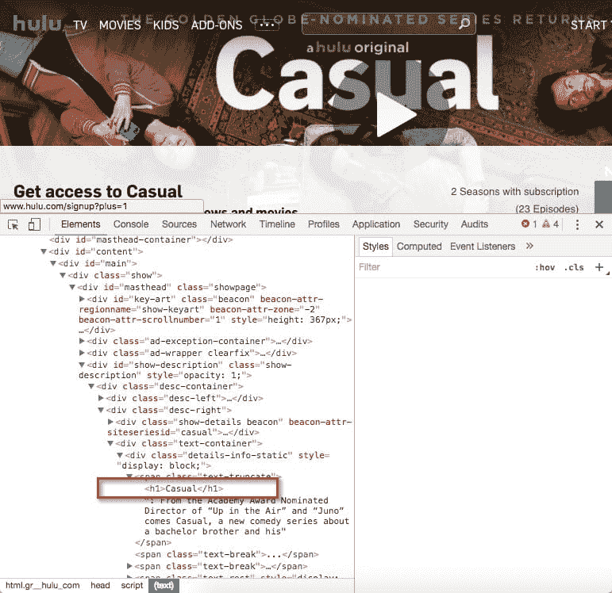

基本上，我们做每个浏览器在服务器端做的事情。由于这一点，我们没有把渲染工作留给谷歌。我们的网站得到适当的抓取和索引，排名更好，每个人都很高兴。

### 希望

有这么多问题和这么多谷歌从未见过的内容，Hulu.com 是一个壮观的搜索引擎优化复苏的完美案例。我想知道为什么 Hulu 的团队还没有挖掘这种潜力。最有可能的是，我们无法从外部看到他们的所有问题，而且，正如经常发生的那样，修复他们的 JavaScript 索引问题需要大量的开发工作。

我希望在读完这篇文章后，你可以看到 JavaScript SEO 并不那么难理解，只需要一点额外的努力就可以做得很好。