# 我们如何撰写和发送“有史以来最好的冷邮件”| Ramp 博客

> 原文：<https://ramptshirts.com/blog/2018/01/12/wrote-sent-best-cold-email-ever/?utm_source=wanqu.co&utm_campaign=Wanqu+Daily&utm_medium=website>

*这是我们如何向 50，000 家公司发送电子邮件的故事，这是“有史以来最好的冷邮件”，提供 Ramp 的服务，Ramp 是世界上最聪明、最简单的[定制 t 恤订购网站](http://www.ramp.fm/order)。E* *ach 销售邮件中有一张我的照片，我是 Ramp 的首席执行官，穿着他们公司的 t 恤，这样他们就可以看到他们将要购买的东西。无论他们买的是定制 t 恤，还是定制印花帽衫，都为我们带来了惊人的流量和顾客。T13】*

只需点击页面顶部的蓝色按钮，即可查看我们的价格。【T2

 *(更新——我们目前正在筹集投资。如果你是一名专业投资者，并有兴趣帮助一家聪明、创新、数据驱动的公司实现其潜力，请给我们写信。我的电子邮件地址出现在大多数的截图中。)

(更新 2——这篇博文被广泛分享，现在已经被复制/改写成法语[和德语](https://www.lafabriquedunet.fr/email-marketing/articles/meilleur-email-prospection/)和[的版本](https://omr.com/de/neil-cocker-email-marketing/)。

更新 3——Neil 被邀请在各种活动和会议上就此次活动发表演讲。到目前为止，它真的很受欢迎，四个不同国家的观众形容它很有见地，真正有用(真的！).如果你有兴趣，给我们写信。

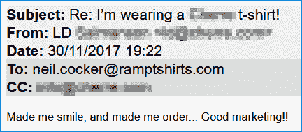

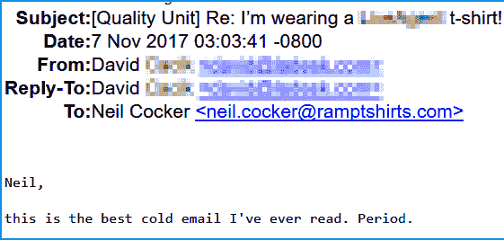

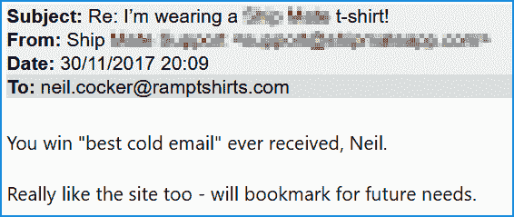

#### 电子邮件

这是 TL。DR 版本。

5 万人的收件箱里收到了一封电子邮件，主题是:“我穿着一件(贵公司的)t 恤！”。

他们怎么能不打开那个……？

当他们打开它的时候，这就是他们所看到的。

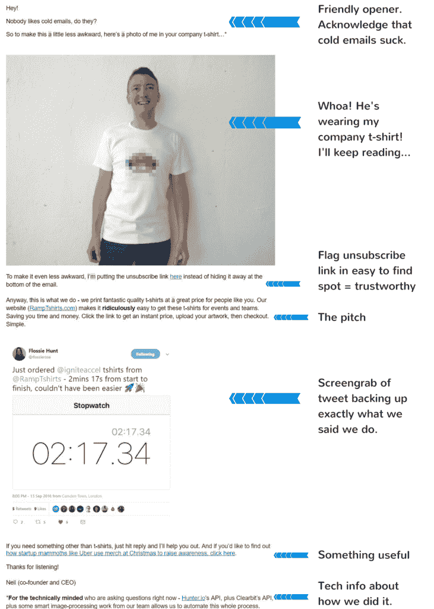

我们建立了一个系统，将这封吸引人的销售电子邮件发送给成千上万的人，每个人都有一个个性化的图像，让他们知道我们让他们很容易为他们的团队或活动购买优质商品。请继续阅读，了解我们是如何做到的…

[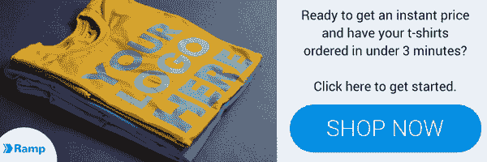T2】](https://ramp.fm/order/?ref=cold-mail-blog-post-CTA)

#### 我们如何创造“有史以来最好的冷邮件”

几个月前，我们在阅读 [ReallyGoodEmails](http://www.reallygoodemails.com/?ref=ramptshirts) 网站，想知道如何在销售邮件中个性化*图片*，而不仅仅是文本。像所有好主意一样，我们几个人聊天从中获得灵感，想出了为 [Ramp](http://www.ramp.fm) 发送外联电子邮件的主意，但其中包括一张某人穿着印有收件人公司标志的 t 恤*的照片。*

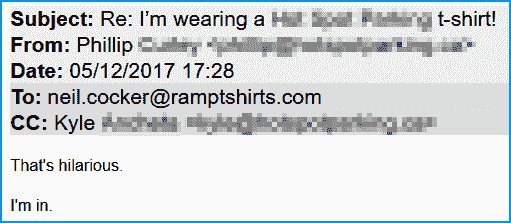

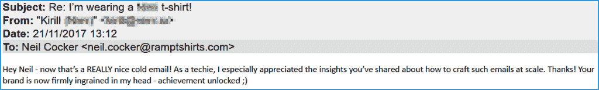

像所有优秀的创业公司一样，我们决定用最快、最便宜的方式来测试这个理论。我们找到了一些模特穿白色 t 恤的照片，手工 PS 了 50 家不同公司的标志，并给他们每人发了一封销售邮件。创建所有的预览、获取所有的电子邮件，然后进行邮件合并，大约花了 4 个小时。在这一点上，我们没有过多考虑副本。我们只是想测试人们对图片的反应。

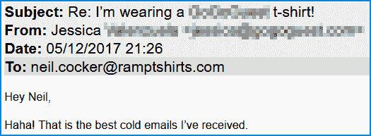

它一炮而红。我们得到了一些回复，并且有 50%的打开率。好吧，我们有些东西。但是这是劳动密集型的，并且不具有很大的可扩展性。这个阶段的回复率与我们需要花费的时间不相称。我们需要挖掘自动化解决方案。T 技术上有些棘手，但绝非不可能。

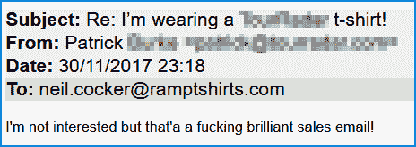

我们开始拼凑各种网络服务——我们找到了 PlaceIt.net，它允许我们上传标识，并自动创建穿着 t 恤的随机模特的预览。照片质量很好，图像看起来也很专业。我们甚至发现他们允许我们创建视频预览。所以我们制作了一些视频，把它们转换成动画 gif，并嵌入到电子邮件中。

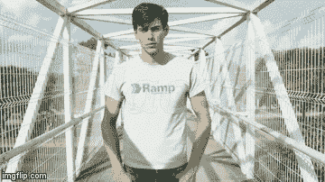

然而，在分割测试中，动画图像的表现甚至更差，这让我们感到惊讶。我们恢复了静态图像。正是在这一点上，我们认为最终的预览将是我，公司的首席执行官，穿着他们的 t 恤预览。

但是使用其他人的服务仍然需要时间和金钱。

#### 接下来是科学部分

下一步是建立一些东西来大规模地做这件事，所以我们和我们的 CTO Milen 坐下来，想出了一个系统，它可以:

1.  获取公司的电子邮件。
2.  获得公司标志。
3.  为每家公司创建独特的预览。

经过一些研究后，我们发现了一些像 Clearbit、Hunter 和 Zapier 这样的微服务来实现前两个目标。第三个采用了技术团队的一些图像处理技巧，但它是可行的。现在的主要问题是把这一切联系起来。

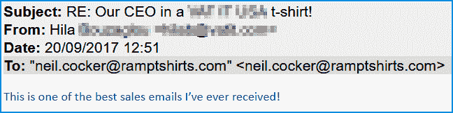

我们正在写一份完整的技术纲要，说明我们是如何做到这一点的，但简而言之，我们现在所做的就是向系统提供一份域名列表。它会找到所有的电子邮件(它会剔除像[【电子邮件保护】](/cdn-cgi/l/email-protection)和[【电子邮件保护】](/cdn-cgi/l/email-protection)这样的邮件)和公司标志。由此产生的预览图像通过一个唯一的图像 URL 上传到我们的服务器，该 URL 可以嵌入到相关的电子邮件中，这样 X 公司的人就可以收到我穿着 X 公司徽标的照片。！)

既然我们已经构建了自己的定制系统，我们需要一张自己的照片，照片上的人穿着一件空白 t 恤。这是一张我，公司首席执行官的照片。像许多人一样，我并不热衷于拍照，但这是信任和可靠的终极标志，对吗？！

于是，我站在白墙边，罗米娜给我拍了 50 张照片。我们选择了最不糟糕的一个，并一直使用至今。

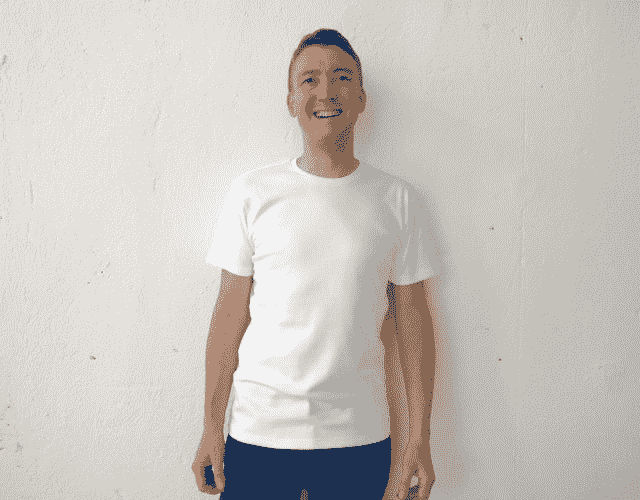

从构思、测试到推出全自动系统，整个过程耗时约六周。

#### 回应

我们收到了三种主要的回复:

1.  太神奇了！90%的受访者对我们的营销有正面评价，或者直接购买。
2.  搞笑！其余的大部分都很有趣。
3.  愤怒！极少数人不高兴，就是不明白。我们受到法律威胁，对我的外表的侮辱，以及其他一些令人不快的评论。

#### 正面回应

我有一个文件夹，里面有上百封这样的邮件。这里有一小把。

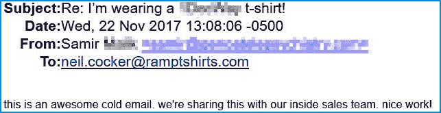

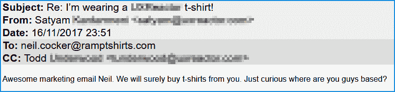

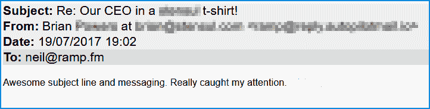

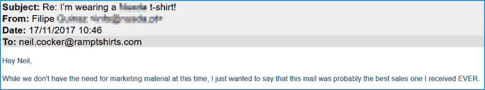

#### 有趣的回答

一些收件人受到启发，启动 Photoshop 或 MS Paint，并向我们发送他们自己的版本！

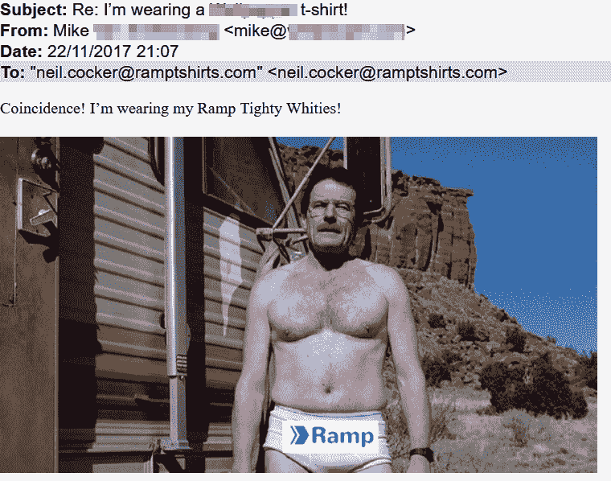

下面的 [Reach Robotics](http://reachrobotics.com/?ref=ramptshirts) 做得很好，他们似乎在收到我们的电子邮件后几秒钟就把这个漂亮的 Photoshop 用电子邮件回复给了我！

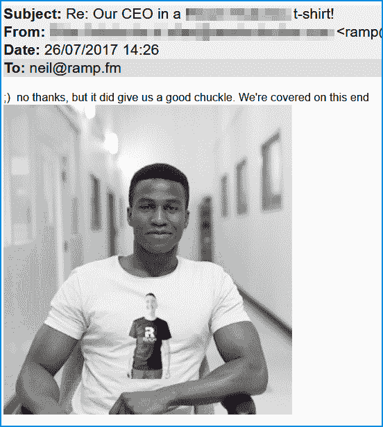

Oliver Harvey 的 Daniel 的回复让我们忍俊不禁(但也强调了大规模的营销自动化意味着你并不总能找到正确的目标！

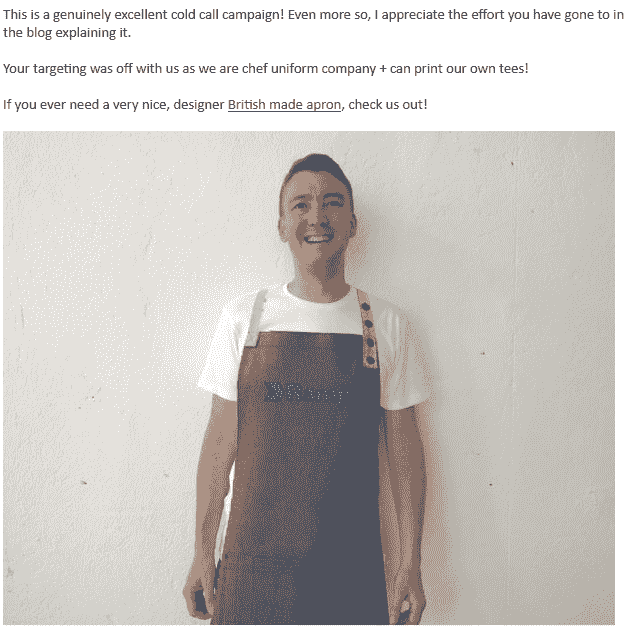

但是我们最喜欢的回复来自于在 [Impact Canopies](http://impactcanopy.com/?ref=ramptshirts) 的 Rusty，他非常喜欢我们的电子邮件，以至于他决定要一件印有我的 t 恤，上面印有他的公司标志。我们不能让他失望，所以我们印了一份送去。

他来了！

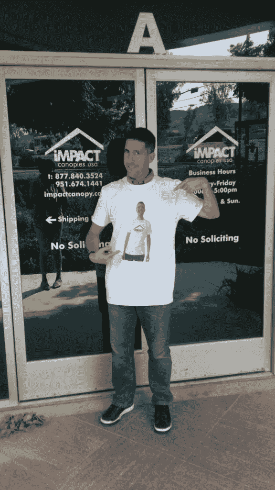

是的，那是我穿他公司 t 恤的真实 t 恤，是他穿的！他告诉我们，它自豪地挂在他的摊位上，让他的同事们很开心。

#### 愤怒的回应

有些人就是不明白。或者他们那天心情不好。不管是什么原因造成的，如果你收到一封以“看我的朋友”开头的邮件，你就知道情况不妙。

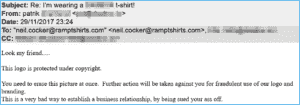

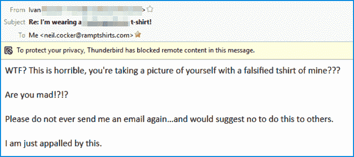

但谢天谢地，很少有人生气。一些人非常喜欢它，他们决定在推特上发布。

那么，我们现在在哪里？

在经历了该活动的几个版本后，我们将该活动缩减为一封电子邮件，而以前是三封。我们觉得第一封邮件的影响已经足够了。此外，我们并不热衷于“强行推销”的方法。

#### 一些统计数据

*   **——持续高于 50%**
***   **点击率**–一些活动/部门获得了高达 25%的点击率*   **总收入——我们可能会在晚些时候公布全部细节。但是现在，我们只能说——几万英镑、美元和欧元！😉****

 ****#### 我们学到了什么

1.  除了避免垃圾邮件过滤器，把销售邮件当作销售渠道也是值得考虑的。要让他们进入下一阶段，你需要做些什么？第一阶段只是首先打开电子邮件。第二阶段是吸引他们的注意力。第三阶段是让他们阅读你的推销等等等等。
2.  在这一点上，在每一个阶段都要思考“什么会让我打开一封电子邮件？什么会吸引我的注意力？什么会让我读下一句？”。有一位著名的科技记者说，他每天会收到 1000 多封电子邮件，让他打开你的电子邮件的最好方法就是在主题行放一个巨大的、全大写的、污秽的脏话！😉
3.  有大量的微服务可以让你用自己的方式证明你的想法是可行的。Zapier，Hunter，Gmail 插件，DuxSoup 等。我们花了不到 50 英镑购买订阅和许可证，证明这种方法是可行的。从那里，我们知道投入技术资源是值得的。如果你想了解更多关于我们在最后阶段投入的技术资源，那么你可以在这里阅读更多我们为 ReallyGoodEmails.com 的朋友们写的文章。
4.  你不需要成为技术天才。在我们把这个概念转移到米伦和技术团队的“食物链”之前，我们几乎在我们几个营销人员之间验证了这个概念。
5.  冰冷的销售邮件不仅仅是科技公司的事情。我的意思是，我们是一家科技公司，但我们卖的是相当“传统”的东西。你可以用这封电子邮件来推销你的咨询服务——“看看我是如何让你打开并阅读这封电子邮件的？我也可以为你所有的潜在客户这样做！

#### 最后

我们在[推特](https://twitter.com/ramptshirts)(如果你想像其他人一样发关于这篇文章的推特，那么复制我们到——[、](https://twitter.com/ramptshirts)[、](https://www.facebook.com/ramptshirts/)和 [Instagram](https://www.instagram.com/ramptshirts/) 。别忘了，如果你的团队或活动需要高质量的商品或礼品，请访问我们的主页并上传你的公司标志，看看我们是如何[简单、智能地获得高质量的丝网印刷定制 t 恤](http://www.ramp.fm)。

这是我们的报价申请表，如果你需要 t 恤以外的东西，比如帽衫、包包等..

如果你仍然不相信我们的销售邮件，这里是我们从收到的数百份回复中随机选择的…*****