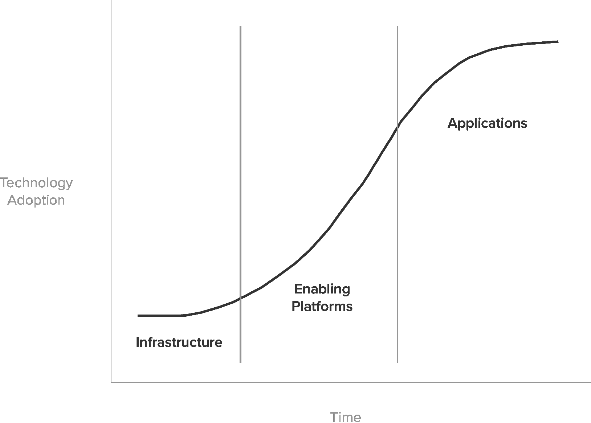
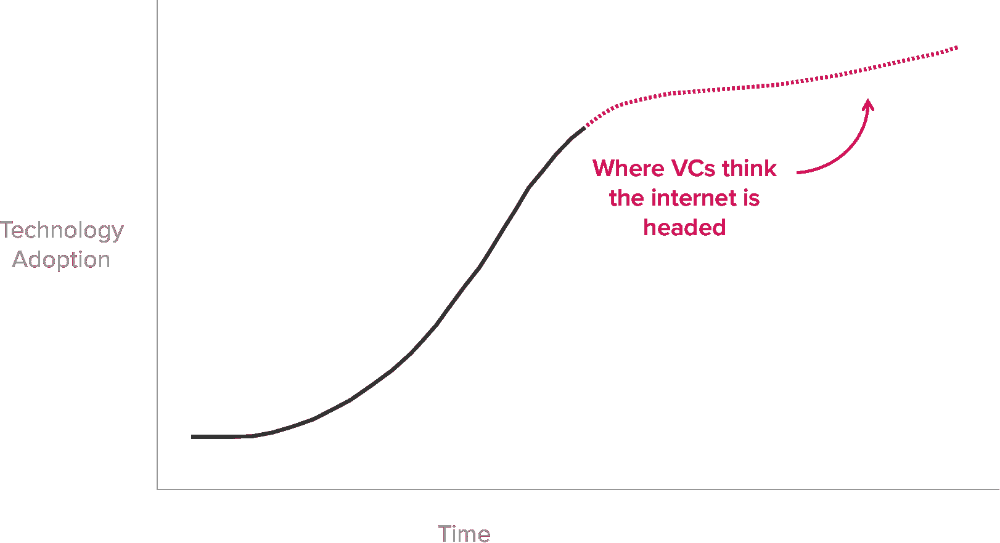
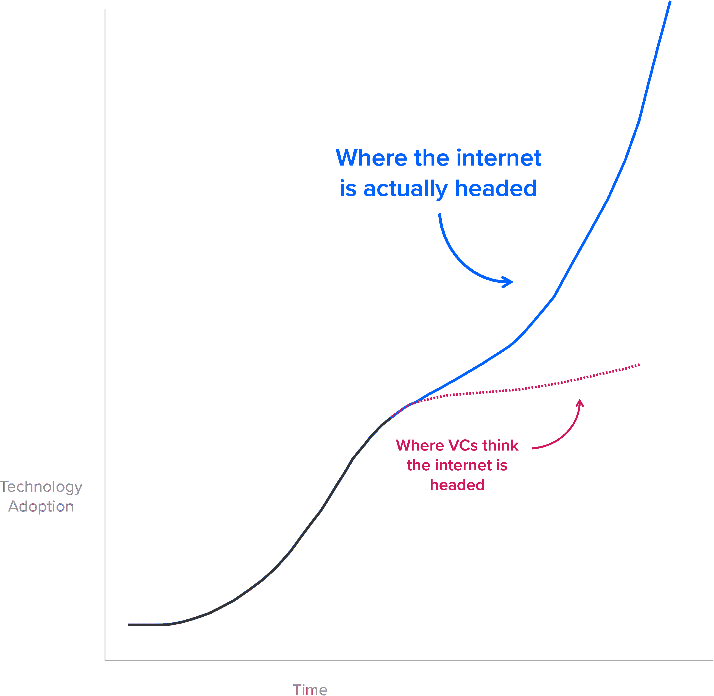
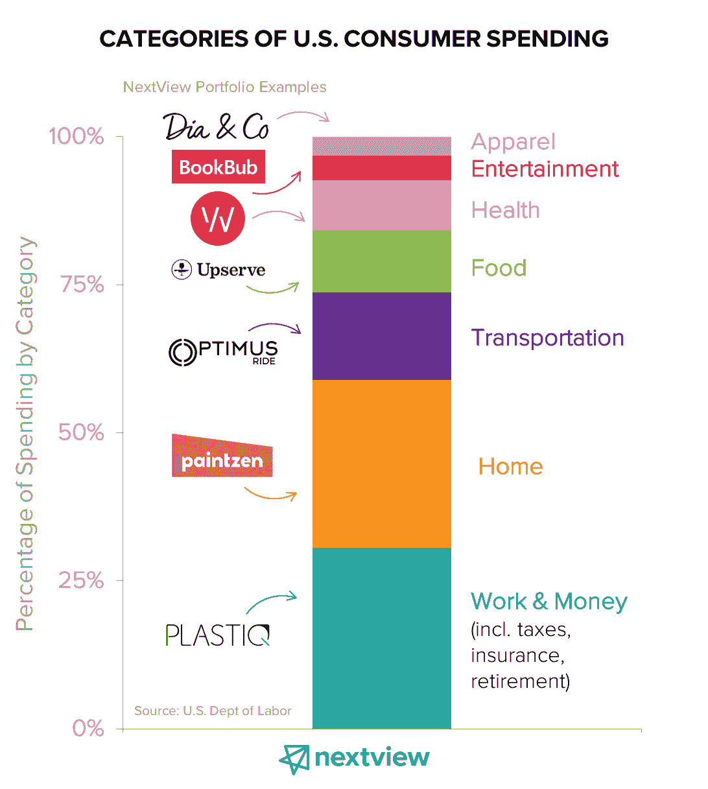

# 介绍 NextView III 和我们对日常经济的关注| NextView Ventures

> 原文：<https://nextviewventures.com/blog/everyday-economy/?utm_source=wanqu.co&utm_campaign=Wanqu+Daily&utm_medium=website>

未来会怎样？

这是每个风投问自己和他们投资的创业者的问题。一些人得出结论，某些行业或技术——如人工智能、区块链、虚拟现实——将定义未来十年。其他人押注于某些垂直行业或商业模式，如市场、SaaS 或企业技术。

在 NextView，我们认为预测未来的最佳方式是在更长的时间范围内看待它。塑造文明的技术的影响会持续几十年。不像一些投资者认为我们正处于不确定下一步会发生什么的时刻，我们相信一个漫长而繁荣的时代已经到来。

* * *

*出于这个原因， [我们很兴奋地宣布](https://www.axios.com/bostons-nextview-ventures-raises-third-seed-fund-2468323536.html)我们已经结束了 NextView 的 5000 万美元的第三支基金，其使命是支持那些重新设计日常经济的创始人。*

* * *

这篇文章旨在成为日常经济概念的引子——它是如何产生的，它是什么，以及它将如何指导我们对 NextView III 及以后的投资理念。

让我们从回到过去开始。

## 超技术的二阶效应

互联网连接计算是一场创新浪潮，与 18、19 和 20 世纪的一些历史发展不相上下。工业制造、铁路、电力和汽车都是大规模重塑社会的创新。

但在许多方面，这些并没有遵循“正常的”技术创新浪潮。

大多数创新浪潮都遵循一种模式，即首先开发基础设施，然后创建支持技术，最后在前两者的基础上构建应用程序。当一波开始达到顶峰时，风投们试图识别下一波。例如，在计算平台中，大型机被小型机取代，小型机被 PC 超越，PC 被客户机-服务器平台所包含，而客户机-服务器平台在许多方面已经被云和移动计算所取代。

传统智慧认为，互联网正走向这个周期的尽头——许多风投正在寻找下一个平台，无论是区块链、人工智能、合成生物学还是其他什么。

这个观点假设互联网遵循一个正常的创新浪潮——但是我 **t 没有。**

真正塑造文明的创新，比如汽车或电力——让我们称之为“超级技术”——遵循一种不同的、更宏大的模式，在更长的时间内展现出来。首先是隐喻性的(和字面上的)铁轨铺设。然后是“超级技术”为更广泛的社会带来的二阶效应，这通常需要 50 多年的时间。

这可以应用于前面讨论的任何波:

*   最初，在 19 世纪晚期，电只是一种给灯泡供电的方式。直到 20 世纪初，电力才重塑了工业流程、家庭自动化(电器)，甚至建筑(电梯让高楼成为可能)。
*   现代肉类工业是在铁路出现 30-40 年后兴起的。
*   第二次世界大战后在美国出现的郊区住宅、免下车餐馆和电影院以及购物中心，都是几十年前大众市场采用汽车的直接结果。

我们所知的互联网连接计算在这一点上已经有二十多年的历史了。最初阶段的大部分时间都集中在核心基础设施的建设上:无处不在的宽带(思科，高通)，信息搜索(雅虎，美国在线)，移动和云计算(苹果，三星，AWS)，以及建立在其上的社交网络(脸书)。

> 搜索、社交、宽带和移动领域的创新&云还没有走到尽头。但现在互联网计算的“铁轨”已经铺设好了，未来几十年最令人兴奋的公司正在使用这种基础设施来解决人们每天遇到的问题——我们称之为日常经济。

你已经看到了这一点的早期迹象。看看优步和 Lyft 就知道了。他们没有开发新的技术平台，而是在现有技术的基础上构建*来改变出租车行业。没有智能手机和实时定位服务，这些公司就不可能存在。*

优步和 Lyft 只是一个开始——日常经济的转型即将到来。以下是我们生活中受影响最大的几个领域。

## 什么是日常经济？

几乎所有人每天都会经历有限的事情。

作为个人，我们做的事情和购买的东西占美国 GDP 的 70%。[这种活动集中在几个领域](https://www.bls.gov/opub/reports/consumer-expenditures/2015/home.htm):家庭、交通、食物、工作&金钱、健康、服装和娱乐。这些类别中的每一个都代表着超过 1 万亿美元的市场机会，**它们中的每一个都是被数字技术颠覆的时机。**

日常经济的数字化转型不仅仅局限于我们了解或购买产品和服务的方式，它正在从根本上改变我们体验它们的方式。

[管理市场](http://www.mealpal.com/)、[机器人](http://momentummachines.com/)和[按需配送网络](http://www.postmates.com/)正在改变我们体验用餐简单快乐的方式。其他公司正在重新思考我们关于[家庭](https://www.common.com/)和[住宿](http://airbnb.com/)的概念。物理办公室并没有以任何方式变得过时，但是 IP 视频会议从根本上改变了许多人日常工作的方式和对象。优步和 Lyft 不仅仅是让打车变得更容易——这些服务，以及自动驾驶汽车技术的出现，正在重塑汽车所有权和个人移动性的整个概念。

> ***互联网已经从简化营销漏斗转变为重新定义我们消费的实际产品和服务。**T3】*

虽然我们对日常经济的镜头聚焦于我们个人的行为，但它并不局限于 B2C 公司。有无数的 B2B 创业公司正在推动这种数字化转型，以及消费者如何体验日常经济。例如，[next view 投资组合公司 Upserve](http://www.upserve.com/) ，是一个一体化的技术平台(POS、支付、CRM/忠诚度、BI)，帮助餐厅更好地为顾客服务。消费者不会直接体验 Upserve 的产品，但它却塑造了他们在最喜欢的餐厅用餐的日常体验。

有兴趣阅读更多关于日常经济的内容吗？以下是我们写的几篇文章，对我们的新论点进行了更深入的阐述:

每个垂直领域的深度挖掘:

## 我们计划如何投资于日常经济

在某些方面，我们对日常经济及其数字化转型的主题关注[并不是特别新](http://agilevc.com/blog/2012/05/23/the-end-of-internet-companies/)。在过去的几年里，我们一直在投资创业者，试图重塑我们日常生活的许多方面:

*   在食品方面， [MealPal](http://www.mealpal.com/) 为城市工人的日常午餐计划提供了令人瞠目结舌的价值，而 [Upserve](http://www.upserve.com/) 正如我们前面提到的，帮助餐馆取悦顾客。
*   在服装行业，Dia &公司和 [ThredUp](http://www.thredup.com/) 这样的公司不仅让购物变得更容易，他们还改变了服装的获取方式和人们每天实际穿的衣服。
*   在交通领域，擎天柱之旅正在重塑人们的出行方式。
*   在家中， [Grove Collaborative](http://www.grove.co/) 让营造健康、美丽的家居环境变得更加容易。还有[renovisio](http://www.renoviso.com/)和 [Paintzen](http://www.paintzen.com/) 正在改变人们改善和维护他们住所的方式。

我们在考虑这些公司和我们打算投资的其他公司时，有几个共同的视角。

首先，创始人是希望**重新设计**还是仅仅改进当前的解决方案？改善是线性的和递增的。重新设计看起来更像是阶跃函数转换，要求创始人以非常不同的方式处理问题。有时候，从一开始就看不出公司会导致重新设计，但这是公司 [Golazo](http://agilevc.com/blog/2012/02/07/ethos-what-golazo-means-to-nextview/) 的一部分。

第二，我们对那些每天都在重新设计****的公司感到兴奋。我们认为这是高度习惯性的产品，或者说是消费者每天都要接触的产品。 [Sunrise](http://blog.sunrise.am/) ，一款我们从第一笔基金中投资的日历应用，在被微软收购之前，每天都有数百万消费者使用。他们的商业客户每天都在使用 Slack 和 Dropbox。像 Casper 或 Renoviso 这样的公司可以实现可能不会经常发生的购买，但却是你每天在家里都会接触到的产品。****

 ****第三，我们寻找我们认为与日常生活相关的公司。这意味着有些不同，取决于你谈论的是消费者业务还是 B2B 产品，但我们相信，最大和最有影响力的公司将需要重新设计大众消费者或大量商业用户的生活。毫不奇怪，过去几年最大的电子商务公司——way fair、Chewy、Dollar Shave Club 和 Jet——都是**专注于大众市场的企业，而不是针对小众或奢侈品消费者的企业。**

也就是说，我们意识到，处于种子阶段的公司的起点可能比公司的最终目标要窄得多。[特斯拉是一个典型的例子](https://www.tesla.com/blog/secret-tesla-motors-master-plan-just-between-you-and-me)，该公司以高端跑车开始，作为迈向无处不在的电动汽车的第一步。这就是为什么我们不仅仅是一篇论文或投资镜头，我们的决策和我们作为一家公司的目的都是由创始人驱动的。

## 我们对接下来的事情感到兴奋

我们已经迫不及待地将 NextView 的第三只基金投资于为普通人改变日常生活的创始人，并继续支持我们的投资组合公司在过去七年中所做的重要工作。

虽然这篇文章的大部分内容是关于我们如何以不同的方式看待世界，但我们正在做的大多数事情都是一样的。

我们仍将努力帮助创始人，成为高信念、亲力亲为的投资者，推动决策、引导融资，并积极参与我们投资组合的公司。

我们仍然会在公司获得有意义的吸引力之前投资种子期和种子前阶段，不管它们筹集的是几十万美元还是几百万美元。早期投资仍然是我们唯一做的事情。

我们仍将扩大我们的资源平台，帮助种子期创业公司完成重新设计日常经济的大胆使命。

如果你是有这种使命的企业家，[请联系](https://www.linkedin.com/search/results/people/?facetCurrentCompany=%5B%221741416%22%5D)。我们期待着帮助你对我们的世界做出贡献。****