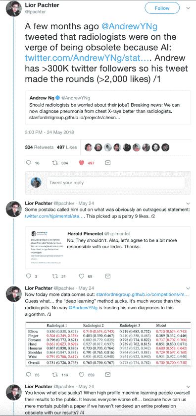
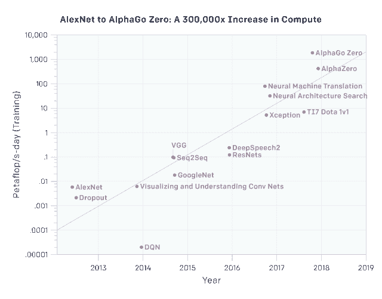

# 人工智能冬天即将到来——Piekniewski 的博客

> 原文：<https://blog.piekniewski.info/2018/05/28/ai-winter-is-well-on-its-way/?utm_source=wanqu.co&utm_campaign=Wanqu+Daily&utm_medium=website>

几年来，深度学习一直处于所谓的人工智能革命的前沿，许多人认为它是将我们带到技术奇点奇迹世界的银弹(通用人工智能)。在 2014 年、2015 年和 2016 年进行了许多下注，当时推出了新的边界，如 Alpha Go 等。特斯拉等公司通过他们的首席执行官宣布，完全自动驾驶汽车非常接近，以至于特斯拉甚至开始向客户出售这种选项(通过未来的软件更新实现)。

我们现在已经到了 2018 年年中，事情已经发生了变化。表面上还没有，NIPS 会议仍然被过度销售，企业公关仍然在新闻稿中到处都是人工智能，埃隆·马斯克仍然不断承诺自动驾驶汽车，谷歌首席执行官不断重复吴恩达的口号，即人工智能大于电力。但这种说法开始出现裂痕。正如我在之前的帖子中预测的那样，裂缝最明显的地方是自动驾驶——这是该技术在现实世界中的实际应用。

#### 深度学习尘埃落定

当 ImageNet 问题得到有效解决时(注意[这并不意味着视觉问题得到解决](https://blog.piekniewski.info/2016/08/12/how-close-are-we-to-vision/))，该领域的许多著名研究人员(甚至包括通常沉默寡言的 Geoff Hinton)都积极接受媒体采访，在社交媒体上发布信息(例如 Yann Lecun、吴恩达、费-李非等)。人们普遍认为，我们正面临一场巨大的革命，从现在开始，事情只会加速发展。好多年过去了，这些人的推特信息变得不那么活跃了，下面的吴恩达就是一个例子:

2013 年-每天 0.413 条推文
2014 年-每天 0.605 条推文
2015 年-每天 0.320 条推文
2016 年-每天 0.802 条推文
2017 年-每天 0.668 条推文
2018 年-每天 0.263 条推文(直到 5 月 24 日)

也许这是因为安德鲁令人愤慨的声明现在受到了社区的更多审查，正如下面的一条推文所示:

[T2】](https://i0.wp.com/blog.piekniewski.info/wp-content/uploads/2018/05/andrew_bs.png?ssl=1)

显然，这种情绪已经大幅下降，称赞深度学习是终极算法的推文少了很多，论文变得不那么“革命性”，而更具“进化性”。Deepmind 自从他们的 Alpha 归零后就没有表现出任何令人激动的事情[即使这样也不是那么令人兴奋，考虑到只适用于游戏的令人讨厌的计算量-见 [Moravec 的悖论](https://en.wikipedia.org/wiki/Moravec%27s_paradox) ]。OpenAI 相当安静，他们最后一次媒体爆发是 [Dota 2 游戏代理](https://blog.openai.com/dota-2/)【我想它是为了像 Alpha Go 一样引起轰动，但很快就失败了】。事实上[的文章开始出现，甚至谷歌事实上也不知道如何处理 Deepmind](https://www.theinformation.com/articles/deep-confusion-tensions-lingered-within-google-over-deepmind?shared=f86956392ee2b350Iss) ，因为它们的结果显然不像最初预期的那样实用...至于那些杰出的研究人员，他们一般都在四处旅行，会见加拿大或法国的政府官员，以确保他们未来的资助，Yann Lecun 甚至从研究负责人的位置上退下来，成为脸书的首席人工智能科学家。这种从富有的大公司到政府资助的机构的逐渐转变，在我看来，这些公司(我认为是谷歌和脸书)对这种研究的兴趣实际上正在慢慢减弱。同样，这些都是早期迹象，没有大声说出来，只有肢体语言。

#### 深度学习(不)扩展

关于深度学习的一个关键口号是，它几乎可以毫不费力地扩展。我们在 2012 年推出了 AlexNet，它有大约 6000 万个参数，我们现在可能有至少 1000 倍于这个数字的模型，对吗？或许我们有，但问题是——这些东西有 1000 倍的能力吗？或者甚至 100 倍的能力？openAI 的一项研究派上了用场:

 因此，就视觉应用而言，我们看到 VGG 和雷斯涅茨所应用的计算资源大约饱和了一个数量级(就参数数量而言，实际上更少)。Xception 是 google inception 架构的一个变体，实际上只比 ImageNet 上的 inception 略胜一筹，可以说实际上比其他所有人都略胜一筹，因为本质上 AlexNet 解决了 ImageNet。因此，在比 AlexNet 多 100 倍的计算能力下，我们在视觉方面，或者更准确地说，在图像分类方面，几乎已经饱和了。神经机器翻译是所有大型网络搜索公司的一项巨大努力，难怪它需要所有可能的计算(然而谷歌翻译仍然很糟糕，尽管可以说已经变得更好)。图表上最近的三个点有趣地显示了 Deepmind 和 OpenAI 应用于游戏的强化学习相关项目。特别是 AlphaGo Zero 和稍微更一般的 AlphaZero 需要大量的计算，但在现实世界的应用中不适用，因为需要大量的计算来模拟和生成这些数据饥渴模型所需的数据。好的，我们现在可以在几分钟内训练 AlexNet，而不是几天，但是我们可以在几天内训练一个 1000 倍大的 AlexNet，并获得质量更好的结果吗？显然不是...

所以事实上，这个图表旨在显示深度学习的规模，表明了完全相反的情况。我们不能只是扩大 AlexNet 的规模并分别获得更好的结果——我们必须摆弄特定的架构，如果没有数量级的更多数据样本，额外的计算实际上并不能买到多少东西，这些数据样本实际上只在模拟游戏环境中可用。

#### 自动驾驶撞车

到目前为止，对深度学习名声打击最大的是自动驾驶汽车领域(这是我期待了很长时间的事情，例如，参见 2016 年的这篇[帖子](https://blog.piekniewski.info/2016/11/15/ai-and-the-ludic-fallacy/))。最初人们认为端到端深度学习可以以某种方式解决这个问题，这是英伟达特别大力推广的[的前提。我认为地球上没有一个人仍然相信这一点，尽管我可能是错的。看看去年加州](https://devblogs.nvidia.com/deep-learning-self-driving-cars/) [DMV 脱离报告](https://www.dmv.ca.gov/portal/dmv/detail/vr/autonomous/disengagement_report_2017) Nvidia 汽车在没有脱离的情况下不能行驶 10 英里。在另一篇[文章中，我讨论了这一发展的总体状况，以及与人类驾驶员安全的比较](https://blog.piekniewski.info/2018/02/09/a-v-safety-2018-update/)，这(剧透警告)看起来并不乐观。自 2016 年以来，还发生了几起特斯拉自动驾驶事故[ [1](http://www.newsweek.com/autonomous-tesla-crashes-parked-fire-truck-california-freeway-789177) 、 [2](http://www.newsweek.com/tesla-model-s-crash-car-autopilot-sped-just-utah-firetruck-944251) 、 [3](https://www.zerohedge.com/news/2018-05-28/tesla-enthusiasts-european-model-3-tour-ends-when-autopilot-crashes-median) ]，其中一些是致命的[ [1](http://www.businessinsider.com/tesla-fatal-model-x-crash-response-2018-3) 、 [2](https://www.usatoday.com/story/tech/news/2018/05/21/tesla-model-s-crash-into-californiaa-model-s-crash-into-california-pond-killed-driver-police-say/630798002/) ]。按理说，特斯拉 Autopilot 不应该与自动驾驶混淆(确实如此)，但至少在核心方面，它依赖于同类技术。时至今日，除了偶尔的[惊人错误](https://www.youtube.com/watch?v=TIUU1xNqI8w&ab_channel=neuralmobile) [ [1](https://www.youtube.com/watch?time_continue=62&v=ijybZPWW0UI&ab_channel=aDigitalNomad.net) ，它仍然不能在十字路口停下来，识别红绿灯，甚至[不能通过环形交叉路口](https://www.youtube.com/watch?v=femkjSK3v_8&ab_channel=Bj%C3%B8rnNyland)。那是在 2018 年 5 月，在承诺的海岸到海岸特斯拉自动驾驶几个月后(没有发生，尽管传言他们已经尝试过，但如果没有大约 30 次分离，就无法让它工作)。几个月前(2018 年 2 月)，埃隆·马斯克(Elon Musk)在一次电话会议上被问及海岸到海岸的驾驶时重复道:

“我们本来可以实现海岸到海岸的驾驶，但这需要太多专门的代码来有效地实现它，或者使它变得有些脆弱，并且它将适用于一条特定的路线，但不是通用的解决方案。所以我认为我们能够重复它，但是如果它不是任何其他的路线，那就不是真正的解决方案。(…)

对于我们在神经网络前沿取得的进展，我感到非常兴奋。这是一点——这也是一种指数式的进步——看起来没有太大的进步，看起来没有太大的进步，突然哇。感觉这是一个蹩脚的司机，蹩脚的司机。好吧，那是个不错的司机。就像“天啊！”这个司机不错。就像这样，“

看上面的图(来自 OpenAI ),我似乎没有看到指数级的进步。对于这个领域的几乎每个大玩家来说，在脱离之前的[英里内也看不到它。从本质上来说，上面的陈述应该被解释为:*“我们目前没有能够安全驾驶我们从一个海岸到另一个海岸的技术，尽管如果我们真的想的话，我们可以伪造它(也许...).我们深切希望神经网络能力的某种指数跳跃将很快发生，并把我们从耻辱和大规模诉讼中拯救出来”*。](https://blog.piekniewski.info/2018/02/09/a-v-safety-2018-update/)

但到目前为止，穿透人工智能泡沫的最大事件是优步自动驾驶汽车在亚利桑那州杀死一名行人的事故。从 NTSB 的[初步报告中，我们可以读到一些惊人的说法:](https://www.ntsb.gov/news/press-releases/Pages/NR20180524.aspx)

除了这份报告中明显的一般系统设计故障之外，令人惊讶的是，该系统花了很长时间试图确定它到底看到了什么(是行人、自行车、车辆还是其他什么)，而不是在这些情况下做出唯一符合逻辑的决定，即确保不要撞到它。有几个原因:首先，人们通常会在事后说出他们的决定。因此，人类通常会说:“我看到一个骑自行车的人，所以我转向左边以避开他”。大量的心理物理学文献将提出一个完全不同的解释:一个人看到了一个被他的神经系统的快速感知回路非常迅速地解释为障碍的东西，他迅速采取行动避开它，很久以后意识到发生了什么并提供了口头解释”。我们每天都会做很多没有用语言表达出来的决定，驾驶也包括其中的很多。语言化是昂贵的，需要时间，而现实往往没有这个时间。这些机制已经进化了十亿年来保护我们的安全，驾驶环境(尽管是现代的)利用了许多这样的反射。由于这些反射不是专门为驾驶而进化的，它们可能会导致错误。一只黄蜂在汽车里嗡嗡叫时的膝跳反应可能导致许多撞车和死亡。但是我们对 3d 空间的一般理解，速度，预测代理行为的能力，穿越我们道路的物理对象的行为都是原始技能，它们在 1 亿年前和今天一样有用，它们已经被进化磨砺得非常锋利。

但是因为这些事情中的大多数不容易用语言表达，它们很难测量，因此我们根本没有在这些方面优化我们的机器学习系统[参见我早先的[帖子，了解将解决其中一些能力的基准提案](https://blog.piekniewski.info/2018/02/26/some-new-ideas-for-ai-benchmarks/)。现在，这将有利于 Nvidia 端到端的方法-学习图像- >动作映射，跳过任何动词化，在某些方面，这是正确的方法，但...问题是输入空间是难以置信的高维，而动作空间是非常低维的。因此，与输入的信息量相比,“标签”(读出)的“量”是非常小的。在这种情况下，很容易学习虚假的关系，正如[在深度学习](https://blog.piekniewski.info/2016/08/18/adversarial-red-flag/)中的对立例子所展示的那样。需要一种不同的范式，我假设对整个感知输入的[预测](https://blog.piekniewski.info/2016/11/03/reactive-vs-predictive-ai/)以及行动作为第一步，使系统能够提取世界的语义，而不是虚假的相关性[ [阅读更多关于我第一个提议的架构，称为预测视觉模型](https://blog.piekniewski.info/2016/11/04/predictive-vision-in-a-nutshell/)。

事实上，如果说我们从深度学习的爆发中学到了什么，那就是(10k+维)图像空间中有足够多的虚假模式，它们实际上概括了许多图像，并给人留下了这样的印象，即我们的分类器实际上理解他们所看到的。没有什么比这更偏离事实了，就连在这一领域投入巨资的顶级研究人员也承认了这一点。事实上，许多顶级研究人员不应该对我的观察感到太愤怒，Yann Lecun [警告过过度兴奋和 AI winter 一阵子](https://spectrum.ieee.org/automaton/robotics/artificial-intelligence/facebook-ai-director-yann-lecun-on-deep-learning)，甚至 Geoffrey hint on——目前反向传播爆发的父亲——在一次[采访中也承认这可能是一个死胡同，我们需要重新开始。然而，在这一点上，炒作是如此之强，以至于没有人会听，即使是该领域的创始人。](https://www.axios.com/artificial-intelligence-pioneer-says-we-need-to-start-over-1513305524-f619efbd-9db0-4947-a9b2-7a4c310a28fe.html)

#### 加里·马库斯和他对炒作的探索

我应该提到，越来越多的高层人士认识到了傲慢，并有勇气公开称之为傲慢。加里·马库斯是这一领域最活跃的人物之一。虽然我不认为我同意加里在人工智能方面提出的所有观点，[我们当然同意它还没有深度学习宣传](https://www.nytimes.com/2018/05/18/opinion/artificial-intelligence-challenges.html)描绘的那么强大。事实上，这一点也不接近。对于那些错过了它的人，他有优秀的博客帖子/论文[、【深度学习:批判性评估】、](https://arxiv.org/abs/1801.00631)和[，为深度学习的怀疑论辩护](https://medium.com/@GaryMarcus/in-defense-of-skepticism-about-deep-learning-6e8bfd5ae0f1)，在那里他非常细致地解构了深度学习的炒作。我非常尊重 Gary，他表现得像一个真正的科学家，而大多数所谓的“深度学习明星”只是表现得像廉价的名人。

#### 结论

预测人工智能的冬天就像预测股市崩盘一样——不可能准确地说出它何时发生，但几乎可以肯定它会在某个时候发生。就像股市崩盘之前一样，有即将崩溃的迹象，但这种叙事是如此强烈，以至于人们很容易忽视它们，即使它们显而易见。在我看来，深度学习(很可能是整个人工智能，因为这个词已经被企业宣传‘令人作呕’地滥用了)的巨大衰退迹象已经可见。显而易见，却被越来越激烈的叙述所掩盖。这个冬天会有多“深”？我不知道。接下来会发生什么？我不知道。但我相当肯定它会到来，也许是迟早的事。

如果您发现一个错误，突出显示它并按下 **Shift + Enter** 或[T3【点击此处 T5】通知我们。](#)

### *相关*

### 评论

<comments-count href="https://blog.piekniewski.info/2018/05/28/ai-winter-is-well-on-its-way/">评论</comments-count>