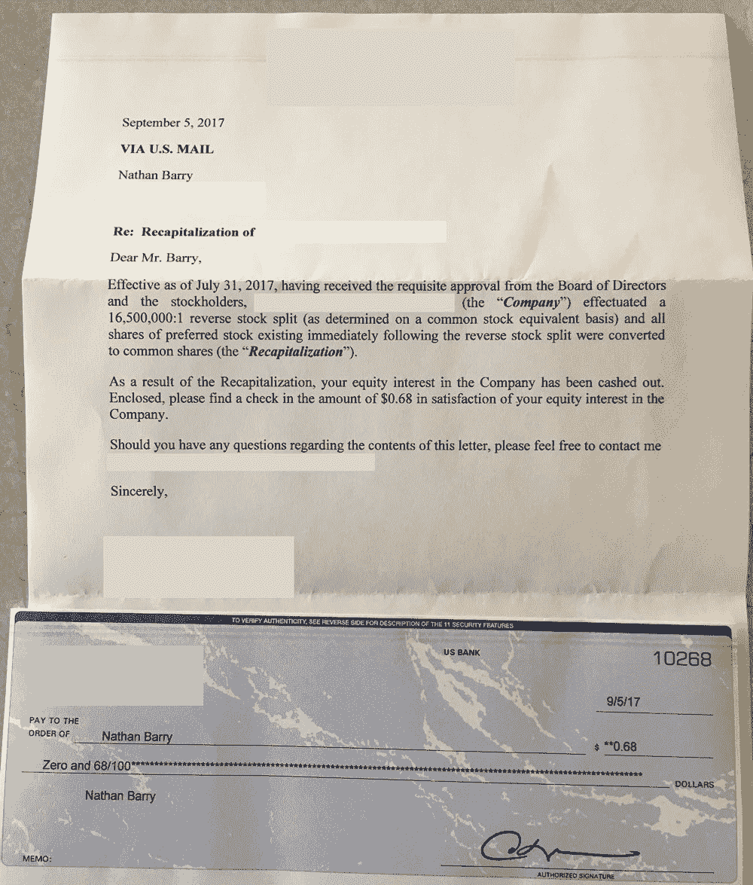
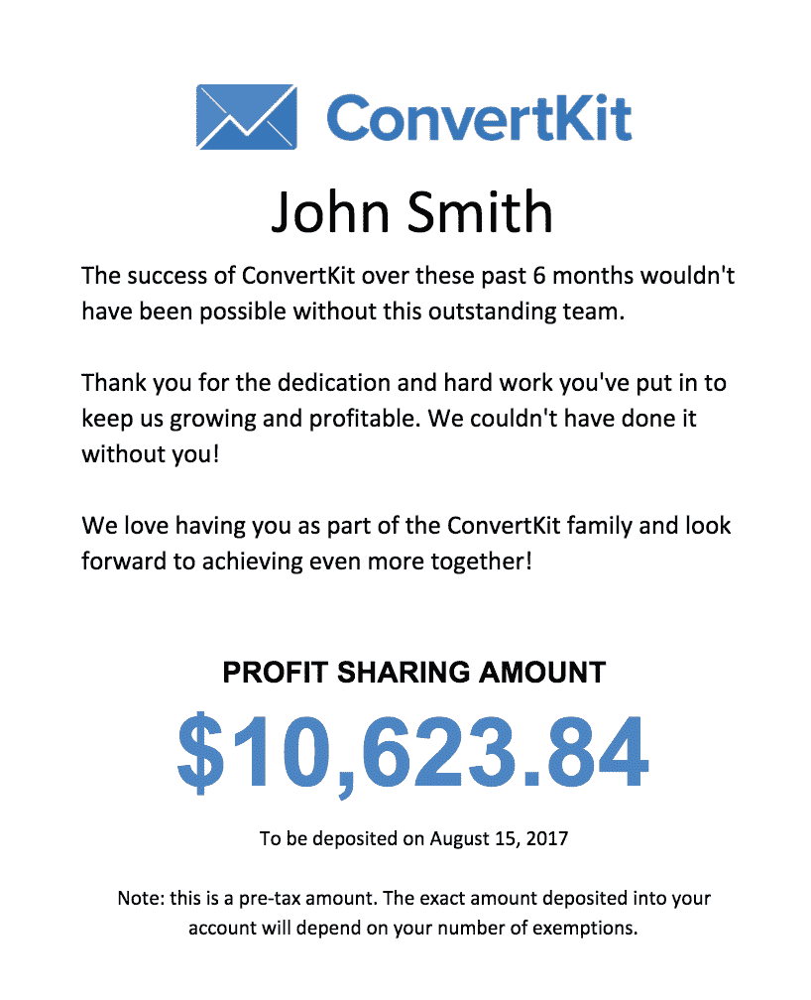
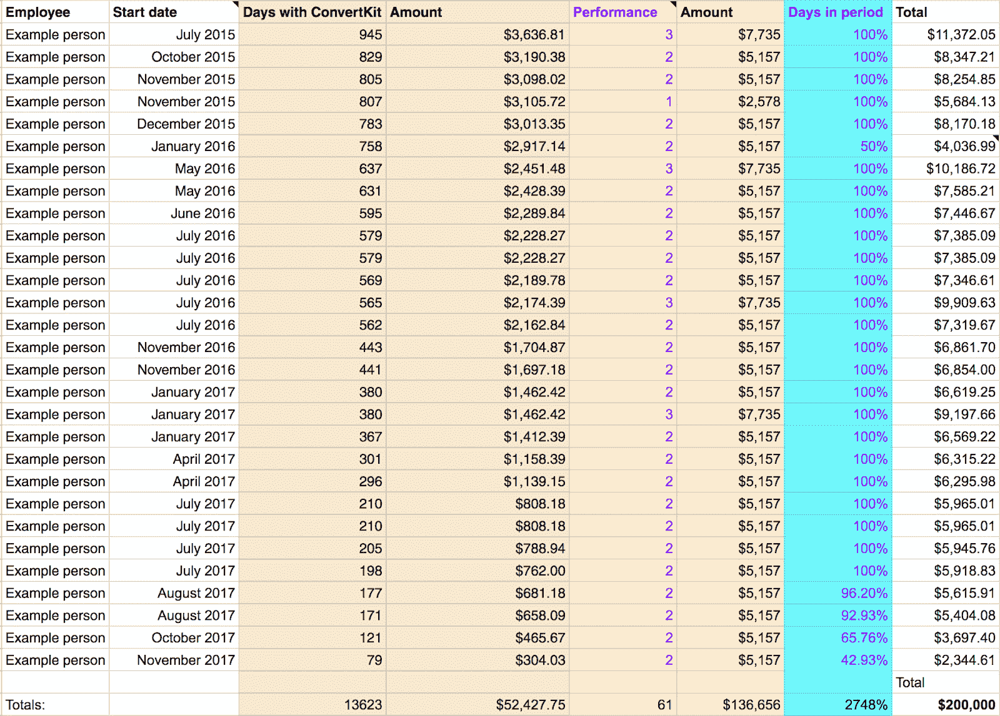

# 自举创业公司的利润分享

> 原文：<http://nathanbarry.com/profit-sharing/?utm_source=wanqu.co&utm_campaign=Wanqu+Daily&utm_medium=website>

在高速增长的初创公司世界里，ConvertKit 是一个例外。我们没有筹集资金。我们没有出售的欲望。事实上，我们甚至没有退出策略。

最近有人问我何时会考虑出售 ConvertKit，我给出了和往常一样的答案:至少十年内不会。一个以前听过我这么说的朋友说:“等等，你去年也是这么说的。所以现在不应该是九年吗？”

没有。倒计时的不是钟。这是一个永久的长期焦点。我们刚刚开始我们的使命，接听潜在收购者和私募股权公司的电话只是分散注意力。

那么，在一家你从未打算出售的公司，你该如何奖励团队呢？

## 为什么股票期权对我们不是最好的

股票期权是最常见的方法，但是用股票补偿一个团队成员，然后马上说“哦，是的，但是我们不打算卖”是很奇怪的

没有退出事件的期权，其价值与你期望在五年内翻盘并进入下一个创业公司时的价值不一样。

即使这是你的目标，结果也不尽如人意。在我持有股票的所有公司中，ConvertKit 是唯一一家让我赚到钱的公司……除了我去年夏天收到的这张 0.68 美元的支票！

# 而是利润分成！

我们关注的不是股权和股票，而是利润分享。它更容易理解，并且在短期内有更明显的好处。让我们来分析一下我们在 ConvertKit 是如何做到这一点的。

### 利润分享第一轮

2016 年，我们大力推动盈利，增加手头现金。在此期间，我们在短短 5 个月内就从亏损变成了 51%的利润率！你可以在这里阅读。

一旦我们做到了这一点，我想通过分红奖励团队。但是我们太新了，我不知道该用什么系统。工资应该是一个因素吗？性能？与公司相处的时间？

第一次，我们筹集了 110，000 美元，纯粹根据在公司的时间在团队之间分配。我们当时有 20 个团队成员，只有两个人和我们一起工作了一年多！

我把每个人的开始日期写在一个电子表格中，计算从那时到我们计划支付利润分成的日期的天数。在 Google Sheets 中，这是一个简单的等式:

*=DATEDIF(B2，“2017 年 8 月 1 日”D)*

B2 是有团队成员开始日期的单元格，D 告诉它返回的格式(天数)。

然后我用 110，000 美元除以总天数，得到每天 1 美元。这导致与我们一起工作了 45 天的团队成员的总收入从 1，188 美元开始，到我们任期最长的团队成员的 16，419 美元。

这很简单，而且效果很好，因为公司有这样一个时间范围，但它太基本，不可持续，因为它没有奖励业绩。

**支付**

由于团队中没有人知道这一点，我想在务虚会上给每个人一个惊喜。因此，我们为每个团队成员准备了卡片，并由每个主管给每个人写了个性化的信息。

然后附上一张简单的卡片，上面详细说明了将存入他们银行账户的内容。

坐在一个圈里的每个人立刻打开他们的卡片，为我们所有人创造了一个特殊的时刻，来分享公司的成功。

### 第 2 轮—设计系统

我们的第一轮利润分享是一个不错的基础，但对于我们的下一次团队务虚会(我们每六个月举办一次)，我们需要一个更好的系统。

我们知道在公司的时间是一个因素，但不是最重要的因素。相反，我们希望每个团队成员的个人表现成为最大的驱动力。

经过深思熟虑，我们想出了一个简单的系统。

*   每笔奖金的 25%基于在公司的时间。
*   75%基于 0-4 分的表现。

迫在眉睫的问题是，什么是尺度，我如何得到最高分？它是这样分解的:

*   0 —糟糕的性能。实际上，他们应该已经被解雇了。
*   1 —我们的标准很高，而他们达不到。这听起来很痛苦，但是我们会和他们一起制定一个计划让他们回到正轨。
*   2 —他们符合我们对该职位的高标准。2 表示你做得很好。这是最常见的分数。
*   3-他们完成了非凡的工作，提高了自己的技能，并交付了一个重要的项目。在 30 多名团队成员中，通常有四五名得分为 3。
*   4——他们不仅提升了自己，还推动公司向前发展。获得这个分数的门槛非常高。我们还没有给 4 分。

规模就是这样。最重要的是，每三个月，每个团队成员都知道他们的位置，并有时间在两年一次的利润分享之前提高他们的绩效。

这个公式就是将总收入(比如 10 万美元)分成两部分:在公司的时间(2.5 万美元)和业绩(7.5 万美元)。然后，将公司和绩效分数的所有总天数从各自的时段中划分出来，以获得每天和绩效分数的值。

下面是一个示例电子表格(带有随机的性能分数和名称):

我们期望团队中的每个人立即开始做出有意义的贡献。因此，我们不需要等待任何时间，直到您能够参与。也就是说，如果您只是在 6 个月的一段时间内加入，那么获得绩效积分的全部价值是不公平的。所以最后一步是将每个数字乘以每个人工作时间的百分比。对于大多数人来说，这是 100%，但对于任何人来说，这将是一个较小的百分比。

### **第 3 轮——最终调整**

这个系统运行得非常好。性能分数的设置需要一点时间来适应，也需要围绕什么是 a 2 和 a 3 进行大量的讨论，但是我们已经解决了这个问题。

唯一的问题是，我们仍然悬而未决，不知道最终的泳池会是什么样。我们第一次是 11 万美元，因为那是感觉对的。第二次是 200，000 美元，因为…嗯，感觉也不错。

我们想要一个更好的系统，这样团队就可以真正预测他们的利润分成会是多少。这意味着承诺将固定百分比的利润分配给团队。现在我们把利润分成几个部分:税收、储蓄和分配利润。

然后，分配利润被分成三组:

52% —团队利润分享
8% —领导奖金
40% —所有者分配

随着 52%的利润分配给团队，每个成员都可以看到他们的日常决策如何影响他们自己的利润分享支票。

**工资不是一个因素**

我们的系统和我见过的大多数其他利润分享系统的一个关键区别是，我们不考虑工资。我们的理论是，工资反映了你的市场价值，而不完全是你对公司的价值。更高的市场价值，如工程师与客户支持团队成员相比，已经反映在工资中，所以我们不需要在利润分享中再次考虑它。

**花钱如流水**

一年前，团队中有人建议我们去哥斯达黎加，而不是加利福尼亚的海滨度假。我们认为这是一个伟大的想法，并开始定价。

海滨酒店的估价是 4 万美元。哥斯达黎加接近 6 万美元。我们问了团队，每个人都说，“加州的海滩很棒。让我们节省 2 万美元。”

还有一次，有人不小心让一台额外的服务器处于运行状态，这一个月花费了大约 2000 美元。一旦它被发现并关闭，来自团队的信息就很明确，“这在大计划中没什么大不了的，但请小心。这是我们的钱。”

**领导奖金**

作为其中的一部分，我们拨出 8%作为领导奖金。这是基于每位领导者设定的季度目标以及他们在此期间达到的百分比。他们也可以分享团队的利润。

因此，如果一个领导者每个季度为自己和团队设定 10 个目标，他们将根据完成的目标获得他们应得的份额。因此，在 4 个领导者的情况下，他们每个人将有 2%的利润用于分配。然后，如果他们在第一季度完成 7/10 的目标，在第二季度完成 8/10 的目标，他们将获得他们有资格获得的 75% (15/20)的奖金。

这是一个非常有效的简单系统。它奖励聪明的目标设定和来自其他领导者的同行压力，确保你不会设定你保证会达到的雄心勃勃的目标。

### 第 4 轮—已建立的系统

现在我们正在为第四轮利润分享做准备，我不认为我们会做任何额外的调整。我们对上次的数字和系统感到满意，并对它成为我们文化中更正常的一部分感到兴奋。

在前三轮中，我们给团队分配了 513，817 美元的利润。由于我们专注于继续扩大我们的收入和利润，同时保持我们的团队规模较小，我们预计随着我们在一个只有 50 人的团队中接近 100，000，000 美元的长期目标，这些数字将继续大幅增长。

***

能够用一张支票给团队一大笔钱是很特别的。每次我们这样做都是我一年中的一个亮点。为你的公司试一试，让我知道你的想法！