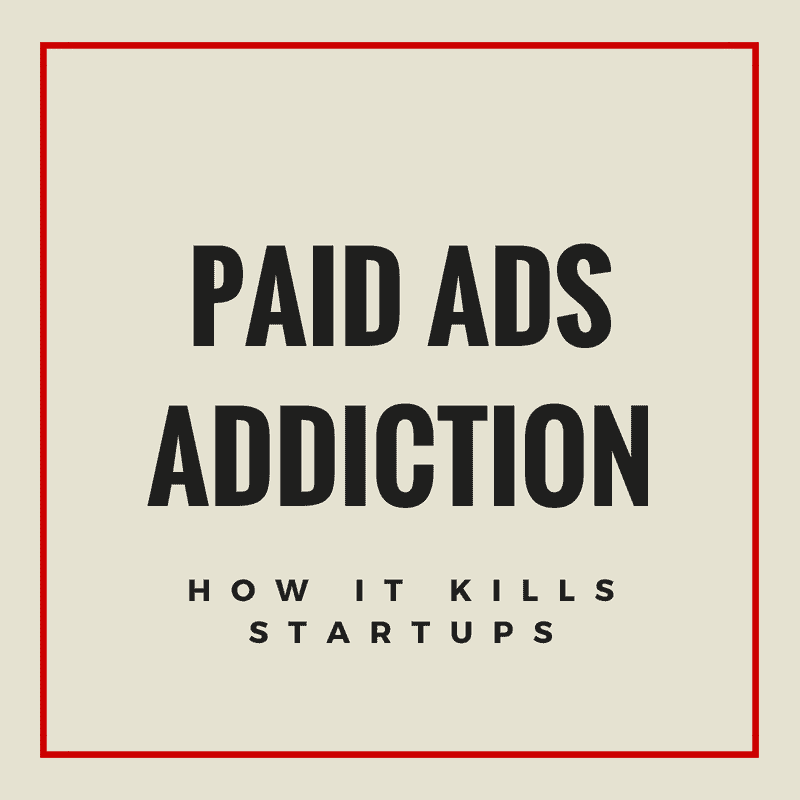
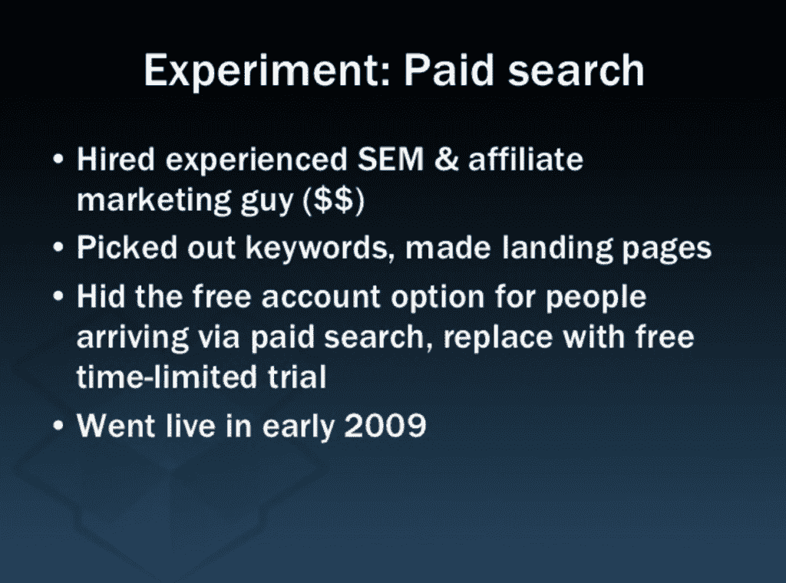
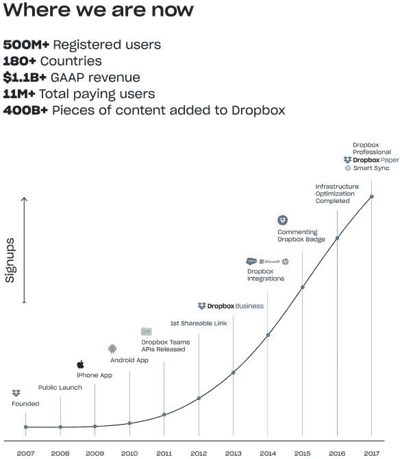
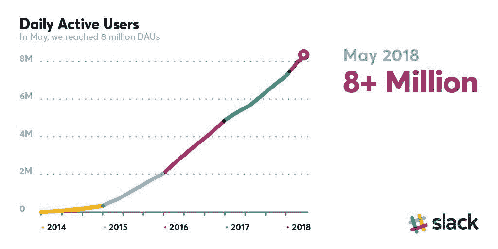

# 初创公司如何死于对付费营销的沉迷

> 原文：<http://andrewchen.co/paid-marketing-addiction/?utm_source=wanqu.co&utm_campaign=Wanqu+Daily&utm_medium=website>

*【原文发于 [@andrewchen](https://twitter.com/andrewchen/status/993560378129960960) ，关注我更多！]*

近代史上许多最大的内爆——尤其是电子商务——都是由于初创公司沉迷于付费营销，同时在客户获取成本上自欺欺人。随着支出规模的扩大，它总是变得越来越昂贵，也越来越难以追踪——从来不会减少。

一个熟悉的故事:新产品发布。漂亮的扣球，但它会消失。该产品是低频率的-必须花费增长。营销支出增加，有利可图！花费越多，通过风投筹集的资金就越多。OMG 这是工作！派对！

突然，顶线碰到了天花板。投资回收期从 9 个月到 12 个月，然后更长。单位经济有利可图，但没有员工+总部。没有顶线增长，就无法筹集更多的投资资金。预算被削减，然后裁员。

更慢的增长意味着一个支点即将到来。尝试其他也由付费营销驱动的方式。也许订阅？溢价？试试另一件事。然后另一个。无关紧要——或者破产。

这种情况发生得够多了，现在你们都应该点头了——这很难，但这是有规律的。这就是付费营销本地 Max。

这里的关键见解是，付费营销作为主要渠道很难大规模增长。它高度依赖于对抗外部力量——竞争和平台——以及当事情变得不可持续时领导团队的心理。

第一个错误是一开始就把一切都想成混合 CAC——把你所有的收购和美元分开——而不是理解每个渠道的 CAC(脸书、谷歌展示、谷歌广告词等)。).前者具有误导性。

因为你最初的有机用户是你最大的粉丝，你的混合 CAC 和每频道 CAC 经常会相差 2-5X。当你调整你的收入时，你的收入不会遵循 1:1 的比例。因此，随着你的成长，你的混合将接近你的主导渠道的 CAC。

在付费营销中，规模效应通常对你不利。你的广告活动持续的时间越长，效果就越差——人们开始过于频繁地看到你的广告。信息变得陈旧，新奇的效果是真实的。市场表现已经回归均值。

饱和也是一个东西。当你买下你的核心人口时，额外的数量来自非核心人口，他们不太敏感。在美国，对一家酒店的第一次广告印象是最具响应性的，但你最终会用完这些印象。

竞争是真实的。他们不仅会复制你的产品，还会复制广告信息和创意。快速跟进并不难，尤其是如果你可以从千禧一代友好的广告文案和登陆页面开始测试。

相比之下，病毒性渠道、Dropbox 中的文件夹共享或 Slack 的团队渠道创建——这些都是高度情境化的，只有少数人可以复制。而在广告中，你是在和所有追随你的人竞争。

沉迷于付费营销会让你陷入局部最大化。解决潜在问题要困难得多——创建真正的护城河、产品差异化、进行更深层次的广告技术整合。更容易的是花更多的钱，把 LTV 窗口从 9 个月推到 12 到 18 个月。

付费营销在一些情况下是合理的，但这取决于具体情况。如果你的产品有网络效应，在激活点后开始发挥作用，并真正扩展，你可以使用付费来帮助引导。例如，脸书使用有偿资金来建设新的区域。

如果你真的打算从工程/增长上投入大量时间来集成所有的 API，尝试大量的算法上的东西，那么你就可以发展出持久的优势。我听说 Wish 在这方面做得很好，但这并不常见。

新一代的广告平台使收入达到新的高度成为可能，但没有盈利能力。确保你不会上瘾。建立新的渠道。固定流失和频率。不要太早恭喜自己。并正确计算 LTV/CAC:)

那你会怎么做呢？这方面最好的案例研究之一来自@drewhouston 早期的 Dropbox 演示。这张卡片里有很多很棒的东西，现在已经过去了将近 10 年，值得翻阅。[这里是](https://www.slideshare.net/gueste94e4c/dropbox-startup-lessons-learned-3836587/)。

在第 18 张幻灯片上，Drew 谈到了他们对付费搜索所做的早期实验。他们执行了当时的行业最佳实践——转向试用定价，隐藏免费选项，优化登录页面。幻灯片:

他们了解到，在云存储的成熟市场中，已经有很多竞争。所有付费营销渠道都无利可图。隐藏免费选项与用户不一致。等等等等。

显而易见的举措是继续研究这个问题！调整定价，优化更多广告/漏斗/登陆页面等。许多人会被诱惑去这么做，因为这对其他人来说是有效的

有趣的是，正如你在幻灯片中看到的，它是通过文件夹共享、给予/获取磁盘空间程序等病毒式增长的。现在看来很明显，记得当年，“云存储”是一个空间，不清楚你是否能在那里传播开来。

Dropbox 从那以后做的很好，当然！

顺便说一句，指数增长曲线看起来总是线性的，这难道不有趣吗？这也是 Slack 的观点:

在某些方面，你可以说 Dropbox 很幸运，他们最初对付费营销的尝试没有成功。这使得他们更容易停止在那里的努力，并专注于现在是他们的面包和黄油的病毒渠道。

另一方面，远离当前的行业“最佳实践”需要大量的洞察力和反思——即使它们侵蚀了盈利能力，导致鲨鱼鳍等。

所以，对于那些正在考虑全力以赴进行付费营销的人来说，我希望你们能在这个策略上更进一步。也许把你的付费购买限制在 TOF 的 30-40%。而是，哪里能创新？

除了 Dropbox，我有时还会利用@Barkbox 的故事，它创造了一个完整的媒体资产——bark post(http://barkpost.com ),作为一个病毒式的内容共享引擎，可以交叉销售订阅产品。

或者在优步，虽然它们从未成为重要的渠道，但我们热衷于分享病毒式分享功能，如 Share ETA、车费分摊和位置分享，以潜在地推动收购。

关键是，我们知道付费营销很容易上瘾，而且很难缩减规模，所以除了有机/WOM，我们业内的所有人都应该一直考虑第二或第三渠道，给我们一个摆脱不断增加的广告预算的方法。

要做到这一点，你需要授权你的创意团队从各个角度解决问题——新的病毒式产品功能，真正投资于你的推荐项目，建立你的内容/搜索引擎优化策略，即使这需要几年时间。值得投资！

**PS. Get new updates/analysis on tech and startups**

我写一份高质量的每周时事通讯，报道硅谷发生的事情，关注创业、营销和移动领域。

在本网站链接的“内容”(包括帖子、播客、视频)中或在社交媒体和其他平台(统称为“内容分发渠道”)中发表的观点是我自己的，并不是 AH Capital Management、l . l . c .(“a16z”)或其各自附属公司的观点。AH 资本管理公司是一家在证券交易委员会注册的投资顾问公司。注册为投资顾问并不意味着任何特殊技能或培训。这些帖子不针对任何投资者或潜在投资者，也不构成出售或购买任何证券的要约，不得用于或依赖于评估任何投资的价值。

内容不应被解释为或以任何方式依赖于投资、法律、税务或其他建议。您应该向您自己的顾问咨询有关任何投资的法律、商业、税务和其他相关事宜。这些材料中表达的任何预测、估计、预测、目标、前景和/或观点可能会在不通知的情况下发生变化，并且可能与他人表达的观点不同或相反。此处提供的任何图表仅供参考，在做出任何投资决策时不应依赖。此处包含的某些信息来自第三方来源。虽然这些信息来自据信可靠的来源，但我并未独立核实这些信息，也未对这些信息的持久准确性或其在特定情况下的适当性做出任何陈述。该内容仅在所示日期有效。

在任何情况下，本网站或相关内容分销渠道上提供的任何帖子或其他信息都不应被解释为 a16z 人员发起、讨论或提及的任何集合投资工具中的任何证券或权益的购买或销售要约。也不应被理解为提供投资咨询服务的要约；投资 a16z 管理的集合投资工具的要约将单独提出，并且仅通过特定集合投资工具的保密要约文件提出，这些文件应完整阅读，并且仅提供给符合联邦证券法规定的特定资格的人。这些投资者被定义为合格投资者和合格购买者，通常被认为有能力评估潜在投资和财务事项的优点和风险。不能保证 a16z 的投资目标会实现或投资策略会成功。对 a16z 管理的投资工具的任何投资都包含很高的风险，包括损失全部投资金额的风险。提及、提及或描述的任何投资或投资组合公司并不代表 a16z 管理的所有投资工具，也不能保证这些投资将会盈利，也不能保证将来进行的其他投资会有类似的特征或结果。a16z 管理的基金所做的投资清单可在 https://a16z.com/investments/.获得。该清单不包括发行人未允许 a16z 公开披露的投资以及对公开交易的数字资产的未宣布投资。Andreessen Horowitz 投资、集合投资工具或投资策略的过去结果不一定代表未来结果。请参见[https://a16z.com/disclosures](https://a16z.com/disclosures)了解更多重要信息。