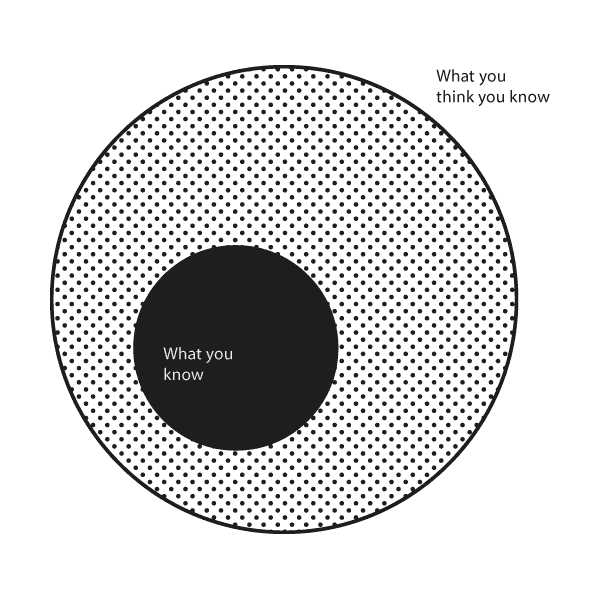

# 了解你的能力范围:沃伦·巴菲特如何避免问题

> 原文：<https://www.fs.blog/2013/12/mental-model-circle-of-competence/?utm_source=wanqu.co&utm_campaign=Wanqu+Daily&utm_medium=website>

伟大的精神模型卷[一](https://geni.us/J7N0UK)和[二](https://geni.us/EJAcg)都出来了。
点击了解更多关于[项目的信息。](https://fs.blog/tgmm/)

了解你的能力范围有助于你避免问题，发现改进的机会，并向他人学习。

沃伦巴菲特多年来一直使用能力圈的概念，作为一种让投资者专注于他们最了解的领域的方法。这个概念的核心出现在他 1996 年的股东信中:

> 投资者需要的是正确评估所选业务的能力。注意“精选”这个词:你不必成为每家公司的专家，甚至许多公司的专家。你只需要能够评估你能力范围内的公司。圆圈大小并不重要；然而，知道它的边界是至关重要的。

## 能力圈

能力范围很简单:我们每个人都通过经验或学习，积累了世界上某些领域的有用知识。有些领域我们大多数人都了解，而有些领域需要更多的专业知识来评估。

例如，我们大多数人对餐馆的经济学有一个基本的理解:你租或买空间，花钱装修，然后雇佣员工来安排座位、服务、烹饪和清洁。(还有，如果你不想自己做，管理。)

从那以后，问题就是产生足够的流量，并设定适当的价格，以便在支付所有运营费用后，从你提供的食物和饮料中产生利润。尽管每家餐厅的菜肴、氛围和价位都有所不同，但它们都必须遵循相同的经济公式。

这些基本知识，加上对会计的一些了解和一点点研究，将使一个人能够评估和投资任何数量的餐馆和连锁餐馆，无论是公共的还是私人的。没那么复杂。

然而，我们大多数人能说我们在同一水平上理解了微芯片公司或生物技术药物公司的工作吗？也许不是。

> “我不是天才。我在某些地方很聪明，但我会留在这些地方。”
> 
> <cite>— Tom Watson Sr., Founder of IBM</cite>

但正如巴菲特所言，我们不一定需要理解这些更深奥的领域来投资。更重要的是诚实地定义我们所知道的，并坚持这些领域。我们的能力范围可以扩大，但只能慢慢地、随着时间的推移而扩大。当偏离这一原则时，最容易犯错误。

能力圈适用于投资以外的领域。

巴菲特描述了他的一位业务经理的能力范围，这位英语不好的俄罗斯移民在内布拉斯加州建立了最大的家具店:

> 当我买下伯克希尔哈撒韦公司时，我不可能给她价值 2 亿美元的股票，因为她不懂股票。她懂现金。她懂家具。她懂房地产。她不懂股票，所以和股票没有任何关系。如果你和 B 夫人在我称之为她的能力范围内交易…她今天下午会买 5000 个茶几(如果价格合适的话)。她将购买 20 块不同的地毯，以及其他类似的东西，因为她了解地毯。如果通用汽车公司的股票每股 50 美分，她是不会买 100 股的。

B 太太的权限范围如此狭窄，对她并无伤害。事实上，人们可以提出相反的观点。她对那个领域的执着让她能够专注。只有专注于此，她才能克服自己的障碍，取得如此巨大的成功。

事实上，[查理·芒格](https://fs.blog/charlie-munger/)将这一概念完全带出商业领域，进入了普通生活领域。他试图回答的基本问题是:我们应该把生命中有限的时间用在哪里，才能获得最大的成功？查理的[简单药方](http://ycombinator.com/munger.html):

> 你必须弄清楚你自己的能力是什么。如果你玩游戏，而其他人有天赋而你没有，你会输。这是你能做出的最确定的预测。你必须找出你的优势所在。你必须在自己的能力范围内比赛。
> 
> 如果你想成为世界上最好的网球运动员，你可能会开始尝试，但很快就会发现这是没有希望的——其他人会对你视而不见。然而，如果你想成为 Bemidji 最好的管道承包商，这可能是你们中三分之二的人可以做到的。这需要毅力。它需要智慧。但过一段时间后，你会逐渐了解贝米基的管道行业，并掌握这门艺术。如果训练有素，这是一个可以实现的目标。那些永远无法赢得国际象棋比赛或在受人尊敬的网球比赛中站在中心球场的人，可以通过慢慢发展能力圈，在生活中获得相当高的地位——这部分是因为他们生来就有的，部分是因为他们通过工作慢慢发展的。

所以，这里简单的外卖很清楚。如果你想提高你在生活和商业中成功的几率，那么就定义你能力圈的边界，并在里面运作。随着时间的推移，努力扩大这个圈子，但永远不要自欺欺人，永远不要害怕说“我不知道”

***能力圈**是法南街[心智模型](https://fs.blog/mental-models/)网格的一部分。*