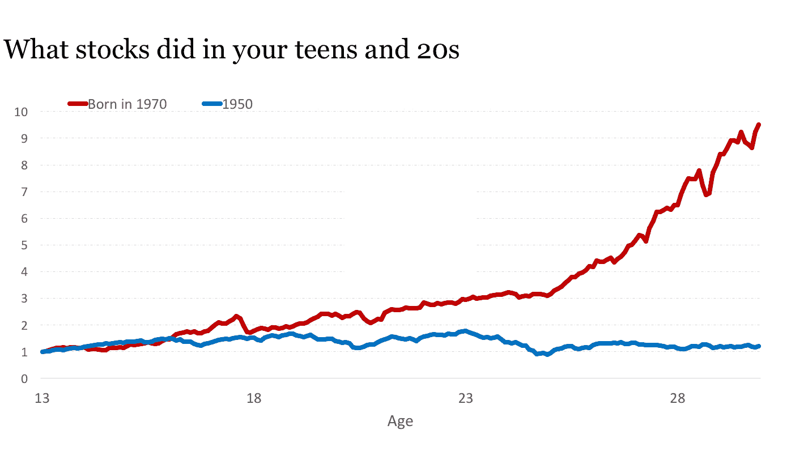
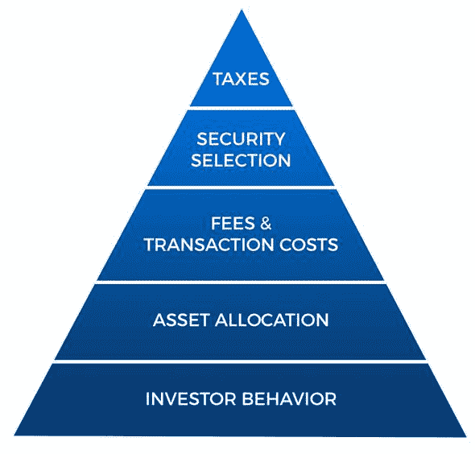
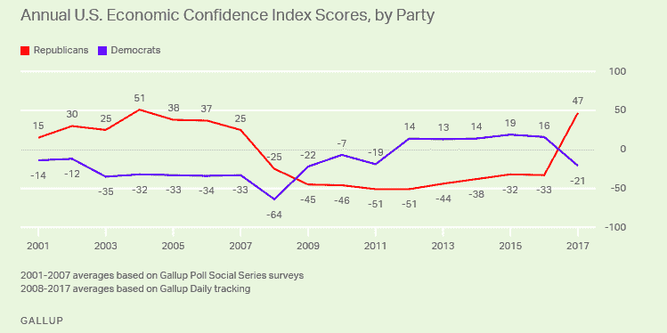

# 集资心理学

> 原文：<http://www.collaborativefund.com/blog/the-psychology-of-money/?utm_source=wanqu.co&utm_campaign=Wanqu+Daily&utm_medium=website>

让我来告诉你两个投资者的故事，他们彼此都不认识，但他们的经历以一种有趣的方式交叉在一起。

格蕾丝·格罗纳 12 岁时成了孤儿。她从未结婚。她没有孩子。她从未开过车。她一生中的大部分时间都独自住在一间只有一间卧室的房子里，整个职业生涯都在做秘书。据大家所说，她是一位可爱的女士。但她过着卑微而平静的生活。这让她在 2010 年 100 岁高龄去世后留给慈善机构的 700 万美元变得更加扑朔迷离。认识她的人问:格蕾丝从哪里弄来那么多钱？

但是没有秘密。没有遗产。格雷斯从微薄的薪水中拿出微薄的积蓄，在股票市场上享受了 80 年不干涉的复利。就这样。

格蕾丝去世几周后，一则不相关的投资新闻登上了新闻。

美林(Merrill Lynch)拉丁美洲部门的前副主席理查德·弗斯科尼(Richard Fuscone)宣布个人破产，击退了对两套房屋的止赎权，其中一套房屋面积近 2 万平方英尺，每月抵押贷款 6.6 万美元。弗斯科尼是格雷斯·格罗纳的对立面；他在哈佛和芝加哥大学接受教育，在投资行业非常成功，以至于他在 40 多岁时退休，去“追求个人和慈善利益”但是大量的借贷和缺乏流动性的投资毁了他。就在格雷斯·戈纳(Grace Goner)将一笔名副其实的财富留给慈善机构的同一年，理查德站在一名破产法官面前宣布:“我被金融危机摧毁了……流动性的唯一来源是我妻子能够出售的任何个人家具。”

这些故事的目的不是说你应该像格雷斯一样，避免像理查德一样。这是要指出，没有任何其他领域的这些故事是可能的。

在哪个领域，没有学历、没有相关经验、没有资源、没有关系的人会远远胜过拥有最好学历、最相关经验、最好资源和最好关系的人？永远不会有格雷斯·格罗纳的心脏手术比哈佛培养的心脏病专家做得更好的故事。或者制造比苹果工程师更快的芯片。不可思议。

但这些故事发生在投资领域。

那是因为投资不是研究金融。这是一项关于人们如何对待金钱的研究。行为很难教，即使是对真正聪明的人。你不能用要记住的公式或要遵循的电子表格模型来总结行为。行为是与生俱来的，因人而异，难以衡量，随时间而变化，人们容易否认它的存在，尤其是在描述自己的时候。

格雷斯和理查德表明，理财不一定是你知道什么；这是你的行为方式。但这并不是金融学通常被教授或讨论的方式。金融业对该做什么说得太多，而对你尝试去做时脑子里会发生什么却说得不够。

这份报告描述了 20 个缺陷、偏见和不良行为的原因，这些都是我在人们处理金钱时经常看到的。

* * *

**1。应得的成功和应得的失败谬误:低估运气和风险作用的倾向，以及未能认识到运气和风险是同一枚硬币的不同面。**

我喜欢问别人:“关于投资，你想知道哪些我们不能知道的事情？”

这不是一个实际问题。所以很少有人问。但它迫使你问的任何人思考他们直觉认为是真实的，但不要花太多时间试图回答，因为这是徒劳的。

几年前，我问过经济学家罗伯特·希勒这个问题。他回答说，“运气在成功结果中的确切作用。”

我喜欢这一点，因为没有人认为运气在财务成功中不起作用。但是由于很难量化运气，暗示人们的成功归功于运气也是不礼貌的，默认的立场往往是含蓄地忽略运气这一因素。如果我说，“世界上有十亿投资者。纯粹出于偶然，你能指望他们中的 100 人成为亿万富翁，主要是因为运气吗？”你会回答，“当然。”但如果我让你当面说出这些投资者的名字，你会退缩。这就是问题所在。

失败也是如此。失败的企业努力不够吗？糟糕的投资是否考虑得不够周全？任性的职业是懒惰的产物吗？

在某些地方，是的。当然了。但是有多少呢？太难知道了。当很难知道的时候，我们默认到极端，假设失败主要是由错误引起的。这本身就是一个错误。

人们的生活是他们经历和他们遇到的人的反映，其中很多都是由运气、意外和机遇驱动的。大胆和鲁莽之间的界限比人们想象的要窄，你不能不相信运气而相信风险，因为它们是一枚硬币的两面。它们都是一个简单的想法，有时事情的发生对结果的影响比努力本身更大。

我儿子出生后，我给他写了一封信:

> 有些人出生在鼓励教育的家庭；其他人反对。有些人出生在鼓励创业的繁荣经济中；其他人出生在战争和贫困中。我希望你成功，我希望你能赢得成功。但是要认识到，不是所有的成功都是因为努力，也不是所有的贫穷都是因为懒惰。在评判他人，包括你自己的时候，记住这一点。

**2。成本回避综合症:未能识别一种情况的真实成本，过分强调财务成本，而忽视了为赢得奖励必须付出的情感代价。**

假设你想要一辆新车。它值三万美元。你有几个选择:1)支付 30，000 美元。2)花不到 3 万美元买一台二手的。3)或者偷。

在这种情况下，99%的人会避免第三种选择，因为偷车的后果大于好处。*这个很明显*。

但假设你希望在未来 50 年内获得 10%的年回报率。这个奖励是免费的吗？当然不是。为什么这个世界会免费给你神奇的东西？就像汽车一样，这是要付出代价的。

在这种情况下，价格就是波动性和不确定性。就像汽车一样，你有几个选择:你可以付钱，接受波动性和不确定性。你可以找到一种不确定性更小、回报更低的资产，相当于一辆二手车。或者你可以尝试类似于《侠盗猎车手》(grand theft auto)的游戏:在获得回报的同时，努力避免随之而来的波动。

这种情况下很多人会选择第三个选项。就像偷车贼一样——尽管用心良苦，遵纪守法——他们形成了一些诡计和策略，在不付出代价的情况下获得回报。交易。旋转。树篱。套利。杠杆作用。

但是财神们并不看重那些不付出代价就寻求回报的人。有些偷车贼会逍遥法外。更多的人会被当场抓获。钱也是一样。

这一点在汽车上很明显，在投资上就不那么明显了，因为投资的真正成本——或任何与钱有关的东西——很少是容易看到和衡量的财务费用。非常有效的是市场所要求的情感和实物价格。怪物饮料股票从 1995 年到 2016 年上涨了 211，000%。但在那段时间里，它在五个不同的场合损失了超过一半的价值。这是一个巨大的心理代价。巴菲特赚了 900 亿美元。但他做到了，70 年来每天 12 个小时阅读 SEC 文件，常常以牺牲对家庭的关注为代价。这里也有一个隐藏的成本。

每一个金钱奖励都有一个超出你所能看到和计算的财务费用的价格。接受这一点至关重要。斯科特·亚当斯曾写道:“我听过的最好的建议之一是这样的:如果你想成功，就要知道代价，然后付出代价。这听起来微不足道，显而易见，但如果你解开这个想法，它会有非凡的力量。”绝妙的理财建议。

**3。汽车悖论中的有钱人**。

当你看到有人开着一辆好车时，你很少会想:“哇，开那辆车的家伙太酷了。”相反，你会想，“哇，如果我有那辆车，人们会认为我很酷。”不管是不是潜意识，人就是这么想的。

财富的悖论在于，人们往往希望它向他人发出信号，表明他们应该受到喜爱和钦佩。但事实上，那些人绕过崇拜你，不是因为他们不认为财富是令人钦佩的，而是因为他们把你的财富仅仅作为自己渴望被喜欢和崇拜的基准。

这东西并不微妙。它在每个收入和财富层次都很普遍。人们在停机坪上租用私人飞机 10 分钟，在飞机里自拍以上传 Instagram，这种业务正在发展。自拍的人认为他们会被喜爱，却没有意识到他们可能并不关心真正拥有这架飞机的人*除了他们提供了一架飞机供拍照之外。*

当然，重点不是放弃对财富的追求。甚至是豪华车——我都喜欢。人们普遍渴望得到他人的尊重，谦逊、优雅、智慧和同情心比开快车更能赢得尊重。

**4。一种适应当前环境的倾向，这种倾向使预测你未来的愿望和行动变得困难，导致无法从当前的决定中获得长期的复合回报。**

每个五岁的男孩长大后都想开拖拉机。然后你长大了，意识到开拖拉机可能不是最好的职业。所以十几岁的时候，你梦想成为一名律师。然后你意识到律师工作太辛苦，很少见到家人。于是你就成了全职妈妈。然后在 70 岁的时候，你意识到你应该为退休存更多的钱。

*物是人非*。当你对未来想要什么的看法很容易改变时，你很难做出长期的决定。

这又回到了复利的第一条规则:不要不必要的打断它。但是，当你的生活计划改变时，你如何不中断金钱计划——职业、投资、支出、预算等等？很难。像格雷斯·格罗纳和沃伦·巴菲特这样的人如此成功的部分原因是因为他们连续几十年都在做同样的事情，让复利变得疯狂。但是我们中的许多人在一生中经历了如此多的进化，以至于我们不想连续几十年都做同样的事情。或者任何类似的东西。因此，我们的钱可能有四个不同的 20 年周期，而不是 80 多岁的寿命。在这种情况下，复利就不那么管用了。

这是无解的。但我学到的一件事可能会有所帮助，那就是回到平衡和犯错的空间。太专注于一个目标，一条道路，一个结果，是在自找遗憾，当你如此容易改变的时候。

**5。锚定于你自己的历史偏见:你的个人经历可能只占世界上发生的事情的 0.00000001%，但可能占你认为世界如何运转的 80%。**

如果你出生于 1970 年，那么在你十多岁和二十多岁的时候，经通胀因素调整后，股市上涨了 10 倍——这是你容易受影响的年轻时期，那时你正在学习投资和经济如何运转的基本知识。如果你出生于 1950 年，同样的市场在你十几岁和二十多岁时完全不存在:

有太多的方法可以切割这个想法。在密歇根州弗林特长大的人对制造业工作的重要性有着与在华盛顿特区长大的人截然不同的看法。在大萧条时期或在饱受战争蹂躏的 20 世纪 40 年代的欧洲长大，会让你走上一条信仰、目标和优先事项的道路，这是大多数阅读本文的人，包括我自己，都无法理解的。

大萧条让一代人害怕了一辈子。至少大部分是这样。1959 年，一名记者问约翰·肯尼迪，他对大萧条还记得什么，他回答说:

> 我没有关于大萧条的第一手资料。我的家庭拥有世界上最大的财富之一，它比以往任何时候都值钱。我们有更大的房子，更多的仆人，我们旅行更多。我直接看到的唯一一件事是，我父亲雇佣了一些额外的园丁，只是为了给他们一份工作，让他们能够吃饭。我真的是在哈佛读到大萧条时才知道的。

由于再多的研究或开放的思想也无法真正重现恐惧和不确定性的力量，人们在生活中对经济如何运作、它能做什么、我们应该在多大程度上保护其他人以及什么应该和不应该受到重视有着完全不同的看法。

问题是，每个人都需要一个清晰的解释，这个世界是如何运转的，以保持他们的理智。如果你早上醒来说，“我不知道为什么大多数人都是这样想的”，这很难让人乐观，因为人们喜欢可预测性和清晰的叙述。因此，他们用自己的生活经验来创造他们认为世界应该如何运转的模型——特别是运气、风险、努力和价值观。

这是个问题。当每个人都经历了外面的一小部分，但用这些经历来解释他们预期会发生的一切时，很多人最终会对别人的决定感到失望、困惑或目瞪口呆。

一个经济学家团队曾分析了一个世纪以来人们投资习惯的数据，并得出结论:“当前的(投资)信念取决于过去经历的实现。”

在讨论人们的投资观点时，请记住这句话。或者当你对他们囤积或挥霍金钱的欲望、他们在某些情况下的恐惧或贪婪感到困惑时，或者当你无法理解人们为什么用钱做这些事情时。事情会变得更有意义。

**6。历史学家是先知的谬论:没有看到讽刺的是，历史是对惊喜和变化的研究，同时将其作为未来的指南。在一个创新和变革是进步的生命线的领域，过度依赖过去的数据作为未来状况的信号。**

地质学家可以查看十亿年的历史数据，并形成地球行为的模型。气象学家也可以。还有医生——肾脏在 2018 年的运作方式和 1018 年一样。

过去为未来提供了具体方向的想法很诱人。它宣扬了这样一种观点，即未来的道路隐藏在数据之中。历史学家——或任何分析过去以预测未来的人——是许多领域中最重要的成员。

我不认为金融是其中之一。至少没有我们想的那么多。

经济学的基石是事物随着时间而变化，因为看不见的手讨厌任何事物无限期地保持太好或太坏。比尔·邦纳曾经描述过市场先生的工作方式:“他穿着一件‘资本主义在工作’的 t 恤，手里拿着一把大锤。”很少有事物能保持长久不变，这使得历史学家远不如先知有用。

考虑几个大的。

401(K)已经 39 岁了——勉强够资格竞选总统。罗斯爱尔兰共和军还没到喝酒的年龄。因此，关于美国人如何为退休储蓄的个人理财建议和分析，与仅仅一代人之前有意义的东西没有直接可比性。事情变了。

25 年前，风险投资行业几乎不存在。如今，单只基金的规模已经超过了一代人之前的整个行业。菲尔·奈特写道，他在创立耐克公司后的早期:“没有风险投资这回事。一个有抱负的年轻企业家很少有地方可去，而这些地方都由缺乏想象力的规避风险的看门人把守。换句话说，就是银行家。”因此，我们对支持企业家、投资周期和失败率的了解，并不是我们有深厚的历史基础可以借鉴的。事情变了。

或者以公共市场为例。在 1976 年之前，标准普尔 500 指数不包括金融类股；如今，金融类股占该指数的 16%。50 年前，科技股几乎不存在。如今，它们占该指数的比重超过了五分之一。随着时间的推移，会计规则也发生了变化。信息披露、审计和市场流动性也是如此。事情变了。

任何与金钱相关的事物最重要的驱动力是人们告诉自己的故事以及他们对商品和服务的偏好。这些东西不会静止不动。它们随着文化和世代而改变。它们会不断变化。

当涉及到钱的时候，我们在这里对自己玩的心理把戏是对那些经历过这种事情的人的过度崇拜。经历具体事件并不一定让你有资格知道接下来会发生什么。事实上，这很少发生，因为经验比预言能力更容易导致过度自信。

这并不意味着我们在考虑钱的时候应该忽略历史。但是有一个重要的细微差别:你看的历史越久远，你的收获就应该越普遍。人们与贪婪和恐惧的关系，他们在压力下的表现，以及他们对激励的反应等一般事情在时间上往往是稳定的。货币的历史对这类东西很有用。但是，特定的趋势、特定的交易、特定的部门和特定的因果关系总是在不断演变。

**7。在一个乐观主义是最合理立场的世界里，悲观主义的诱惑。**

历史学家迪尔德丽·麦克洛斯基说，“出于我一直不明白的原因，人们喜欢听到这个世界正在走向地狱。”

这并不新鲜。约翰·斯图亚特·穆勒在 19 世纪 40 年代写道:“我注意到，不是那些在别人绝望时希望的人，而是那些在别人希望时绝望的人，被一大群人推崇为圣人。”

部分原因是自然的。我们已经进化到把威胁看得比机遇更紧迫。巴菲特说，“为了成功，你必须先生存下来。”

但是对金钱的悲观主义有着不同程度的吸引力。如果说经济将会衰退，你会得到转发。说我们会有一场大衰退，报纸会打电话给你。说我们正接近下一次大萧条，你会上电视。但提到好日子就在前面，或者市场有运行空间，或者一家公司有巨大的潜力，评论员和观众的共同反应是，你要么是一名推销员，要么是滑稽地回避风险。

这里发生了一些事情。

一个是钱无处不在，所以一些不好的事情往往会影响到每个人，尽管以不同的方式。比方说，天气就不是这样。席卷佛罗里达的飓风不会对 92%的美国人造成直接威胁。但是经济衰退可能会影响到每一个人——包括你，所以要注意。股票市场也是如此:超过一半的 T2 家庭直接持有 T3 股票。

另一个是悲观主义需要行动——行动！滚出去！快跑！卖！躲起来。乐观主要是呼吁坚持到底，享受过程。所以没那么紧急。

第三，金融业利润丰厚，尽管存在监管，但还是吸引了大批骗子、叫卖小贩和向月亮许愿的歪曲事实者。足够大的奖金甚至可以让诚实、守法的销售垃圾产品的金融工作者相信，他们是在为客户做好事。足够多的人被金融业迷惑了，以至于一种“如果听起来好得不像真的，那很可能是真的”的感觉甚至笼罩了乐观主义的理性宣传。

顺便说一下，大多数乐观主义的宣传都是理性的。当然不是全部。但是我们需要理解什么是乐观。真正的乐观主义者不相信一切都会很棒。那是自满。乐观是一种信念，相信随着时间的推移，好的结果的可能性对你有利，即使沿途会有挫折。大多数人早上醒来试图让事情变得更好、更有成效，而不是醒来寻找麻烦，这个简单的想法是乐观主义的基础。并不复杂。也不保证。对大多数人来说只是最合理的赌注。已故统计学家汉斯·罗斯林有不同的说法:“我不是一个乐观主义者。我是一个非常认真的可能性主义者。”

**8。低估复利的力量，倾向于直觉地认为指数增长是线性的。**

IBM 在 20 世纪 50 年代制造了 3.5 兆字节的硬盘。到了 20 世纪 60 年代，东西已经发展到了几十兆字节。到 20 世纪 70 年代，IBM 的 Winchester drive 拥有 70 兆字节。然后，随着存储容量的增加，驱动器的尺寸成倍缩小。20 世纪 90 年代初，一台典型的个人电脑有 200-500 兆字节。

然后… *重击*。东西爆炸了。

1999 年——苹果的 iMac 配备了 6gb 的硬盘。

2003–Power Mac 上的 120 gigs。

2006 年–新款 iMac 的 250 场演出。

2011 年–首款 4tb 硬盘。

2017–60tb 硬盘。

现在把它放在一起。从 1950 年到 1990 年，我们增加了 296 兆字节。从 1990 年到今天，我们增加了 6000 万兆字节。

复利的笑点从来不是它只是大。无论你学习多少次，它总是如此之大，以至于你几乎无法用脑袋去理解它。2004 年，比尔·盖茨批评了新的 Gmail，想知道为什么会有人需要 1g 的存储空间。作家史蒂文·利维写道，“尽管他对尖端技术很感兴趣，但他的心态却停留在旧的范式上，即存储是一种必须保护的商品。”你永远不会习惯事物发展的速度。

我听到许多人说，他们第一次看到复利表——或者是那些关于如果你在 20 多岁和 30 多岁开始储蓄，你会有多少退休金的故事——改变了他们的生活。但很可能没有。它很可能会让他们大吃一惊，因为直觉上结果似乎不对。线性思维比指数思维更直观。迈克尔·巴特尼克曾经解释过。如果我让你在脑子里算 8+8+8+8+8+8+8+8+8，你几秒钟就能算出来(是 72)。如果我让你算 8×8×8×8×8×8×8×8，你脑袋会爆炸(是 134，217，728)。

这里的危险是，当复合不直观时，我们经常忽略它的潜力，而专注于通过其他方式解决问题。不是因为我们想多了，而是因为我们很少停下来考虑复合潜能。

有 2000 多本书详细分析了沃伦·巴菲特是如何发家致富的。但是没有一个叫做“*的，这个家伙已经持续投资了四分之三个世纪。*”但是[我们知道那是他大部分成功的关键](/blog/the-freakishly-strong-base/)；很难理解这种数学，因为它不直观。有关于经济周期、交易策略和行业押注的书籍。但最有力、最重要的书应该叫《闭嘴等待》。这只是一页经济增长的长期图表。物理学家艾伯特·巴特利特说:“人类最大的缺点是我们无法理解指数函数。”

复利的反直觉是大多数令人失望的交易、糟糕的策略和成功的投资尝试的原因。好的投资不一定是赚取最高的回报，因为最高的回报往往是一次性的，当它们结束时会扼杀你的信心。这是关于赚取你可以长期坚持的相当不错的回报。这就是复利失控的时候。

**9。在一个需要逆向思维来获得高于平均水平的结果的领域，对社会证据的依赖。**

伯克希尔·哈撒韦公司在奥马哈的年会吸引了 4 万人，他们都认为自己是反向投资者。人们在凌晨 4 点出现，与成千上万的其他人一起排队，互相告诉对方他们一生的承诺，不随大流。很少有人看出其中的讽刺。

任何值得花钱的事情都有很高的风险。高风险意味着出错和赔钱的风险。赔钱是情绪化的。避免犯错的愿望最好通过和同意你的人在一起来抵制。社会证明是强大的。别人同意你就像是证明自己是对的，不需要用事实来证明。大多数人的观点都有漏洞和缺口，如果只是下意识的。人群和社会证明有助于填补这些空白，减少对你可能是错的怀疑。

在处理金钱交易时，将人群视为准确性证据的问题在于，机会几乎总是与受欢迎程度成反比。随着时间的推移，真正推动超额回报的是估值倍数的增加，而估值倍数的增加依赖于投资在未来变得更受欢迎——这总是由当前的受欢迎程度决定的。

事情是这样的:大多数逆向思维的尝试只是伪装的非理性犬儒主义——犬儒主义可能会很受欢迎，吸引人群。真正的逆向思维是当你的观点如此令人不舒服和被轻视，以至于让你怀疑它们是否正确。很少有人能做到。但当然是这样的。从定义上来说，大多数人不可能是逆向投资者。双手拥抱，从统计学上来说，你就是那些人中的一员。

10。在一个不是由明确的规则，而是由松散和不可预测的趋势所控制的领域，对学术界的吸引力。

哈里·马科维茨(Harry Markowitz)获得了诺贝尔经济学奖，因为他创造了一个公式，告诉你根据你的理想风险水平，你的投资组合中应该有多少股票和债券。几年前,《华尔街日报》问他，鉴于他的工作，他如何投资自己的钱。他回答道:

> 我想象如果股市大幅上涨，而我没有参与其中，或者股市大幅下跌，而我却完全参与其中，我会有多悲伤。我的意图是尽量减少我未来的遗憾。因此，我把我的捐款对半分在债券和股票上。

学术金融中有许多东西在技术上是正确的，但未能描述人们在现实世界中的实际行为。大量的学术金融工作是有用的，并已将该行业推向了正确的方向。但它的主要目的往往是智力刺激和给其他学者留下深刻印象。我不会因此而责怪他们，也不会因此而看不起他们。我们应该认清它是什么。

我记得有一项研究表明，年轻投资者应该在股市中使用 2 倍的杠杆，因为——从统计学上来说——即使你被淘汰了，随着时间的推移，你仍然可能获得更高的回报，只要你掸去身上的灰尘，在被淘汰后继续投资。在现实世界中,*没有人会真正做到。他们发誓放弃终身投资。在电子表格上有效的东西和在厨房桌子上有效的东西相距十英里。*

这里的脱节之处在于，学术界通常希望非常精确的规则和公式。但是现实世界中的人们把它作为一根拐杖，试图理解一个混乱和令人困惑的世界，这个世界本质上回避精确性。那些是相反的事情。你无法用精确和理性来解释随机性和情感。

人们也被学术头衔和学位所吸引，因为金融不像医学那样是一个证书认可的领域。所以博士的出现引人注目。当提出论点和证明信念时，这对学术界产生了强烈的吸引力——“根据哈佛的这项研究……”或“正如诺贝尔奖获得者某某所展示的……”当其他人引用“来自同名公司、打着领带、面带微笑的美国消费者新闻与商业频道的某个人”时，这种吸引力非常大一个严峻的现实是，金融领域最重要的东西永远不会获得诺贝尔奖:谦逊和犯错的空间。

**11。货币的社会效用是以货币增长为直接代价的；财富是你看不到的。**

我以前在酒店停车。这是 2005 年前后洛杉矶房地产资金流动的时候。我以为开法拉利的顾客很有钱。许多人是。但是随着我对其中一些人的了解，我意识到他们并不那么成功。至少不是我想象的那样。许多人都是平庸的成功者，他们把大部分的钱都花在了汽车上。

如果你看到有人开着一辆 20 万美元的车，你所掌握的关于他们财富的唯一数据点是，他们比买车前少了 20 万美元。或者他们租了辆车，但这并不意味着富有。

我们倾向于根据所见来判断财富。我们看不到人们的银行账户或券商对账单。所以我们依靠外表来衡量财务上的成功。汽车。家园。假期。Instagram 照片。

但这是美国，我们珍视的行业之一就是帮助人们造假，直到他们成功。

**财富，其实就是你看不到的。**是未购买的汽车。不是买来的钻石。装修推迟了，衣服被放弃了，头等舱的升级也减少了。它是银行中尚未转化为你所看到的东西的资产。

但这不是我们对财富的看法，因为你不能把你看不见的东西联系起来。

歌手蕾哈娜超支后几乎破产，并起诉她的财务顾问。顾问回答道:“真的有必要告诉她，如果你花钱买东西，你最终会得到东西而不是钱吗？”

你可以笑。但事实是，是的，人们需要被告知这一点。当大多数人说他们想成为百万富翁时，他们真正的意思是“我想花一百万美元”，这与成为百万富翁正好相反。年轻人更是如此。

财富的一个重要用途是用它来控制你的时间，并为你提供选择。资产负债表上的金融资产提供了。但这是以向人们展示你拥有多少物质财富为直接代价的。

**12。在一个领域中行动的趋势，复合的第一规则是永远不要不必要的中断它。**

如果你的水槽坏了，你拿一把扳手修好它。如果你的胳膊断了，你就打上石膏。

当你的财务计划失败时，你会怎么做？

第一个问题——这也适用于个人理财、商业理财和投资计划——是*你怎么知道它什么时候坏了*？

很明显水槽坏了。但是一个失败的投资计划是可以解释的。也许只是暂时失宠？也许你正在经历正常的波动？也许你这个季度有一堆一次性支出，但你的储蓄率仍然足够？很难知道。

当很难区分破产和暂时失宠时，人们倾向于默认前者，并立即采取行动。你开始摆弄旋钮来寻找解决办法。这似乎是一件负责任的事情，因为当你生活中的其他一切都被打破时，正确的行动是去修复它。

有些时候，资金计划需要修正。哦，有没有过。但也没有不受波动影响的长期资金计划。偶尔的剧变通常是标准计划的一部分。

当波动性是有保证的和正常的，但经常被视为需要解决的事情时，人们采取的行动最终只会中断一个好计划的执行。“什么都不要做”是金融领域最有力的话语。但是个人很难接受，专业人士也很难收费。所以，我们拉小提琴。太多了。

13。低估了犯错空间的必要性，不仅是财务上的，还有精神上和身体上的。

本·格雷厄姆曾经说过，“安全边际的目的是使预测变得不必要。”

这句话充满了智慧。但是最常见的反应，即使是下意识的，是，“谢谢你，本。但我擅长预测。”

人们低估了在几乎所有涉及金钱的事情上犯错的空间。造成这种情况的原因有两个:一个是你认为自己对未来的看法是正确的，这是由承认相反的观点所带来的不舒服的感觉所驱使的。第二个是，你没有采取行动利用你对未来成真的看法，因此对自己造成了经济伤害。

但是错误的空间被低估和误解了。它通常被视为一种保守的对冲，被那些不想冒太大风险或对自己的观点不自信的人所使用。但如果使用得当，情况正好相反。犯错的空间让你忍耐，忍耐让你坚持足够长的时间，让受益于低概率结果的几率对你有利。最大的收益很少发生，要么是因为它们不常发生，要么是因为它们需要时间来复利。因此，在策略的一部分有足够的犯错空间，让他们在策略的另一部分忍受痛苦的人，比那些在犯错时被消灭、游戏结束、插入更多代币的人更有优势。

犯错的空间也有多个方面。你能承受资产缩水 30%吗？从电子表格上看，也许是的——就实际支付账单和保持正现金流而言。但是精神上呢？人们很容易低估 30%的下跌对你心理的影响。你的自信可能会在机会最大的时候被击垮。你或你的配偶可能会决定是时候开始新的计划或新的职业生涯了。我认识几个投资者，他们在亏损后退出，因为他们筋疲力尽了。体力不支。电子表格可以模拟大幅下跌的历史频率。但是他们不能模拟回家的感觉，看着你的孩子，想知道你是否犯了一个会影响他们生活的巨大错误。

**14。受其他人行为影响的趋势，这些人玩的金融游戏与你不同。**

思科股票在 1999 年上涨了三倍。为什么？可能不是因为人们真的认为这家公司价值 6000 亿美元。伯顿·马尔基尔曾指出，思科的估值隐含增长率意味着它将在 20 年内超过整个美国经济。

它的股价在上涨，因为短线交易者认为它会继续上涨。在很长一段时间里，他们是对的。这就是他们在玩的游戏——“这只股票的交易价格是 60 美元，我认为明天之前它会值 65 美元。”

但如果你是 1999 年的长期投资者，60 美元是唯一可以买入的价格。所以你可能环顾四周，对自己说:“哇，也许别人知道一些我不知道的事情。”你也同意了。你甚至觉得自己很聪明。但是交易者停止了他们的游戏，你和你的游戏被消灭了。

你没有意识到的是，移动边际价格的交易者在玩一个和你完全不同的游戏。如果你开始从玩不同游戏的人那里得到暗示，你一定会被愚弄，最终迷失，因为不同的游戏有不同的规则和不同的目标。

很少有什么比了解自己的时间范围和不被玩不同游戏的人的行动和行为所说服更重要的了。

这不仅仅是投资。你如何储蓄，如何消费，你的商业策略是什么，你如何看待金钱，你何时退休，以及你如何看待风险，这些都可能受到与你玩不同游戏的人的行动和行为的影响。

个人理财是非常个人化的，最难的部分之一是向他人学习，同时意识到他们的目标和行动可能与你自己的生活相去甚远。

15。由于金钱是情绪化的，情绪会被争论、极端观点、闪光和对你的幸福的威胁所激发，所以对金融娱乐产生依恋。

如果普通美国人的血压上升了 3%，我猜想一些报纸会在第 16 页报道，什么都不会改变，我们会继续前进。但是，如果股市下跌 3%，嗯，没有必要猜测我们可能会如何应对。[这是 2015 年](https://www.cnbc.com/2015/08/24/white-house-obama-briefed-on-markets-turmoil-mindful-of-potential-self-inflicted-wounds.html):“总统[巴拉克·欧巴马](https://www.cnbc.com/barack-obama/)已经听取了周一全球市场波动的简报。”

为什么看似不重要的财经新闻会压倒客观上更重要的新闻？

因为金融在某种程度上具有娱乐性，而其他事物——牙齿矫正、园艺、海洋生物——则没有。金钱有竞争、规则、冷门、胜利、失败、英雄、恶棍、团队和粉丝，这使得它非常接近体育赛事。但这甚至是一种上瘾，因为金钱就像一场体育赛事，你既是球迷又是运动员，结果会直接影响你的情绪。

这很危险。

我发现，在做金钱决定时，不断提醒自己投资的目的是最大化回报，而不是最小化无聊，这很有帮助。无聊完全没问题。*无聊就好*。如果你想把这作为一种策略，提醒自己:机会存在于其他人不存在的地方，其他人倾向于远离无聊的东西。

16。冒险中的乐观偏见，或“俄罗斯轮盘赌应该统计工作”综合症:当不利因素在任何情况下都不可接受时，对有利因素的过度依赖。

纳西姆·塔勒布说，“你可以喜欢冒险，但又完全不愿意破产。”

这个想法是，你必须冒险才能获得成功，但是任何可能让你一败涂地的风险都不值得冒。玩俄罗斯轮盘赌时，胜算对你有利。但负面影响永远抵不上潜在的正面影响。

某些事情的几率可能对你有利——房地产价格在大多数年份都会上涨，而且大多数年份你每隔一周就会拿到一份薪水——但如果某件事情有 95%的几率是对的，那么 5%的几率是错的，这意味着你几乎肯定会在人生的某个时刻经历负面影响。如果下跌的代价是破产，那么其余 95%的时间里上涨的代价可能不值得去冒险，不管它看起来有多吸引人。

杠杆是这里的魔鬼。它将常规风险推向了可能导致毁灭的境地。危险在于，多数时候理性乐观掩盖了破产的可能性，让我们系统性地低估了风险。过去十年，房价下跌了 30%。一些公司拖欠债务。这就是资本主义——它会发生。但那些有杠杆的人遭遇了双重失败:他们不仅破产了，而且在机会成熟的那一刻，被淘汰的机会也消失了。2009 年破产的房主在 2010 年没有机会利用廉价的抵押贷款利率。2009 年，雷曼兄弟没有机会投资廉价债务。

我自己的钱被烧烤了。我一方面承担风险，另一方面是一只惊恐的海龟。这并不矛盾，但是金钱的心理会让你相信这是矛盾的。我只想确保我能坚持足够长的时间，让我的风险得到回报。还是那句话，你必须生存才能成功。

这里的一个关键点是，货币中很少有东西像期权一样有价值。想做什么就做什么，想什么时候做，想跟谁做，为什么要做，这种能力有无限的 ROI。

**17。偏爱某个领域的技能，如果没有正确的行为与之匹配，技能并不重要。**

这就是格蕾丝和理查德回来的原因。投资者的需求是分层次的，这里的每一个主题都必须在它上面的那个主题之前掌握:

理查德在这个金字塔的顶端非常熟练，但他在底部的积木上失败了，所以这些都不重要。格雷斯很好地掌握了底部积木，以至于顶部积木几乎没有必要。

18。否认你认为的世界应该如何运作与世界实际如何运作之间的不一致，尽管涉及金钱的一切都有内在的复杂性，但这种不一致是由形成清晰的因果叙述的愿望所驱动的。

有人曾形容唐纳德·特朗普“无法区分已经发生的事情和他认为应该发生的事情。”撇开政治不谈，我认为每个人都这样做。

这包括三个部分:

*   你看到世界上很多信息。

*   你不可能全部处理完。所以你要过滤。

*   你只过滤符合你认为世界应该如何运转的信息。

由于每个人都想用干净的叙述来解释他们看到的东西和世界是如何运作的，我们认为应该发生的事情和实际发生的事情之间的不一致被掩盖了。

一个例子。更高的税收应该会减缓经济增长——这是一个常识性的说法。但是税率和增长率之间的相关性很难发现。因此，如果你坚持税收和增长之间的叙述，你会说数据一定有问题。你可能是对的！但如果你碰到其他人撇开数据来支持他们的叙述——比如说，主张对冲基金必须产生阿尔法，否则没人会投资它们——你就会发现你认为的偏见。还有一千个其他的例子。*每个人都只相信他们想相信的东西，即使证据显示其他东西*。统计上的故事。

接受一切涉及金钱的事情都是由不合逻辑的情绪驱动的，并且有比任何人都能理解的更多的活动部分，这是记住历史是对人们认为不会或不可能发生的事情进行研究的良好开端。对于金钱来说尤其如此。

**19。政治信仰驱动着金融决策，受经济的影响，经济是政治的不良表亲。**

我曾经参加过一个会议，会上一位著名的投资者在开始他的演讲时说，“你知道奥巴马总统什么时候说过要抓住枪和圣经不放吗？这就是我，伙计们。今天我将告诉你们他的鲁莽政策是如何影响经济的。”

我不管你的政治观点是什么，你不可能用那种想法做出理性的投资决定。

但这很常见。看看这张图上 2016 年发生了什么。GDP 增长率、就业增长率、股市增长率、利率——在列表中往下排——没有实质性的变化。只有总统做到了:

几年前，我发表了总统的一系列经济表现数据。这让人们抓狂，因为这些数据往往与他们基于政治信仰的想法不符。不久后，一名记者请我对一篇详细描述民主党如何在统计上比共和党更强势的报道发表评论。我说你不能提出这样的论点，因为样本量太小了。但他一推再推，写出了一篇篇让读者或欢呼或流汗的文章，这取决于他们的信仰。

关键不是政治不影响经济。但这是一个如此敏感的话题的原因是，这些数据经常让人们大吃一惊，这本身就是一个认识到政治和经济之间的相关性并不像你想的那样清晰的理由。

20。三个月的泡沫:将最近的过去外推至不久的将来，然后高估你预期在不久的将来会发生的任何事情对你未来的影响程度。

911 后一个月的新闻标题很有意思。很少有人认为这次袭击是一次性的；下一次大规模恐怖袭击肯定就在眼前。“另一场灾难性的恐怖袭击是不可避免的，只是时间问题，”一位国防分析家在 2002 年说。另一个标题写道:“一名高级反恐官员表示，这是‘何时的问题，而不是是否的问题’。除了预期另一次袭击即将来临之外，还有一种信念，认为它会以同样的方式影响人们。《今日秀》节目播出了一个片段，向上班族推销降落伞，让他们放在办公桌下，以防需要从摩天大楼上跳下来。

相信刚刚发生的事情会一直发生在心理学中。我们喜欢模式，记忆力差。额外的感觉是，刚刚发生的事情会以同样的方式影响你，这是一个分支。当你和钱打交道时，这可能是一种折磨。

每一次重大的金融输赢都伴随着大众对更多输赢的预期。随之而来的是对这些事件重复发生的影响的痴迷，这可能与你的长期目标完全脱节。例证:2008 年股市下跌 40%之后，多年来一直没有间断，有人预测股市将再次暴跌。期待刚刚发生的事情很快再次发生是一回事，这本身就是一个错误。但是，没有意识到你的长期投资目标可以保持完整，不受伤害，即使我们有另一个大的暴跌，是最近偏差的危险副产品。“市场往往会随着时间的推移而恢复并创造新高”并不是金融危机中一个受欢迎的观点；“市场可能崩盘，崩盘很糟糕”，尽管前者比后者实际得多。

大多数时候，发生的大事不会增加它再次发生的几率。恰恰相反，均值回归是一个无情的金融法则。但是，即使事情再次发生，*大多数时候*它不会——或者不应该——以你想的方式影响你的行动，因为大多数推断是短期的，而大多数目标是长期的。旨在承受变化的稳定策略几乎总是优于试图防止刚刚发生的事情再次发生的策略。

* * *

如果有一个共同点的话，那就是对谦逊、适应性、长远眼光的偏好，以及对任何涉及金钱的流行的怀疑。可以总结为:做好逆来顺受的准备。

吉杜·克里希那穆提花了几年时间做精神演讲。随着年龄的增长，他变得更加坦率。在一次著名的演讲中，他问听众是否想知道他的秘密。

他低声说，“你看，我不介意发生什么。”

这可能是应对金钱心理的最佳技巧。

