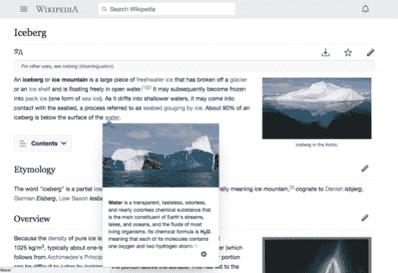
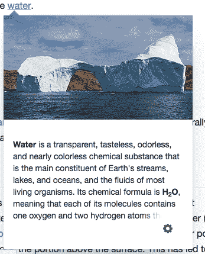
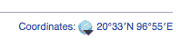
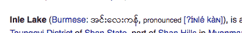
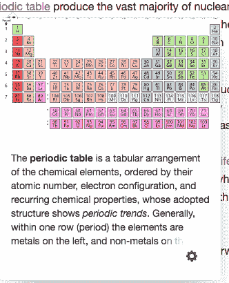

# 为什么花了很长时间才在维基百科上建立了这个小小的链接预览

> 原文：<https://blog.wikimedia.org/2018/04/20/why-it-took-a-long-time-to-build-that-tiny-link-preview-on-wikipedia/?utm_source=wanqu.co&utm_campaign=Wanqu+Daily&utm_medium=website>

当你悬停在一个链接上时，预览卡会显示出来。文字来自维基百科关于[冰山](https://en.wikipedia.org/wiki/Iceberg)和[水](https://en.wikipedia.org/wiki/Water)、 [CC BY-SA 3.0](https://creativecommons.org/licenses/by-sa/3.0/deed.en) 的文章。图片从左到右，从上到下: [#1](https://commons.wikimedia.org/wiki/File:Iceberg_with_hole_near_Sandersons_Hope_2007-07-28_2.jpg) 金汉森，[CC BY-SA 3.0](https://creativecommons.org/licenses/by-sa/3.0/deed.en)； [#2](https://commons.wikimedia.org/wiki/File:Iceberg_in_the_Arctic_with_its_underside_exposed.jpg) 由 Andreas Weith，[CC BY-SA 4.0](https://creativecommons.org/licenses/by-sa/4.0/deed.en)； [#3](https://commons.wikimedia.org/wiki/File:Grotto_in_an_iceberg.jpg) 经由新西兰国家图书馆 [CC0](https://creativecommons.org/publicdomain/zero/1.0/deed.en) 。

[几天前，我的团队完成了](https://medium.com/freely-sharing-the-sum-of-all-knowledge/wikipedia-page-previews-738cddac7a21)[页面预览】](https://www.mediawiki.org/wiki/Page_Previews)的上线——这一功能现已部署到维基百科的数百个语言版本中。我们看到每分钟有多达 50 万次点击我们的 API 来服务那些当你悬停在任何链接上时显示的卡片。表面上看起来很简单。这是许多网站已经有的东西。它有一个图像和一些文本，当你悬停在一个链接上时会显示出来。几乎没有突破性的东西…或者看起来是这样。最初的想法是四年前构思的，基于多年前一位志愿者/编辑的想法。因此，我们花了几年时间让每个人都知道这一点。这可能看起来很奇怪，但就像冰山一样，一旦你开始观察它的下面，一切都有了意义。

#### 我们必须选择一个缩略图

我们有几百万页，都以原始维基文本的形式存储。我们不能期望每一篇被编辑的文章都指定一个缩略图。
早在 2012 年，Max Semenik，我们[社区技术团队](https://www.mediawiki.org/wiki/Community_Tech)的一名软件工程师，构建了[一个扩展](https://www.mediawiki.org/wiki/Extension:PageImages)，它将通过算法为一篇文章计算出最合适的图片。
和所有算法一样，它并不完美，因为它不是为页面预览的用例设计的，所以还需要调整。我们不得不进行更新，将图片限制在文章的第一部分。处理算法很难，但对于这个目的来说是必不可少的。

#### 我们必须生成一个摘要

我们有几百万个页面，都存储为原始的维基文本。如何在不要求我们的编辑为每篇文章煞费苦心地做总结的情况下进行总结？
忙碌的 Max Semenik 帮助我们制作缩略图，他也写了[一个扩展来生成文章的摘录](https://www.mediawiki.org/wiki/Extension:TextExtracts)。它最初主要是为[纯文本](https://en.wikipedia.org/wiki/Plain_text)摘要编写的。我们最初版本的页面预览使用了这个，但是我们意识到这不是我们想要做的最好的选择。
所以我们停止使用这个。我们意识到 HTML 非常重要。例如，化学文章中的化学式需要下标，而下标需要 HTML。

<small>*考虑如何需要 HTML 来为下标重要的内容生成摘要，比如水的化学式，如下所示。文字来自英文维基百科关于[水](https://en.wikipedia.org/wiki/Water)、 [CC BY-SA 3.0](https://creativecommons.org/licenses/by-sa/3.0/deed.en) 的文章；[图片](https://commons.wikimedia.org/wiki/File:Iceberg_with_hole_near_Sandersons_Hope_2007-07-28_2.jpg)金汉森， [CC BY-SA 3.0](https://creativecommons.org/licenses/by-sa/3.0/deed.en) 。*T11】</small>

我们的很多文章，都是从位置信息和发音信息开始的。很多这样的内容不属于我们的摘要，对于其他内容，什么属于就不太清楚了。摘要中有很多设计输入，我们确定了哪些内容不应该出现在预览中。我们写了[一个捕获所需行为](https://www.mediawiki.org/wiki/Page_Previews/API_Specification)的规范。

<small>*许多文章开头的位置信息特征证明对概括维基百科文章有问题……*</small>

<small>*……发音信息也是。*T3】</small>

最后，我们决定在最初为我们的原生 Android 和 iOS 应用程序构建的 [API](https://en.m.wikipedia.org/wiki/Application_programming_interface) 之上构建。我们为此专门创建了一个新的 API。
我们现在从整篇文章 HTML 中生成摘要。我们像浏览器一样解析它，并根据规范确定每篇文章的第一个“非空”前导段落。
这里最大的挑战之一是决定去掉括号内的内容。由于我们支持 300 多种语言，这必须本地化(不是每个人都使用相同的字符集！).
不仅如此，当然有些括号也是至关重要的……边缘情况比比皆是。我们必须考虑它们所有的潜在用途，以及如何最好地利用它们。

<small>*有时候括号内的内容很重要，就像这个例子暗示的那样。识别它们何时重要是困难的。文字来自英文维基百科关于[元素周期表](https://en.wikipedia.org/wiki/Periodic_table)、 [CC BY-SA 3.0](https://creativecommons.org/licenses/by-sa/3.0/deed.en) 的文章；[图片](https://commons.wikimedia.org/wiki/File:Simple_Periodic_Table_Chart-en.svg)由 Offnfopt，公有领域。*T9】</small>

从用户生成的 HTML 中剥离括号元素也被证明是相当困难的。虽然在纯文本中这样做需要一个简单的正则表达式，但是当您考虑嵌套的 HTML 时，事情就变得复杂了。重要的是要确保去掉括号内的内容后内容仍然有意义，并且我们没有增加任何安全漏洞。
感谢我们的[基础设施团队](https://www.mediawiki.org/wiki/Wikimedia_Reading_Infrastructure_team)帮助我们构建这个 API。

### 我们和我们的社区一起工作

我们的编辑社区非常关心我们的产品。这就是为什么他们在业余时间为你写文章，不求回报。我们让他们参与到流程的每一个部分，与他们一起不懈地解决每一个边缘案例(无论是破碎的摘要还是不合适的图片),并向他们保证我们知道我们在做什么，我们为什么要做以及我们为什么要继续做的影响。
我们最初的版本不够好。我们的社区要求我们[不要继续进行](https://en.wikipedia.org/wiki/Wikipedia:Village_pump_%28proposals%29/Archive_131#Proposal:_Enable_Hovercards_by_default)。我们通过听取他们的意见并使之变得更好来回答。
感谢帮助促成这些对话的社区和我们的社区联络员！

### 设计设计设计

我们做了很多。我们的设计师 Nirzar 写了一篇很棒的文章，所以我就不在这里分享了，但是设计贯穿于整个过程的每一步，不管是最初的原型(感谢 [Prateek Saxena](https://wikimediafoundation.org/wiki/Staff_and_contractors) ！);与我们的性能团队讨论该功能的性能；完善缩略图和摘要；或者和我们的社区交流。
谢谢[设计团队](https://www.mediawiki.org/wiki/Design)！

### 我们必须给它装上仪器

这是人们与我们的内容互动方式的一个巨大变化。我们非常关心维基媒体的隐私。我们很可能是为数不多的(只有？！)不安装第三方脚本跟踪你的各大网站。我们的[隐私政策](https://wikimediafoundation.org/wiki/Privacy_policy)禁止我们泄露您的数据。
我们不使用供应商来 A/B 测试或分析我们用户的行为。
然而，尽管如此，我们并没有走捷径。我们不想做出愚蠢的冒险改变。每次我们构建重要的东西时，我们都必须构建基础设施来评估它。我们构建假设和测试来检验这些假设。我们建造它。我们测试它。我们听数据。我们适应了。我们再测试一次。
这意味着我们要兼顾产品团队和分析团队。我们的开发团队身兼数职。鉴于我们工作的规模，我们必须处理 bug。偶尔，[我们会发现浏览器厂商的重大 bugs】。
我们最终由 Tilman Bayer 进行的 A/B 测试给了我们很多答案。这是一本](https://bugzilla.mozilla.org/show_bug.cgi?id=1379762)[伟大的读物](https://www.mediawiki.org/wiki/Page_Previews/2017-18_A/B_Tests)！
鉴于 A/B 测试的结果，我们还决定开始测量“页面预览视图”,作为页面视图的附加指标。该指标每秒触发 [1000 个事件](https://grafana.wikimedia.org/dashboard/db/eventlogging-schema?orgId=1&var-datasource=eqiad%20prometheus%2Fops&var-schema=VirtualPageView&from=now-7d&to=now)，我们的[分析团队](https://wikitech.wikimedia.org/wiki/Analytics)正在全力应对这种规模。
感谢分析师，感谢分析团队！

### 我们不得不扩展我们的 API 来支持你

我们的 API 每分钟有[50 万次点击](https://grafana.wikimedia.org/dashboard/db/reading-web-page-previews?refresh=1m&orgId=1&panelId=2&fullscreen)。
我们看到[我们的 API 每分钟有 50 万次点击](https://grafana.wikimedia.org/dashboard/db/reading-web-page-previews?refresh=1m&orgId=1&panelId=2&fullscreen)。
我说两次是因为流量很大。我们的[传统 API](https://www.mediawiki.org/wiki/API:Main_page)最初是为了帮助机器人清理你的编辑而构建的。它们不是为读者设计的。
[维基媒体服务团队](https://www.mediawiki.org/wiki/Wikimedia_Services)对这个项目的成功至关重要，他们提供基础设施来处理大量的缓存(我们非常依赖 [Varnish](https://en.wikipedia.org/wiki/Varnish_%28software%29) )并确保当内容被编辑时新的摘要被生成。众所周知，[缓存失效](https://en.wikipedia.org/wiki/Cache_invalidation)是计算机科学中较难的问题之一。
感谢服务团队！！

### 谢谢谢谢谢谢

运送东西的感觉总是很好。我希望我的团队在维基媒体基金会的许多团队的帮助下发布的“简单”预览丰富了你的体验。很明显，我们中的很多人都参与其中，我们为自己的成果感到自豪。
我们还没完。软件永远做不完。
我们有代码要清理，还有[新的想法](https://medium.com/freely-sharing-the-sum-of-all-knowledge/how-we-designed-page-previews-for-wikipedia-and-what-could-be-done-with-them-in-the-future-7a5fa6b07b96)如何发展这个小小的功能。有些人可能会说我们只是看到了冰山一角。

———

维基媒体基金会是一个非营利组织，依靠像你这样的人的捐赠来维持网站的正常运行，以符合我们的价值观。为了帮助我们继续开发这样的功能，[请考虑向我们捐款](https://wikimediafoundation.org/wiki/Ways_to_Give)。
*[乔恩·罗布森](https://www.mediawiki.org/wiki/User:Jdlrobson)，高级软件工程师，桌面&移动网页*
*维基媒体基金会*

***想了解更多？参见[原始公告](https://diff.wikimedia.org/2018/04/17/wikipedia-page-previews/)和[我们如何设计页面预览](https://diff.wikimedia.org/2018/04/18/how-we-designed-page-previews-for-wikipedia/)。***

*这篇文章[最初](https://medium.com/freely-sharing-the-sum-of-all-knowledge/why-it-took-a-long-time-to-build-that-tiny-link-preview-on-wikipedia-d5bd734df8fe)出现在我们的媒体出版物《钻入兔子洞》中，并被修改后重新发表在维基媒体博客上。两个帖子都被编辑过，以修复一个打字错误——我们的 API 每分钟收到 50 万次点击，而不是 5000 次。*

**存档通知:**这是一个来自 blog.wikimedia.org 的存档帖子，其编辑和内容方针与 Diff 不同。

## 你能帮我们翻译这篇文章吗？

为了让尽可能多的人看到这篇文章，我们需要你的帮助。你能把这篇文章翻译出来吗？

[Start translation](https://diff.wikimedia.org/wp-login.php?redirect_to=%2F2018%2F04%2F20%2Fwhy-it-took-a-long-time-to-build-that-tiny-link-preview-on-wikipedia%2F%3Futm_source%3Dwanqu.co%26utm_campaign%3DWanqu%2BDaily%26utm_medium%3Dwebsite%23translate-post)

### *相关帖子*