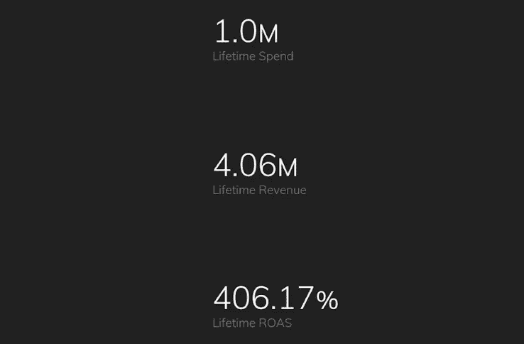
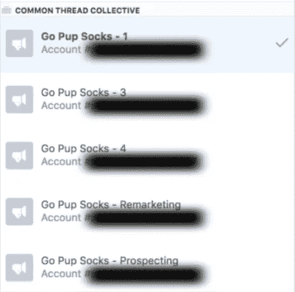
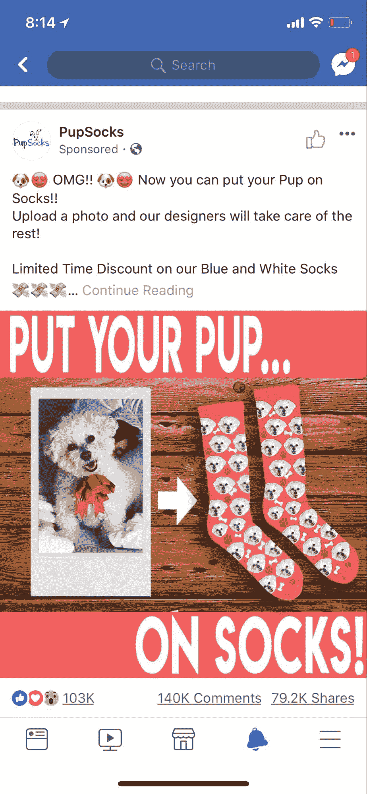
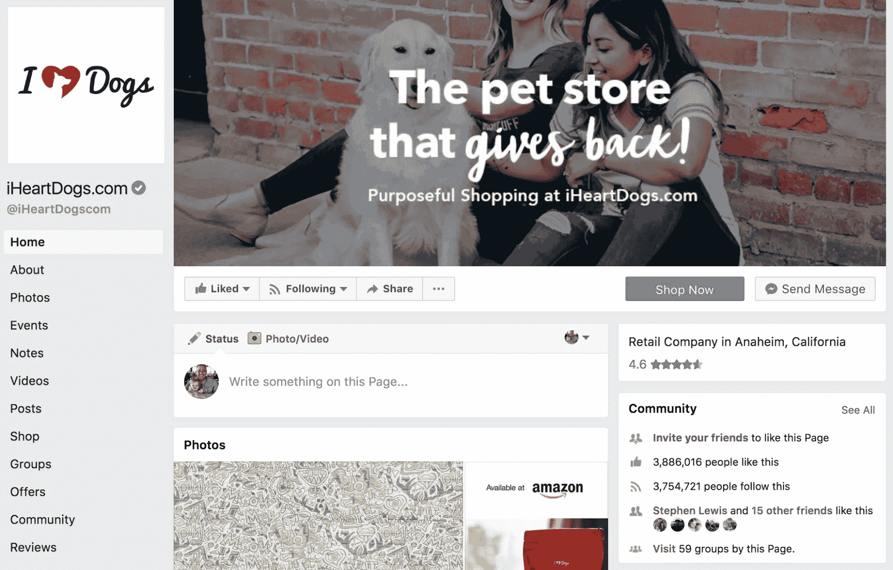
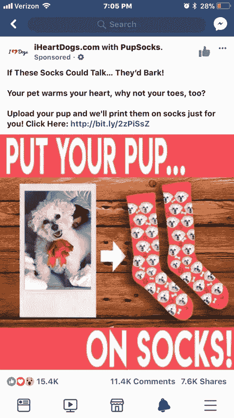
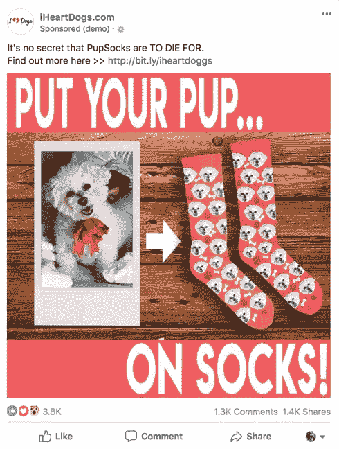

# 电子商务脸书广告:100 万美元的广告支出(结果= 4 倍投资回报率)

> 原文：<https://sumo.com/stories/ecommerce-facebook-ads?utm_source=wanqu.co&utm_campaign=Wanqu+Daily&utm_medium=website>

在不到 30 天的时间里花费 100 万美元，创造至少 400 万美元的销售额？！

这是 [PupSocks](http://www.gopupsocks.com?ref=sumo) 在[Common Thread collection](https://www.commonthreadco.com/?utm_source=sumo&utm_medium=blog)给我们团队的挑战，这是一个销售宠物主题袜子的品牌，目前在脸书每天仅花费 500 美元，但希望在假日季节赚到数百万美元。我们不确定我们能不能成功——但是，好吧，你自己看看发生了什么:

*   在 45 天的时间里，我们卖出了 8 万双袜子

*   我们在第一笔 100 万美元的广告支出上获得了 4 倍的回报

*   我们在全部 1，500，000 美元的广告支出上获得了 3.8 倍的回报

*   规模计划在 3 个州创造了 100 多个工作岗位

我将带你了解一下**共同线程集体(CTC)是如何建立、管理和扩展这种规模的活动的。**

## **第一步:建立你的百万美元脸书广告活动基础**

如果你想在一个新的脸书广告客户上最大化你的潜在广告支出，有四件重要的事情需要知道。

1.  您的广告账户消费限额从每天 750 美元开始。对于大多数人来说，这并不是一件显而易见的事情，筹集资金可能是一件痛苦的事情——而将资金提高到每天 10 万美元通常会遭到嘲笑。这就是拥有一个脸书代表的重要性。一般来说，当你达到一定的消费水平时，你会被分配一个代表，但是有一个有永久代表的代理合作伙伴可以加快这个过程。特别是在假期，我们建议在您计划扩展前几周提出这些请求。

2.  创建多个帐户(我们创建了五个)。这是一种冗余，可以防止在高峰购买日遇到任何广告支出问题。当你计划每天花费超过 100，000 美元时，你最不希望的事情就是有广告投放问题或暂停帐户。

4.  确保你的信用额度足够高，以支持你迅速扩大的支出。在我们的案例中，我们与 PupSocks 合作，提前在他们的信用卡上预付大笔款项，因为我们无法将总限额提高到足够高的水平。在活动进行期间，不要指望你有能力跟上信用卡的频繁付款(保持在限额以下)，因为你会在周末和/或假期等待付款。

5.  检查网站不会在所有流量的重压下崩溃。如果你在 Shopify 上，这应该不是问题，但是对于所有其他提供商，在预期的并发网站会话上运行一些预计的数字，并使用 Load Impact 之类的工具对你的网站进行负载测试。[*](https://loadimpact.com/)

在 PupSocks 的例子中，我们遇到了缩放的技术问题，因为它们在服务器端数据库中存储用户上传的最大 20MB 的图像。幸运的是，PupSocks 不停地工作，以确保他们的网站能够支持我们发送的流量。

## **第二步:找到 4 倍投资回报率的广告创意**

如果你打算在假期期间在脸书迅速扩大规模，你将需要在一个非常拥挤和竞争激烈的购买环境中，在漏斗顶端拥有巨大的影响力。为了实现这一点，带着一个你知道会推动大规模参与(分享=免费展示)的创意进入这个领域，并且已经预先加载了验证。

在黑色星期五和网络星期一这样的高峰购买日推出全新创意是我们看到人们犯的最大错误之一。你想用你最好的创造潜在客户的创意来驱动最便宜的点击，并让你的网站传达销售。

当我们在黑色星期五上线下面的广告时，它已经获得了 50，000 个赞、评论和分享。我们通过以下方式做到了这一点:

1.  创造 10-12 个不同的有机岗位

2.  在发布前的两周，用一小笔预算(50 美元左右)向 PupSocks 的脸书粉丝页面的观众宣传它们。

3.  确定哪个收到了最多的综合赞、评论和分享。

4.  为获胜的广告创意向广大受众(即 10%长相相似的受众)发起 PPE(按参与付费)活动，为期七天，每天 100 美元。

在积极扩展之前，我们只进行了七天的 PPE 活动，因为它产生参与的速度非常快。

当你开展个人防护设备活动时，你不需要最低水平的喜欢、评论和分享，也不需要其他一些寻找成功广告的神奇数字。这是关于分配你能负担的测试预算，并找到相对于你测试的所有广告的最佳广告。

下图是我们的 PupSocks 活动的获奖广告创意，只需几分之一便士就能获得参与。

将这个广告投放到拍卖中，与极其无聊的“全网站 20%折扣”的文字广告竞争，就像拿着枪去决斗。

总的来说，这一个广告能够占总广告支出的 25%以上(286，767 美元)和几乎 30%的收入(1，184，343 美元)。

在高峰购买日之前，花预算在一些参与目标活动上，以找到一个高性能的广告创意可以给你带来巨大的优势。

虽然你的获奖广告创意可能没有达到 50，000 个赞、评论和分享(小狗非常流行)，但你仍然应该对你的广告进行可靠的验证，这将有助于提高相关性分数，扩大覆盖范围和降低频率。

## **第三步:为你的 4 倍投资回报率的广告创意创造新的受众**

现在你已经找到了一个广告创意，并加载了大量的赞、评论和分享，那么在尝试扩展时，你应该瞄准谁呢？答案是所有人。或者至少任何你有理由相信会感兴趣的人。

从你知道的开始:

*   基于漏斗所有阶段的相似性)，然后转到

*   主要兴趣(宠物主人、宠物品牌的粉丝等。)，那么

*   变得古怪(卡戴珊引起任何人的兴趣？)

我们甚至会将所有这些观众分成不同的位置，并按性别对他们进行分类，试图隔离每一个可能的机会。扩展的关键始终是敏捷性。我指的是为自己创造选择的能力。你一开始能想到的广告越多，找到有用的东西的可能性就越大。在开始的时候，你想要尽可能多的广告集，只要你的小手指允许你创建。

在两个月的推广期间，我们为 PupSocks 制作了 828 套广告。

*   50%以上的观众长相相似(1-10%的观众在各种漏斗行为上长相相似)

*   200 多名是定制观众

*   500+是我们的样貌和定制观众广告集的变体，按位置、出价类型等分类。

从合理的每日预算(我建议是你平均订单价值的三倍)开始，然后准备好快速淘汰表现不佳的广告！

但是给自己选择。除非你有大量的历史数据，否则试图预测正确的受众并对其进行大规模预算是徒劳的。

在消费者购买意愿极高的高峰购买日尤其如此。拥有大量的广告组合会让你在规模和方式上有很大的灵活性。

附注:确保包括一些超广泛的受众——甚至尝试默认的“所有”受众。

## **第四步:决定何时取消或调整你的广告组合**

在扑克游戏中，优秀的玩家会说，要想赢，你只需要知道如何做出两个决定:何时加注，何时弃牌。脸书广告购买也是如此。作为一名媒体购买者，你的工作是尝试快速扩大规模，确定你需要什么信息来决定取消或增加一个广告组合，以及你能多快获得这些数据。首先要深入了解你的单位经济状况，以设定广告支出的目标回报率(ROAS ),然后将领先指标与 ROAS 相关联。

我们发现，roa 最安全的漏斗顶端领先指标是每辆购物车的成本(CPATC)。当你把所有的广告集投入使用时，你会希望跟踪每一个广告集的指标。

一旦我们有了 4-5 个添加到购物车中的广告，我们就决定是取消还是扩大一个广告系列。如果太接近(在我们的目标 CPATC 的 10%以内)而不能打电话，我们将等待看到实际购买的 roa。不要太担心早期的统计意义——如果领先指标不是每次都 100%准确也没关系。如果你已经创建了足够多的广告集，这将有助于你很快找到获胜的广告集。

当你继续消费时，确保你记录了你的延迟归因(延迟归因是指在单日点击/查看窗口之外发生的购买)。例如，如果有人在你活动的第一天点击了一个广告，然后在第七天回来购买，这一购买将出现在脸书，归因于第一天的广告集/广告。

脸书的完整默认属性窗口是 1 天的查看/ 28 天的点击窗口。这意味着，随着购买的继续发生，您的 ROAS 将在整个 28 天的窗口中继续增加。因为 PupSocks 希望在一个完整的归因窗口上实现 4 倍的 ROAS 目标，所以我们需要了解在增长窗口上 ROAS 会增加(或 CPA 会减少)多少。

了解这些数据，我们可以在第一天做出更好的决策。为了做到这一点，你需要每天将你的脸书广告数据导出到下面的电子表格中。

您可以点击**文件>制作副本……**使用我们的电子表格。
[延迟归因追踪电子表格](https://docs.google.com/spreadsheets/d/1eFfKY_WZ7RDRa7S3Cd2oB-8BZXhoEph_1gKrFmCxQis/edit#gid=1849461934)

这里的关键是跟踪你 1 天、7 天和 28 天的点击收入，然后创建一个基本的计算，让你跟踪每个时间段之间的百分比增长。

一旦你对自己的延迟归因有了感觉，你就可以更积极地实现你的目标。例如，如果你以 20 美元的 cpat 开始，通过跟踪你的延迟归因，发现你的 cpat 将在 7 天内下降 30%,你会意识到你可以在第一天根据这个数字如何随着时间的推移而下降，决定以 26 美元的 cpat(高出 30%)进行调整。

如果你被所有的数学弄得头昏脑胀，那就是 Common Thread Collective 这样的电子商务媒体购买机构的专长。如果您希望像我们在 PupSocks 上所做的那样获得 4 倍投资回报的帮助，请点击这里联系我们。

## **第五步:复制您的获奖广告集，增加您的预算**

一旦你开始看到成功的广告组合出现，是时候开始利用这些观众了。虽然我们建议从大量的广告集开始，并根据领先指标将其淘汰，但我们建议在决定扩大广告集之前，让自己看到这些广告集以有意义的购买次数(最少 4-5 次)达到目标 roa。

但是一旦你做了，就是时候了。在传统的购买场景中，你试图随着时间的推移实现正常增长，你可以简单地决定每天增加 10-20%的广告预算。当你试图在 30 天内将广告支出增加 200 倍时，没人有时间这么做(我们不建议你简单地将广告预算增加 200 倍，因为将所有鸡蛋放在一个篮子里是扩大规模的一个办法)。

因此，当我们有一个获胜的广告集时，我们立即使用相同的自动竞价策略(自动竞价是转化活动中的默认竞价策略)以更高的预算复制广告集(有时是 3 或 4 倍，取决于受众的规模)。然后，我们用不同的手动出价将获胜的广告集再复制 3-5 次(下面带绿色下划线的数字是广告集的手动出价目标)。

我们使用一系列手动竞价目标，因为每种竞价类型都将创造不同的拍卖动态，如果你有一个强大的广告创意，你甚至可以出价超过你的 CPA 目标，赢得更多的拍卖，并仍然达到你的 ROAS！这种策略可以让你从每一个成功的受众/广告组合中获得最大的收益。

## **步骤#6:让广告商访问影响者的脸书页面**

一旦你有了自己的广告账户，并对表现最好的广告创意有了强烈的感觉，就该想想你能从哪里获得额外的广告创意了。在 CTC，我们想说对购买决策影响最大的两个因素是:

1.  价格

2.  你信任的人的推荐信

所以问问你自己，你的潜在客户信任谁？通常，这是我们应用影响者营销策略的地方，通过让广告客户访问他们的脸书页面来运行付费程序，从而与影响者合作。在 PupSocks 这个案例中，我们有了这样一个项目的完美合作伙伴: [iHeartDogs](http://www.iheartdogs.com?ref=sumo) 。

iHeartDogs 是一个在脸书拥有近 400 万赞的品牌，以回馈狗狗社区而闻名。他们拥有大量的爱狗人士，是付费节目的最佳合作伙伴。

要找到 iHeartDogs 作为合作伙伴，他们的创始人是 CTC 的密友和顾问并没有什么坏处，但找到这样的人并不困难。在 Instagram 上搜索几个小时(使用标签)就会发现你的空间里有一大堆拥有大量粉丝的账户。发送一些直接的信息告诉人们你想获得赞助，你应该会很快收到回复！

这是我们在 iHeartDogs 脸书账户上发布的广告创意。你会看到，我们给了他们同样的成功广告创意，我们已经知道将从 PupSocks 活动中工作，然后让他们创建他们觉得将有机和本地社区的广告文案。

**广告#1:**

**广告#2:**

我们采用了这两个广告，加上其他三个广告，并通过 iHeartDogs 页面开展了针对以下受众的转化活动:

*   iheartdogs facebook 页面参与

*   iHeartDogs Instagram 页面参与者

*   iHeartDogs 网站访问者

*   我们的核心受众

结果是 88，000 名新网站访问者、3，184 名新客户和 136，316 美元的新收入。

通过创建这样的额外广告和分销渠道，并利用“有影响力的”品牌在该领域的信誉，我们能够扩大广告活动的规模，为双方创造双赢。

**注意:**我们与 iHeartDogs 安排的交易结构是基于每千次展示的预期成本(CPM)的固定价格套餐。换句话说，我们是在为我们得到的有保证的观众访问付费。这笔交易包括向他们的数据库发送电子邮件，在他们的网站上放置广告内容，多个有机社交帖子，以及 30 天的广告客户访问权。在可能的情况下，我们总是倾向于使用固定费用，因为这可以让我们在扩大规模时创造更多利润，而可变成本可以创造固定利润。

## **扩展您下一次脸书广告活动的 3 个关键要点**

以下是我们希望您从我们的经验中获得的三个要点:

*   提前计划。如果没有规划，这样的扩展是不会发生的。确保你的财务、技术和创意井然有序是必须的。

*   从宽开始，缩小，然后相乘。开始时，给自己尽可能多的潜在获胜广告/受众组合。快速杀死失败者，以保护您的预算，然后复制和手动出价您的赢家。

*   **影响结果。**找到更多的页面/人，让你可以通过这些页面/人来开展你的成熟广告活动，这是一种强大的方式，既可以验证你的品牌，又可以在社交平台上创造额外的规模。

如果你做到了这一步，你就有权利在这个过程中变得伟大，你应该得到奖励。所以，对于一双袜子的八折优惠，使用代码相扑。

以下人员值得为他们在此次活动中的工作大声欢呼:尼克·沙克尔福德(策略师)、胡炜昇(采购员)、凯特琳·托马森(客户经理)、阿德里亚娜·法尔孔(设计师)和亚历克斯·马尔多纳多(文案)。当然，如果没有 Zach 和他整个 PupSocks 团队的疯狂努力，这一切都不可能实现。创造这些令人惊叹的品牌的企业家总是真正的英雄，我们只会和产品本身一样优秀。