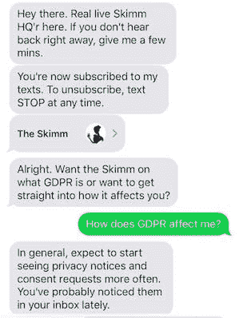
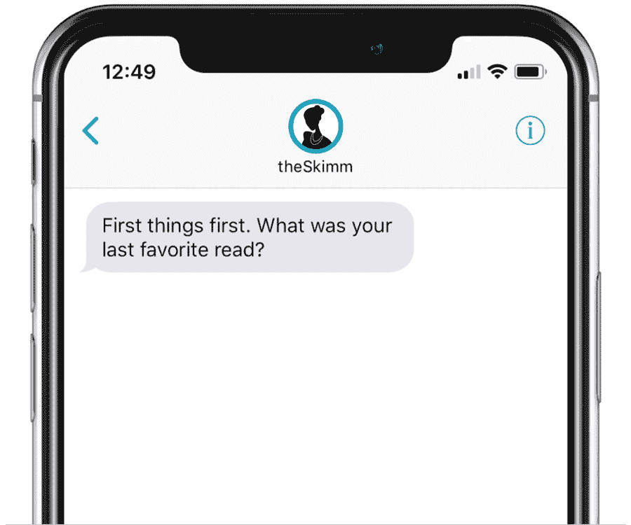

# Skimm 推出了 1:1、无机器人(目前)的短信服务，帮助用户做决定

> 原文：<http://www.niemanlab.org/2018/05/the-skimm-launches-a-11-bot-less-for-now-texting-service-to-help-subscribers-make-decisions/?utm_source=wanqu.co&utm_campaign=Wanqu+Daily&utm_medium=website>

如果你正在考虑切断有线电视订阅，你会谷歌一下利弊吗？脸书邮报？给父母打电话？…给 Skimm 发短信？

如果你是他们 700 万时事通讯订户中的一员，你可能会。周三，[Skimm](https://www.theskimm.com)关闭了 1:1，Q &短信服务——目前没有机器人，只有人类——帮助其付费应用用户将当天的新闻融入他们自己的生活。

Skimm 的产品负责人 Dheerja Kaur 说:“我们的产品策略是基于发现我们的观众在一天、一周、一生中遇到的问题，Skimm 可以帮助以相关的语气回答这些问题，并将这些问题与他们在手机上和日常生活中所做的事情结合起来。”。

但是这个团队也不想仅仅以短信的形式发送每日的 Skimm 简讯。

“人们总是在打电话，但这并不是‘让我们开始通过短信向他们发送信息’，”她解释道。“当你以一种亲密的方式融入某人的日常生活时，它必须感觉适合这个平台。”

为了匹配短信的个人性质，考尔和产品团队想创造一种本周新闻的情境感，加入一层额外的“这如何适用于*我*？”在我尝试的测试中，我可以辩论开始或结束有线电视订阅的利弊，或者头脑风暴要求加薪的方法，尽管有时我们的交流之间会有延迟(大约 15 或 20 分钟)，因为我是在和一个人而不是一个机器人发短信。Skimm 的声音在六年的每日头条新闻之后相当精炼，但 Kaur 认为文本交互是一个神圣的空间，机器人还不够好。

她说，“技术还没有发展到可以真正与人对话的地步。”“[机器人]有利于提供基本体验，有利于向某人推送内容。我们直接进行这种人际互动，因为我们觉得一对一对话的价值实际上是帮助他们达到可以做出决定的程度。”

然而，他们是如何处理所有的人际交往的呢？对于第一次测试，考尔说，在提出这个想法后，团队立即研究了这个主题(新 iPhone 选项的利弊)，并与用户沟通。考尔说，他们自发地决定向他们的应用程序用户发送推送通知，“不到五分钟，我们就有了大量令人难以置信的对话”。

现在每周发短信的时间更有条理了。这个团队挑选了一个有新闻价值的话题(比如今年春天早些时候的税单),并设定了一个时间窗口，他们将在电脑前为这些问题做准备，因此这个体验有一个清晰的开始和结束。现有的编辑团队，大约八到十人轮换，带头响应。(“这并不是说我们要雇佣 200 人来运营一条热线，”考尔说。)他们计划逐步引入一个自动化的薄层，来完成文本交互的初始筛选，比如发短信的人有什么样的手机，以及他们是否有资格升级，举个例子。考尔猜测，在该服务的下一次发展中，大约 15%到 20%的交互将会自动化，但只是作为一种更有效、更直接的人类元素。在推出时，也就是现在，这项服务是 100%人性化的。

这项短信服务只针对付费订阅 Skimm 应用程序的人(每月 2.99 美元，或每年 29.99 美元)。该应用程序订阅还包括 Skimm Ahead 日历和音频深度浏览笔记。(考尔没有告诉我这款应用有多少付费用户，只是说，“我们是收入前三的新闻应用。”)

Skimm 加入了应用程序和一些附加产品

[The Skimm has launched over the past few months](http://www.niemanlab.org/2017/11/with-video-and-audio-the-skimm-pushes-further-into-the-daily-routines-of-its-6-million-readers/)

。今年秋天，这家 72 人的公司在 Facebook Watch 上推出了几个视频系列，从政治采访到创业竞赛(尽管有些现在已经开始播放了——

[other publishers have slowed their Facebook Watch content as Facebook subsidies are wrapping up](https://digiday.com/media/facebook-watch-publishers-seek-to-diversify-revenue-beyond-facebooks-subsidies-video-ad-breaks/)

).Skimm Notes 也在那时被引入到应用程序中，推动将更多时事通讯订阅者转化为付费应用程序订阅者的便利性。

Kaur 说:“整个捆绑包都在创造这些服务，让人们更容易更智能地生活。”“时事通讯是真正的门户，订阅通过日历、音频和消息传递构建了这套服务。”

斯金姆正在使用

[Purple](https://getpurple.io/)

，这家信息初创公司在

[SMS](http://www.niemanlab.org/2016/03/with-purple-you-can-get-election-updates-and-political-info-via-text/)

和

[Facebook Messenger](http://www.niemanlab.org/2016/07/purple-the-news-startup-built-around-sms-is-leaving-it-behind-for-facebook-messenger/)

然后把它留在那里

[helping journalists monetize their following through SMS](http://www.niemanlab.org/2017/09/news-startup-purple-is-now-a-service-that-lets-creators-charge-people-to-text-with-them/)

。尽管 Skimm 的应用程序可以作为一个消息平台(

[not unlike the New York Times’ pivot to its app from SMS](http://www.niemanlab.org/2018/02/with-its-new-olympics-texting-experiment-the-times-is-saying-goodbye-to-sms-hello-to-personalization/)

).考尔并不担心:“如果我们试图让它只适用于应用程序，这就违背了整个目的，”她说。“(这款产品)很大程度上是在例行公事地发短信。”

随着产品退出测试，Skimm 计划引入一些突发新闻话题；一个例子可能是根据剑桥分析丑闻了解脸书的隐私设置。该团队还展望了 2018 年[中期动员活动](https://moneyish.com/upgrade/theskimms-free-calendar-wants-you-to-vote-in-this-years-midterm-elections/)；最近关闭的[的一部分，1200 万美元的 C 轮融资](https://techcrunch.com/2018/05/21/theskimm-closes-its-12m-series-c-with-big-names-shonda-rhimes-and-tyra-banks-on-board/)将用于此。(Skimm 在 2016 年大选中的努力帮助登记了超过 11 万名美国选民。)

#### 短信很可爱，但它真的对新闻机构有用吗？

— [随着新的奥运短信实验的开展，《纽约时报》正在告别短信，迎接个性化](http://www.niemanlab.org/2018/02/with-its-new-olympics-texting-experiment-the-times-is-saying-goodbye-to-sms-hello-to-personalization/):“我们创造了一种类似机器人的交流方式，但用的是人的声音和语气。”

— [在芝加哥，两家新闻机构正在利用短信和直播事件来扩大他们对 lead](http://www.niemanlab.org/2017/02/in-chicago-two-news-orgs-are-using-texting-and-live-events-to-widen-the-reach-of-their-reporting-on-lead/) 的报道范围:“我们正在努力让人们能够做出自己的决定，这需要我们为他们提供正确的信息。”

— [通过向当地居民群发短信，离群媒体将低收入新闻消费者与有用的个性化数据联系起来](http://www.niemanlab.org/2018/03/by-mass-texting-local-residents-outlier-media-connects-low-income-news-consumers-to-useful-personalized-data/):“我不满足于为高收入受众报道低收入群体。我想报道低收入新闻消费者的问题和 T2 的问题。”

— [BuzzFeed News 的播客主持人 Jojo the bot 希望帮助听众无摩擦地跟随](http://www.niemanlab.org/2018/05/buzzfeed-news-podcast-cohost-jojo-the-bot-wants-to-help-listeners-follow-along-without-friction/):“我们的目标之一是以一种邀请我们的观众进入新闻周期的方式谈论新闻。我们试图让人们更容易参与进来。”