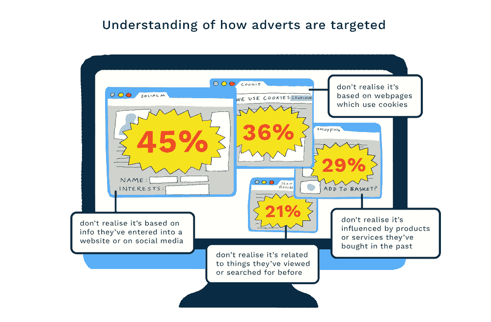
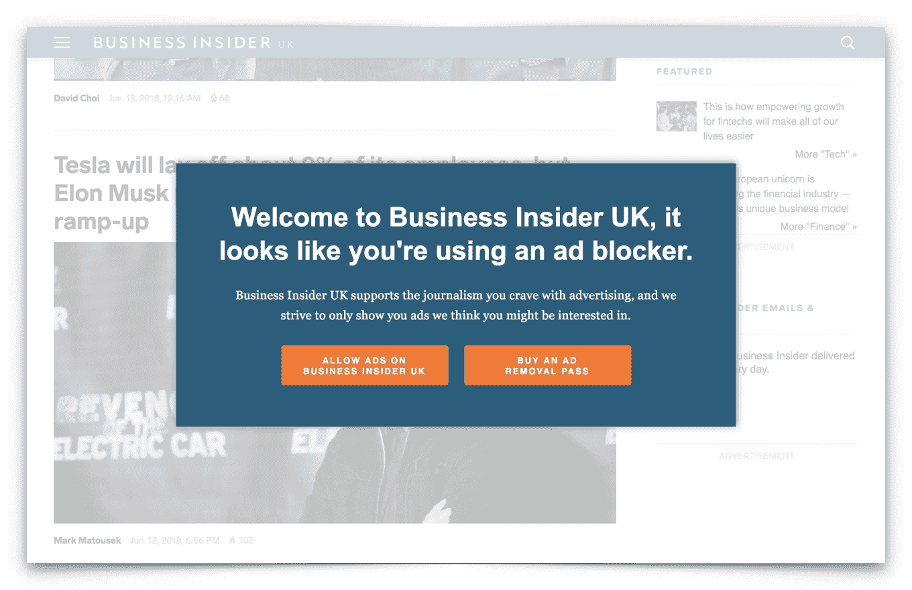

# 广告是如何变得如此善于跟随我们的？

> 原文：<https://yiu.co.uk/blog/how-did-adverts-get-so-good-at-following-us-around/?utm_source=wanqu.co&utm_campaign=Wanqu+Daily&utm_medium=website>

# 广告是如何变得如此善于跟随我们的？

再加上一些对更广泛的技术政策辩论意味着什么的思考。

【2018 年 6 月 12 日

[帖子](https://www.facebook.com/sharer/sharer.php?u=https%3A%2F%2Fyiu.co.uk%2Fblog%2Fhow-did-adverts-get-so-good-at-following-us-around%2F "Share on Facebook") [推特](https://twitter.com/intent/tweet?text=How+did+adverts+get+so+good+at+following+us+around%3F&url=https%3A%2F%2Fyiu.co.uk%2Fblog%2Fhow-did-adverts-get-so-good-at-following-us-around%2F&via=clry2 "Share on Twitter") [分享](https://www.linkedin.com/shareArticle?mini=true&url=https%3A%2F%2Fyiu.co.uk%2Fblog%2Fhow-did-adverts-get-so-good-at-following-us-around%2F "Share on LinkedIn")

我们都经历过一个在互联网上跟随我们的广告。在许多情况下，这并不特别神秘——我们习惯于网络浏览器记住我们去过的地方(能够按下后退按钮或保持登录我们的电子邮件和社交媒体是非常方便的)，所以广告似乎也不会太令人惊讶。

但是最近事情开始有点不同了。即使你打开浏览器的匿名模式或切换设备，广告还是设法找到了你——或者在某些情况下，即使你一开始就没有搜索过某个特定的产品，广告也有着惊人的先见之明。

前几天，我分享了一个帖子，概述了这种情况发生的一些方式，以及对更普遍的定向广告的一个非常简短的反思。这篇文章用无限的字符和大量的链接来展开讨论。我们将把它分为两个主要部分——正在发生的事情，以及这最终是一件好事还是坏事——然后在关于技术的更广泛的政策辩论中提出一些问题。

## 广告是如何不断找到我们的？

使互联网上有针对性的广告成为可能的工具和技术列表首先包括:

*   [Cookies](https://en.wikipedia.org/wiki/HTTP_cookie) 由您访问的网站创建并存储在您的浏览器中，以便在您返回时识别您的身份
*   [由第三方广告网络](https://en.wikipedia.org/wiki/HTTP_cookie#Third-party_cookie)创建的 Cookies，用于从一个网站到另一个网站识别您的身份，并根据您过去的行为显示广告(也称为“重新定位”)
*   [Cookie 同步](https://robertheaton.com/2017/11/21/cookie-syncing-how-online-trackers-talk-about-you-behind-your-back/)使两个或多个不同的广告系统能够映射各自分配给特定用户的标识符，以促进数据共享
*   与您的在线帐户相关联的个人资料，[积累您的搜索和其他活动的数据](https://myactivity.google.com/myactivity)(包括您与语音助手的互动)，然后当您使用这些帐户在其他地方登录时，显示基于此的广告
*   网站所有者[安装跟踪像素](https://www.shopify.co.uk/blog/72787269-relax-advertising-on-facebook-just-got-a-lot-easier)将你的在线活动反馈给大型在线平台，这样当你使用他们的服务时，他们可以显示有针对性的广告
*   网站所有者[将客户联系信息列表](https://business.twitter.com/en/help/campaign-setup/campaign-targeting/tailored-audiences/TA-from-lists.html)上传到大型在线平台，这样当你使用他们的服务时，他们可以显示有针对性的广告

即使你采取了一些对策，比如开启隐私浏览(这会清除你的浏览记录并限制 cookies)或切换设备，广告还是会以更激进的方式跟踪你:

*   [指纹识别技术](https://panopticlick.eff.org/about#browser-fingerprinting)通过匹配您系统的其他属性(例如，您的网络浏览器、操作系统、屏幕分辨率、时区、语言、插件、字体等)来识别您的身份。)即使 cookies 已关闭且您未登录任何在线帐户
*   关联两个不同设备的指纹，如果您在这两个设备上登录同一个在线帐户，这样即使在注销后，您也可以成为目标
*   关联两个不同设备的指纹，即使您没有登录到同一个帐户，方法是关联它们在相似时间在同一网络上的出现

与网站不同，应用程序不使用 cookies。但是，广告还可以通过其他方式在手机或平板电脑上跟随你，包括:

*   [广告 id](https://support.google.com/adxbuyer/answer/3221407?hl=en)可以唯一识别你的手机或平板电脑，这样来自一个应用的广告可以在另一个应用中显示
*   当您使用在线帐户登录手机或平板电脑上的应用程序时，将您的广告 ID 与您的在线帐户相关联

广告甚至有办法在没有任何数字联系的情况下找到你:

*   长相相似的观众把你和其他有相似兴趣或人口统计特征的人放在一起，并根据他们过去的行为展示广告
*   向共享互联网连接的人显示广告的目标(例如，一群室友共享一个宽带路由器)
*   向共享一个物理位置的人显示广告的定向(例如，在同一时间在特定地点或特定事件中的人)

而对原帖的回复甚至提到了更多的可能性，包括:

对这样一份名单的第一反应通常是恐惧。我们都暗自怀疑存在一定程度的跟踪——毕竟，定向广告还能如何运作？但是大多数人并没有意识到事情有时会变得多么包罗万象(这一点被来自 [Doteveryone](https://twitter.com/doteveryoneuk) 的关于数字理解的一些优秀[研究所证实)。](http://understanding.doteveryone.org.uk/)

值得注意的是，定向广告的某些方面你确实可以控制，尽管这些方面并不广为人知。例如，如果您希望可以:

完整地说，我并不相信当前关于我们的手机为了定向广告而监听一切的阴谋论浪潮。我认为更有可能是其他形式的瞄准加上人类在巧合中寻找意义的倾向的结合。

## 定向广告是坏事吗？

在最初的帖子中，我说过尽管如此，我认为定向广告并不像它有时表现出来的那样是个问题。

为了避免疑问，这并不意味着我认为现状是好的，或者我们应该接受它作为一个既成事实。这个世界将会变得更加美好，广告投放方式将更加透明，包括为什么要展示某个特定的广告，以及有哪些数据为这一决定提供了依据。在确保人们知道他们何时被跟踪，并选择如何捕获、存储和共享他们的数据方面，也有很大的改进空间(对于我们这些在欧洲的人来说， [GDPR](https://en.wikipedia.org/wiki/General_Data_Protection_Regulation) 是这方面的一个良好开端，尽管我怀疑大多数人会继续点击数据共享和同意控制，而不是真正阅读它们)。大型科技公司和负责监管它们的人都需要想办法在这些方面取得进展。

但我认为，这并不像得出所有广告都是不好的，或者定向广告总是令人反感的结论那样容易。在许多情况下，定向广告是有用的广告(当人们收到明显不相关的广告时，他们通常会很快抱怨)。我也不认为我们可以在不招致不小的附带损害的情况下将广告从互联网上移除。

首先，有些真实的产品和服务对每个人来说的最佳价格是零，因为这能让最多的人参与进来。如果有很大一部分人因为价格过高，或者在要求提供信用卡号码时直接退出注册过程，像脸书这样的平台就不会有任何用处。或者考虑一下新闻:在一个只有那些准备打开付费墙的人才能接触到有根据的报道和见解的世界里，你会快乐吗？当然，混合模式是可能的——想想像 [LinkedIn Premium](https://premium.linkedin.com/) 或 [Guardian Membership](https://membership.theguardian.com/) 这样的付费模式——但这不足以完全排除免费的、广告支持的选择。

第二，有针对性的广告是新的利基业务寻找客户的有效途径。在互联网出现之前从来不可行的想法——因为你在当地找不到足够多的客户，或者你永远比不上你的大竞争对手的大众市场广告预算——可以使用精心定向的广告，在网上吸引大量潜在客户。做得好的话，这对消费者来说也是一件好事，帮助我们在无限内容的海洋中找到我们重视的东西。因此，如果你对传统行业中现有大公司的统治地位感到不安，那么值得考虑的是，负担得起的、有针对性的广告的出现给了新企业家[一个向消费者突破](https://www.economist.com/business/2018/03/31/a-long-overdue-disruption-in-menstrual-products)的战斗机会。

因此，我认为使用[广告拦截器](https://en.wikipedia.org/wiki/Ad_blocking)的决定并不明确。有越来越多的理由支持它们，特别是当坏广告破坏网站的可用性，提供恶意负载，玩弄你的个人数据，甚至[劫持你的浏览器来挖掘加密货币](https://gizmodo.com/hackers-hijacking-cpus-to-mine-cryptocurrency-have-now-1822466650)。但另一方面，当负责任的广告陷入交叉火力时，它会切断内容制作者的收入和新业务的眼球——认为这不会有后果是不现实的。

在某些方面，这种情况让我想起了大学里学生们在 Napster 上下载歌曲，而不是在商店里购买专辑的时代。这个问题的最终解决方案是更好的客户体验:先是 iTunes，然后是 Spotify。对于广告来说，这个行业的集中化本质——尤其是围绕着脸书和谷歌——可能也是拯救它的因素(谷歌已经在利用其影响力打击那些发布不良广告的网站；本·汤普森写了一篇关于这个的文章[。](https://stratechery.com/2018/the-aggregator-paradox/)

无论如何，个性化广告的某些元素已经在其他领域存在了一段时间。你在不同的报纸和杂志上看到不同广告的原因是，它们是基于读者群体可能拥有的广泛属性而投放的。当在超市收银台为你打印特价优惠券时，你会根据你过去的购买情况(可以使用你的商店卡或信用卡在购物行程之间联系在一起)成为目标。

但一切都是程度问题，确实感觉互联网把针对的强度提高了几个数量级。最终，我们要解决的问题是定向广告的越界点——正如阿齐姆·阿兹哈尔对我说的，这条线是用铅笔还是记号笔画的。对于我们这些还记得网络早期的人来说，从一个充满无限可能的世界过渡到与广告业的军备竞赛可能会感到有点不舒服，即使追踪是由冷静的算法完成的。但俗话说，一代人的正统是下一代人的正统。也许那些伴随定向广告成长起来的人就不会这么烦恼了？

## 大局

当我们离开消费者领域，开始考虑开发商、政治运动甚至政府本身所面临的更广泛的系统性激励时，事情会变得更加困难。在这个领域，我们需要面对一些重要的问题:

*   在多大程度上，吸引广告眼球的欲望促使一些应用程序开发人员通过通知劫持我们的注意力，或设计对我们更广泛的福祉有害的上瘾反馈循环？
*   针对点击诱饵、假新闻、负面政治信息和选民压制运动的潜在低准入门槛如何影响我们民主和政治机构的健康？
*   我们如何阻止我们的政治领导人对这类技术缺乏了解，从而导致关于网络世界的重大决定默认由非选举产生的董事会而不是选举产生的议会做出？
*   当支撑定向广告的两用技术落入决心监视民众并限制其自由的独裁政府手中时，出路何在？

这些问题都没有简单的答案。它们都表明，用新技术改变世界的人与寻求治理世界的政策制定者和政治家之间，迫切需要进行更有效、更有条理的对话。这是我目前花了很多时间在上面的事情，不久的将来会有更多关于政策制定者应该如何考虑大型技术的内容。