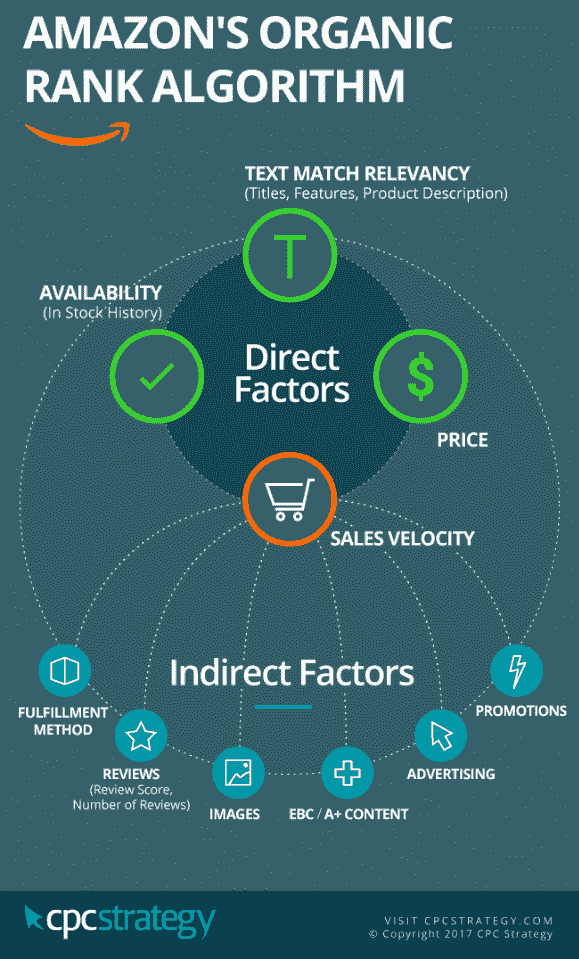
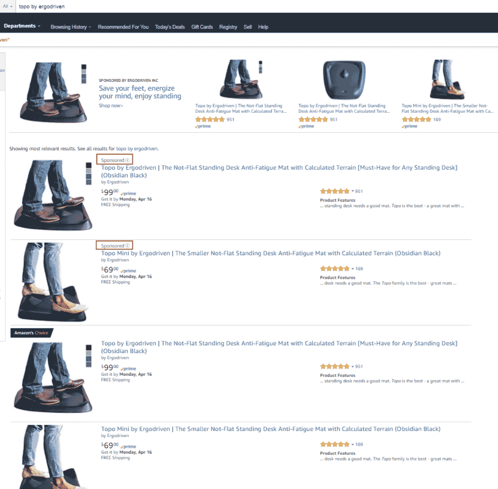
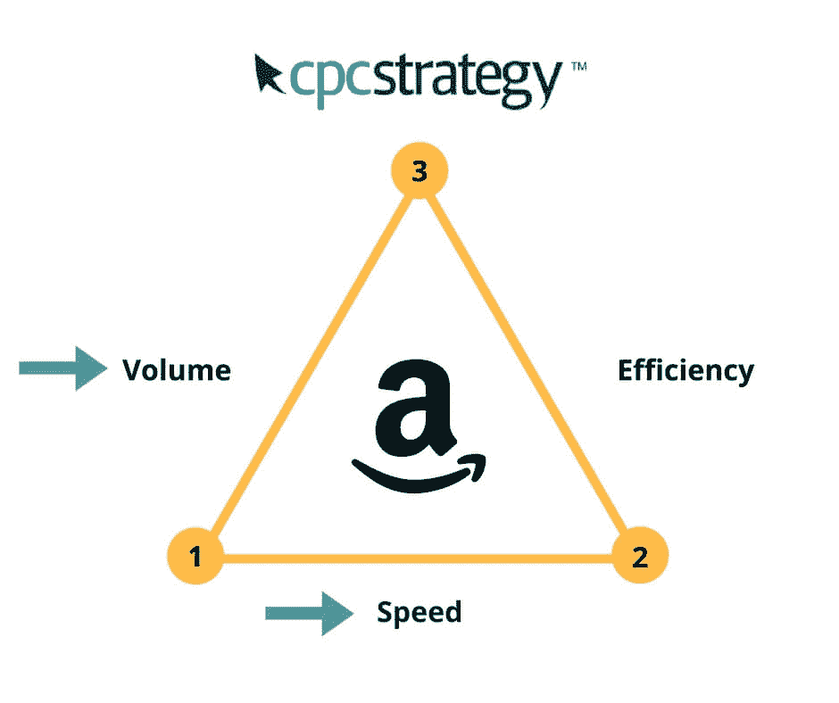

# 亚马逊 PPC 策略指南:如何在亚马逊上做广告

> 原文：<https://sumo.com/stories/amazon-ppc?utm_source=wanqu.co&utm_campaign=Wanqu+Daily&utm_medium=website>

你知道亚马逊是什么。但你知道吗，2018 年一项针对 1000 名美国购物者的研究发现，41%的人开始在亚马逊上搜索产品，并在亚马逊上购物。[*](https://www.salsify.com/hubfs/2018%20Consumer%20Research%20Report/2018%20Consumer%20Research%20Report%20-%20Final.pdf)

当我们进一步挖掘亚马逊购物者的行为时，我们发现: [ [*](http://learn.cpcstrategy.com/rs/006-GWW-8img/2018-Amazon-Shopper-Behavior-Study.pdf) ]

*   70%的亚马逊搜索者从未点击过搜索结果的第一页

*   35%的亚马逊搜索者会点击搜索页面上的第一件商品

*   搜索结果中显示的前三项占点击量的 64%

你可以忽略这些统计数据，或者你可以学习如何让亚马逊为你工作，以增加你的销售和客户群。

在这篇文章中，我将教你如何使用亚马逊广告使亚马逊成为你的个人销售机器。最后，你将准备好运行你自己的亚马逊点击付费(PPC)广告活动。以下是我们将要讲述的内容:

## **为什么你应该投资亚马逊 PPC**

在亚马逊上，投资广告不再是可选的。每天都有新的企业在亚马逊上开设账户，充斥着市场，加剧了竞争。为了抵御竞争对手，每个类别的平均每次点击成本(CPC)价格都在上涨，在某些情况下甚至达到了无利可图的地步。

面对如此激烈的竞争，有些人可能会问，投资亚马逊广告是否值得。答案是“绝对可以。”49%的顾客在亚马逊上开始他们的产品搜索，不要被动——你不能不追求这些顾客。

那么为什么亚马逊上的广告需要付费呢？

还记得 70%的搜索者停留在搜索结果的第一页，而前三个列表获得了大部分点击吗？如果你没有在搜索结果中排名靠前，即使你是，广告也是你吸引眼球的方式。

亚马逊的算法在决定任何给定搜索的排名时有许多排名因素，但销售速度是头号因素。销售速度是指你最近创造了多少销售额。这不是亚马逊给你的一个具体指标，而是你每天卖出多少台的一个概括。

亚马逊不太关心*累计*销售额，更感兴趣的是你最近卖出的数量。这就是新卖家如何通过比竞争对手每天推更多的单元，在亚马逊上超越老卖家。

如果没人能找到你，你如何提高销售速度？**广告。**

下面的信息图是亚马逊提供的关于他们的算法如何工作的信息的可视化。我们还通过自己的大量测试证实了这些潜在因素。

两个主要因素驱动有机销售排名:直接因素和间接因素。

直接因素最重要。

如果当客户想要购买时，你没有任何库存，那么再多的广告也不会帮助你，因为如果你没有赢得购买框(即，亚马逊产品详情页面上的框，客户可以通过将物品添加到他们的购物车来开始购买过程)，你就不能为赞助的产品做广告。

在亚马逊上，有时可能会有多个“报价”或销售同一产品的人。默认情况下，亚马逊选择显示他们认为根据价格、评论、履行方式等提供最佳报价的公司的产品。

你可以通过查看谁是“卖家”来判断谁是买家

如果有该产品的其他卖家，您将能够查看各种可用的报价。

在决定哪些产品将排名靠前时，价格是亚马逊的核心考虑因素。如果你降低价格，你的排名不会立即上升；然而，如果这种价格下降增加了你的转化率和销售速度，你可能会看到排名的提高。

文本匹配相关性检查产品是否与客户的搜索相关。Ergodriven 的广告和赞助产品列表不会显示在搜索“dog treats”中，即使他们出价 20 美元，因为亚马逊知道他们的产品与该搜索无关。

在促销、内容、评论等诸多因素中，宣传您的产品是影响和推动销售速度的因素之一。现在，我将向您展示如何为您自己的电子商务业务做到这一点。

## **如何确定你的亚马逊 PPC 目标**

首先，让我们来看看你可以运行的广告类型和使用每种广告的策略。

有几种不同类型的广告。如果这对你来说太基础了，跳到目标部分。

### **赞助产品广告**

赞助产品广告看起来像常规的有机列表，但有一个赞助徽章(见下面的截图)。他们也出现在传送带上，随着时间的推移，亚马逊可能会为他们增加额外的位置。

赞助产品广告包括自动广告和人工广告。

自动营销活动基于产品页面上的*内容*。亚马逊的算法基于搜索查询和你的产品页面文本匹配相关性来确定你的广告是否与给定的搜索相关。

手动活动基于您以各种匹配类型(宽泛匹配、短语匹配或精确匹配)竞标的*关键词*。

使用自动活动收集搜索词数据，您可以将这些数据应用到手动活动。

这里是一个搜索词报告与一些关键字的例子，我们已经在一个很好的广告销售成本(ACOS)转换，并希望添加到我们的手动活动。

这里有一些不相关的关键字，幸运的是我们在这些关键字上花了很少的钱:

如果您在自动营销活动中转换了某个搜索词，请将其添加到手动营销活动中，并为该关键词设置特定的竞价。这是一个叫做关键词收获的策略。

### **头条搜索广告**

在赞助产品列表上方，你会看到[标题搜索广告](http://www.cpcstrategy.com/blog/2017/08/headline-search-ads-in-seller-central/)。这是优质房地产，因为这是客户搜索后首先看到的东西。你还可以展示多种产品，撰写独特的广告文案，并可以链接到一个单独的登录页面，而不是亚马逊上的其他产品，甚至是亚马逊商店。([例子亚马逊商店](https://www.amazon.com/stores/page/E9EC7F6B-1C1F-4930-A1C5-D68085DCD596?store_ref=SPONSORED_SEARCH_AC291T7JOSMXDYU)

所有这些附加功能通常都有较高的每次点击费用，但也能为您的企业带来可观的销量。

### **产品展示广告**

产品展示广告(PDA)有几种不同的位置，如下所示。掌上电脑可以用来瞄准竞争对手的产品页面或捍卫自己的网页。

### **设定目标**

你希望你的广告达到什么目的？销量快速增长？更具成本效益地获取客户？以上都对吧？

尽管这很好，但最好是一次只关注亚马逊广告三角的三条边中的两条。

**场景 1:** 快速推动销量

如果你想快速推量，你就要牺牲效率。如果你增加 150%的出价，你不知道你是否会在销售中获得同等回报，因为收益递减法则会推高你的 ACOS。

**场景二:**快速提升效率

当我提到提高“效率”时，我指的是降低你的广告成本。例如，如果你用 10 美元而不是 20 美元创造了 100 美元的销售额，你将提高你的效率，因为你的 ACOS 现在是 10%而不是 20%。

ACOS =(支出/销售额)x 100

你花在广告上的钱越少越好，因为这会给你留下更多的利润。因此，“效率更高。”

仅仅专注于这个策略会减少你的销售量，因为即使是效率不高的关键词也能为你创造销量。唯一不会影响销售的时候是在你花钱却没有收到任何销售的关键词上。这些都是立竿见影的效果，是在不牺牲产量的情况下快速提高效率的好方法。

**场景 3:** 提高产量和效率

要增加体积和效率，需要**时间**。这是你想要争取的长期战略，也是一旦你开始运作，你应该关注的焦点。

你需要时间来调整和确定要竞价的关键词，以及为它们支付多少钱，以确保你能从中获利。即使你为你的关键词找到了合适的出价，它们也是一个移动的目标，因为竞争格局总是在变化，需要更新出价才能在竞争中保持领先，季节性等等。

理解这三个主要目标的推拉系统对于发展你的商业亚马逊 PPC 战略是很重要的。

## **构建亚马逊竞价排名活动的最佳实践**

亚马逊 PPC 广告活动是这样展开的:

运动

一个广告组中可以有多种产品，这些产品会在特定广告组的关键词中显示。

当涉及到组织你的活动时，粒度越细越好。对于大多数企业，我建议为每个产品/SKU 建立一个独立的广告组。如果你的目录足够小，比如说少于 50 种产品(包括变种)，你可以为每种产品创建一个单独的活动，并且仍然能够管理一切。

在这种情况下，当我提到“产品”时，我指的是本质上的产品变化。如果它是一个完全独立的产品，它应该有自己的活动。

例如，特定的棒球棒有三种尺寸:32、34 或 36。用于不同目的的单独的棒球棒应该有它自己的运动。

如果你正试图决定是将多个产品组合成一个广告组还是将它们分开，我会问自己以下问题:

1.  产品需要唯一的关键字吗？

有时，如果你的产品足够相似，你就不需要为它们建立一个单独的广告组。但是，如果一组独特的关键字很重要，您会希望将它们分开。

例如，如果您销售不同重量和尺寸的棒球棒，而客户会搜索特定的尺寸，您可能会希望在他们自己的广告组中分隔不同的球棒长度，这样您就可以使用类似以下的关键字:

-男子棒球棒 34 英寸

-男子棒球棒 32 英寸

6.  我是否希望能够控制我将一种产品推向另一种产品的力度？

为每种产品设置独立的广告组还可以让你为每种产品分配特定的竞价，如果你想多推销一种产品的话。如果他们在同一个广告组中，他们将使用分配给该广告组的相同出价。

当你的产品有不同的颜色、尺寸等时，这是有益的。人们在搜索中使用这些修饰语。例如，对于搜索“男士大号黑色圆领 t 恤”，您不希望您的“男士中号红色圆领 t 恤”出现在该搜索中，浪费您的广告支出。

更高级的策略包括将你的营销活动分为品牌、非品牌和竞争对手术语，每个营销活动都有特定于其目标的关键词。像这样展开活动还可以让您跟踪品牌与非品牌关键词的表现，因为这两个类别之间的表现通常会有很大差异。

## **两种有效的亚马逊 PPC 策略**

### **亚马逊竞价排名策略#1:优化你的出价**

当你在亚马逊上竞争时，优化你的出价是一个永无止境的游戏。投标需要不断调整，以保持竞争优势，增加销售，并保持效率。

你的出价优化将由你的目标来引导，这是我们之前讨论过的。在决定是增加、减少还是放弃出价时，你也要牢记你的 ACOS 目标。

**示例场景 1**

**目标:**增加销量，提高效率

**ACOS 目标:** 10%

您正在查看的关键字在过去 14 天内具有以下指标:

这个关键词在过去的两周内已经推动了大量的销售。然而，AOCS 目前比你的目标高出 5%。在这种情况下，我会做两件事之一。

1.  我们目前支付的费用高于平均每次点击费，这意味着我们很有可能赢得一个广告位。我们可以尝试将我们的出价降低到 1.10 美元，这样我们不会经常获胜，但我们的平均每次点击费应该会下降，这将导致更低的 ACOS，只要我们在广告收入上的损失不超过我们在支出上的节省。

2.  让出价保持原样。如果一个核心关键词比你的目标高一点，你可以不那么赚钱，因为你仍然可以为一个核心关键词创造销售，这可以提高你的有机排名。

**示例场景 2**

**目标:**增加销量，提高效率

**ACOS 目标:** 10%

您正在查看的关键字在过去 14 天内具有以下指标:

这个关键词显然高于我们的 ACOS 目标。它也不是一个超相关的关键字，所以它不是一个我愿意远远超过我们的 ACOS 目标，所以我会降低出价低于目前的平均每次点击费。

对于 10%的 ACOS 目标，比如上面的例子(你不想花费超过 10%的销售价格来产生销售)，使用下面的我的出价优化指南，根据你的关键词的 ACOS 百分比来调整你的出价。

### **亚马逊 PPC 策略#2:关键词收获**

关键词采集是任何亚马逊广告策略的重要组成部分，本质上是购买数据来做市场研究。这是一个收集搜索术语的过程，客户通过您的汽车营销活动使用这些术语来查找您的产品。这就是为什么在你的产品详细信息页面上有强有力的、描述性的书面内容是很重要的。这就是亚马逊的算法如何更好地理解你的产品，并确定你的广告是否与给定的搜索相关。

这与使用第三方研究工具有何不同？从你的汽车活动中收集搜索词数据是你能收集到的最好的数据，因为它将从*实际*付费客户中提取搜索结果，并向你显示转化他们花了多少钱。第三方研究工具只能给你对人们搜索内容的估计。

使用第三方工具仍然是有益的，可以帮助您快速入门。我测试过很多，但我见过的最好的是病毒式发布。[*](https://viral-launch.com/keyword-research.html)

**如何关键词收割**

1.  在你的卖家中心帐户下载搜寻报告。搜索词报告包含您的汽车营销活动选择的搜索词。本质上，如果有人搜索了某样东西并点击了你的广告，搜索词报告就会收集这些数据。

2.  转到报告>广告报告>搜索词报告>下载报告

我通常会查看前 30 天的数据，或者是自上次收获以来的时间。

我建议每 3-6 周做一次。

并非您转换的所有搜索词都是平等的。如果你的目标是 20%的 ACOS，我会建议你使用 30%或更低 ACOS 的关键词。我通常会高于目标，因为自动广告的表现不尽如人意，所以我不想仅仅因为比目标高一点就不添加关键词。如果你不太在意预算，我会更高。

现在你已经有了想要添加到手动营销活动中的关键词列表，接下来还有几个步骤。

为了最大化曝光，使用所有三种匹配类型(广泛、短语和精确)。

*   广泛匹配不需要包含精确的关键字；它只需要是相关的，因此会有最大的曝光率。

*   短语匹配必须在搜索的某个部分包含关键字。

*   精确匹配将只显示精确的关键字。

使用基于你的平均点击费的出价，这是你在关键词收获中找到的。

设定你的出价比你的平均点击费高 15%,比短语高 15%,比精确匹配高 20%。

现在将这些关键词添加到您的手动活动中。

## 【Ergodriven 如何利用亚马逊在 5 个月内将销售额提高 57%

我使用了上述策略来增加 Ergodriven 的亚马逊广告收入，并提高其客户的效率。

他们是直接竞争对手的主要目标，这些竞争对手在他们的产品页面上做广告，抢走了他们的销售。为了应对这种情况，我制作了防御性的产品展示广告，以激进的出价来击退他们。

亚马逊后来在产品详情页面上增加了一个额外的广告位置，所以现在很难在你自己的产品上赢得这两个位置，即使出价非常积极。您可以看到，我们有一个，另一个在一个不相关的竞争对手那里。你无法控制你会出现在哪个。

我们还使用攻击性策略和引人注目的广告文案，通过产品展示广告确定竞争产品和相关产品。

为亚马逊的广告撰写广告文案很困难，因为字符限制非常有限(PDA 为 50 个字符),而且对你可以提出的主张类型也有限制。比如“最好的站立式桌垫！!"不会被批准，因为你没有任何东西来支持它是“最好的”

## **利用亚马逊 PPC 发展业务的 3 个关键要点**

1.  定义你的目标并计算你的 ACOS 目标。如果你不知道你的 ACOS 目标是什么，你就不会有一个基准来优化你的竞价。如果你不知道你的目标是什么，你将会是盲目的

2.  宣传你的优势。有些产品可能就是不行。不要浪费你的钱去吸引那些持续不转化的产品。把这些钱花在为你的顶级产品增加流量上，以获得最大的利润

3.  不要太陷在杂草里。优化出价很重要，但每天纠结于小调整会占用太多时间，而且没有好处。仅仅因为你超支了一天，并不意味着你需要暂停关键词。着眼于更长时间内的趋势，不要对短期趋势反应过度。亚马逊是一个不断变化的复杂市场，你的出价只是一个更大系统中的一个小方面。