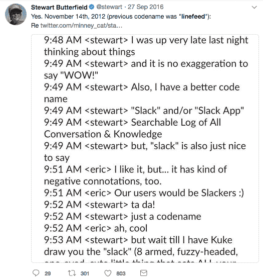
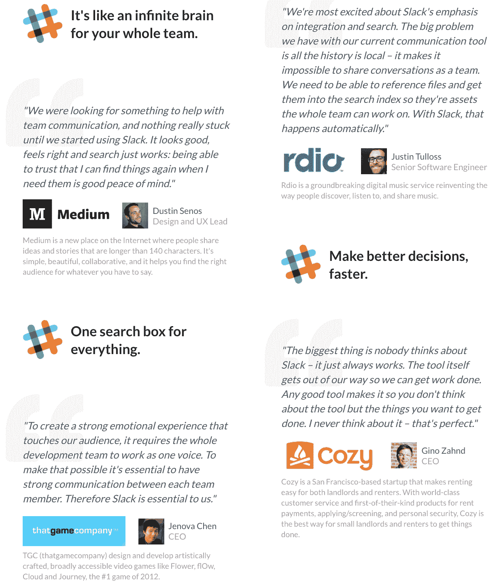
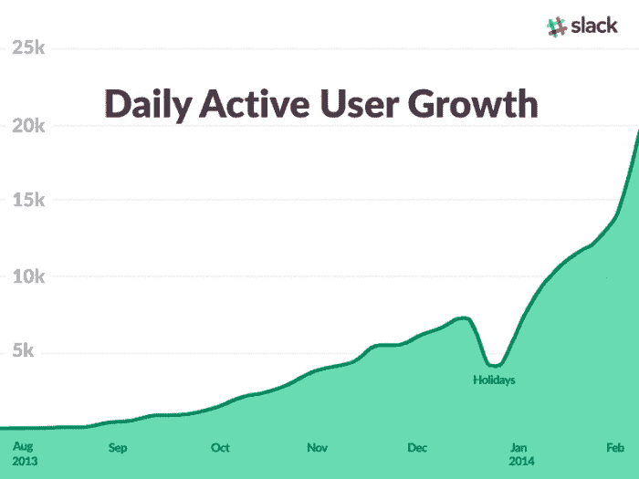
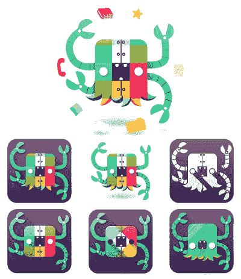
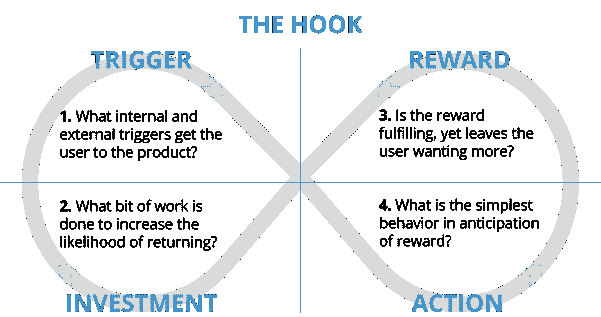
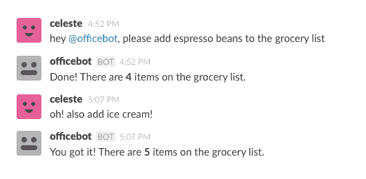
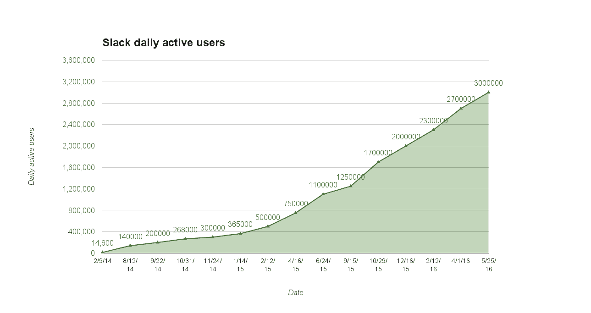
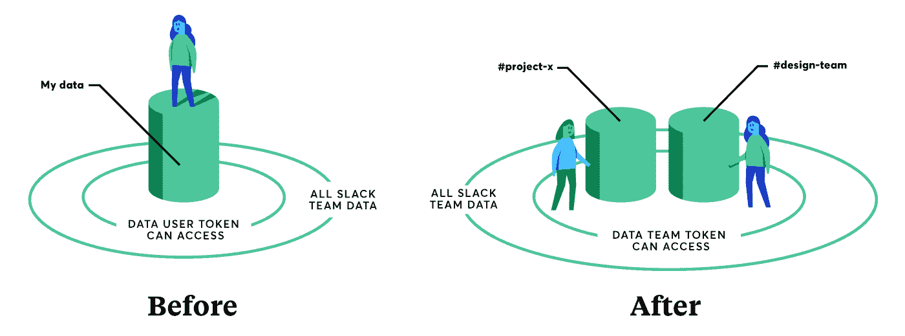
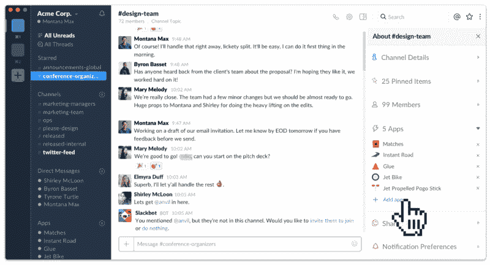

# Slack 是如何通过让工作变得不那么无聊而成为 160 亿美元的生意的

> 原文：<https://producthabits.com/how-slack-became-a-5-billion-business-by-making-work-less-boring/?utm_source=wanqu.co&utm_campaign=Wanqu+Daily&utm_medium=website>

Slack 不仅仅是历史上发展最快的 SaaS 创业公司。它还在短短五年内完成了看似不可能的任务:懈怠让工作变得有趣。

Slack 的口号是“不要那么忙”，但在 Slack 发展的头两年，公司非常忙。最初是出于需要而拼凑起来的内部工具，很快成为世界上最受欢迎的聊天和生产力工具，被财富 100 强中的 77%使用。通过在自己的开发团队中长时间测试 Slack，该公司在向世界展示 Slack 之前就确切地知道了人们是如何使用其产品的——这是一个关键的竞争优势，将 Slack 推向了前所未有的成功高度。

让我们来看看:

*   Slack 是如何出于需要而创建的，并允许公司从一个混乱的游戏产品转向一个流行的、有利可图的生产力工具
*   Slack 对人们在发布前如何使用该工具的理解是一个重要的战略优势
*   为什么围绕 Slack 建立一个生态系统和平台是如此明智的举动

为了理解 Slack 是如何发展起来的，我们需要考察它发展的环境——一个始于一个奇怪的失败的视频游戏的奇怪故事。

## 2009-2013:Glitch 的死亡和 Slack 的诞生

Slack 因仅用了 8 个月时间就达到了 1B 的估值而闻名，它没有在传统广告或首席营销官上花一分钱。然而，大多数人没有意识到的是，Slack 取得了巨大的成功，因为它比其他人领先了多年。Slack 的创始人斯图尔特·巴特菲尔德和他的团队开始为大型多人在线角色扮演游戏 (MMORPG)市场创造新的原创东西。事实证明，它们彻底改变了我们在工作中的沟通方式。

成为历史上增长最快的初创公司并不是 Slack 独一无二的唯一原因。它的产品开发过程是非正统的。Slack 实际上诞生于一家名为 Tiny Speck 的游戏公司。巴特菲尔德和他的团队并没有打算为工作场所创造一个 SaaS 产品。他们为自己制造了一个工具。他们后来才意识到他们工具的商业潜力。

视频游戏开发商可能看起来不像是为今天的工作场所制作一个有粘性、有吸引力的通信工具的最合理的群体，但 Tiny Speck 在游戏方面的专业知识是一个主要的竞争优势。巴特菲尔德和他的团队已经知道如何让重复的任务变得有趣和吸引人，因为这是 MMORPG 类型游戏体验的核心。让基于工作的交流变得有趣和吸引人，将是 Slack 如此大获成功的秘诀。

以下是该公司在 2010 年至 2013 年间发生的几件大事:

*   2010 年:在由 Accel Partners 牵头的 A 轮融资中，Tiny Speck 筹集了 500 万美元。
*   2011 年:在由 Accel Partners 和 Andreessen Horowitz 牵头的 B 轮融资中，Tiny Speck 融资 1070 万美元。Glitch 将于 9 月 27 日正式发布。11 月下旬，[故障恢复到测试状态](https://web.archive.org/web/20131123155252/http://www.glitchthegame.com/blog/2011/11/30/the-big-unlaunching/)，因此团队可以致力于游戏的几个核心改进。
*   2012 年: Glitch 倒闭了，因为这款游戏未能吸引“足够多的观众”
*   **2013:** Tiny Speck 开始将 Slack(“所有交流和知识的可搜索日志”的首字母缩写)开发为商业产品。截至 5 月，总共有大约 45 家公司在使用 Slack。8 月，Slack 在“预览版”测试阶段发布。该公司有意避免将其预览版称为测试版，担心“测试版”一词暗示该产品有问题且不稳定。Slack 将于年底面向桌面、iOS 和 Android 发布。

2009 年，Flickr 联合创始人斯图尔特·巴特菲尔德和他的公司 Tiny Speck 正在努力开发一款名为 Glitch 的 MMORPG。

格林奇不同于任何一个 MMORPG。首先，这款游戏缺乏战斗技巧。暴雪娱乐公司的《魔兽世界》风靡一时，其特点是交战派系之间的奇幻战斗，在这种类型中，格林奇的非暴力方式无疑是独一无二的。游戏设定在 2D 的幻想世界，发生在 11 个古老的、做梦的巨人的头脑中。Glitch 的超现实主义景观、富有想象力的角色设计和广泛的定制选项受到了游戏中人数不多但忠诚的追随者的欢迎。用巴特菲尔德自己的话来说，格林奇就像“巨蟒和苏斯博士在迷幻药上的交叉”

微小的斑点不仅仅是巴特菲尔德公司的一个聪明的名字。构建 Glitch 的开发团队只有四个人，分散在纽约、旧金山和温哥华。为了克服跨时区沟通的挑战，Butterfield 和他的团队使用了互联网中继聊天(更好地称为 IRC)，这是一种在 20 世纪 80 年代末和 90 年代初非常流行的在线聊天工具。IRC 在一段时间内很好地服务了 Glitch 的开发者。然而，没过多久，巴特菲尔德和他的团队就觉得 IRC 已经不能胜任这项任务了。他们需要更多的东西。

就在那时，他们决定开始开发自己的通讯工具。

很难说 Tiny Speck 是从什么时候开始组装其内部的“类 IRC”工具的，这个工具最初叫做 Linefeed。巴特菲尔德和他的团队在向世界展示他们的发明之前，有可能领先了两年。然而，我们确实知道，该工具的开发最初是在微小斑点团队继续研究 Glitch 时开始的。

至少在最初，巴特菲尔德没有计划将 Tiny Speck 的内部聊天工具开发为商业产品。相反，该团队在开发游戏的过程中不断调整和改进其新生的通信工具。临时添加了新功能。如果一个开发人员需要与同事分享设计规范，他们会构建一个功能来处理它。当团队明确需要能够找到旧邮件时，他们构建了一个归档搜索工具。

除了在发现需要时引入新功能，Butterfield 和他的团队在开始构建他们的内部聊天工具时有两个优势。首先，尽管 IRC 很流行，但它仍然相对难以使用。要加入一个 IRC 频道，你必须首先连接到一个特定的服务器，这个过程并不总是有效。其次，IRC 在调整设置时为用户提供了惊人的精细度。然而，IRC 的老派用户界面掩盖了许多这种先进而有用的功能，这使得 IRC 的学习曲线相对陡峭，即使对于精通技术的用户来说也是如此。

Slack 和 IRC 的最大区别之一是 Butterfield 和他的团队将他们的工具设计成完全异步的。用户可以注销，当他们重新登录时，他们的消息会一直等着他们——这是 IRC 不可能做到的。巴特菲尔德和他的同事是老派的互联网 1.0 人。他们知道 IRC 擅长什么。然而，更重要的是，他们知道 IRC 的不足之处。这对他们未来的产品更有价值。

2010 年，Tiny Speck 在由 Accel Partners 和 Andreessen Horowitz 牵头的 A 轮融资中筹集了 500 万美元。Tiny Speck 正在为定于 2010 年 12 月发布的 Glitch 测试版而努力，Butterfield 计划用他的 A 轮融资来扩大公司在旧金山和温哥华的业务。一年后，Tiny Speck 在 B 轮融资中又融资 1070 万美元，同样由 Accel Partners 领投。仅仅一年时间，微小的斑点就筹集了将近 1600 万美元。

这充分说明了投资者对巴特菲尔德的领导能力、他的团队的血统以及 Glitch 作为产品的可行性的信心。巴特菲尔德已经从他的游戏开发努力中分离出一个受欢迎的业务——图像共享服务 Flickr，巴特菲尔德在 2005 年以令人瞠目结舌的 3500 万美元将其出售给雅虎——投资者相信他可以再次做到这一点。

第二年，当 Glitch 的开发被取消时，这些希望破灭了。

在宣布 Glitch 即将关闭的博客文章中，Tiny Speck 哀叹游戏未能获得足够的牵引力和新玩家。这款游戏的非暴力、超现实主义玩法在 Glitch 的核心观众中很受欢迎，但在更广泛的 MMORPG 社区中的吸引力非常有限，这正是因为这款游戏有意挑战这种类型的传统。然而，吸引新用户并不是 Glitch 的唯一问题。Glitch 是使用 Adobe Flash 构建的，这种 Flash 已经在在线游戏开发中流行了好几年，在 Glitch 开始开发时被认为是行业标准。

然而，到 2012 年， [Flash 已经失宠](https://www.gamasutra.com/view/news/182287/The_story_of_Glitch_Why_this_odd_MMO_is_shutting_down.php)。从游戏的渲染引擎到网络代码，Flash 不可避免地与 Glitch 的每个结构交织在一起。由于 Glitch 几乎完全依赖于 Flash 架构，Butterfield 和他的团队无法将他们基于浏览器的游戏移植到任何其他平台，这严重限制了游戏的潜在受众。在 Glitch 关闭时，Tiny Speck 有 45 名全职员工， [Butterfield 竭尽全力为他新失业的开发人员寻找新工作。](https://medium.com/@tylerya/from-tiny-speck-to-slack-97793546ff45)

然而，格林奇的告别帖子也不全是坏消息。在关闭声明后的一个常见问题部分，Tiny Speck 透露并没有失去一切。该公司不会遭受格林奇的命运。

> “我们开发了一些独特的信息技术，用于游戏世界之外的应用，一个较小的核心团队将致力于开发新产品。但现在不是谈论这个的时候。”

又过了六个月，Tiny Speck 才向世界展示了它的“独特信息技术”。当它出现时，它永远地改变了工作场所的交流。

尚不清楚巴特菲尔德是何时以及如何决定从故障转向后来变得松弛的。我们可以确定的是，微小的斑点在 2013 年初开始真正发展。到 3 月份，公司已经有了 Slack 的一个粗略但功能正常的原型，团队开始广泛使用它。

然而，尽管 Tiny Speck 在内部使用 Slack 几个月了，使用它的团队仍然只有少数人。为了不断改进产品，Tiny Speck 需要更多的用户。巴特菲尔德和他的团队开始四处打听，并从其他公司的朋友那里寻求帮助，包括租赁管理软件 Cozy 和音乐流媒体服务 Rdio。

> “我们恳求并哄骗我们在其他公司的朋友试用它并给我们反馈。我们以这种方式找到了大概 6 到 10 家公司。”–[斯图尔特·巴特菲尔德](https://sumo.com/stories/slack-marketing)

[Source: Sumo](https://sumo.com/stories/slack-marketing)

Butterfield 很快意识到，尽管 Slack 在内部很好地服务了他的小团队，但是随着使用该产品的团队越来越大，使用该产品的动力和体验发生了巨大的变化。在三到四人的小团队中运行良好的功能在 10 人或更多的团队中变得笨拙。Butterfield 和他的团队仔细听取早期采用者的反馈，在他们进行的过程中调整和完善产品。

许多初创公司将所有精力都集中在尽可能快的增长上。相比之下，Slack 专注于稳步增长*。每次公司收到关于 Slack 的新反馈，他们不仅会根据这些反馈解决或实现变更，还会邀请更多的大型团队来尝试该产品。这种迭代开发方法帮助 Tiny Speck 基于人们的实际使用方式构建了一个可靠的产品*和*逐步扩大其用户群。*

 *有两个因素让懈怠变得不可抗拒:

*   **透明度。**在 Slack 出现之前，员工除了起身走向另一个部门的同事之外，无法看到其他团队的其他人正在做什么。Slack 改变了这一切，它不仅允许团队看到他们在做什么，还允许他们访问围绕项目、团队甚至整个部门的所有通信的持久记录。
*   **集权。【Slack 如此受欢迎的第二个因素是，它既能集中通信，又能防止用户分心。用户现在可以依赖 Slack 来完成这三项功能，而不是使用 Slack 来聊天、使用 Dropbox 来共享文件、使用 Outlook 来发送电子邮件。这消除了在多个程序之间切换和将通知限制在一个应用程序上的干扰。**

尽管 Slack 评估的大部分反馈都是定性的，Butterfield 和他的团队并没有忽视定量指标。巴特菲尔德很快就找到了他的北极星度量标准:发送的信息。准确的说是 2000 条信息。Slack 团队知道团队开始看到 Slack 的潜在价值需要时间。如果用户通过 Slack 发送了一定数量的消息——整个团队总共发送了 2，000 条消息——butter field 和他的开发人员很有信心地知道，这个团队真的让 Slack 通过了测试。

然而，真正的启示是，当团队超过发送 2000 条消息的阈值时，保留率飙升。

> “对于一个大约 50 人的团队来说，这意味着大约 10 个小时的信息。对于一个典型的 10 人团队来说，这可能是一周的信息。但是我们突然意识到，不考虑任何其他因素，在 2，000 条消息之后，93%的客户今天仍然在使用 Slack。"

2013 年 5 月，Slack 终于为它的大揭露做好了准备。Tiny Speck 决定将 Slack 的测试版命名为“预览版”,因为担心“测试版”一词意味着该产品会有问题且不稳定。与 Spotify 类似，Slack 选择了只接受邀请的增长模式。Slack 预览版发布的第一天，就有 8000 人请求 Slack 的邀请。一周后，超过 15000 人请求访问。

Slack 的“预览版”并不是测试版。该产品在当时基本上是公开的。他们花时间闭门造车，避开窥探的目光，让他们有空间专注于产品。早期发展的那个时期对 Slack 的早期流行和不可思议的初期增长至关重要。

巴特菲尔德和他的团队在 Slack 向世界公布之前就知道它是有效的，而且他们已经很了解他们的客户是如何使用该产品的。到 Slack 发布预览版时，该公司终于准备好开始大举扩张了。

## 2014-2016:公开发布，快速增长

Slack 花了很多时间闭门开发一款强大的产品。到 2014 年，如果 Slack 希望保持已经建立的势头，时间是一种奢侈，它再也负担不起了。Slack 需要更多的用户——它将通过利用免费增值模式吸引尽可能多的用户。

Slack 实现雄心勃勃的增长并不像其他 SaaS 公司那样简单。与类似产品不同，Slack 不仅仅需要说服个人用户试用它，公司还需要说服整个团队。更复杂的是，没有两个团队有完全相同的需求。对一个团队来说很重要的特性对另一个团队来说可能完全是多余的。

Slack 面临的另一个挑战是[克服个人异议](https://www.fastcompany.com/3041905/slacks-founder-on-how-they-became-a-1-billion-company-in-two-years)。如果一个 9 人的工程团队中有 8 名工程师喜欢 Slack，但有一名孤独的拒绝者讨厌它，那么这个团队就不太可能采用 Slack。这个关键的弱点，加上向整个团队而不是个人出售 Slack 的独特压力，使得团队中的*每个人*都必须买进。这意味着要仔细听取所有用户的反馈，以确保产品尽可能的有用和有粘性。

> “对大多数公司来说，最难的事情是让产品足够好，每次能说服一个人转而使用它。我们必须说服一个团队，没有两个团队是一样的。”

巴特菲尔德和他的团队面临的另一个难题是人们如何看待聊天信息。据 Butterfield 称，大约有 20-30%的 Slack 用户从另一个消息系统迁移到 Slack，如 Campfire 或 HipChat。其余的人甚至没有把聊天和信息作为一个独立的软件类别。Butterfield 知道这些用户必须使用某种东西进行内部通信，但他们甚至不知道他们需要一个集中式通信系统。

这是 Slack 要克服的一个重大障碍，但也代表了一个巨大的商机。如果 Slack 不仅能创造出一个全新的 B2B 软件类别，还能把自己定位在这个新类别的顶端，那么 Slack 就能比任何人都更早地抢占一个新兴市场的巨大份额。

*   2014 年: Slack 于 2 月公开发布。8 月，Tiny Speck 正式更名为 Slack Technologies。今年 4 月，Slack 筹集了 4280 万美元，作为由社会资本牵头的 C 轮融资的一部分。10 月，该公司在由 GV 和凯鹏华盈(Kleiner Perkins)牵头的 D 轮融资中又融资 1.2 亿美元。
*   2015 年: Slack 在由社会资本牵头的 E 轮融资中再融资 1.6 亿美元。三月份， [Slack 证实其中央数据库在二月份的一次对公司系统的攻击中遭到破坏](https://slackhq.com/march-2015-security-incident-and-the-launch-of-two-factor-authentication-3cdcc8efba29)。作为回应，Slack 为团队所有者引入了双因素认证和密码“终止开关”。

Slack 于 2014 年 2 月正式公开推出。几个月后的 8 月，Tiny Speck 正式更名为 Slack Technologies。2014 年 4 月，上市仅 10 周后，Slack 筹集了 4280 万美元，作为由社交资本牵头的 C 轮融资的一部分。当时， [Slack 的日活跃用户超过 60，000 人](https://techcrunch.com/2014/04/25/stewart-butterfields-collaboration-app-slack-raises-42-75m/),付费用户超过 15，000 人，这一切都是有机增长。

Slack 已经吸引了媒体和科技行业的一些重量级人物，包括 BuzzFeed、Heroku、Medium、Lonely Planet 和 SoundCloud，关于 Slack 的炒作迅速蔓延，进一步加速了增长。该公司希望利用这一势头及其 C 轮融资进一步扩大其用户群。

Slack 快速、持续增长的关键在于公司的采用方式。巴特菲尔德和他的团队敏锐地意识到向团队而不是个人销售产品的困难。为了解决这一问题，他们通过几乎消除风险和将财务成本保持在最低水平，尽可能减少采纳过程中的摩擦。

如果 Slack 在一个团队中很受欢迎，那么它的付费计划是如此便宜，以至于经理们可以只为他们自己的团队花费 Slack，即使公司还没有准备好在组织层面上采用 Slack。这使得团队可以很容易地免费使用 Slack，而免费增值产品中的限制足以让 Slack 的付费计划更具吸引力。

截至 2014 年 10 月，3 万个团队每月通过 Slack 发送超过 2 亿条消息。该公司在 10 月份的 D 轮融资中额外筹集了 1.2 亿美元，由谷歌风投和凯鹏华盈(Kleiner Perkins Caufield & Byers)牵头。到目前为止，Slack 已经筹集了超过 1 . 8 亿美元——考虑到该产品退出测试还不到一年，这是一个惊人的数字。同样令人惊讶的是 Slack 的增长速度。

然而，真正打动 Slack 投资者的是该公司将免费用户转化为付费用户的速度。当 Slack 进入 D 轮融资时，它已经拥有超过 73，000 名付费用户——在短短六个月内增长超过 386%——以及超过 100 万美元的月经常性收入。

> “作为一个全新产品类别的领导者，我们现在拥有巨大的优势。接下来的 6 到 18 个月将是增长的关键，这轮融资给了我们无限的灵活性，以确保 Slack 的势头将继续加快。”**–斯图尔特·巴特菲尔德**

从一开始，Slack 就认真听取用户的意见，评估几乎所有的客户反馈。然而，Slack 不仅仅是听取用户对产品特性的意见。与许多初创公司不同，Slack 已经有一个由三人组成的小型客户体验团队，在推出时全职工作，以支持新用户。这不仅仅是一个增加留存率的策略，而是 Slack 花时间真正改善用户体验以推动增长的另一个例子。到 2015 年，Slack 的客户体验团队将增加到 18 名全职员工，包括 6 名通过 Twitter 提供 24/7 支持的人员。

Slack 在 2014 年至 2015 年间的出色增长几乎总是被忽视的一个方面是，Slack 不仅打造了一个坚实的产品——它还围绕该产品打造了一个坚实的*品牌*。Slack 运行得非常好，但该产品的成功不仅在于功能，也在于乐趣。

从一开始，Slack 就有意创造一种不同于传统电子邮件或 IRC 的体验。特别是，Slack 活泼、多彩的美学让该产品有别于微软等公司竞争产品单调、实用的界面。Slack 的设计师希望创造一个独特的视觉品牌，以补充产品本身的使用感受。

[Source: Sitepoint](https://www.sitepoint.com/slack-story-son-glitch/)

Slack 的工作方式、外观和感觉都与企业通信工具的传统智慧背道而驰。Slack 的界面生动活泼，不像传统工具喜欢的灰色和蓝色。用户不局限于基于文本的回复，Slack 对表情符号的支持非常受欢迎。使用 Slack 很有趣，甚至是最好的电子邮件客户端都不敢奢望的事情。Slack 的 brandmark，格子标签图标，反映了该工具的社交敏感性，并成为 Slack 品牌其余部分的强大门户。Slack 的命令式标语“不要那么忙”，完美地抓住了品牌的本质。

就连产品的名字都是对工作中偷懒这一想法的大胆、自我暗示，同时也是一个主动动词，是品牌本身的延伸。虽然 Slack 的独特品牌是一个关键的视觉差异，但它也有助于进一步提高参与度。如果使用 Slack 很有趣，人们会更有可能继续使用它。

Slack 不仅仅是一个可靠的团队沟通工具，它还很酷。

> “我们从未见过如此多的用户喜欢企业软件平台。减少电子邮件，生活会变得更美好。”**–约翰·杜尔登，凯鹏华盈**

然而，美学和表情符号不足以维持 Slack 雄心勃勃的增长轨迹。Slack 成功地吸引了新用户，但是，正如许多企业发现的那样，留住这些用户比一开始就吸引他们更具挑战性。

Slack 通过两种方式非常巧妙地留住用户。第一个是通过利用“挂钩模型”来鼓励用户投资 Slack。用户在空闲时的每一个动作，都会让他们对产品投入更多。每一条发送的信息，每一个上传的文件，每一个分享的 gif 回复都会推动用户的购买。有人越是使用 Slack，他们就越是投入其中。这在一定程度上使得 2，000 条消息在 Slack 的早期发展中成为如此重要的指标。将这种逐渐的用户认同与来自同行的社会认可的间歇性回报结合起来，Slack 变得越来越容易上瘾，从而显著提高了保留率。

[Hooked: How to Build Habit-Forming Products, Source: Nir Eyal](http://nirandfar.com/gethook)

Slack 聪明地管理保留的第二个方法是避免在其付费计划背后增加额外的功能。与其他企业通信工具相比，Slack 的免费增值层和其付费产品之间几乎没有什么有意义的区别。唯一真正的区别是可以被索引和搜索的消息数量，以及可以连接到多少集成团队。

通过向免费增值用户提供 Slack 的大部分功能，Slack 对有兴趣尝试该产品的中小型团队变得更具吸引力，而 Slack 低廉的付费等级使得从免费增值升级到付费计划从成本角度来看几乎微不足道。

到 2015 年 4 月， [Slack 的市值几乎达到了 3B](https://techvibes.com/2015/03/26/slack-28-billion-2015-03-26) 美元。它的日活跃用户超过 75 万，其中 20 万是付费用户。这款产品已经发展出了一批前所未闻的企业通信工具追随者。Slack 现在需要做的是从一个时髦的小众软件产品转变为公司办公文化的主流部分。

要做到这一点，Slack 必须不仅仅是一个产品。它必须成为一个平台。

## 2016 年至今:Slack 成为主流，构建 Bot 生态系统

到 2016 年，Slack 不仅成功创造了一个全新的软件类别(至少在许多用户眼中)，还通过制造一款让用户满意的产品，将自己定位在这个新兴市场的前沿。然而，正如巴特菲尔德和他的团队很快发现的那样，即使是一个惊人的产品也只能带你走这么远。人人都爱懈怠。当人们喜欢某样东西时，他们会复制它。

认识到达到饱和点是不可避免的，Slack 开始想办法推动进一步增长，而不仅仅依靠用户增长。具有讽刺意味的是，它将通过允许用户创建自定义机器人来回归 Web 1.0 的根基，就像 90 年代早期的铁杆 IRC 用户所做的那样。

Slack 在 2014 年公开推出后不久就首次试验了机器人。发现自己需要一种方法来做笔记以备日后查阅，巴特菲尔德开始编写一个程序，将自己的笔记作为消息发送到只有巴特菲尔德才能访问的私人频道。这个程序成为了 Slackbot，Slack 最受欢迎和最常用的功能之一。巴特菲尔德后来说，Slackbot 的想法来自 Glitch 中的宠物石，这是一个友好、有益的非玩家角色，为玩家提供如何推进任务和导航 Glitch 游戏世界的提示和技巧。

事后看来，Slack 从产品到平台的转变是不可避免的。然而，在 2016 年，Slack 成为自动化机器人平台的想法显然是一个冒险的提议。一方面，Slack 让用户能够让 Slack 更具可扩展性。另一方面，这种方法依赖于个人和公司在 Slack 上集成和构建新产品——这超出了 Slack 的控制范围。尽管存在风险，Slack 还是在它的应用和机器人生态系统上下了大赌注。该公司的 [Slack Fund](https://slack.com/developers/fund) ，由 Slack 和该公司的一些主要投资者管理的投资基金，已经投资了超过 8000 万美元，以鼓励新机器人、应用程序和 Slack 集成的开发。

*   **2016:**3 月，Slack 推出语音通话。次月，Slack 筹集了 2 亿美元，作为由 Thrive Capital 牵头的 F 轮融资的一部分。9 月，Slack 在《福布斯》云 100 强榜单中排名第一。10 月，Slack 与 IBM 合作，将 IBM 的机器学习超级计算机沃森的认知处理应用于 Slack 的协作工具和机器人，包括 Slackbot。12 月，Slack 推出视频聊天。
*   **2017:** 今年 1 月，Slack 推出了[线程消息](https://slackhq.com/threaded-messaging-comes-to-slack-417ffba054bd)，这是一项期待已久的功能，可以更容易地搜索和促成不同渠道的嵌套对话。9 月，Slack 筹集了 2.5 亿美元，作为软银牵头的 G 轮融资的一部分。当月晚些时候，Slack 宣布对法语、德语和西班牙语选项的本地支持。不久之后，Slack 引入了跨公司通信，这是另一个非常受欢迎的功能。
*   2018 年:Slack 已经筹集了总计 7.9 亿美元的风险投资资金，估值超过 50 亿美元，并任命长期员工艾伦·希姆(Allen Shim)为其第一任首席财务官。

Slack 在 2016 年 3 月推出语音通话时，已经是一家企业巨头。然而，尽管引入语音通话等功能几乎是不可避免的，但 Slack 正面临着来自竞争对手的越来越大的压力，如 Atlassian 的 HipChat 和微软的 Teams 产品。次月，Slack 在由 Thrive Capital 牵头的 F 轮融资中又融资 2 亿美元。这使得 Slack 的风险投资总额达到惊人的 5.4 亿美元，估值达到 28 亿美元

> “一如既往，随着我们继续执行我们雄心勃勃的增长计划，我们将借此机会进一步巩固我们的领导地位。”**–斯图尔特·巴特菲尔德**

Slack 似乎势不可挡，在 E 轮和 F 轮融资之间，它的用户群增加了 3.5 倍。截至 2016 年 4 月，Slack 拥有 270 万日活跃用户，80 万付费用户，430 名员工。越来越大的团队依赖 Slack 进行大部分内部通信，包括全球商业情报出版商道琼斯、联邦航空管理局和美国国务院。Slack 将在 2016 年底推出另一项新功能——视频聊天。

然而，尽管取得了惊人的增长并积累了大批忠实粉丝，Slack 在核心功能方面仍有许多工作要做。首先，信息传递的方式还有很多不尽人意的地方。在 Slack 于 2017 年 1 月推出其改进的[线程消息功能](https://slackhq.com/threaded-messaging-comes-to-slack-417ffba054bd)之前，定位旧消息远不像今天这样直观。

如果用户未能创建帖子(Slack 对线索化对话的旧称)，他们在事后根本不能这样做。这意味着要找到旧邮件要困难得多，更不用说对它们进行评论了。即使是现在，Slack 的线程也缺少一些用户已经熟悉并喜爱的功能。大多数斜杠命令在主题对话中仍然不被支持，你也不能在主题回复中添加图片(尽管你*可以*使用表情符号)。这不仅令人恼火——对于依赖截图(比如客户支持团队)或代码片段进行交流的团队来说，这是一个严重的缺陷。

Slack 在 2016 年和 2017 年做出的许多举措不仅仅是推出预期的产品功能。Slack 不得不巩固其在市场上的主导地位。Skype 等竞争产品从未对 Slack 构成严重威胁，但该公司不能冒险让竞争对手危及其增长。2016 年，Slack 在《纽约时报》上刊登的欢迎微软上市的整版广告——苹果在 1981 年发布的嘲弄 IBM 的广告对[是一个厚颜无耻的眨眼——是 Slack 品牌声音发挥作用的一个很好的例子，但它也揭示了 Slack 并不像一些人想象的那样防弹。](https://www.flickr.com/photos/dullhunk/5405231875)

Slack 令人难以置信的增长势头在 2017 年全年持续，并在 9 月份的另一轮令人震惊的融资中达到高潮，当时软银为 Slack 的 G 轮融资提供了 2.5 亿美元。同月，Slack 引入了对法语、德语和西班牙语语言选项的支持，进一步拓宽了英语地区以外的潜在市场。然而，2017 年 Slack 最大的变化之一是引入了允许不同公司的用户加入共享频道的功能。Slack 用户第一次可以和自己的团队以及其他公司的朋友聊天。从商业角度来看，这个功能的效用有限，但作为一个社交网络功能，它非常受欢迎。

2018 年 2 月，Slack 聘请了第一任首席财务官艾伦·希姆(Allen Shim)，他是该公司任期最长的员工之一。任命希姆为首席财务官是可以预见的，也是必要的。当希姆被提升为首席财务官时，Slack 的价值已超过 50 亿美元，并获得了近 8 亿美元的风险投资。它的日活跃用户超过 600 万，付费团队超过 5 万个，每月经常性收入为 2 亿美元。

> “这些变化体现在我们的成果和我们利用未来机会的意愿上。我们希望继续建立一项业务，为我们不断增长的全球用户群提供长期服务，将艾伦提升为首席财务官是实现这一目标的重要一环。”**–斯图尔特·巴特菲尔德**

鉴于这样的数字，问题不是 Slack 是否会上市，而是何时上市。Slack 在企业产品方面取得了几乎难以想象的成功，但其最大的挑战仍然是其付费计划之外的货币化。这就是 Slack 从产品到平台的转变如此巧妙的原因。Slack 已经取得了令人难以置信的增长，但在其核心产品之上创建一个由机器人、应用和集成组成的生态系统是非常聪明的。这为 Slack 提供了超越其核心产品的货币化手段，并产生额外的收入流。

## Slack 将何去何从

在实现了真正的飞速增长之后，Slack 仍然有很多选择。Slack 将何去何从？

对应用的重新关注。目前正在开发的 Slack API 最令人兴奋的应用之一是[一个访问令牌系统](https://medium.com/slack-developer-blog/looking-to-the-future-of-apps-in-slack-c2633df0bcb7)，它将允许用户将应用和集成连接到整个团队或工作区，而不是单个用户。应用程序关键数据不是孤立的，当数据用户离开团队时，可能会发生权限冲突。这不仅仅是 Slack 现有功能的逻辑延伸，也是一个潜在的重要竞争优势。

Slack 目前正在探索的另一个令人兴奋的开发是团队如何在现有的工作空间内访问应用程序并与之交互。Slack 正在 Slack 主侧边栏中开发一个新的应用子菜单，它将把用户带到 Slack 中的一个专用空间，在那里他们可以了解更多关于应用如何工作的信息。这具有巨大的潜力，因为团队可以有效地创建关于如何使用应用程序的完整学习资源，而不会留下任何懈怠。

更多的机器人，更多的人工智能，更多的智能。Slack 最近在旧金山[举行了第一次开发者大会，Spec](https://slackhq.com/introducing-spec-slacks-first-developer-conference-26736fc6f92c) 。应用成为了会议的焦点，凸显了 Slack 进一步围绕应用和集成构建生态系统的承诺，但 Slack 在机器学习和人工智能方面的投资可能会透露 Slack 的未来计划。Slack 在 2016 年初聘请了谷歌前产品经理诺亚·韦斯(Noah Weiss)从事几个人工智能项目。从那以后，韦斯和他的团队一直在努力将更多的人工智能功能集成到 Slack 中，特别是关于通知和更新的智能过滤。随着用户越来越多，数据也越来越多，Slack 希望人工智能可以帮助用户区分信号和噪音，这是基于韦斯称之为“[工作图](https://www.technologyreview.com/s/609319/slack-hopes-its-ai-will-keep-you-from-hating-slack/)的概念

与谷歌的知识图类似，Slack 的工作图分析了 Slack 用户在一个组织内如何相互交流，这些群体中的大多数讨论发生在哪里，以及哪些主题是最重要的。韦斯的最终目标是创造人工智能驱动的机器人，它们非常智能，可以充当虚拟助手，帮助 Slack 用户优先处理他们的任务，并最大限度地减少不必要的聊天。看来 Slack 很可能会继续致力于开发和集成新的机器人和人工智能技术。

**重新关注企业。** Slack 在 2017 年推出了企业网格。从 Capital One 到 IBM，数十家世界上最大的公司都依赖 Slack 的企业网格。然而，如果 Slack 希望保持对微软和脸书等竞争对手的竞争优势，它就不能躺在功劳簿上。出于这个原因，Slack 将继续开发其现有的企业解决方案是合乎逻辑的，包括其一系列专门的法规遵从性产品，如 [Slack 面向医疗机构的 HIPAA 遵从性产品](https://slack.com/security)。Slack 已经[了几个新的企业功能](https://www.computerworld.com/article/3224458/collaboration/whats-coming-next-for-slack-plenty.html)，包括新的安全和管理控制，一个频道管理功能，以及即将发布的“统一工作空间”

## 我们可以从 Slack 中学到的 3 个教训

Slack 可能是硅谷已经传奇的“独角兽创业公司”中最神秘的一个，但企业家仍然可以从 Slack 中学到很多东西——不要把所有的希望都寄托在发明一种全新的 B2B 软件上。

### 1.关注你的客户永远不会太早。

在尽快达到产品市场契合度或规模的竞赛中，许多初创公司无法理解从第一天起就关注客户的价值和重要性。这种对客户如何实际使用 Slack 的高度关注是该公司快速发展的基础。看看您当前的产品路线图，然后问自己以下问题:

您是否从使用报告中获得了所需的信息？Slack 可能不会对早期采用者的每一条反馈都采取行动，但它会评估开发早期产品时收到的几乎所有反馈。你是否充分利用了你的使用数据？你是在试图说服用户他们需要你正在开发的新功能，还是在给用户他们想要的东西？

**围绕产品的信息是规范性的还是响应性的？**换句话说，谁在真正推动你产品的发展——你，还是你的用户？在早期，Slack 花了几个月的时间*真正地*检查它的用户如何与产品的早期版本交互——这是在 Slack 团队吃了一年或更长时间他们自己的狗粮之后。这种快速响应的产品开发方法允许 Slack 在成长过程中快速迭代用户反馈，这反过来允许它在产品改进时邀请越来越大的团队来尝试产品。

你“嫁”给了不受欢迎的功能吗？多年来，我见过无数企业家陷入的一个陷阱是沉没成本谬误。他们花了几个月(甚至几年)开发一个不受欢迎的产品或功能，却发现他们无法放弃这个想法，因为他们已经在这个项目中投入了大量的时间、金钱和精力。关注错误的特征是非常危险的。它不仅浪费了宝贵的资源，如时间、金钱和工时，还会疏远你的用户，他们可能甚至不关心你所关注的功能。你真的开发了正确的功能并解决了正确的用户问题吗？

### 2.知道何时转向。

想象一下，如果 Butterfield 和他的团队没有承认他们项目中的缺陷并转移到其他项目上，而是在 Glitch 上稳步前进。Slack 永远也不会建成，巴特菲尔德的公司是否能生存下来也是个未知数。如果你的产品正在挣扎，是时候问自己一些难题了。

你产品的问题是内在的还是外在的？换句话说，你的产品的问题(内在的)还是一个你无法控制的更广泛的因素，比如一个过饱和的市场(外在的)？Glitch 失败是因为缺乏用户增长——这是一个内在问题——但它也失败了，因为 Glitch 依赖于 Flash，这是永无止境的格式战争中的一个失败赌注，也是一个外在问题。如果你的产品因为内在的困难而举步维艰，你有更多的选择，比如组织的重组或者重新关注产品的其他方面。然而，如果你产品的问题是外在的，也许是时候开始认真思考你的下一步行动了。

你目前的项目有多少是可以挽救的？当 Tiny Speck 在 2012 年关闭 Glitch 时，它已经建立了一个 Slack 的功能原型，该公司一直在内部使用。这使得从失败的游戏产品转向商业通信工具的决定变得更加容易。看看你目前的产品。现在假设你的公司要倒闭了。从您当前的产品中可以挽救多少——如果有的话？你的产品中任何更受欢迎的功能可以作为独立产品使用吗？

你学到的东西有多少可以应用到另一项投资中？ Butterfield 和他的团队在建造超现实主义的 MMORPG 时，可能并没有着手打造一款非常受欢迎的工作场所沟通工具。然而，很明显，不仅 Tiny Speck 的内部工具可以进一步开发成具有令人难以置信的商业潜力的产品，而且该公司作为视频游戏开发商的背景证明有助于使 Slack 变得有趣，以及它如何实际构建其产品。在你目前的企业中积累的机构知识有多少可以应用到另一个商业想法中？如果你能找出至少一两件可以用来打造更好的产品——以及更可行的业务——的东西，那么知道何时转向可能会更容易。

### 3.产品双倍下注。

正如开始考虑你的客户永远不会太早一样，你应该坚持不懈地专注于开发你能制造的最好的产品。Slack 不仅发现了市场中的一个缺口，还专注于制造尽可能最好的产品。思考你的产品或服务，问自己以下问题:

你的产品的哪些特性是你的用户真正喜欢的？对于 Slack 来说，其广泛的集成范围，其命令列表，以及对 gif 和 emoji 回复的支持，都是 Slack 用户所钟爱的。你认为人们会乐意向朋友展示你产品的哪些方面？你如何让这些功能变得更好/更有粘性？

人们对你的产品和品牌的感觉如何？ Slack 很早就知道，要想在一个由 Atlassian 和微软这样的大型老牌公司主导的市场中占据一席之地，唯一的办法就是让产品——以及围绕产品的品牌——变得有趣。人们对你的产品以及你的品牌有什么感觉？你考虑过进行情感分析研究来了解人们对你的产品的感受吗？

你产品的哪些方面好到可以偷？每个人都喜欢 Slack，所以不可避免的是，许多其他公司会模仿(或直接窃取)Slack 的特性，并将其整合到自己的产品中。你产品的哪些特性足够好，以至于另一家公司可能会想“借用”你的想法？你如何能让它们变得更好——并保护你自己在未来不被模仿？

## 改变工作的未来

许多创业公司承诺要颠覆工作世界，但很少有人能像 Slack 那样有效或迅速地做到这一点。超过 600 万人、50，000 个团队和数十家世界上最大、最赚钱的公司都依靠 Slack 来“不那么忙”。现在，Slack 最大的挑战是证明其在工作场所聊天之外的不可或缺性，扩展到新的和具有挑战性的市场，并进一步建立依赖于 Slack 核心产品的生态系统。*