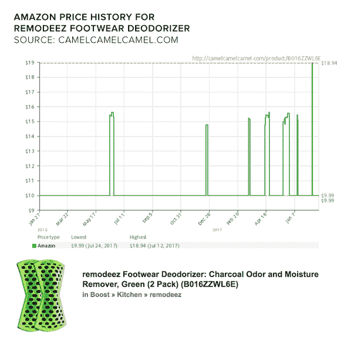
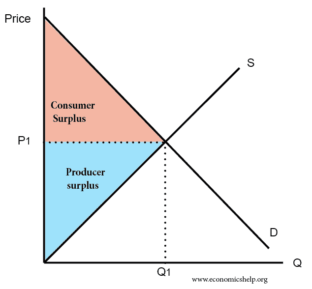
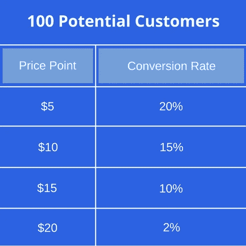
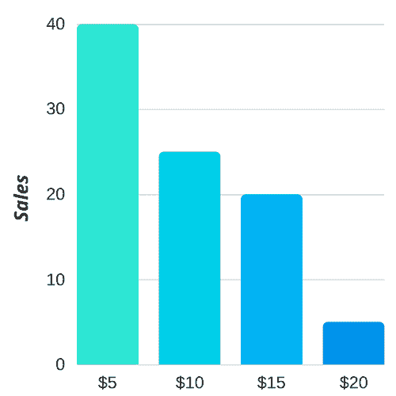
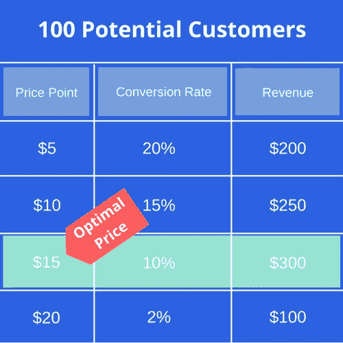
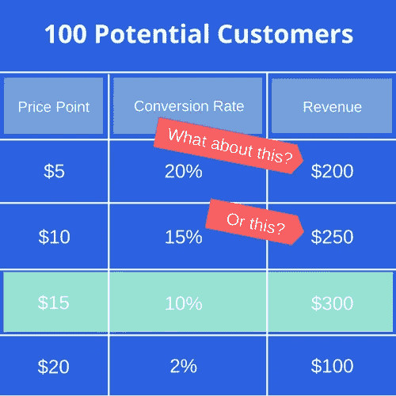
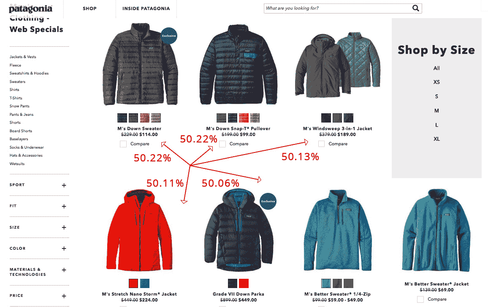
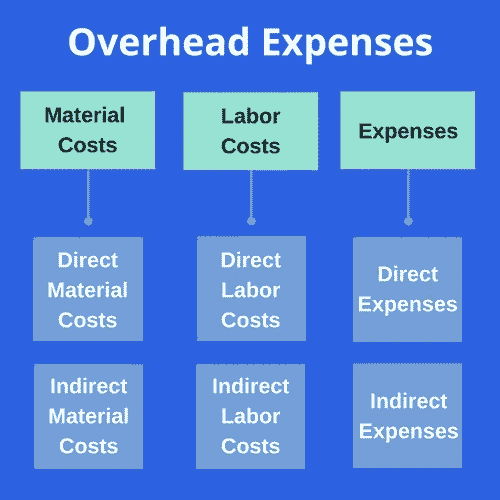
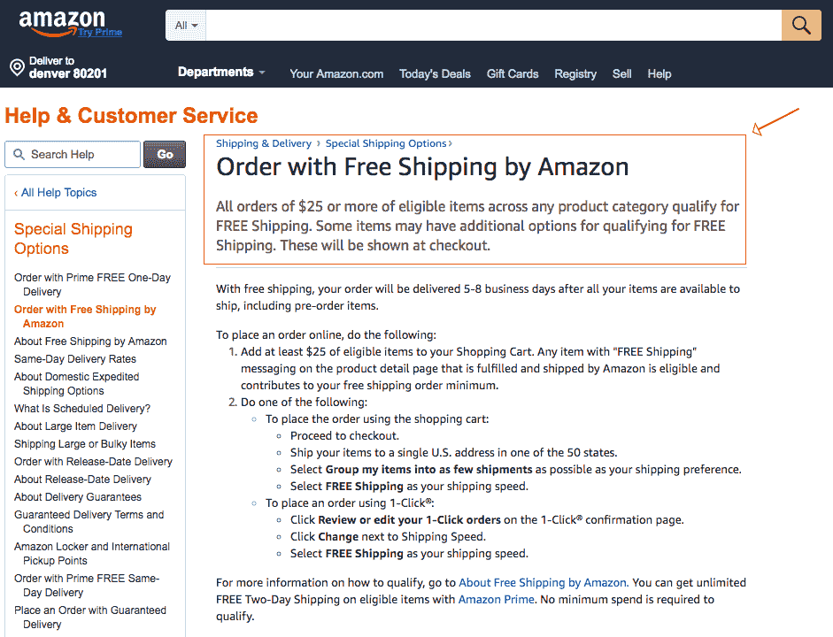

# 如何给产品定价:科学的三步指南(带计算器)

> 原文：<https://sumo.com/stories/how-to-price-a-product?utm_source=wanqu.co&utm_campaign=Wanqu+Daily&utm_medium=website>

产品定价是决定你的网上业务成功与否的一个重要因素，然而电子商务企业家和企业往往只把定价作为事后的想法。他们解决并使用脑海中出现的第一个价格，模仿竞争对手，或者(更糟)猜测。

人类是非理性的。产品定价策略既是一门科学，也是一门艺术。

今天，我将从科学的角度为你的产品定价。

关于定价的*艺术*有很多资源，但是这个循序渐进的指南将为你提供为你的产品创建一个可靠的、有数据支持的定价结构所需的**工具和策略。**

有很多基于人类心理学研究的产品定价策略。

例如，以 9 或 5 结束你的价格被称为“**魅力定价。**“数以百万计的企业已经使用[魅力定价来为他们的产品定价](https://sumo.com/stories/marketing-pricing-strategies)，事实证明这可以增加销售额。

或者还有“**100 法则，**”这是一个奇妙的心理技巧，无论折扣大小，都能最大化你的折扣感知幅度。根据*100*规则，商家对 100 美元以下的商品使用百分比金额折扣，对 100 美元以上的商品使用美元金额折扣。[*](https://www.thegreatcoursesdaily.com/the-rule-of-100/)

毫无疑问，心理是定价的重要组成部分。

但是让我们来看看科学的方法和策略。遵循以下步骤，为您的产品找到最佳价格。

## **第一步:通过了解你所在行业的常见定价策略找到一个基价**

成千上万的企业家和数十年的学习为新企业制定利用最具创新性的定价方案铺平了道路。

了解哪种定价模式在你的行业中最有效，可以简化你对产品的定价，并让你知道你不是在简单地猜测，从而给你信心。

### **基于成本的定价**

给你的产品定价的最简单的方法之一叫做**成本加成定价**。[*](https://blog.blackcurve.com/what-are-the-most-popular-pricing-strategies-by-industry-sector)

基于成本的定价包括计算生产产品的总成本，然后加上一个百分比加价来确定最终价格。

例如，假设你设计了一个产品，成本如下:

*   材料成本= 20 美元

*   劳动力成本= 10 美元

*   开销= 8 美元

*   **总成本= 38 美元**

然后，将你的加价百分比，比如说 50%(零售行业标准)，加到总成本中，得到最终产品价格为 57.00 美元(38 x 1.50 美元)。如果你从一开始就记得我们的“魅力定价”策略，你可能会把这个产品标为 57.99 美元。

这种方法简单、快速，能让你迅速增加你打算销售的任何产品的利润。

### **市场化定价**

**市场导向定价**也称为基于竞争的定价策略，对市场上的类似产品(竞争)进行比较。

卖家根据自己产品的匹配程度，将价格定得高于或低于竞争对手。[*](https://www.priceintelligently.com/market-oriented-pricing)

*   **高于市场的价格**:有意识地将你的产品定价高于竞争对手，以此来标榜自己拥有更高质量或性能更好的产品

*   复制市场:以与竞争对手相同的价格出售你的商品，在保持竞争力的同时获得最大利润

*   **低于市场价格**:以数据为基准，有意识地给产品定价低于竞争对手，以吸引顾客光顾你的商店

市场导向模式中的上述策略各有利弊。在以市场为导向的定价中，重要的是要了解制造产品的成本，以及与竞争对手相比的质量，以便准确地给产品定价。

### **动态定价**

**动态定价**，也称为需求定价或基于时间的定价，是企业根据当前市场需求为产品或服务设定灵活价格的策略。[*](http://economics.ucla.edu/2017/12/01/dynamic-pricing-strategic-customers/)

换句话说，动态定价是指在一天、一周或一个月内多次改变价格，以更好地符合消费者的购买习惯。

以下是它如何看待电子商务业务的:

不仅仅是像优步这样的服务利用动态定价来实现利润最大化。长期以来，亚马逊一直在黑色星期五和网络星期一等大型电子商务购物日利用最具竞争力的商品涨价。[*](https://www.forbes.com/sites/nikkibaird/2017/04/18/dynamic-pricing-when-should-retailers-bother/#4005fc021be1)

亚马逊的价格波动如此频繁，以至于价格跟踪网站 camelcamelcamel 每天都要查询热门商品的价格几次。[*](https://www.cbsnews.com/news/amazon-surge-pricing-are-you-getting-ripped-off-small-business/)

有大量优秀的软件产品可以帮助你自动对产品进行动态定价，而不会让你倾家荡产。

这些工具允许您通过设定特定的利润来设定具体的定价准则，这将有助于您的电子商务业务保持盈利。

如果你是一家商品或服务企业，你可以根据使用情况动态定价。一种  [基于使用量的计费](https://tridenstechnology.com/usage-based-billing-software/) 方法在公用事业提供商中很受欢迎，在 SaaS 领域也正在迎头赶上。

## **第二步:通过尝试定价(并了解价格弹性)获得更多市场份额**

许多企业陷入了这样的思维陷阱:如果他们降低产品价格，就会有更多的人购买产品，他们的收入就会增加。

> “竞争到底的问题在于你可能会赢。更糟糕的是，你可能会屈居第二。”——塞思·戈丁 [ [*](http://sethgodin.typepad.com/seths_blog/2014/05/the-tyranny-of-lowest-price.html) ]

战略性地降低产品成本确实有好处，并能增加收入。首先，它减少了留在桌子上的钱(消费者剩余)给那些愿意以不同价格购买的顾客。

简而言之，消费者剩余是消费者支付的价格和他愿意支付的价格之间的差额。[*](https://www.economicshelp.org/blog/glossary/consumer-surplus/)

那么，如何在获取更多市场份额的同时最大化利润呢？

你需要了解某个产品在特定价位的销量，以及是什么让你保持盈利。换句话说，你需要了解**价格弹性**。

价格弹性是对特定商品需求数量变化和价格变化之间关系的度量。如果一种产品的需求量随着价格的变化而发生很大的变化，这种产品就被称为“弹性产品”。[*](https://www.investopedia.com/terms/p/priceelasticity.asp)

想象一下，你有 100 个客户购买你的产品:

测试定价后，您发现客户根据产品的价格以不同的比率转换。你还会发现销量随着价格波动:

有了这么少量的数据，您现在可以轻松地计算出每个价格点产生了多少收入。从理论上讲，这是提高您在第一步中计算的“基础”产品价格的好方法:

但是有一个小问题…

那 65 个以 5 美元或 10 美元价格购买的客户呢？

你损失了 450 美元的收入。没有一个理智的企业主想这么做，这就是为什么你需要一个策略来打开这个尚未开发的金矿。

有很多[定价策略](https://blog.prisync.com/ultimate-ecommerce-pricing-strategies/)可以做到这一点，但我最喜欢的三种有利可图的降价策略是**折扣定价**、**亏损领先定价**和**锚定定价**。

### **折扣定价**

折扣定价是一种策略，在这种策略中，商品最初被人为地抬高价格或以更高的价格开始，但随后以对消费者来说似乎更低的价格出售。

一家网上零售店，比如上图所示的梅西百货，可能会在有限的时间内对所有的厨房用品提供折扣价格，以吸引新的顾客并促进销售。

这是一种吸引新顾客的简单方法，这些顾客可能不会以更高的价格购买特定的商品。

确保折扣定价策略对您的企业保持盈利的关键是保持利润率接近 0 美元或略为正值。换句话说，不要为了让顾客上门而打折出售你的产品，结果却发现你在赔钱。

用折扣吸引顾客，将折扣商品的利润率保持在接近 0 美元，然后追加销售或交叉销售商店中的其他商品来实现盈利。

也就是说，除非你想尝试亏本定价....

### **亏本定价**

与战略上的折扣定价类似，亏损领先定价采取了一种风险稍大的方法来吸引购买者。

根据 Inc .的说法，“亏本定价是一种激进的定价策略，在这种策略中，商店以低于成本的价格出售选定的商品，以吸引顾客，根据亏本定价理念，这些顾客将通过额外购买有利可图的商品来弥补重点产品的损失。”[*](https://www.inc.com/encyclopedia/loss-leader-pricing.html)

巴塔哥尼亚是亏本定价的一个完美例子。首先，他们从通过电子邮件和社交媒体推广的“网络特价”页面开始: [ [*](http://www.patagonia.com/shop/web-specials) ]

在调查他们的网络特价商品时，许多商品的售价比正常零售价低 25-75%:

**亏本定价与标准折扣定价**的主要区别在于，企业通常知道，他们不会从亏本销售的商品中获利。这要从深入了解你的产品成本和利润率开始。

使用这种定价策略有助于吸引大量原本会在别处购物的顾客，其中一些人会购买利润率更高的商品。

### **锚定价**

2010 年，史蒂夫·乔布斯在台上宣布 iPad 价格的视频非常棒。

<iframe src="https://www.youtube.com/embed/QUuFbrjvTGw" frameborder="0" allowfullscreen="">视频</iframe>

他委婉地问与会者，他们应该给 iPad 定价多少。

“如果你听听专家的意见，我们会把它定价在 1000 美元以下，也就是 999 美元，”乔布斯说。

999 美元出现在屏幕上，然后他继续…

“我很兴奋地向大家宣布，iPad 的起价不是 999 美元，而是 499 美元。”

在屏幕上，999 美元的价格被下跌的“499 美元”打破了

这是绝对最好的锚定价格。

锚定定价是指你展示你的“常规”价格，然后在商店或网上明显降低该商品的价格。它之所以如此有效，是因为它能帮助你在购物者的脑海中建立一个形象，让他们得到一笔不可思议的交易。

他们一点也不知道，正常的价格是在第一时间制定的！

## 第三步:确保你的产品定价能带来长期的商业利润

在这一点上，你应该对你的产品定价有所了解。

但是我们在这里的工作还没有完成。

为了确保您保持长期的产品盈利能力，您必须分析您当前的业务指标，并设计一个不断试验前进的计划。

### **分析您当前的指标**

上述定价策略为产品定价提供了很好的指导。

然而，你实施的定价策略组合必须产生足够的收入来支付你的**管理费用**，同时也给你留下一点利润来刺激持续增长。

您应该考虑的间接费用包括:

*   租金

*   制造成本

*   设施成本

*   公用事业

*   工作人员薪金和相关费用

*   营销成本

*   专业费用、执照或许可证

*   包装成本

*   运输供应成本

*   网站维护费用

*   个人收入

*   赋税

我建议按月计算你的管理费用。这样，您就可以随时获得准确的运行总数，从而可以根据您的发现主动为您的产品定价。

如果你发现自己每月都在净亏损，你可以迅速做出恢复盈利的决定。

### **尝试定价**

有很多事情会直接影响一个产品的定价。这就是为什么不允许你的定价策略保持不变是很重要的。

随市场波动的价格将有助于增加收入和减少消费者剩余。

以下是你可以尝试定价的三种好方法:

**1。提高畅销书的价格**

我们已经讨论过降低产品价格会导致消费者剩余的减少，那么提高价格也会有类似的积极效果。

如果你的一种或多种产品销量很高，试着提高它的价格。这将增加你的总收入，并让你弥补任何其他产品的不足。

抵消涨价潜在负面影响的一个方法是尝试将涨价与免费送货相结合。这将有助于让您的客户满意，同时也增加您的底线。

请参阅下文了解更多关于“免费送货”的信息。

**2。利用季节性折扣或促销**

季节性销售和促销是吸引更多顾客到你的网站或实体店的最好方法之一。

甚至像提供“免费送货”这样的小事也能帮助增加顾客和收入。

根据第一轮评论，亚马逊通过为所有超过 25 美元的订单提供免费送货服务(在提高到 35 美元后，2017 年回落到 25 美元)，以提高其购买量而闻名。免费送货是一个有吸引力的激励措施，因为它对任何收到邮件的人都有吸引力。[*](http://firstround.com/review/our-6-must-reads-on-pricing-a-product/)

**3。模式，不要抄袭你的竞争对手**

正如任何伟大的商业或定价策略一样，着眼于市场(尤其是你的竞争对手)是掌握当前定价趋势的好方法。

从股票市场波动和就业率，到新的法律和趋势，一切都可能影响人们愿意为你的产品支付的价格。

这就是为什么关注市场和你的竞争对手很重要。

但是请记住，你是在经营你的日常开支和利润率。因此，尽管评估他们如何给产品定价很好，但你需要把你的业务放在首位。

根据普华永道的“2018 年全球消费者洞察调查”，到 2021 年，全球零售电子商务销售额将达到 4.878 万亿美元。全球电子商务销售额增长了 18%，从 2016 年的 1.845 万亿美元增长到 2021 年的 4.878 万亿美元！[*](https://retail.emarketer.com/article/amazon-only-shoppers-on-rise/5aa958f4ebd4000ac0a8ac90)

数以百万计的企业都在争夺顾客的注意力。

在这个激烈的市场中获得竞争优势的一个方法是拥有一个动态的产品定价策略——一个随市场变化的策略，一个让你的企业同时保持盈利的策略。

你最不希望的事情就是顾客离开你的商店，因为你不能适应和更新你产品的价值。

全年不断地使用这个分步指南。将它保存到您的书签中，添加到 pocket 中，尽您所能确保您的产品定价策略保持竞争力。