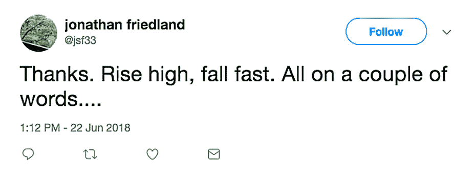

# Jonathan Friedland 在好莱坞报道会议上使用了 N 字后向网飞开火

> 原文：<https://www.hollywoodreporter.com/live-feed/jonathan-friedland-exits-netflix-1122675?utm_source=wanqu.co&utm_campaign=Wanqu+Daily&utm_medium=website>

网飞将解雇其首席新闻发言人。

过去六年来一直担任流媒体巨头首席沟通官的乔纳森·弗里德兰(Jonathan Friedland)因对其团队发表“不敏感”的言论而被解雇。有消息称，Friedland 在与其他网飞员工的会议中使用了 N 字，其中一些人后来报告了这一事件。据内部人士透露，网飞首席执行官雷德·哈斯汀斯在周五下午 12:45 左右向全公司发送了一封电子邮件，解释弗里德兰被解雇的原因。

弗里德兰是前迪士尼高管，2011 年 2 月首次加入网飞，担任全球企业传播副总裁，[在第二年被提升为首席传播官。弗里德兰的替代者尚未任命。](https://www.hollywoodreporter.com/news/netflix-replaces-chief-marketing-officer-283672)

“七年后我将离开网飞，”弗里德兰德在一份声明中对好莱坞记者说。“在我们树立的榜样中，领导者必须无可指责，但不幸的是，当我对我的团队说一些冒犯喜剧的话时，我没有达到这个标准。对于这一失误给我所热爱的公司的员工带来的痛苦，我感到很难过，我希望每个人都能感受到包容和欣赏。我很荣幸建立了一个出色的多元化全球团队，并成为建设世界领先娱乐服务的集体冒险的一部分。”

在他的职位上，Friedland 负责监督 streamer 在全球 190 个国家的原创系列、电影和特别节目的媒体和内容宣传。除了之前在华特·迪士尼公司担任高级副总裁外，Friedland 还曾是华尔街日报和 T2 远东经济评论的驻外记者和编辑。

此次人事变动正值黑斯廷斯领导的网飞在第一季度结束时在全球拥有 1.25 亿用户，预计第二季度将增加 620 万。就在上周，该公司的股票收盘上涨 3%，达到创纪录的 404.98 美元，尽管大盘下跌。该平台越来越多地进入国际领域，并扩大其原创名单，以包括更多的无脚本内容。

下面是黑斯廷斯发给网飞员工的关于解雇弗里德兰的备忘录全文。

*全部:*

我已经决定放弃乔纳森·弗里德兰。Jonathan 在许多领域做出了巨大贡献，但他在工作中至少两次描述性地使用 N 字，表现出不可接受的低种族意识和敏感性，不符合我们公司的价值观。T3】

*第一次事件是几个月前在一次公关会议上关于敏感词的事情。几个人后来告诉他，他对这个词的使用是多么的不恰当和伤人，乔纳森向参加会议的人道歉。我们希望这种可怕的异常现象永远不要再出现。T3】*

三个月后，他在网飞集团的一次黑人员工会议上发言，却没有提及此事，这被与会的许多人理解为他不在乎，也不为自己的言论承担责任。T3】

*第二起事件，这周才听说，是在第一起事件之后几天；这一次，乔纳森对人力资源部的两个黑人员工又说了那个 N 字，他们试图帮助他处理最初的冒犯。第二件事证实了我对他的不理解，并说服我现在就放了乔纳森。T3】*

当我思考这个问题时，在第一次事件中，我应该做得更多，让网飞的每个人都知道这个词是多么痛苦和丑陋，而且不应该被使用。我意识到我的特权使我理智化或者最小化这样的种族问题。我需要通过学习和倾听来树立更好的榜样，这样我才能成为我们需要的领导者。T3】

根据你在世界上的哪个地方生活或长大，对这个词的历史和用法的理解和敏感性会有所不同。关于这个词的使用的争论在世界各地都很活跃(例如),因为它在流行媒体如音乐和电影中的使用已经造成了一些困惑，即是否曾经有一段时间使用 N 字是可以接受的。对于非黑人来说，这个词不应该说出来，因为几乎没有合适或有建设性的语境(即使在唱歌或读剧本时)。在任何语境下，都没有办法中和这个词背后的情感和历史。短语“N-word”的使用是一种委婉的说法，也是一种规范，目的是提供一种可接受的替代方式，让人们不再使用特定的单词。当一个人违反这一准则时，它会给许多人带来怨恨、强烈的沮丧和极大的冒犯。我们的节目 亲爱的白人 *涵盖了一些这方面的内容。T9】*

*展望未来，我们将想方设法教育和帮助我们的员工广泛理解种族、国籍、性别认同和特权在社会和我们的组织中以多种困难的方式表现出来。我们寻求在多个维度上实现卓越的包容性，而这些事件表明，我们充其量是不均衡的。我们已经开始聘请外部专家来帮助我们更快地学习。T3】*

*Jonathan 是一名出色的贡献者，他组建了一个多元化的全球团队，为网飞树立了知名度，提高了我们在全球的声誉，并帮助我们成为今天这样成功的公司。我们中的许多人与乔纳森密切合作了很长一段时间，并有复杂的情感。不幸的是，他在这方面的判断力太差了，无法继续下去。我们非常关心员工在网飞的安全感和支持感。T3】*

这些信息很快就会见诸报端。但是任何不在媒体上的细节对员工都是保密的。T3】

*–芦苇*

弗里德兰周五也在推特上发布了他的退出:

他后来发推特说，“谢谢。涨得高，跌得快。全靠几个字…“然后很快就删了。 *THR* 获得了这条推文被删除前的截图。

