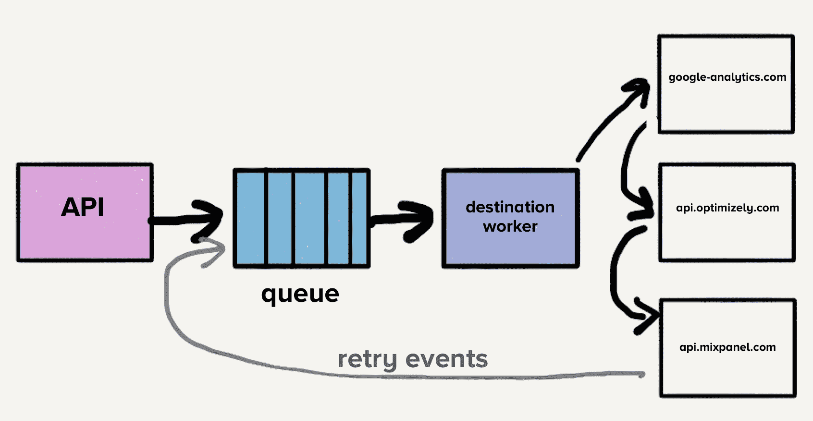
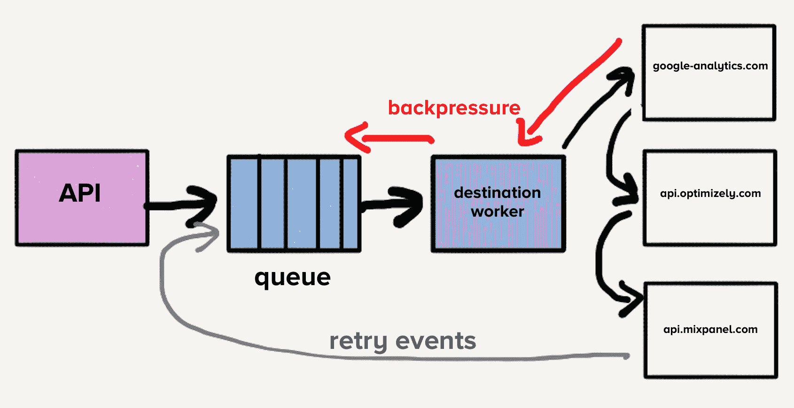
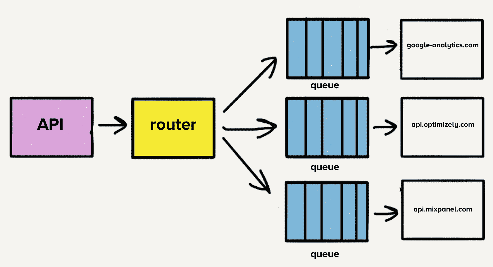
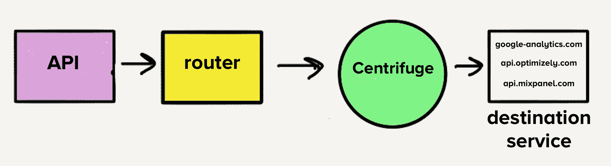

# 再见微服务:从 100 个问题儿童到 1 个超级明星| Twilio Segment 博客

> 原文：<https://segment.com/blog/goodbye-microservices/?utm_source=wanqu.co&utm_campaign=Wanqu+Daily&utm_medium=website>

除非你一直生活在岩石下，否则你可能已经知道微服务是当今的架构。随着这一趋势的成熟，细分市场[很早就将此作为最佳实践](https://segment.com/blog/why-microservices/)，这在某些情况下很好地服务了我们，但正如您很快会了解到的，在其他情况下就不那么好了。

简而言之，微服务是一种面向服务的软件架构，其中服务器端应用程序是通过组合许多单一用途、低占用空间的网络服务来构建的。吹捧的好处是改进的模块化、减少的测试负担、更好的功能组合、环境隔离和开发团队自治。与之相反的是整体架构，其中大量的功能存在于单个服务中，该服务作为单个单元进行测试、部署和扩展。

2017 年初，我们在[部门产品](https://segment.com/product)的核心部分达到了一个转折点。好像我们正从微服务树上掉下来，落下时撞到了每一根树枝。这个小团队发现自己陷入了爆炸式的复杂性，而不是让我们能够更快地前进。这种架构的基本优势变成了负担。随着我们的速度骤降，我们的缺陷率激增。

最终，团队发现他们无法取得进展，3 名全职工程师花费了大部分时间来维持系统运行。有些事情必须改变。这篇文章讲述了我们如何后退一步，采用一种与我们的产品需求和团队需求相一致的方法。

# 微服务为何奏效

Segment 的客户数据基础设施每秒接收数十万个事件，并将它们转发给合作伙伴 API，我们称之为**服务器端目的地**。这些目的地有[一百多种，比如 Google Analytics，Optimizely，或者一个定制的 webhook。](https://segment.com/docs/connections/destinations/catalog/)

几年前，当产品最初发布时，架构很简单。有一个 API 可以接收事件并将它们转发到分布式消息队列。在这种情况下，事件是由 web 或移动应用程序生成的 JSON 对象，包含有关用户及其操作的信息。示例负载如下所示:

随着事件从队列中消耗，检查客户管理的设置以决定哪些目的地应该接收事件。然后，事件被一个接一个地发送到每个目的地的 API，这很有用，因为开发人员只需要将他们的事件发送到一个端点，即 Segment 的 API，而不是构建潜在的几十个集成。段处理向每个目的地端点发出的请求。

如果对一个目的地的请求失败，有时我们会在以后再次尝试发送该事件。有些失败重试是安全的，而有些则不安全。可重试的错误是指那些可能被目的地接受而不做任何更改的错误。例如，HTTP 500s、速率限制和超时。不可重试的错误是我们可以确定目的地永远不会接受的请求。例如，具有无效凭据或缺少必填字段的请求。

在这一点上，一个单一的队列包含了最新的事件以及那些可能已经在所有目的地进行了多次重试的事件，这导致了[行首阻塞](https://en.wikipedia.org/wiki/Head-of-line_blocking)。也就是说，在这种特殊情况下，如果一个目的地变慢或停机，重试会淹没队列，导致*所有*目的地的延迟。

假设目的地 X 遇到了临时问题，每个请求都超时出错。现在，这不仅造成了大量尚未到达目的地 X 的请求积压，而且每个失败的事件都被放回队列中重试。虽然我们的系统会自动扩展以响应增加的负载，但队列深度的突然增加会超过我们的扩展能力，导致最新事件的延迟。所有目的地的交付时间将会增加，因为目的地 X 出现了短暂的中断。客户依赖这种交付的及时性，所以我们不能承受在我们的管道中任何地方等待时间的增加。

为了解决队列头的阻塞问题，团队为每个目的地创建了单独的服务和队列。这种新的体系结构包括一个额外的路由器进程，该进程接收入站事件并将事件的副本分发到每个选定的目的地。现在，如果一个目的地遇到问题，只有它的队列会备份，其他目的地不会受到影响。这种微服务风格的架构将目的地相互隔离，当一个目的地经常遇到问题时，这一点非常重要。

# 个人回购的案例

每个目标 API 使用不同的请求格式，需要自定义代码来翻译事件以匹配这种格式。一个基本的例子是目的地 X 要求在有效载荷中发送生日作为`traits.dob`，而我们的 API 接受它作为`traits.birthday`。目标 X 中的转换代码看起来像这样:

许多现代目的地端点已经采用了 Segment 的请求格式，使得一些转换相对简单。然而，根据目标 API 的结构，这些转换可能非常复杂。例如，对于一些更古老和最分散的目的地，我们发现自己正在将值塞入手工制作的 XML 有效载荷中。

最初，当目的地被分成单独的服务时，所有代码都存在于一个 repo 中。令人沮丧的一点是，一个失败的测试会导致所有目的地的测试失败。当我们想要部署一个变更时，我们必须花费时间来修复被破坏的测试，即使这些变更与最初的变更没有任何关系。为了解决这个问题，我们决定将每个目的地的代码分解到各自的仓库中。所有的目的地都已经有了自己的服务，所以过渡是自然的。

拆分为独立的回购协议使我们能够轻松隔离目标测试套件。这种隔离允许开发团队在维护目的地时快速行动。

# 扩展微服务和回购

随着时间的推移，我们增加了 50 多个新的目的地，这意味着 50 个新的回购。为了减轻开发和维护这些代码库的负担，我们创建了共享库，以使跨目的地的公共转换和功能(如 HTTP 请求处理)更加容易和统一。

例如，如果我们想从一个事件中得到一个用户的名字，`event.name()`可以在任何目的地的代码中被调用。共享库检查属性键`name`和`Name`的事件。如果不存在，它将检查名字，检查属性`firstName`、`first_name`和`FirstName`。它对姓氏进行同样的操作，检查大小写，并将两者组合起来形成全名。

共享库使得建立新的目的地变得很快。一组统一的共享功能带来的熟悉感使得维护不再那么令人头疼。

然而，一个新的问题开始出现。测试和部署对这些共享库的更改影响了我们所有的目的地。它开始需要相当多的时间和精力来维护。知道我们必须测试和部署几十个服务，做出改变来改进我们的库是一个有风险的提议。当时间紧迫时，工程师只会将这些库的更新版本包含在单个目标的代码库中。

随着时间的推移，这些共享库的版本开始在不同的目标代码库中产生分歧。我们曾经拥有的减少每个目标代码库之间的定制的巨大优势开始逆转。最终，他们都在使用这些共享库的不同版本。我们本可以构建工具来自动推出变更，但在这一点上，不仅开发人员的工作效率受到影响，而且我们还开始遇到微服务架构的其他问题。

另一个问题是每个服务都有不同的负载模式。一些服务每天处理少量事件，而其他服务每秒处理数千个事件。对于处理少量事件的目的地，每当出现意外的负载高峰时，运营商将不得不手动扩大服务以满足需求。

虽然我们实现了自动伸缩，但是每个服务都有不同的所需 CPU 和内存资源，这使得自动伸缩配置的调整更像是艺术而不是科学。

目的地的数量继续快速增长，团队平均每月增加三个目的地，这意味着更多的回购、更多的队列和更多的服务。借助我们的微服务架构，我们的运营开销随着每个目的地的增加而线性增加。因此，我们决定后退一步，重新思考整个管道。

# 抛弃微服务和队列

清单上的第一项是将现有的 140 多项服务整合成一项服务。管理所有这些服务的开销对我们的团队来说是一项巨大的负担。我们真的为此失眠了，因为对于随叫随到的工程师来说，收到处理负载高峰的传呼是很常见的。

然而，当时的架构会使迁移到单一服务变得很困难。如果每个目的地都有一个单独的队列，每个工作人员将不得不检查每个工作队列，这将给目的地服务增加一层复杂性，我们对此感到不舒服。这是[离心机](https://segment.com/blog/introducing-centrifuge/)的主要灵感。离心机将取代我们所有的单个队列，并负责将事件发送到单一的整体服务。

# 转向单一回购

假设只有一个服务，将所有目标代码转移到一个 repo 中是有意义的，这意味着将所有不同的依赖项和测试合并到一个 repo 中。我们知道这会很麻烦。

对于 120 个独立的依赖项中的每一个，我们承诺为我们所有的目的地提供一个版本。当我们移动目的地时，我们会检查它正在使用的依赖项，并将它们更新到最新版本。我们修复了目的地中与新版本冲突的任何内容。

有了这种转变，我们不再需要跟踪依赖版本之间的差异。我们所有的目的地都使用相同的版本，这大大降低了代码库的复杂性。维护目的地现在变得耗时更少，风险更低。

我们还需要一个测试套件，允许我们快速、轻松地运行所有的目标测试。运行所有的测试是对我们前面讨论的共享库进行更新的主要障碍之一。

幸运的是，目的地测试都有相似的结构。他们进行了基本的单元测试，以验证我们的定制转换逻辑是正确的，并将执行对合作伙伴端点的 HTTP 请求，以验证事件是否如预期的那样出现在目的地。

回想一下，将每个目标代码库分离到它自己的 repo 中的最初动机是为了隔离测试失败。然而，事实证明这是一个错误的优势。发出 HTTP 请求的测试仍然经常失败。由于目的地被分离到它们自己的 repos 中，没有什么动力去清理失败的测试。这种糟糕的卫生状况导致了令人沮丧的技术债务的持续来源。通常一个原本只需要一两个小时的小改变，最终需要几天到一周才能完成。

# 构建弹性测试套件

测试运行期间对目标端点的出站 HTTP 请求是测试失败的主要原因。不相关的问题，如过期的证书不应该失败的测试。我们还从经验中得知，一些目的地端点比其他端点慢得多。一些目的地需要 5 分钟来运行他们的测试。我们的测试套件有超过 140 个目的地，运行时间可能长达一个小时。

为了解决这两个问题，我们创造了交通记录仪。交通记录仪建立在[yakka](https://github.com/flickr/yakbak)之上，负责记录和保存目的地的测试交通。每当测试第一次运行时，任何请求及其相应的响应都会被记录到一个文件中。在随后的测试运行中，将回放文件中的请求和响应，而不是请求目的地的终结点。这些文件被检入到 repo 中，这样测试在每个变更中都是一致的。现在，测试套件不再依赖于互联网上的 HTTP 请求，我们的测试变得更有弹性，这是迁移到单一回购的必备条件。

我记得在我们集成了交通记录仪之后，第一次对每个目的地进行测试。我们花了几毫秒完成了对 140 多个目的地的测试。在过去，仅仅一个目的地就可能需要几分钟才能完成。感觉就像魔法一样。

# 为什么独石会起作用

一旦所有目的地的代码都存在于单个 repo 中，它们就可以合并成单个服务。随着每个目的地都生活在一个服务中，我们的开发人员的生产力大大提高了。我们不再需要为一个共享库的变更部署 140 多个服务。一名工程师可以在几分钟内部署这项服务。

证据就是速度的提高。2016 年，当我们的微服务架构还在的时候，我们对我们的共享库进行了 32 项改进。仅在今年，我们就进行了 46 项改进。在过去的 6 个月里，我们对图书馆的改进超过了 2016 年全年的改进。

这一变化也有利于我们的运营。由于每个目的地都位于一个服务中，我们有一个 CPU 和内存密集型目的地的良好组合，这使得扩展服务以满足需求变得非常容易。大型工作池可以吸收负载峰值，因此我们不再收到处理少量负载的目的地的分页。

# 权衡取舍

从我们的微服务架构转移到整体架构是一个巨大的进步，但是也有一些不利因素:

1.  **故障隔离困难。**由于一切都在一个整体中运行，如果在一个目的地引入一个导致服务崩溃的错误，所有目的地的服务都会崩溃。我们有全面的自动化测试，但是测试只能让你到此为止。我们目前正在研究一种更强大的方法来防止一个目的地关闭整个服务，同时仍然保持所有目的地在一个整体中。

2.  内存缓存效率较低。以前，每个目的地一个服务，我们的低流量目的地只有少量进程，这意味着它们的控制平面数据的内存缓存将保持热态。现在，缓存稀疏地分布在 3000 多个进程中，因此被命中的可能性大大降低。我们可以使用 Redis 之类的东西来解决这个问题，但这是我们必须考虑的另一个扩展点。最终，考虑到巨大的运营收益，我们接受了这种效率损失。

3.  更新依赖关系的版本可能会破坏多个目的地。虽然将所有东西都转移到一个 repo 解决了我们之前的依赖混乱，但这意味着如果我们想使用最新版本的库，我们可能必须更新其他目标以使用新版本。然而在我们看来，这种方法的简单性是值得权衡的。通过我们全面的自动化测试套件，我们可以很快发现新的依赖版本出了什么问题。

# 结论

我们最初的微服务架构工作了一段时间，通过将目的地相互隔离，解决了我们管道中的即时性能问题。然而，我们并不是按规模建立的。当需要批量更新时，我们缺少适当的工具来测试和部署微服务。结果，我们的开发人员生产力迅速下降。

迁移到 monolith 允许我们在显著提高开发人员生产力的同时，消除我们的运营问题。不过，我们并没有轻率地进行这种转变，我们知道如果要成功，我们必须考虑一些事情。

1.  我们需要一个坚如磐石的测试套件来将所有东西放入一个回购中。如果没有这一点，我们将处于与我们最初决定将它们分开时相同的情况。过去，不断失败的测试损害了我们的生产力，我们不希望这种情况再次发生。

2.  我们接受了整体架构中固有的权衡，并确保我们围绕每个方面都有一个好的故事。我们不得不接受这种变化带来的一些牺牲。

在选择微服务还是整体服务时，需要考虑不同的因素。在我们基础设施的某些部分，微服务工作得很好，但我们的服务器端目的地是一个完美的例子，说明这种流行趋势实际上如何损害生产力和性能。事实证明，我们的解决方案是一个整体。

* * *

斯蒂芬·马西森、[里克·布兰森](https://github.com/rbranson)、[阿奇勒·罗塞尔](https://github.com/achille-roussel)、[汤姆·霍尔姆斯](https://github.com/tsholmes)以及许多其他人使得向一个庞然大物的转变成为可能。

特别感谢里克·布兰森在每一个阶段帮助审查和编辑这篇文章。

* * *

#### 看看这是什么部分...

[注册一个免费的工作空间](https://app.segment.com/signup)或[T3】点击这里观看演示👉](https://segment.com/demo/?utm_source=blog&utm_medium=cta&utm_campaign=parrot&utm_content=microservices)