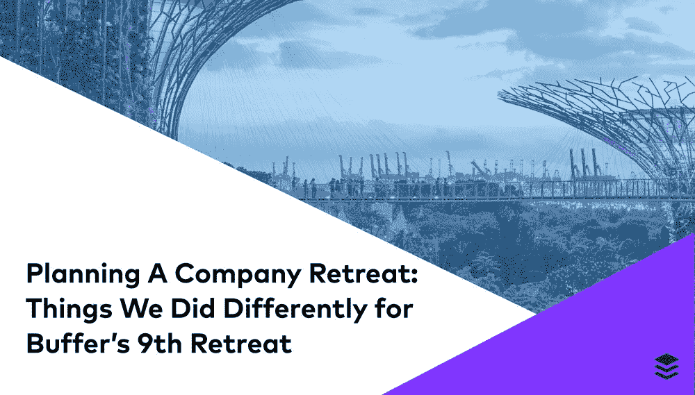
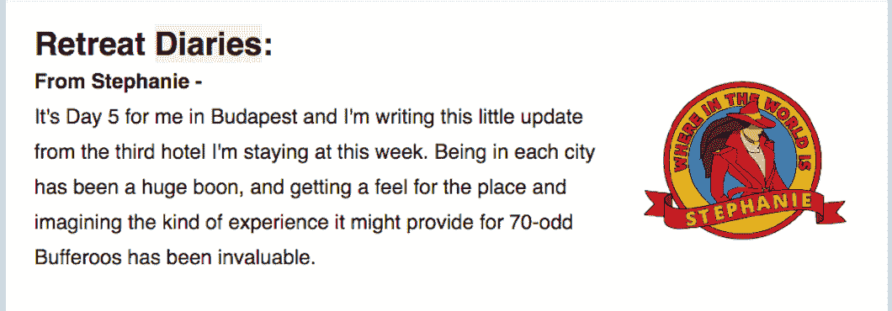
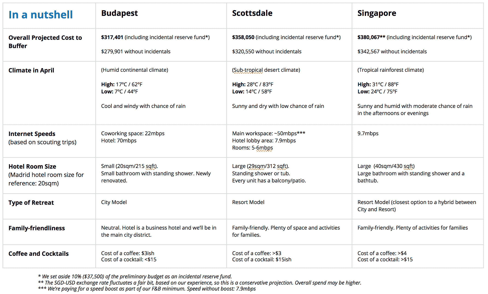
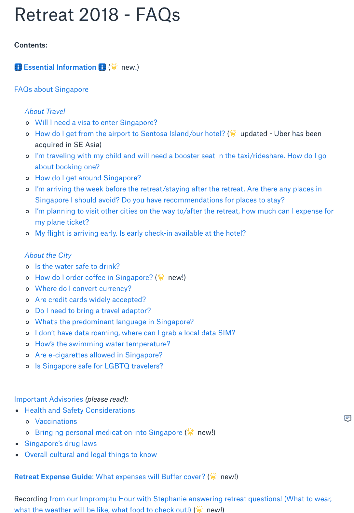
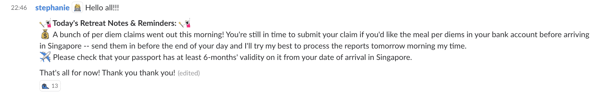
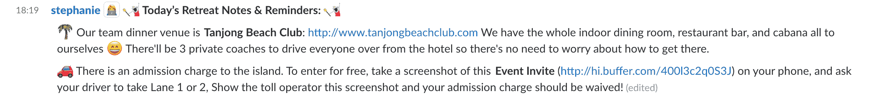
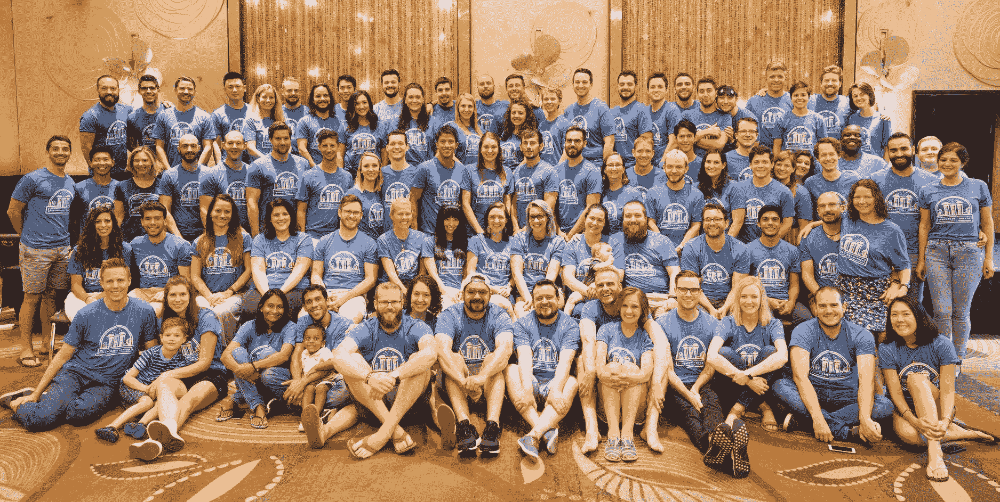

# 计划公司撤退:Buffer 的第 9 次撤退中我们做的不同的事情

> 原文：<https://open.buffer.com/9th-retreat/?utm_source=wanqu.co&utm_campaign=Wanqu+Daily&utm_medium=website>

*更喜欢听？这是这篇文章的音频版本。*

我仍然记得当时的场景:那是亚利桑那州阳光明媚的斯科茨代尔的一家小咖啡店。我们花了三个半月的时间计划公司的撤退，还花了几天时间进行侦察旅行。尼科尔和我正埋头于与一家潜在供应商的早会笔记中，关于撤退的想法满天飞。

那时，我们已经把全球 18 个潜在的度假城市的初步名单缩小到了三个:斯科茨代尔、布达佩斯和新加坡。斯科茨代尔是球探之旅的第一个目的地，我在那个周末前往布达佩斯。

随着每次考察和与我们潜在合作伙伴的会面，越来越明显的是，这三个地方都是 Buffer 的绝佳选择。它们对我们多元化的团队来说都是安全的，并且符合我们的预算。我们也被保证了良好的连通性和大量的活动，这些肯定会给团队留下美好的回忆。

面对三个奇妙而独特的地点之间的选择，我们发现自己面临着比以往任何时候都更进一步的撤退计划的机会。

随着我们更深入地思考我们希望这次静修如何进行，更多的问题出现了，这些问题最终帮助我们形成了迄今为止最有意图的缓冲静修:

*   除了后勤，我们撤退的目标是什么？务虚会的文化或参与目标是什么？
*   此时此刻，作为一个团队，我们的需求是什么？
*   我们如何确保公司静修和小型静修是远程工作体验的补充？
*   在这些城市中的每一个撤退会是什么样子？潜在的优点和缺点是什么？
*   缓冲静修在过去是什么样子的，这对它们在未来应该是什么样子有什么启示？

让我们看看这些问题是如何引导我们把 85 个 Bufferoos、partners 和 Buffer kids 带到新加坡的！另外，我们在第九次缓冲静修中做了一些与众不同的事情。

## 撤退模式和设定总体愿景

通过思考这些问题以及我们团队的实际和象征意义，我们清楚地认识到缓冲静修通常分为三种模式:城市模式、度假村模式和乡村/郊区模式。

**城市**模式在很大程度上是一种以地点为中心的方法，其中很大一部分静修体验是对一个酷城市或地方的共享体验。我想到了我们在纽约、悉尼、雷克雅未克和马德里的度假胜地。在这些缓冲静修中，团队通常住在市中心周围的酒店(或几家，取决于城市中的可用性),白天在共同工作或活动空间工作。在这样的静修期间，很可能会去工作场所旅行或通勤，例如，我们每天从谷歌园区到马德里酒店的步行时间为 15-20 分钟。

相比之下，度假村和农村/郊区模式更注重团队。从某种意义上来说，**度假村**模式有意缩小了度假村的地理范围。团队需要的一切都位于附近或单一区域内——住宿、工作场所、食物，甚至可能是活动。该地区可能离市中心有一段距离，但仍然可以步行或乘坐公共交通工具到达。我们在开普敦和夏威夷的度假胜地就是这种模式的原型。

乡村/郊区型号和盒子上写的一模一样。采用这种方法，位置可能相当偏僻，不太可能位于大城市。这对于小团队聚会很有效，因为所有的焦点都集中在参与者身上，以及他们为自己设定的任何联系或工作目标上。出版团队在卑诗省彭伯顿举办的 2017 年[小型务虚会](https://buffer.com/resources/mini-retreats/)很适合这种模式。在为期一周的以工作为中心的会面中，团队共享一个 Airbnb，一起做饭，并有足够的时间来完成一些大的项目目标。在工作场所和居住空间之间通勤节省的时间也意味着他们有很多机会建立联系！

虽然每种方法都有自己的优势，并且在不同的时间点为 Buffer 团队工作过，但是 Nicole 和我仔细考虑了哪种模型最适合我们团队目前的需求。第九次缓冲静修我们想达到什么目的？

经过过去一年在 Buffer 的一些反思、马德里务虚会的反馈以及我们当时的整体团队情绪，我们为第 9 次 Buffer 务虚会提出了以下四个目标:

*   创造联系的机会
*   最大限度地减少压力和支持恢复时间
*   为我们多元化的团队提供各种活动选择
*   以合理的成本工作

务虚会的模型和目标有助于构建我们对每个城市的评估，并向团队展示了三种不同的务虚会体验。

## 进一步倾向于透明

这些模型和目标帮助我们明确了在侦察之旅中的许多观察和学习，每个地点的静修结果变得很明显:布达佩斯显然是一个城市静修，而斯科茨代尔和新加坡更符合我们对度假静修的概念(新加坡是两者的潜在混合体)。

我们在每周团队通讯的静修日记部分分享了我们的学习成果，这是一种让团队了解事情进展的有趣方式。

鉴于当时我们在整个公司看到的[能量和动力](https://buffer.com/resources/6-week-cycles/)，Nicole 和我有一种强烈的预感，度假村模式将为我们提供最好的机会，让我们退一步，喘口气，恢复元气。这使得斯科茨代尔和新加坡有望胜出。

然而，我们已经收到了一些关于静修日记和过程透明度的积极反馈，在 Joel 的鼓励下，**我们** **决定公开最终决定，让全公司投票。**

在过去，投票通常只在初选最终评估地点时进行，最终地点几乎总是由务虚会的策划者决定。也是有原因的！有太多的因素会导致大撤退，而大众的选择并不总是最好的选择。

然而，考察之旅揭示的是，我们考虑的三个地点都是相当可靠的选择。我们相信，无论我们选择去哪里，团队都会玩得很开心！

为了给团队提供他们做出决策所需的足够多的背景信息，我们为 Joel 以及人员和财务团队重新设计了一份早期的提案，并制作了一套资料。这张幻灯片总结了这些城市的对比情况，并进一步详细介绍了这些城市的情况，以及我们可以选择的住宿和工作场所，以及缓冲的总成本。

这个团队决定去新加坡——一个大多数人从未去过的城市！

## 一路上(过度)交流

因为这是大部分团队成员第一次访问新加坡，所以回答任何关于禅二和这座城市的问题对我们来说是非常重要的。我们在过程的早期就开始了一个 FAQ 文档，它是一个“活的”文档，并且一直在更新。它涵盖了从签证和货币到费用和文化考虑的一系列问题。静修开始时，我们的文件中有 24 页的信息。

静修前的几周对我们来说可能是一段忙碌的时光。许多 Buffer 队友选择在这几周旅行，有些人可能正在为他们的第一次国际旅行做准备。尽管 FAQ 文档很全面，但我们并不期望所有的队友都能在熙熙攘攘的人群中读完每一行。

为了在此期间支持团队，并确保他们(至少)拥有必要的信息，我们引入了另外两种沟通策略:

### **1。撤退松弛通道中的每日提醒**

为了确保队友们获得他们需要的重要信息，我和妮可在我们专门为务虚会设立的一个 [Slack](https://buffer.com/resources/slack-bots-for-remote-teams/) 频道上发布每日更新。每条信息只包含两个提醒，以避免信息过载。

### **2。即兴小时静修聊天**

[即兴时间](https://buffer.com/resources/remote-work-lessons/)聊天是定期的“非工作”群组同步，公司的任何人都可以加入。这是一种很好的方式，我们可以通过这种方式了解生活，并在工作之外相互了解。我们即兴花了一个小时来聊天底下关于闭关的一切，并为无法成行的队友录制下来。聊起新加坡的气候(湿热)、当地的美食(鸡饭)和要带的衣物(所有的夏季装备)，一切都很有趣。

## 团队合作让梦想成真

第九次缓冲静修也见证了我们第一个静修委员会的成立。一旦我们结束了侦察旅行，尼科尔和我发出了一个志愿者的呼吁，作为撤退计划的探测板，并接管这一过程的一些部分。我们非常感谢我们的七人团队，他们从百忙之中抽出时间来帮助我们思考从[赃物](https://buffer.com/resources/mindful-swag/)到[团队合作活动](https://buffer.com/resources/team-bonding-retreat/)的所有事情！

## 探索包容性及其多维度

对于分散在世界各地的偏远团队来说，长途旅行是静修经历的一部分，但这并不总是对每个人都可行。有时队友由于各种原因不能亲自参加撤退。

在过去，这些队友可能正在休[探亲假](https://buffer.com/resources/family-leave-at-buffer/)，无论如何也不会正常工作。然而，这一次，我们有两个队友在静修周正常工作，这促使我们为他们制定了一个更有针对性的“静修周计划”。这里有两件事我们做得不同:

### **1。特别静修周时间表/工作计划。**

我们设计的静修计划与高层公司愿景会议一样注重团队凝聚力，这使得团队专注于日常任务的时间比平时少。认识到这可能会转化为更多的压力，队友回家“收拾烂摊子”，专门的撤退工作计划旨在消除这一负担。我们不希望在家的队友每天工作 12 个小时，相反，我们的想法是利用 Slack 上“较少噪音”的机会，在他们受到启发的埋头项目上花更多时间，并在那一周战略性地工作。

为此，我们还确保为我们的队友录制了务虚会，供他们第二天回顾，并强调了一周内与他们的异步沟通。

这些只是我们承诺[公司务虚会尽可能包容](https://buffer.com/resources/diversity-events-guidelines/)的一小步。Nicole 和我非常感谢那些努力制定并实施这项工作计划的经理和主管们。我们很高兴能在下一次务虚会上重复这些内容！

### **2。一次放松活动和一顿缓冲餐**

除了周末预订静修之外，我们通常会指定一个工作日作为休息日，与团队一起闲逛并探索这座城市。这一天通常伴随着缓冲基金(BFF):一种补贴，用于支付队友想要参加的任何活动的费用。有了 Buffer Fun 基金，队友们可以在夏威夷跳伞，在马德里玩泡泡足球，参观新加坡的蹦床公园。(在我们去过的所有城市中，水疗也是一项很受欢迎的 BFF 活动！)

我们希望队友回家后也能享受一个充满活力的休息日，并鼓励他们和他们的好朋友一起做一些有趣和放松的事情。

虽然他们不能亲自和我们一起参加团队晚宴，但我们也想和我们的队友分享一些关于美味食物的缓冲之爱。队友们被鼓励去享受一顿美餐，用 Buffer 的爱来消费。

## 下一步是什么？

该团队在圣淘沙岛度过了一周，这是一个离新加坡大陆不远的度假岛，我们需要的一切都在手边。尽管去新加坡路途遥远，有些人要坐 18 到 24 小时的飞机！–更慢、更放松的节奏让每个人都有空间休息，享受在一起的时光。

我们在酒店的舞厅工作，这将通勤时间从马德里的 20 分钟缩短到新加坡的 3 分钟。这给了我们更多的回旋余地，在时间表中设计呼吸空间，我们每天下午 5 点结束工作。每天晚上，队友们要么在城市里计划晚餐和活动，要么就在 24 小时开放的游泳池边闲逛。

妮可和我非常感激(也松了一口气！)我们对度假村模式的直觉得到了验证。我的极客部分特别高兴地看到在我们收到的反馈中特别提到了它:

“度假村的模式让这个项目大放异彩，不是因为它很豪华(这是浪费)，而是因为它创造了一个意外收获的环境，因为很多东西都是自由流动的。不需要计划小细节，比如我的下一顿饭会在哪里，这就缓解了我认为在过去的静修中存在的许多低级压力。”

*“酒店+很棒的房间+早餐+午餐+泳池的情况个人是很难打败的。我喜欢这种一体化设置:)"*

“我喜欢度假村内的一切。我们不需要通勤去上班或吃午饭。这让我们有更多的时间在一起。”

现在七月已经过去了，妮可和我正重新戴上思考的帽子，开始下一次静修的工作。这将是 Buffer 的第 10 次撤退，我们非常兴奋！每一次静修都是一次宝贵的学习经历，我们都在思考如何进一步提高。

你为你的公司计划撤退吗？我很想听听你的想法，并了解你是如何做到的！另外，欢迎在评论中分享你对 Buffer 第十次静修的想法。？

安妮·斯普拉特的照片

