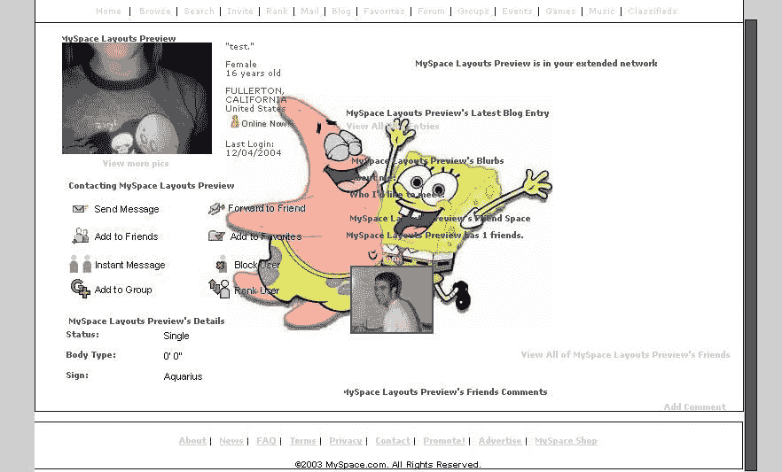
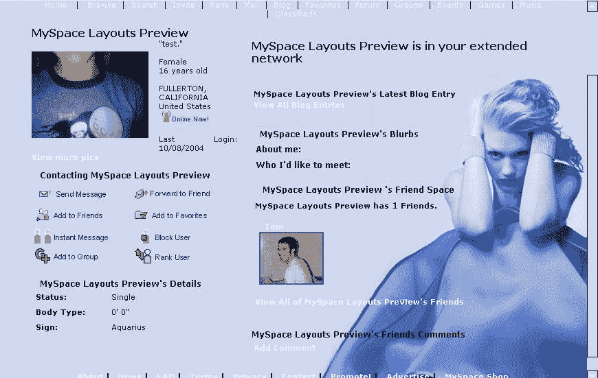
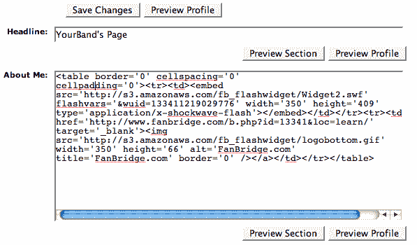
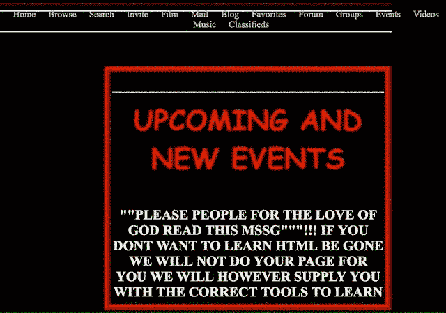
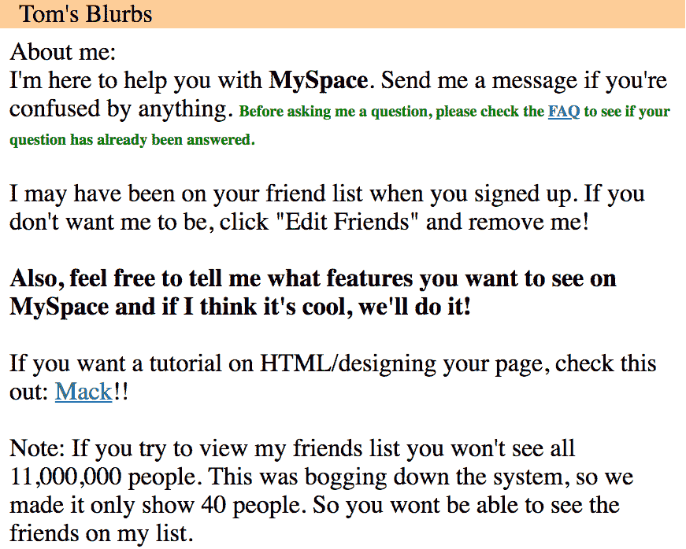
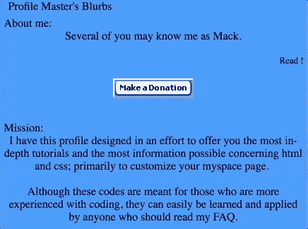
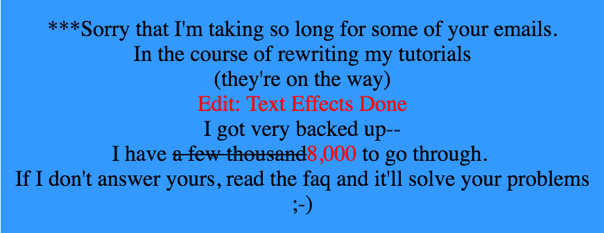
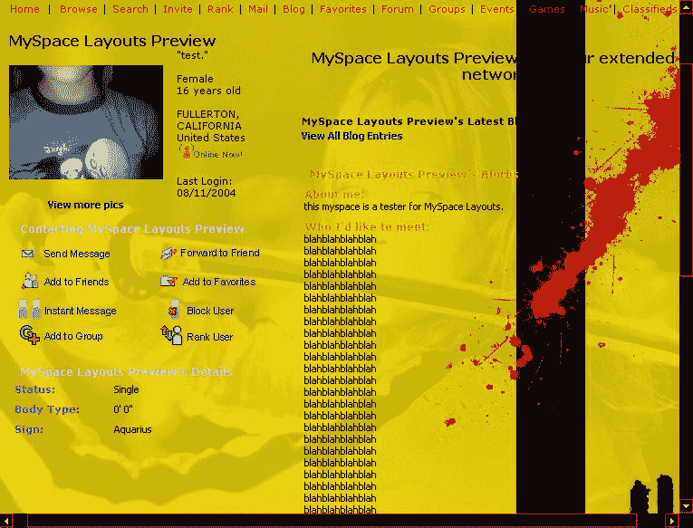
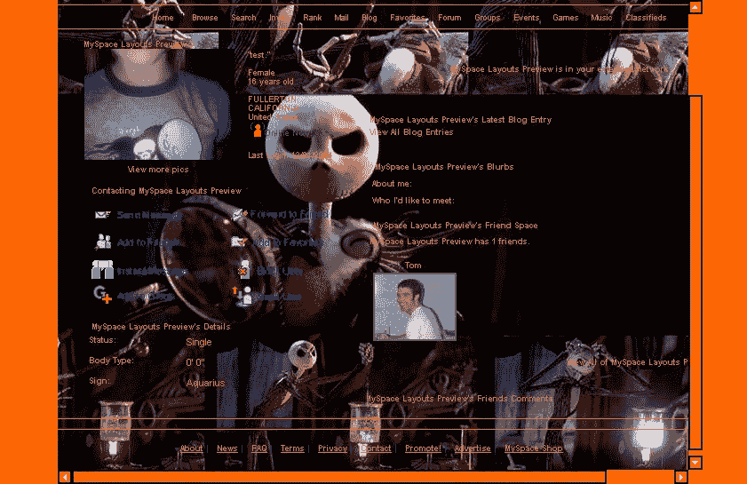

# MySpace 和它留下的编码遗产

> 原文：<https://news.codecademy.com/myspace-coding-legacy/?utm_source=wanqu.co&utm_campaign=Wanqu+Daily&utm_medium=website>

对于整整一代人来说，MySpace 是通向令人上瘾的社交网络平台的门户，这些平台现在已经成为我们生活中无处不在的特征。对于同代人中的许多人来说，MySpace 是通向现代生活中另一个不可避免的部分——写代码——的大门。

自从该网站在近十年前消亡以来，MySpace 体验的某些图腾已经留在了我们的集体记忆中——例如前 8 名、自动播放音乐，当然还有汤姆。但是，在使 MySpace 成为文化热点的所有功能中，用 HTML 和 CSS 设计个人资料页面的能力可能留下了最大的足迹。

对于数以千万计的人来说，修改锚和风格标签来个性化 MySpace 的个人资料是对代码的一种介绍，代码是解决问题、表达自我的一种手段，或者只是进行实验并看看会发生什么。拥有定制配置文件的直接需要带来了一个完整的主题销售者和 HTML 教程作者的生态系统，他们是早期的开拓者，他们将自己的编码知识商品化，同时说服数百万人编写代码也是他们可以做的事情。因此，让我们回顾一下是什么让 MySpace 如此代码友好，以及这种友好性最终如何在该网站的衰落中发挥作用。

## 朋友的地方

在 2009 年《纽约时报》对《偷走我的空间》一书的评论中，迈克尔·阿格将我的空间描述为“努力奋斗的产物，夜晚的洛杉矶，在那里你会出名，成为新的东西。”它的吸引力在于允许用户——其中绝大多数是青少年——发明和表达一个三维的数字版本的自己，从他们的个人资料照片，到他们认为最亲密的八个朋友，下至他们个人资料页面上的字体和背景图像。

改变你的 MySpace 个人资料的风格是把你和你的朋友区分开来的一种方式。用光标描绘一个最喜欢的电影角色，或者用字体颜色组合来回忆一个最喜欢的运动队的颜色，用户可以使用个人资料上的每个像素来区分自己。

MySpace 并不是唯一一个允许通过代码进行这种表达的平台——Xanga、Tumblr、Pitas 和许多其他平台都允许用户用 HTML 和 CSS 定制他们的个人资料。但作为迄今为止最受欢迎的网站，MySpace 在巅峰时期拥有超过 1.1 亿活跃用户，是旗手，也是留下最大遗产的网站。

## 一次愉快的事故

MySpace 的代码友好特性实际上被证明是一个错误。正如 Julia Angwin 在她前面提到的 2009 年的书《窃取 MySpace:控制美国最受欢迎的网站之战》中解释的那样，MySpace 的主要开发者在 2003 年网站上线一个月后就辞职了。这就给剩下的团队留下了一个用 Perl 编写的站点，公司的其他人都不熟悉这个站点。作为回应，该团队付钱给开发人员 Gabe Harriman 和 Toan Nguyen，让他们用 Adobe 的 ColdFusion 重写整个网站。

然而，在重写 MySpace 时，哈里曼和 Nguyen 犯了一个重大错误——他们未能阻止用户将自己的 HTML 和 CSS 添加到他们的个人资料页面。按照安格温的说法，该团队的错误在于“允许用户构建丰富多彩的背景和壁纸，并将其加载到他们的 MySpace 页面上。突然之间，十几岁的女孩可以用心形、亮片和笑脸来装饰她们的 MySpace 页面，就像装饰她们的储物柜和书包一样。”

这个错误造成了安全漏洞，降低了页面加载速度。根据安格温的说法，一位惊慌失措的产品经理在第一次注意到一个字体颜色和背景图片有所改变的个人资料后，警告哈里曼“有人入侵了我们的网站”。但是这个意外的功能集立刻受到了用户的欢迎。该公司决定推迟修补错误，因为“用户是第一位的，这是他们想要的，”MySpace 前员工 Jason Feffer 告诉 Angwin。剩下的就是历史了。

## 配置文件定制的工作原理

MySpace profile editor 足够自由，允许使用[内联样式属性](https://www.codecademy.com/article/html-inline-styles?utm_source=ccblog&utm_medium=blog&utm_campaign=publication&utm_content=MySpace)、表格、内置于 Flash 或 JavaScript 中的嵌入式小部件，以及其他任何可以用 HTML 表达的东西。只有对 HTML 和 CSS 有了初步的了解，或者接触到可以盲目复制和粘贴的代码片段，才有可能利用这种自由。

Embedding a Flash widget with the Myspace profile editor

用户群对定制化的强烈渴望催生了一个完整的亚经济，包括布局卖家、教程页面和提供代码片段的广告网站。

The header of a profile customization page called "Graphics 4 myspace" ([archived ca. 2006](https://web.archive.org/web/20190318093525/https://web.archive.org/web/20060426230312/http://www.myspace.com:80/index.cfm?fuseaction=user.viewProfile&friendID=2617807&Mytoken=20040716055953))

对于许多已经有一点编码知识的用户来说，这是一个合法的收入来源。例如，我们之前介绍过的 Y Combinator 支持的创始人 PatrickJS 告诉我，他作为企业家的第一次经历是创建和销售 MySpace 布局。

这些布局专家中的许多人不仅仅是付费创建定制的布局，他们试图教授 HTML 和 CSS 的基础知识，让任何访问他们个人资料的人都能自己创建和编辑布局。

一个这样的帐户被称为“麦克”，或“配置文件主”有一段时间，个人资料大师的页面直接链接到汤姆·安德森个人资料的“关于我”部分。默认情况下，汤姆是每个 MySpace 用户的第一个朋友，因此他的个人资料是美国访问量最大的网站上访问量最大的页面之一[https://Mashable . com/2006/07/11/MySpace-Americas-number-one/]。他授予这位简介大师的主要房产证明了这样一个事实:HTML 和 CSS 不仅仅是功能——它们是 MySpace 上生活的基础部分。

The "About me" section of Tom Anderson's MySpace profile ([archived ca. 2005](https://web.archive.org/web/20190318093525/https://web.archive.org/web/20050406102156/https://myspace.com/tom))

“Profile Master”帐户提供了关于“文本效果”、“添加边框”和“JavaScripts”等概念的书面教程。这些文章已经不在网上了，但是存档的[“Profile Master”](https://web.archive.org/web/20050411082526/http://www.myspace.com:80/index.cfm?fuseaction=user.viewprofile&friendid=812799)页面的其余部分表明，它们旨在使用户能够自己编写配置文件更改，而不是等待配置文件管理员的帮助。

A snippet of the Profile Master's "About me" section ([archived ca. 2005](https://web.archive.org/web/20190318093525/https://web.archive.org/web/20050411082526/http://www.myspace.com:80/index.cfm?fuseaction=user.viewprofile&friendid=812799))

有很多其他的布局页面采用了同样的方法，比如“Myspace 布局”和“Graphics 4 myspace”不管是不是故意的，这些页面向一代人介绍了一些相同的[网络开发技能](https://www.codecademy.com/catalog/subject/web-development?utm_source=ccblog&utm_medium=blog&utm_campaign=publication&utm_content=MySpace)，这些技能现在是许多职业道路上的无价之宝。

Another snippet of the Profile Master's "About me" section ([archived ca. 2005](https://web.archive.org/web/20190318093525/https://web.archive.org/web/20050411082526/http://www.myspace.com:80/index.cfm?fuseaction=user.viewprofile&friendid=812799))

它们现在可能看起来像一个有点尴尬的时尚的愚蠢遗物，但这些页面对于一个可能没有机会接受这样的教育的人来说是宝贵的教育资源。计算机科学教育在高中阶段并不像今天这样普遍，Codecademy 也是多年后才成立的。这些页面可能是当时公众可以获得的最广泛的编码教程。

## MySpace 的消亡

MySpace 支持的那种无拘无束的自我表达对用户来说很棒，但对广告商来说却不是很有吸引力。布莱恩·斯特尔特在新闻集团以 5.8 亿美元收购 MySpace 三年后写的 2008 年《纽约时报》关于 MySpace 及其创始人的简介，重点强调了“许多 MySpace 用户感到舒适的混乱和吸引消费品公司的整洁之间的巨大反差”随着收购的进行，盈利的压力越来越大，而高度定制的个人资料被视为实现盈利的障碍。

大约在《泰晤士报》的同一时间，脸书开始成为 MySpace 的合法竞争对手。它的个人资料页面过去是(现在仍然是)MySpace 的对立面——相比之下几乎毫无生机。如果说 MySpace 相当于高中生装饰一新的储物柜，那么脸书就是护士办公室。

脸书还吸引了不同于 MySpace 的人群，这在很大程度上要归功于其早期的政策，即需要大学电子邮件地址才能创建账户。这些因素的结合导致了一个被广告商视为更安全的平台，其用户群年龄稍大，有更多的钱可以花。正如斯特尔特当时所说，“脸书以其更简洁的界面和更高的人口统计数据，也被一些广告商视为更好的选择。”

你知道接下来的故事是怎样的。当脸书利用其在广告客户中的声誉演变成今天的庞然大物时，MySpace 在基本消失之前采取了半心半意的措施来模仿它——比如取消代码编辑。

## 展望未来

自[脸书的流量超过 MySpace 的](https://www.pcworld.com/article/166794/Facebook_Overtakes_MySpace_in_US.html)以来，已经过去了九年多，而且从未回头。

继 MySpace 之后，没有哪个社交网络像它一样代码化。脸书和 Twitter 个人资料的可定制性限制是你的个人资料照片和封面图片。在 Instagram 上，止于个人资料图片。

这些社交网站仍然允许 MySpace 级别的个人创造神话，但是不需要写一行代码。更高的带宽和围绕多媒体的平台优化使照片和视频成为首选的表达形式。换句话说，回旋镖和 Snapchat 滤镜是新的闪亮背景和自动播放的酱爆弟弟歌曲。

这些平台都没有向代码编辑开放，可能是由于导致 MySpace 灭亡的同样的安全和广告问题。有理由预测他们可能永远不会。

但是，即使编码和社交网络不再是同道中人，许多专业平台已经走在 MySpace 的前面，倾向于代码可定制化。例如，MailChimp 和 Customer.io 这样的电子邮件平台，以及 Wordpress 和 Ghost 这样的博客平台，当你熟悉 HTML 和 CSS 时，它们是更强大的工具。

MySpace 一代已经长大，离开了这个网站，进入了一个渴求同样的网络开发技能的经济体，MySpace 用户在摆弄他们的个人资料时尝到了这种技能的滋味。因此，如果你对成为你生活中常规部分的 **a href** 和 **img src=** 感到怀旧，要知道现在比以往任何时候都更容易[温习这些技能](https://www.codecademy.com/catalog/language/html-css?utm_source=ccblog&utm_medium=blog&utm_campaign=publication&utm_content=MySpace)并进一步发展它们。

我们可能再也看不到另一个社交网络平台像 MySpace 一样既代码友好又广受欢迎。也就是说，除非你建造下一个。

*注:本文原帖发布于 2018 年夏季。*

* * *

 [Web 开发课程和教程| Codecademy

Web 开发是开发存在于互联网上的网站和 web 应用程序的实践。无论您对前端、后端还是全栈感兴趣，我们的 Web 开发领域中的内容都将帮助您实现这一目标。](https://www.codecademy.com/catalog/subject/web-development?utm_source=ccblog&utm_medium=blog&utm_campaign=publication&utm_content=MySpace) 