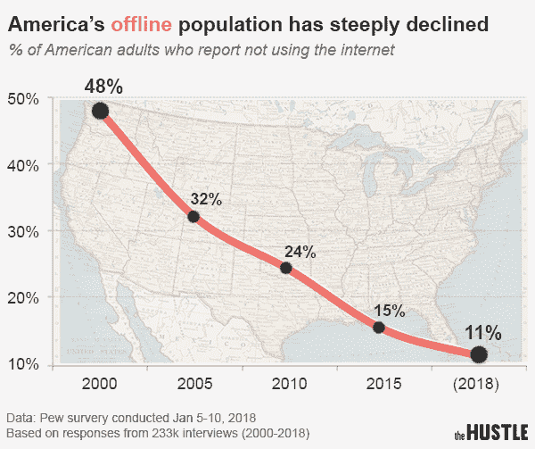
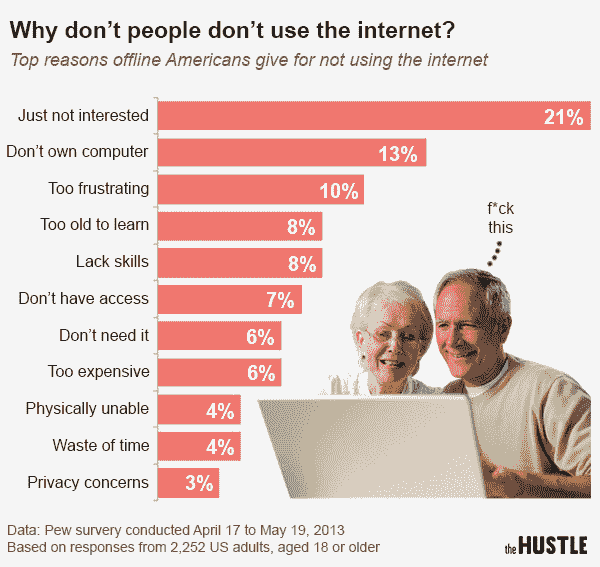
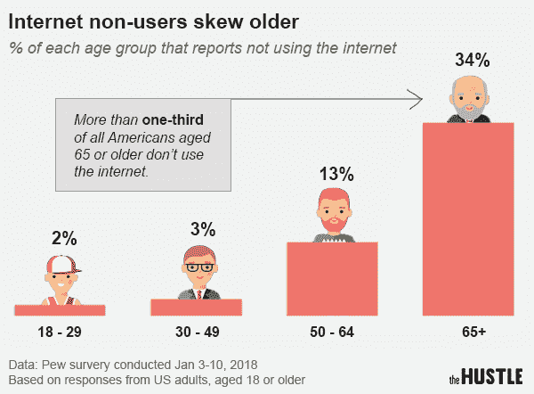
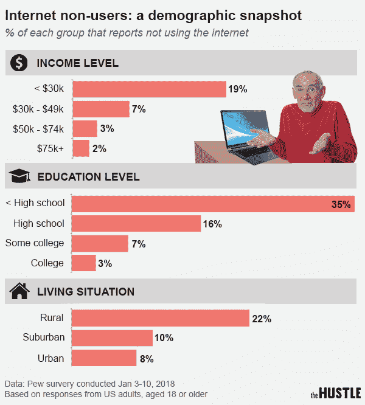

# 看看 11%不使用互联网的美国人——拥挤

> 原文：<https://thehustle.co/meet-the-11-of-americans-who-dont-use-the-internet/?utm_source=wanqu.co&utm_campaign=Wanqu+Daily&utm_medium=website>

每天早上，米妮·辛普森(Minnie Simpson)在 7:15 醒来，阅读《休斯顿纪事报》 *【休斯顿纪事报】* ，吃 3 颗法式西梅干，然后在附近散步。

这位 76 岁的德克萨斯人在路上路过当地的小学，就在家长们送孩子回家的时候，在街对面，辛普森穿着绿色尼龙风衣，摇着头，嗖嗖地走过。

“每个人都在打电话，”她哀叹道。“孩子们下了车，没有抬头，没有道别。他们的眼睛只是粘在手机上，看着网络视频——父母没有注意到，因为他们也在网上。它们都插上电源了…”

这是一个辛普森不了解的世界，她永远也不会了解:她是美国日渐式微的非互联网用户之一。

## **线下人口**

对我们大多数人来说，很难想象没有互联网的生活。

不管是好是坏，我们已经变得高度依赖屏幕中的数字世界。我们每天都用它来与朋友交流、预订机票、购物、浏览新闻、观看电影和电视节目，以及了解金·卡戴珊的最新动态。

随着过去二十年互联网接入的改善，离线人口急剧下降:今天， [只有 11%](http://www.pewresearch.org/fact-tank/2018/03/05/some-americans-dont-use-the-internet-who-are-they/) 的美国人不使用互联网，比 2000 年的 48%有所下降。

<noscript></noscript>

America’s offline population has dramatically increased since the turn of the century (Data via Pew; image: Zachary Crockett/The Hustle)

根据皮尤研究中心(Pew research Center)汇编的数据，这些人倾向于年龄较大、更农村、受教育程度较低和收入较低的人群，但他们不采用该技术的理由差异很大。

我们通过电话和他们中的许多人交谈过。下面是他们的故事精选。

## **马克* (58 岁；**宾夕法尼亚州农村)

**注:“Mark”(化名)担心隐私问题，为了采访他，我不得不通过他的好朋友(也是电子邮件用户)Penny Kalgren 转达问题。T3】*

马克五岁时开始在父母位于宾夕法尼亚州中西部的农场工作。18 岁时，他完成了高中学业，开始了推土机操作员的职业生涯。

用他自己的话说，他是“相当守旧的人”在他的一生中，他一直住在同一个“小山”上，在那里，他享受着一种田园式的生活方式，即耕作、打猎和在树林中散步。他从未使用过互联网，也永远不会。

他说:“当互联网出现时，我的第一个想法是，‘这将是我们社会的毁灭’。“当时我不想与它有任何关系，这些想法今天仍然适用。我认为这会让人变得懒惰，他们变得依赖一切，除了真正使用自己的大脑。”

部分原因来自于几次非常糟糕的科技经历:他的第一任妻子使用互联网“寻找其他男人来占据她的时间；他的第二任妻子用它在网上开了一张信用卡，用电子方式签了他的名字，欠下了 1 万美元的债务——所有这些他都不知道，因为他没有电脑。

<noscript></noscript>

The most common reason people don’t use the internet: They’re “just not interested” (Data via Pew; image: Zachary Crockett/The Hustle)

但是除了这些糟糕的经历之外，马克只是对暴露在他认为道德败坏的数字世界中不感兴趣。

“互联网本身可能并不坏，”他承认道。“但是 *人* 毁了互联网。当你把邪恶的人放在与社会其他人相同的平台上，他们就会接管……这就是为什么我们有接触色情的孩子，为什么身份盗窃是一种失控的流行病。”

他用他用了 11 年的翻盖手机与密友保持联系。

“他是无辜的，诚实的，”彭妮·卡尔格伦说。“他只知道他的同事和邻居与他分享的东西……他不像我们其他人那样对世界的观点了如指掌。”

## **安妮·埃文斯(80 岁；佛罗里达那不勒斯)**

“我不知道互联网上会发生什么——不知道你会做什么，”埃文斯在电话里告诉我。“坦白地说，我一点也不在乎。怎么样？”

我们尊敬的实习生凯尔的祖母埃文斯已经 80 岁了，她从未使用过互联网，她为自己的决定提供了各种理由:

*   “我太老了，不能涉足新的事物。”
*   “这是对隐私的侵犯。”
*   “它太没有人情味了……它是一台不涉及人与人之间接触的机器。”
*   “我喜欢坚持我的老方法。不是因为我固执——我只是喜欢这样。”

尽管遍布 4 个州的家庭成员不断讽刺，埃文斯拒绝适应互联网。但这并没有阻止她交流:她定期用座机给她爱的人打电话，并用邮件给他们寄信。

埃文斯来自一个骄傲的不采用科技的家族，并且喜欢保持现状。“我的父母是街区里最后一个得到电视的人，”她说，“这只是因为我的母亲迷恋艾森豪威尔总统，需要见他。”

<noscript></noscript>

The elderly population (65+) most frequently reports not using the internet (Data via Pew; image: Zachary Crockett/The Hustle)

“如果它不涉及人与人之间的交流，或者一些物质上的东西——一杯鸡尾酒，一支笔，一张纸——我不想要它的任何一部分，”她解释道。“在我看来，坐在一起按一堆按钮并不是一种非常私人的关系。”

没有什么比出去吃饭，看到一对对情侣俯身看着屏幕更让她激动的了。“年轻人——我的星星！”她补充道。“如果你一直在机器上，和你的朋友出去有什么意义？”

尽管如此，埃文斯承认，互联网可能还有她不愿承认的东西。

她说:“我知道我没有利用那台机器的知识是在欺骗自己。“但我也对自己做事的方式非常满意。”

在结束我们的通话之前，Evans 让我答应告诉她的孙子打印出这篇文章的硬拷贝，并以实物形式邮寄给她。

## **米妮·辛普森(76 岁；北得克萨斯)**

出生于阿肯色州 2 周后的，辛普森后来走上了长达 30 年的秘书工作生涯。

尽管她早年接触过一些最早的计算机，并不断适应技术的变化，但当互联网出现时，她已经厌倦了。

她说:“我们在 1998 年买了第一台家用电脑，孩子们会整天无所事事，在网上摆弄东西。“我看着他们从和朋友在外面玩耍、骑自行车、互相交谈，到痴迷于这台机器。这就像一个开关在他们的脑袋里翻转。”

当她的孩子和丈夫对互联网习以为常时，辛普森却视之为“不必要的罪恶”除了 19 年前使用 Ask Jeeves 寻找当地水管工的徒劳和令人沮丧的尝试之外，她完全没有登录网络。

她是怎么过的？

“这真的没有那么难，”她说。“我不需要在脸书看到我哥哥的长尾小鹦鹉的照片。我不需要在“谷歌”或诸如此类的网站上买衬衫。我不需要即时感知事物……我的生活中不需要互联网。”

## **拉斐尔·桑托斯(48 岁，纽约)**

对一些人来说，保持离线是一种生活方式的选择——但对 6%的非用户来说，却不是。

从全国来看，11%的美国人不使用互联网——但对于年收入低于 3 万美元的人来说，这一数字跃升至 19%,对于高中学历以下的人来说，这一数字高达 35%。

在纽约的布朗克斯区，居民每天早上排队使用公共图书馆的免费无线网络。宽带平均价格【每月 55 美元】，互联网不是每个人都能负担得起的奢侈品:该市约 25%的家庭无法上网。

Rafael Santos 是一名建筑工人，也是一名新生儿的父亲，在过去的十年里，他只上过几次网，但互联网对他来说仍然是一个陌生的世界。

<noscript></noscript>

Internet non-use varies widely based on a number of factors, including income, education, and rural/urban lifestyle (Data via Pew; image: Zachary Crockett/[The Hustle](https://thehustle.co))

他用西班牙语告诉我:“朋友们通过互联网练习英语、找工作、向家人问好。”。“我可以利用互联网来学习并变得更好，但我没有时间。”

Santos 的工作时间通常与图书馆的时间不一致，而且家庭访问是一个他无法解释的经济负担。最近，他考虑购买他的第一部智能手机(配有互联网和数据套餐)，但最终决定放弃。

“尿布比互联网更重要，”他说。

## **最后的数字诽谤者**

这里的故事只代表了一小部分不使用互联网的美国人，以及不使用互联网的原因。

数据告诉我们，大多数不使用手机的人是老年人，但这不应该支持老年人面临技术挑战的说法。当然也不乏 80 多岁的技术人员，比如我的祖父，他在 1997 年是第一个排队购买 PalmPilot 的人，从那以后在电子产品领域至少领先我 3 步。

事实上，65 岁以上的公民中，51%的人家里有宽带互联网，34%的人活跃在社交媒体上。如果你需要一个令人振奋的轶事来补充，世界上最长寿的两个人——沃尔特·布莱宁(114 岁)和亚历山大·伊米奇(111 岁)——据说在他们去世之前都是频繁而熟练的互联网用户。

尽管我们采访的一些人的理由看起来有点像顽固的咆哮，但它们确实有价值:互联网对[创造力](https://www.theatlantic.com/notes/2017/03/internet-creativity-responses/518514/)[注意力跨度](https://www.theguardian.com/education/2016/oct/08/is-the-internet-killing-our-brains)[社交焦虑](https://www.ncbi.nlm.nih.gov/pmc/articles/PMC3260965/) 和

不管怎样，据预测，到 2030 年，超过 95%的美国人——以及超过一半的世界人口——将会上网。

总有一天，在遥远的未来，当世界变成一个数字化、高度互联的宇宙时，一个电子人历史学家会深情地回顾像安妮·埃文斯这样的人，并得出结论，他们是最后一批数字诋毁者。

## 获取你将在收件箱中实际阅读的 5 分钟综述

5 分钟或更短时间内发布商业和科技新闻