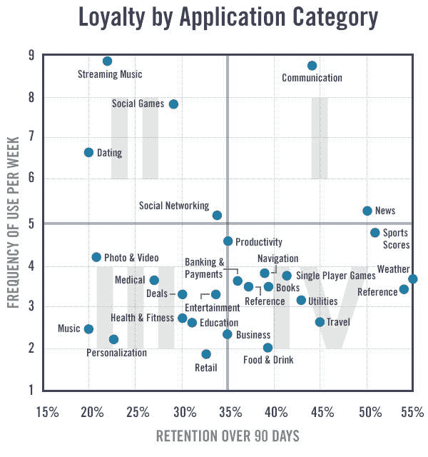

# MAU 毛是衡量敬业度的一个重要指标，但这是它在安德鲁森失败的地方

> 原文：<https://andrewchen.co/dau-mau-is-an-important-metric-but-heres-where-it-fails/?utm_source=wanqu.co&utm_campaign=Wanqu+Daily&utm_medium=website>

**DAU/MAU 如何流行**
DAU/MAU 是一个流行的用户参与度指标——它是你的日活跃用户与月活跃用户的比率，用百分比表示。通常 20%以上的 app 都说好，50%+就是世界级。

这个指标是如何使用的？MAU 毛一直是一个受欢迎的指标，因为脸书，推广了这一指标。因此，当他们开始谈论它时，其他消费者应用程序也经常被相同的 KPI 所评判。在 Facebook 平台时代，我第一次看到 DAU/毛比率，当时它被用来评估他们平台上的应用。

**Are you up to date?**

获取新的更新，通常一周一次——以关于技术发展的长篇文章为特色。

这个指标对脸书来说总是令人印象深刻，因为它一直很高。历史上这一比例一直在 50%以上。事实上，我一度很好奇它是否一直都那么好。确实如此。我从脸书 2004 年的媒体工具包中发现了这一点，该工具包显示了即使只有 7 万用户的小基数也有如此高的数字:

**用 MAU 毛**
评估产品/市场的契合度诚然，这是一个重要的指标，但它经常被误用为“XYZ 不起作用”，而事实上，有一个稍微不那么频繁的使用模式仍然同样有价值。

对于消费者和自下而上的 SaaS 产品，这一指标非常有用，但似乎除了日常使用的信息/社交产品之外，几乎没有包括任何东西。这些是有价值的产品，但不是唯一的。

**非日常用品，但仍有巨大价值**
并非所有东西都必须日常使用才有价值。另一方面，产品的使用是偶发性的，但每次交互都是高价值的。MAU 毛并不是正确的衡量标准。

*   在优步，我们最赚钱的乘车服务是去机场，乘坐黑车度过一个特别的夜晚，以及商务旅行等。这些并不是每天都发生的，尽管有人使用我们来通勤，但这并不是一般的用例。所以我们的 MAU 毛没有超过 50%。司机方面有一群每周工作超过 30 小时的“强力司机”，但正如它被广泛发表的那样，我们的普通司机实际上是兼职的。(帕累托原理！)
*   Linkedin 是另一个有趣的例子，它的使用频率很低——只有招聘人员和求职者在日常生活中使用它——但它提供了如此多的独特数据，以至于你可以在这个病毒式增长的数据库上建立一系列垂直的 SaaS 公司。
*   像 Airbnb 和 Booking 这样的旅行产品，消费者每年只使用几次。普通消费者每年只旅行 2 次。然而，在这个领域已经建立了数十亿美元的公司。
*   事实上，对 SaaS 来说，这似乎是个例外，而不是惯例。虽然电子邮件和商务聊天几乎是日常使用，但很多超级重要的工具，如 Workday、Google Analytics、Dropbox、Salesforce 等。可能每周最多只使用 1-2 次。
*   当然，很多电子商务看起来也是这样。你很少买床垫、新太阳镜、手表等。然而，在这个类别中有$1B+奖金。

您可能会注意到这里的一个模式。如果你是低频率/偶发性的，那么你必须产生足够多的有价值的钱或数据。如果你是高频用户，你就有更大的机会通过病毒式增长，建立一个利用广告赚钱的受众业务。

**先天与后天**
为了进一步延伸这一观点，你可以认为具有高 DAU/MAU 的消息/社交产品实际上是极端情况，事实上大多数产品类别的指数都不高。几年前，我[分享了来自 Flurry](https://andrewchen.co/what-factors-influence-daumau-nature-versus-nuture/) 的这张有趣的图表，它比较了不同的应用类别及其保留率与使用频率:

在这张图表中，有几个类别引人注目:

*   社交游戏出现频率高(“我快上瘾了！”)但是一旦你看完了这些内容，你就容易流失
*   天气也很有趣——你不经常查看，可能只在阴天查看，但你一生都需要查看——所以它在 90 天内保持率最高
*   由于前面讨论的所有原因，交流既是高频的，也是高保持率的。太棒了。

我想在这张图表上看到的是另一个叠加，货币化。在那里，我打赌旅行、约会和游戏会因为不同原因而脱颖而出。旅行是因为每笔交易都很大，约会/游戏是因为它的频率和对货币化的关注，因为你不会长久拥有用户。

**所以你想增加 DAU/MAU？很难**
假设你希望你的 DAU/MAU 增加，你会怎么做？有趣的是，许多人似乎认为实现电子邮件和推送通知会有所帮助。我的经验是，它往往会增加临时用户数(MAU ),但不会增加每日用户数。换句话说，关注通知实际上会降低你的 DAU/MAU，因为你的 MAU 会比 DAU 增长得更快。

我也没有见过 10%的 DAU/毛产品，通过纯粹的努力，变成 40%的 DAU/毛。这些产品类别的使用似乎有一种自然的节奏，不会随着时间的推移而发生很大变化。

**增加，衡量你的铁杆用户，网络效应，货币化**
如果你的 DAU/MAU 不是超高，这反而是我喜欢看到的:让我看看你的铁杆用户群。上周每天都处于活跃状态的用户比例是多少？他们在做什么？你将如何生产更多的呢？证明这个群体的存在大有帮助。

类似地，展示使用频率如何随着与某物的关联而增加。也许是他们网络的规模——显示网络效应——或者他们制作或保存了多少内容。然后提出论点，通过增加这个变量，MAU 毛将随着时间的推移而上升。

最后，也许 MAU 茅只是不适合你。有时候不一定要做前台 app 才能成功。也许你只需要建立一些很棒的东西，为人们做一些有价值的事情，赚足够的钱，并且他们一年使用两次！也很棒。

**DAU/MAU 是有用的，但也有其局限性**
总之，如果你的产品是一种高频、高保留率的产品，最终会得到广告支持，那么 DAU/MAU 应该是你的指路明灯。但是，如果你能很好地赚钱，开发网络效应，或者坦白地说，你的自然节奏不会很高——那么就测量其他东西吧！与自然抗争是不可能的…只要找到适合你的标准，告诉你你的产品正在为你的用户提供价值。

**PS. Get new updates/analysis on tech and startups**

我写一份高质量的每周时事通讯，报道硅谷发生的事情，关注创业、营销和移动领域。

在本网站链接的“内容”(包括帖子、播客、视频)中或在社交媒体和其他平台(统称为“内容分发渠道”)中发表的观点是我自己的，并不是 AH Capital Management、l . l . c .(“a16z”)或其各自附属公司的观点。AH 资本管理公司是一家在证券交易委员会注册的投资顾问公司。注册为投资顾问并不意味着任何特殊技能或培训。这些帖子不针对任何投资者或潜在投资者，也不构成出售或购买任何证券的要约，不得用于或依赖于评估任何投资的价值。

内容不应被解释为或以任何方式依赖于投资、法律、税务或其他建议。您应该向您自己的顾问咨询有关任何投资的法律、商业、税务和其他相关事宜。这些材料中表达的任何预测、估计、预测、目标、前景和/或观点可能会在不通知的情况下发生变化，并且可能与他人表达的观点不同或相反。此处提供的任何图表仅供参考，在做出任何投资决策时不应依赖。此处包含的某些信息来自第三方来源。虽然这些信息来自据信可靠的来源，但我并未独立核实这些信息，也未对这些信息的持久准确性或其在特定情况下的适当性做出任何陈述。该内容仅在所示日期有效。

在任何情况下，本网站或相关内容分销渠道上提供的任何帖子或其他信息都不应被解释为 a16z 人员发起、讨论或提及的任何集合投资工具中的任何证券或权益的购买或销售要约。也不应被理解为提供投资咨询服务的要约；投资 a16z 管理的集合投资工具的要约将单独提出，并且仅通过特定集合投资工具的保密要约文件提出，这些文件应完整阅读，并且仅提供给符合联邦证券法规定的特定资格的人。这些投资者被定义为合格投资者和合格购买者，通常被认为有能力评估潜在投资和财务事项的优点和风险。不能保证 a16z 的投资目标会实现或投资策略会成功。对 a16z 管理的投资工具的任何投资都包含很高的风险，包括损失全部投资金额的风险。提及、提及或描述的任何投资或投资组合公司并不代表 a16z 管理的所有投资工具，也不能保证这些投资将会盈利，也不能保证将来进行的其他投资会有类似的特征或结果。a16z 管理的基金所做的投资清单可在 https://a16z.com/investments/.获得。该清单不包括发行人未允许 a16z 公开披露的投资以及对公开交易的数字资产的未宣布投资。Andreessen Horowitz 投资、集合投资工具或投资策略的过去结果不一定代表未来结果。请参见[https://a16z.com/disclosures](https://a16z.com/disclosures)了解更多重要信息。