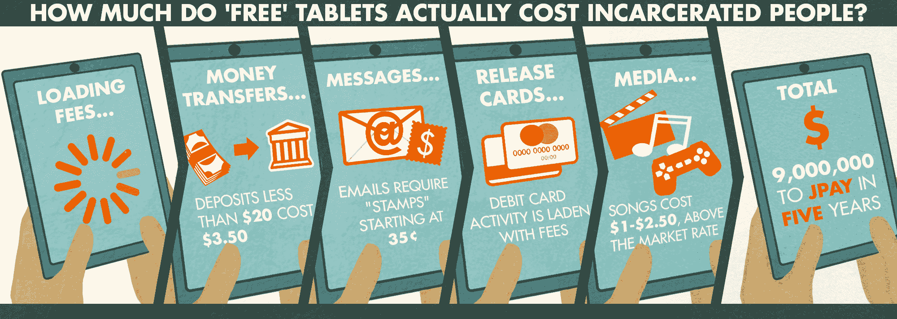

# 如何发现“无成本”平板电脑合同中的隐性成本|监狱政策倡议

> 原文：<https://www.prisonpolicy.org/blog/2018/07/24/no-cost-contract/?utm_source=wanqu.co&utm_campaign=Wanqu+Daily&utm_medium=website>

# 如何发现“零成本”平板电脑合同中的隐性成本

## 天下没有免费的午餐，也没有免费的平板电脑。

由[旺达·伯特伦](https://www.prisonpolicy.org/staff.html#bertram "Visit Wanda Bertram’s website")和[彼得·瓦格纳](https://www.prisonpolicy.org/staff.html#wagner "Visit Peter Wagner’s website")、 T5】2018 年 7 月 24 日

如果有人给你一台免费电脑，你肯定会怀疑有附加条件。因此，当私营公司向被监禁的人提供“免费”平板电脑时，政客们的怀疑是可以理解的，他们在为国家寻找隐性成本。

但是在寻求答案的过程中，政治家们往往会失败，正如我们今年早些时候在纽约州看到的那样。私人公司 JPay 与纽约州惩教署签订了一份合同[给 52000 名囚犯免费发放平板电脑](//static.prisonpolicy.org/scans/JPay_NYDOCCS_inmatekiosks_piggybackcontract.pdf)。面对立法者的提问，[该部门坚持](https://www.democratandchronicle.com/story/news/politics/albany/2018/01/31/new-york-prisoners-get-free-tablet-computers/1085620001/)——真实地说，**纳税人不会支付一毛钱**。

立法者放弃了这个问题，没有问更大的问题:是什么促使一家公司免费赠送 52，000 台平板电脑？

我们提交了一份公共记录请求，并得到了一个更完整的答案:52，000 台“免费”平板电脑是几个 JPay 服务一揽子交易(或“捆绑合同”)的一部分，这些服务**欺骗被监禁的人及其家人。**

[T2】](https://www.flickr.com/photos/133196677@N04/42729679625/in/dateposted-public/)

该合同包含了**我们[在过去几年](/blog/2017/07/06/tablets/)记录的几乎每一个剥削伎俩**，包括:

*   接管州立监狱的银行系统，这样他们就可以增加服务费用，比如存钱。在纽约州监狱里，只需向爱人的账户转账 10 美元，很快就会变成 3.15 美元到 4.15 美元。
*   [卖 0.35 美元的“邮票”](/messaging/)对于一个产品，他们竟然有脸打电话给电子邮件。(我们对自己的收件箱都有一种爱恨交加的关系，但把监狱短信称为电子邮件对电子邮件来说是不公平的。)
*   当被监禁的人被释放时，向他们提供退款，不是以支票的形式，而是通过一个充满费用的预付借记卡，比如每月的“服务费”，检查你账户余额的费用，或者对不活动的自动罚款。(你可以申请纸质支票，只需 10 美元。)
*   提供视频聊天，每 30 分钟 9 美元。
*   对音乐和电子书等媒体收取高于市场的价格。

这些条款解释了 JPay 如何期望在五年内从一份对国家免费的合同中赚取近 900 万美元:通过销售有利可图的收费服务来对抗平板电脑等“免费”产品。

纽约州的立法者从未费心去解开这个谜，但讽刺的是他们中的一些人却如此接近。以共和党议员史蒂夫·霍利(Steve Hawley)为例，他问道:“如果鼓励供应商向囚犯提供免费平板电脑这么容易，为什么不向我们的学生提供呢？”正如专栏作家埃里卡·布莱恩特[向](https://www.democratandchronicle.com/story/news/2018/02/03/prisoner-inmates-free-tablets-new-york-state-department-corrections-community-supervision/300496002/)指出的那样，答案是学生永远不会**购买假“邮票”**给父母发电子邮件。

像 JPay 这样的公司正在向越来越多的州提供“免费”平板电脑程序，立法者应该谨慎对待这些提议。你不需要一个高级学位就能发现纽约“无成本”契约中的**隐性成本**。诀窍是不仅要考虑纳税人的成本，还要考虑对被监禁者及其家人的剥削。