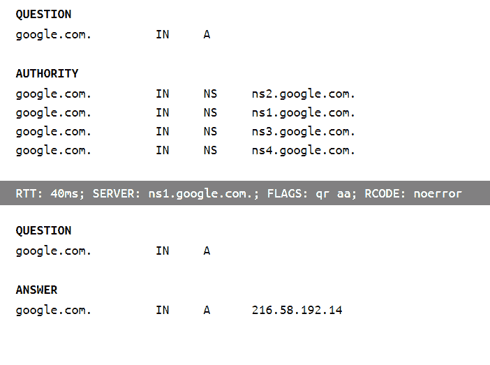
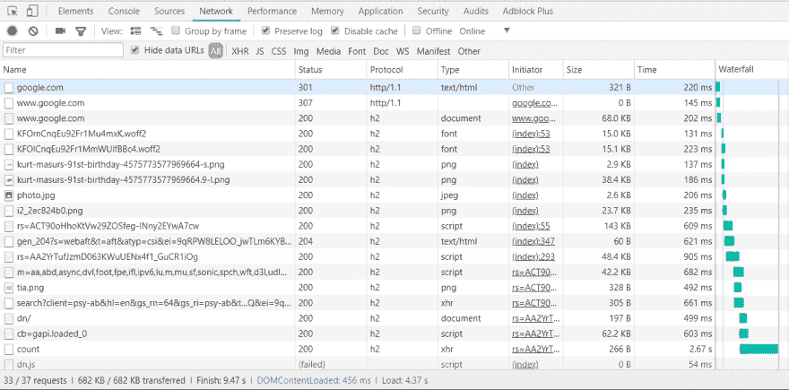
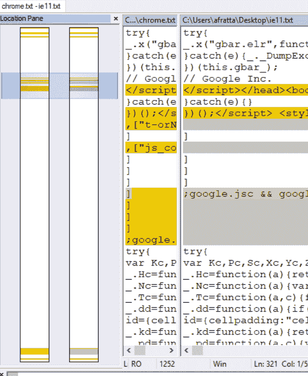
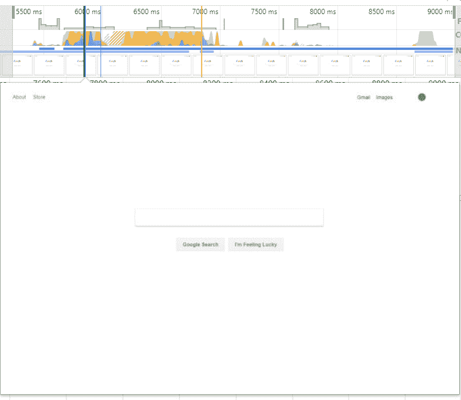

# 当你在浏览器中输入“google.com”并按回车键时会发生什么？-开发社区👩‍💻👨‍💻

> 原文：<https://dev.to/antonfrattaroli/what-happens-when-you-type-googlecom-into-a-browser-and-press-enter-39g8?utm_source=wanqu.co&utm_campaign=Wanqu+Daily&utm_medium=website>

我遇到过的最喜欢的面试问题是“你在浏览器地址栏输入‘Google . com’并点击`<Enter>`，之后会发生什么？”

有人可以连续几天试图以某种形式的完整性来回答这个问题。他们会去多深？严格来说是为了好玩，我把我的答案放在这里。当我在一次真实的面试中被问到这个问题时，我在他们拦住我之前，已经东拉西扯了足足 10 分钟。然后，即使在面试结束后，我也一直记得我忘记包括的东西。

我将保持这种文本墙的格式，因为这是在对话中回答这个问题的感觉。

# 那么会发生什么呢？

浏览器将分析输入。通常如果它有一个。它不会认为你在输入搜索词。一旦它决定它必须是一个 URL，它将检查它是否有一个方案，如果没有，它将在开头添加“http://”。因为您没有指定许多 HTTP 协议特性，所以它将采用默认值，比如端口 80、GET 方法和无基本身份验证。

然后它会创建一个 HTTP 请求并发送出去。我对自己的低级网络知识没有信心，但如果我有信心，我会说一些关于 MAC 地址、TCP 包传输、丢包处理的知识。但是无论如何，一个“google.com”的 DNS 查询将会发生，如果它还没有被缓存，一个 DNS 服务将会回复一个 IP 地址列表，因为“google.com”不仅仅只有一个 IP 地址。我相信浏览器会默认选择第一个。我不知道他们是否是地区性的，也不知道这个列表是如何工作的，但我知道它就在那里。

所以 HTTP 请求从一个节点跳到另一个节点，直到到达 google.com 的负载平衡器的 IP 地址。这不会持续很久，谷歌会回应说，你需要使用 HTTPS -假设与 301 永久重定向。因此，它会一直回到您的浏览器，浏览器会将方案更改为 HTTPS，使用默认的 443 端口并重新发送。这一次，TLS 握手将发生在负载平衡器和浏览器客户端之间。不是 100%知道它是如何工作的，但我知道这个请求会告诉谷歌它支持什么协议(TLS 1.0，1.1，1.2)，谷歌会用“让我们用 1.2”来回应。然后用 TLS 加密发送请求。

我认为谷歌下一步要做的是通过其负载均衡器上的网络应用防火墙规则来检查它是否是一个恶意请求。当它通过时，安全连接可能已经被终止(因为 PCI-DSS 规定说你不需要加密内部流量),请求将被分配到 CDN 中的一个池，google 端缓存的主页将在 HTTP 响应中返回。可能是预先拉上了拉链。

Google 的响应头将被浏览器读取，根据响应头缓存策略进行缓存，然后正文将被解压缩。因为它是谷歌，它可能是超优化的:缩小，可能有很多预渲染的内容，内嵌 CSS，JavaScript 和图像，以减少网络请求和首次渲染的时间。但是该请求将触发其他请求的级联，所有请求都是并发的，因为它应该运行 HTTP/2。当发出这些请求时，JavaScript 会被解析，可能不会阻塞，因为它们在标签上使用了 defer 属性——或者 async，我从来没有读到过它们分别做了什么。

但浏览器可能已经呈现了搜索框，并正在顶部的工具栏上工作，这将需要一些额外的网络请求——我可能已经有一个 cookie 或带有 OAuth 令牌的本地存储——或者我可能正在使用 Chrome，它已经知道我是谁，带有 Auth 的请求被发送到他们的 Google+ API，告诉 Google 搜索页面应用程序我是谁。

将发送另一个请求来获取我的头像图像。在这一点上，他们已经在浏览器中嗅出我是否没有使用 Chrome，在这种情况下，他们会弹出一个工具提示，告诉我 Chrome 很棒，我应该使用它而不是其他任何东西。

我想在那个时候它会安静下来。这一切都发生在不到一秒的时间里。

# 有什么明显的不同？

### 让我们查找一下 DNS:

[T2】](https://res.cloudinary.com/practicaldev/image/fetch/s--ery9Wp04--/c_limit%2Cf_auto%2Cfl_progressive%2Cq_auto%2Cw_880/https://thepracticaldev.s3.amazonaws.com/i/8nc04bwbxve26etocy10.PNG)

*   我知道我以前看到过 google.com 带着多个 IP 地址回来，但现在似乎不再是这样了。似乎他们以前使用循环赛，但现在不再使用了。[这个 StackOverflow 问题涵盖了它](https://stackoverflow.com/questions/10257969/is-it-possible-that-one-domain-name-has-multiple-corresponding-ip-addresses)。我忘了这叫循环赛。

### 网络层...

在一个正式的结构回答中，你可能会提到 OSI 模型，我知道这个模型，但并不精通。查了一下，我把它的网络分层图做成这样:

1.  应用程序-启动请求的逻辑
2.  演示文稿- HTTP
3.  会话- TLS
4.  传输- TCP
5.  网络分组路由(IP)
6.  数据链路帧(看起来像是数据包容器)
7.  物理比特流

*   我忘记了在 TLS 中，他们在达成协议后交换证书。
*   网络不是我最擅长的领域。

### 在浏览器中打开 google.com，禁用缓存:

[T2】](https://res.cloudinary.com/practicaldev/image/fetch/s--1rcF94iN--/c_limit%2Cf_auto%2Cfl_progressive%2Cq_auto%2Cw_880/https://thepracticaldev.s3.amazonaws.com/i/5xfy092achdb3anzxvj3.PNG)

*   我错过了主机名规范化——那是一个 301。
*   从 HTTP 到 HTTPS 的更正是 307 内部重定向。
*   然后，它下载字体、徽标图像和我的头像图像。没有 API 调用，这意味着他们将我的个人资料信息放在页面中，并将其与返回捆绑在一起——所以当您点击 google.com 时，他们正在进行实际的数据检索，而不仅仅是提供缓存的资产。

### 回应

[T2】](https://res.cloudinary.com/practicaldev/image/fetch/s--VCEEAF6r--/c_limit%2Cf_auto%2Cfl_progressive%2Cq_auto%2Cw_880/https://thepracticaldev.s3.amazonaws.com/i/8bl1db2l7k56n4z4jf6n.PNG)

以上是 IE 11 和 Chrome 响应的文件对比——都注销了。

*   IE11 和 Chrome 差别不大。但这意味着它们是嗅探服务器端而不是客户端的用户代理。我应该在回答中提到这一点。
*   没想到，Chrome 响应大了 22kB。我想知道是否是语音搜索功能，这是 IE 11 中明显缺乏的。IE11 可能需要 polyfills 和 Chrome 广告，但这一切都很模糊，我不会再折磨自己了。
*   即使在我清除了 Chrome 中的 cookie 后，它仍然会在第一次请求时发送 cookie。在 IE 11 中它不会这样做。

### 让我们深入研究一下那个渲染图！

[T2】](https://res.cloudinary.com/practicaldev/image/fetch/s--UCafbPDH--/c_limit%2Cf_auto%2Cfl_progressive%2Cq_auto%2Cw_880/https://thepracticaldev.s3.amazonaws.com/i/mw9y6rkr0vctseouktep.PNG)

上面的图片是 Chrome 给你的第一张截图。

*   脚本标签上没有任何 async 或 defer 属性，只有 nonce 属性。我现在正在学习 nonce，它似乎与安全相关。我猜他们想要那些屏蔽脚本。我敢肯定他们在某个时候摆弄过/没有 async/defer，并决定反对它。
*   自我提醒:完整响应是 JavaScript、CSS 和 HTML 的混合体。他们没有遵守任何关于分居的规则。

# 问题本身呢？

你猜怎么着对于一个开发人员来说，这可能不是一个很好的面试问题，因为这个答案包含了太多的人际关系。这是我喜欢的问题格式，开放式的，包括一些猜测。这让面试官有机会继续提问，比如“你认为 TLS 是如何建立的？”要看候选人是怎么想的，看他们有多有创造力，看他们的极限是什么(有多有耐心？).

你最喜欢的面试问题是什么？