# Goodreads 如何将 Amazon DynamoDB 表卸载到 Amazon S3，并使用 Amazon Athena | AWS 大数据博客查询它们

> 原文：<https://aws.amazon.com/blogs/big-data/how-goodreads-offloads-amazon-dynamodb-tables-to-amazon-s3-and-queries-them-using-amazon-athena/?utm_source=wanqu.co&utm_campaign=Wanqu+Daily&utm_medium=website>


在 Goodreads，我们目前正在将我们的 monolithic Rails 应用程序分解为微服务。对于这些服务中的绝大多数，我们已经决定使用 Amazon DynamoDB 作为主要的数据存储。我们喜欢 DynamoDB，因为它在我们的各种存储和吞吐量需求中为我们提供了一致的、一位数毫秒的性能。

尽管 DynamoDB 在高吞吐量的读写工作负载方面表现出色，但它并没有经过优化来支持一次性的即席查询或数据仓库工作负载。然而，通过组合 [AWS 数据管道](https://aws.amazon.com/datapipeline/)、[亚马逊 S3](https://aws.amazon.com/s3/) 、 [AWS Glue](https://aws.amazon.com/glue/) 和[亚马逊 Athena](https://aws.amazon.com/athena/) ，我们可以将数据集从 DynamoDB 导出到 S3，并使用 Athena 对该数据集运行 SQL 查询。

## 架构概述

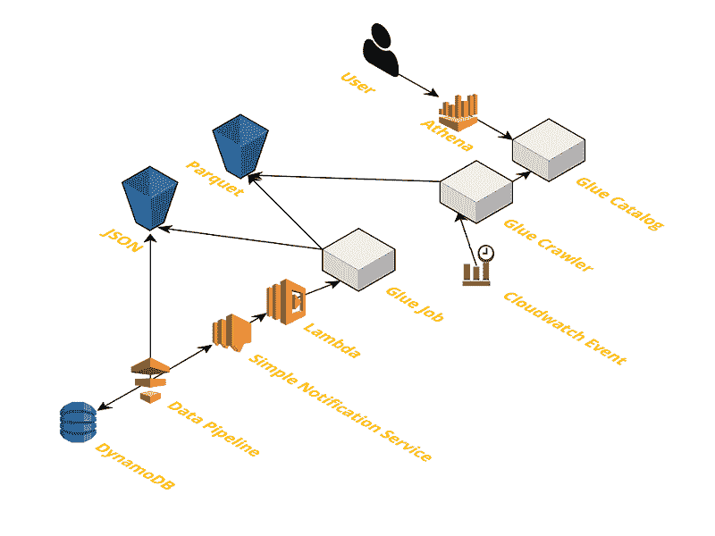

我们的流程架构如下:

*   AWS 数据管道扫描 DynamoDB 表中的数据，并将其作为 JSON 写入 S3。当它完成时，它会在一个亚马逊社交网站的主题上播放。
*   AWS Lambda 调用的 AWS 胶合作业将 JSON 数据转换成 Parquet。
*   AWS Glue crawler 将 S3 的拼花地板数据添加到 AWS Glue 数据目录中，以便 Athena 查询。

我们可以查询 JSON 格式的数据，这样就省去了额外的 Parquet 转换步骤。然而，我们决定做额外的努力，因为拼花地板是节省空间和高性能的。对于较大的数据集，这种方法不仅可以加快查询速度，还可以节省成本。

## 主要架构组件

我们架构的主要组件描述如下。

**数据管道**是一种编排服务，用于加速[亚马逊 EMR](https://aws.amazon.com/emr/) 集群，并使用大数据技术运行容错作业，如 Apache Pig、Apache Hive 或 Apache Spark。数据管道提供了一个模板，用于将任意 DynamoDB 表中的数据导出到亚马逊 S3。我们使用标准导出模板的稍加修改的版本。

在这个版本中，我们添加了在 Amazon SNS 上发送成功或失败消息的功能。这样做让我们可以使用 Lambda 启动数据管道服务之外的进一步处理。

**AWS Glue** 在该架构中有三种不同的使用方式:

*   一个无服务器的 Apache Spark 环境运行一个作业，将 JSON 导出从数据管道转换成 Apache Parquet 格式。
*   AWS Glue crawler 自动抓取和推断数据集的模式，并将其添加到 AWS Glue 数据目录中。
*   AWS Glue 数据目录是我们数据集的元数据存储，因此我们可以使用 Athena 查询数据。

**Athena** 在数据进入 AWS Glue 数据目录后使用。此时，您可以使用 ANSI SQL 在 Athena 中查询它。

## 建立基础设施

在这个过程中，我们使用 [AWS CloudFormation](https://aws.amazon.com/cloudformation/) 来管理我们的 AWS 资源。我们将各种 AWS 资源分成三个栈，使它们更具组合性。

`reviews.yaml`模板定义了一个名为`Reviews`的示例 DynamoDB 表。`common.yaml`模板包含跨栈共享的 IAM 和 S3 资源。`dynamodb-exports.yaml`模板定义了数据管道、Lambda 函数、AWS 粘合作业和 AWS 粘合爬虫。

### 使用审阅堆栈

`reviews.yaml` CloudFormation 模板包含一个简单的 DynamoDB 表定义，用于存储用户对书籍的评论。我们使用散列键和排序键结构，将一本书上的每个评论嵌套在特定用户下。这种结构允许应用程序在一个简单的 get 操作中检查用户是否对某本书有评论，并列出用户的所有评论。

### 使用 DynamoDB 表模式

`reviews.yaml`中定义的表是一个散列关键字和排序关键字表。用户属性是散列键，图书属性是排序键。如果在这个表上构建应用程序，可以添加额外的全局二级索引(GSI)来适应其他访问模式，例如显示一本书的最高权重评论。

首先，创建一个云形成堆栈:

1.  点击这个这个**启动堆栈**按钮:[](https://console.aws.amazon.com/cloudformation/home?region=us-east-1#/stacks/new?stackName=AWSBigData-DynamoToAthena-Reviews&templateURL=https://s3.amazonaws.com/aws-bigdata-blog/artifacts/goodreads-dynamodb/reviews.yaml)
2.  选择屏幕底部的**下一个**。
3.  在**选项**屏幕上，将一切设置为默认，并选择屏幕底部的**下一步**。
4.  在**审核**中选择**创建**

接下来，您在`Reviews`表中创建测试项。在`ReviewsStack`状态为 **CREATE_COMPLETE** 之后，您可以打开 DynamoDB 控制台并浏览该表。让我们在表格中添加一些项目:

1.  在 AWS 管理控制台中打开 DynamoDB。
2.  从左侧导航窗格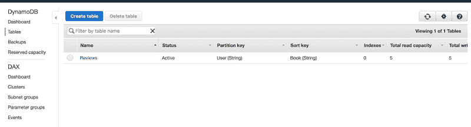中选择**表格**

3.  选择**评论**表，然后选择**条目**

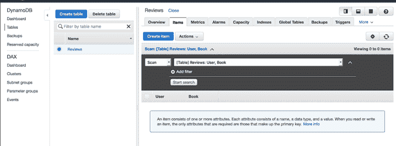

4.  选择**创建项目**，在**创建项目**框中，为**树**选择**文本**。

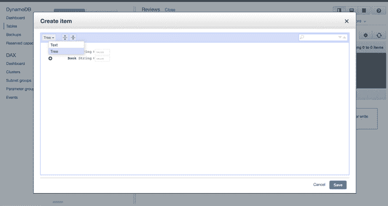

5.  删除现有文本，并将下面的项目复制并粘贴到文本框中。

```
{
  "User": "Tristan",
  "Book": "Harry Potter and the Philosopher's Stone",
  "Rating": 5,
  "Review": "A thrilling journey through the world of Hogwarts",
  "Author": "J.K. Rowling"
}
```

6.  选择**保存**。

现在我们再增加一项。

```
{
  "User": "Adeline",
  "Book": "Harry Potter and the Sorcerer's Stone",
  "Rating": 4,
  "Review": "Harry is pretty brave, but Hermione is the clear hero",
  "Author": "J.K. Rowling"
}
```

您可以看到，我们添加了一些不同的字段，这些字段没有在表模式中指定。值得注意的是，这些是:评级，审查和作者。因为 DynamoDB 是一个 NoSQL 数据库，所以我们可以随着应用程序的发展添加新的属性。然而，为了有效地聚合这些属性，它们要么需要在创建表时成为主键模式的一部分，要么需要在索引上定义[。](https://docs.aws.amazon.com/amazondynamodb/latest/developerguide/SQLtoNoSQL.Indexes.html)

Goodreads 评论表与我们的示例表没有什么不同。然而，我们使用了最多五个[全局二级索引(GSIs)](https://docs.aws.amazon.com/amazondynamodb/latest/developerguide/GSI.html) 来支持用户最需要的访问模式。对于我们来说，创建短命的 GSI 来回答我们关于数据的任意问题不再是一个选项。即使我们可以，我们有如此多的数据，创建一个 GSI 需要几天时间。

现在假设我们的产品团队想要对任意作者的评论数据进行查询。我们不能添加额外的 GSI，并且生产中不需要访问模式。然而，通过使用这篇博文中描述的架构，我们可以为我们的产品团队打开数据集。

您可以随意向表中添加更多的条目，因为当我们导出表时，表中的数据越多，您可以在 Athena 中运行的 SQL 查询就越有趣。

### 创建公共堆栈

`common.yaml` CloudFormation 模板创建了数据管道、Lambda 和 AWS Glue 使用的各种 IAM 和 EC2 权限。此外，该模板创建了一个 S3 存储桶来存储 DynamoDB 导出。需要跨栈引用的资源在 Outputs 部分声明。

创建云状堆栈，如下所示:

1.  点击此**启动堆栈**按钮:[](https://console.aws.amazon.com/cloudformation/home?region=us-east-1#/stacks/new?stackName=AWSBigData-DynamoToAthena-Common&templateURL=https://s3.amazonaws.com/aws-bigdata-blog/artifacts/goodreads-dynamodb/common.yaml)
2.  选择屏幕底部的**下一个**。
3.  在**选项**屏幕上，将一切设置为默认，并选择屏幕底部的**下一步**。
4.  在**评论**的**功能**部分，选择**我承认 AWS CloudFormation 可能会创建带有自定义名称**的 IAM 资源。
5.  选择创建。

### 创建 DynamoDB 导出堆栈

`dynamodb-exports.yaml`模板是一个自包含的模板，用于为任何给定的 DynamoDB 表创建数据管道、SNS 主题、Lambda 触发器、AWS 粘合作业和 AWS 粘合爬虫。如果您想要导出多个 DynamoDB 表，您可以重用`dynamodb-exports.yaml`模板并为每个表创建一个栈。

这个堆栈中最有趣的部分是 [AWS Glue job](https://s3.amazonaws.com/aws-bigdata-blog/artifacts/goodreads-dynamodb/dynamodb-export-to-parquet.py) 脚本，它将数据管道任务创建的任意 DynamoDB 导出文件转换为 Parquet。它还通过使用 Boto3 从原始 JSON 中删除了 DynamoDB 类型信息，boto 3 在 PySpark AWS Glue 环境中可用。该代码有很好的文档记录，所以如果您对如何编写定制的 AWS 粘合作业感兴趣，请不要犹豫，直接进入这里。

创建云状堆栈，如下所示:

1.  点击此**启动堆栈**按钮:[](https://console.aws.amazon.com/cloudformation/home?region=us-east-1#/stacks/new?stackName=AWSBigData-DynamoToAthena-DynamoDBExports&templateURL=https://s3.amazonaws.com/aws-bigdata-blog/artifacts/goodreads-dynamodb/dynamodb-exports.yaml)
2.  对于参数，输入以下内容，然后选择**下一个**:

导出超时:1

MaxConsumedReadThroughput: 0.5

表名:评论

3.  在**选项**屏幕上，将一切设置为默认，然后选择**下一步**。
4.  在**查看**部分，滚动到底部并选择**创建**。

## 观察从 DynamoDB 到 AWS Glue 数据目录的数据流

从 DynamoDB 到 Apache Hive 目录的管道是完全自动化的。在部署了用于导出评论的 CloudFormation 堆栈之后，数据管道就开始了。很快就可以在 Athena 中查询数据了。

监控数据管道:

1.  在控制台中打开 AWS 数据管道。
2.  选择名为`ReviewsExport`的管线。

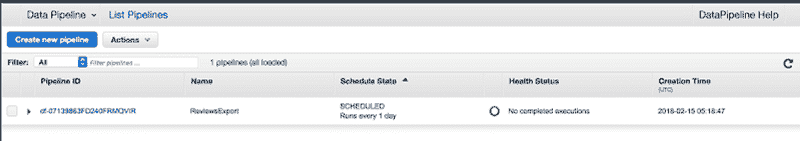

3.  在管道经历从配置集群到运行作业的各个阶段时，对其进行监控。

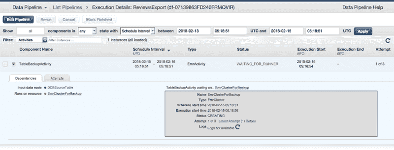

4.  当状态为**已完成**时，数据在 S3。

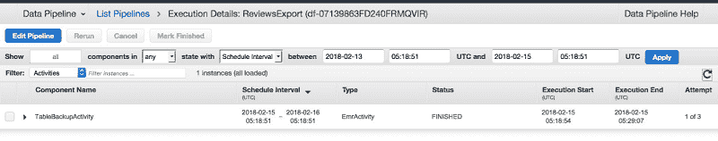

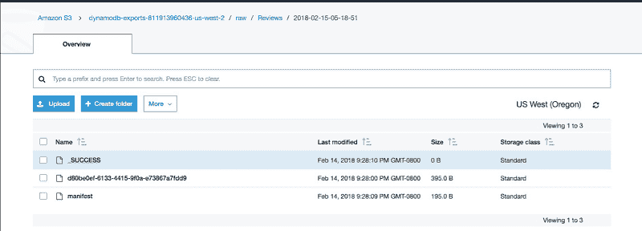

管道发送有关导出成功 SNS 主题的消息。这样做会触发 Lambda 调用 AWS Glue 作业，将 JSON 导出转换为 Parquet。

让我们监视 AWS 粘合工作:

1.  打开控制台中的 AWS Glue。
2.  在左侧导航窗格的 ETL 标题下选择**作业**。
3.  选择 **ReviewsExportToParquet** 旁边的复选框，查看作业的运行历史和其他详细信息。此时，**运行状态**处于**运行状态**

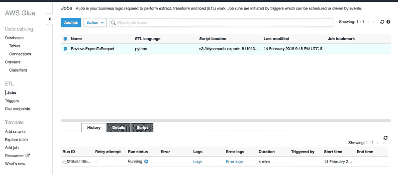

4.  当**运行**状态达到**成功**时，AWS 涂胶工作完成

接下来，运行 AWS Glue crawler:

1.  从 AWS Glue 控制台页面，选择左侧导航窗格上的**爬虫**。
2.  选择**reviewsparquecrawler**旁边的复选框。
3.  选择页面顶部的**运行爬虫**。

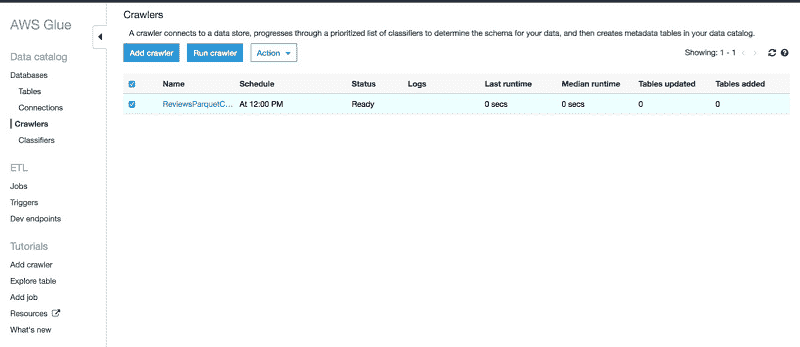

爬行器第一次运行时，会将`reviews`表添加到 AWS 粘合数据目录中的`dynamodb-exports`数据库中。如果在运行 crawler 后累积了更多的导出快照，crawler 的后续运行会向表中添加新的分区，

## 检查 AWS 粘合数据目录中的审阅表

接下来，查看评论表:

1.  从 AWS Glue 控制台页面，选择**表格**。

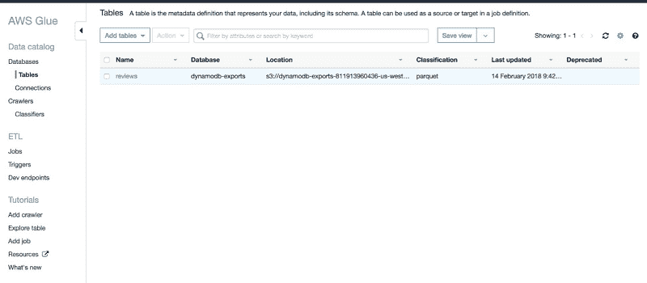

2.  选择**评论**。

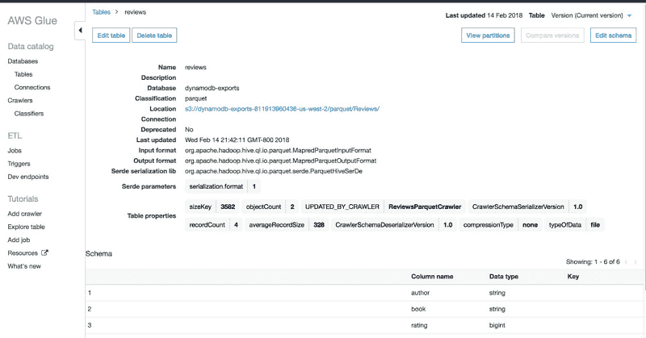

AWS 粘合数据目录是与 Apache Hive 兼容的 metastore，它存储数据集的模式。它存储 S3 的对象计数和数据集位置等属性以及其他数据。

看一下模式，您可能会注意到`ddb_export_timestamp`列，它最初不是我们添加到 DynamoDB 中的属性的一部分。在关键栏下，`ddb_export_timestamp`被标记为`Partition (0)`。分区列就像常规列一样，当在 Athena 的 WHERE 子句中使用它们时，它们允许您限制扫描的数据量。如果你想了解更多，雅典娜分区文档是一个很好的起点。

调用 Parquet 转换脚本的 Lambda 函数提供了这些额外的元数据。因此，当 AWS Glue crawler 推断模式时，会给分区一个有用的名称，而不是默认的 partition_N 名称(如果没有分区名称的话)。

### 使用 Athena 查询数据集

要使用 Athena 查询数据集，请执行以下步骤:

1.  在控制台上打开雅典娜。
2.  如果您还没有这样做，请升级 Athena 以使用配置单元目录。
3.  对于左侧导航窗格上的**数据库**，选择`dynamodb-exports`。

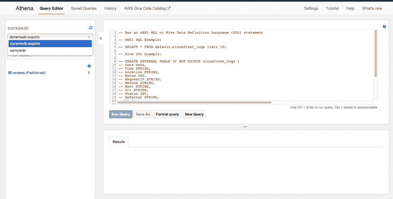

4.  在**表格**下，可以看到`reviews`。
5.  选择`reviews`右边的省略号，选择**预览表**。

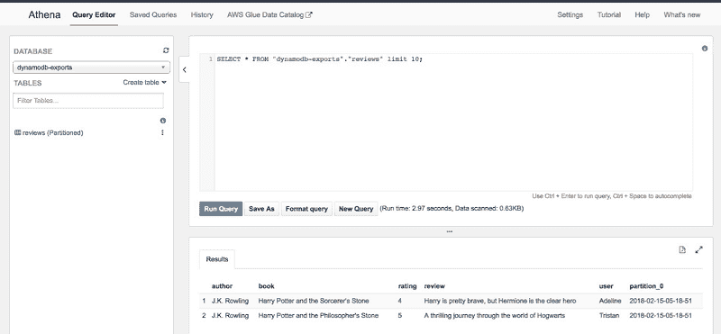

您刚刚在 DynamoDB 数据集上运行了 SQL 查询！让我们运行一个聚合来计算 J.K .罗琳有多少评论。您可能还记得，我们的 DynamoDB 表设计没有很好地支持这种访问模式。

```
SELECT COUNT(author) as num_reviews FROM "dynamodb-exports"."reviews"
WHERE author = 'J.K. Rowling';
```

如果添加更多项目，您可能会看到不同的结果，但这里是我们在表格中看到的结果。

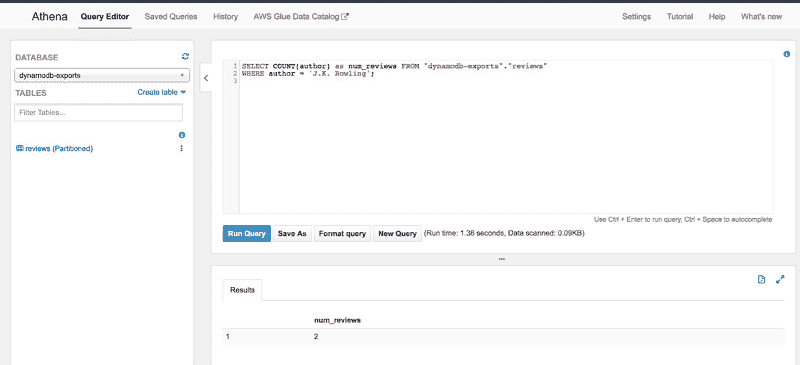

有了 Athena，随着数据的大小或复杂性的增长，您可以使用 ANSI SQL 从 DynamoDB 中提取数据。

### 后续步骤

这里有几种方法可以扩展这项工作:

*   修改数据管道，在当地时间每天午夜运行 DynamoDB 导出。
*   每天在当地时间凌晨 4 点运行 AWS Glue Crawler，这样您就可以在 DynamoDB 中始终拥有最新的数据快照。
*   使用导出成功主题触发更复杂的管道或聚合。
*   将这种方法与在 S3 建立数据湖结合起来。

## 结论

在本文中，我们将向您展示如何从 DynamoDB 表中导出数据，使用 AWS Glue 将其转换为更有效的格式，并使用 Athena 查询数据。这种方法为您提供了一种从存储在 DynamoDB 中的数据中获取洞察力的方法。

* * *

### 附加阅读

如果你觉得这篇文章有用，一定要看看这些:

* * *

### 关于作者

Joe Feeney 是亚马逊作者团队的软件工程师，他利用亚马逊的所有数据为作者提供独特的、可操作的见解。他喜欢在马里奥赛车上输给妻子和孩子，喜欢制作和改装吉他。

