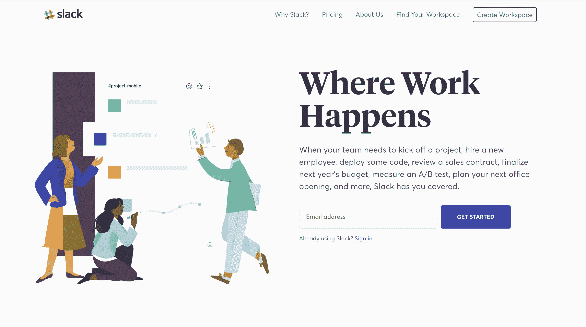
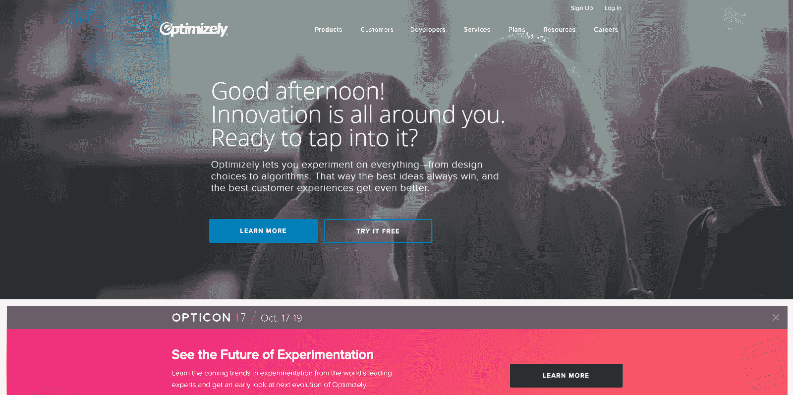
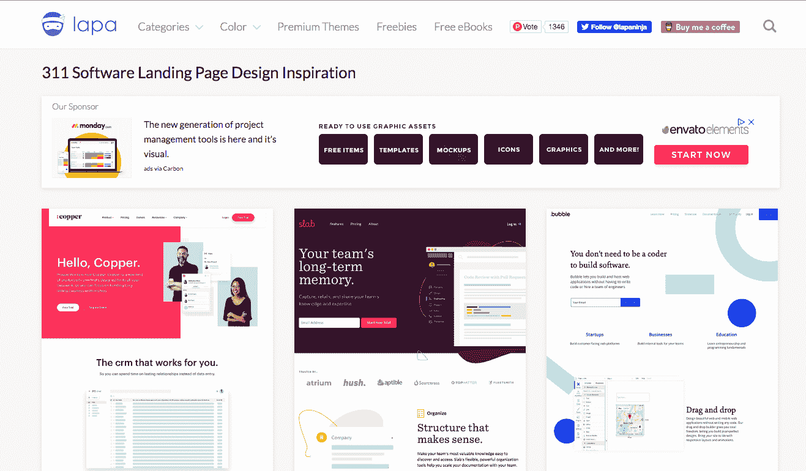
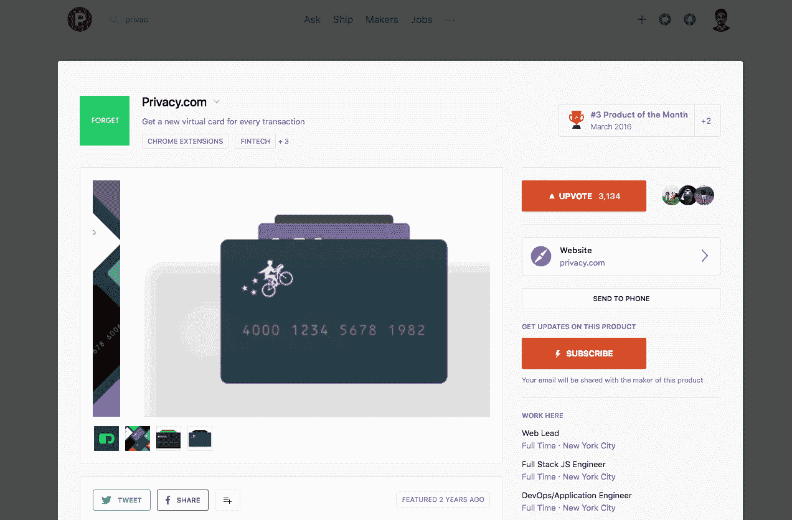
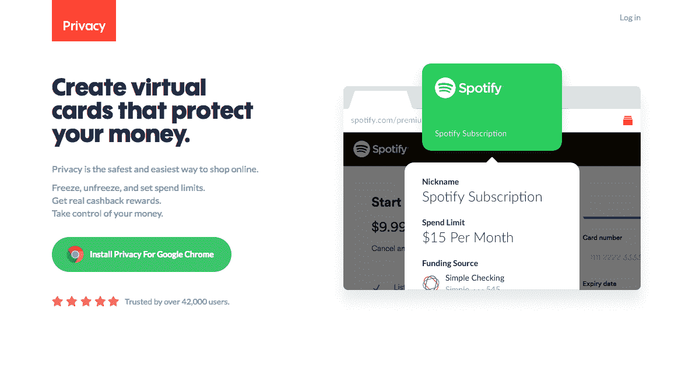

# 别再看更大公司的网站做参考了，没用的！+怎么做

> 原文：<https://www.indiehackers.com/@pedrocortes/011a186c95?utm_source=wanqu.co&utm_campaign=Wanqu+Daily&utm_medium=website>

## 基础知识

看更大公司的网站是极其偏颇的，要小心！

在这篇文章中，我将教你为什么不应该看大公司的网站，你的网站应该包括什么，以及如何为你的网站找到好的参考资料。

你看，这些公司在他们的领域更有名，他们不需要完美地解释一切，并使用他们的网站来获得所有的线索，这与你现在可能需要的正好相反。

**这里有一些“坏”网站仍然在大公司工作的原因:**

*   人们可能已经知道他们是谁，他们做什么。这不是网站的工作，它来自多年的营销。
*   他们有更多的资源，他们不依赖他们的网站来捕捉大部分线索。
*   他们有办法保持一个使用付费流量的昂贵漏斗，即使它的转化率是 0.0001%。他们可以承受不断的失败和尝试。
*   他们可能会有很多销售人员来完成网站本身无法完成的交易。
*   即使他们做了很多测试，他们测试的是他们的环境，而不是你的环境！

不幸的是，如果你不是一家大公司，或者手头有一大笔资金，这些都行不通

请继续关注，我将在本文的后面教你如何做！哦...还有一个额外的好处是[一个免费的电子邮件课程](http://www.cortes.design/email-course)，帮助你在 5 个步骤中获得一个伟大的登陆页面(即使没有设计技能)。

## 你可能喜欢但对你没用的网站

尽管其中一些设计得非常好，但它们并不十分清楚产品如何工作以及如何解决潜在客户可能有的异议。

你真的不应该以他们为榜样。

### 松弛的

Slack.com

<grammarly-btn></grammarly-btn>

这很难解释 Slack 是什么，它是如何工作的，它有多有价值，事实上，如果你在它下面添加一些标志，这几乎是他们的整个登陆页面。

他们可以侥幸逃脱，因为很多人已经知道 Slack，这个页面只是一个简单的注册表单。

### 优化地

Optimizely.com - has since been updated

<grammarly-btn></grammarly-btn>

什么？

看那个标题？你知道他们在做什么吗！？

如果你这样做，你会得到 90%以上的跳出率，大多数人不会再继续浏览低于这个数字的网页。你转化客户的机会已经没有了...

### 吉拉软件(来自 Atlassian)

不要用“我们是 X 事物的第一”，尤其是在开头。

我不相信任何人能把这个标题摘下来，对于更严肃的潜在客户来说，这听起来像是废话！

看看这些房地产，没有解释他们的解决方案的价值和定义正确的期望值，这是你可能犯的最大错误之一。

然而，你应该在整页中提到你是否获得过任何奖项(或类似的东西)，因为是别人说你的产品是第一名，而不是你自己(也就是真正的社会证明)。

## ✅你的网站在早期需要做什么

*   解释什么是它，它如何工作，它如何有价值，以及他们现在如何尝试/购买它。
*   通过让您更快、更有效地测试市场或新计划/服务，帮助您提高产品的市场适应性。你不必担心问题是来自市场，还是来自没有正确转换的网站，这可以为你节省几个月的时间和跑道。
*   能够充分解释您的产品，以便潜在客户进入下一步，例如，销售电话、注册、免费试用或您可能需要的任何其他形式的线索…
*   回答潜在客户的异议
*   以可扩展的方式复制第一批客户的购买体验。
*   使您能够专注于产品和营销，因为网站会让你领先，如果你为你驱动流量。

想要这样的页面吗？我可以帮助您实现这一目标，起价 299 欧元(350 美元)[更多信息请点击](https://www.pedrocortes.me)

## 如何为你的网站找到好的参考

### 登陆页面灵感

lapa.ninja

<grammarly-btn></grammarly-btn>

我推荐 [lapa.ninja](https://www.lapa.ninja) ，因为它有一大堆类别，你可以在线选择其他未分类的网站(或使用无用的过滤器)。

**如何做对:**

*   仅用作那些真正需要他们的网站来获得销售的公司的参考。
*   尝试搜索与您的登录页面属于同一类别的页面，因为您可能会有类似的异议。

****💪**亲提示:****** 

****看看你不知道的公司的网站，看看你是否能理解他们做什么。如果对你来说很清楚，试着找出为什么以及哪一部分让你理解了他们提供的价值，然后在你自己的网站上实现它。****

### ******使用返程机******

******2014 年 8 月松弛******

******看吧！可能看起来不那么干净或漂亮，但当时他们努力解释懈怠如何能提高团队的生产力。******

******让我们再来谈谈 slack，看看[这篇关于 slack 如何工作以及它如何变得更好的更详细的解释](https://web.archive.org/is/team-communication)，不像现在，他们离不开它！****** 

********如何做对:********

*   ******弄清楚他们是什么时候推出的，看看他们是如何推广的。******
*   ******请注意他们发布的时间和他们开始受到关注的时间之间的差异。如果你搜索一个著名的公司，你甚至可以搜索文章来了解当时发生的事情。******

### ******在产品搜索上看看最好的发布******

******让我们以 Privacy.com 为例...******

******

3,134 Upvotes! People understood the value!!

<grammarly-btn></grammarly-btn>******

******

Very clear Website!!!

<grammarly-btn></grammarly-btn>******

******如果人们投了赞成票，那是因为他们明白他们所提供的价值，并对推广它感到格外兴奋。****** 

******警告:忽略大公司或大受众的发布，他们可以简单地利用这一点来拉选票。**“新的和即将到来的”类型的东西是你的理想参考！********

******___________________________________******

******🎁**奖金** -免费电子邮件课程****** 

****我有一个 100%免费的电子邮件课程，可以帮助你通过 5 个步骤制作出这样一个页面(当然，即使没有设计技巧)****

****___________________________________****

****💪**新** -开发者登陆页面**** 

## ****想要一个这样的页面来更快/更好地验证您的产品吗？****

****验证一个产品可能很难，当登录页面没有正确解释它时，可能会出现各种各样的问题，我可以帮助你！****

****我用更好的登陆页面帮助开发者和创业者验证他们的产品，  [点击这里了解更多](https://www.pedrocortes.me/)**** 

****以下是你获得成功的方法！！****