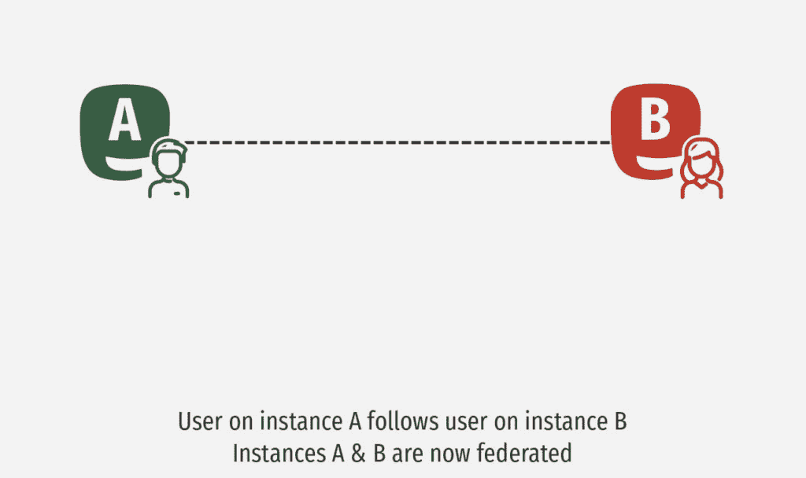
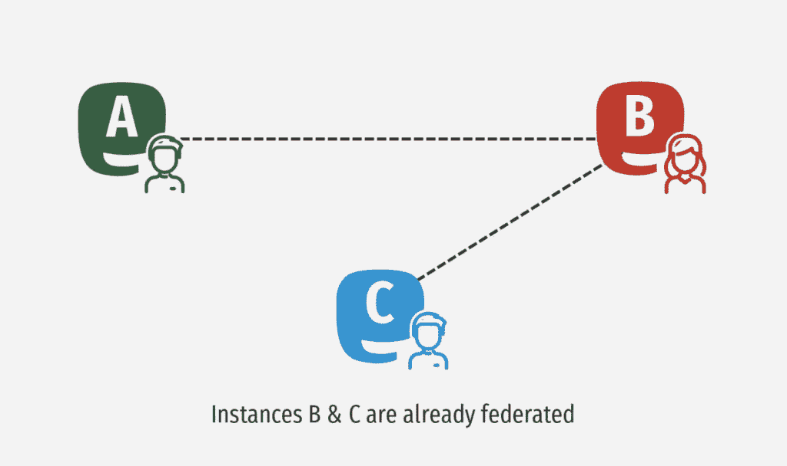

# 乳齿象是如何工作的？凯文·奎克

> 原文：<https://kevq.uk/how-does-mastodon-work/?utm_source=wanqu.co&utm_campaign=Wanqu+Daily&utm_medium=website>

“乳齿象是如何工作的？”最初写于 2018 年 8 月 4 日，但我在 2020 年 6 月 11 日更新了它。

在阅读这篇文章之前，我推荐阅读我在[乳齿象](/getting-started-with-mastodon/)入门上的文章。

我已经在这个博客上无数次提到过乳齿象。它是我使用最多的社交媒体平台，但对于一个新用户来说，它可能会令人困惑，因为它不像其他社交媒体网站那样工作。

我的乳齿象实例的一个新成员， [Fosstodon](https://fosstodon.org) ，写了他们的第一篇文章，声明他们并不真正确定乳齿象是如何工作的。作为一个尽职尽责的管理员，我回复了他们，让他们知道我会找到一个像样的指南和一个链接。令我惊讶的是，我在任何地方都找不到一本像样的指南，所以我决定写一本。

在这篇文章中，我将尝试涵盖乳齿象的所有基础知识，以及它如何工作的细节。在这篇文章结束时，你应该对乳齿象是如何工作的有一个很好的了解。所以，坐下来喝杯咖啡吧，因为我想这会是一个漫长的过程。

## 嘟嘟嘟

让我们从基础开始；乳齿象的工作方式类似 Twitter，但有几个关键区别:

*   乳齿象上的“推特”被称为“嘟嘟”，默认情况下，你有 500 个字符的限制。
*   你可以设置嘟嘟的隐私。默认情况下是公开的，但是他们也可以是非公开的、仅关注者的或直接的。
*   你也可以给其他用户添加媒体、链接和标签。

### 回答

当然，你可以回复任何你看到的嘟嘟声——毕竟，如果你不能进行对话，拥有一个社交网络又有什么意义呢？

### 促进

如果你遇到你喜欢的嘟嘟声，你可以提高它的音量。这基本上是将嘟嘟声再次分享给你的追随者。

不像 Twitter，你不能给一个被吹捧的嘟嘟声添加自己的评论。这是设计出来的，所以一个人的嘟嘟声只有在能够传达他们想要传达的信息的情况下才会增强。

这基本上是一种防止人们通过助推被套牢的方法。例如，你不能把“这个叫凯文·奎尔克的家伙是个彻头彻尾的白痴”加到我的一个被你吹捧过的女人身上(尽管很多人可能会这么想)。

### 特别受喜爱的

你也可以喜欢嘟嘟声。这基本上意味着你支持或同意一个嘟嘟声。这就像一个脸书喜欢，或一个 Twitter 的心。

所有的 Toots 下面都有一组图标，允许你回复，增加或者收藏。图标看起来像这样:

## 多元的

如果你读到乳齿象，你会经常听说 fevaried，或一般的联合会。与更主流的社交网络相比，这是乳齿象独有的概念。这意味着许多新用户可能会发现联合的概念令人困惑。让我们把事情弄清楚，好吗？

### 什么是联邦？

当你登录 Twitter 时，你有一个由你关注的人的推文组成的时间线。乳齿象是不同的，因为它有三个时间线——家庭、本地和联邦。

这些时间线中的每一个都有不同的功能，我稍后会解释，但现在让我们看看乳齿象网络是如何交流的。不同的时间线应该会更有意义。

这里有一个简短的视频，介绍了乳齿象联盟的概念:

<iframe loading="lazy" title="What is Mastodon?" src="https://www.youtube.com/embed/IPSbNdBmWKE?feature=oembed" frameborder="0" allow="accelerometer; autoplay; clipboard-write; encrypted-media; gyroscope; picture-in-picture" allowfullscreen="">视频</iframe>

为了更好地解释乳齿象联盟，我将使用电子邮件作为类比——希望这将使事情更容易理解。

乳齿象网络由称为实例的独立服务器组成。如果我们用电子邮件来类比；把乳齿象整体想象成电子邮件。因此，如果乳齿象是“电子邮件”，那么实例就是电子邮件提供商。比如 Gmail，Hotmail，或者 Zoho。

它们都是由完全不同的公司运营的完全不同的服务器，但 Gmail、Hotmail 和 Zoho 都可以互相发送电子邮件。

乳齿象也一样。我的实例，福斯托顿，是运行我自己和我的朋友迈克。然而，我们可以用世界上数以千计的我们不运行的其他乳齿象服务器。

### 提到人

如果你想在推特上给某人发消息，你就给他们发。乳齿象上也一样。如果我想对我的朋友 Mike 嘟嘟，我可以简单地将他的句柄(`@mike`)添加到我的嘟嘟中。

但是如果我想在另一个乳齿象实例中提到其他人呢？嗯，我会用`@user@instance.name`来提到他们。

例如，我和[巴兹尔](https://sarcasm.stream/@basil)在《乳齿象》上互动很多，但是他和我的情况不同。所以如果我想在嘟嘟声里提到他，我会在嘟嘟声里加上`@basil@sarcasm.stream`。如果巴兹尔想提到我，他会在他的嘟嘟声后面加上`@kev@fosstodon.org`。

不过，不要担心必须记住用户的用户名和实例名。乳齿象有一个自动完成的特性，一旦你开始输入一个`@mention`，它可以帮助填充一个人的句柄/实例。

## 实例如何连接？

如果有人决定开始一个新的实例，那么 Fediverse 的其他成员如何知道他们在那里并开始与他们通信呢？嗯，这就是社区和联盟的用武之地。

全世界有成千上万个乳齿象实例，所有实例都是由它们的用户连接起来的。

实例 A 可能不知道实例 B，但是如果实例 A 上的用户关注实例 B 上的用户，则实例 A 知道实例 B 的存在，并且它们将开始相互通信。

此外，实例 A 可能不知道实例 C 的存在，但 B 知道。因此，实例 A 中的用户可以跟踪实例 C 中的用户，此时实例 A 和 C 也是联合的。

我知道这在文本中很难理解，所以让我们用一些图表来分解它:

这一过程持续不断，导致了生物多样性指数增长的滚雪球效应。

## 时间线

好了，现在我们知道了 Fediverse 是如何工作的，让我们回到我们的三个时间线，看看它们都做了些什么:

*   **家庭时间线**——这是一个简单的时间线。它基本上和你的 Twitter 时间表一样——它是你关注的所有人的嘟嘟声。
*   **本地时间线**–这是来自您的实例的所有公共嘟嘟声。因此，无论您是否关注某人，您都会看到您的实例中正在进行的所有活动。这是在当地寻找新朋友的好方法。
*   **联合时间线**–这是您的服务器与之联合的所有实例的所有 Toots 的时间线。同样，这是一个寻找新的关注对象的好方法，因为它包含了成千上万人的嘟嘟声。但是要注意——联合时间表可能包含一些用户可能会觉得冒犯的帖子。

谈到潜在的攻击性嘟嘟声，这让我们很好地进入下一部分…

如果你在乳齿象上发现了你不想看到的东西，有很多方法可以处理。如果嘟嘟声特别严重，我建议向实例的工作人员报告嘟嘟声。然后，他们可以查看报告并采取适当的措施。

如果你觉得嘟嘟声只是你不想看到的东西，那么在乳齿象上也有个人调节选项。

您可以使用任何嘟嘟声下面的三个点图标来查看所有的审核选项。在菜单中，您有许多调节选项:

*   静音(Mute)–这将使你看不到这个特定账户的任何嘟嘟声。
*   **阻止**–这将阻止该帐户与您互动。这也将静音他们的嘟嘟声。
*   **Report**–这将向实例的人员发送一份报告。然后他们应该检查报告并采取适当的措施。这可以是无动作、对用户的警告或禁止他们进入实例。

别担心，亚尔莫，我不会阻止你的！🙂

### 过滤

如果不谈论过滤器，你就不能真正地谈论乳齿象节制是如何工作的。

过滤器是伟大的，因为它们允许你过滤掉某些关键字。这可能是脏话，或者只是你不想听的话题。

例如，当新冠肺炎刚开始的时候，在 fevarieve 上有很多关于它的聊天。我完全理解为什么，但我真的不想在乳齿象上读到它，所以我决定过滤掉它，直到事情平息下来。

我还过滤掉了`#WeAreNameless`标签，主要是因为我发现它令人困惑。要添加过滤器，只需转到`yourinstance.com/filters`

## 为什么是乳齿象？

所以你现在知道乳齿象是如何工作的，以及如何使用它。但是你为什么要在 Twitter 或脸书上使用它，我为什么要使用它呢？以下是一些原因

### 它是开源的

它是开源的那又怎样，对吗？事实上没有。开源意味着任何人都可以[看到乳齿象源代码](https://github.com/tootsuite/mastodon)来了解它是如何工作的。你不能在许多其他社交网络上这样做，所以你不知道该网站在后台做什么。

当然，许多乳齿象的用户不是软件开发人员，所以他们不知道乳齿象的源代码是做什么的(包括我自己)，但是有成百上千的开发人员看过乳齿象的代码。如果它做了什么邪恶的事，相信我，我们会知道的。

开源让我们确信我们的数据不会被收集，或者我们不会被监视。另外，如果乳齿象的主要开发人员 [Eugen](https://mastodon.social/@gargron) 决定放弃他的键盘，其他人可以代替他并派生项目的源代码。

### 时间线

这似乎是一件小事，但对我来说，这是乳齿象最重要的特征之一。你看，脸书和推特有“聪明”的算法，旨在改变每次更新时你看到的内容的顺序。这是为了给人一种新内容的感觉，希望能让你保持更长时间的参与。

乳齿象就不是这样了。所有三个时间线总是按时间顺序显示。所以你可以很容易地看到当你最后一次在线时，人们发出了什么样的嘟嘟声。这意味着乳齿象并不是专门为了接管你的生活而设计的(虽然它是，因为它太棒了！)它很容易让你看到自从你最后一次上网以来发生了什么，然后继续你一天的剩余时间。

### 没有广告或跟踪

没错，没有广告！没有赞助商的帖子，没有“我们认为你可能会喜欢这个”和没有跟踪。乳齿象是为了把人们聚集在一起，而不是为了赚钱。就这么简单。

话虽如此，大多数实例都有 Patreon 页面，因为运行一个 Mastodon 服务器会很昂贵。因此，如果你使用乳齿象并喜欢它，我会敦促你尽你所能为你选择的实例做出贡献。根据我的经验，这些钱经常被用来改进项目。

在 Fosstodon 上，我们使用除了我们正在进行的收费之外的任何[捐款](https://hub.fosstodon.org/support-us)来为各种开源项目捐款。我们向哪些项目捐款是由捐款人决定的。

### 没有单一所有者

因为乳齿象使用实例的集合，所以您不会听凭一个站点所有者的使唤。如果你不喜欢一个实例的发展方向，你可以打包你的虚拟行李走人。Mastodon 甚至有一个[迁移工具](https://blog.joinmastodon.org/2019/06/how-to-migrate-from-one-server-to-another/)，可以让你将账户从一个实例迁移到另一个实例。

### 兴趣明确，但不尽然

拥有不同实例的美妙之处在于，它们中的许多都与一个兴趣或领域相关联。例如，我的实例 Fosstodon 是特定于自由和开源软件(FOSS)的，因此得名。然而，我们鼓励 Fosstodon 的用户谈论各种有趣的事情，而不仅仅是开源软件。

因此，尽管我们实例的所有成员都有一个共同的兴趣(FOSS ),但还是有许多定期讨论的话题。如果你愿意，也可以加入许多通才实例。这些更像 Twitter，因为它们没有特定的利益支撑。

记住，你也可以关注对其他实例有不同兴趣的人，所以你的家庭时间表可以非常多样化——我知道我的是这样！

## 查找实例

fevariety 上有成千上万个乳齿象实例，那么如何找到正确的呢？嗯，找到合适的很难。乳齿象主页有一个注册区，展示了一些特定领域的关键实例。

以下是我根据与 fevariety 网站上许多有趣的人的交流得出的一些建议:

如果上面的例子都不适合你，你可以看看[例子。基本上是乳齿象实例的搜索引擎。然而，我一直觉得这个网站不好用，因为它没有很多过滤选项。](https://instances.social)

## 移动应用

乳齿象有许多移动应用程序可用。我在 Android 和 iOS 上都尝试过很多。我的推荐是安卓版的 [Tusky](https://play.google.com/store/apps/details?id=com.keylesspalace.tusky&hl=nl) 和嘟嘟版的[！](https://apps.apple.com/us/app/toot/id1229021451)针对 iOS。

然而，如果你想查看所有其他可用的应用程序，包括桌面应用程序，[看看这里](https://joinmastodon.org/apps)。

## 最后的想法

希望现在你已经对乳齿象的工作原理有了很好的理解。乳齿象很牛逼；那里都是友好有趣的人。没有跟踪，也没有广告，这是奖金。

像大多数社交网站一样，网络上也有“巨魔”——没有他们就没有互联网！但是乳齿象内部的调节工具使它成为一个很好的地方。

希望本指南能帮助你开始接触乳齿象，但是如果你有本指南没有涉及的任何其他问题，请随时在下面发表评论，[或者联系](https://kevquirk.com/contact/)，我会尽力帮助你。

最后，如果你已经在《乳齿象》上了，并且想跟随我，你可以在这里这样做。