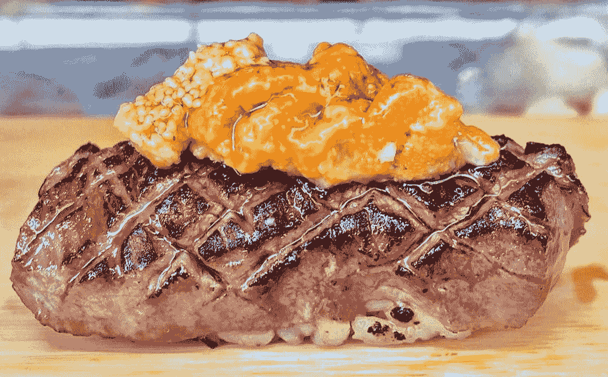

# Instagram 正在毁掉纽约食客的寿司

> 原文：<https://ny.eater.com/2018/8/10/17672814/sushi-instagram-ruining-nyc?utm_source=wanqu.co&utm_campaign=Wanqu+Daily&utm_medium=website>

问任何真正研究过寿司工艺的顶级寿司厨师，他们都会告诉你:吃一块完美寿司的窗口是三秒钟。事实上，厨师们经常开玩笑说，把寿司送到顾客口中是最好的方式。

但是纽约市的餐馆正出现一种令人不安的趋势。越来越多的寿司店开始玩 Instagram 游戏:Uni 被堆在 wagyu 上，T2 鱼子酱被堆在 T3 上。由于用餐者需要时间来获得他们的完美照片，精心切割的，着魔般采购的鱼片改变了它们的理想温度。结果是:毕生致力于完善寿司技术的寿司师傅们正在失去生意，被那些愿意把一些鱼放在彼此身上的噱头寿司餐馆抢走了。

Instagram 实际上正在破坏寿司艺术——在这一点上，大厨们对此无能为力。

* * *

Sushi Yasuda 的厨师 Mitsuru Tamura 说，有几个原因可以解释为什么用餐者不应该在吃寿司的时候花时间给寿司拍照。“大米和鱼之间有温差，”他说。“那是吃饭的最好时机。”不幸的是，拍摄一张完美的照片通常需要超过三秒钟的时间。纽约米其林星级寿司餐厅的主厨伊藤正史(Masashi Ito)说:“有些人会带一台相机，一台手机相机，他们会花三到四分钟的时间。”。

米其林两星级餐厅寿司银座小野寺(Sushi Ginza Onodera)的主厨斋藤正树(Masaki Saito)明白这些照片的价值，也知道经营一家餐厅是一门生意。但是，他通过翻译告诉 Eater，给寿司拍照让人们脱离了那个时刻。“老实说，我想禁止相机，”斋藤说。“我希望手机处于飞行模式，并储存起来。我想让他们专心吃饭。”

<aside id="SME1Bi"><q>‘To be honest, I would like to ban cameras. I want the cellphones in airplane mode and stored away.’</q></aside>

斋藤补充说，归根结底，一个 oma kase——在银座小野寺售价高达 400 美元，在其他地方很少低于 100 美元——讲述的故事超出了餐厅的范围。他说，每一小块都代表了厨师，也代表了捕到鱼的渔民、进口商、送货人，以及厨师的准备工作。斋藤说:“(每一片寿司)都有一个无法在一小时内讲完的故事。”。“经过四五天的过程，最终制作出一块寿司。这就是为什么它值 400 美元。”

除了亵渎寿司的神圣之外，Instagram 还通过繁殖海胆(在日本被称为 uni)极大地改变了这一景观。咸咸的、饱满的黄色花瓣是昂贵寿司的代名词，尽管它们的味道很精致，但它们在视觉上很响亮，在其他鱼块中脱颖而出。新奇的新 iPhones 可以很紧的抓住它们所有的小毛孔。

据加利福尼亚海胆进口和渔业公司 Maruhide 的 Mark Nonoyama 称，在过去的五年里，鱼卵的销售额翻了一番多。伊藤说，许多顾客一坐下就要 uni。虽然 uni 一直是高端 omakases 中的一个关键部分，但它已经扩展到整个菜单上。“我去一些餐馆，三分之一的菜单、热门应用和主菜上有 uni，这是以前从来没有过的，”伊恩·普尔卡亚斯塔说，他是雷加利斯背后的天才配料经销商，专营松露、鱼子酱和海鲜等奢侈配料。他说，即使在他自己公司的 Instagram 上，uni photos 在参与度方面也往往优于其他照片。现在，Purkayastha——他是 Boulud Sud、Eleven Madison Park 和 Gabriel Kreuther 等餐厅的供应商——说他觉得他的公司销售的 uni 是前几年的三倍。

海胆是公认的美味，但他们说，它不是许多天才厨师渴望的画布。它不需要切割、腌制或陈化，这更考验厨师的购物技巧，而不是他或她的天赋。伊藤说:“如果(用餐者)说鲭鱼是有史以来最好吃的，我会比人们告诉我，哦，是 uni 更高兴。”。“当然[uni]很棒，因为它是最好的 uni。但是如果有人说你的鲭鱼是最好的，你会很开心。因为我花了时间去鱼片，去骨，去鳞，我把鱼治好了。”

Uni 虽然在 Instagram 上很受欢迎，但通常是以 *gunkan maki* 、的方式提供，这种风格使它比其他食物更具时效性——使吃饭前的停顿变得更加荒谬。Gunkan maki 是一种传统风格，将海藻包裹在饭团周围，形成一个小杯子，固定住海胆卵，使其不会从米饭上滑落。当脆脆的、像纸一样薄的海藻触碰到潮湿温暖的米饭时，时钟开始计时。质地在瞬间从松脆变得湿润，这就是为什么它必须立即形成、传递和食用。“海藻，如果你把它放太久，它会变湿，变潮，留在你的嘴里，甚至在 uni 和米饭吃完后，”Ito 说。

当多片 uni 挤在一起拍摄最终照片时，这个问题变得更加严重，就像在 Juku 广受欢迎的 uni flight 一样，五片 uni 并排排列，创造了一个海藻融化爱情的桑拿浴。费用每天都在变化，但奥马卡斯的附加费大约是 50 美元。

<aside id="ojKVPR"><q>Uni is typically served in a way that is more time sensitive — making the pause before eating even more ridiculous</q></aside>

理论上，乘坐 uni 航班是体验各种美食的绝佳方式，但实际上，这种准备工作与菜肴的搭配再合适不过了。首先，厨师必须制作所有五种或更多的 maki，这需要几分钟时间。然后用餐者可能会拍下照片，然后，最后，它可以被吃了。即使是最快的摄影师/食客也不可能在五分钟内完成最后一件作品。我吃过一次 uni 航班，当我一路吃到最后一块的时候，就像在咬塑料袋里的金鱼一样。

这是对产品、时间和人才的巨大浪费，但它产生了一个糟糕的图像。厨师 Kazuo Yoshida 甚至一开始就在一个动作玩偶的[支持下为飞行服务，增加了拍照的因素。因此，它仍然是餐厅的一个巨大的营销工具；该航班在 Juku 的 Instagram 美食相关帖子中占据了不小的一部分。(在一份声明中，Juku 的发言人表示，他们不知道 Instagram 是否有助于销售。“我们努力为顾客提供难忘的体验。“Instagramable”内容只是我们追求高质量产品的结果。”)](https://www.instagram.com/p/BiZy_91hom3/?hl=en&taken-at=163840677696442)

比 uni flight 更糟糕的是在同一个饭团上结合多种蛋白质的趋势——这种方法看起来像是奢侈的权力之举，但贬低了所涉及的每一种成分。“许多地方都在放金枪鱼、海胆和鱼子酱，”田村说。“味道太大了；你不知道你吃的是哪一个。”伊藤认为，这种推动来自于取悦社交媒体影响者的愿望，这样他们就可以发布一些新东西。“[当]顾客带着大相机甚至博客进来时，厨师们会想，‘我必须做得比典型的更好，比如说，‘托罗’寿司。我得在上面放些东西。"

<picture class="c-picture" data-cid="site/picture_element-1668359842_1111_186131" data-cdata="{&quot;asset_id&quot;:11964961,&quot;ratio&quot;:&quot;*&quot;}"><source srcset="https://cdn.vox-cdn.com/thumbor/tk0tECNmYZbkEgfMh7ZuY4WsFDo=/0x0:1078x669/320x0/filters:focal(0x0:1078x669):format(webp):no_upscale()/cdn.vox-cdn.com/uploads/chorus_asset/file/11964961/slack_imgs__1_.jpg 320w, https://cdn.vox-cdn.com/thumbor/9faYXCd5ht3Dckhi1nvnlFh7wHU=/0x0:1078x669/520x0/filters:focal(0x0:1078x669):format(webp):no_upscale()/cdn.vox-cdn.com/uploads/chorus_asset/file/11964961/slack_imgs__1_.jpg 520w, https://cdn.vox-cdn.com/thumbor/Zah4NbVfXvBATlRDr5yYz_6iDJM=/0x0:1078x669/720x0/filters:focal(0x0:1078x669):format(webp):no_upscale()/cdn.vox-cdn.com/uploads/chorus_asset/file/11964961/slack_imgs__1_.jpg 720w, https://cdn.vox-cdn.com/thumbor/SDVuYwufPl3ciDTXacLNL-KrUHg=/0x0:1078x669/920x0/filters:focal(0x0:1078x669):format(webp):no_upscale()/cdn.vox-cdn.com/uploads/chorus_asset/file/11964961/slack_imgs__1_.jpg 920w, https://cdn.vox-cdn.com/thumbor/F7xfMlbRaBDMD_YEaJbxaBuVouk=/0x0:1078x669/1120x0/filters:focal(0x0:1078x669):format(webp):no_upscale()/cdn.vox-cdn.com/uploads/chorus_asset/file/11964961/slack_imgs__1_.jpg 1120w, https://cdn.vox-cdn.com/thumbor/StUUC-7suIhhEF4cgvFiEkCaPNo=/0x0:1078x669/1320x0/filters:focal(0x0:1078x669):format(webp):no_upscale()/cdn.vox-cdn.com/uploads/chorus_asset/file/11964961/slack_imgs__1_.jpg 1320w, https://cdn.vox-cdn.com/thumbor/sqF-hPMDwAcHpGN4590GWKVSegs=/0x0:1078x669/1520x0/filters:focal(0x0:1078x669):format(webp):no_upscale()/cdn.vox-cdn.com/uploads/chorus_asset/file/11964961/slack_imgs__1_.jpg 1520w, https://cdn.vox-cdn.com/thumbor/aNhRmWaZOaRhlt24QAEn1EGyEzs=/0x0:1078x669/1720x0/filters:focal(0x0:1078x669):format(webp):no_upscale()/cdn.vox-cdn.com/uploads/chorus_asset/file/11964961/slack_imgs__1_.jpg 1720w, https://cdn.vox-cdn.com/thumbor/lV301HRmkSjtKXyZHkkr3rpcyt0=/0x0:1078x669/1920x0/filters:focal(0x0:1078x669):format(webp):no_upscale()/cdn.vox-cdn.com/uploads/chorus_asset/file/11964961/slack_imgs__1_.jpg 1920w" sizes="(min-width: 1221px) 846px, (min-width: 880px) calc(100vw - 334px), 100vw" type="image/webp">  </picture>   

Sushi on Jones’ wagyu and uni sushi

<cite>[Sushi on Jones](https://www.instagram.com/p/BjfhRcGDLcK/?hl=en&taken-by=sushionjoneshttps://www.instagram.com/p/BjfhRcGDLcK/?hl=en&taken-by=sushionjones) [Official Photo]</cite>

uni 和 wagyu 的结合迅速成为最受欢迎的安抚饥饿相机的方式。虽然许多寿司厨师承认他们不喜欢这种组合，但它正在纽约遍地开花。“当客人要求一些特别的东西时，我会做和牛和 uni，”Ito 说。“我不认为这是最好的组合，但事实上，这是人们关心的高端成分，你把这些放在一起...人们会想，‘哇！’“最能体现这一点的餐厅可能是琼斯的寿司和它著名的“[巨无霸](https://www.instagram.com/p/BiamLvTB3L2/?hl=en&taken-at=122607168401568)”，一堆脂肪丰富的金枪鱼、和牛和 uni。这是 Instagram 最终帖子的一幅壁画:toro 和 wagyu 的喷灯出来了，最后的演示是命令式的，视觉对比非常好。问题是，太难吃了。和牛的炭完全掩盖了金枪鱼，海胆只是变成了咸奶油。(琼斯上的寿司没有回应置评请求。)

整个磨难让我想起了阿尔顿·布朗在[秀*热辣女郎*](https://www.youtube.com/watch?v=T1-k7VYwsHg) 中的一句话:“Instagram 是一种力量的很好的例子，我不确定这种力量是好的。通过将食物的视觉效果客观化，它贬低了食物的味道和待客之道。”

* * *

所有对 Instagram 的关注让厨艺大师陷入了尴尬的境地。这样做的餐厅是在满足需求，而不这样做的餐厅则在考虑是否应该牺牲自己的价值观来增加生意。“人们无时无刻不在寻找新的东西。伊藤说:“我感到有压力，但有一个工作领域我不想从事。“就像，如果太多了，就说螃蟹，uni，wagyu 这样的组合。那是什么？那有什么用？它看起来很棒，也许，但它真的是最好的一口吗？大概不会。”

Sushi Ishikawa 的 Don Pham 充分意识到这在他的业务中起着重要作用。在他的 omakase 餐厅，他供应的食物包括[一份螃蟹、uni 和鱼子酱](https://www.instagram.com/p/BmJ7tTKhyyc/?hl=en&taken-at=1461972480530391)，或者一份[两种金枪鱼、鱼子酱、细香葱和金箔](https://www.instagram.com/p/BmKQz1wB9SQ/?hl=en&taken-at=1461972480530391)——视觉上引人注目的食物，结合了多种奢侈食材。(Pham 坚持说，早在 2001 年，他就在社交媒体出现之前的时代，为 Instagram 提供了 gold flakes 这个善意的比喻。他的作品，尽管有可疑的疯狂组合，味道相当不错。)尽管他承认 Instagram 有其缺陷，包括模仿者的蔓延，但这对他的上东区餐厅来说是一件好事。“对于像我这样的小地方，我们没有公关来代表我们，Instagram 是好的，”Pham 说。“如果你真的对产品有信心，Instagram 会帮你解决问题。”

最终，人们不能责怪表演这些戏剧的餐馆——它们是企业，显然，融入 Instagram 文化让它们活了下来。但是，经常为一顿饭支付数百美元的用餐者应该更加明智。倪星摄影展不仅会更加尊重寿司师傅的艺术和手艺，还会带来更加超凡的寿司体验。

[<small>*丹尼尔吉宁*</small>](https://twitter.com/dangeneen?lang=en) <small>*是 Eater Upsell 播客的联合主持人。他还担任 Eater 视频团队的特别项目和观众开发制作人。*T9】</small>

<aside id="NAiQ8Q">

### 注册订阅时事通讯 Eater NY

注册订阅我们的时事通讯。

</aside>

T2 曼哈顿西十街 210 号，邮编 10014(212)203-8253

