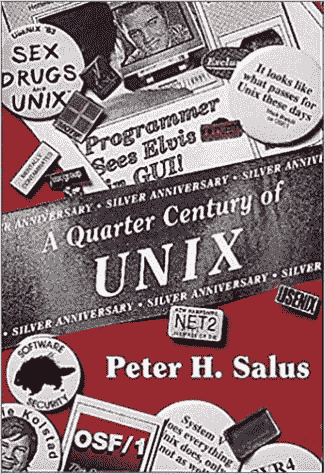

# 看看 Vim，这个时代的文本编辑器——新的堆栈

> 原文：<https://thenewstack.io/a-look-at-vim-a-text-editor-for-the-ages/?utm_source=wanqu.co&utm_campaign=Wanqu+Daily&utm_medium=website>

当谈到 Linux 系统上最流行的文本编辑器时，一些历史隐藏在明显的地方。在散布在网络上的文本文件中——以及偶尔出现的 YouTube 视频中——可以追溯到基于 Unix 的文本编辑器的早期历史，这些编辑器后来成为`Vim`，40 多年后仍在广泛使用。

这提醒我们，在开发者社区中，我们总是站在前人的肩膀上——以及早期计算的真实情况。“在那个夏天之前，我们只能用大写字母打字，”[比尔·乔伊](http://www.computerhistory.org/fellowawards/hall/bill-joy/)告诉[Linux 杂志](https://web.archive.org/web/20000302122902/http://www.linux-mag.com/1999-11/joy_04.html)。“那年夏天，我们的终端使用了小写 rom。最终使用小写字母真的很令人兴奋。”

Joy 在 1976 年左右写了 vi，也就是 eVim 的前身——六年后，他与人共同创立了 Sun Microsystems——当时他还是加州大学伯克利分校的一名研究生。在此之前，他一直在使用文本编辑器——最初是由 Unix 先驱 Ken Thompson 在 1969 年编写的。汤普森本人曾访问过伯克利，并留下了一个破碎的帕斯卡系统。1976 年夏天，乔伊的工作就是修理它。

“的确令人沮丧，”乔伊回忆道。

但那年夏天也有一位命运多舛的访客来自伦敦大学玛丽女王学院——确切地说是[乔治·库鲁里斯](https://www.coulouris.net/)，他后来在《UNIX 的四分之一世纪》一书中描述了他们与[的相遇](http://www.eecs.qmul.ac.uk/~gc/history/index.html)库鲁里斯带来了一盘磁带，里面有他自己的文本编辑器的代码，是对`ed`的修改，他将其命名为“em”，这是“凡人版”的缩写。

“在我开发它的时候，Ken Thompson 参观了我们在 QMC 的实验室，并说了一些类似的话，我给它命名为:‘是的，我见过这样的编辑器，但我觉得不需要它们，我不想在编辑时看到文件的状态’。”

从他 2003 年对科技网站 the Register 的评论来看，在接下来的几年里，库鲁里斯一直为他在软件开发早期的贡献而自豪。在称赞比尔·乔伊将他的单行编辑器扩展为全屏编辑器的同时，“`vi`如果我没有在 1976 年夏天在伯克利坐在他旁边的终端上，我可能永远也不会看到这一天，如果我的一些代码在‘VI’中继续存在，我也不会感到惊讶。”

那么接下来发生了什么？“我们修改了`em`并创造了`en`，”比尔·乔伊告诉 *Linux 杂志*。根据乔伊[在 1984 年](https://web.archive.org/web/20060426002006/http://web.cecs.pdx.edu/~kirkenda/joy84.html)接受《Unix 评论》的另一次采访，两人与查克·哈利合作，不断增加功能——哈利增加了沿着底线移动光标的能力——那时候乔伊还只有 20 多岁。“查克会在晚上来——虽然我们在下午有重叠，但我们的工作时间并不完全相同。我会弄坏编辑器，他会修好它，然后他会弄坏它，我会修好它……”

这对搭档最终从`em`发展到`ex`，这包含在 1978 年 3 月 BSD Unix 的第一次发布中。在 BSD Unix 的第二版中——1979 年 5 月——这个程序最终以它现在熟悉的名字`vi`安装——这个名字向用户表明它是以视觉模式`ex`启动的。

有一个流言说比尔·乔伊在一个周末就搞定了，但是乔伊强调说“不，花了很长时间。这真的很难做到，因为你必须记住，我试图使它可以通过 300 波特的调制解调器使用，”乔伊告诉 Unix 评论。“这也是你拥有所有这些有趣的[单字母]命令的原因。在调制解调器上使用屏幕编辑器几乎行不通。这还不够快……”

直到今天，这至少解释了用 vi 编辑的一些节奏。“编辑器经过了优化，当它的绘制速度比你想象的慢时，你可以编辑并提高工作效率。现在计算机比你想象的要快得多，没人能理解这一点，”乔伊说。“那是一个现在已经灭绝的世界。人们不知道 vi 是为一个已经不存在的世界而写的。”

这个节目还融入了 1977 年的其他元素。Joy 的视频终端有一个内置键盘，没有光标键——这解释了为什么 Vim 使用 h、j、k 和 l 键导航(尽管它现在也支持光标键)。

[Sinclair Target](https://sinclairtarget.com/) ，2015 年从哥伦比亚大学毕业后一直从事软件工程师的工作，最近为[整理了他自己的 Vim](https://twobithistory.org/2018/08/05/where-vim-came-from.html) 历史。从 1969 年到今天，vim 中还有其他的`ed`命令。`ed`也是“模态的”——意思是你必须用 I 键切换到“输入”模式。" ed 还引入了 s/foo/bar/g 语法来查找和替换文本."

Joy 在 1994 年告诉 Unix Review，“从根本上来说，`vi`仍然是内部的`ed`。“你不可能真的骗过它。”

Target 指出，在 GNU Emacs 出现之前，安装 Emacs 可能要花费数百美元。"所以`vi`变得非常受欢迎."但《Unix 评论》向乔伊提出了一个终极问题——他会有什么不同的做法吗？“EMACS 的一个优点是它的可编程性和非模态性。这是我从未想到过的两个想法。”

此外，“我希望我们没有使用键盘上的所有键…使用`vi`的根本问题是它没有鼠标，因此你可以使用所有这些命令…”

但是 Target 指出,`vi`的第一个版本有一个更大的问题。“`vi`是`ed`的直系后代，这意味着没有 AT & T 源代码许可证就不能修改源代码。这促使一些人创建了`vi`的开源版本。该软件的名字像猫王、nvi 和 STEviE(VI 爱好者的 ST 编辑器)——后来被改编成一个叫 Vim 的软件，最初代表“VI 模仿”。由荷兰计算机程序员[布莱姆·米勒](https://github.com/brammool)为他的 Amiga 创建的 Vim 与 Linus Torvalds 发布他的第一个 Linux 内核同年——1991 年——进入世界。

<iframe loading="lazy" title="Vim 25 presentation by Bram Moolenaar on 2016 November 2" src="https://www.youtube.com/embed/ayc_qpB-93o?feature=oembed" frameborder="0" allow="accelerometer; autoplay; clipboard-write; encrypted-media; gyroscope; picture-in-picture" allowfullscreen="">视频</iframe>

根据他在 Vim 25 周年纪念日的一次演讲，Moolenaar 从 STEVIE 的开源代码开始，然后增加了一些定制。“我做了所有我想让自己做的事情，能够写文字。”它通过在计算机用户群中流通的“共享软件”的软盘发行，Moolenaar 发现它出奇地受欢迎。很快 Vim 就被移植到了当时的其他操作系统上——MS-DOS 移植是由 Juergen Weigert 编写的，他也将 Vim 移植到了 SunOS 和 Linux 上。

因为“那时还没有真正的互联网”，Vim 的早期版本托管在他的雇主 Oce(一家销售复印机相关硬件和软件的佳能公司)的服务器上。Moolenaar 还记得将第二个版本发布到了 Usenet 新闻组 [comp.sources.misc](https://groups.google.com/forum/#!forum/comp.sources.misc) 。(“我想，大概有 40 个部分，”他回忆道——因为大型项目必须分成几个岗位。)随着时间的推移，人们开始向 Moolenaar 发送补丁，这位 30 岁的程序员很快成为 Vim 的维护者、发布经理和终身仁慈的独裁者。Target 简洁地写道，Moolenaar“在各种互联网合作者的偶尔帮助下，稳定地向 Vim 添加了一些功能。”

回顾编辑的逐渐演变，塔吉特写道，“好的想法是随着时间的推移逐渐积累起来的。”

“我不认为‘创业公司抛弃所有先例，创造颠覆性新软件’的开发方法是不好的，但 Vim 提醒我们，合作和渐进的方法也可以产生奇迹。”

Target 的网站提醒我们,`Vim`是预装在 MacOS 中的，Windows 有[版本，而且“它甚至对讨厌它的人来说也很熟悉，因为足够多的流行命令行工具会默认将用户扔进 Vim，以至于被困在 Vim 中的外行人已经成为了](https://www.vim.org/download.php)[一个迷因](https://www.google.com/search?tbm=isch&source=hp&biw=1366&bih=631&ei=DXFrW9fcCPq50PEP6NOo0A4&q=exit%20vim&=&=&oq=&gs_l=)

Stack Overflow 的 Joel Spolsky 曾经开玩笑说，我们不是用狗的寿命来衡量 Stack Overflow 的寿命，而是用我们帮助某人脱离 Vim 编辑器的次数来衡量。5 月在维也纳举行的 [We Are Developers 大会上](https://thenewstack.io/joel-spolsky-on-stack-overflow-inclusion-and-how-he-broke-it-recruiting/)，他告诉观众“我们现在有 150 万次有人查看关于栈溢出的问题‘我如何退出 Vim’，这几乎是我们最受欢迎的问题。”

Target 指出，经过 40 年的发展，Vim 已经渗透到技术世界的文化中。“包括脸书在内的一些主要网站，当你按下 j 键时会向下滚动，当你按下 k 键时会向上滚动——这不太可能是 Vim 在数字文化中传播的高潮标志。”当然，维姆在*硅谷*的一个难忘场景中被提及。

<iframe loading="lazy" title="Tabs versus Spaces" src="https://www.youtube.com/embed/SsoOG6ZeyUI?start=110&amp;feature=oembed" frameborder="0" allow="accelerometer; autoplay; clipboard-write; encrypted-media; gyroscope; picture-in-picture" allowfullscreen="">视频</iframe>

Vim 8.0 是在 2016 年发布的[——20 年来第一个新的主要版本。2017 年另一个受欢迎的“vim fest”](https://groups.google.com/d/msg/vim_dev/CmiGxtJ7fn4/DzdTuTtIAQAJ)[发生在柏林](https://vimfest.org/recap-vimfest-2017/)。

今年 3 月，Linux Journal 对其读者进行了调查，并得出结论，Vim [是最受欢迎的文本编辑器](https://www.linuxjournal.com/content/best-editor-0)(获得了 35%的选票，但远远领先于选择 Emacs 的 19%，其他选票将投向 Sublime Text(10%)和 Atom(8%)。

因此，回顾 1999 年是很有趣的，当时 Linux 杂志问了比尔·乔伊一个深思熟虑的问题:他知道他正在做一些改变世界的事情吗？“不……”乔伊强调道。

“我可能一直低估了它。”

* * *

## WebReduce

<svg xmlns:xlink="http://www.w3.org/1999/xlink" viewBox="0 0 68 31" version="1.1"><title>Group</title> <desc>Created with Sketch.</desc></svg>