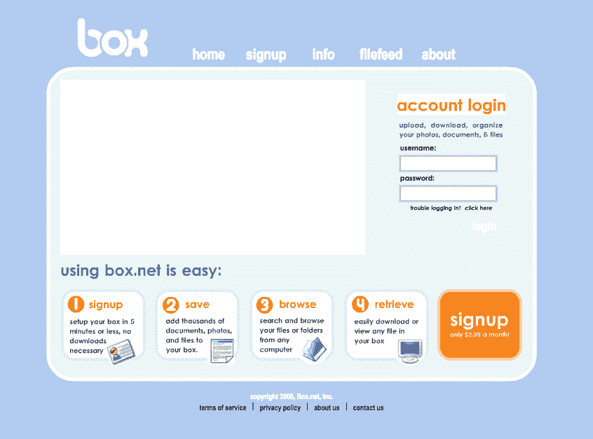
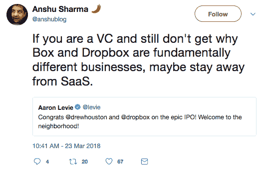
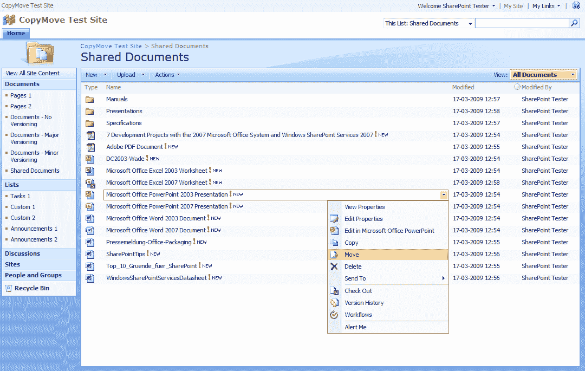
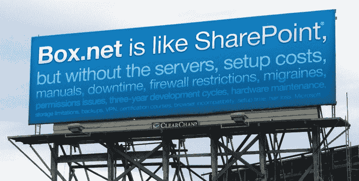
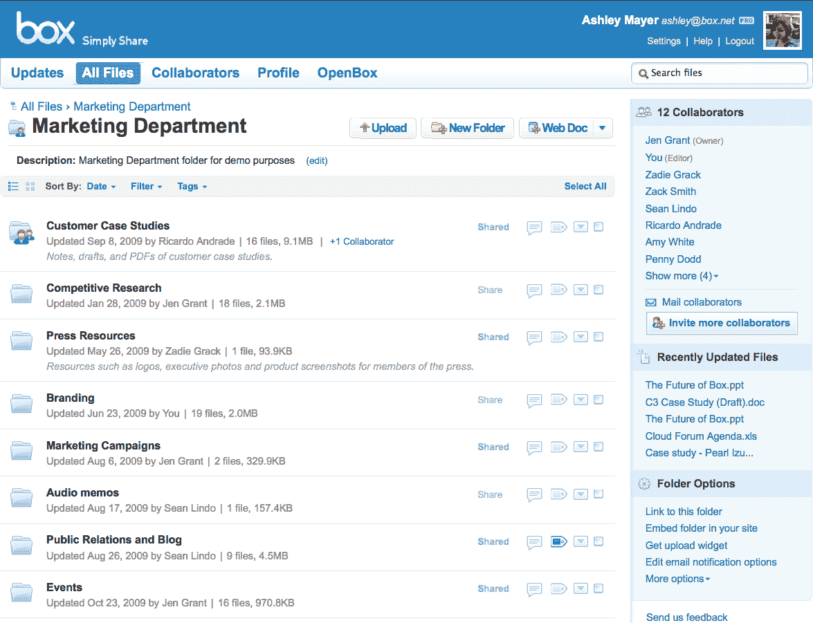
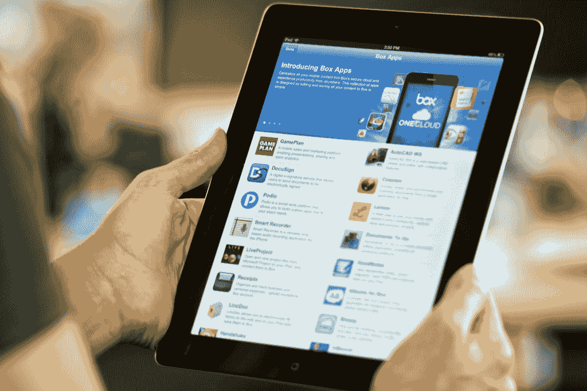
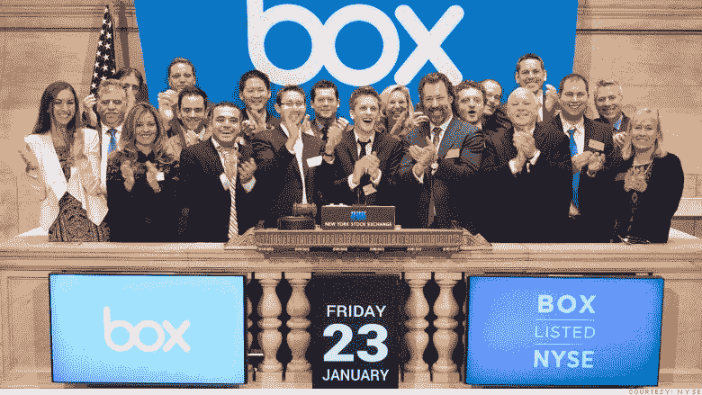
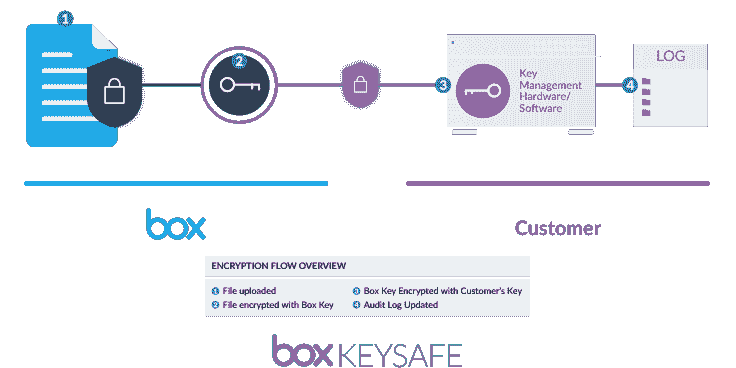

# Box 如何征服企业并成为一家 17 亿美元的公司

> 原文：<https://producthabits.com/how-box-conquered-the-enterprise-and-became-a-1-7-billion-company-in-a-decade/?utm_source=wanqu.co&utm_campaign=Wanqu+Daily&utm_medium=website>

大学生辍学在车库里创造世界下一个技术创新的神话是硅谷最常见的比喻之一。然而，每隔几年，就会涌现出一个有远见的年轻企业家，他们通过自己的创业真正改变了世界。

Box 的联合创始人兼首席执行官亚伦·列维(Aaron Levie)就是这样一位企业家。

自从 2005 年在南加州大学上学期间创立 Box 以来，Levie 和他的联合创始人已经将该公司发展成为科技领域首屈一指的企业 IT 公司之一。Box 真正不同寻常的地方在于，它最初是一个纯粹以消费者为中心的基于云的文件共享产品，后来逐渐成为世界上最成功的企业云服务之一。

**让我们仔细看看:**

*   为什么 Box 在 2005 年是一个如此激进的想法，以及该公司必须克服的非常现实的技术挑战
*   设计、UX 和消费 SaaS 产品如何塑造了 Box 作为一家以企业为中心的公司的成长
*   为什么雇佣一名顾问是 Box 有史以来最明智的举动

今天，Box 是世界上一些最大的公司使用的重量级企业，但 Box 最初并没有将目光放在企业上。相反，Box 的旅程就像许多其他创业公司一样，是作为消费者市场的一个伟大创意开始的。

## 2005-2009:从南加州大学到首席执行官，从消费者到企业

2003 年，亚伦·李维报名参加了南加州大学的一个本科项目，学习商业。就学术目标而言，这差不多是列维所想的那样遥遥领先。

尽管只有 19 岁，李维天生就是一个连续创业者。他花了大半辈子的时间构思从不可能到不可能的商业创意。有一个叫 Zizap 的初级搜索引擎，列维自嘲地称之为“如果你没去过谷歌，那就是世界上最快的搜索引擎。”Fastest.com 是一个房地产网站，旨在帮助买卖双方尽快达成交易。还有 socalendar.com，一个短命的事件列表网站，专注于南加州及其周边地区的派对和独家事件。

尽管列维是他无数商业想法背后的创造力，但他并不孤单。李维最亲密的朋友——萨姆·戈兹、杰夫·奎瑟和迪伦·史密斯——和李维一起在西雅图附近的普吉特湾地区的默瑟岛上长大。这四个朋友在高中时几乎形影不离，这些年来，李维的三个知己和他一起开始了许多滑稽的商业冒险。事实证明，李维敏锐的商业嗅觉会让这四个年轻人在短短几年内成为千万富翁。

2004 年，在专业尚未确定的情况下，李维接受了洛杉矶派拉蒙电影公司的实习。在派拉蒙工作期间，列维第一次看到工作室共享大文件有多困难，即使是在内部。制作人员采取了一系列方法来共享信息，从通过电子邮件向他们自己发送压缩目录到依靠 USB 拇指驱动器。虽然这些变通办法完成了工作，但 Levie 认为一定有更好的方法。

正是在这一点上，Box 的想法诞生了。

> “为了共享文件，人们必须通过电子邮件向自己发送文件，使用拇指驱动器，使用 FTP，这太复杂了，而且效率低下。所以我们有了一个想法，并在 2005 年初推出了这个想法:人们每月支付 2.99 美元，我们给他们 1GB 的存储空间，他们可以将文件上传到 Box，并在任何地方访问它们。” **—亚伦·李维**

列维和他的三个联合创始人有一个伟大的想法。然而，他们所没有的是任何真正的商业经验，甚至是对基本商业概念的牢固掌握。不管怎样，这四个朋友没有被吓倒。作为“创意人”和四个人中最有见识的人，李维是首席执行官的不二人选。迪伦·史密斯对数字的敏感使他成为首席财务官的不二人选。尽管他缺乏技术，但 Ghods 拥有最多的编程经验，这使他成为 Box 的 CTO。最后，奎瑟安装电缆调制解调器的实践经验确保了他作为 Box IT 主管的地位。

当 Box 于 2005 年正式推出时，Levie 和 Smith 用他从在线扑克游戏中赢得的 15，000 美元来租用服务器空间。Levie 认为他们可以收取每 1GB 2.99 美元的存储费用，而他们只花了 1 美元。从长期来看，这是不可持续的，但这将使新公司获得首批几千名客户，并带来一些急需的收入。Levie 和 Smith 带着他们新的在线存储公司的说明书，在太平洋西北部接触了几十个风险投资家来寻求资金。

他们每个人都拒绝了李维和史密斯。

> “当时我们 19 或 20 岁，西雅图的投资者不相信这个想法或团队。他们中的很多人都被网络泡沫吞噬了，但我们也确实很年轻。迪伦看起来像 14 岁。我们看起来不像一个可信的创始团队。” **—亚伦·李维**

Box 在获得种子资金方面的早期困难并不表明 Box 作为一个产品的生存能力。拳击是个好主意。问题是还有很多其他公司在追逐这个伟大的想法。到 2006 年初，至少有 12 家云存储公司在争夺主导地位，包括 Allmydata.com、Mozy、Strongspace 和 Xdrive。竞争激烈的新兴市场和李维缺乏领导力和现实世界的商业经验，使得 Box 对大多数风投来说风险太大。对于大多数公司来说，这将是结束。失败创业公司的墓地里散落着许多伟大的想法。然而，博克斯还没有死。为了获得一些急需的媒体关注，列维给网络公司亿万富翁马克·库班发了一封电子邮件，推销一篇报道，以确保在库班的博客上被提及。

相反，库班给列维回信说他想投资这家年轻的公司。在那封决定命运的邮件发出六周后，李维和史密斯以 35 万美元的价格将 Box for 的股份卖给了库班。

除了业务性质之外，2000 年代中期的云存储公司的共同点是他们主要关注消费者。有两个因素将 Box 推向了消费市场。第一个是互联网传输技术的快速发展和宽带互联网在美国家庭的加速普及。在 2005 年 3 月至 2006 年 3 月期间，美国家庭对[宽带的采用增加了 40%](http://www.pewinternet.org/2006/05/28/home-broadband-adoption-2006/) ，比 2004 年至 2005 年的年采用率增加了一倍多。越来越多的人上网意味着更多的内容——更多的歌曲、更多的电影和更多的文档——所有这些都需要除了人们的硬盘以外的存储空间。第二是在线存储的成本迅速下降。尽管硬盘驱动器的容量几年来一直在增加，[在线存储的成本到 2006 年](http://www.mkomo.com/cost-per-gigabyte)已经大幅下降。这两个因素加在一起，使得瞄准消费者市场几乎成了定局。

Box.net 的最早版本是盒子产品的第一个版本，非常简陋。最初，功能很大程度上仅限于文件上传和下载以及一些基本的搜索功能。该产品完全基于网络，用户无需下载和安装桌面程序。这个看似微不足道的细节意义重大，因为它将允许企业防火墙后的用户无需征得 it 管理员的许可就可以访问和使用 Box。这将与 Box 的免费增值模式完美结合。

[Source: Web Archive](https://web.archive.org/web/20051124064553/http://box.net:80/)

列维和他的联合创始人经历的许多围绕数据传输和存储的摩擦都发生在数字媒体和消费硬件的交汇处，例如在设备之间访问和共享音乐文件。Levie 在基于云的存储成为主流的几年前就正确地预见了消费者对它的需求。问题在于，2005 年前后，基于云的存储的消费者市场非常小。尽管他们产品的消费市场很小，Box 却非常受欢迎。

增长一直很稳定，但到了 2007 年初，李维开始怀疑消费者市场是否大到足以维持他所设想的那种增长。让事情变得复杂的是，硅谷的一些大公司，包括苹果、脸书和谷歌，都在拓展基于云的存储。专门的服务，如图片托管网站 Flickr，越来越受欢迎。然而，这并不是列维和他年轻的公司面临的唯一潜在威胁。2007 年 6 月 1 日，麻省理工学院的学生阿拉什·菲尔多西和德鲁·休斯顿从 Y Combinator 加速器中推出了他们的在线存储初创公司 Dropbox。Dropbox 被科技媒体称为“谷歌硬盘杀手”，这让 Box.net 在蓬勃发展的消费者云存储市场面临更大的压力。

然而，大多数人未能理解——并且直到今天仍在误解 Dropbox 从未作为 box 的竞争对手推出。用例完全不同。Box.net 和 Dropbox 可能分享了一些相似的底层技术(和一个令人不安的相似名字)，但 Dropbox 的重点是面向消费者市场的基于云的文件管理**。盒子被集中在文件*分享*上。到 2007 年 Dropbox 推出时，Box.net 已经在很大程度上放弃了消费者市场，转而青睐企业。这两款产品之间还有其他一些关键区别，比如需要在用户的本地机器上安装一个专用的 Dropbox 目录，而 Box.net 的界面完全基于云。此外，两家公司的目标市场和业务模式也大相径庭。**

 **

虽然列维一直不愿意将注意力转向企业市场，但 Box 从消费者市场的转移对这家成长中的公司的生存至关重要。

问题是他对企业市场几乎一无所知。

为了更多地了解企业和消费者市场的持续生存能力，Box 聘请了一名顾问。这可以说是 Box 公司有史以来最明智的举动。许多企业家抵制投资者的压力，不去“雇佣一个成年人”来处理具体的商业任务——这往往对他们自己不利。盒子就不是这样了。列维知道他的想法是可靠的。更重要的是，他知道自己不知道的事情，并且不怕雇佣知道自己在做什么的人。该顾问的工作不仅仅是确定云存储行业的预期规模，而是确定基于云的存储是否有未来。

> “我们意识到，我们实际上可以利用我们的消费者 DNA 和公司的消费者精神——我们当时非常小，大约只有 15 个人——但我们可以利用这种精神来攻击企业市场，实际上对传统的企业存储技术、文档管理、软件协作工具具有很大的破坏性，而且我们不必改变我们产品的基本原则或我们的消费者导向。” **—亚伦·李维**

事实证明，李维的直觉是对的。Box 聘请的顾问对不断增长的云存储行业进行了深入的市场研究，并得出了与 Levie 相同的结论:未来十年对基于云的存储的需求可能会增加。然而，该顾问也警告李维说，对于 Box 这样斗志昂扬的初创公司来说，来自硅谷最大的科技公司的激烈竞争即使不是不可能，也是很困难的。尽管这不是列维和他的联合创始人所希望的报告，但在做出重大财务或战略决策之前，这是测试和验证潜在市场的关键一步。

与日益拥挤的消费者市场不同，该企业的云存储选项少得多。当 Box 于 2005 年推出时，市场上最大的玩家是微软的 SharePoint，它于四年前的 2001 年发布。SharePoint 是典型的微软产品。它的主要竞争优势是与 Microsoft Office 的集成，这使它成为企业环境中一个有吸引力的平台。然而，使 SharePoint 成为微软独一无二的产品的品质也是为 Box 提供独特机会的品质。SharePoint 的功能和集成是可靠的，但是界面非常实用。有用的选项隐藏在不直观的菜单后面。SharePoint 的搜索功能很糟糕。在一个组织内共享文件是(相对)容易的。与公司以外的人共享文件？没有那么多。

[Source: Sharepoint Products](http://www.sharepointproducts.com/Pages/Home.aspx)

在 21 世纪初，SharePoint 可能是“占主导地位的”企业文件共享系统，但它很容易受到攻击。它不仅是适用于大型企业环境的唯一真正的文件共享和存储产品，而且不实用、不直观、不受欢迎。

这是列维一直在等待的机会。

列维知道 SharePoint 是 Box 最大的竞争对手，所以他做了任何有创造力、不敬的企业家都会做的事情——他在旧金山和硅谷之间的 101 号公路的一段高速公路上打出了广告牌广告。该广告向 SharePoint 用户承诺，如果他们不喜欢 Box，Box 将支付三个月的 SharePoint 访问费用。2009 年 2 月，Box 在对微软的媒体攻击中更进一步，竖起了另一个广告牌，突出了 SharePoint 在其用户群中最不受欢迎的许多方面。

[Source: Tech Crunch](https://techcrunch.com/2015/01/22/box-has-always-been-about-reshaping-enterprise-software/)

这场运动不仅仅是一个以微软为代价吸引用户的聪明方法。它代表了最终成为 Box 最大的竞争优势:简单、以消费者为中心的界面。多年来，企业软件一直被其实用性所定义。大多数企业应用程序看上去和感觉上都一样。调色板几乎都是蓝色和灰色，这是企业软件应用程序中常见的颜色[，因为它们暗示着可信赖性和可靠性](https://www.helpscout.net/blog/psychology-of-color/)。用户被迫通过隐藏子菜单的迷宫来访问高级功能。简而言之，企业软件运行良好，但*使用*却是一场噩梦。

盒子会改变这一切。

甚至在 2009 年，列维对他所描述的“企业消费化”感到兴奋。在那之前，不仅企业软件开发几乎完全专注于功能而不是形式，而且进展缓慢。企业应用程序之所以难看，是因为平均企业开发周期持续数年，而不是数月。列维对将以消费者为中心的设计理念应用于企业软件的想法很感兴趣。更重要的是，Levie 认为 Box 有机会通过利用以消费者为中心的设计*和*在一片矢车菊蓝色的企业应用程序中脱颖而出，通过重新思考企业应用程序的外观、感觉和工作方式，确立自己在企业软件开发领域的领导者地位。

> “为什么在工作场所，我们实际上在技术上花了更多的钱，而你却在使用比我们个人生活更糟糕的技术？买家是 IT 买家，而不是最终用户。最终用户实际上没有权力影响软件开发过程中的决策。过去几年，这一切都变了。” **—亚伦·李维**

虽然企业市场代表着 Box 从竞争日益激烈的消费者市场转移的独特机会，但从本质上转移整个公司的重点并不是一件小事。在那之前，Box 一直采用免费增值的商业模式。这对于消费者市场来说很好，但是对于企业来说完全不合适。这意味着 Box 不仅要从根本上重新设计产品，还要重组整个商业模式。

尽管挑战——以及相当大的风险——伴随着彻底转向的前景，Box 还是冒险一试。2007 年，Box 成为一家专注于企业的公司。虽然消费者市场的商业现实在一定程度上迫使 Box 出手，但该公司对 B2C 的强烈关注实际上成为 Box 最大的竞争优势之一。

## 2009-2015:成为“企业的 Dropbox”，上市

尽管公司有成长的烦恼，但 Box 在 2000 年代末继续增长。在 2008 年至 2009 年间，收入增长超过 500%，仅 2009 年在 Q1 就同比增长 300%，这是由一系列与品牌的合作伙伴关系推动的，包括:诺基亚西门子、奥普拉温弗瑞网络和沃尔沃。截至 2010 年，Box 在数万家公司中拥有逾 400 万用户。

正是在这个时期，Box 开始增加面向消费者的应用程序中常见的功能。最值得注意的是，这包括社交功能。用户可以定制独特的个人资料，其中包括联系信息，如 IM 句柄和共同合作者列表，以及书签目录。用户也可以给特定的文件添加注释，允许团队在不离开盒子的情况下讨论整个项目。这些创新不仅仅是为了让 Box 感觉更像一个以消费者为中心的应用。开发它们是为了让 Box 成为一个更具粘性的软件产品。Levie 和他的团队知道，文件共享和数据存储只是他们的用户试图解决的问题的一部分——Levie 希望 Box 使整个企业的工作更容易、更快、更直观。Box 明白，在一个即时交付云软件的世界里，不仅仅是消费者应用需要易于使用和功能强大。

> “我坚信，即使是像 Box 这样主要为企业开发的应用程序，也需要在用户体验和设计方面处于领先地位。就可用性、简单性、速度和性能而言，它们必须是“消费级”的。这无疑提高了企业软件设计和工程的标准，但毫无疑问，更高的标准对用户来说是一个巨大的胜利，对 Box 来说也是一个巨大的机会。” **— Sam Schillace，工程副总裁，信箱**

2009 年，Box 发布了一个彻底重新设计的简化用户界面，使得浏览虚拟目录变得更加容易。该应用程序仍然以许多企业应用程序喜欢的蓝色调色板为特色，但其他一切看起来更像是一个以消费者为中心的应用程序，也明显更直观。文件和文件夹上传等核心功能由 Web 2.0 风格的按钮和下拉菜单处理。由于 Box 简单明了的管理工具，管理团队和个人合作者变得毫不费力。Box 中的元数据管理更像是在 WordPress 中管理标签，而不是处理复杂的组织分类法。用户可以一目了然地看到哪些文档和文件被编辑过，由谁在何时编辑过。

这是使用企业软件的全新方式。

[Source: Web Marketing Therapy](https://www.webmarketingtherapy.com/blog/online-tools-we-love-box-net-online-file-storage/)

Box 将企业软件推向以消费者为中心的设计的策略有两个方面。首先，它使企业软件变得非常容易使用，这使得 Box 成为一个更难使用的应用程序。第二，它帮助用户更有效率。用户花在学习如何使用软件上的时间越少，他们花在解决实际问题上的时间就越多。理论上，这将推动增长。Box 不仅制作了一个简单易用的工具，而且该公司还通过集成让它与人们在办公室使用的所有其他工具一起工作。

然而，尽管 Box 的新社交功能和重新设计的界面很受用户欢迎，但该公司最大的挑战之一是使其产品的功能多样化，以跟上这种增长。这使得 Box 对 Increo Solutions 的收购具有如此重要的战略意义，这是 Box 在未来几年将进行的第一次此类收购。通过收购 incro，Box 立即获得了 incro 的创新文档协作工具。这是至关重要的。Box 提供基于云的存储或与 Salesforce 和 Office 的集成还不够。随着竞争工具争夺主导地位，它必须提供额外的价值。正如列维在 2013 年的一次采访中指出的，“当你想到云和移动世界时，你必须更接近实际的内容创作。”这正是 Box 收购 Increo Solutions 所做的事情。

Box 继续以最终用户为中心开发产品。每一个主要特性的发布都是为了让 Box 更容易、更快、更直观地使用。2013 年 Box Notes 的发布证明了这一点。Notes 旨在对抗微软的传统 Office 产品和谷歌文档带来的无处不在的威胁，它是作为一种让用户快速简单地对文件和目录进行注释的方式而推出的。然而，尽管 Box 通过引入 Notes 来支撑其产品，但它这样做的方式很有趣。Notes 本可以被开发得功能更加全面，但是 Box 有意让 Notes 尽可能地简单和轻量。Levie 形容 Notes 比微软 Word 更接近 Evernote，因为这是用户想要的。Levie 不在乎与 Word 或 Google Docs 竞争——他想让 Box 用户在正确的时间、正确的地点尽可能地接近创作的时刻。其他一切都是次要的。

Box 和其他具有前瞻性思维的公司推动的企业 IT 消费化不仅仅是试图培养独特的价值主张或推动采用。它反映了计算领域更广泛的变化。Web 2.0 应用的出现创造了一种新的设计范式，强调易用性和跨多种设备的可访问性，而不是复杂的文件管理工具。智能手机从根本上改变了我们对计算的看法。对于像 Box 这样的企业软件公司来说，走在可用性趋势的前沿是令人印象深刻的。

> “文件系统将不再是普通计算机用户关心的问题。我们看到五年后的未来，除非你是开发人员，否则你不会碰文件系统。您正在接触您的应用程序，而您的应用程序管理您的数据。” **—安德鲁·李，Firebase 创始人**

在接下来的两年里，Box 继续增长。然而，与前些年不同，这一时期的大部分增长是由越来越大的投资推动的。在 2009 年 10 月至 2011 年 10 月期间，Box 在由 DFJ、Meritech Capital 和 Scale Venture Partners 等投资者牵头的一系列融资轮中筹集了超过 1.5 亿美元的风险资本。这些资金中的大部分被用来积极扩张公司。虽然员工是 Box 最重要的成本之一，但该公司的大量资本被投资回产品开发。这在 2012 年 3 月 Box OneCloud 的发布中达到高潮。

OneCloud 是一个很好的例子，说明以消费者为中心的设计如何影响 Box 更广泛的战略。该公司在 2011 年为开发者建立了一个名为 Box Innovation Network 的平台，其功能类似于应用市场。OneCloud 是这一理念的延伸，只不过它是专为移动设备设计的。这后来成为 Box 开发中一个可预测的循环。新功能被添加到产品中以满足新兴需求，这些功能以直接反映消费者应用程序和网站的方式呈现给用户。

[Source: Business Computing World](http://www.businesscomputingworld.co.uk/mobile-app-development-trends-to-look-out-for-in-2018/)

Box 致力于以用户为中心的设计，这不仅吸引了新用户，也转化了 Box 的免费用户。尽管只专注于企业，Box 保留了它的免费增值模式。免费版的 Box 为用户提供了完全免费的基本功能。如果用户想要额外的功能，比如某些目录的密码保护，他们可以每月支付 15 美元。截至 2011 年，Box 在 6 万家公司中拥有逾 500 万用户。然而，更重要的是 Box 如何将其免费用户转化为付费用户。像 Evernote 这样的消费者应用程序以大约 3%的比率将免费用户转化为付费计划。 [Box 正在以接近 8%](https://www.forbes.com/forbes/2011/0214/technology-aaron-levie-box-net-enterprise-free-software.html#144d66fe1f2e) 的速度将免费用户转化为付费计划，包括纽约银行和环境广告巨头 Clear Channel 等主要企业客户。因此，Box 在 2011 年实现了逾 1100 万美元的收入。

此外，Box 对免费增值模式的使用使其更容易作为产品销售。由于 Box 的基础版是完全免费的，大多数准备从免费账户升级到付费账户的用户已经使用 Box 有一段时间了。这意味着，当销售代表拿起电话打给潜在销售线索时，销售专业人员不需要试图强迫潜在客户进行产品演示或解释产品的核心功能或价值主张。因为大多数 Box 的销售电话来自已经使用该产品的公司，Box 的销售团队通常能够在两周内完成 60%的交易，这是一个令人印象深刻的数字，特别是考虑到通常与企业市场相关的长达数月的销售周期。

到 2015 年，Box 已经因逆潮流而动、无视所谓专家的预测而声名鹊起。尽管该公司有着良好的增长记录，但许多分析师仍对 Box 的前景表示怀疑。一些分析师批评该公司大规模的营销努力，认为这是领导不力和产品不稳定的证明。其他人声称 Box 永远不会盈利。然而，Box 在 2015 年 1 月 23 日再次出乎意料，Box 开始在纽约证券交易所公开交易。Box 的首次公开募股是当时 2015 年最大的 IPO 之一，给李维的公司带来了大约 16 亿美元的估值。Box 尚未盈利，但当该公司的股票收盘时比其 IPO 价格高出 66%时，分析师们被需求吓呆了。

[Source: CNN](https://money.cnn.com/2015/01/23/investing/box-ipo-tech-stocks/index.html)

Box 一直在企业领域挑战传统智慧，拥抱创新精神，及时应对行业变化，这是其作为一家以消费者为中心的公司的延续，也与该公司以创新缓慢著称的典型步伐形成鲜明对比。Box 一直在努力让自己与新兴竞争对手区分开来——它将继续通过拥抱机器学习和人工智能来做到这一点。

## 2016 年至今:欢迎来到机器:在云端拥抱 AI

到 2016 年，全球有超过 54000 家公司在使用 Box。该公司拥有约 4400 万用户，年收入约为 3 亿美元。Box 成功开创了企业消费化的先河。在将每个人的文件都转移到云之后，该公司的下一步是通过融入人工智能和机器学习，让访问这些文件变得更容易、更快、更智能。

作为一个产品，Box 在不牺牲其核心功能的情况下变得非常多样化。2016 年 2 月，Box 在其 iOS 应用中增加了一项文件扫描功能，并推出了 [Box KeySafe](https://blog.box.com/blog/box-keysafe/?ref=blog) ，这让用户可以更多地控制如何管理他们的加密密钥。这是 Box 作为其企业密钥管理工具的一部分引入的功能的扩展，该工具针对的是在高度监管的行业或具有严格合规要求的垂直行业中运营的公司。

[Source: Box](https://blog.box.com/blog/box-keysafe/)

Box 的加密工具是一个很好的例子，说明了 Box 如何在不影响质量的情况下简化和精简其核心功能。KeySafe 对 Box 的许多客户来说至关重要，但该工具本身的设计使得几乎任何人都可以使用它，而不会牺牲安全性或数据完整性。审查审计日志需要技能和专业知识，但是访问工具来这样做是简单的，这允许更大的组织中更高的生产率和更少的人员瓶颈。

在 KeySafe 推出两个月后，Box 推出了 [Box Zones](https://blog.box.com/blog/introducing-box-zones/) ，允许 Box 客户控制他们的数据在区域级别上的存储方式和位置。鉴于特定地区的数据立法(如欧盟的一般数据保护法规)带来的监管困难，这是 Box 的明智之举。由于 Box 的许多客户是跨国公司，允许这些公司对其数据主权施加更大的控制是有意义的。然而，Box 的下一次真正创新将在 2017 年到来，届时 Box 将与微软合作，实施一项雄心勃勃的计划，将人工智能和机器学习功能集成到 Box 中，并基于微软的 Azure 服务器技术。

> “微软分享了我们改变人们和组织工作方式的愿景，Box 和 Azure 可以共同释放出难以置信的创新机会。” **—亚伦·李维**

虽然合作依赖于微软的 Azure 生态系统，但 Box Zones 是合作的核心。数据将在区域一级进行管理，以满足世界各地团队的独特需求，而机器学习将被应用于元数据创建等任务，这是一个人为错误可能产生重大影响的领域。然而，尽管人工智能和机器学习是 Box 作为一家公司的愿景不可或缺的一部分，但这一创新是 Box 作为一个组织的哲学的另一种延伸。正如 Box 的首席战略官兼 Platform 的 SVP Jeetu Patel 所观察到的，“你从客户开始，然后逆向工作。”这是博克斯多年来一直在做的事情。该公司预测客户需要什么，然后尽可能简单直观地提供给客户。

人工智能和机器学习可能是当今科技领域最时尚的技术，但它们对 Box 来说远远不止这些——它们是 Box 将云上几十个不同的 CMS 和系统统一在一个安全的分散平台上的一种方式，该平台可以进行调整和修改，以适应一系列工作流。

Box 做得非常出色，不仅在竞争日益激烈的领域开拓了自己的市场，还通过应用以消费者为中心的 SaaS 产品的设计和 UX 原则，重新定义了企业软件的外观、感觉和工作方式。凭借其对可用性、易用性和简单性的强烈关注，Box 已成为企业消费化的主导力量，并塑造了其他企业软件公司处理其产品的方式。

## Box 将何去何从

文件共享和云存储可能不是新技术最令人兴奋的用例，但 Box 在未来几年的发展方式非常令人兴奋。Box 将何去何从？

### 1.AI 无处不在

在可预见的未来，Box 对人工智能和机器学习的关注将成为 Box 大部分 R&D 和产品开发的驱动力。这些技术可能会应用到 Box 业务的几乎所有方面，从更智能、更灵敏的索引和搜索功能到个性化推荐和虚拟助手。日常任务的更大自动化也将是 Box 未来版本的突出特点，这与 Box 简化和精简基于云的文件共享的使命紧密相关。

### 2.更多企业合作伙伴

Box 已经与一些世界上最大的企业软件和计算公司合作，包括富士通、IBM 和微软。我们可以期待在未来看到更多这样的合作伙伴关系，并可能看到 Box explore 为最大的企业公司开发定制解决方案，作为这些合作伙伴关系的一部分。这些伙伴关系可能越来越重要，特别是考虑到人工智能和机器学习等新兴技术固有的基础设施和发展挑战。

### 3.更加重视专门的合规工具

Box 已经提供了一系列数据主权产品，如 Box Zones 和 Box Governance。随着世界各国继续制定和引入广泛的数据法规，如欧盟的 GDPR，Box 可能会扩大其产品范围，为跨多个合规领域运营的大型公司提供更多种类的专业数据保护和合规工具。

## 我们可以从 Box 学到的 3 个教训

博克斯的旅程无疑是非传统的。尽管 Box 的重点是企业公司，但它有很多东西可以教给所有垂直行业的企业家。我们能从 Box 和它的旅程中学到什么？

### 1.彻底研究和验证你所在行业的需求。

在从 B2C 转向 B2B 之前，Box 仔细评估了自己的定位和企业市场的潜力。该公司做的最明智的事情之一是聘请一位知识渊博的顾问来帮助公司识别企业空间中的机会。研究和确认一个新市场的潜在需求对于持久的成功至关重要。

**思考你所在的行业——以及你的公司在行业中的地位——并回答以下问题:**

*   你是否为了短期回报而忽略了一个更强劲的长期市场？如果有，为什么？你是屈服于投资者的压力，还是更糟，试图给投资者——而不是用户——他们想要的东西？转向一个不同的市场能为你的公司提供一条更清晰的可持续发展之路吗？
*   想想你会如何提出一个像盒子一样的枢纽。你会如何向投资者或你的董事会提出这个建议？你的任何假设的谈话要点是否预示着值得探索的更广泛的趋势？想一想，你会用哪种材料来制作一个激进的支点。您现在使用了多少数据？
*   毫不夸张地说，Box 聘请顾问的决定可以说是将该公司从消费者市场几乎肯定的厄运中拯救了出来。如果你可以雇佣一个人来咨询你公司的发展轨迹，他会是谁？为什么？您如何能够像 Box 一样，通过聘请顾问来评估消费者数据存储市场，从而获得对当前市场的洞察力？

### 2.找到并专注于正确的信息。

从一开始，Box 就将 IT 和软件产品的消费化确定为公司信息的核心支柱。Box 在这方面真正成功的原因是始终专注于这一信息，并自始至终拥有它。这有助于 Box 开发出真正独特的价值主张，并使该公司成为企业 SaaS 领域的潮流引领者。

**考虑围绕你的产品的信息:**

*   就感知和公众形象而言，每个行业都有“好人”和“坏人”。每个谷歌光纤都有它的康卡斯特，每个盒子都有它的 SharePoint。如果你问你的客户，你的公司会站在哪一边？
*   Box 不仅想通过将以消费者为中心的设计原则应用于企业软件来扰乱企业市场，它还想从根本上改变我们对企业软件的思考和使用方式。你是想赢得人心，还是只关注通常的衡量标准？
*   许多公司都在谈论“思想领导力”，但真正在各自领域脱颖而出的企业家少之又少。亚伦·列维(Aaron Levie)通过公开批评数据存储领域的许多现有传统企业以及困扰企业多年的低效问题(尽管有点夸张)，迅速成名。作为一个创始人，你在如何培养自己的公众形象？你所在行业的人会如何描述你？更强的思想领导力会给你的公司带来什么好处？

### 3.关注能与你的公司一起成长和发展的核心价值。

早期，Box 决定通过应用通常为以消费者为中心的产品保留的设计原则，专注于产品的简单性和易用性。现在，Box 正在重新定义其作为一家公司的身份，以专注于前沿的人工智能和机器学习技术，这些技术将在 Box 产品中占据突出地位。

**花点时间思考一下你公司的价值观和目标，然后回答以下问题:**

*   你的“北极星”指标领先于哪里？Box 将重心从简化企业软件转移到投资新兴技术上，这似乎是一个激进的转变。然而，它实际上是 Box 的价值观和目标的一个非常符合逻辑和战略的演变。你是否充分考虑了你的公司如何发展*和*随着时间的推移，还是你主要关注的是短期目标？
*   早期，Box 明智地将基于云的基础设施提供商的出现视为一个信号，表明它不需要投资建设自己的专用数据中心。这使得该公司能够专注于在新兴的公共云基础架构之上构建其系统架构。技术的重大发展会如何影响贵公司未来五年的使命？换句话说，你准备好应对市场中潜在的破坏性宏观变化了吗？
*   您是否正在解决您的客户正在经历的相同问题，或者您是否更专注于解决您所在行业的问题？许多公司将这两者混为一谈，但在许多情况下，它们有天壤之别。相反，Box 实现了两者；它简化了用户体验，同时挑战了关于企业软件的传统观念。你的公司如何做同样的事情？

## 跳出框框思考

这些年来，Box 无疑经历了太多的好运，但该公司的增长轨迹和成功绝非偶然。Box 是极少数在关键增长阶段进行激进转型并取得成功的公司之一。它之所以做到这一点，是因为它敏锐地思考了新目标市场的局限性，并比其他任何人都更好地解决了普遍问题。

数据存储和文件管理可能不是科技领域最有趣的用例，但 Box 的非凡旅程——以及为 Levie 和他的公司准备的东西——比大多数以消费者为中心的应用程序或其他应用程序更令人兴奋。**