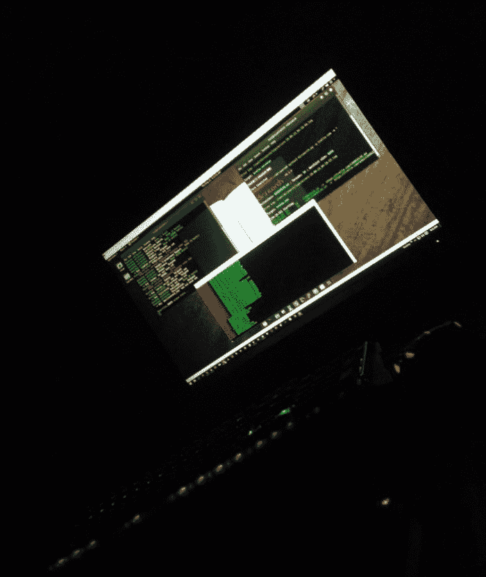

# 昆虫赏金猎人的生活:每天都在奋斗，只为了得到报酬|麻省理工科技评论

> 原文：<https://www.technologyreview.com/s/611896/life-as-a-bug-bounty-hunter/?utm_source=wanqu.co&utm_campaign=Wanqu+Daily&utm_medium=website>

但 Ricafort 没有计算机科学或编码方面的专业学位。在他的一个朋友开始发布他作为一名漏洞猎人获得的奖金后，Ricafort 开始上网，阅读其他安全研究人员的博客，并不知疲倦地观看视频来学习这门手艺。他说，他的第一笔赏金不过是“一家随机公司价值 50 美元的虫子。”但狩猎的刺激让他着迷，并在 2014 年成为他的全职职业。

起初，他的朋友和家人不理解，但在他解释了他的工作和奖金开始滚滚而来后，他们意识到这是一个真正的职业选择。一个有目的的人。“你不仅帮助了公司，也帮助了整个社区。用户和使用公司的人，”Ricafort 说。

在过去的四年里，他已经在 200 多家公司的代码中发现了漏洞，包括苹果、谷歌、微软、贝宝、雅虎、IBM 和 Twitch。去年，他拿到了迄今为止最大的一笔支出:整整 5000 美元(针对一家他说不出名字的公司)。“那改变了我的生活。我无法用语言表达我的感受，”他说。他像任何一个 21 岁的人一样庆祝:他旅行了一下，给自己买了一个新玩具，一辆 BMX 自行车。

埃文·里卡福特提供

但是他最出名的虫子——在很多方面让他在严肃的虫子猎人的地图上——没有带来一分钱。早在 2014 年[他就发现了谷歌 Nest](https://www.securityweek.com/vulnerabilities-found-website-google-owned-nest) 的一个缺陷，这个缺陷可能会让攻击者获得 Nest 客户的个人和财务信息，包括凭据、支付卡信息以及护照和身份证等物品的扫描副本。这一发现让他进入了[谷歌的漏洞奖励计划](https://www.google.com/about/appsecurity/reward-program/)名人堂，但该公司的安全团队表示，这是第三方软件供应商的问题，因此没有资格获得支付(然而，他已经因他发现的其他漏洞获得了谷歌的支付)。

埃文·里卡福特提供

不幸的是，拿不到钱不是一个孤立的事件。其他公司给他提供了一切，从礼物到参观美国国会大厦，而不是金钱。虽然 Ricafort 说他喜欢荷兰政府的衬衫，上面写着“我黑了荷兰政府，我得到的只是这件恶心的 t 恤”，但这无助于收支平衡。

尽管如此，他说赚的钱足够维持生活——他估计自己平均一个月能赚 10，000 菲律宾比索(约合 187 美元)，相当于他的国家的平均工资，而在一个好的月份，他可能会赚到 20，000 到 30，000 比索(374 到 561 美元)。

对于许多寻找漏洞的人来说，事情就是这样:工资大幅波动，而且经常靠在一个昂贵的西方国家难以维持的工资生活。不过，这种情况可能会开始改变。Bugcrowd 和 hacker one(Ricafort 与这两家公司都有过合作)等公司通过提供一些计划，让猎虫者可以获得更多固定收入，并与愿意付钱的公司建立联系，从而让猎虫社区变得更容易。(要深入了解帮助 bug 猎人获得合同的公司，请参见“[众包软件 bug 猎人是一个蓬勃发展的行业——也是一个充满风险的行业](https://www.technologyreview.com/s/611892/crowdsourcing-the-hunt-for-software-bugs-is-a-booming-businessand-a-risky-one/)。))

李嘉福说，无论哪种方式，他都喜欢自己作品的影响力。虽然他说他会接受一个全职网络安全职位的合适人选，但他觉得他能在目前的位置上做出最大的改变:与后台的漏洞作斗争。正如他所说，“我的心为臭虫的慷慨。”

本文是未来工作系列的一部分。点击查看其他[未来工作简介。<svg viewBox="0 0 1091.84 1091.84" class="monogramTLogo">T8】</svg>](https://www.technologyreview.com/collection/jobs-of-the-future/)