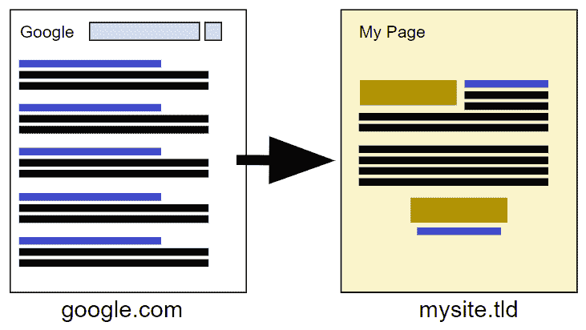
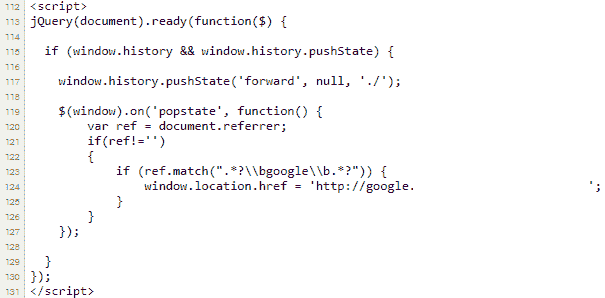
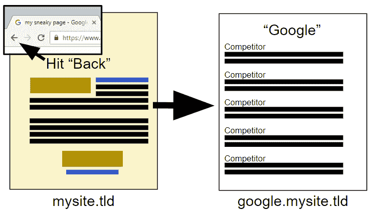
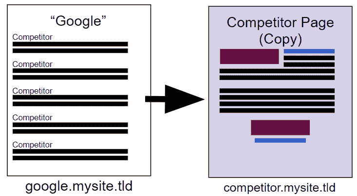

# 我如何记录竞争对手网站上的用户行为

> 原文：<https://dejanseo.com.au/competitor-hack/?utm_source=wanqu.co&utm_campaign=Wanqu+Daily&utm_medium=website>

# **更新T3】**

Google 的团队已经追踪到了我的测试站点，很可能使用了我共享的源代码，并对整个域进行了去索引。
上次[我公开曝光了一个漏洞](https://dejanmarketing.com/hijack/)，谷歌发出了[人工处罚](https://dejanmarketing.com/google-against-content-scrapers/)，并对单个违规页面进行了贬值处理。这一次，搜索控制台中没有任何通知。该网站被完全从他们的索引中删除，没有任何通知。我处理这件事的方式受到了很多批评。许多人建议，正确的方式是就此类安全缺陷直接与谷歌接触，而不是公开报道。其他人认为我进行这项测试是不道德的，甚至是非法的。我想很明显，如果我打算利用这种方法，我不会写它。风险如此之大，收益如此之少，这在实践中值得做吗？当然不是。我更关心那些做了不道德的事情却不写出来的人。

## 我的愿望清单:

a)操纵 Chrome 中的后退按钮在 2018 年应该是不可能的
b)采用这种策略的网站应该被谷歌的算法检测到并受到惩罚
c)如果仍然在谷歌的结果中发现，此类页面应该贴上“此页面可能有害”的标签。

* * *

## 我是这样做的:

1.  用户登陆我的页面(推荐人:谷歌)
2.  当他们点击 Chrome 中的“返回”按钮时，JS 会将它们发送给我的 SERP 副本
3.  点击任何竞争对手会将他们带到我的竞争对手网站镜像(noindex)
4.  现在我生成热图、滚动图，记录屏幕互动和打字。

<noscript></noscript>

<noscript></noscript>

<noscript></noscript>

<noscript></noscript>

有趣的是，只有大约 50%的用户发现了任何可疑之处，部分原因是我在所有页面上都使用了 https，这是网络上主要的[信任因素之一](https://dejanmarketing.com/trust/)。许多用户只是乐于在浏览器中看到“挂锁”。
此时我能够:

*   生成热图(点击、移动、滚动深度)
*   记录实际会话(鼠标移动、点击、打字)

当我意识到我真的可以**捕获所有提交的表格并把它们发送到我自己的邮箱**时，我倒吸了一口气。
注意:我从未真正尝试过。
哎呀！

## 这样做的网站不会被处罚吗？

你会这么想。
我在**很短的一段时间内**实现了这个功能(出于道德原因，意识到这可能会带来麻烦，我几乎立刻就把它撤下了)。在那之后，我完全改变了页面的主题，将测试转移到我的一个一次性域名中，在那里**保持了**五年，排名非常好，尽管搜索量相当低的完全不同的搜索词。它的新目的是迷惑阴谋论者。

## 替代技术

你不必伪造 Google SERPs 来生成竞争对手的热图，你只需通过付费流量(如社交媒体)来 A/B 测试你的登陆页面与你的克隆页面。这个的 A/B 测试版本在伦理上可以吗？我不知道，但它可能会给你带来法律上的麻烦，这取决于你住在哪里。

## 我学到了什么？

用户很少阅读主页上的“无关紧要的东西”,他们通常会寻找诸如推荐、案例研究、价格水平和员工简介/公司信息等东西来寻找可信度和信任度。我即将进行的测试之一是将主页与“关于我们”、“证明”、“案例研究”和“包”结合起来。这将在一个页面上给用户所有他们真正想要的东西。

## 读者建议

“我会弹出一个退出窗口，让用户知道他们刚刚经历了什么。”
[https://twitter.com/marcnashaat/status/1031915003224309760](https://twitter.com/marcnashaat/status/1031915003224309760)

## 来自黑客新闻

> 你好，我是前马塔萨诺·彭特斯。另外，在我从事安全行业之前，我可能也做过类似的事情。这是一个很容易犯的错误，因为这是一个你默认犯的错误:知识的好奇心并不能免除你的法律判断，如果你做了一些非法的事情，互联网上的人往往会发疯，说除了“你是对的，我错了。我已经吸取了教训。”
> 致作者:你模式匹配到 blackhat 类别而不是 whitehat/grayhat (grayhat？)一类是，在安全行业，每当我们发现漏洞，我们都会进行 PoC，然后在报告中写出来，并立即告诉他们。该报告通常包括背景信息、复制步骤和建议措施。整件事是典型的临床和超然的。
> 最值得注意的是，PoC 通常尽可能简单。例如，alert(1)足以演示 XSS，而不是实现完全工作的 cookie 刷卡。后者更好玩，但前者更有冲击力。
> 一个有趣的想法是创造一个虚假的竞争对手——例如，“虚拟百吉饼:下载你的百吉饼，尽情享用吧。”一旦它在谷歌上排名，运行同样的实验，看看你是否能排名更高。
> 该实验将证明两件事:(1)历史漏洞存在，以及(2)有人可能克隆一个竞争对手，并利用该漏洞超越他们，从而将其从 sev:low 提升到 sev:hi。
> 很明显，问题的关键是在没有得到他们许可的情况下，在一个实时网站上运行漏洞。
> 不过还是那句话，不用太担心。如果没有经过正规训练，我也会犯类似的错误。每个人都很容易说“哦，这是显而易见的”，但当你觉得你有良好的意图时，它一点也不明显。我提醒大家，RTM 也曾因为类似的求知欲而触犯法律。(平心而论，他的实验爆了半个互联网，但还是。)

来源:https://news.ycombinator.com/item?id=17826106