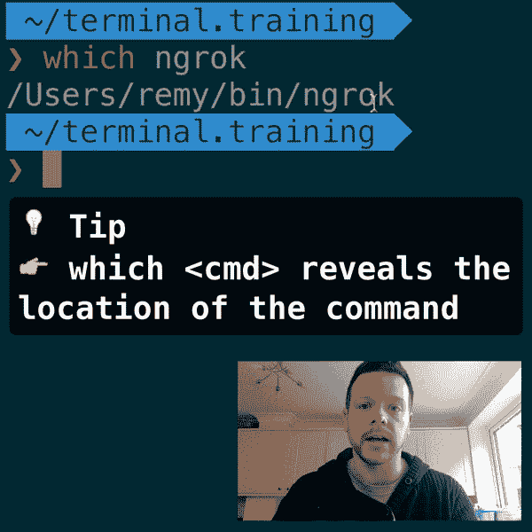
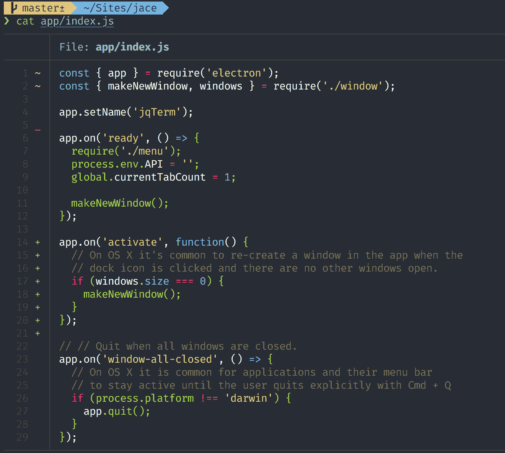
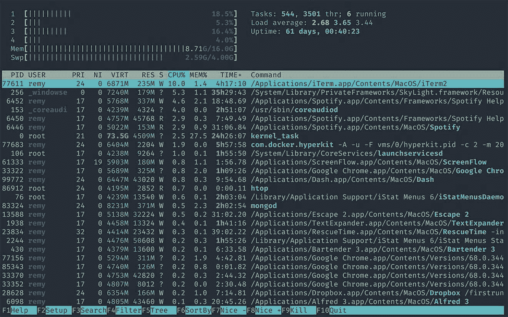
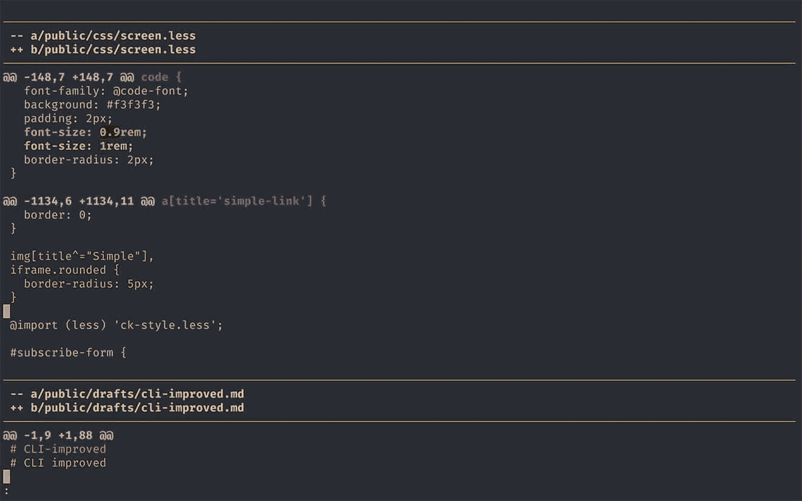
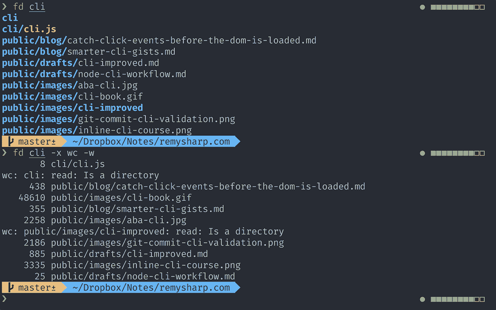
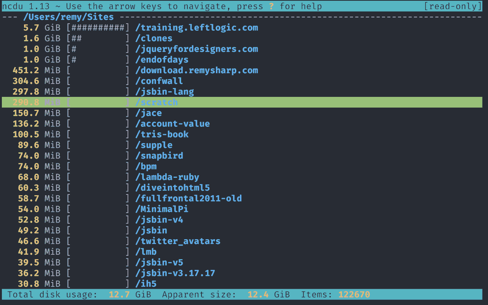
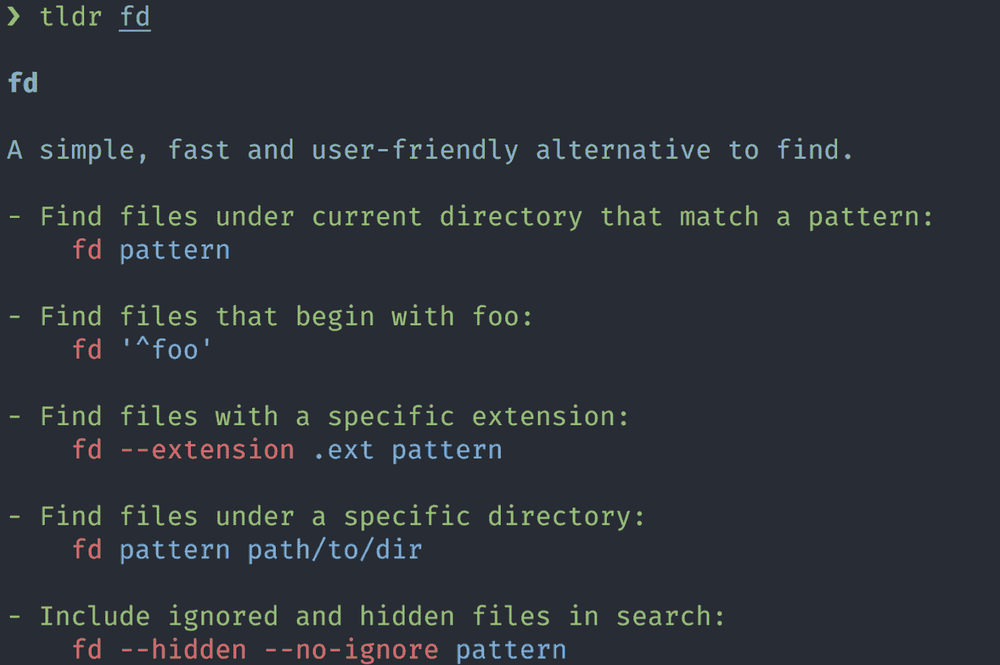
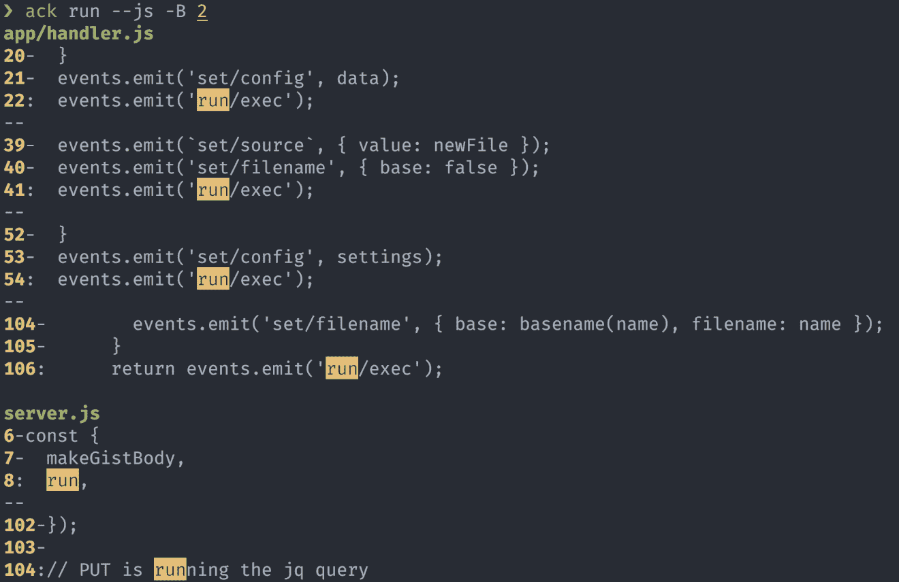

# CLI:改进

> 原文：<https://remysharp.com/2018/08/23/cli-improved?utm_source=wanqu.co&utm_campaign=Wanqu+Daily&utm_medium=website>

我不确定许多 web 开发人员是否可以不访问命令行。至于我，我从 1997 年就开始使用命令行，首先是在大学，当时我觉得自己是超级酷的 l33t 黑客，同时又完全超出了我的理解范围。

这些年来，我的命令行习惯有所改善，我经常为我经常做的工作寻找更智能的工具。也就是说，这是我目前改进的 CLI 工具列表。

[

读者折扣 **在终端培训上节省 50 美元**

我已经为新开发人员、设计师、UX、UI、产品负责人和任何今天需要征服命令行的人发布了 38 个视频。

**$ 49——仅来自此链接**](https://training.leftlogic.com/buy/terminal/cli2?coupon=BLOG&utm_source=blog&utm_medium=banner&utm_campaign=remysharp-discount) 

## 忽视我的进步

在很多情况下，我在原来的命令行工具上添加了新的和改进的别名(就像`cat`和`ping`)。

如果我想运行原来的命令，有时我确实需要这样做，那么有两种方法可以做到这一点(我在 Mac 上，所以您的里程可能会有所不同):

```
$ \cat 
$ command cat 
```

## 蝙蝠>猫

用于打印文件的内容，但是如果在命令行中花费更多的时间，像语法高亮显示这样的特性就非常方便了。我发现 [ccat](https://github.com/jingweno/ccat) 提供高亮显示，然后我发现 [bat](https://github.com/sharkdp/bat) 提供高亮显示、分页、行号和 git 集成。

`bat`命令还允许我使用`/`键绑定在输出期间进行搜索(仅当输出长于屏幕高度时)(类似于`less`搜索)。



我还将`bat`别名化为`cat`命令:

```
alias cat='bat' 
```

💾[安装方向](https://github.com/sharkdp/bat)

## ping > ping

非常有用，可能是我的“哦，废话是 X 关闭/我的互联网工作吗！！!"。但是`prettyping`(“蛮平”不是“预打字”！)给了 ping 一个非常好的输出，让我觉得命令行更友好一些。

img/cli-improved/ping.gif](img/e6081f6d548b7567cdcdf0a3eda35669.png "Sample ping output")

我还将`ping`别名化为`prettyping`命令:

```
alias ping='prettyping --nolegend' 
```

💾[安装方向](http://denilson.sa.nom.br/prettyping/)

## fzf > ctrl+r

在终端中，使用`ctrl+r`将允许你[在你的历史中向后](https://lifehacker.com/278888/ctrl%252Br-to-search-and-other-terminal-history-tricks)搜索。这是一个很好的技巧，尽管有点复杂。

`fzf`工具是对`ctrl+r`的**巨大的**增强。这是一个对终端历史的模糊搜索，带有可能匹配的完全交互式预览。

除了搜索历史，`fzf`还可以预览和打开文件，这就是我在下面的视频中所做的:

对于这个预览效果，我创建了一个名为`preview`的别名，它将`fzf`和`bat`结合起来用于预览，并创建了一个自定义键绑定来打开 VS 代码:

```
alias preview="fzf --preview 'bat --color \"always\" {}'"

export FZF_DEFAULT_OPTS="--bind='ctrl-o:execute(code {})+abort'" 
```

💾[安装方向](https://github.com/junegunn/fzf)

## htop >顶部

`top`是我的 goto 工具，用于快速诊断为什么机器上的 CPU 运行困难或我的风扇嗡嗡作响。我也在生产中使用这些工具。恼人的(对我来说！)`top`在 Mac 上和`top`在 linux 上有着天壤之别(和低劣的 IMHO)。

然而，`htop`是普通`top`和蹩脚的 mac `top`的改进。大量的颜色编码、键盘绑定和不同的视图在过去帮助我理解了哪些进程属于哪些进程。

便捷的按键绑定包括:

*   `P` -按 CPU 排序
*   `M` -按内存使用情况排序
*   `F4` -按字符串过滤流程(例如，缩小到“节点”)
*   标记单个进程，这样我就可以观察进程是否出现峰值



Mac Sierra 中有一个奇怪的 bug，可以通过以 root 身份运行`htop`来克服(我不记得具体是什么 bug 了，但这个别名修复了它——尽管我不得不不时输入密码，这很烦人):

```
alias top="sudo htop" 
```

💾[安装方向](http://hisham.hm/htop/)

## 与众不同>不同

我很确定这是几年前我从保罗·爱尔兰那里学来的。虽然我很少手动启动`diff`，但是我的 git 命令一直使用 diff。`diff-so-fancy`为我提供了颜色编码以及变化的字符高亮显示。



然后，在我的`~/.gitconfig`中，我已经包含了以下条目，以在`git diff`和`git show`上启用`diff-so-fancy`:

```
[pager]
       diff = diff-so-fancy | less --tabs=1,5 -RFX
       show = diff-so-fancy | less --tabs=1,5 -RFX 
```

💾[安装方向](https://github.com/so-fancy/diff-so-fancy)

## fd >查找

虽然我使用 Mac，但我从来都不是 Spotlight 的粉丝(我发现它很慢，很难记住关键词，数据库更新会影响我的 CPU，而且通常没用！).我经常使用 Alfred，但即使是 finder 功能也不能很好地为我服务。

我倾向于使用命令行来查找文件，但是要记住正确的表达式来找到我想要的东西总是有点痛苦(事实上，Mac 风格与非 mac find 略有不同，这增加了挫折感)。

`fd`是一个很好的替代品(由写`bat`的同一个人)。它非常快，我需要搜索的常见用例也很容易记住。

一些方便的命令:

```
$ fd cli 
$ fd -e md 
$ fd cli -x wc -w 
```



💾[安装方向](https://github.com/sharkdp/fd/)

## ncdu > du

知道磁盘空间在哪里被占用对我来说是一项相当重要的任务。我已经使用了 Mac 应用程序 [Disk Daisy](https://daisydiskapp.com/) ，但我发现它实际产生结果的速度有点慢。

`du -sh`命令是我将在终端中使用的命令(`-sh`表示摘要和人类可读)，但是我经常想要深入到占用空间的目录中。

是一个不错的选择。它提供了一个交互式界面，允许快速扫描哪些文件夹或文件占用了空间，导航速度非常快。(尽管任何时候我想扫描我的整个主目录，不管用什么工具，都要花很长时间——我的目录大约有 550gb)。

一旦我找到我想要管理的目录(删除、移动或压缩文件)，我将使用`cmd` +在 [iTerm2](https://www.iterm2.com/) 中单击屏幕顶部的路径名来启动 finder 到该目录。



还有另一个叫做 nnn 的选择，它提供了一个稍微好一点的界面，虽然它默认地控制文件大小和使用，但它实际上是一个完全成熟的文件管理器。

我的`ncdu`别名如下:

```
alias du="ncdu --color dark -rr -x --exclude .git --exclude node_modules" 
```

这些选项包括:

*   `--color dark` -使用配色方案
*   `-rr` -只读模式(防止删除和生成外壳)
*   忽略我不会处理的目录

💾[安装方向](https://dev.yorhel.nl/ncdu)

## 男人

令人惊讶的是，几乎每一个命令行工具都通过`man <command>`附带了一个手册，但是导航`man`输出有时会有点混乱，而且考虑到手册输出中包含的所有技术信息，这可能会令人望而生畏。

这就是 TL 所在的地方；DR 项目进来了。这是一个社区驱动的文档系统，可以从命令行获得。到目前为止，在我自己的使用中，我还没有遇到一个没有被记录的命令，但是你也可以[做出贡献](https://github.com/tldr-pages/tldr#contributing)。



为了准确起见，我还将`tldr`化名为`help`(因为这样打字更快！):

```
alias help='tldr' 
```

💾[安装方向](http://tldr-pages.github.io/)

## ack \ \ ag >

毫无疑问，它是命令行上的一个强大工具，但是多年来，它已经被许多工具所取代。其中两个是`ack`和`ag`。

我个人在`ack`和`ag`之间飞来飞去，却不记得我更喜欢哪一个(也就是说它们都非常好，非常相似！).我倾向于默认使用`ack`,只是因为它更容易一些。另外，`ack`附带了巨大的`ack --bar`参数(我会让你试验)！

`ack`和`ag`都将(默认)使用正则表达式进行搜索，并且与我的工作非常相关，我可以使用像`--js`或`--html`这样的标志指定要搜索的文件类型(尽管这里`ag`在 js 过滤器中包含的文件比`ack`多)。

这两个工具都支持常见的`grep`选项，比如 grep 中前后上下文的`-B`和`-A`。



由于`ack`没有 markdown 支持(我在 markdown 中写了很多)，我在我的`~/.ackrc`文件中有这个定制:

```
--type-set=md=.md,.mkd,.markdown
--pager=less -FRX 
```

💾安装方向: [ack](https://beyondgrep.com) ， [ag](https://github.com/ggreer/the_silver_searcher)

[进一步阅读 ack & ag](http://conqueringthecommandline.com/book/ack_ag)

## jq > grep 等人

我是 jq 的超级粉丝。起初，我在语法上有些困难，但后来我逐渐习惯了这种查询语言，并且几乎每天都使用`jq`(而在此之前，我要么使用 node，要么使用 grep，要么使用一种叫做 [json](http://trentm.com/json/) 的工具，相比之下这是非常基础的)。

我甚至已经开始撰写 jq 系列教程(2500 字，还在计算中),并发布了一个[网络工具](https://jqterm.com)和一个原生 mac 应用程序(尚未发布)。

允许我传入 JSON 并非常容易地转换源代码，以便 JSON 结果符合我的要求。一个这样的例子允许我在一个命令中更新所有的节点依赖关系(为了可读性，分成多行):

```
$ npm i $(echo $(\
  npm outdated --json | \
  jq -r 'to_entries | .[] | "\(.key)@\(.value.latest)"' \
)) 
```

上面的命令将列出所有过期的节点依赖项，并使用 npm 的 JSON 输出格式，然后根据以下内容转换源 JSON:

```
{
  "node-jq": {
    "current": "0.7.0",
    "wanted": "0.7.0",
    "latest": "1.2.0",
    "location": "node_modules/node-jq"
  },
  "uuid": {
    "current": "3.1.0",
    "wanted": "3.2.1",
    "latest": "3.2.1",
    "location": "node_modules/uuid"
  }
} 
```

…对此:

```
node-jq@1.2.0
uuid@3.2.1 
```

然后将结果输入到`npm install`命令中，瞧，我已经升级好了(使用 sledgehammer 方法)。

## 荣誉奖

我已经开始使用的一些其他工具，但是还没有经常使用(除了 ponysay，它在我启动一个新的终端会话时出现！):

## 你呢？

这就是我的清单。你呢？你改进了哪些日常命令行工具？我很想知道。