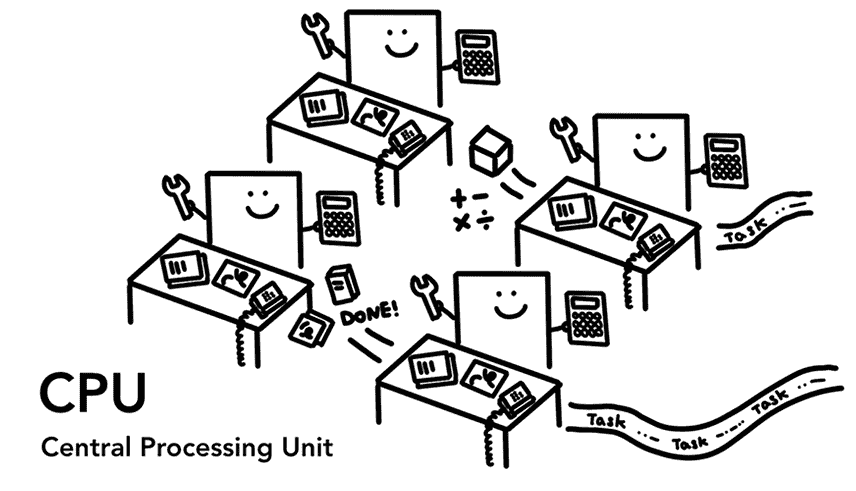
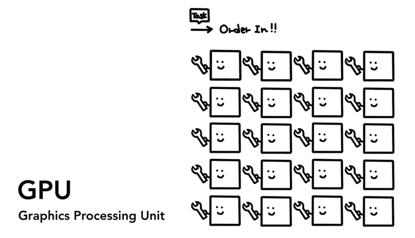
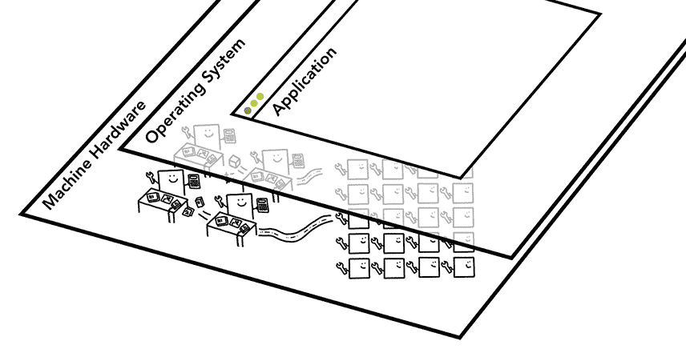
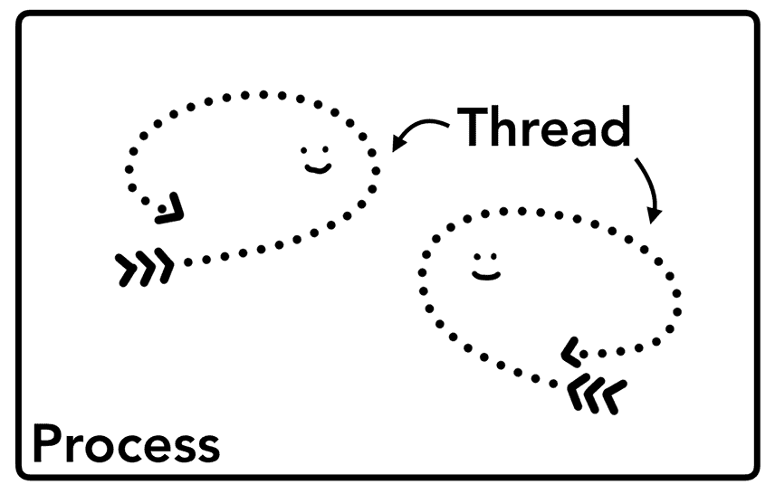
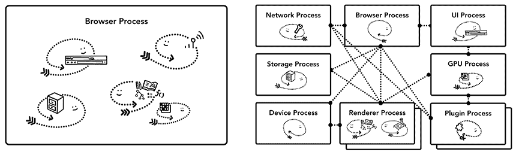
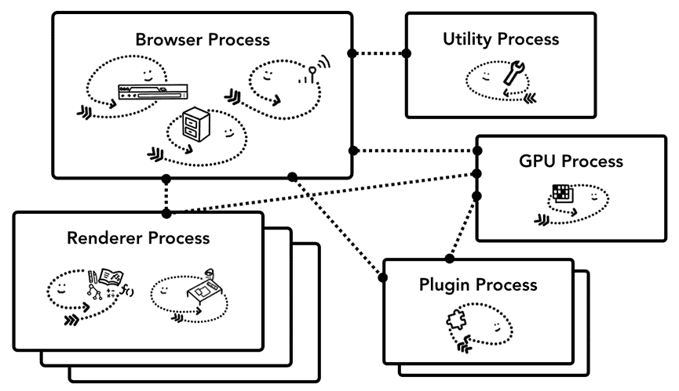
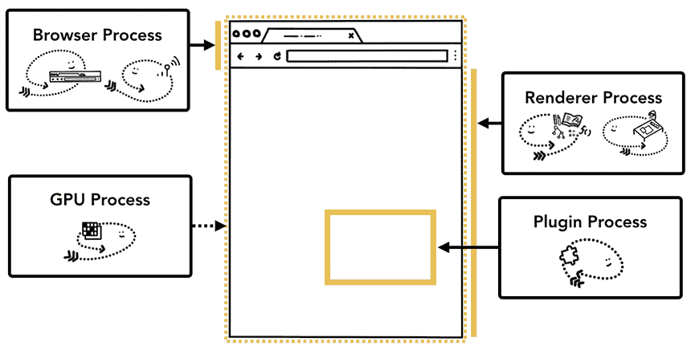
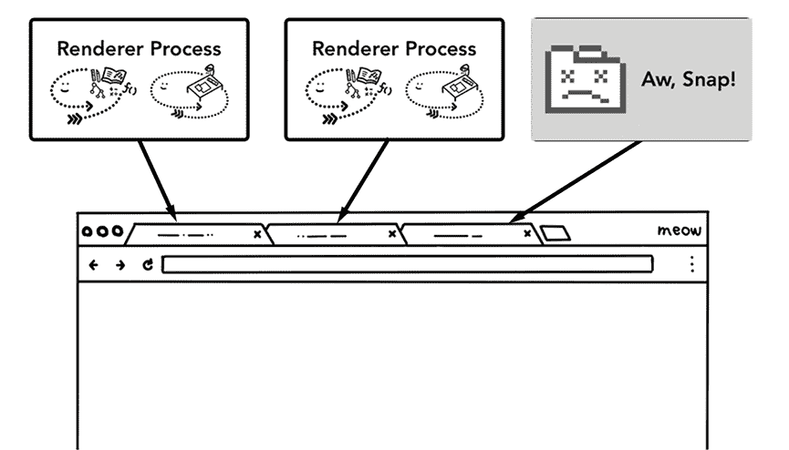
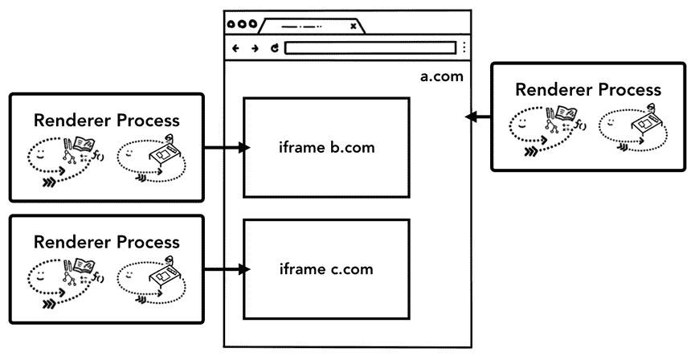

# 现代网络浏览器内幕(第一部分)——Chrome 开发者

> 原文：<https://developers.google.com/web/updates/2018/09/inside-browser-part1?utm_source=wanqu.co&utm_campaign=Wanqu+Daily&utm_medium=website>

## [#](#cpu-gpu-memory-and-multi-process-architecture) CPU、GPU、内存和多进程架构

在这个由 4 部分组成的博客系列中，我们将从高级架构到渲染管道的具体细节来了解 Chrome 浏览器。如果您想知道浏览器如何将您的代码转换成功能性网站，或者您不确定为什么建议使用特定的技术来提高性能，本系列适合您。

作为本系列的第 1 部分，我们将了解核心计算术语和 Chrome 的多进程架构。

如果你熟悉 CPU/GPU 和进程/线程的概念，你可以跳到[浏览器架构](#browser-architecture)。

## 计算机的核心是 CPU 和 GPU

为了了解浏览器运行的环境，我们需要了解一些计算机部件以及它们的功能。

### [#](#cpu) CPU

Figure 1: 4 CPU cores as office workers sitting at each desk handling tasks as they come in

首先是**C**entral**P**processing**U**nit-or**CPU**。CPU 可以被认为是计算机的大脑。一个 CPU 核心，在这里被描绘成一个办公室工作人员，可以一个接一个地处理许多不同的任务。它可以处理从数学到艺术的一切事情，同时知道如何回复客户电话。过去，大多数 CPU 都是单芯片。内核就像是生活在同一个芯片中的另一个 CPU。在现代硬件中，您通常会获得不止一个内核，从而为您的手机和笔记本电脑提供更强的计算能力。

### [#](#gpu) GPU

Figure 2: Many GPU cores with wrench suggesting they handle a limited task

图形处理器是计算机的另一部分。与 CPU 不同，GPU 擅长处理简单的任务，但同时跨多个核心。顾名思义，它最初是为了处理图形而开发的。这就是为什么在图形的上下文中“使用 GPU”或“GPU 支持”与快速渲染和平滑交互相关联。近年来，随着 GPU 加速计算，越来越多的计算仅在 GPU 上变得可能。

当你在电脑或手机上启动一个应用程序时，CPU 和 GPU 是驱动该应用程序的两个部件。通常，应用程序使用操作系统提供的机制在 CPU 和 GPU 上运行。

Figure 3: Three layers of computer architecture. Machine Hardware at the bottom, Operating System in the middle, and Application on top.

## [#](#executing-program-on-process-and-thread) 在进程和线程上执行程序

Figure 4: Process as a bounding box, threads as abstract fish swimming inside of a process

在深入研究浏览器架构之前，需要掌握的另一个概念是进程和线程。一个进程可以被描述为一个应用程序的执行程序。线程存在于进程中，执行进程程序的任何部分。

启动应用程序时，会创建一个进程。程序可能会创建线程来帮助它工作，但这是可选的。操作系统为进程提供了一块内存，所有的应用程序状态都保存在这个私有的内存空间中。当您关闭应用程序时，该进程也会消失，操作系统会释放内存。

Figure 5: Diagram of a process using memory space and storing application data

一个进程可以要求操作系统启动另一个进程来运行不同的任务。当这种情况发生时，内存的不同部分被分配给新的进程。如果两个进程需要对话，它们可以通过使用**I**enter**P**process**C**communication(**IPC**)来进行。许多应用程序都是以这种方式工作的，这样，如果一个工作进程没有响应，它可以在不停止运行应用程序不同部分的其他进程的情况下重新启动。

Figure 6: Diagram of separate processes communicating over IPC

## [#](#browser-architecture) 浏览器架构

那么如何使用进程和线程来构建 web 浏览器呢？它可以是一个进程有许多不同的线程，也可以是许多不同的进程有几个线程通过 IPC 进行通信。

Figure 7: Different browser architectures in process/thread diagram

这里需要注意的重要一点是，这些不同的架构是实现细节。关于如何构建 web 浏览器，并没有标准的规范。一个浏览器的方法可能与另一个完全不同。

为了这个博客系列，我们将使用 Chrome 的最新架构，如下图所示。

顶部是浏览器进程，它与负责应用程序不同部分的其他进程相协调。对于渲染器进程，会创建多个进程并分配给每个选项卡。直到最近，Chrome 在可能的情况下给了每个标签一个进程；现在它试图给每个站点自己的进程，包括 iframes(见[站点隔离](#site-isolation))。

Figure 8: Diagram of Chrome’s multi-process architecture. Multiple layers are shown under Renderer Process to represent Chrome running multiple Renderer Processes for each tab.

## [#](#which-process-controls-what) 哪个流程控制什么？

下表描述了每个 Chrome 进程及其控制的内容:

| 流程及其控制的内容 |
| 浏览器 | 控制应用程序的“chrome”部分，包括地址栏、书签、后退和前进按钮。
还处理网络浏览器不可见的特权部分，如网络请求和文件访问。 |
| 渲染器 | 控制显示网站的选项卡内的任何内容。 |
| 插件 | 控制网站使用的任何插件，例如 flash。 |
| 国家政治保卫局。参见 OGPU | 独立于其他进程处理 GPU 任务。它被分成不同的进程，因为 GPU 处理来自多个应用程序的请求，并将它们绘制在同一个表面上。 |

Figure 9: Different processes pointing to different parts of browser UI

还有更多类似于扩展过程和实用过程的过程。如果你想看看你的 Chrome 中有多少进程在运行，点击右上角的选项菜单图标 more_vert ，选择更多工具，然后选择任务管理器。这将打开一个窗口，其中列出了当前正在运行的进程以及它们使用了多少 CPU/内存。

## [#](#the-benefit-of-multi-process-architecture-in-chrome)Chrome 多进程架构的优势

前面，我提到 Chrome 使用多个渲染器进程。在最简单的情况下，您可以想象每个选项卡都有自己的渲染器进程。假设您打开了 3 个选项卡，每个选项卡都由一个独立的渲染器进程运行。如果一个选项卡变得没有响应，那么您可以关闭没有响应的选项卡，并在保持其他选项卡活动的同时继续操作。如果所有选项卡都在一个进程上运行，当一个选项卡没有响应时，所有选项卡都没有响应。真可悲。

Figure 10: Diagram showing multiple processes running each tab

将浏览器的工作分成多个进程的另一个好处是安全性和沙箱。由于操作系统提供了一种限制进程权限的方法，浏览器可以用沙箱保护某些进程免受某些功能的影响。例如，Chrome 浏览器限制处理任意用户输入的进程(如渲染器进程)对任意文件的访问。

因为进程有自己的私有内存空间，所以它们通常包含公共基础设施的副本(比如 V8，它是 Chrome 的 JavaScript 引擎)。这意味着更多的内存使用，因为它们不能像在同一个进程中的线程那样被共享。为了节省内存，Chrome 对它可以启动的进程数量进行了限制。这个限制取决于你的设备有多少内存和 CPU 能力，但当 Chrome 达到这个限制时，它就会在一个进程中从同一个网站运行多个标签。

## [#](#saving-more-memory-servicification-in-chrome) 节省更多内存 Chrome 中的服务化

同样的方法也适用于浏览器进程。Chrome 正在经历架构变革，将浏览器程序的每个部分作为一项服务来运行，从而可以轻松地拆分成不同的进程或聚合成一个进程。

一般的想法是，当 Chrome 在强大的硬件上运行时，它可能会将每个服务分成不同的进程，从而提供更多的稳定性，但如果它在资源受限的设备上，Chrome 会将服务合并到一个进程中，从而节省内存。在这次改变之前，类似整合进程以减少内存使用的方法已经在 Android 等平台上使用过。

Figure 11: Diagram of Chrome’s servicification moving different services into multiple processes and a single browser process

## [#](#site-isolation) 每帧渲染器进程-站点隔离

站点隔离是 Chrome 中最近引入的一项功能，它为每个跨站点的 iframe 运行一个独立的呈现程序。我们已经讨论了每个选项卡模型一个渲染器进程，它允许跨站点 iframes 在一个渲染器进程中运行，并在不同站点之间共享内存空间。在同一个渲染器进程中运行 a.com 和 b.com 看起来不错。[同源策略](https://developer.mozilla.org/docs/Web/Security/Same-origin_policy)是 web 的核心安全模型；它确保一个站点不能在未经同意的情况下访问其他站点的数据。绕过该策略是安全攻击的主要目标。进程隔离是分隔站点的最有效方式。随着 [Meltdown 和 Spectre](https://developers.google.com/web/updates/2018/02/meltdown-spectre) 的出现，我们需要使用进程来分隔站点变得更加明显。自 Chrome 67 以来，桌面上默认启用了站点隔离，标签中的每个跨站点 iframe 都有一个单独的渲染器进程。

Figure 12: Diagram of site isolation; multiple renderer processes pointing to iframes within a site

启用站点隔离是一项多年的工程工作。站点隔离不像分配不同的渲染器进程那么简单；它从根本上改变了 iframes 之间的对话方式。在带有运行在不同进程上的 iframes 的页面上打开 devtools 意味着 devtools 必须实现幕后工作以使其看起来无缝。即使运行一个简单的 Ctrl+F 来查找页面中的一个单词也意味着在不同的呈现器进程中进行搜索。你可以看到浏览器工程师把站点隔离的发布称为一个重大里程碑的原因了！

## [#](#wrap-up) 总结

在这篇文章中，我们已经介绍了浏览器架构的高级视图，以及多进程架构的好处。我们还讨论了 Chrome 中与多进程架构密切相关的服务化和站点隔离。在下一篇文章中，我们将开始深入研究这些进程和线程之间发生了什么，以便显示一个网站。

你喜欢这个职位吗？如果你对未来的帖子有任何问题或建议，我很乐意在下面的评论区或在 Twitter 上听到你的意见。

[接下来:导航中发生了什么](/blog/inside-browser-part2/)