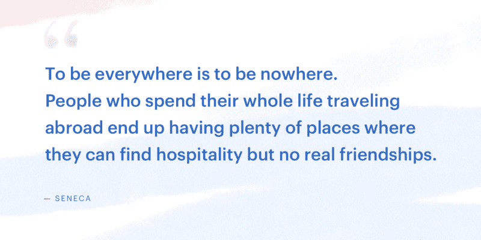
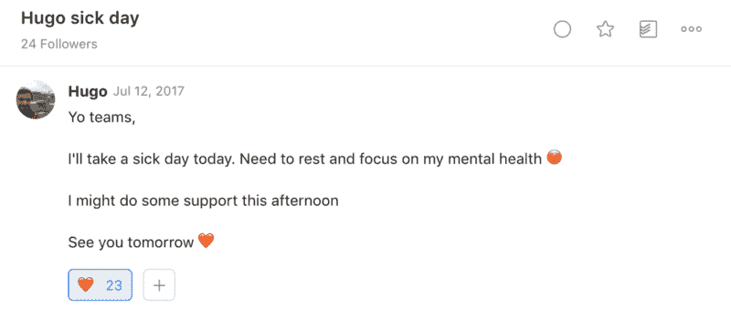
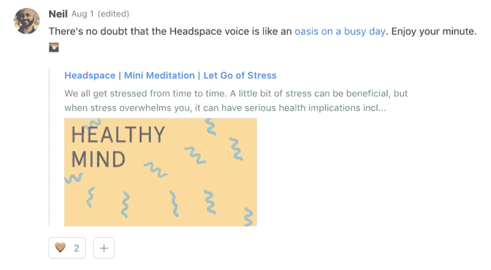

# 作为一名远程 CEO，我的孤立和抑郁经历

> 原文：<https://blog.doist.com/mental-health-and-remote-work-1b77616f6945?utm_source=wanqu.co&utm_campaign=Wanqu+Daily&utm_medium=website>

关于远程工作生活方式的文章往往专注于在海滩上喝鸡尾酒，环游世界，或者享受让你的社交媒体追随者羡慕的生活。这不是那种文章。

## 无处不在就是无处可去

23 岁那年，和女朋友分手，卖掉或者送人了大部分东西，收拾了一个单人行李箱，订了一张从丹麦到台湾的单程机票。我活在一个旅行者的梦里，没有任何附加条件。当时，我不知道这将是我一生中最不快乐时期的开始。

郑重声明，结束一段长期关系，远离家人、朋友以及你在这个世界上可能拥有的任何其他有意义的人际关系，是一个糟糕的想法。再加上不存在的工作与生活的平衡，你就有了制造痛苦的绝佳方法。

孤独不是许多旅行中的远程工作者会写的东西。你不会在他们的 Instagram 故事中看到它，但我向你保证他们已经感受到了。当你长时间旅行时，你会失去你的社交圈，你的归属感，以及让你保持健康的日常生活。

你还会很快发现结识新朋友很容易，但结交新朋友——真正的朋友——很难，尤其是如果你是从零开始的话。

> 把友谊、社区和你的心理健康放在旅行之前是可以的。

在我回到欧洲之前，我在台湾住了大约一年。在我经历抑郁、焦虑、失眠和孤独的过程中，我学到了一些惨痛的教训。我花了几年时间才从那次经历中完全恢复过来。

有些人喜欢旅行和工作的生活方式，但对许多人来说，这并不像社交媒体会让你相信的那样。作为人类，我们需要真正的朋友、爱人和一个属于我们的地方。广泛的研究表明，社会关系密切的人寿命更长，更健康，更幸福。无论 Airbnb 会告诉你什么，你都不能立刻“属于任何地方”。社区的建立需要时间，没有捷径可走。

Doist 是一家远程优先的公司。这意味着人们可以在世界任何地方工作，只要他们有互联网连接。然而，95%以上的 Doisters 不是游牧民族。大多数人选择在被朋友和家人包围的小城市扎根。远程工作的美妙之处在于能够为您的福祉优化您的位置。

远程工作者不应该觉得他们必须旅行才能过上有趣、充实的生活。把友谊、社区和你的心理健康放在旅行之前是可以的。它在 Instagram 上可能看起来不那么迷人，但你可能会因此而更加快乐。

## 在家工作的标志

工作时环游世界的显而易见的替代方式是在家工作。但这也有其自身的孤立之处。

我从未在真正的办公室工作过，甚至没有过“真正的”工作。我远程联合创办了我的第一家公司，我一直很难将生活和工作分开。最初在大学，我在宿舍工作。和其他 15 名学生住在一起意味着社会交往只是敲敲门而已——平衡就在其中。我会做我的大学作业或在兼职项目上取得进展，当我走出宿舍时，我会在一辆旧 Amiga 上踢足球，或与室友喝啤酒，或参加人们碰巧在做的任何事情。

在某个时候，我开始赚足够的钱来买自己的公寓。作为一个重视沉默和专注的内向程序员，我认为独居对我来说是一个更好的环境。没过多久我就发现自己错了。

一个人生活很难，尤其是当你年轻的时候。大部分时间我都在工作。尽管我知道我应该为我的工作划定界限，但我似乎就是做不到——总是有更多的事情要做。结果我开始了一个可怕的习惯(非习惯？)不努力出去见朋友。

> 当你在家工作的时候，很容易陷入坏习惯，越来越糟糕。

在几个月的时间里，持续的工作和社会隔离慢慢影响了我。我开始过糟糕的日子——情绪低落和焦虑——越来越多，直到糟糕的日子超过了美好的日子。有时候我会凌晨 3 点睡觉，有时候我会睡到下午 2 点。我的工作效率下降了，这只会让我感到更加焦虑和沮丧。我的情绪完全不稳定。我试图在家庭生活和工作之间建立常规和界限——在同一时间起床，在特定时间停止工作，一天中多休息——但我的解决方案都没有持续很长时间。

事情发展到这一步，我意识到为了我的精神健康，我必须做出巨大的改变，所以我在大学附近租了一间办公室。是的，我仍然只是在一个不同的地方独自工作。是的，这比在家工作花费更多，并且增加了我一天的通勤时间。但是每一分钱每分钟都是值得的。我需要把工作和我的余生严格分开。工作有明确的开始和结束时间。走出公寓让我再次变得更加社会化，因为我会在外出时和朋友一起吃午餐、晚餐或运动。慢慢地，好日子开始回来了。我又开始精力充沛地工作了。紧张性刺激变得更容易处理。

知道那些让你快乐、健康和有效率的事情和实际去做是非常不同的。当你在家工作的时候，很容易陷入坏习惯，越来越糟糕。没有具体的开始和结束时间来安排你的一天。没有同事能让你忘记自己的想法。很难知道什么时候你已经完成了足够多的事情而感到满足。今天增加额外的工作时间是很诱人的，但你将会为明天的疲劳和筋疲力尽付出代价。

## 为什么远程公司需要公开承认远程工作的精神健康挑战

我的故事在远程工作者中并不独特。随时随地工作的灵活性应该有助于工作与生活的平衡，但往往适得其反。与传统办公室相比，远程工作更注重输出——你做了什么——而不是输入——你花了多少时间。有一种完成“足够多”工作的个人责任感，这种责任感会让人们在最佳生产率点之后继续工作。再加上缺乏物理工作边界，远程工作人员会很快陷入难以摆脱的恶性循环。

我们中的大多数人都在家工作，并且找到了保持健康平衡的方法。两者兼而有之是可能的。我的观点不是每个远程工作者都需要停止旅行，出去租一个办公室。而是远程工作的灵活性需要大量的自我意识来识别不健康的循环，并在它螺旋式下降之前采取措施阻止它。你需要有意识地询问什么样的情况最适合你的需求和个性，并积极尝试，直到你找到一个合适的人选。

它可能是一个家庭办公室，一个咖啡店，一个共同工作的空间，以上都不是或者是一些组合——这都没关系。危险在于做我所做的事情——忽视你的精神健康，默认到一个没有工作界限或社交互动的不健康状况。

2016 年，我在 Reboot 播客中谈到[拥抱自己的两个方面](https://www.reboot.io/episode/47-embracing-both-sides-of-yourself-with-amir-salihefendic/)——永不满足于现状的雄心勃勃的一面和想要满足和快乐的人性的一面。面试结束后，我决定加入他们在[的 CEO 训练营](https://www.reboot.io/service/bootcamps/)的领导务虚会。

这一经历让我看到了即使是非常成功的人也会面临的内心挣扎。我发现我有自己的问题需要解决，以成为一个更好的领导者、丈夫、父亲、朋友和人。你不必是临床上的抑郁症或焦虑来与抑郁和焦虑作斗争。每个人都有问题。但是我们能公开谈论他们吗？我们能得到解决这些问题所需的帮助和支持吗？在很多情况下，这两个问题的答案都是否定的。

> 当你没有每天亲自见到你的同事时，很容易认为一切都很好，而事实并非如此。

在 Doist，我们在积极思考远程工作如何影响我们团队的精神健康，以及我们可以积极做些什么来创造一种环境，让人们可以带着他们的奋斗而来，并获得他们需要的支持方面进展太慢。

我们谈论远程工作作为世界面临的许多问题的解决方案，但是研究表明人类不应该孤立地工作。一项研究发现，在工作中有“好朋友”的人投入工作的可能性是“T2”的七倍。此外，那些说他们在工作中有朋友的人感觉更有效率，在工作中呆的时间更长，工作满意度也更高。

在另一项专门关注远程工作的为期两年的研究结束时，超过一半的远程实验组成员决定不再 100%的时间在家工作。尽管事实上他们每周一整天的工作效率更高，病假时间更少，辞职的可能性比呆在办公室的同事低 50%。他们为什么回到办公室？他们觉得太孤立了。

远程工作带来了独特的精神健康挑战。当你没有每天亲自见到你的同事时，很容易认为一切都很好，而事实并非如此。作为一家远程公司，我们需要诚实地承认远程工作的缺点，并做更多的工作来帮助我们的员工在生活的各个方面都取得成功。

我们仍然处于弄清楚远程工作如何影响我们的心理健康以及我们可以做些什么来改善这种情况的早期阶段。

总体而言，以下是我们团队正在积极开展的一些工作:

*   公开承认远程工作可能会带来严重的精神健康问题。人们在这些斗争中并不孤独，感到焦虑或沮丧并没有什么“错”。
*   创造一种环境，鼓励就这些硬话题进行公开对话，不要让它们成为禁忌。我们鼓励在一对一和公共论坛中这样做。我们甚至在上次的静修中举办了一个研讨会，专门讨论焦虑和远程工作的话题。
*   如果一个人有抑郁、焦虑或压力的问题，那么我们应该 100%地支持他们(作为同事、领导和公司)。

更具体地说，以下是我们鼓励幸福的一些做法:

*   **每年 40 天带薪休假**:真正的脱离是帮助人们减压和充电的根本。
*   鼓励人们在需要的时候利用病假来促进心理健康。

Mental health is as important s physical health.

*   合作福利:这样我们的员工就可以走出家门，如果他们愿意的话，可以在一个更像办公室/社区的环境中工作。
*   更小的事情，比如尼尔在 Twist 上发布的**每日正念**帖子，鼓励我们在日常生活中建立更多的意识和平静。

A daily reminder that mental health is important.

*   露西尔和[安德鲁](https://twitter.com/andrewgobran)最近率先发起了心理健康月度倡议，他们每个月都会发布一个新的心理健康话题。

* * *

由领导者决定一个组织的基调——包括如何处理心理健康问题。我们的在线手册，

[Leading Distributed: The Remote Guide to Management](https://twist.com/remote-work-guides/remote-management)

，深入探讨管理者如何为他们的团队创造一个平衡的环境，包括用心沟通和鼓励休假。

我相信公司应该想要快乐的员工，因为帮助人们过上满意和有意义的生活本身就是一个有价值的目标。但是研究一再表明，快乐的员工也有助于强大的企业。

找到工作与生活的平衡并不是以工作为代价优先考虑你的精神健康。它承认，从长远来看，当你把心理健康放在第一位时，你生活的所有方面都会变得更好。在 Doist，我们致力于建立一种文化，帮助人们应对远程工作的潜在挑战，在生活的各个方面做最好的自己。

我想听听你对此的看法。远程工作时，你如何优先考虑心理健康？你的公司会做些什么来帮助你？如果您有任何问题或意见，请联系我。

更正:这篇文章的前一个版本称，数字游牧者和连续创业者 Pieter Levels 已经在阿姆斯特丹安家落户。他向我们保证这是“假新闻”，并一如既往地继续旅行。你可以在这里读到他在世界各地旅行创业的经历。