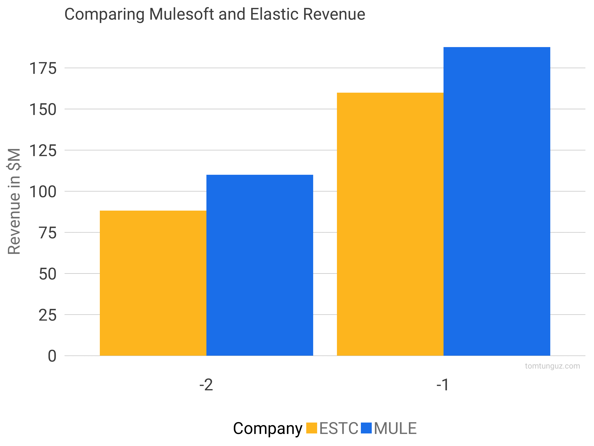
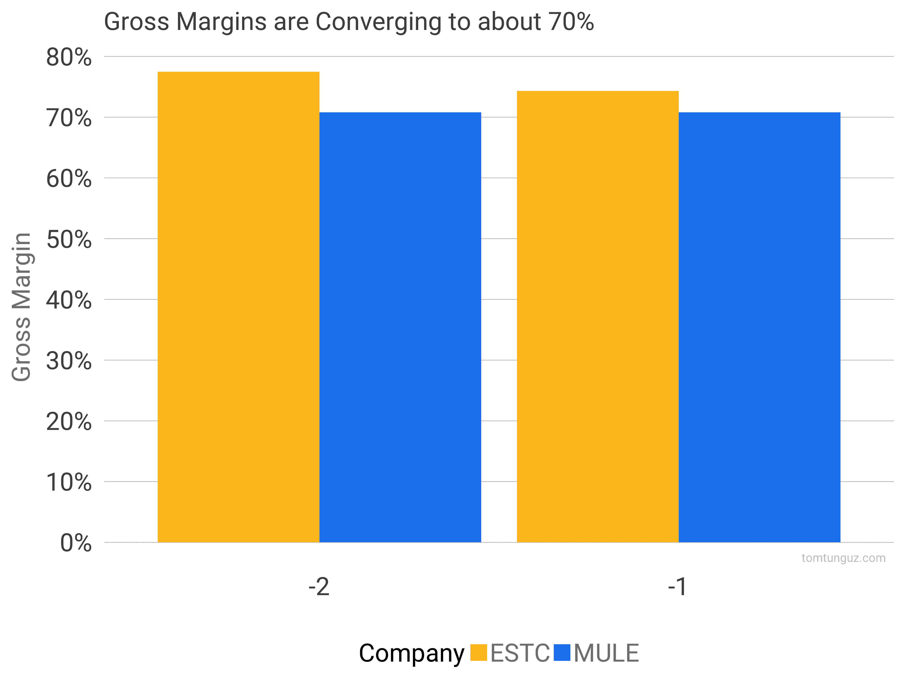
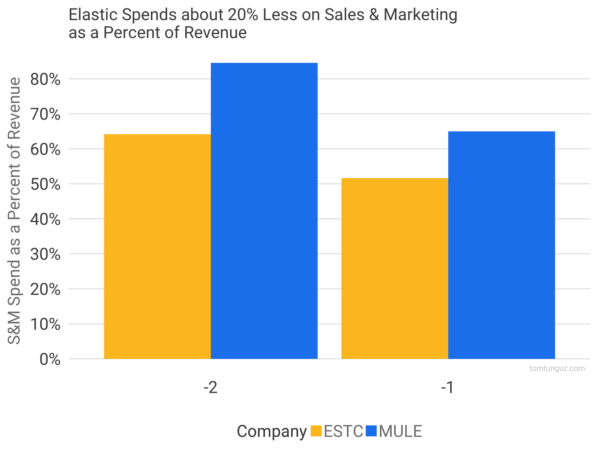
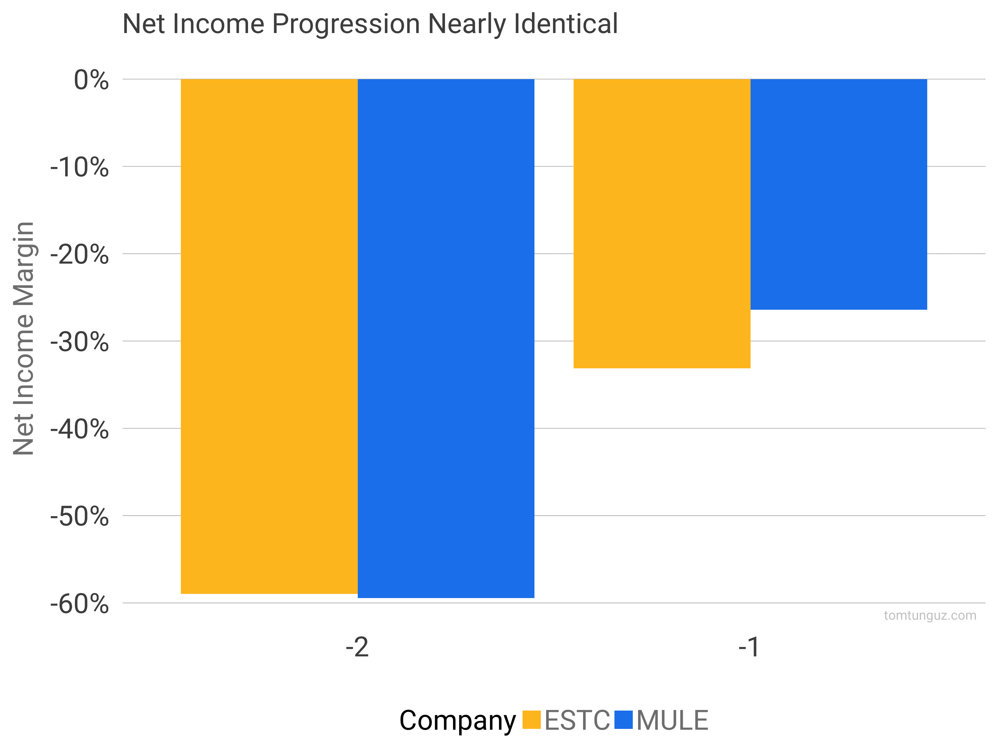

# 弹性 S-1 分析——另一个开源怪物

> 原文：<http://tomtunguz.com/elastic-s-1-analysis/?utm_source=wanqu.co&utm_campaign=Wanqu+Daily&utm_medium=website>

上周，Elastic [提交了他们的 S-1 上市](https://www.sec.gov/Archives/edgar/data/1707753/000119312518266861/d588632ds1.htm)。Elastic 是一家成立于 2012 年的荷兰公司。仅仅五年后，该公司创造了 1.599 亿美元的收入。Elastic 将称为 Elastic Stack 的开源软件商业化，这是一套不同的产品，使用户能够搜索和存储许多不同来源和格式的数据。该软件用于应用程序搜索、网站搜索、企业搜索、应用程序性能监控以及业务和安全数据分析。

为了将该公司的非凡成功置于背景中，我将他们的指标与 Salesforce 以 65 亿美元收购的另一家非常成功的开源公司 Mulesoft 一起绘制出来。在下面的图表中，我绘制了 Elastic 在 IPO 前两年的指标，标记为-2 和-1。我绘制了 Mulesoft 2015 年和 2016 年的指标，这是 IPO 前的-3 年和-2 年，但这些公司的规模相似。

这两家公司有许多重要区别。最突出的:平均客户价值。Mulesoft 追求更大的合同。IPO 时，一位新客户创造了 143，000 美元的收入。另一方面，Elastic 更侧重于中端市场。他们的 ACV 是 32k 美元。这意味着不同的走向市场行动、本地部署与托管部署产生的不同收入份额，以及可能不同的销售团队构成。现在，关于数字:

[T2】](https://res.cloudinary.com/dzawgnnlr/image/upload/q_auto/f_auto/w_auto/estc_vs_mule_revenue_2018-09-10.png)

首先，我们来看看收入。Elastic 从 8820 万美元增长到 1.599 亿美元，年增长率为 80%。Mulesoft 从 1.1 亿美元增长到 1.88 亿美元，增长率为 71%。以这样的速度和规模增长是非同寻常的。

[T2】](https://res.cloudinary.com/dzawgnnlr/image/upload/q_auto/f_auto/w_auto/estc_vs_mule_gm_2018-09-10.png)

接下来是毛利润。毛利润等于收入减去销售成本，其中包括托管成本和客户支持等费用。上市软件公司的中位数是 71%。Mulesoft 的 70.1%是正确的，而 Elastic 更高，但接近这个数字。

[T2】](https://res.cloudinary.com/dzawgnnlr/image/upload/q_auto/f_auto/w_auto/estc_vs_mule_pspct_2018-09-10.png)

为了提高这些比率，两家公司都在销售和营销方面投入了大量资金。上图显示了销售和营销支出除以收入。Mulesoft 投入了 85%和 65%的收入，而 Elastic 支出了 64%和 52%的收入。这表明 Elastic 的销售和营销活动比 Mulesoft 更有效。他们在销售和营销上的支出占收入的比例更低，但收入增长速度却快了 9 个百分点。

美元净扩张对弹性来说好一点。Mulesoft 报告的净美元增长率为 1.25 倍，相比之下，Elastic 过去 7 个季度的净美元增长率超过 1.3 倍，最近一个季度为 142%。这可能与中端市场有关，因为该公司是从较低的价格点开始的，这使得更大的客户扩张成为可能。

销售效率系数证实了这一点。弹性图表令人印象深刻的 0.89，相比之下，Mulesoft 的 0.65。销售效率系数衡量一段时间内的毛利增长除以销售和营销投资。换句话说，公司需要花费多少才能产生边际利润？

[T2】](https://res.cloudinary.com/dzawgnnlr/image/upload/q_auto/f_auto/w_auto/estc_vs_mule_nim_2018-09-10.png)

就净收入利润率而言，两家公司实际上处于相同的发展阶段，利润率从大约-60%提高到大约-30%。

松紧带是一个了不起的行业。开源软件巨大的分销优势和销售效率的另一个例子，可以推动开源软件商业化的业务。Mulesoft 以 64 亿美元的价格出售，这在当时是一家价值数十亿美元的软件公司的最高收入与企业价值比率。如果 Mulesoft 的 M & A 估值有任何暗示的话，那么 Elastic 肯定是一个绝对庞大的行业。