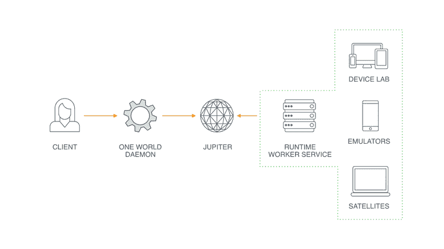
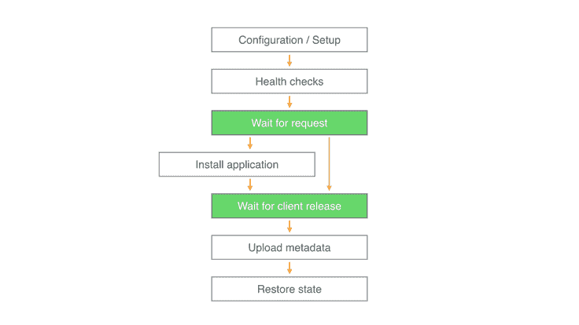

# 管理 Meta 大规模测试工程的资源

> 原文：<https://code.fb.com/android/managing-resources-for-large-scale-testing/?utm_source=wanqu.co&utm_campaign=Wanqu+Daily&utm_medium=website>

随着世界各地越来越多的人连接到脸书，我们希望确保我们的应用和服务在各种场景下都能正常工作。按照脸书的标准，这意味着在我们发布新代码之前，要测试数百个跨多种设备和操作系统的重要交互的正确性和速度。

去年，我们推出了[脸书移动设备实验室](https://engineering.fb.com/posts/300815046928882/the-mobile-device-lab-at-the-prineville-data-center/)，让工程师通过访问我们数据中心的数千台移动设备来进行测试。从那时起，我们构建了一个新的统一资源管理系统，代号为 One World，来托管这些设备和其他运行时，如 web 浏览器和模拟器。脸书的工程师可以使用一个 API 在他们的测试和其他自动化系统中与这些远程资源进行通信。One World 已经发展到管理成千上万的资源，每天执行超过 100 万个作业。在这个规模上，我们学到了很多，因为我们遇到了独特的挑战，即构建一个可以处理设备可靠性复杂性的系统，同时公开一个易于使用的 API。

## 体系结构

在一个世界中，我们的目标是支持工程师可能希望与远程运行时一起使用的任何应用程序，并对他们的代码或环境进行最小的修改。这意味着支持像 adb (Android Debug Bridge)这样的标准通信机制，并提供远程设备本地连接的假象。我们的系统由四个主要组件组成:

*   **运行时工作者服务:**每种资源类型都有自己的运行时工作者服务，运行在管理资源的机器上。工作服务管理资源的生命周期，并响应客户端使用其资源的请求。
*   一个世界守护进程:这个轻量级服务运行在连接到远程资源的机器上。该服务实现与工作人员通信的协议，并设置允许本地进程与远程资源通信的环境。
*   调度程序:我们使用脸书的作业调度服务 Jupiter，将客户与可用资源符合其特定要求的工人匹配起来。
*   **Satellite:** 这种工人服务的最小部署允许工程师将本地资源连接到全球 One World 部署。



### 运行时工作服务

在同一个世界中托管的每个资源都有一个工作服务，其职责如下:

*   **资源配置和设置:**在接收任务之前，大多数资源都需要某种初始设置。对于移动设备，这可能包括解锁设备、禁用锁屏和配置其他系统设置。对于浏览器，它可能包括启动一个 selenium 独立服务器，以允许远程控制它。
*   **健康检查:**物理设备在长时间使用后会出现故障，我们实验室中的设备比普通个人设备的使用次数要多得多。工作服务有一系列检查，在允许客户端访问设备之前，它们运行这些检查以确保设备处于健康状态。一些运行状况检查可能需要技术人员来修理或移除设备，而其他检查可能以自动方式解决，例如由于电池电量低而给设备充电。
*   **恢复状态:**资源被使用后，我们需要为下一个客户端准备它。对于仿真器、模拟器和浏览器等资源来说，这可能是一个像从映像重新启动一样简单的过程。移动设备带来了一些独特的挑战，因为完整的重新映像非常耗时，并且会增加内部闪存的磨损。为了恢复到已知的良好状态，工作服务将采取诸如重新启动设备以重置大多数内核设置、卸载应用程序和擦除数据分区等措施。

在工人服务中，这些步骤被表示为一个状态机。每个状态都有监控和日志记录，因此我们可以逐步了解系统中的瓶颈和故障率。一个示例状态机可能采用以下形式:



在这个状态机示例中，绿色的步骤表示工作者与客户机交互的点。配置/设置和运行状况检查等任务甚至可以在客户端连接到工作人员之前完成。这些步骤可能需要几分钟时间，因此提前运行它们可以在客户端连接时实现最小的延迟—通常，我们的连接延迟只有几秒钟。在移交资源供使用之前，工作人员可以采取措施来响应客户端请求。例如，如果资源位于远程数据中心，那么在主机上本地运行应用程序比通过网络运行要快得多。在客户端断开连接后，工作线程可以将附加元数据附加到会话中，以便以后查询。我们用它来存储会话的日志(如设备日志)和视频。通过允许工作人员异步添加元数据，客户端不必等待上传完成。

工作者服务是用 Python 3 编写的，这让我们可以在各种平台上运行它们，包括 Linux、Mac OS 和 Windows。为每个托管资源启动一个单独的服务实例。我们试图在支持它的平台上将这些服务实例相互隔离。例如，在 Linux 上，这意味着在它自己的控制组中启动每个服务，该控制组被配置为只提供对它所控制的资源的访问。

### 远程访问移动测试设备

在 Android 上，我们希望在一个世界上支持现有的全套工具，这意味着对 adb 的正常调用必须在我们的系统内工作。否则，在脸书使用的每一个工具都需要修改，以适应一个世界，这将很快失去控制。One World 在设备主机上运行 adb 服务器，并通过建立 TCP 隧道来提供本地 adb 实例的假象。例如，我们可以在标准 adb 端口 5037 上创建一个 TCP 隧道，并将所有流量转发到设备主机的 adb 实例。为了支持 adb 正向/反向，我们在 adb 二进制文件周围部署了一个瘦包装器，它能够理解这些命令并创建两跳隧道——首先到设备主机，然后到设备本身。

虽然 Android 开发环境有用于与 Android 仿真器或设备交互的 adb，但 iOS 开发的大部分工具都是 Xcode 的一部分。由于 OneWorld 远程运行 iOS 运行时，我们需要一个类似的远程交互机制，以便这些运行时可以用于运行应用程序和不同类型的测试。

2015 年，我们开源了 [FBSimulatorControl](https://github.com/facebook/FBSimulatorControl) ，一个控制 iOS 模拟器的项目。我们已经扩展了这个项目，允许与设备接口，使我们能够适应我们在脸书的许多应用。FBSimulatorControl 的功能包括:

*   **自动化的结构化输出:** FBSimulatorControl 以机器可读的格式报告设备和模拟器的状态，适用于启动模拟器和启动应用程序等交互。
*   **应用程序管理:**ios 上最常见的自动化场景包括安装和启动我们的 iOS 应用程序。FBSimulatorControl 为此提供了跨模拟器和设备的一致接口，消除了 One World worker 服务的复杂性。
*   **用户界面的自动化:** iOS 工程师可能熟悉用于编写自动化 UI 测试的 XCUITest 框架。在脸书，我们已经在这个框架之上建立了我们的 [WebDriverAgent](https://github.com/facebook/WebDriverAgent) 项目，一个运行在 iOS 上的 WebDriver 服务器。这使我们能够从另一台机器上自动化我们的 iOS 应用程序的用户界面，而无需在工作人员上运行额外的软件。我们的端到端测试将此应用于运行时主机之外的独立机器上，在并行化时为测试运行时带来巨大的性能优势。
*   **远程调用:**当检查自动化测试的结果时，额外的诊断数据可能是有用的。FBSimulatorControl 提供了从 iOS 模拟器和设备收集视频和日志的 API，然后客户端可以访问这些 API。

### 一个世界守护进程

客户机不是直接与工作服务对话，而是连接到一个本地守护进程，处理协商和环境设置。在这种协议中，客户端首先创建一个与守护进程的新会话。该会话包含客户机需要的运行时类型和它需要的并发运行时数量的规范。例如，当运行一个大型测试套件时，一个客户端可能会请求 20 个并发 Android 模拟器的会话。守护程序通过保留工作服务实例和执行特定于运行时的准备步骤来准备所请求的资源。对于 Android 会话，这意味着设置适当的 TCP 隧道来监听本地主机，并将流量代理到远程机器上的 adb 守护进程。

由于客户机需要访问其会话中的每个保留资源，它将向守护程序请求“租用”。如果资源不可用，守护程序将响应连接详细信息或通知客户端。这些连接详细信息包括用于 adb 和 FBSimulatorControl 的本地端口等信息。客户机使用完资源后，它通过再次调用守护进程来释放资源。此时，守护进程要么完全释放资源供不同的客户端使用，要么保留资源供同一会话重用(如果可能)。

在整个会话中，workers 和 daemon 作为上述状态机模型的一部分进行通信。一旦工作线程通过调度服务被保留，它就连接到相应的守护进程来为作业提供服务。在会话期间，守护进程和工作进程将执行活动检查，因为它们中的任何一个都可能意外死亡。一旦客户机完成了它的会话，守护进程就向工作进程发送一条消息，以进入它的状态机的“恢复状态”部分。

### 卫星模式

虽然访问受管远程资源允许客户端扩展，但有时工程师希望在本地设备上使用相同的工具来调试问题。我们提供“卫星服务”，允许工程师将本地资源连接到同一个世界的云。这意味着你桌上的电话可以与任何其他工程师共享，并由所有脸书自动化使用，只需运行一个简单的命令。与工人服务一样，卫星服务建立了一系列从本地机器到一个世界的 SSH 隧道，以连接到基础设施的其余部分。以卫星设备而不是受管设备为目标不需要更改代码，并且卫星服务会设置所有必需的网络路径并发布资源的可用性。

## 使用同一个世界

上面描述的 One World 守护进程负责连接到服务的繁重工作。我们提供简单的库来处理与守护进程通信的常见模式，使工程师能够轻松地与一个世界集成。下面的代码片段演示了在 One World 设备上运行 adb 命令的 Python API。它启动 One World 守护进程，然后`OneWorldADB`建立一个会话并阻塞，直到设备可用。一旦工程师的代码完成，一个 Python [上下文管理器](https://docs.python.org/3/reference/datamodel.html#context-managers)负责拆除一切。

```

 with OneWorldDaemon() as daemon, OneWorldADB(
    daemon,
    consumer='demo',
    capabilities={'device-group': 'nexus-6'},
) as adb:
    adb.run('logcat') 

```

也支持使用多个并发资源。One World 守护进程管理这些并发资源，并且通过 API，工程师实现他们自己的特定于系统的功能。在下面的示例中，10 个模拟器用于运行 100 个作业，下一个作业将在新模拟器可用时运行。最后的结果变量将包含由`run_custom_test`方法返回的 100 个结果。

```

 with OneWorldAndroidADB(daemon, num_emulators=10) as android:
    futures = [
       asyncio.ensure_future(
           android.run_with_emulator(run_custom_test)
       ) for _ in range(100)
    ]
    results = await asyncio.gather(*futures) 

```

通过 CLI 支持临时使用:


## 应用程序

除了为临时使用资源提供环境外，一个世界还支持脸书的众多基础设施项目，包括:

*   端到端和集成测试:对于我们应用程序的每一处代码变更，我们都会运行一套大型测试，以避免在我们的代码库中引入新的错误。在脸书的范围内，每天都要进行成千上万的代码修改，导致成千上万的测试运行。One World 允许我们在这种规模的仿真器、模拟器和设备上运行这些测试，并在工程师编写代码时提供快速的结果反馈。
*   **[CT 扫描](https://engineering.fb.com/posts/924676474230092/mobile-performance-tooling-infrastructure-at-facebook/) :** 除了寻找漏洞，我们还仔细测试我们的应用程序的性能回归，以确保我们的应用程序可以在各种设备上流畅运行。One World 提供对脸书用户所拥有的代表性设备的访问，并允许 CT-Scan 专注于测试性能，而不是管理设备。
*   **[Sapienz](https://www.facebook.com/academics/photos/a.535022156549196.1073741825.144433258941423/1326609704057100/) :** 作为一个多目标的端到端测试系统，Sapienz 使用基于搜索的软件工程自动生成测试序列，使用它可以找到的最短路径来查找崩溃。Sapienz 团队可以专注于崩溃查找算法，同时让 One World 管理它使用的仿真器。

今天，我们有许多重要的应用程序，但是我们希望我们未来的工作能够极大地扩展我们在工程工作流程中使用 One World 的方式。我们正在开发一些激动人心的新功能，包括:

*   **直播:**工程师们经常想要重现特定于平台的 bug。有时候，仅仅有一个像 adb 这样的远程界面是不够的——你可能需要滚动浏览新闻提要、写评论或点击 like 按钮。我们正在建立一个直播服务，允许工程师在网络浏览器中与我们实验室的设备进行互动。这意味着他们坐在办公桌前，只需点击一个按钮，就能在一部不知名的手机上调试问题。
*   **远程分析:**由于不同的操作系统版本、硬件差异等原因，相同的代码在不同的设备上可能会有非常不同的性能。我们正在努力构建一项服务，允许工程师提交代码并同时在许多设备上检索详细的 profiler 数据，以了解这些因素如何影响他们代码的性能。