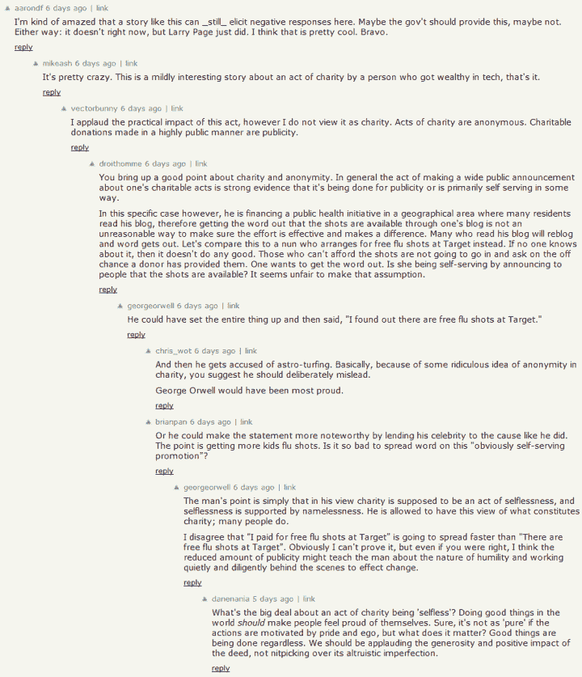
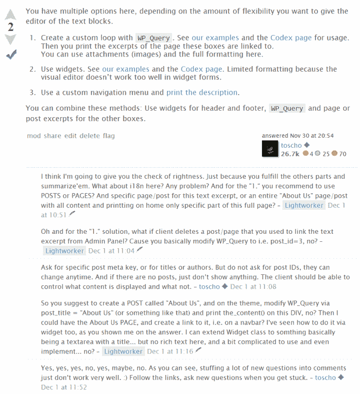
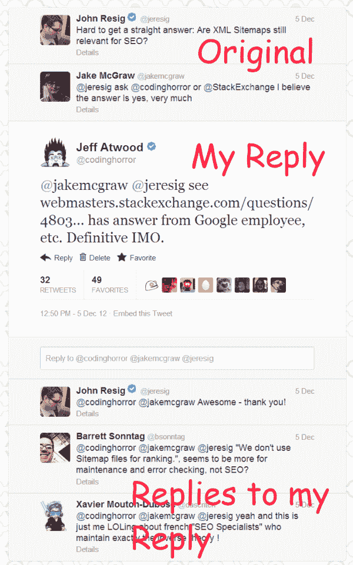

# 网络讨论:扁平化设计

> 原文：<https://blog.codinghorror.com/web-discussions-flat-by-design/?utm_source=wanqu.co&utm_campaign=Wanqu+Daily&utm_medium=website>

距离我写[讨论已经六年了:平面的还是线程的？](http://www.codinghorror.com/blog/2006/11/discussions-flat-or-threaded.html)而且，尽管从那以后网络上发生了很多变化，我对此的看法并没有根本改变。

如果有什么不同的话，我的观点在观察数据的基础上得到了加强:*极少有线程讨论模型在网络上存活*。把新闻组作为过去的遗迹和人工制品放在一边，今天在网络上很难找到任何类型的线程讨论；对于有十多年历史的网络讨论社区来说，绝大多数都是平平淡淡的。

我乐于尝试任何新事物，我的意思是，我甚至尝试过 Google Wave。但是我越是使用各种各样的线程讨论，我就越不喜欢它们。我发现宝贵的一些可取之处，而线程往往会打破讨论的关键部分，如以深入、基本、不可修复的方式阅读和回复。我还没有发现一个我可以长期忍受的线程讨论设计。

我的一部分认为这是软件达尔文主义在起作用:**线程讨论最终过于复杂，无法在公共互联网上生存**。

T3】

在线程讨论爱好者拿出他们的干草叉和火把之前，我完全承认线程的*方面*在某些特定情况下是有用的。我会说到的。我知道我可能是在浪费我的时间，但请在评论前继续阅读。理想的情况是，在评论之前阅读*整篇文章*。像帕帕一样，[我必须相信！](http://en.wikipedia.org/wiki/PaRappa_the_Rapper)

在我为线程化讨论辩护之前，让我们列举一下它带来的许多问题:

1.  **It's a tree**.

    正如乔伊斯·基尔默向我们承诺的那样，关于树的诗的确很可爱，但是用树来表示的任何种类的数据都不是。严格的等级制度通常不是人类思维的工作方式，它所强加的严格的亲子关系对于流动的人类小组讨论来说尤其可怕。浏览一棵树是复杂的，因为你必须不断地思考你处于什么水平，什么是扩展的，什么是折叠的…总是有这种隐约的存在危机*我到底在哪里？*讨论树迫使我花太多时间在精神上管理二维树，而不是潜在的讨论。

2.  **Where did that reply go?**

    在主题讨论中，回复可以在任何时间到达树中的任何位置。怎么知道有没有新回复？你在哪里找到他们的？除非你碰巧在正确的时间在正确的地点浏览了这棵树。随着时间的推移，当新帖子不断出现在大回复树中间的任何地方时，跟踪讨论是令人讨厌的。如果你不小心回复到错误的层级，上帝会帮助你的；然后你突然和错误的人交谈，或者根本没有人交谈。我绝对*杀了*可能有惊人的，有见地的回应埋在某个地方，在一个回复链的中间，我永远无法找到。

3.  **It pushes discussion off your screen**.

    所以第一条回复缩进帖子下面。够公平；不然你怎么知道一个帖子是对另一个帖子的回复？但是这个缩进游戏*永远不会结束*。回复得足够长，足够用力，你要么把内容栏缩小到不可能的程度，要么让内容退出，右移。这就是为什么没完没了的学究式回应会毁掉所有人的讨论。当我们玩“向右缩进”游戏时，每个人都输了。在网页上向下滚动*到*是很自然的，但是向右滚动*到*就完全不自然了。缩进把讨论引向了错误的方向。

4.  **You're talking to everyone.**

    你认为因为你点击了“回复”,你的帖子缩进在你回复的人下面，你的帖子只和那个人说话？太浪漫了。也许你们两个应该开个房间。一个特别的私人房间，在那个线程讨论的最右边。这种你在和另一个人交谈的错觉最终会伤害到每个人的讨论，因为这些巨大的窄树枝会不断地污染树。

    在讨论中，至少你是在和其他人说话，但实际上，你是在和任何愿意倾听的人说话。把你的回复写得像是只给一个人的，这是一个已经不存在的世界的一个古怪的产物。你在互联网上发表的每一篇公开帖子，不管有没有回复，实际上都是在和每一个会阅读它的人交谈。如果我们用于讨论的系统能够清楚地表明这一点，而不是在公共场所维持这种有害的私人谈话的借口，那将是有益的。

5.  **I just want to scroll down.**

    Reddit(在较小程度上，黑客新闻)可能是应用于大量受众的线索化评论的最著名的例子。虽然我发现 Reddit 比 Digg 过去的糟糕日子要好得多，但我仍然勉强强迫自己费力地完成那里的讨论，因为它实在是太烦人了。作为一个懒惰的读者，我觉得我已经尽了自己的责任，决定进入这个帖子；之后，我需要做的就是向下滚动或滑动。

    就拿现在 reddit 上面的[来说](http://www.reddit.com/r/pics/comments/14svrt/my_little_brother_had_an_interesting_night/)。这是一幅很酷的画。谁不想见到史蒂夫·马丁和摩根·弗里曼呢？但是上下文是什么呢？这孩子是谁？他怎么会这么幸运？为了找到答案，我需要折叠和隐藏许多随机的无意义的切线，以及对切线的回复，方法是单击每个切线旁边的小减号。所以我就是这么做的:读一点，认定正切没用没意思，点掉它。然后我到最后发现信息甚至不在题目里，或者至少我找不到。在某种程度上，我可以向下滚动来查找信息和/或娱乐。我反对的是当我阅读时，折叠和扩展主题的线程部分的卑微劳动。不管发帖子的人会怎么想，这些题外话并不那么重要，不值得让我和其他读者去做。

无论我在哪里遇到，全口径、无拘无束的线程都是讨论的可用性灾难。但是，如果我们不全心全意地致力于这种线程讨论的想法呢？

对于线程的非破坏性使用，最重要的指导是**对您允许的回复级别设置一个硬性限制**。虽然[栈交换不是一个讨论系统](http://meta.stackoverflow.com/questions/92107/is-stack-overflow-a-forum)——它实际上是一个讨论系统的*对立面，我们必须一直向人们解释——本质上，我们确实允许一个级别的线程。有问题和答案，是的，但是在每一个下面，用较小的字体，是评论。*

[T2】](http://wordpress.stackexchange.com/questions/74519/how-to-create-editable-blocks-of-text-for-the-homepage)

现在这里有一堆核心的社会学讨论，我不想进入，比如不同的评论规则，评论的特殊限制，默认情况下只显示前 n 个评论，等等。重要的是我们允许**一个级别的回复，仅此而已**。想要回复评论吗？可以，但是会在一个水平上。你不能再深入了。这是被设计的，但是记住:*栈交换不是一个讨论系统*。这是一个问答系统。如果你建立一个像讨论系统一样的系统，它将会变成雅虎问答，或者更糟，Quora。开个玩笑。[你真棒](http://www.quora.com/What-did-Jesus-farts-probably-smell-like)。

如果黑客新闻限制了回复级别，它会是一个更好的讨论场所吗？Reddit 会吗？从我作为一个可怜的、苦恼的读者和偶尔的参与者的角度来看，绝对是这样。线程讨论有许多长期存在的问题，但是限制回复深度是朝着正确方向迈出一大步的最简单的方法。

另一个想法是让帖子自带上下文。这是 Twitter 的一个特点，这家公司总是做错每一件事，但还是成功了，这一点从一开始就令人震惊。当我查看我的一条推文时，它应该是独立的。但是它也可以根据需要带来一些上下文:

[T2】](https://twitter.com/codinghorror/status/276413253209448449)

在这里，您可以看到如何通过直接链接或点击来扩展我的推文，以显示对话的必要背景。但它只会显示三个层次:帖子、我对帖子的回复和对我帖子的回复。这种认为推文——以及对话——应该基本独立的想法并没有被很好地理解，但它说明了 Twitter 如何从根本上正确地获得了*最初的概念*。我猜这就是为什么他们可以逃脱可怕的死刑。

我相信**有选择地、明智地使用线程**是*能够*进行讨论的唯一方式。您应该警惕将线程作为人类讨论的通用解决方案。相反，总是喜欢简单、平淡的讨论。

| 【广告】你是怎么炫耀你的牛逼的？创建一个 [Stack Overflow 职业简介](http://careers.stackoverflow.com/cv)，展示你在 Stack Overflow、Github 和几乎所有其他编码网站上的辛勤工作。谁知道呢，你甚至可能被一个很棒的[新职位](http://careers.stackoverflow.com/jobs)录用！ |

