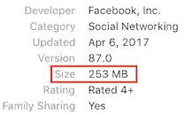
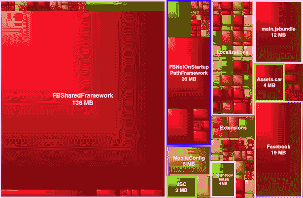
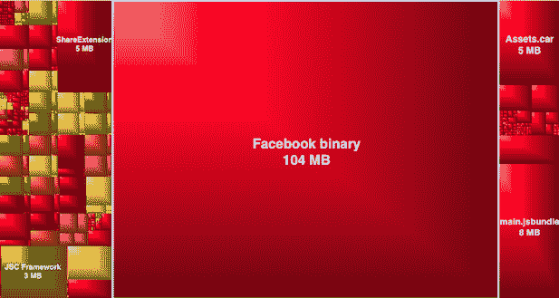
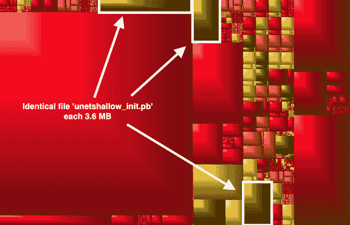
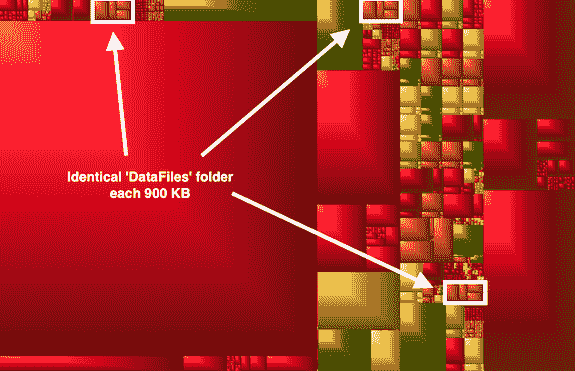
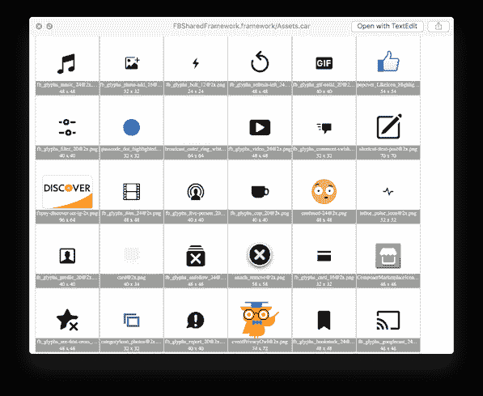

# iOS 版 Facebook.app 分析[v. 87.0]

> 原文：<https://blog.timac.org/2017/0410-analysis-of-the-facebook-app-for-ios-v-87-0/?utm_source=wanqu.co&utm_campaign=Wanqu+Daily&utm_medium=website>

在这篇文章中，我分析了 iOS 版 Facebook.app 的 87.0 版本。

6 个月前我分析了 iOS 版 Facebook.app 的 66.0 版本:[https://blog . timac . org/2016/1018-analysis-of-the-Facebook-app-for-iOS](https://blog.timac.org/2016/1018-analysis-of-the-facebook-app-for-ios)

66.0 版本是 iPad Air 2 (64 位)上的一个 165 MB 的应用程序。这是一个单片应用程序，其主要二进制文件超过 100 MB。

87.0 版本现已推出:在只有 64 位代码的同一台 iPad Air 2 上有 253 MB。仅仅 6 个月，Facebook.app 的大小就增长了 88 MB！

让我们看看发生了什么变化…

# 应用程序内容

使用 [GrandPerspective](http://grandperspectiv.sourceforge.net) 查看 87.0 版本的应用程序内容可以提供一个很好的概述:

[T2】](GrandPerspective.png)

下面是 66.0 版本的内容: 

正如你所看到的，Facebook.app 已经完全重组了:

*   主二进制文件现在只有 19 MB
*   有一个巨大的 136 MB 框架`FBSharedFramework`
*   还有一个 26 MB 的框架叫做`FBNotOnStartupPathFramework`
*   …

# 重复资源

应用程序规模增长的原因之一是由于应用程序中相同资源的多个副本。

### unetshallow_init.pb

实际上，您可以在之前的截图中看到同一文件的 3 个副本`unetshallow_init.pb`:

*   Facebook . app/Frameworks/fbnotonstartuppathframirect . framework/optical flow _ resource/unetshallow _ init . Pb
*   Facebook . app/Frameworks/fbsharedframework . framework/optical flow _ resource/unetshallow _ init . Pb
*   Facebook.app/opticalflow_resource/unetshallow_init.pb

[T2】](unetshallow_init.png)

仅保留一个副本将节省 7.2 MB。

### 数据文件

同样，数据文件文件夹出现了 3 次。保留一份副本可以节省大约 2 MB:

*   Facebook.app/DataFiles/
*   Facebook . app/framework/fbnotonstartuppathframirect . framework/data files/
*   Facebook . app/Frameworks/fbsharedframework . framework/data files/

[T2】](DataFiles.png)

### FBFacecastTipJarResources

一些名为`FBFacecastTipJarResources`的资源在应用中出现重复不下 6 次！`FBFacecastTipJarResources`资源在磁盘上只占 150 KB，但 6 次就占了 900 KB。

一个例子:

*   Facebook.app/FBFacecastTipJarResources/sent.m4a
*   Facebook . app/Frameworks/fbnotonstartuppathframirect . framework/FBFacecastTipJarResources/sent . m4a
*   Facebook . app/framework/fbnotonstartuppathframirect . framework/sent . m4a
*   Facebook . app/Frameworks/fbsharedframework . framework/FBFacecastTipJarResources/sent . m4a
*   Facebook . app/Frameworks/fbsharedframework . framework/sent . m4a
*   Facebook.app/sent.m4a

### 其他重复资源

还有许多其他重复的资源，其中包括:

*   modelMetaData.bin: 4 x 1 MB
*   schemaMetaData.bin: 4 x 830 KB
*   fbcommunicationsoundkit . bundle:3 x 741 KB
*   MNSounds.bundle: 3 x 528 KB
*   FBSoundControllerResources:3 x 500 KB
*   relayshema . JSON:3x319 kb
*   libPhoneNumber.bundle: 3 x 172 KB
*   CACerts.plist: 3 x 168 KB
*   FBFacecastBroadcastKitResources:3 x 98 KB
*   蒙特塞拉特岛-SemiBold.ttf: 3 x 70 KB
*   reactmobileconfigmetadata . JSON:3 x 33 KB
*   fbentitymodule 资源:3 x 33 KB
*   [add-photo@2x.jpg](mailto:add-photo@2x.jpg):3x 29kb
*   fbfacecastwitchitritorresources:3x320kb
*   fbnativearticleengagementactions 资源:3 x 20 KB
*   FBFeedbackReactionsKitResources:3 x 12 KB

这些列出的资源总计 15.5 MB。通过删除重复的资源，您至少可以节省 10 MB。

# 复制的图像

Facebook.app 包含 3 个 assets.car 文件:

*   Facebook.app/Assets.car: 11.3 MB 用于 2267 个项目
*   Facebook . app/Frameworks/fbnotonstartuppathframirect . framework/assets . car:10.3 MB，2126 个项目
*   Facebook . app/Frameworks/fbsharedframework . framework/assets . car:9.5 MB 用于 1972 个项目

[T2】](assets.png)

FBSharedFramework 中的所有 1972 年的图像都在 main Assets.car 中，并且也是 fbnotonstartuppathframirect assets . car 的一部分。因此有 3 次相同的 1972 年图像，占用 3 x 9.5 MB = 28.5 MB。

保存一套 1972 年的图片可以节省 19 MB。

main Assets.car (2267 - 1972 = 295)和 fbnotonstartuppathframirect assets . car(2126-1972 = 154)中的其余图像是唯一的。

# 新本地化

Facebook.app 增加了 5 个新的本地化版本，应用大小增加了 4.2 MB:

*   hi.lproj (1.3 MB)
*   hr.lproj (692 KB)
*   hu.lproj (750 KB)
*   ro.lproj (709 KB)
*   sk.lproj (713 KB)

另外，每个本地化版本都有一个名为`AdsCountriesConfig.json`的新的 12 KB 文件。这增加了 336 KB。

# 不要使用，否则你会被解雇

当分析 66.0 版本时，我完全错过了一些有趣的 Objective-C 接口、协议和方法:

> @ protocol fbdeprecatedapmodule _ DO _ NOT _ USE _ OR _ YOU _ WILL _ BE _ FIRED

> @ protocol fbloginfofacilitatingappmodule<fbdeprecatedappmodule_do_not_use_or_you_will_be_fired></fbdeprecatedappmodule_do_not_use_or_you_will_be_fired>

> @ interface fbtimeline module:FBNativeAppModule _ DO _ NOT _ USE _ OR _ YOU _ WILL _ BE _ FIRED

> @ interface FBNotificationsModule:FBNativeAppModule _ DO _ NOT _ USE _ OR _ YOU _ WILL _ BE _ FIRED

> @ interface FBProductionLockoutModule:FBNativeAppModule _ DO _ NOT _ USE _ OR _ YOU _ WILL _ BE _ FIRED

> @ interface FBSearchModule:FBNativeAppModule _ DO _ NOT _ USE _ OR _ YOU _ WILL _ BE _ FIRED

> …

# __RODATA 段

尽管主二进制文件比应用审查限制要小得多，Facebook.app 仍然使用一个包含通常在`__TEXT`段中找到的部分的`__RODATA`段。关于它的更多信息，请查看之前的帖子[https://blog . timac . org/2016/1018-analysis-of-the-Facebook-app-for-IOs](https://blog.timac.org/2016/1018-analysis-of-the-facebook-app-for-ios)。

# 结论

在 66.0 版和 87.0 版之间，Facebook.app 进行了彻底的重组。主要的——也是唯一的——二进制文件被分成了几个框架。

但是，在此过程中，似乎有一些资源出现了不必要的重复:

*   opticalflow_resource: 3 x 3.6 MB
*   数据文件:3 x 1 MB
*   图像:3 x 9.5 MB
*   FBFacecastTipJarResources:750 KB
*   其他重复资源:15.5 MB

删除重复的资源将至少节省 40 MB。这部分解释了为什么应用程序大小增加了 90 MB。

**更新 15 . 04 . 2017:**[iOS 版 Facebook . app【v . 88.0】清理重复](https://blog.timac.org/2017/0415-facebook-app-for-ios-v-88-0-cleans-up-duplicates)