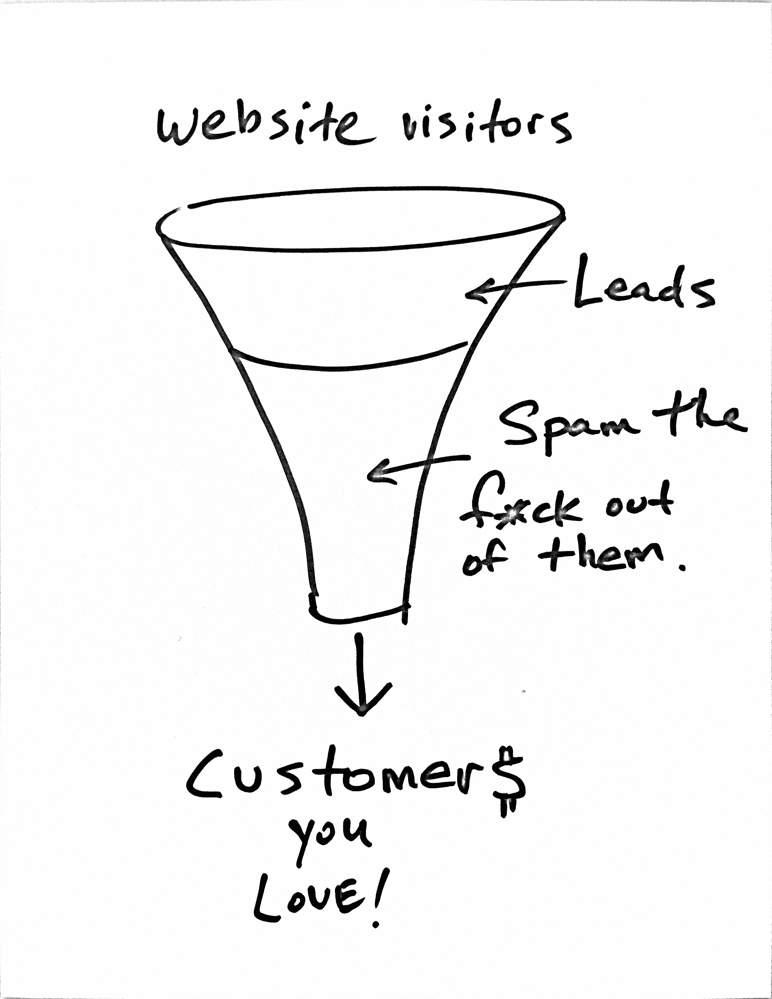
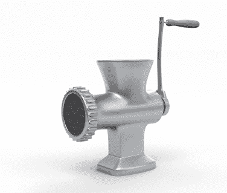
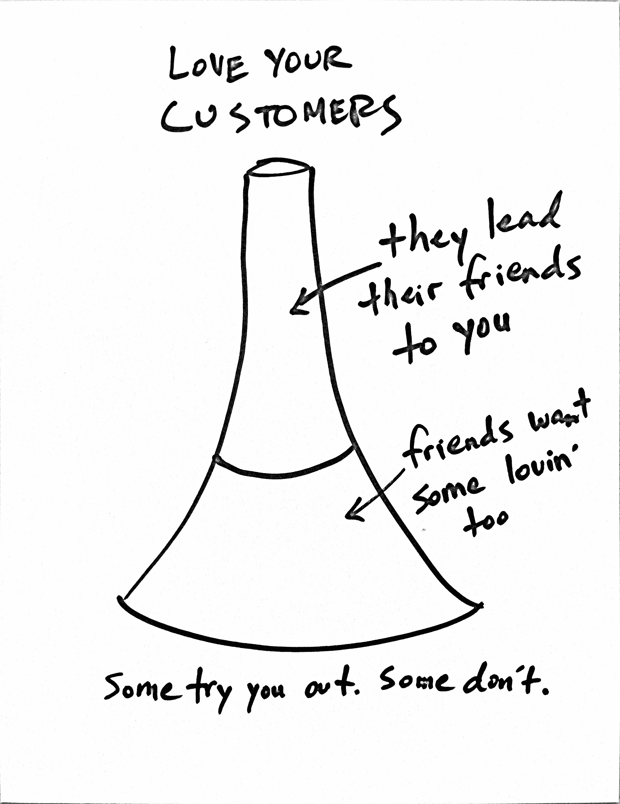
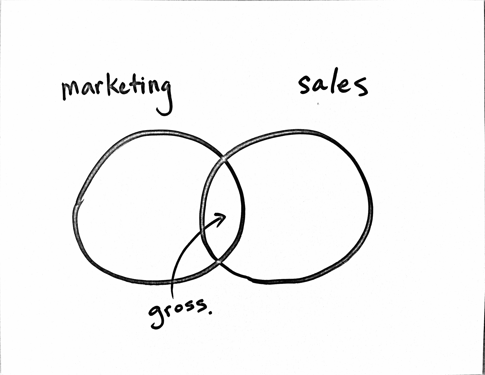
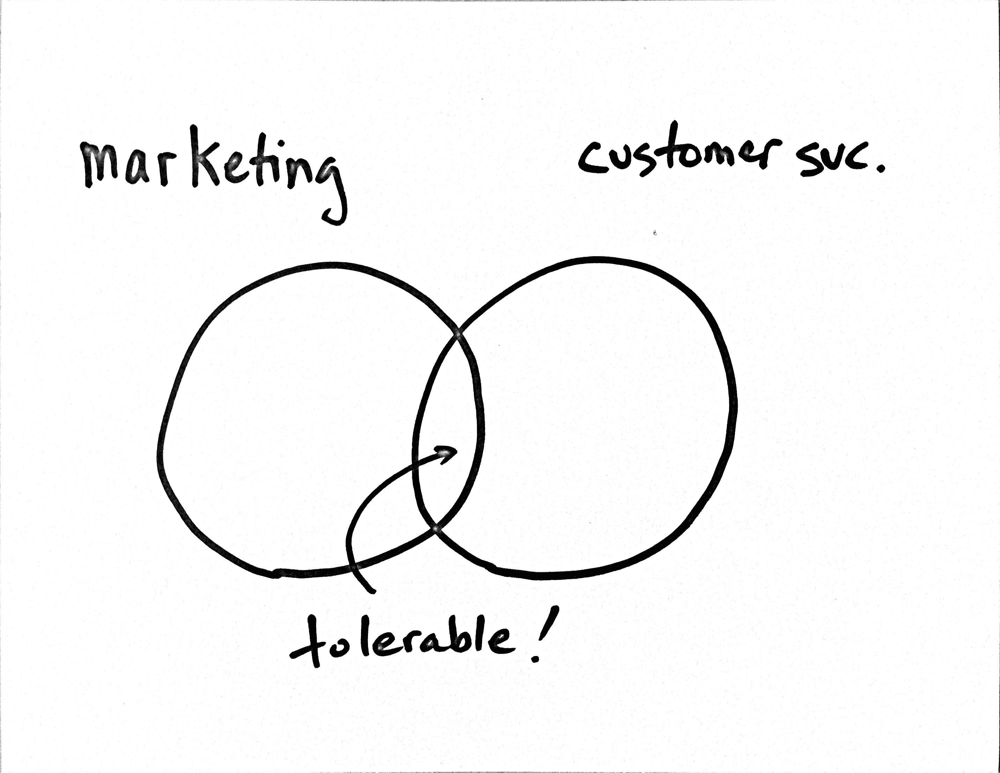

# 为什么我讨厌漏斗。

> 原文：<https://tinyletter.com/ben/letters/why-i-hate-funnels?utm_source=wanqu.co&utm_campaign=Wanqu+Daily&utm_medium=website>

我创建了一个在全球拥有 300 多万用户的电子邮件营销服务，这有点可笑，但我从来不觉得称自己为“电子邮件营销者”是件舒服的事，更不用说成为电子邮件营销社区的一员了。部分原因是我在大学时差点没通过市场营销 101 课程(不要告诉任何人)。但主要是因为我讨厌漏斗。而专业营销人员就是不肯闭嘴谈论那些被上帝抛弃的东西。你知道我说的漏斗吗？他们总是这个样子:

 T3】

这个想法是，你需要大量的网站访客，然后他们中的一些人会成为潜在客户，然后在你做了一些事情(通常的建议是用营销自动化轰炸潜在客户)之后，他们会变得宽容并付给你钱，从而成为“客户”

我讨厌这样，因为这是短视的。当然，如果你在一家目光短浅的公司工作(他们正争先恐后地寻找出路，或者过着季度与季度的生活)，这个漏斗可能很重要。但如果你是那种考虑更长远的人，这个漏斗看起来更像这样:

我认识的一个人最近在广播中听到了我们的一个广告(在这个广告中，我们讨论了猫的帽子)，他问我在营销方面的逻辑和方法是什么(我知道这是朋友说“伙计，你在想什么呢？”).这让我想起了那个漏斗。我告诉他我只是拿起漏斗，把它倒过来:

那里。这样看起来不是更稳定吗？这种方法尤其适用于早期企业。创业的时候，没有营销的预算。你可能也没有时间或者天赋。你唯一拥有的就是你的激情。那种该死的、制造麻烦的激情最初诱使你开始创业。带着这种激情，把它指向你的客户。提供出色的客户服务。取悦他们。[授权给他们](http://blog.mailchimp.com/scaling-support-for-2-million-users/)。当我说“授权给他们”的时候，我的意思是授权给他们*免费*，没有任何附加条件因为当公司让人们注册并下载他们的内容时，我们都知道他们正要把我们喂进自动化绞肉机。

我告诉我的朋友，我们在早期发现了这种“倒漏斗”方法，但从未真正摆脱它(因为它很有效)。当你看到我们的[奇怪的广告牌](http://blog.mailchimp.com/the-story-behind-the-mailchimp-billboards/)甚至没有说出我们的名字，或者当你看到我们随意的“[击掌](http://blog.janineholsinger.com/the-importance-of-customer-happiness/)”衬衫、[搪胶玩具](http://designlab.mailchimp.com/freddie-in-toyland/)，或者听到可笑的广播广告，只要知道他们藐视逻辑，因为他们是为我们现有的客户。我们不去寻找新的线索，更不用说转换或他们在营销 101 中教你的任何东西。我们要去找*客服*。顺便说一句，这能引出线索。

我想这种方法和哲学也延伸到了 MailChimp。我们在电子邮件行业的同事似乎正在为营销和销售重叠的地方做准备:

如果你问我，这比给猫戴的帽子更不合逻辑。我可以理解建立一些*功能*，帮助人们获得线索或发送自动消息(MailChimp 有一些这样的功能)。但那是短期战术。如果那是你的*核心产品*，你基本上只是在吸引那些有短期目标的客户。呀。看起来你唯一的希望就是快速离开。也许 Salesforce 会收购你([现在不太可能](http://www.salesforce.com/company/news-press/press-releases/2013/06/130604.jsp))或者他们的竞争对手甲骨文(话说回来，[也许不会](http://www.eloqua.com/lp/oracle.html))。或者你可以试着继续用一个[倒置的模型](http://blog.asmartbear.com/unprofitable-saas-business-model.html)并且希望没有人注意到。我知道什么？我又一次差点在营销 101 失败。

在过去的 12 年里，我们一直在构建 MailChimp，并牢记这一点:

与其他公司的运营方式相比，我们似乎有一种非常奇怪的方法。我甚至对警告新员工“这里的事情真的很奇怪，需要一些时间来适应”感到内疚。但是我越是环顾四周，就越觉得这是最正常、最人性化、最可持续的经营方式。

相关并强烈推荐:

一点自我营销:

一个朋友请我谈谈“创造性环境”这是给一群青年事工专业人士的，对我来说，这是一个非常不同的观众，所以我抓住了这个机会。如果你有几分钟时间，并且你关心我对工作中创造力的看法，

[here you go](http://www.youtube.com/watch?v=h8U8dSwi7PQ)

(可以忍受)。